# Chain Replication

Chain replication represents an elegant alternative to traditional primary-backup replication that provides strong consistency guarantees while offering unique performance characteristics. First introduced by Renesse and Schneider in 2004, chain replication organizes replicas in a linear chain where writes flow from head to tail and reads are served from the tail. This seemingly simple reorganization yields surprising benefits for consistency, fault tolerance, and read performance.

## The Chain Replication Protocol

The fundamental insight behind chain replication is that by organizing replicas in a chain and carefully controlling where reads and writes occur, we can achieve linearizability without the coordination overhead of traditional quorum-based approaches.

### Architecture and Roles

In chain replication, replicas are organized in a totally ordered sequence:

**Head:** The first replica in the chain. Receives all write requests from clients.

**Tail:** The last replica in the chain. Receives all read requests from clients.

**Middle replicas:** Internal nodes that forward updates down the chain.

### Write Protocol

When a client initiates a write, the protocol proceeds as follows:

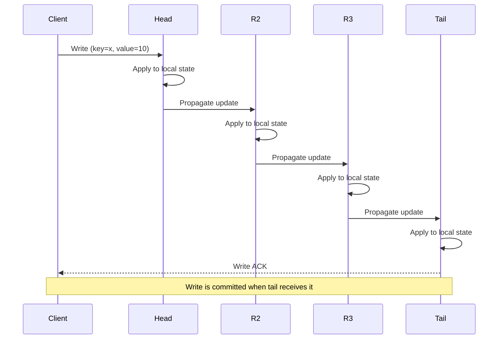

1. **Client sends write to head**
2. **Head applies write** to its local state and assigns a sequence number
3. **Head forwards update** to the next replica in chain
4. **Each replica** applies the update and forwards to the next
5. **Tail applies update** and acknowledges to the client

The critical property is that writes are not acknowledged until they reach the tail, ensuring all replicas have the update before clients are notified.

### Read Protocol

Reads are dramatically simpler than in traditional replication:

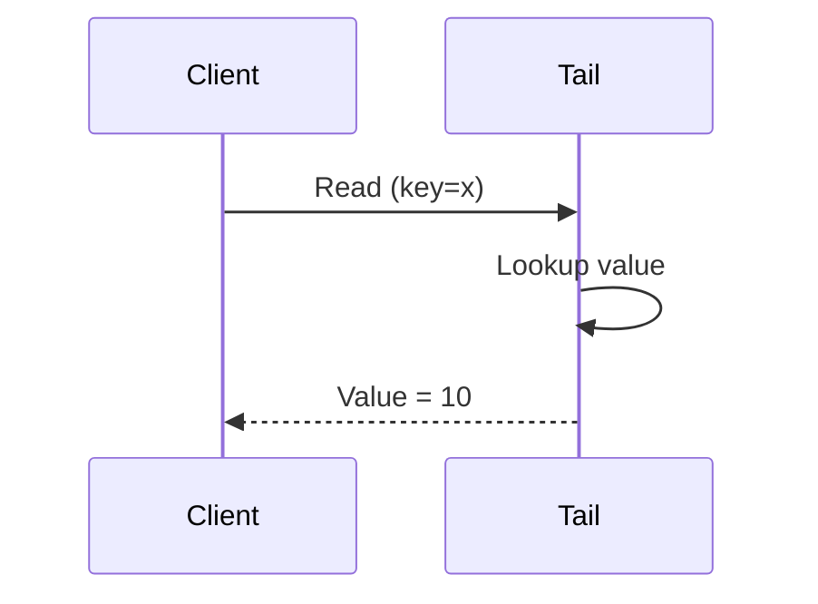

**All reads go to the tail.** Since the tail only receives updates after all preceding replicas in the chain, reading from the tail guarantees you see all committed writes. This provides linearizability without any read-time coordination.

### Why This Works: Linearizability Proof Sketch

Chain replication achieves linearizability through a clever invariant:

**Invariant:** The tail contains all and only the committed writes, in order.

**Why writes are linearizable:** A write is not acknowledged to the client until the tail receives it. Once acknowledged, the tail has the write, so all subsequent reads will see it. Writes propagate in order down the chain, so the tail sees them in the order they were initiated at the head.

**Why reads are linearizable:** Every read sees the tail's state, which by the invariant contains all committed writes. Since reads go to one replica (tail) and writes are ordered, the system behaves as if there's a single copy.

The linearizability condition is satisfied:

$$
\forall \text{ ops } op_1, op_2: \text{ if } op_1 \text{ completes before } op_2 \text{ starts, then } op_1 \prec op_2 \text{ in the order}
$$

## Performance Characteristics

Chain replication makes specific tradeoffs that differ from traditional primary-backup:

### Write Latency

Write latency is the sum of latencies across the entire chain:

$$
\text{Latency}_{\text{write}} = \sum_{i=1}^{n} (\text{Process}_i + \text{Network}_{i \to i+1})
$$

For a chain of $n$ replicas, this is approximately:

$$
\text{Latency}_{\text{write}} \approx n \times (\text{Latency}_{\text{process}} + \text{Latency}_{\text{network}})
$$

This is **higher** than primary-backup with asynchronous replication (which only waits for the primary) but similar to synchronous replication to all replicas.

However, if replicas are pipelined—where the head forwards to replica 2 while replica 2 forwards the previous write to replica 3—the latency can be reduced to:

$$
\text{Latency}_{\text{write}} \approx \text{max}(\text{Network}_{\text{chain}}) + n \times \text{Latency}_{\text{process}}
$$

### Write Throughput

Write throughput is limited by the slowest link in the chain. If all replicas have similar performance:

$$
\text{Throughput}_{\text{write}} \approx \frac{\text{Bandwidth}_{\text{min}}}{\text{Write Size}}
$$

The head can pipeline multiple writes, allowing high throughput despite sequential propagation.

### Read Performance

Chain replication's killer feature is read performance:

**All reads go to a single node (tail),** which means:
- No quorum reads required
- No read repair needed
- Consistent reads with zero coordination

However, the tail becomes a bottleneck. If read traffic exceeds the tail's capacity, the system cannot scale reads by adding more replicas (unlike primary-backup where any replica can serve reads).

Read throughput is bounded by:

$$
\text{Throughput}_{\text{read}} = \text{Capacity}_{\text{tail}}
$$

## Fault Tolerance and Recovery

Chain replication's linear structure simplifies failure handling compared to quorum-based systems, but requires careful protocols to maintain consistency.

### Head Failure

If the head fails, the next replica in the chain becomes the new head:

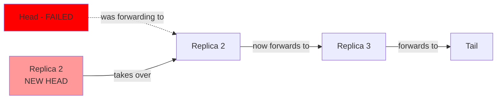

**Recovery steps:**
1. Detect head failure (via heartbeat)
2. Promote next replica to head
3. Update clients to send writes to new head

**Consistency impact:** No data loss occurs because the old head only acknowledged writes after forwarding them. Any writes in-flight at the old head are lost, but clients weren't notified of success, so they can retry.

### Tail Failure

If the tail fails, the previous replica becomes the new tail:

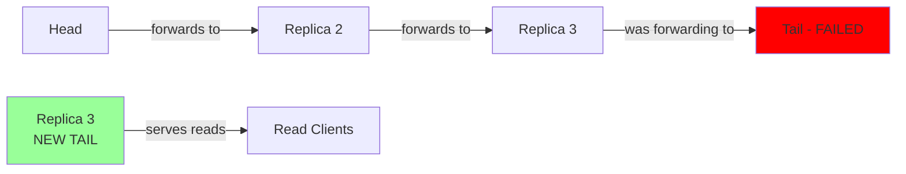

**Recovery steps:**
1. Detect tail failure
2. Promote previous replica to tail
3. Update clients to send reads to new tail
4. New tail begins acknowledging writes

**Consistency impact:** The new tail has all committed writes (by the chain invariant), so reads remain consistent. Writes in-flight may need to be re-acknowledged by the new tail.

### Middle Replica Failure

Middle replica failures are the simplest to handle—just remove the failed replica from the chain:

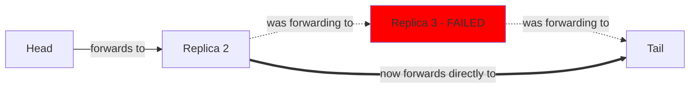

**Recovery steps:**
1. Detect failure of replica $i$
2. Configure replica $i-1$ to forward to replica $i+1$
3. Remove failed replica from chain

The chain continues operating with one fewer replica. Consistency is maintained because updates still flow in order from head to tail.

### Adding New Replicas

To increase fault tolerance or restore the replication factor after failures:

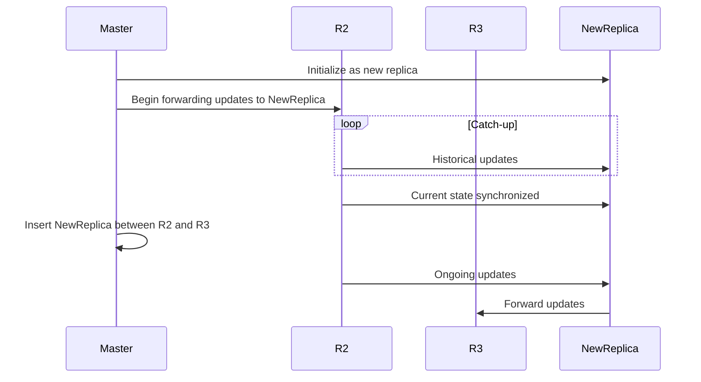

The challenge is synchronizing the new replica without blocking ongoing operations. The typical approach is to have the new replica catch up on historical updates while new updates continue flowing through the existing chain, then splice it in atomically once caught up.

## CRAQ: Chain Replication with Apportioned Queries

CRAQ (Chain Replication with Apportioned Queries) extends chain replication to distribute read load across all replicas while maintaining strong consistency. It was introduced by Jeff Terrace and Michael Freedman in 2009.

### The Core Innovation

CRAQ's key insight is that while only the tail knows which writes are committed, other replicas can answer reads if they can determine the current committed state.

### Architecture

Each replica maintains:
- **Clean objects:** Objects where the replica's version matches the committed version
- **Dirty objects:** Objects where the replica has a newer version not yet committed

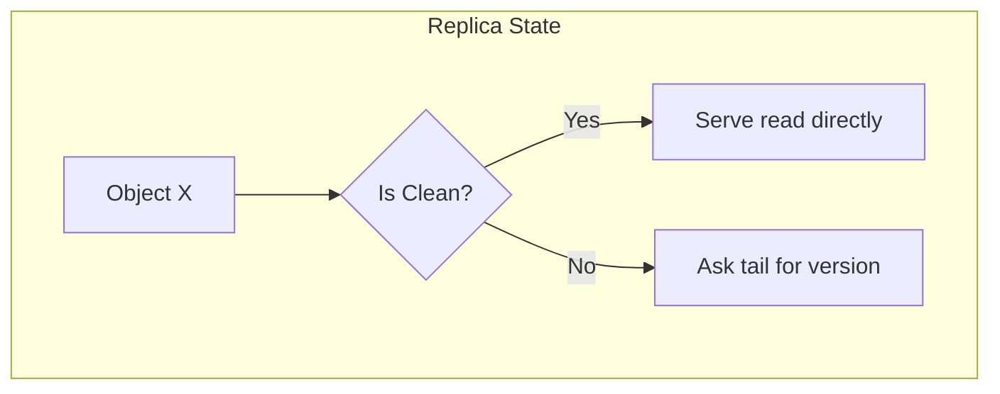

### CRAQ Write Protocol

Writes propagate down the chain as in standard chain replication, but with version numbers:

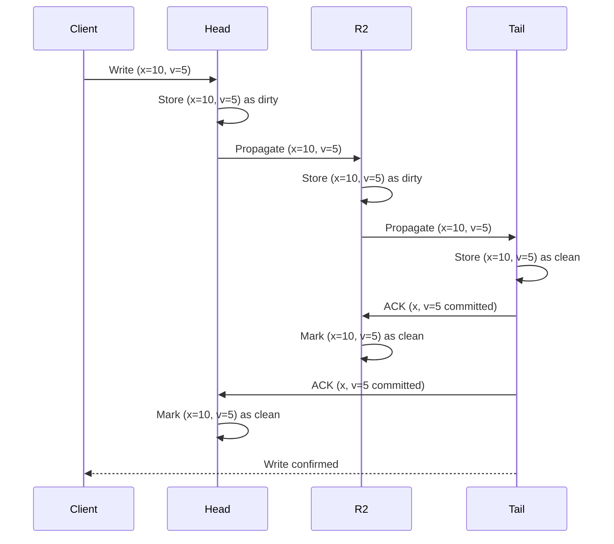

Once the tail receives an update, it marks it as clean and sends acknowledgments back up the chain, allowing each replica to mark its version as clean.

### CRAQ Read Protocol

Reads can go to any replica:

**Case 1: Object is clean**
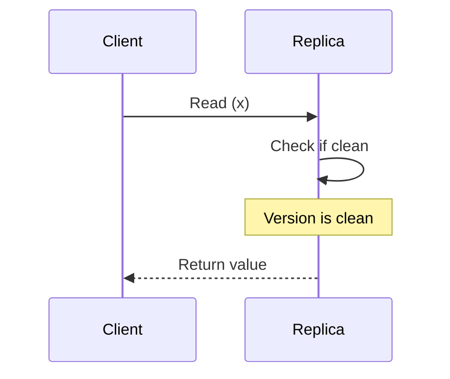

The replica returns the value immediately.

**Case 2: Object is dirty**
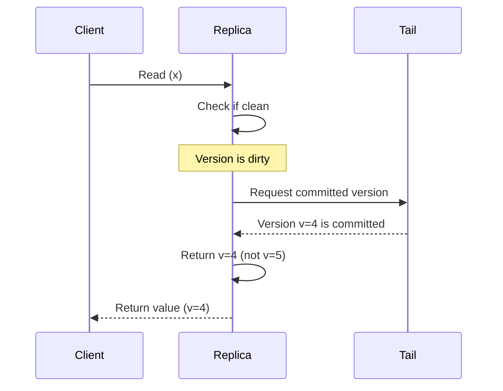

If the object is dirty, the replica asks the tail which version is committed and returns that version.

### Performance Benefits

CRAQ distributes read load across all replicas:

$$
\text{Throughput}_{\text{read}} = n \times \text{Capacity}_{\text{replica}}
$$

For $n$ replicas, this is $n$ times better than standard chain replication.

The key is that most objects are clean most of the time (assuming writes are distributed across keys). Only objects currently being written are dirty, so the vast majority of reads are served without contacting the tail.

### Strong Consistency Guarantee

CRAQ maintains linearizability:
- If a replica has only clean versions, it's guaranteed to be committed
- If dirty, asking the tail ensures we return the latest committed version
- The tail always has the authoritative committed state

This allows reads to be distributed while maintaining the same consistency guarantees as standard chain replication.

## Comparison: Chain Replication vs Primary-Backup

| Aspect | Chain Replication | Primary-Backup |
|--------|------------------|----------------|
| **Write Latency** | Higher (sequential propagation) | Lower (parallel with async) |
| **Read Latency** | Lower (single replica, no quorum) | Variable (may need quorum) |
| **Read Throughput** | Limited to tail (CRAQ improves this) | Scales with replicas |
| **Write Throughput** | Limited by chain bandwidth | Limited by primary |
| **Consistency** | Linearizable by design | Requires careful configuration |
| **Failure Handling** | Simple topology updates | Complex failover protocols |
| **Load Balancing** | Reads concentrated (unless CRAQ) | Reads distributed naturally |

## Use Cases and Applications

Chain replication excels in specific scenarios:

### Strong Consistency Requirements

When linearizability is mandatory (financial systems, inventory, distributed locks), chain replication provides it by design without complex quorum protocols.

### Read-Heavy Workloads with CRAQ

CRAQ's ability to distribute reads while maintaining strong consistency makes it ideal for:
- Metadata stores (where consistency is critical but reads dominate)
- Configuration services (Coordination services like ZooKeeper-style systems)
- Session stores (where consistency matters but reads are frequent)

### Geo-Distributed Systems

Chain replication can be organized geographically:

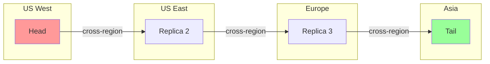

Writes from the US West region have low latency to the head, while reads from Asia have low latency to the tail. This works well when write and read patterns have geographic locality.

## Implementation Considerations

### Chain Configuration Management

Maintaining the chain configuration requires a strongly consistent coordination service. Most implementations use:
- **ZooKeeper** to store chain configuration
- **Raft/Paxos** based coordination services
- **Consul** for service discovery and configuration

The chain master monitors replica health and reconfigures the chain upon failures.

### Handling Network Partitions

Network partitions create challenging scenarios:
- If the head is partitioned from the rest of the chain, writes fail but reads continue
- If the tail is partitioned, reads fail but writes can continue (with CRAQ, they're not acknowledged)
- Middle partitions are detected and the chain is reconfigured

### Optimizations

**Pipelining:** Allow multiple writes in flight simultaneously to improve throughput despite sequential propagation.

**Batching:** Batch multiple small writes together to reduce per-write overhead.

**Multi-chain partitioning:** Partition data across multiple independent chains to increase write throughput.

Chain replication represents a thoughtful alternative to traditional replication that trades write latency for simpler consistency guarantees and improved read performance in many scenarios. CRAQ's extension demonstrates how the basic architecture can be adapted to distribute read load while preserving strong consistency—a combination that's difficult to achieve with other replication approaches.
