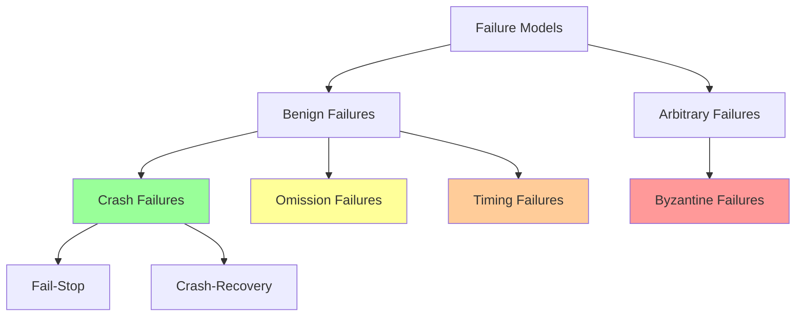
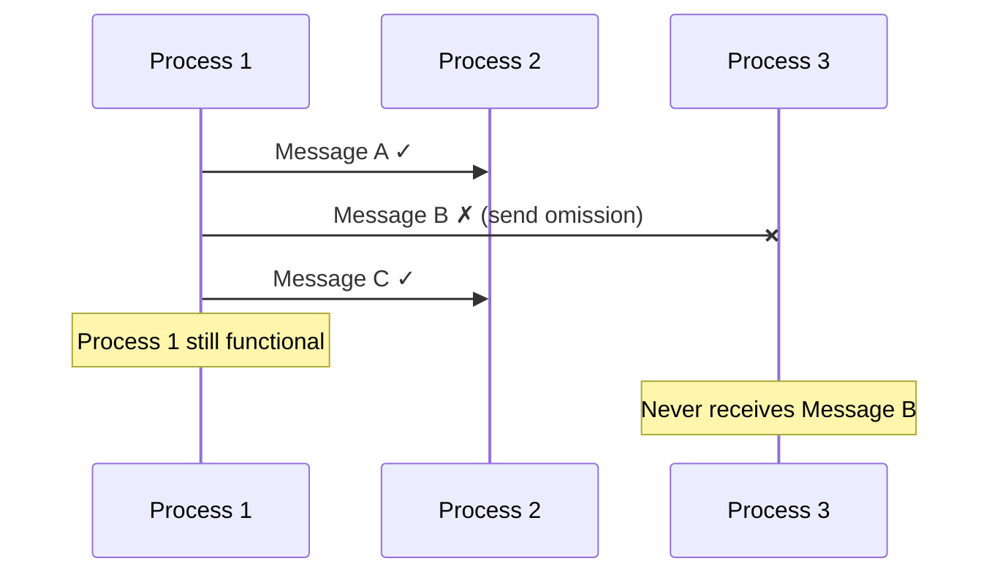
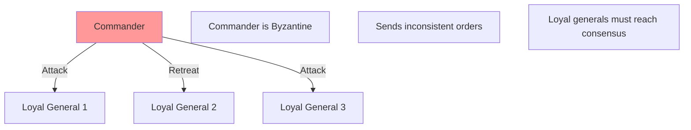
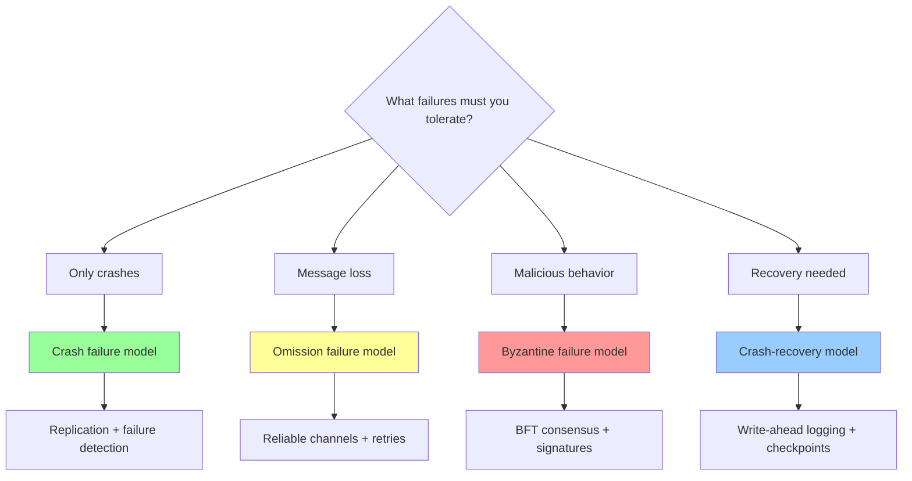

# Failure Models

In distributed systems, failures are not exceptional events—they are the norm. Understanding different types of failures and how to classify them is fundamental to designing robust distributed systems. Failure models provide a taxonomy that helps us reason about system behavior under different fault conditions and design appropriate fault-tolerance mechanisms.

## Why Failure Models Matter

Failure models serve several critical purposes in distributed system design:

1. **Specify system assumptions:** What kinds of failures must the system tolerate?
2. **Guide design decisions:** Different failures require different tolerance mechanisms
3. **Enable formal reasoning:** Prove correctness under specific failure assumptions
4. **Set performance bounds:** Stronger failure models require more overhead

The hierarchy of failure models ranges from the mildest (crash failures) to the most severe (Byzantine failures), with each model encompassing all less severe failures.



## Crash Failures

Crash failures are the simplest and most common failure model. A process that crashes stops executing and never recovers.

### Definition

A process experiences a **crash failure** when:
1. It stops executing all operations
2. It never recovers or resumes operation
3. All state is permanently lost

Once a process crashes, it ceases to participate in the distributed system entirely.

### Characteristics

**Detectability:** Crash failures can theoretically be detected, though in practice this is difficult due to network delays and partitions. The challenge is distinguishing between a crashed process and a very slow one.

**Simplicity:** Crash failures are "clean" in that the process doesn't produce incorrect outputs or corrupt messages. It simply stops.

**Permanence:** Unlike crash-recovery failures, crash failures are permanent. The process never comes back.

### Example Scenarios

```javascript
// Process crashes during write operation
class Database {
  async write(key, value) {
    await this.updateIndex(key);
    // Process crashes here - value never written!
    await this.writeValue(key, value);
  }
}

// Message lost due to sender crash
async function sendMessage(destination, message) {
  const serialized = JSON.stringify(message);
  // Process crashes before sending
  await network.send(destination, serialized);
}
```

### Real-World Causes

- **Hardware failure:** Power loss, disk crash, network card failure
- **Software crash:** Segmentation fault, out-of-memory, uncaught exception
- **Operating system failure:** Kernel panic, blue screen
- **External events:** Data center power outage, network switch failure

### Tolerance Mechanisms

Crash failures are typically handled through:

**Replication:**
```javascript
// Primary-backup replication tolerates primary crash
class ReplicatedService {
  constructor(replicas) {
    this.primary = replicas[0];
    this.backups = replicas.slice(1);
  }

  async request(operation) {
    try {
      return await this.primary.execute(operation);
    } catch (CrashError) {
      // Primary crashed, promote backup
      this.primary = this.backups[0];
      this.backups = this.backups.slice(1);
      return await this.primary.execute(operation);
    }
  }
}
```

**Heartbeats and failure detection:**
```javascript
class HeartbeatMonitor {
  constructor(process, timeout = 5000) {
    this.process = process;
    this.timeout = timeout;
    this.lastHeartbeat = Date.now();
  }

  async monitor() {
    setInterval(async () => {
      try {
        await this.process.ping();
        this.lastHeartbeat = Date.now();
      } catch (error) {
        if (Date.now() - this.lastHeartbeat > this.timeout) {
          this.handleCrash();
        }
      }
    }, 1000);
  }

  handleCrash() {
    console.log('Process crashed - initiating failover');
    // Promote backup, reconfigure system, etc.
  }
}
```

## Fail-Stop Model

The fail-stop model is a refinement of crash failures with stronger detectability guarantees.

### Definition

A process is **fail-stop** if:
1. When it fails, it crashes (stops all processing)
2. Other processes can **reliably detect** the failure
3. The failure is detected within bounded time

The key difference from simple crash failures is the guaranteed detectability.

### Theoretical Properties

In the fail-stop model, we can build perfect failure detectors:

$$
\forall \text{ process } p: \text{crashed}(p) \implies \text{eventually detected as crashed}
$$

$$
\forall \text{ process } p: \neg\text{crashed}(p) \implies \text{never detected as crashed}
$$

These properties are:
- **Completeness:** Every crashed process is eventually detected
- **Accuracy:** No correct process is suspected

### Implementation Challenges

True fail-stop is impossible to achieve in asynchronous networks due to the impossibility of distinguishing crashes from network delays. However, we can approximate it:

```javascript
class FailStopDetector {
  constructor(processes, heartbeatInterval = 1000, failureThreshold = 5) {
    this.processes = processes;
    this.heartbeatInterval = heartbeatInterval;
    this.failureThreshold = failureThreshold;
    this.missedHeartbeats = new Map();
  }

  async start() {
    for (const process of this.processes) {
      this.missedHeartbeats.set(process.id, 0);
      this.monitorProcess(process);
    }
  }

  async monitorProcess(process) {
    setInterval(async () => {
      try {
        await process.heartbeat();
        this.missedHeartbeats.set(process.id, 0);
      } catch (error) {
        const missed = this.missedHeartbeats.get(process.id) + 1;
        this.missedHeartbeats.set(process.id, missed);

        if (missed >= this.failureThreshold) {
          this.declareFailStop(process);
        }
      }
    }, this.heartbeatInterval);
  }

  declareFailStop(process) {
    // With high confidence, process has crashed
    this.onFailure(process);
  }
}
```

### Use in Consensus Protocols

Many consensus algorithms assume fail-stop for simplicity. For example, Paxos and Raft work under fail-stop assumptions (though they actually tolerate crash-recovery with stable storage).

## Omission Failures

Omission failures occur when a process fails to perform some expected action, such as sending or receiving a message.

### Types of Omission Failures

**Send Omission:** Process fails to send a message
```javascript
// Network buffer full, message dropped
async function sendWithOmission(message) {
  if (networkBuffer.isFull()) {
    // Send omission - message never sent
    return;
  }
  await network.send(message);
}
```

**Receive Omission:** Process fails to receive a message that was sent to it
```javascript
// Receive buffer overflow
async function receiveWithOmission() {
  if (receiveBuffer.isFull()) {
    // Incoming message dropped
    return null;
  }
  return await network.receive();
}
```

**General Omission:** Either send or receive omission

### Mathematical Model

Let $sent(p, q, m)$ indicate process $p$ attempted to send message $m$ to process $q$.

Let $received(q, p, m)$ indicate process $q$ received message $m$ from process $p$.

**Perfect channel:** $\forall m: sent(p, q, m) \implies received(q, p, m)$

**Omission channel:** $sent(p, q, m) \not\implies received(q, p, m)$

### Omission vs Crash

Omission failures are less severe than crashes because:
- Process continues executing
- Process may send/receive other messages successfully
- Failure is partial, not total



### Real-World Causes

- **Network congestion:** Packets dropped due to full buffers
- **Network partitions:** Messages can't traverse broken network links
- **Process overload:** Incoming message queue full
- **Resource exhaustion:** Out of memory for receiving buffers

### Tolerance Mechanisms

**Message acknowledgments and retransmission:**
```javascript
class ReliableChannel {
  constructor(timeout = 1000, maxRetries = 5) {
    this.timeout = timeout;
    this.maxRetries = maxRetries;
  }

  async send(destination, message) {
    for (let retry = 0; retry < this.maxRetries; retry++) {
      try {
        await this.sendWithAck(destination, message);
        return;  // Success
      } catch (TimeoutError) {
        console.log(`Retry ${retry + 1} for message ${message.id}`);
      }
    }
    throw new Error('Message delivery failed after retries');
  }

  async sendWithAck(destination, message) {
    const ackPromise = this.waitForAck(message.id);
    await network.send(destination, message);

    return Promise.race([
      ackPromise,
      this.timeout(this.timeout)
    ]);
  }
}
```

**Redundant transmission:**
```javascript
// Send message through multiple paths
async function sendRedundant(destination, message) {
  const paths = findMultiplePaths(destination);

  await Promise.all(
    paths.map(path => sendViaPath(path, message))
  );

  // At least one path likely succeeds
}
```

## Timing Failures

Timing failures occur when a process produces correct results but outside acceptable time bounds.

### Definition

A timing failure happens when:
1. The process produces the correct output
2. But the output arrives too late (or too early)
3. Violating timing constraints

### Synchronous vs Asynchronous Systems

**Synchronous system assumptions:**
- Message delivery has a known upper bound: $\Delta_{\text{message}}$
- Process execution speed has known bounds
- Local clock drift has known bounds: $\rho$

**Timing failure in synchronous systems:**
$$
\text{actual\_time} > \text{deadline} \implies \text{timing failure}
$$

**Asynchronous systems:**
No timing assumptions—arbitrary delays are possible. Timing failures are not well-defined.

### Examples

```javascript
// Timing failure: Result computed correctly but too late
async function queryWithTimeout(database, query, deadline) {
  const startTime = Date.now();

  const result = await database.execute(query);

  const elapsed = Date.now() - startTime;

  if (elapsed > deadline) {
    // Timing failure: correct result but too slow
    throw new TimingError('Query exceeded deadline');
  }

  return result;
}

// Real-time system timing failure
class RealtimeController {
  async controlLoop() {
    const cycleTime = 10;  // milliseconds

    while (true) {
      const start = Date.now();

      const sensorData = await this.readSensors();
      const control = this.computeControl(sensorData);
      await this.applyControl(control);

      const elapsed = Date.now() - start;

      if (elapsed > cycleTime) {
        // Timing failure in real-time system
        this.handleTimingViolation();
      }

      await this.sleep(cycleTime - elapsed);
    }
  }
}
```

### Causes

- **CPU overload:** Process scheduled late due to high system load
- **Network congestion:** Messages delayed beyond bounds
- **Garbage collection pauses:** Process paused unpredictably
- **Clock skew:** Local clocks drift beyond assumed bounds

### Tolerance Mechanisms

**Timeouts and retries:**
```javascript
class TimeoutHandler {
  async executeWithTimeout(operation, timeout) {
    return Promise.race([
      operation(),
      this.timeoutPromise(timeout)
    ]);
  }

  timeoutPromise(ms) {
    return new Promise((_, reject) =>
      setTimeout(() => reject(new TimeoutError()), ms)
    );
  }
}
```

**Watchdog timers:**
```javascript
class WatchdogTimer {
  constructor(timeout, callback) {
    this.timeout = timeout;
    this.callback = callback;
    this.timer = null;
  }

  start() {
    this.timer = setTimeout(() => {
      this.callback();  // Timing violation detected
    }, this.timeout);
  }

  reset() {
    clearTimeout(this.timer);
    this.start();
  }

  stop() {
    clearTimeout(this.timer);
  }
}
```

## Byzantine Failures

Byzantine failures represent the most severe failure model where processes can behave arbitrarily, including producing incorrect results or acting maliciously.

### Definition

A Byzantine failure occurs when a process:
1. Produces incorrect outputs
2. Sends inconsistent messages to different processes
3. Exhibits arbitrary, possibly malicious behavior

The name comes from the Byzantine Generals Problem, which models this scenario.

### Characteristics of Byzantine Behavior

**Arbitrary outputs:**
```javascript
// Byzantine node returns wrong value
class ByzantineNode {
  async getValue(key) {
    const correctValue = await this.storage.get(key);
    // Byzantine behavior: return wrong value
    return correctValue + 1;
  }
}
```

**Inconsistent messages:**
```javascript
// Send different values to different replicas
class ByzantineReplica {
  async broadcastValue(value, replicas) {
    for (const replica of replicas) {
      // Send different values to different recipients!
      const corruptedValue = this.corrupt(value, replica.id);
      await replica.send(corruptedValue);
    }
  }
}
```

**Collusion:**
Multiple Byzantine nodes may coordinate to subvert the system.

### Byzantine Generals Problem

The classic formulation:



**Problem:** $n$ generals must agree on a plan, but up to $f$ generals may be Byzantine (traitors).

**Solution requirements:**
1. **Agreement:** All loyal generals decide on the same plan
2. **Validity:** If the commander is loyal, all loyal generals follow the commander's order

### Byzantine Fault Tolerance Bounds

To tolerate $f$ Byzantine failures, you need at least:

$$
n \geq 3f + 1 \text{ total processes}
$$

**Why:** With fewer processes, Byzantine nodes can prevent consensus by presenting different values to different groups.

**Example:**
- To tolerate 1 Byzantine failure: need 4 processes
- To tolerate 2 Byzantine failures: need 7 processes
- To tolerate 3 Byzantine failures: need 10 processes

### Real-World Causes

- **Software bugs:** Incorrect implementation producing wrong outputs
- **Hardware corruption:** Bit flips due to cosmic rays or faulty hardware
- **Malicious actors:** Compromised nodes in cryptocurrency networks
- **Configuration errors:** Misconfigured nodes behaving unexpectedly

### Byzantine Fault Tolerant Consensus

**PBFT (Practical Byzantine Fault Tolerance):**
```javascript
class PBFTNode {
  async propose(value) {
    // Phase 1: Pre-prepare
    await this.broadcast({
      type: 'PRE-PREPARE',
      value,
      sequenceNumber: this.sequenceNumber++
    });

    // Phase 2: Prepare
    const prepareVotes = await this.collectPrepares();

    if (prepareVotes.size >= 2 * this.f) {
      // Phase 3: Commit
      await this.broadcast({ type: 'COMMIT', value });

      const commitVotes = await this.collectCommits();

      if (commitVotes.size >= 2 * this.f + 1) {
        return this.execute(value);
      }
    }

    throw new Error('Byzantine consensus failed');
  }

  async collectPrepares() {
    // Collect 2f prepare messages from different nodes
    // Verify messages are consistent
  }
}
```

**Blockchain consensus (Proof-of-Work, Proof-of-Stake):**
These tolerate Byzantine failures through cryptographic and economic incentives.

### Detection and Tolerance

**Cryptographic signatures:**
```javascript
// Prevent message forgery
class SignedMessage {
  constructor(content, sender) {
    this.content = content;
    this.sender = sender;
    this.signature = crypto.sign(content, sender.privateKey);
  }

  verify() {
    return crypto.verify(
      this.content,
      this.signature,
      this.sender.publicKey
    );
  }
}
```

**State machine replication with voting:**
```javascript
class ByzantineResilientReplica {
  async read(key) {
    // Read from f+1 replicas
    const responses = await this.readFromMultiple(key, this.f + 1);

    // Return majority value
    return this.findMajority(responses);
  }

  findMajority(responses) {
    const counts = new Map();
    for (const response of responses) {
      counts.set(response, (counts.get(response) || 0) + 1);
    }

    for (const [value, count] of counts) {
      if (count >= this.f + 1) {
        return value;  // Majority agrees
      }
    }

    throw new Error('No majority - possible Byzantine failure');
  }
}
```

## Crash-Recovery Model

The crash-recovery model extends crash failures to allow processes to recover.

### Definition

A process in the crash-recovery model:
1. May crash at any time
2. May recover after crashing
3. Has access to stable storage that survives crashes

### Stable Storage

The key assumption is **stable storage** (e.g., disk) that persists across crashes:

```javascript
class CrashRecoveryNode {
  constructor() {
    this.memory = {};  // Volatile
    this.disk = new StableStorage();  // Persists across crashes
  }

  async write(key, value) {
    // Write to stable storage before ACK
    await this.disk.write(key, value);
    this.memory[key] = value;
  }

  async recover() {
    // Restore state from stable storage
    this.memory = await this.disk.readAll();
  }
}
```

### Write-Ahead Logging

The standard technique for crash-recovery:

```javascript
class WriteAheadLog {
  constructor(disk) {
    this.disk = disk;
    this.log = [];
  }

  async executeTransaction(operations) {
    // 1. Write operations to log (on stable storage)
    for (const op of operations) {
      await this.disk.appendLog(op);
    }

    // 2. Execute operations
    try {
      for (const op of operations) {
        await this.execute(op);
      }
    } catch (error) {
      // Crash during execution - log persists
    }

    // 3. Mark transaction committed in log
    await this.disk.appendLog({ type: 'COMMIT' });
  }

  async recover() {
    // Replay log to restore consistent state
    const log = await this.disk.readLog();

    for (const entry of log) {
      if (entry.type === 'COMMIT') break;
      await this.execute(entry);
    }
  }
}
```

## Choosing a Failure Model



Understanding failure models is essential for building robust distributed systems. Each model makes specific assumptions about how systems can fail, which directly impacts the mechanisms needed to tolerate those failures. Choosing the right failure model involves balancing the severity of failures you must handle against the complexity and overhead of tolerance mechanisms.
