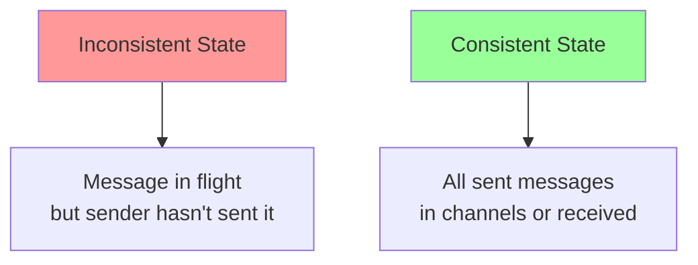
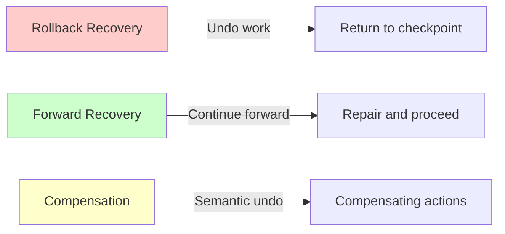
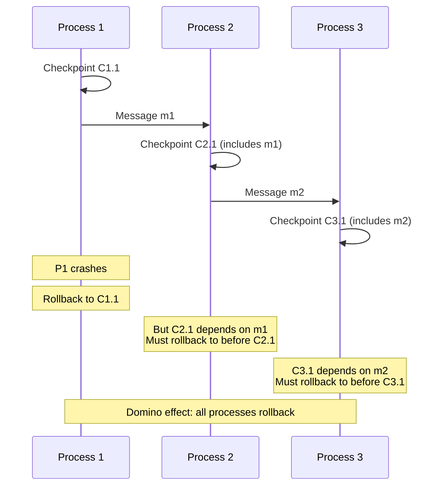
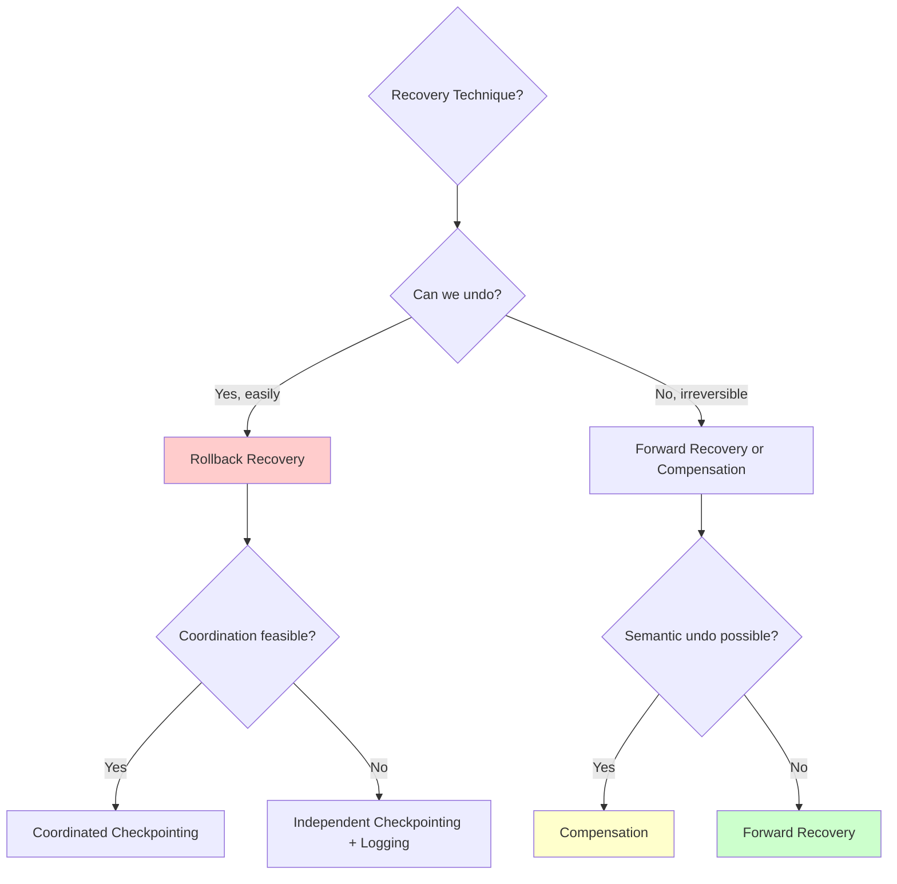

# Recovery Techniques

Recovery is the process of restoring a system to a consistent state after a failure. In distributed systems, recovery is particularly challenging because failures can occur at any time, leaving the system in a partially completed state across multiple nodes. Understanding different recovery techniques—rollback recovery, forward recovery, and compensation—is essential for building resilient distributed applications.

## Recovery Goals and Challenges

The primary goals of recovery are to ensure correctness, minimize downtime, and preserve as much work as possible after failures.

### Consistency Requirements

After recovery, the system must be in a **consistent state**—one that could have occurred during normal execution without failures.

**Consistent global state:**
$$
\text{Global State} = \bigcup_{i=1}^{n} \text{Local State}_i \cup \text{Channel State}_{ij}
$$

A global state is consistent if:
1. No message is in a channel whose send event hasn't occurred
2. No process has received a message whose send event hasn't occurred



### The Recovery Spectrum



## Rollback Recovery

Rollback recovery restores the system to a previous consistent state by undoing operations that occurred after that state.

### Basic Principles

When a failure occurs:
1. **Stop** all ongoing operations
2. **Restore** state to a previously saved checkpoint
3. **Replay** operations from the checkpoint (if using logging)

```javascript
class RollbackRecovery {
  constructor() {
    this.checkpoints = [];  // Saved states
    this.currentState = this.initialize();
  }

  // Save current state as checkpoint
  checkpoint() {
    const snapshot = this.deepCopy(this.currentState);
    this.checkpoints.push({
      state: snapshot,
      timestamp: Date.now(),
      version: this.checkpoints.length
    });

    console.log(`Checkpoint ${this.checkpoints.length} saved`);
  }

  // Execute operation with ability to rollback
  async executeWithRollback(operation) {
    // Save checkpoint before risky operation
    this.checkpoint();

    try {
      const result = await operation(this.currentState);
      return result;
    } catch (error) {
      console.log('Operation failed - initiating rollback');
      this.rollback();
      throw error;
    }
  }

  // Rollback to most recent checkpoint
  rollback(version = null) {
    if (this.checkpoints.length === 0) {
      throw new Error('No checkpoints available for rollback');
    }

    const targetCheckpoint = version !== null
      ? this.checkpoints.find(cp => cp.version === version)
      : this.checkpoints[this.checkpoints.length - 1];

    if (!targetCheckpoint) {
      throw new Error(`Checkpoint ${version} not found`);
    }

    // Restore state
    this.currentState = this.deepCopy(targetCheckpoint.state);

    // Remove checkpoints after rollback point
    this.checkpoints = this.checkpoints.filter(
      cp => cp.version <= targetCheckpoint.version
    );

    console.log(`Rolled back to checkpoint ${targetCheckpoint.version}`);
  }

  deepCopy(obj) {
    return JSON.parse(JSON.stringify(obj));
  }
}
```

### Independent Checkpointing

Each process checkpoints independently without coordination:

```javascript
class IndependentCheckpointing {
  constructor(processId) {
    this.processId = processId;
    this.state = {};
    this.checkpointInterval = 60000;  // 60 seconds
  }

  start() {
    // Periodically save checkpoints
    setInterval(() => {
      this.saveCheckpoint();
    }, this.checkpointInterval);
  }

  async saveCheckpoint() {
    const checkpoint = {
      processId: this.processId,
      state: { ...this.state },
      timestamp: Date.now(),
      messageCount: this.messagesSent
    };

    await this.persist(checkpoint);
    console.log(`Process ${this.processId} checkpointed`);
  }

  async recover() {
    const checkpoint = await this.loadLatestCheckpoint();
    this.state = checkpoint.state;
    this.messagesSent = checkpoint.messageCount;

    console.log(`Process ${this.processId} recovered from checkpoint`);
  }

  async persist(checkpoint) {
    // Write to stable storage
    await fs.writeFile(
      `/checkpoints/${this.processId}.json`,
      JSON.stringify(checkpoint)
    );
  }
}
```

**Advantage:** Simple, no coordination overhead

**Disadvantage:** Domino effect—cascading rollbacks across processes

### The Domino Effect

Independent checkpointing can cause cascading rollbacks:



### Coordinated Checkpointing

Processes coordinate to create a consistent global checkpoint:

```javascript
class CoordinatedCheckpointing {
  constructor(coordinator, participants) {
    this.coordinator = coordinator;
    this.participants = participants;
    this.checkpointVersion = 0;
  }

  // Coordinator initiates checkpointing
  async initiateCheckpoint() {
    this.checkpointVersion++;

    console.log(`Initiating checkpoint ${this.checkpointVersion}`);

    // Phase 1: Request all processes to prepare checkpoint
    const preparePromises = this.participants.map(p =>
      p.prepareCheckpoint(this.checkpointVersion)
    );

    try {
      await Promise.all(preparePromises);
    } catch (error) {
      // Abort checkpoint if any process fails
      await this.abortCheckpoint();
      throw error;
    }

    // Phase 2: Commit checkpoint at all processes
    const commitPromises = this.participants.map(p =>
      p.commitCheckpoint(this.checkpointVersion)
    );

    await Promise.all(commitPromises);

    console.log(`Checkpoint ${this.checkpointVersion} completed`);
  }

  async abortCheckpoint() {
    const abortPromises = this.participants.map(p =>
      p.abortCheckpoint(this.checkpointVersion)
    );
    await Promise.all(abortPromises);
  }
}

class CheckpointParticipant {
  constructor(processId) {
    this.processId = processId;
    this.state = {};
    this.tentativeCheckpoint = null;
  }

  async prepareCheckpoint(version) {
    // Stop processing new requests
    await this.pause();

    // Save tentative checkpoint
    this.tentativeCheckpoint = {
      version,
      state: { ...this.state },
      timestamp: Date.now()
    };

    return { status: 'prepared', processId: this.processId };
  }

  async commitCheckpoint(version) {
    if (this.tentativeCheckpoint?.version !== version) {
      throw new Error('Version mismatch');
    }

    // Persist checkpoint to stable storage
    await this.persist(this.tentativeCheckpoint);

    this.tentativeCheckpoint = null;

    // Resume processing
    await this.resume();
  }

  async abortCheckpoint(version) {
    this.tentativeCheckpoint = null;
    await this.resume();
  }
}
```

**Advantage:** No domino effect, consistent global state guaranteed

**Disadvantage:** Coordination overhead, synchronization cost

### Message Logging

Combine checkpointing with message logging to reduce recovery time:

```javascript
class MessageLogging {
  constructor(processId) {
    this.processId = processId;
    this.messageLog = [];
    this.lastCheckpoint = null;
  }

  async receiveMessage(message) {
    // Log message to stable storage before processing
    await this.logMessage(message);

    // Process message
    const result = await this.process(message);

    return result;
  }

  async logMessage(message) {
    const logEntry = {
      messageId: message.id,
      sender: message.sender,
      content: message.content,
      timestamp: Date.now(),
      sequenceNumber: this.messageLog.length
    };

    this.messageLog.push(logEntry);
    await this.persistLog(logEntry);
  }

  async recover() {
    // Restore from last checkpoint
    this.lastCheckpoint = await this.loadCheckpoint();
    this.state = this.lastCheckpoint.state;

    // Replay messages since checkpoint
    const messagesToReplay = this.messageLog.filter(
      msg => msg.timestamp > this.lastCheckpoint.timestamp
    );

    console.log(`Replaying ${messagesToReplay.length} messages`);

    for (const message of messagesToReplay) {
      await this.process(message);
    }

    console.log('Recovery complete');
  }

  async checkpoint() {
    const checkpoint = {
      state: { ...this.state },
      timestamp: Date.now(),
      lastMessageSeq: this.messageLog.length - 1
    };

    await this.persistCheckpoint(checkpoint);
    this.lastCheckpoint = checkpoint;

    // Trim old log entries before checkpoint
    this.messageLog = this.messageLog.filter(
      msg => msg.sequenceNumber > checkpoint.lastMessageSeq
    );
  }
}
```

## Forward Recovery

Forward recovery continues computation forward from the point of failure rather than rolling back.

### Principles

Instead of undoing work:
1. **Detect** the error or inconsistency
2. **Repair** the corrupted state
3. **Continue** forward with corrected state

```javascript
class ForwardRecovery {
  constructor() {
    this.state = this.initialize();
    this.errorDetectors = [];
    this.repairStrategies = new Map();
  }

  addErrorDetector(detector) {
    this.errorDetectors.push(detector);
  }

  addRepairStrategy(errorType, strategy) {
    this.repairStrategies.set(errorType, strategy);
  }

  async execute(operation) {
    try {
      const result = await operation(this.state);

      // Detect errors in result or state
      for (const detector of this.errorDetectors) {
        const error = await detector.check(this.state, result);

        if (error) {
          return await this.repair(error);
        }
      }

      return result;
    } catch (error) {
      return await this.repair(error);
    }
  }

  async repair(error) {
    const strategy = this.repairStrategies.get(error.type);

    if (!strategy) {
      throw new Error(`No repair strategy for ${error.type}`);
    }

    console.log(`Repairing error: ${error.type}`);

    // Repair state
    this.state = await strategy.repair(this.state, error);

    // Continue forward
    return await this.continueForward();
  }

  async continueForward() {
    // Resume normal operation with repaired state
    console.log('Continuing forward after repair');
  }
}
```

### Exception Handling

Forward recovery through exception handling:

```javascript
class ResilientService {
  async processRequest(request) {
    try {
      return await this.attemptProcessing(request);
    } catch (TimeoutError) {
      // Retry with longer timeout
      return await this.retryWithBackoff(request);
    } catch (InvalidDataError error) {
      // Sanitize and retry
      const sanitized = this.sanitize(request);
      return await this.processRequest(sanitized);
    } catch (ServiceUnavailableError) {
      // Fallback to alternative service
      return await this.fallbackService.process(request);
    } catch (error) {
      // Log and return degraded response
      console.error('Unrecoverable error:', error);
      return this.degradedResponse(request);
    }
  }

  async retryWithBackoff(request, attempt = 1) {
    const delay = Math.min(1000 * Math.pow(2, attempt), 30000);
    await this.sleep(delay);

    try {
      return await this.attemptProcessing(request);
    } catch (error) {
      if (attempt < 5) {
        return await this.retryWithBackoff(request, attempt + 1);
      }
      throw error;
    }
  }
}
```

### Redundancy-Based Recovery

Use redundant computation for forward recovery:

```javascript
class RedundantComputation {
  async computeWithRedundancy(input) {
    // Execute on multiple nodes
    const results = await Promise.allSettled([
      this.node1.compute(input),
      this.node2.compute(input),
      this.node3.compute(input)
    ]);

    // Filter successful results
    const successful = results
      .filter(r => r.status === 'fulfilled')
      .map(r => r.value);

    if (successful.length === 0) {
      throw new Error('All computations failed');
    }

    // Voting: return majority result
    return this.majorityVote(successful);
  }

  majorityVote(results) {
    const counts = new Map();

    for (const result of results) {
      const key = JSON.stringify(result);
      counts.set(key, (counts.get(key) || 0) + 1);
    }

    // Return result with most votes
    let maxCount = 0;
    let majority = null;

    for (const [result, count] of counts) {
      if (count > maxCount) {
        maxCount = count;
        majority = JSON.parse(result);
      }
    }

    return majority;
  }
}
```

### Self-Healing Systems

Systems that automatically detect and repair failures:

```javascript
class SelfHealingCluster {
  constructor(desiredReplicas = 3) {
    this.desiredReplicas = desiredReplicas;
    this.activeReplicas = new Set();
    this.healthChecks = new Map();
  }

  async monitor() {
    setInterval(async () => {
      await this.healthCheck();
      await this.maintain();
    }, 10000);
  }

  async healthCheck() {
    for (const replica of this.activeReplicas) {
      try {
        await replica.ping();
        this.healthChecks.set(replica.id, true);
      } catch (error) {
        this.healthChecks.set(replica.id, false);
        await this.handleFailure(replica);
      }
    }
  }

  async handleFailure(replica) {
    console.log(`Replica ${replica.id} failed`);

    // Remove from active set
    this.activeReplicas.delete(replica);

    // Forward recovery: spawn new replica
    await this.spawnReplica();
  }

  async maintain() {
    const healthy = Array.from(this.activeReplicas).filter(
      r => this.healthChecks.get(r.id)
    );

    if (healthy.length < this.desiredReplicas) {
      const needed = this.desiredReplicas - healthy.length;
      console.log(`Spawning ${needed} new replicas`);

      for (let i = 0; i < needed; i++) {
        await this.spawnReplica();
      }
    }
  }

  async spawnReplica() {
    const replica = await this.createReplica();
    this.activeReplicas.add(replica);
    console.log(`New replica ${replica.id} spawned`);
  }
}
```

## Compensation

Compensation handles recovery by semantically undoing completed operations through compensating transactions.

### Compensating Transactions

Instead of rolling back state, execute inverse operations:

```javascript
class CompensationManager {
  constructor() {
    this.executedOperations = [];
    this.compensations = new Map();
  }

  // Register compensation for an operation
  registerCompensation(operationType, compensationFn) {
    this.compensations.set(operationType, compensationFn);
  }

  async executeWithCompensation(operation) {
    const operationType = operation.type;
    const result = await operation.execute();

    // Record operation for potential compensation
    this.executedOperations.push({
      type: operationType,
      result,
      timestamp: Date.now(),
      context: operation.context
    });

    return result;
  }

  async compensate() {
    console.log(`Compensating ${this.executedOperations.length} operations`);

    // Compensate in reverse order (LIFO)
    const operations = [...this.executedOperations].reverse();

    for (const op of operations) {
      const compensationFn = this.compensations.get(op.type);

      if (!compensationFn) {
        throw new Error(`No compensation for ${op.type}`);
      }

      try {
        await compensationFn(op.result, op.context);
        console.log(`Compensated ${op.type}`);
      } catch (error) {
        console.error(`Compensation failed for ${op.type}:`, error);
        // Continue compensating other operations
      }
    }

    this.executedOperations = [];
  }
}

// Example: Banking transfer with compensation
class BankingService {
  constructor() {
    this.compensationManager = new CompensationManager();
    this.setupCompensations();
  }

  setupCompensations() {
    // Compensation for debit: credit the same amount
    this.compensationManager.registerCompensation(
      'DEBIT',
      async (result, context) => {
        await this.credit(context.account, context.amount);
      }
    );

    // Compensation for credit: debit the same amount
    this.compensationManager.registerCompensation(
      'CREDIT',
      async (result, context) => {
        await this.debit(context.account, context.amount);
      }
    );
  }

  async transfer(fromAccount, toAccount, amount) {
    try {
      // Execute operations with compensation tracking
      await this.compensationManager.executeWithCompensation({
        type: 'DEBIT',
        execute: () => this.debit(fromAccount, amount),
        context: { account: fromAccount, amount }
      });

      await this.compensationManager.executeWithCompensation({
        type: 'CREDIT',
        execute: () => this.credit(toAccount, amount),
        context: { account: toAccount, amount }
      });

      console.log('Transfer completed successfully');
    } catch (error) {
      console.error('Transfer failed, compensating...');
      await this.compensationManager.compensate();
      throw error;
    }
  }

  async debit(account, amount) {
    // Deduct from account
    console.log(`Debiting ${amount} from ${account}`);
  }

  async credit(account, amount) {
    // Add to account
    console.log(`Crediting ${amount} to ${account}`);
  }
}
```

### Saga Pattern

Long-running transactions composed of local transactions with compensations:

```javascript
class Saga {
  constructor() {
    this.steps = [];
  }

  addStep(transaction, compensation) {
    this.steps.push({ transaction, compensation });
  }

  async execute() {
    const completed = [];

    try {
      // Execute all steps
      for (const step of this.steps) {
        const result = await step.transaction();
        completed.push({ step, result });
      }

      return { status: 'success', completed };
    } catch (error) {
      console.log('Saga failed, compensating...');

      // Compensate in reverse order
      for (const { step, result } of completed.reverse()) {
        try {
          await step.compensation(result);
        } catch (compensationError) {
          console.error('Compensation failed:', compensationError);
        }
      }

      return { status: 'compensated', error };
    }
  }
}

// Example: Order processing saga
class OrderSaga {
  async processOrder(order) {
    const saga = new Saga();

    // Step 1: Reserve inventory
    saga.addStep(
      async () => await inventory.reserve(order.items),
      async (result) => await inventory.release(result.reservationId)
    );

    // Step 2: Process payment
    saga.addStep(
      async () => await payment.charge(order.amount),
      async (result) => await payment.refund(result.transactionId)
    );

    // Step 3: Ship order
    saga.addStep(
      async () => await shipping.ship(order),
      async (result) => await shipping.cancel(result.shipmentId)
    );

    const result = await saga.execute();

    if (result.status === 'success') {
      console.log('Order processed successfully');
    } else {
      console.log('Order processing failed and was compensated');
    }

    return result;
  }
}
```

## Choosing a Recovery Technique



**Use rollback recovery when:**
- State can be easily saved and restored
- Operations are idempotent or can be replayed
- Coordination overhead is acceptable

**Use forward recovery when:**
- Rollback is too expensive
- System has redundancy (replication, redundant computation)
- Real-time constraints prevent rollback delays

**Use compensation when:**
- Operations have real-world side effects that can't be undone
- Semantic undo is possible (e.g., refunds, cancellations)
- System involves multiple autonomous services

Understanding and correctly applying recovery techniques ensures distributed systems can maintain correctness and availability in the face of inevitable failures.
