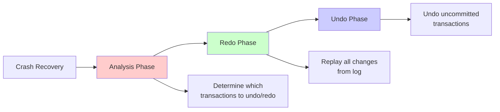

# Write-Ahead Logging

Write-Ahead Logging (WAL) is a fundamental technique for ensuring data durability and enabling recovery in database systems and distributed systems. The core principle is simple yet powerful: before modifying any data, write a description of the modification to a log on stable storage. This log becomes the source of truth for recovery, enabling systems to restore consistent state after failures.

## WAL Fundamentals

The write-ahead logging protocol enforces a crucial ordering constraint that guarantees recoverability.

### The WAL Rule

**Before a data page is written to disk, all log records describing changes to that page must be written to stable storage.**

Formally:
$$
\forall \text{ page } P, \text{ log record } L: \text{modify}(P) \land \text{describes}(L, P) \implies \text{persist}(L) < \text{persist}(P)
$$

This ensures we can always undo or redo operations during recovery.

```javascript
class WriteAheadLog {
  constructor(storageEngine) {
    this.storage = storageEngine;
    this.logBuffer = [];
    this.LSN = 0;  // Log Sequence Number
    this.pageLSN = new Map();  // page ID → last LSN that modified it
  }

  async write(pageId, newValue) {
    // Step 1: Create log record BEFORE modifying data
    const logRecord = this.createLogRecord({
      LSN: ++this.LSN,
      type: 'UPDATE',
      pageId,
      oldValue: await this.storage.read(pageId),
      newValue,
      timestamp: Date.now()
    });

    // Step 2: Write log to stable storage
    await this.appendLog(logRecord);

    // Step 3: Update page LSN
    this.pageLSN.set(pageId, this.LSN);

    // Step 4: Now safe to modify data
    await this.storage.write(pageId, newValue);

    return this.LSN;
  }

  async appendLog(record) {
    this.logBuffer.push(record);

    // Flush if buffer full or force flush
    if (this.logBuffer.length >= 100) {
      await this.flushLog();
    }
  }

  async flushLog() {
    if (this.logBuffer.length === 0) return;

    // Write all buffered log records to disk
    await this.storage.appendToLog(this.logBuffer);

    this.logBuffer = [];
  }

  createLogRecord(params) {
    return {
      LSN: params.LSN,
      type: params.type,
      transactionId: params.transactionId,
      pageId: params.pageId,
      oldValue: params.oldValue,
      newValue: params.newValue,
      prevLSN: params.prevLSN,  // Previous LSN for this transaction
      timestamp: params.timestamp
    };
  }
}
```

### Log Record Structure

A typical log record contains:

```javascript
const logRecord = {
  LSN: 12345,                    // Unique log sequence number
  type: 'UPDATE',                 // UPDATE, INSERT, DELETE, BEGIN, COMMIT, ABORT
  transactionId: 'tx-789',        // Transaction identifier
  pageId: 42,                     // Data page modified
  offset: 100,                    // Location within page
  length: 50,                     // Number of bytes affected
  beforeImage: Buffer.from(...), // Old value (for undo)
  afterImage: Buffer.from(...),  // New value (for redo)
  prevLSN: 12340,                // Previous LSN for this transaction
  timestamp: 1702828800000       // When the operation occurred
};
```

## ARIES Recovery Algorithm

ARIES (Algorithm for Recovery and Isolation Exploiting Semantics) is the standard recovery algorithm used in modern databases like PostgreSQL, MySQL InnoDB, and SQL Server.

### The Three Phases of ARIES



### Phase 1: Analysis

Scan the log forward from the last checkpoint to determine:
- Which transactions were active at crash time
- Which pages might be dirty
- Where to start redo

```javascript
class ARIESAnalysis {
  constructor(log, checkpoint) {
    this.log = log;
    this.checkpoint = checkpoint;

    this.transactionTable = new Map();  // txId → lastLSN, status
    this.dirtyPageTable = new Map();    // pageId → recoveryLSN
  }

  async analyze() {
    console.log('=== ARIES Analysis Phase ===');

    // Start from last checkpoint
    let scanLSN = this.checkpoint.LSN;

    // Restore transaction and dirty page tables from checkpoint
    this.transactionTable = new Map(this.checkpoint.transactionTable);
    this.dirtyPageTable = new Map(this.checkpoint.dirtyPageTable);

    // Scan log forward
    for await (const record of this.log.scan(scanLSN)) {
      switch (record.type) {
        case 'BEGIN':
          this.transactionTable.set(record.transactionId, {
            lastLSN: record.LSN,
            status: 'ACTIVE'
          });
          break;

        case 'UPDATE':
        case 'INSERT':
        case 'DELETE':
          // Update transaction's last LSN
          const tx = this.transactionTable.get(record.transactionId);
          if (tx) {
            tx.lastLSN = record.LSN;
          }

          // Mark page as dirty if not already
          if (!this.dirtyPageTable.has(record.pageId)) {
            this.dirtyPageTable.set(record.pageId, record.LSN);
          }
          break;

        case 'COMMIT':
          const committed = this.transactionTable.get(record.transactionId);
          if (committed) {
            committed.status = 'COMMITTED';
          }
          break;

        case 'ABORT':
          const aborted = this.transactionTable.get(record.transactionId);
          if (aborted) {
            aborted.status = 'ABORTED';
          }
          break;

        case 'END':
          // Transaction completed undo, remove from table
          this.transactionTable.delete(record.transactionId);
          break;
      }
    }

    // Determine which transactions need undo
    const toUndo = [];
    for (const [txId, info] of this.transactionTable) {
      if (info.status === 'ACTIVE' || info.status === 'ABORTED') {
        toUndo.push(txId);
      }
    }

    console.log(`Transactions to undo: ${toUndo.length}`);
    console.log(`Dirty pages: ${this.dirtyPageTable.size}`);

    return {
      transactionTable: this.transactionTable,
      dirtyPageTable: this.dirtyPageTable,
      toUndo
    };
  }
}
```

### Phase 2: Redo

Replay all operations from the log to restore the database to its state at crash time:

```javascript
class ARIESRedo {
  constructor(log, dirtyPageTable) {
    this.log = log;
    this.dirtyPageTable = dirtyPageTable;
  }

  async redo() {
    console.log('=== ARIES Redo Phase ===');

    // Find minimum recovery LSN from dirty page table
    let redoLSN = Infinity;
    for (const recoveryLSN of this.dirtyPageTable.values()) {
      redoLSN = Math.min(redoLSN, recoveryLSN);
    }

    console.log(`Starting redo from LSN ${redoLSN}`);

    let redoCount = 0;

    // Scan log forward from redoLSN
    for await (const record of this.log.scan(redoLSN)) {
      if (this.shouldRedo(record)) {
        await this.redoOperation(record);
        redoCount++;
      }
    }

    console.log(`Redo complete: ${redoCount} operations replayed`);
  }

  shouldRedo(record) {
    // Only redo update operations
    if (!['UPDATE', 'INSERT', 'DELETE'].includes(record.type)) {
      return false;
    }

    // Check if page is in dirty page table
    if (!this.dirtyPageTable.has(record.pageId)) {
      return false;  // Page not dirty, already on disk
    }

    // Check if this update might not be on disk
    const pageLSN = this.storage.getPageLSN(record.pageId);
    if (record.LSN <= pageLSN) {
      return false;  // Already on disk
    }

    return true;
  }

  async redoOperation(record) {
    console.log(`Redoing LSN ${record.LSN}: ${record.type} on page ${record.pageId}`);

    // Apply the after-image
    await this.storage.write(
      record.pageId,
      record.offset,
      record.afterImage
    );

    // Update page LSN
    await this.storage.setPageLSN(record.pageId, record.LSN);
  }
}
```

### Phase 3: Undo

Roll back all uncommitted transactions:

```javascript
class ARIESUndo {
  constructor(log, transactionTable, toUndo) {
    this.log = log;
    this.transactionTable = transactionTable;
    this.toUndo = toUndo;
  }

  async undo() {
    console.log('=== ARIES Undo Phase ===');

    // Create priority queue of LSNs to undo (process in reverse order)
    const undoLSNs = [];

    for (const txId of this.toUndo) {
      const tx = this.transactionTable.get(txId);
      if (tx) {
        undoLSNs.push({ LSN: tx.lastLSN, txId });
      }
    }

    // Sort by LSN descending (undo newest first)
    undoLSNs.sort((a, b) => b.LSN - a.LSN);

    let undoCount = 0;

    while (undoLSNs.length > 0) {
      const { LSN, txId } = undoLSNs.shift();

      const record = await this.log.read(LSN);

      if (['UPDATE', 'INSERT', 'DELETE'].includes(record.type)) {
        // Undo this operation
        await this.undoOperation(record);
        undoCount++;

        // Write compensation log record (CLR)
        await this.writeCLR(record);
      }

      // Add previous LSN for this transaction to undo queue
      if (record.prevLSN) {
        undoLSNs.push({ LSN: record.prevLSN, txId });
        undoLSNs.sort((a, b) => b.LSN - a.LSN);
      } else {
        // Reached beginning of transaction, write END record
        await this.writeEndRecord(txId);
      }
    }

    console.log(`Undo complete: ${undoCount} operations undone`);
  }

  async undoOperation(record) {
    console.log(`Undoing LSN ${record.LSN}: ${record.type} on page ${record.pageId}`);

    // Apply the before-image (restore old value)
    await this.storage.write(
      record.pageId,
      record.offset,
      record.beforeImage
    );
  }

  async writeCLR(record) {
    // Compensation Log Record - describes undo action
    const clr = {
      LSN: this.log.nextLSN(),
      type: 'CLR',
      transactionId: record.transactionId,
      undoNextLSN: record.prevLSN,  // Skip this operation if we crash again
      pageId: record.pageId,
      compensation: record.LSN
    };

    await this.log.append(clr);
  }

  async writeEndRecord(txId) {
    await this.log.append({
      LSN: this.log.nextLSN(),
      type: 'END',
      transactionId: txId
    });
  }
}
```

### Complete ARIES Recovery

```javascript
class ARIESRecovery {
  constructor(storage, log) {
    this.storage = storage;
    this.log = log;
  }

  async recover() {
    console.log('Starting ARIES recovery...');

    // Load last checkpoint
    const checkpoint = await this.loadCheckpoint();

    // Phase 1: Analysis
    const analysis = new ARIESAnalysis(this.log, checkpoint);
    const { transactionTable, dirtyPageTable, toUndo } = await analysis.analyze();

    // Phase 2: Redo
    const redo = new ARIESRedo(this.log, dirtyPageTable);
    await redo.redo();

    // Phase 3: Undo
    const undo = new ARIESUndo(this.log, transactionTable, toUndo);
    await undo.undo();

    console.log('ARIES recovery complete');
  }

  async loadCheckpoint() {
    // Load checkpoint from special location
    const checkpointLSN = await this.storage.getMasterRecord();
    return await this.log.read(checkpointLSN);
  }
}
```

## Log-Structured Storage

Some systems organize all storage as a log, turning random writes into sequential writes.

### Log-Structured Merge Trees (LSM)

```javascript
class LSMTree {
  constructor() {
    this.memTable = new Map();  // In-memory sorted map
    this.sstables = [];         // Sorted String Tables on disk
    this.wal = new WriteAheadLog(this.storage);
    this.memTableSize = 10000;
  }

  async put(key, value) {
    // Write to WAL for durability
    await this.wal.append({
      type: 'PUT',
      key,
      value,
      timestamp: Date.now()
    });

    // Write to memtable
    this.memTable.set(key, {
      value,
      timestamp: Date.now(),
      deleted: false
    });

    // Flush if memtable too large
    if (this.memTable.size >= this.memTableSize) {
      await this.flush();
    }
  }

  async get(key) {
    // Check memtable first
    if (this.memTable.has(key)) {
      const entry = this.memTable.get(key);
      return entry.deleted ? null : entry.value;
    }

    // Search SSTables (newest to oldest)
    for (let i = this.sstables.length - 1; i >= 0; i--) {
      const value = await this.sstables[i].get(key);
      if (value !== undefined) {
        return value;
      }
    }

    return null;
  }

  async delete(key) {
    // Write tombstone to WAL
    await this.wal.append({
      type: 'DELETE',
      key,
      timestamp: Date.now()
    });

    // Mark as deleted in memtable (tombstone)
    this.memTable.set(key, {
      value: null,
      timestamp: Date.now(),
      deleted: true
    });
  }

  async flush() {
    if (this.memTable.size === 0) return;

    console.log(`Flushing memtable with ${this.memTable.size} entries`);

    // Convert memtable to SSTable
    const sstable = await this.createSSTable(this.memTable);
    this.sstables.push(sstable);

    // Clear memtable and WAL
    this.memTable.clear();
    await this.wal.truncate();

    // Trigger compaction if needed
    if (this.sstables.length >= 10) {
      await this.compact();
    }
  }

  async createSSTable(data) {
    // Sort entries by key
    const sorted = Array.from(data.entries()).sort((a, b) =>
      a[0].localeCompare(b[0])
    );

    // Write to disk as sorted file
    const filename = `/data/sstable-${Date.now()}.db`;
    await this.writeSortedFile(filename, sorted);

    // Build index
    const index = this.buildIndex(sorted);

    return new SSTable(filename, index);
  }

  async compact() {
    console.log('Starting compaction...');

    // Merge multiple SSTables into one
    const mergedData = new Map();

    for (const sstable of this.sstables) {
      const data = await sstable.readAll();

      for (const [key, value] of data) {
        // Keep only newest version of each key
        if (!mergedData.has(key) ||
            value.timestamp > mergedData.get(key).timestamp) {
          mergedData.set(key, value);
        }
      }
    }

    // Remove tombstones
    for (const [key, value] of mergedData) {
      if (value.deleted) {
        mergedData.delete(key);
      }
    }

    // Create new SSTable
    const compacted = await this.createSSTable(mergedData);

    // Delete old SSTables
    for (const sstable of this.sstables) {
      await sstable.delete();
    }

    // Replace with compacted SSTable
    this.sstables = [compacted];

    console.log('Compaction complete');
  }
}
```

### Append-Only Log Benefits

**Sequential writes:**
$$
\text{Throughput}_{\text{sequential}} \gg \text{Throughput}_{\text{random}}
$$

On SSDs: ~500 MB/s sequential vs ~50 MB/s random
On HDDs: ~150 MB/s sequential vs ~1 MB/s random

**Simplified recovery:**
```javascript
class AppendOnlyLog {
  async recover() {
    // Simply replay entire log from beginning
    for await (const entry of this.readLog()) {
      await this.apply(entry);
    }
  }
}
```

## Distributed Logging

Replicate logs across multiple nodes for fault tolerance:

```javascript
class ReplicatedLog {
  constructor(replicaId, replicas) {
    this.replicaId = replicaId;
    this.replicas = replicas;
    this.log = [];
    this.commitIndex = 0;
  }

  async append(entry) {
    entry.term = this.currentTerm;
    entry.index = this.log.length;

    // Append to local log
    this.log.push(entry);

    // Replicate to majority of replicas
    const acks = await this.replicateToMajority(entry);

    if (acks >= Math.floor(this.replicas.length / 2) + 1) {
      // Majority acknowledged, commit entry
      this.commitIndex = entry.index;
      return { success: true, index: entry.index };
    }

    return { success: false };
  }

  async replicateToMajority(entry) {
    const replicatePromises = this.replicas.map(async (replica) => {
      try {
        await replica.appendEntry(entry);
        return 1;
      } catch (error) {
        return 0;
      }
    });

    const results = await Promise.allSettled(replicatePromises);
    return results.filter(r => r.status === 'fulfilled' && r.value === 1).length;
  }
}
```

Write-ahead logging and its variants form the foundation of durability in distributed systems, enabling reliable recovery while maintaining high performance through optimizations like batching, asynchronous flushing, and log-structured storage.
