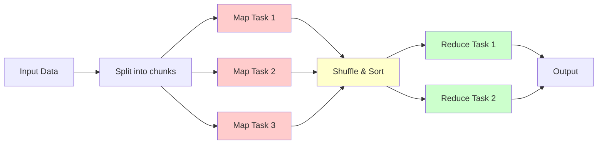

# MapReduce Programming Model

MapReduce is a programming model and processing framework for distributed computing on large datasets across clusters of computers. Introduced by Google in 2004, MapReduce revolutionized big data processing by providing a simple abstraction that handles the complexity of parallel execution, fault tolerance, and data distribution.

## The MapReduce Paradigm

MapReduce divides computation into two phases: Map and Reduce, inspired by functional programming constructs.

### Core Concepts



**Map Phase:** Transform input records into intermediate key-value pairs

$$
\text{map}: (K_1, V_1) \to \text{list}(K_2, V_2)
$$

**Reduce Phase:** Aggregate values with the same key

$$
\text{reduce}: (K_2, \text{list}(V_2)) \to \text{list}(V_3)
$$

## Map Function

The map function processes each input record independently and emits zero or more key-value pairs.

```javascript
class MapReduce Framework {
  async map(key, value, emit) {
    // User-defined map function
    // Process one input record
    // Emit intermediate key-value pairs
  }
}

// Word count example
function mapWordCount(docId, content, emit) {
  const words = content.split(/\s+/);

  for (const word of words) {
    emit(word.toLowerCase(), 1);
  }
}

// Example input:
// (doc1, "hello world hello")
// Outputs:
// ("hello", 1)
// ("world", 1)
// ("hello", 1)
```

### Map Execution

```javascript
class MapTask {
  constructor(taskId, inputSplit) {
    this.taskId = taskId;
    this.inputSplit = inputSplit;
    this.intermediateData = [];
  }

  async execute(mapFunction) {
    console.log(`Map task ${this.taskId} processing ${this.inputSplit.length} records`);

    for (const record of this.inputSplit) {
      const { key, value } = record;

      // Call user-defined map function
      await mapFunction(key, value, (k, v) => {
        this.intermediateData.push({ key: k, value: v });
      });
    }

    // Sort intermediate data by key
    this.intermediateData.sort((a, b) => 
      a.key.localeCompare(b.key)
    );

    console.log(`Map task ${this.taskId} produced ${this.intermediateData.length} pairs`);

    return this.intermediateData;
  }
}
```

## Shuffle and Sort

The shuffle phase redistributes data so all values for the same key go to the same reducer.

```javascript
class ShufflePhase {
  constructor(mapOutputs, numReducers) {
    this.mapOutputs = mapOutputs;  // Array of map task outputs
    this.numReducers = numReducers;
  }

  async shuffle() {
    console.log('Starting shuffle phase...');

    // Partition intermediate data by key
    const partitions = new Map();

    for (let i = 0; i < this.numReducers; i++) {
      partitions.set(i, []);
    }

    // Distribute map outputs to partitions
    for (const mapOutput of this.mapOutputs) {
      for (const { key, value } of mapOutput) {
        const partition = this.partition(key, this.numReducers);
        partitions.get(partition).push({ key, value });
      }
    }

    // Sort each partition by key
    for (const [partitionId, data] of partitions) {
      data.sort((a, b) => a.key.localeCompare(b.key));

      // Group by key
      partitions.set(partitionId, this.groupByKey(data));
    }

    console.log('Shuffle phase complete');

    return partitions;
  }

  partition(key, numPartitions) {
    // Hash partitioning
    let hash = 0;
    for (let i = 0; i < key.length; i++) {
      hash = ((hash << 5) - hash) + key.charCodeAt(i);
      hash = hash & hash;
    }
    return Math.abs(hash) % numPartitions;
  }

  groupByKey(data) {
    const grouped = new Map();

    for (const { key, value } of data) {
      if (!grouped.has(key)) {
        grouped.set(key, []);
      }
      grouped.get(key).push(value);
    }

    return Array.from(grouped.entries()).map(([key, values]) => ({
      key,
      values
    }));
  }
}
```

## Reduce Function

The reduce function aggregates all values for each key.

```javascript
function reduceWordCount(key, values, emit) {
  // Sum all values for this word
  const count = values.reduce((sum, val) => sum + val, 0);
  emit(key, count);
}

// Example input:
// ("hello", [1, 1, 1, 1])
// ("world", [1, 1])
// Outputs:
// ("hello", 4)
// ("world", 2)

class ReduceTask {
  constructor(taskId, partition) {
    this.taskId = taskId;
    this.partition = partition;  // Array of { key, values }
    this.output = [];
  }

  async execute(reduceFunction) {
    console.log(`Reduce task ${this.taskId} processing ${this.partition.length} keys`);

    for (const { key, values } of this.partition) {
      await reduceFunction(key, values, (k, v) => {
        this.output.push({ key: k, value: v });
      });
    }

    console.log(`Reduce task ${this.taskId} produced ${this.output.length} results`);

    return this.output;
  }
}
```

## Complete MapReduce Job

```javascript
class MapReduceJob {
  constructor(input, mapFunction, reduceFunction, numReducers = 2) {
    this.input = input;
    this.mapFunction = mapFunction;
    this.reduceFunction = reduceFunction;
    this.numReducers = numReducers;
  }

  async execute() {
    console.log('=== Starting MapReduce Job ===');

    // Step 1: Split input into chunks
    const splits = this.splitInput(this.input);
    console.log(`Input split into ${splits.length} chunks`);

    // Step 2: Run map tasks in parallel
    const mapTasks = splits.map((split, i) =>
      new MapTask(i, split)
    );

    const mapPromises = mapTasks.map(task =>
      task.execute(this.mapFunction)
    );

    const mapOutputs = await Promise.all(mapPromises);

    // Step 3: Shuffle and sort
    const shuffler = new ShufflePhase(mapOutputs, this.numReducers);
    const partitions = await shuffler.shuffle();

    // Step 4: Run reduce tasks in parallel
    const reduceTasks = [];
    for (const [partitionId, partition] of partitions) {
      reduceTasks.push(new ReduceTask(partitionId, partition));
    }

    const reducePromises = reduceTasks.map(task =>
      task.execute(this.reduceFunction)
    );

    const reduceOutputs = await Promise.all(reducePromises);

    // Step 5: Collect results
    const results = reduceOutputs.flat();

    console.log('=== MapReduce Job Complete ===');
    console.log(`Total results: ${results.length}`);

    return results;
  }

  splitInput(input, chunkSize = 100) {
    const splits = [];
    for (let i = 0; i < input.length; i += chunkSize) {
      splits.push(input.slice(i, i + chunkSize));
    }
    return splits;
  }
}

// Word Count Example
const documents = [
  { key: 'doc1', value: 'hello world hello' },
  { key: 'doc2', value: 'hello mapreduce world' },
  { key: 'doc3', value: 'world of big data' }
];

const job = new MapReduceJob(
  documents,
  mapWordCount,
  reduceWordCount,
  2
);

const results = await job.execute();

// Results:
// [
//   { key: 'hello', value: 3 },
//   { key: 'world', value: 3 },
//   { key: 'mapreduce', value: 1 },
//   { key: 'of', value: 1 },
//   { key: 'big', value: 1 },
//   { key: 'data', value: 1 }
// ]
```

## Combiners

Combiners are mini-reducers that run on map task output to reduce data transfer.

```javascript
class MapTaskWithCombiner extends MapTask {
  async execute(mapFunction, combinerFunction) {
    // Run map function
    const mapOutput = await super.execute(mapFunction);

    if (combinerFunction) {
      // Group by key locally
      const grouped = this.groupByKey(mapOutput);

      // Apply combiner
      const combined = [];
      for (const { key, values } of grouped) {
        await combinerFunction(key, values, (k, v) => {
          combined.push({ key: k, value: v });
        });
      }

      this.intermediateData = combined;
      console.log(`Combiner reduced output from ${mapOutput.length} to ${combined.length} pairs`);
    }

    return this.intermediateData;
  }

  groupByKey(data) {
    const grouped = new Map();
    for (const { key, value } of data) {
      if (!grouped.has(key)) grouped.set(key, []);
      grouped.get(key).push(value);
    }
    return Array.from(grouped.entries()).map(([key, values]) => ({ key, values }));
  }
}

// Combiner is same as reducer for word count
const combinerWordCount = reduceWordCount;

// With combiner, network transfer is much smaller!
```

## Partitioners

Partitioners determine which reducer receives each key.

```javascript
class CustomPartitioner {
  // Ensure related keys go to same reducer
  partition(key, numPartitions) {
    if (key.startsWith('a') || key.startsWith('b')) {
      return 0;
    } else if (key.startsWith('c') || key.startsWith('d')) {
      return 1;
    } else {
      return 2 % numPartitions;
    }
  }
}

// Range partitioner
class RangePartitioner {
  constructor(ranges) {
    this.ranges = ranges;  // e.g., ['a-f', 'g-m', 'n-z']
  }

  partition(key, numPartitions) {
    const firstChar = key[0].toLowerCase();

    for (let i = 0; i < this.ranges.length; i++) {
      const [start, end] = this.ranges[i].split('-');
      if (firstChar >= start && firstChar <= end) {
        return i % numPartitions;
      }
    }

    return 0;
  }
}
```

## Fault Tolerance

MapReduce handles failures gracefully through re-execution.

```javascript
class FaultTolerantMapReduce extends MapReduceJob {
  async executeWithRetry(maxRetries = 3) {
    for (let attempt = 1; attempt <= maxRetries; attempt++) {
      try {
        return await this.execute();
      } catch (error) {
        console.error(`Attempt ${attempt} failed:`, error);

        if (attempt === maxRetries) {
          throw error;
        }

        console.log('Retrying...');
        await this.sleep(1000 * attempt);
      }
    }
  }

  async executeMapTask(task) {
    try {
      return await task.execute(this.mapFunction);
    } catch (error) {
      console.error(`Map task ${task.taskId} failed, re-executing...`);
      // Re-execute on different node
      return await task.execute(this.mapFunction);
    }
  }

  sleep(ms) {
    return new Promise(resolve => setTimeout(resolve, ms));
  }
}
```

MapReduce provides a powerful abstraction for large-scale data processing, hiding the complexity of parallelization, fault tolerance, and data distribution behind a simple programming model.
