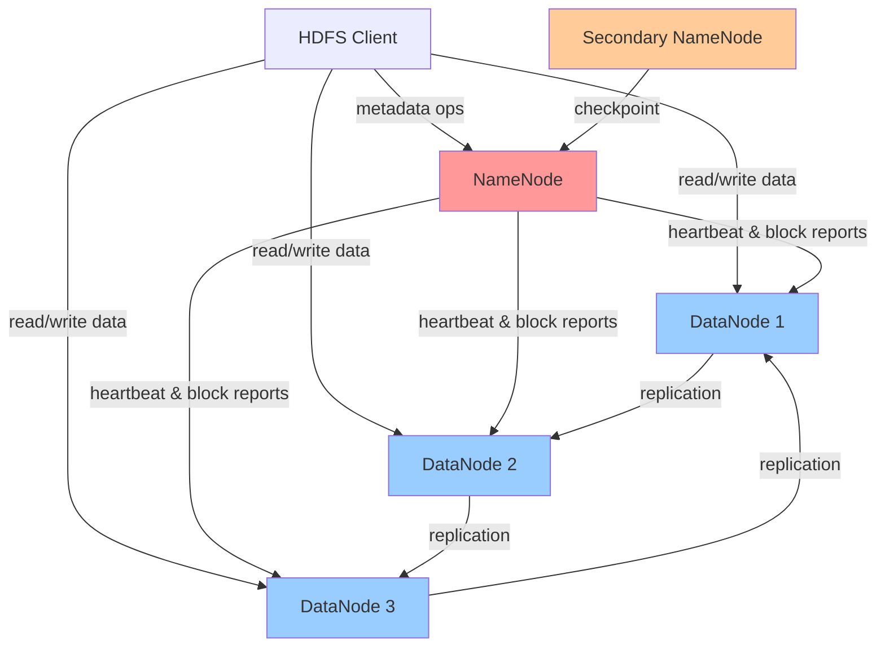
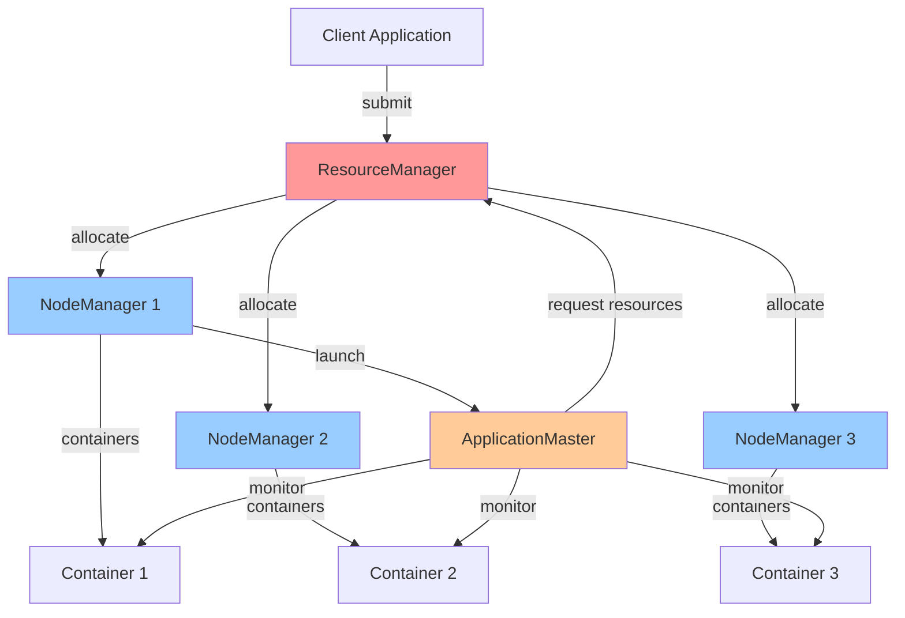
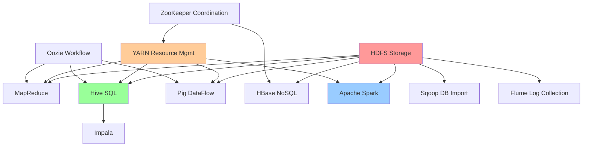

# Hadoop Ecosystem

The Hadoop ecosystem represents a comprehensive suite of tools and frameworks built around Apache Hadoop for storing, processing, and analyzing massive datasets across distributed clusters. What started as an implementation of Google's MapReduce and GFS papers has evolved into a rich ecosystem of complementary technologies that power big data processing at companies worldwide.

## Apache Hadoop Core Components

Hadoop consists of four core modules that provide the foundation for distributed data processing.

### Hadoop Common

Utilities and libraries that support other Hadoop modules:

```javascript
// Common utilities shared across Hadoop
class HadoopConfiguration {
  constructor() {
    this.properties = new Map();
  }

  set(key, value) {
    this.properties.set(key, value);
  }

  get(key, defaultValue = null) {
    return this.properties.get(key) || defaultValue;
  }

  // Common configuration properties
  static defaults() {
    return {
      'fs.defaultFS': 'hdfs://namenode:9000',
      'dfs.replication': 3,
      'mapreduce.framework.name': 'yarn',
      'yarn.resourcemanager.hostname': 'resourcemanager'
    };
  }
}
```

### Hadoop Distributed File System (HDFS)

HDFS is a distributed file system designed to store very large files across multiple machines with high fault tolerance.

## HDFS Architecture

HDFS uses a master-slave architecture with a single NameNode and multiple DataNodes.



### NameNode Implementation

```javascript
class NameNode {
  constructor() {
    this.namespace = new FileSystemNamespace();
    this.blockManager = new BlockManager();
    this.datanodes = new Map();  // DataNode ID → info
  }

  // File operations
  async create(path, replication = 3, blockSize = 128 * 1024 * 1024) {
    // Check if path already exists
    if (this.namespace.exists(path)) {
      throw new Error(`File ${path} already exists`);
    }

    // Create file metadata
    const fileInfo = {
      path,
      replication,
      blockSize,
      blocks: [],
      created: Date.now(),
      modified: Date.now(),
      owner: 'hdfs',
      group: 'supergroup',
      permissions: '644'
    };

    this.namespace.create(path, fileInfo);

    return fileInfo;
  }

  async addBlock(path) {
    const fileInfo = this.namespace.get(path);

    // Allocate new block
    const blockId = this.blockManager.allocateBlock();

    // Select DataNodes for block replicas
    const locations = this.selectDataNodes(fileInfo.replication);

    const blockInfo = {
      blockId,
      locations,
      length: 0,
      generationStamp: Date.now()
    };

    fileInfo.blocks.push(blockInfo);

    return blockInfo;
  }

  async getBlockLocations(path) {
    const fileInfo = this.namespace.get(path);

    if (!fileInfo) {
      throw new Error(`File ${path} not found`);
    }

    return fileInfo.blocks.map(block => ({
      blockId: block.blockId,
      locations: block.locations,
      offset: block.offset,
      length: block.length
    }));
  }

  selectDataNodes(replicationFactor) {
    // Rack-aware replica placement
    const datanodes = Array.from(this.datanodes.values());

    // Sort by available space
    datanodes.sort((a, b) => b.availableSpace - a.availableSpace);

    const selected = [];
    const racks = new Set();

    // First replica: random node
    selected.push(datanodes[0]);
    racks.add(datanodes[0].rack);

    // Second replica: different rack
    for (const dn of datanodes) {
      if (!racks.has(dn.rack)) {
        selected.push(dn);
        racks.add(dn.rack);
        break;
      }
    }

    // Additional replicas: same rack as second
    for (const dn of datanodes) {
      if (selected.length >= replicationFactor) break;

      if (dn.rack === selected[1].rack && !selected.includes(dn)) {
        selected.push(dn);
      }
    }

    return selected.slice(0, replicationFactor);
  }

  // DataNode management
  async registerDataNode(datanodeInfo) {
    this.datanodes.set(datanodeInfo.id, {
      ...datanodeInfo,
      lastHeartbeat: Date.now()
    });

    console.log(`DataNode ${datanodeInfo.id} registered`);
  }

  async handleHeartbeat(datanodeId, blocks) {
    const datanode = this.datanodes.get(datanodeId);

    if (!datanode) {
      throw new Error(`Unknown DataNode ${datanodeId}`);
    }

    datanode.lastHeartbeat = Date.now();

    // Process block report
    this.blockManager.updateBlockLocations(datanodeId, blocks);

    // Return commands for DataNode
    return this.generateDataNodeCommands(datanodeId);
  }

  generateDataNodeCommands(datanodeId) {
    const commands = [];

    // Check for under-replicated blocks
    const underReplicated = this.blockManager.getUnderReplicatedBlocks();

    for (const block of underReplicated) {
      if (block.locations.includes(datanodeId)) {
        // Command to replicate this block
        commands.push({
          type: 'REPLICATE',
          blockId: block.blockId,
          source: datanodeId,
          targets: this.selectDataNodes(1)
        });
      }
    }

    return commands;
  }

  // High availability - edit log
  async logOperation(operation) {
    await this.editLog.append({
      txid: this.nextTxId++,
      operation,
      timestamp: Date.now()
    });

    // Periodically checkpoint
    if (this.nextTxId % 1000 === 0) {
      await this.checkpoint();
    }
  }

  async checkpoint() {
    // Save namespace to FSImage
    const image = this.namespace.serialize();
    await this.saveFSImage(image);

    // Clear old edit log entries
    await this.editLog.truncate(this.nextTxId);
  }
}
```

### DataNode Implementation

```javascript
class DataNode {
  constructor(id, storagePath) {
    this.id = id;
    this.storagePath = storagePath;
    this.blocks = new Map();  // blockId → block data
    this.namenode = null;
  }

  async start(namenodeAddress) {
    this.namenode = new NameNodeClient(namenodeAddress);

    // Register with NameNode
    await this.register();

    // Start heartbeat
    this.startHeartbeat();

    // Start block scanner
    this.startBlockScanner();
  }

  async register() {
    const info = {
      id: this.id,
      hostname: 'datanode-1.example.com',
      port: 50010,
      rack: '/default-rack',
      capacity: 1024 * 1024 * 1024 * 1024,  // 1TB
      availableSpace: 800 * 1024 * 1024 * 1024  // 800GB
    };

    await this.namenode.registerDataNode(info);
  }

  startHeartbeat() {
    setInterval(async () => {
      const blocks = Array.from(this.blocks.keys());

      const commands = await this.namenode.heartbeat(this.id, blocks);

      // Execute commands from NameNode
      for (const command of commands) {
        await this.executeCommand(command);
      }
    }, 3000);  // Every 3 seconds
  }

  async executeCommand(command) {
    switch (command.type) {
      case 'REPLICATE':
        await this.replicateBlock(command.blockId, command.targets);
        break;

      case 'DELETE':
        await this.deleteBlock(command.blockId);
        break;

      case 'INVALIDATE':
        await this.invalidateBlock(command.blockId);
        break;
    }
  }

  async writeBlock(blockId, data, checksum) {
    // Write block to local disk
    const path = `${this.storagePath}/blocks/${blockId}`;
    await fs.writeFile(path, data);

    // Write checksum
    await fs.writeFile(`${path}.checksum`, checksum);

    this.blocks.set(blockId, {
      path,
      length: data.length,
      checksum,
      created: Date.now()
    });

    console.log(`Block ${blockId} written (${data.length} bytes)`);
  }

  async readBlock(blockId) {
    const blockInfo = this.blocks.get(blockId);

    if (!blockInfo) {
      throw new Error(`Block ${blockId} not found`);
    }

    const data = await fs.readFile(blockInfo.path);

    // Verify checksum
    const checksum = await this.computeChecksum(data);
    const storedChecksum = await fs.readFile(`${blockInfo.path}.checksum`);

    if (checksum !== storedChecksum) {
      throw new Error(`Checksum mismatch for block ${blockId}`);
    }

    return data;
  }

  async replicateBlock(blockId, targets) {
    const data = await this.readBlock(blockId);

    for (const target of targets) {
      const client = new DataNodeClient(target.hostname, target.port);
      await client.writeBlock(blockId, data);
    }

    console.log(`Block ${blockId} replicated to ${targets.length} targets`);
  }

  startBlockScanner() {
    // Periodically scan blocks to detect corruption
    setInterval(async () => {
      for (const [blockId, blockInfo] of this.blocks) {
        try {
          await this.readBlock(blockId);  // Verifies checksum
        } catch (error) {
          console.error(`Block ${blockId} corrupted:`, error);
          await this.namenode.reportCorruptBlock(blockId);
        }
      }
    }, 3600000);  // Every hour
  }

  async computeChecksum(data) {
    const crypto = require('crypto');
    return crypto.createHash('md5').update(data).digest('hex');
  }
}
```

### HDFS Read/Write Operations

```javascript
class HDFSClient {
  constructor(namenodeAddress) {
    this.namenode = new NameNodeClient(namenodeAddress);
  }

  async write(path, data, replication = 3) {
    // Create file
    await this.namenode.create(path, replication);

    const blockSize = 128 * 1024 * 1024;  // 128MB
    let offset = 0;

    while (offset < data.length) {
      const chunkSize = Math.min(blockSize, data.length - offset);
      const chunk = data.slice(offset, offset + chunkSize);

      // Get block location
      const block = await this.namenode.addBlock(path);

      // Write to DataNodes (pipeline)
      await this.writeBlockPipeline(chunk, block.locations);

      offset += chunkSize;
    }

    await this.namenode.complete(path);
  }

  async writeBlockPipeline(data, datanodes) {
    // Set up pipeline: Client → DN1 → DN2 → DN3
    const primary = datanodes[0];
    const replicas = datanodes.slice(1);

    // Connect to primary DataNode
    const client = new DataNodeClient(primary.hostname, primary.port);

    // Send data with pipeline info
    await client.writeBlock({
      data,
      replicas  // Primary will forward to these
    });

    // Wait for acknowledgments from all replicas
    await client.waitForAcks(datanodes.length);
  }

  async read(path) {
    // Get block locations from NameNode
    const blocks = await this.namenode.getBlockLocations(path);

    const chunks = [];

    for (const block of blocks) {
      // Try each location until success
      let data = null;

      for (const location of block.locations) {
        try {
          const client = new DataNodeClient(location.hostname, location.port);
          data = await client.readBlock(block.blockId);
          break;
        } catch (error) {
          console.error(`Failed to read from ${location.hostname}:`, error);
          // Try next location
        }
      }

      if (!data) {
        throw new Error(`Failed to read block ${block.blockId}`);
      }

      chunks.push(data);
    }

    return Buffer.concat(chunks);
  }
}
```

## YARN (Yet Another Resource Negotiator)

YARN is Hadoop's cluster resource management system that allows multiple data processing engines to run on the same cluster.



### ResourceManager

```javascript
class ResourceManager {
  constructor() {
    this.nodeManagers = new Map();
    this.applications = new Map();
    this.scheduler = new CapacityScheduler();
  }

  async submitApplication(appSpec) {
    const appId = this.generateAppId();

    const app = {
      id: appId,
      name: appSpec.name,
      user: appSpec.user,
      queue: appSpec.queue || 'default',
      status: 'SUBMITTED',
      startTime: Date.now()
    };

    this.applications.set(appId, app);

    // Allocate container for ApplicationMaster
    const amContainer = await this.scheduler.allocate({
      memory: 1024,  // 1GB
      vcores: 1,
      priority: 10
    });

    // Launch ApplicationMaster
    await this.launchApplicationMaster(appId, amContainer, appSpec);

    return appId;
  }

  async launchApplicationMaster(appId, container, appSpec) {
    const nodeManager = this.nodeManagers.get(container.nodeId);

    await nodeManager.launch({
      containerId: container.id,
      commands: appSpec.amCommands,
      environment: {
        APP_ID: appId,
        ...appSpec.environment
      }
    });

    this.applications.get(appId).status = 'RUNNING';
  }

  async allocateContainers(appId, requests) {
    const app = this.applications.get(appId);

    if (!app) {
      throw new Error(`Application ${appId} not found`);
    }

    // Use scheduler to allocate containers
    const containers = [];

    for (const request of requests) {
      const container = await this.scheduler.allocate({
        ...request,
        appId,
        queue: app.queue
      });

      if (container) {
        containers.push(container);
      }
    }

    return containers;
  }

  async registerNodeManager(nodeInfo) {
    this.nodeManagers.set(nodeInfo.id, {
      ...nodeInfo,
      availableMemory: nodeInfo.totalMemory,
      availableVCores: nodeInfo.totalVCores,
      lastHeartbeat: Date.now()
    });

    // Notify scheduler of new capacity
    this.scheduler.addNode(nodeInfo);
  }

  async handleNodeHeartbeat(nodeId, status) {
    const node = this.nodeManagers.get(nodeId);

    node.lastHeartbeat = Date.now();
    node.availableMemory = status.availableMemory;
    node.availableVCores = status.availableVCores;

    // Update scheduler
    this.scheduler.updateNode(nodeId, status);

    return {
      containers: this.scheduler.getPendingAllocations(nodeId)
    };
  }
}
```

### Capacity Scheduler

```javascript
class CapacityScheduler {
  constructor() {
    this.queues = new Map();
    this.initializeQueues();
  }

  initializeQueues() {
    // Root queue
    this.queues.set('root', {
      capacity: 100,
      maxCapacity: 100,
      children: ['production', 'development']
    });

    this.queues.set('production', {
      parent: 'root',
      capacity: 70,
      maxCapacity: 90,
      usedCapacity: 0,
      applications: []
    });

    this.queues.set('development', {
      parent: 'root',
      capacity: 30,
      maxCapacity: 50,
      usedCapacity: 0,
      applications: []
    });
  }

  async allocate(request) {
    const queue = this.queues.get(request.queue);

    if (!queue) {
      throw new Error(`Queue ${request.queue} not found`);
    }

    // Check queue capacity
    const requestedCapacity = this.calculateCapacity(request);

    if (queue.usedCapacity + requestedCapacity > queue.maxCapacity) {
      return null;  // Cannot allocate
    }

    // Find suitable node
    const node = this.selectNode(request);

    if (!node) {
      return null;
    }

    // Allocate container
    const container = {
      id: this.generateContainerId(),
      nodeId: node.id,
      memory: request.memory,
      vcores: request.vcores,
      appId: request.appId
    };

    queue.usedCapacity += requestedCapacity;

    return container;
  }

  selectNode(request) {
    // Find node with sufficient resources
    for (const [nodeId, node] of this.nodes) {
      if (node.availableMemory >= request.memory &&
          node.availableVCores >= request.vcores) {
        return node;
      }
    }

    return null;
  }

  calculateCapacity(request) {
    // Capacity as percentage of cluster resources
    const totalMemory = this.getTotalClusterMemory();
    return (request.memory / totalMemory) * 100;
  }
}
```

## Apache Hive

Hive provides SQL-like interface to query data stored in HDFS.

```javascript
class HiveMetastore {
  constructor() {
    this.databases = new Map();
    this.tables = new Map();
  }

  createTable(dbName, tableName, schema, location) {
    const tableKey = `${dbName}.${tableName}`;

    this.tables.set(tableKey, {
      database: dbName,
      name: tableName,
      columns: schema.columns,
      partitions: schema.partitions || [],
      location: location || `/user/hive/warehouse/${dbName}.db/${tableName}`,
      format: schema.format || 'TEXTFILE',
      created: Date.now()
    });
  }

  describeTable(dbName, tableName) {
    const tableKey = `${dbName}.${tableName}`;
    return this.tables.get(tableKey);
  }
}

class HiveQueryExecutor {
  constructor(metastore, hdfs, yarn) {
    this.metastore = metastore;
    this.hdfs = hdfs;
    this.yarn = yarn;
  }

  async executeQuery(sql) {
    // Parse SQL
    const query = this.parseSQL(sql);

    // Generate execution plan
    const plan = this.generatePlan(query);

    // Convert to MapReduce jobs
    const jobs = this.planToMapReduce(plan);

    // Execute via YARN
    const results = [];

    for (const job of jobs) {
      const result = await this.executeMapReduceJob(job);
      results.push(result);
    }

    return this.combineResults(results);
  }

  parseSQL(sql) {
    // Simplified SQL parser
    if (sql.startsWith('SELECT')) {
      return this.parseSelect(sql);
    }

    throw new Error('Unsupported SQL statement');
  }

  parseSelect(sql) {
    // SELECT columns FROM table WHERE condition
    const selectMatch = sql.match(/SELECT\s+(.+?)\s+FROM\s+(\w+)/i);
    const whereMatch = sql.match(/WHERE\s+(.+)/i);

    return {
      type: 'SELECT',
      columns: selectMatch[1].split(',').map(c => c.trim()),
      table: selectMatch[2],
      where: whereMatch ? whereMatch[1] : null
    };
  }

  generatePlan(query) {
    const table = this.metastore.describeTable('default', query.table);

    return {
      scan: {
        table: query.table,
        location: table.location,
        filter: query.where
      },
      project: {
        columns: query.columns
      }
    };
  }

  planToMapReduce(plan) {
    // Convert plan to MapReduce job
    return [{
      mapper: (key, value) => {
        // Filter and project
        const record = this.parseRecord(value, plan.scan.table);

        if (this.evaluateFilter(record, plan.scan.filter)) {
          const projected = this.projectColumns(record, plan.project.columns);
          return [{ key: null, value: projected }];
        }

        return [];
      },
      reducer: null,  // No reduce needed for simple SELECT
      input: plan.scan.location,
      output: '/tmp/query-result-' + Date.now()
    }];
  }
}
```

## Apache Pig

Pig provides a high-level data flow language (Pig Latin) for data analysis.

```javascript
class PigScript {
  constructor(yarn) {
    this.yarn = yarn;
    this.relations = new Map();
  }

  async execute(script) {
    const statements = this.parse(script);

    for (const stmt of statements) {
      await this.executeStatement(stmt);
    }
  }

  parse(script) {
    // Parse Pig Latin script
    const lines = script.split('\n');
    const statements = [];

    for (const line of lines) {
      if (line.trim() && !line.startsWith('--')) {
        statements.push(this.parseLine(line));
      }
    }

    return statements;
  }

  parseLine(line) {
    // LOAD data
    if (line.startsWith('LOAD')) {
      const match = line.match(/(\w+)\s*=\s*LOAD\s+'([^']+)'/);
      return {
        type: 'LOAD',
        alias: match[1],
        path: match[2]
      };
    }

    // FILTER
    if (line.includes('FILTER')) {
      const match = line.match(/(\w+)\s*=\s*FILTER\s+(\w+)\s+BY\s+(.+)/);
      return {
        type: 'FILTER',
        alias: match[1],
        input: match[2],
        condition: match[3]
      };
    }

    // GROUP BY
    if (line.includes('GROUP')) {
      const match = line.match(/(\w+)\s*=\s*GROUP\s+(\w+)\s+BY\s+(.+)/);
      return {
        type: 'GROUP',
        alias: match[1],
        input: match[2],
        key: match[3]
      };
    }

    // STORE
    if (line.startsWith('STORE')) {
      const match = line.match(/STORE\s+(\w+)\s+INTO\s+'([^']+)'/);
      return {
        type: 'STORE',
        alias: match[1],
        path: match[2]
      };
    }

    throw new Error(`Unknown statement: ${line}`);
  }

  async executeStatement(stmt) {
    switch (stmt.type) {
      case 'LOAD':
        this.relations.set(stmt.alias, {
          type: 'LOAD',
          path: stmt.path
        });
        break;

      case 'FILTER':
        this.relations.set(stmt.alias, {
          type: 'FILTER',
          input: this.relations.get(stmt.input),
          condition: stmt.condition
        });
        break;

      case 'GROUP':
        this.relations.set(stmt.alias, {
          type: 'GROUP',
          input: this.relations.get(stmt.input),
          key: stmt.key
        });
        break;

      case 'STORE':
        const plan = this.optimizePlan(this.relations.get(stmt.alias));
        const jobs = this.planToMapReduce(plan);
        await this.executeJobs(jobs, stmt.path);
        break;
    }
  }
}

// Example Pig Latin script:
const script = `
-- Load data
logs = LOAD '/data/weblogs' AS (ip, timestamp, url, status);

-- Filter successful requests
successful = FILTER logs BY status == 200;

-- Group by URL
grouped = GROUP successful BY url;

-- Count visits per URL
counts = FOREACH grouped GENERATE group AS url, COUNT(successful) AS visits;

-- Store results
STORE counts INTO '/output/url_counts';
`;
```

## Hadoop Ecosystem Tools



The Hadoop ecosystem provides a comprehensive platform for big data storage and processing, with HDFS providing reliable distributed storage and YARN enabling multiple processing frameworks to share cluster resources efficiently.
