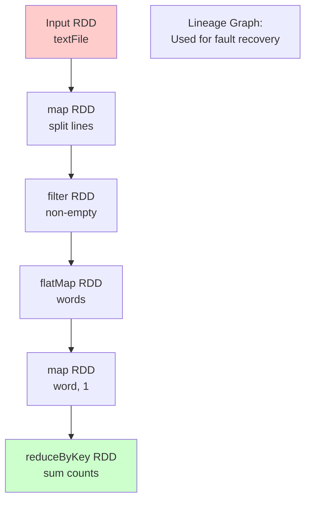
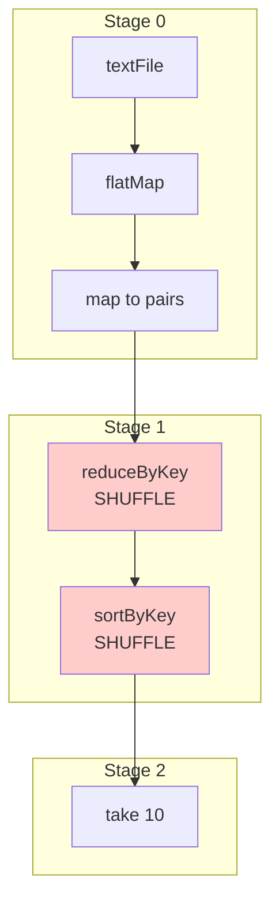

# Apache Spark

Apache Spark is a unified analytics engine for large-scale data processing that provides high-level APIs in Java, Scala, Python, and R. Spark's key innovation is in-memory computing with Resilient Distributed Datasets (RDDs), enabling it to run programs up to 100x faster than Hadoop MapReduce. Beyond batch processing, Spark supports streaming, machine learning, and graph processing in a single unified framework.

## Resilient Distributed Datasets (RDDs)

RDDs are Spark's fundamental data abstraction—an immutable, distributed collection of objects that can be operated on in parallel.

### RDD Properties

```javascript
class RDD {
  constructor(sparkContext, partitions, dependencies = []) {
    this.id = RDD.nextId++;
    this.sparkContext = sparkContext;
    this.partitions = partitions;
    this.dependencies = dependencies;  // Lineage for fault tolerance
    this.cached = false;
  }

  // Core RDD properties
  getPartitions() {
    return this.partitions;
  }

  getDependencies() {
    return this.dependencies;
  }

  compute(partition) {
    // Compute this partition (abstract method)
    throw new Error('Must implement compute()');
  }

  getPreferredLocations(partition) {
    // Where to run computations for this partition
    return partition.preferredLocations || [];
  }

  partitioner() {
    // Optional partitioner for key-value RDDs
    return null;
  }
}
```

### Creating RDDs

```javascript
class SparkContext {
  constructor(config) {
    this.config = config;
    this.rdds = new Map();
    this.nextRDDId = 0;
  }

  // Create RDD from collection
  parallelize(data, numPartitions = 4) {
    const partitionSize = Math.ceil(data.length / numPartitions);
    const partitions = [];

    for (let i = 0; i < numPartitions; i++) {
      const start = i * partitionSize;
      const end = Math.min(start + partitionSize, data.length);

      partitions.push({
        index: i,
        data: data.slice(start, end)
      });
    }

    return new ParallelCollectionRDD(this, partitions);
  }

  // Create RDD from text file
  textFile(path, numPartitions = null) {
    // Split file into partitions
    const partitions = this.createFilePartitions(path, numPartitions);
    return new HadoopRDD(this, path, partitions);
  }

  createFilePartitions(path, numPartitions) {
    // Get file size and split into partitions
    const fileSize = this.getFileSize(path);
    const partitionSize = Math.ceil(fileSize / (numPartitions || 4));

    const partitions = [];
    let offset = 0;

    while (offset < fileSize) {
      partitions.push({
        index: partitions.length,
        path,
        offset,
        length: Math.min(partitionSize, fileSize - offset)
      });

      offset += partitionSize;
    }

    return partitions;
  }
}

// Example: Create RDD
const sc = new SparkContext({ master: 'local[*]' });

const numbersRDD = sc.parallelize([1, 2, 3, 4, 5], 2);
// Partitions: [1, 2, 3] and [4, 5]

const textRDD = sc.textFile('/data/input.txt');
```

### RDD Lineage and Fault Tolerance



```javascript
class RDDLineage {
  // Narrow dependency: each parent partition used by at most one child partition
  static narrowDependency(parent, child) {
    return {
      type: 'NARROW',
      parent,
      child,
      getParentPartitions: (childPartition) => {
        return [parent.partitions[childPartition.index]];
      }
    };
  }

  // Wide dependency: multiple child partitions depend on each parent partition
  static wideDependency(parent, child, partitioner) {
    return {
      type: 'WIDE',
      parent,
      child,
      partitioner,
      getParentPartitions: (childPartition) => {
        // All parent partitions may contribute to this child partition
        return parent.partitions;
      }
    };
  }

  // Recover lost partition by recomputing from lineage
  static async recoverPartition(rdd, partitionIndex) {
    const partition = rdd.partitions[partitionIndex];

    // Check if RDD is already computed/cached
    if (rdd.cached && await this.cacheContains(rdd.id, partitionIndex)) {
      return await this.readFromCache(rdd.id, partitionIndex);
    }

    // Recompute from parent RDDs
    const dependencies = rdd.getDependencies();

    for (const dep of dependencies) {
      const parentPartitions = dep.getParentPartitions(partition);

      // Recursively recover parent partitions if needed
      for (const parentPartition of parentPartitions) {
        await this.recoverPartition(dep.parent, parentPartition.index);
      }
    }

    // Compute this partition
    return await rdd.compute(partition);
  }
}
```

## Transformations vs Actions

Spark operations are divided into transformations (lazy) and actions (eager).

### Transformations (Lazy)

Transformations create new RDDs from existing ones but don't compute results immediately:

```javascript
class TransformationRDD extends RDD {
  // map: apply function to each element
  map(func) {
    const mappedPartitions = this.partitions.map(p => ({
      ...p,
      compute: async () => {
        const parentData = await this.compute(p);
        return parentData.map(func);
      }
    }));

    return new MappedRDD(this.sparkContext, mappedPartitions, [
      RDDLineage.narrowDependency(this, null)
    ]);
  }

  // filter: keep elements matching predicate
  filter(predicate) {
    const filteredPartitions = this.partitions.map(p => ({
      ...p,
      compute: async () => {
        const parentData = await this.compute(p);
        return parentData.filter(predicate);
      }
    }));

    return new FilteredRDD(this.sparkContext, filteredPartitions, [
      RDDLineage.narrowDependency(this, null)
    ]);
  }

  // flatMap: apply function returning array, then flatten
  flatMap(func) {
    const flatMappedPartitions = this.partitions.map(p => ({
      ...p,
      compute: async () => {
        const parentData = await this.compute(p);
        return parentData.flatMap(func);
      }
    }));

    return new FlatMappedRDD(this.sparkContext, flatMappedPartitions, [
      RDDLineage.narrowDependency(this, null)
    ]);
  }

  // reduceByKey: aggregate values for each key
  reduceByKey(func, numPartitions = this.partitions.length) {
    const partitioner = new HashPartitioner(numPartitions);

    // This is a wide transformation (requires shuffle)
    return new ShuffledRDD(
      this.sparkContext,
      this,
      partitioner,
      func
    );
  }

  // groupByKey: group values for each key
  groupByKey(numPartitions = this.partitions.length) {
    const partitioner = new HashPartitioner(numPartitions);

    return new ShuffledRDD(
      this.sparkContext,
      this,
      partitioner,
      (values) => values  // Just group, don't reduce
    );
  }

  // join: join two RDDs by key
  join(other, numPartitions = this.partitions.length) {
    const partitioner = new HashPartitioner(numPartitions);

    return new JoinedRDD(
      this.sparkContext,
      this,
      other,
      partitioner
    );
  }
}

// Example transformations
const rdd = sc.parallelize([1, 2, 3, 4, 5]);

const doubled = rdd.map(x => x * 2);  // Lazy - nothing computed yet
const evens = doubled.filter(x => x % 4 === 0);  // Still lazy

// Word count with transformations
const lines = sc.textFile('/data/input.txt');
const words = lines.flatMap(line => line.split(' '));
const pairs = words.map(word => [word, 1]);
const counts = pairs.reduceByKey((a, b) => a + b);
// All lazy - no computation yet!
```

### Actions (Eager)

Actions trigger computation and return results:

```javascript
class ActionRDD extends TransformationRDD {
  // collect: return all elements to driver
  async collect() {
    const results = [];

    for (const partition of this.partitions) {
      const partitionData = await this.compute(partition);
      results.push(...partitionData);
    }

    return results;
  }

  // count: return number of elements
  async count() {
    let total = 0;

    for (const partition of this.partitions) {
      const partitionData = await this.compute(partition);
      total += partitionData.length;
    }

    return total;
  }

  // reduce: aggregate all elements
  async reduce(func) {
    const partitionResults = [];

    // Reduce within each partition
    for (const partition of this.partitions) {
      const partitionData = await this.compute(partition);

      if (partitionData.length === 0) continue;

      const partitionResult = partitionData.reduce(func);
      partitionResults.push(partitionResult);
    }

    // Reduce across partitions
    return partitionResults.reduce(func);
  }

  // take: return first n elements
  async take(n) {
    const results = [];

    for (const partition of this.partitions) {
      if (results.length >= n) break;

      const partitionData = await this.compute(partition);
      const toTake = Math.min(n - results.length, partitionData.length);

      results.push(...partitionData.slice(0, toTake));
    }

    return results;
  }

  // foreach: apply function to each element (for side effects)
  async foreach(func) {
    for (const partition of this.partitions) {
      const partitionData = await this.compute(partition);
      partitionData.forEach(func);
    }
  }

  // saveAsTextFile: write to HDFS
  async saveAsTextFile(path) {
    const hdfs = new HDFSClient(this.sparkContext.config.hdfs);

    for (const partition of this.partitions) {
      const partitionData = await this.compute(partition);
      const partitionPath = `${path}/part-${String(partition.index).padStart(5, '0')}`;

      const content = partitionData.join('\n');
      await hdfs.write(partitionPath, content);
    }
  }
}

// Example actions - these trigger computation
const result = await counts.collect();  // Computes entire DAG
console.log(result);  // [['hello', 3], ['world', 2], ...]

const total = await counts.count();  // Number of unique words

const top10 = await counts.takeOrdered(10, (a, b) => b[1] - a[1]);  // Top 10 words
```

## Lazy Evaluation and DAG Execution

Spark builds a DAG of operations and optimizes before execution:

```javascript
class DAGScheduler {
  constructor(sparkContext) {
    this.sc = sparkContext;
    this.stages = [];
    this.nextStageId = 0;
  }

  // Convert RDD lineage into execution stages
  createStages(finalRDD) {
    const stages = [];
    const visited = new Set();

    const createStage = (rdd) => {
      if (visited.has(rdd.id)) return;
      visited.add(rdd.id);

      const stageBoundaries = [];

      // Find shuffle dependencies (wide transformations)
      for (const dep of rdd.getDependencies()) {
        if (dep.type === 'WIDE') {
          // Wide dependency creates stage boundary
          const parentStage = createStage(dep.parent);
          stageBoundaries.push(parentStage);
        } else {
          // Narrow dependency - include in same stage
          createStage(dep.parent);
        }
      }

      // Create stage
      const stage = {
        id: this.nextStageId++,
        rdd,
        parents: stageBoundaries,
        tasks: this.createTasks(rdd)
      };

      stages.push(stage);
      return stage;
    };

    createStage(finalRDD);

    return stages;
  }

  createTasks(rdd) {
    return rdd.partitions.map(partition => ({
      stageId: this.nextStageId,
      partitionId: partition.index,
      rdd,
      partition,
      preferredLocations: rdd.getPreferredLocations(partition)
    }));
  }

  async submitJob(finalRDD, action) {
    console.log('Building DAG...');

    // Create execution plan
    const stages = this.createStages(finalRDD);

    console.log(`DAG has ${stages.length} stages`);

    // Topological sort of stages
    const sortedStages = this.topologicalSort(stages);

    // Execute stages in order
    for (const stage of sortedStages) {
      await this.executeStage(stage);
    }

    // Execute final action
    return await action(finalRDD);
  }

  async executeStage(stage) {
    console.log(`Executing stage ${stage.id} (${stage.tasks.length} tasks)`);

    // Wait for parent stages
    for (const parent of stage.parents) {
      await parent.completion;
    }

    // Execute tasks in parallel
    const taskExecutor = new TaskExecutor(this.sc);
    const results = await taskExecutor.executeTasks(stage.tasks);

    stage.completion = Promise.resolve(results);
    stage.completed = true;
  }

  topologicalSort(stages) {
    const sorted = [];
    const visited = new Set();

    const visit = (stage) => {
      if (visited.has(stage.id)) return;
      visited.add(stage.id);

      for (const parent of stage.parents) {
        visit(parent);
      }

      sorted.push(stage);
    };

    for (const stage of stages) {
      visit(stage);
    }

    return sorted;
  }
}
```

### DAG Visualization



## Spark SQL and DataFrames

DataFrames provide a higher-level abstraction with schema information and optimized execution:

```javascript
class DataFrame {
  constructor(sparkSession, schema, rdd) {
    this.sparkSession = sparkSession;
    this.schema = schema;
    this.rdd = rdd;
  }

  // Schema
  printSchema() {
    console.log('root');
    for (const field of this.schema.fields) {
      console.log(`|-- ${field.name}: ${field.type} (nullable = ${field.nullable})`);
    }
  }

  // Transformations
  select(...columns) {
    const selectedIndices = columns.map(col =>
      this.schema.fields.findIndex(f => f.name === col)
    );

    const newSchema = {
      fields: columns.map(col =>
        this.schema.fields.find(f => f.name === col)
      )
    };

    const newRDD = this.rdd.map(row =>
      selectedIndices.map(i => row[i])
    );

    return new DataFrame(this.sparkSession, newSchema, newRDD);
  }

  filter(condition) {
    const predicate = this.compileCondition(condition);
    const newRDD = this.rdd.filter(predicate);

    return new DataFrame(this.sparkSession, this.schema, newRDD);
  }

  groupBy(...columns) {
    return new GroupedData(this, columns);
  }

  join(other, condition, joinType = 'inner') {
    const joined = new JoinedDataFrame(this, other, condition, joinType);
    return joined.execute();
  }

  // Actions
  async show(numRows = 20) {
    const rows = await this.rdd.take(numRows);

    // Print header
    const header = this.schema.fields.map(f => f.name).join(' | ');
    console.log(header);
    console.log('-'.repeat(header.length));

    // Print rows
    for (const row of rows) {
      console.log(row.join(' | '));
    }
  }

  async collect() {
    return await this.rdd.collect();
  }

  async count() {
    return await this.rdd.count();
  }

  // SQL queries
  createOrReplaceTempView(name) {
    this.sparkSession.catalog.registerTable(name, this);
  }

  compileCondition(condition) {
    // Compile SQL-like condition to JavaScript function
    // e.g., "age > 18" => (row) => row[ageIndex] > 18
    return eval(`(row) => ${this.translateCondition(condition)}`);
  }
}

class SparkSession {
  constructor(config) {
    this.sparkContext = new SparkContext(config);
    this.catalog = new Catalog();
    this.sqlParser = new SQLParser();
  }

  // Create DataFrame from data
  createDataFrame(data, schema) {
    const rdd = this.sparkContext.parallelize(data);
    return new DataFrame(this, schema, rdd);
  }

  // Read from various sources
  read() {
    return new DataFrameReader(this);
  }

  // Execute SQL query
  async sql(query) {
    const plan = this.sqlParser.parse(query);
    const optimizedPlan = this.optimizePlan(plan);
    return this.executePlan(optimizedPlan);
  }

  optimizePlan(plan) {
    // Catalyst optimizer
    const optimizer = new CatalystOptimizer();

    // Apply optimization rules
    plan = optimizer.pushDownFilters(plan);
    plan = optimizer.columnPruning(plan);
    plan = optimizer.constantFolding(plan);

    return plan;
  }
}

// Example usage
const spark = new SparkSession({ master: 'local[*]' });

// Create DataFrame
const schema = {
  fields: [
    { name: 'name', type: 'string', nullable: false },
    { name: 'age', type: 'integer', nullable: false },
    { name: 'city', type: 'string', nullable: true }
  ]
};

const data = [
  ['Alice', 25, 'NYC'],
  ['Bob', 30, 'SF'],
  ['Charlie', 35, 'LA']
];

const df = spark.createDataFrame(data, schema);

// DataFrame operations
df.printSchema();

const filtered = df.filter('age > 25')
                   .select('name', 'city');

await filtered.show();

// SQL
df.createOrReplaceTempView('people');

const result = await spark.sql(`
  SELECT city, COUNT(*) as count
  FROM people
  WHERE age > 25
  GROUP BY city
  ORDER BY count DESC
`);

await result.show();
```

## Catalyst Optimizer

Spark SQL's Catalyst optimizer applies rule-based optimizations:

```javascript
class CatalystOptimizer {
  // Push filters down to data source
  pushDownFilters(plan) {
    if (plan.type === 'FILTER' && plan.child.type === 'SCAN') {
      // Move filter into scan operation
      return {
        type: 'SCAN',
        source: plan.child.source,
        filter: plan.predicate,  // Push filter to storage layer
        projection: plan.child.projection
      };
    }

    return plan;
  }

  // Remove unused columns early
  columnPruning(plan) {
    const usedColumns = this.findUsedColumns(plan);

    if (plan.type === 'SCAN') {
      // Only read needed columns
      return {
        ...plan,
        projection: plan.projection.filter(col => usedColumns.has(col))
      };
    }

    return plan;
  }

  // Evaluate constant expressions
  constantFolding(plan) {
    if (plan.type === 'FILTER') {
      const simplified = this.simplifyPredicate(plan.predicate);

      if (simplified === true) {
        // Filter always true - remove it
        return plan.child;
      } else if (simplified === false) {
        // Filter always false - return empty
        return { type: 'EMPTY' };
      }

      return { ...plan, predicate: simplified };
    }

    return plan;
  }

  // Join reordering for better performance
  joinReordering(plan) {
    if (plan.type === 'JOIN') {
      const leftSize = this.estimateSize(plan.left);
      const rightSize = this.estimateSize(plan.right);

      // Ensure smaller table is on the right (for broadcast join)
      if (leftSize < rightSize) {
        return {
          ...plan,
          left: plan.right,
          right: plan.left
        };
      }
    }

    return plan;
  }
}
```

## Caching and Persistence

Spark can cache RDDs in memory for faster repeated access:

```javascript
class CacheManager {
  constructor() {
    this.cache = new Map();  // RDD ID → cached partitions
    this.storageLevel = {
      MEMORY_ONLY: 1,
      MEMORY_AND_DISK: 2,
      DISK_ONLY: 3
    };
  }

  async cache(rdd, storageLevel = this.storageLevel.MEMORY_ONLY) {
    rdd.cached = true;
    rdd.storageLevel = storageLevel;

    console.log(`Caching RDD ${rdd.id} with ${storageLevel}`);

    // Compute and cache all partitions
    for (const partition of rdd.partitions) {
      const data = await rdd.compute(partition);

      await this.store(rdd.id, partition.index, data, storageLevel);
    }
  }

  async store(rddId, partitionIndex, data, storageLevel) {
    const key = `${rddId}-${partitionIndex}`;

    if (storageLevel === this.storageLevel.MEMORY_ONLY) {
      this.cache.set(key, data);
    } else if (storageLevel === this.storageLevel.MEMORY_AND_DISK) {
      try {
        this.cache.set(key, data);
      } catch (error) {
        // Out of memory - spill to disk
        await this.writeToDisk(key, data);
      }
    } else {
      await this.writeToDisk(key, data);
    }
  }

  async get(rddId, partitionIndex) {
    const key = `${rddId}-${partitionIndex}`;

    if (this.cache.has(key)) {
      return this.cache.get(key);
    }

    // Try reading from disk
    return await this.readFromDisk(key);
  }

  unpersist(rddId) {
    // Remove all cached partitions for this RDD
    for (const key of this.cache.keys()) {
      if (key.startsWith(`${rddId}-`)) {
        this.cache.delete(key);
      }
    }
  }
}

// Usage
const rdd = sc.textFile('/data/large-file.txt');

// Cache in memory for reuse
rdd.cache();  // or rdd.persist(StorageLevel.MEMORY_AND_DISK)

// First action: computes and caches
const count1 = await rdd.count();

// Second action: reads from cache (fast!)
const count2 = await rdd.count();

// Remove from cache when done
rdd.unpersist();
```

Apache Spark's combination of in-memory computing, lazy evaluation, and rich APIs makes it the de facto standard for big data processing, providing dramatic performance improvements over traditional MapReduce while supporting diverse workloads from batch to streaming to machine learning.
