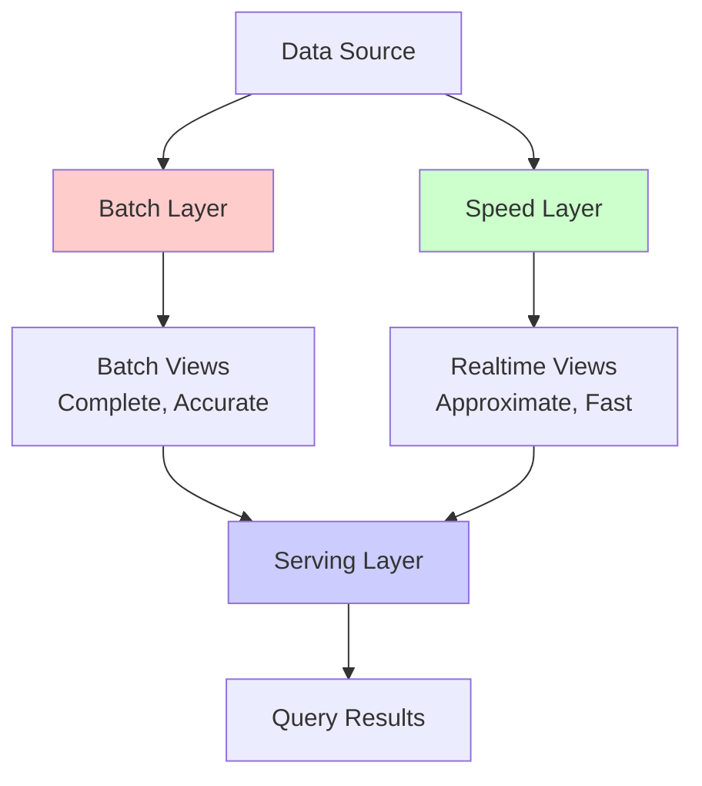
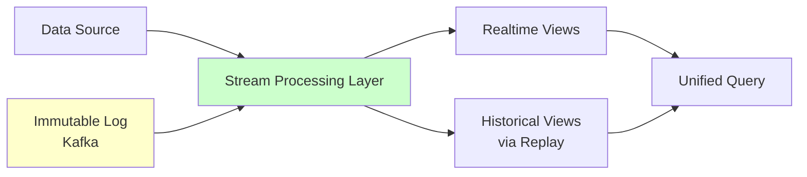

# Batch vs Stream Processing

The choice between batch and stream processing represents a fundamental architectural decision in big data systems. Batch processing excels at processing large volumes of historical data with high throughput, while stream processing enables real-time analysis of continuous data. Modern architectures like Lambda and Kappa attempt to unify these paradigms, providing both historical analysis and real-time insights.

## Batch Processing Characteristics

Batch processing operates on finite, complete datasets collected over time.

### Batch Processing Model

```javascript
class BatchProcessor {
  constructor(dataSource, outputSink) {
    this.dataSource = dataSource;
    this.outputSink = outputSink;
    this.schedule = '0 2 * * *';  // 2 AM daily
  }
  
  async execute() {
    console.log('Starting batch job...');
    
    // 1. Read entire dataset
    const dataset = await this.dataSource.readAll();
    console.log(`Processing ${dataset.length} records`);
    
    // 2. Process data
    const results = await this.process(dataset);
    
    // 3. Write results
    await this.outputSink.writeAll(results);
    
    console.log('Batch job complete');
  }
  
  async process(dataset) {
    // Map phase
    const mapped = dataset.map(record => this.map(record));
    
    // Shuffle and sort
    const shuffled = this.shuffle(mapped);
    
    // Reduce phase
    const reduced = this.reduce(shuffled);
    
    return reduced;
  }
}

// Example: Daily sales report
class DailySalesReport extends BatchProcessor {
  map(record) {
    return {
      product: record.product,
      revenue: record.quantity * record.price,
      date: record.date
    };
  }
  
  shuffle(records) {
    const grouped = new Map();
    
    for (const record of records) {
      const key = `${record.product}-${record.date}`;
      if (!grouped.has(key)) {
        grouped.set(key, []);
      }
      grouped.get(key).push(record);
    }
    
    return Array.from(grouped.entries());
  }
  
  reduce([key, records]) {
    const [product, date] = key.split('-');
    
    return {
      product,
      date,
      totalRevenue: records.reduce((sum, r) => sum + r.revenue, 0),
      transactionCount: records.length
    };
  }
}
```

### Batch Advantages

- **High throughput:** Process terabytes of data efficiently
- **Comprehensive analysis:** Access to complete historical data
- **Simpler programming model:** No need to handle out-of-order events
- **Cost-effective:** Can use cheaper resources during off-peak hours
- **Replayability:** Easy to reprocess data with new logic

### Batch Limitations

- **High latency:** Hours or days between data arrival and insights
- **Resource inefficiency:** Reprocesses unchanged data
- **Delayed error detection:** Problems discovered long after occurrence

## Stream Processing Characteristics

Stream processing analyzes data as it arrives in real-time.

### Stream Processing Model

```javascript
class StreamProcessor {
  constructor(inputStream, outputStream) {
    this.inputStream = inputStream;
    this.outputStream = outputStream;
    this.state = new StateStore();
  }
  
  async start() {
    console.log('Starting stream processor...');
    
    // Continuous processing
    while (true) {
      const event = await this.inputStream.read();
      
      if (!event) break;
      
      const result = await this.processEvent(event);
      
      if (result) {
        await this.outputStream.write(result);
      }
    }
  }
  
  async processEvent(event) {
    // Update state
    const currentState = await this.state.get(event.key);
    const newState = this.updateState(currentState, event);
    await this.state.put(event.key, newState);
    
    // Emit result if trigger condition met
    if (this.shouldEmit(newState)) {
      return this.formatOutput(newState);
    }
  }
}

// Example: Real-time fraud detection
class FraudDetectionStream extends StreamProcessor {
  async processEvent(transaction) {
    // Check transaction against real-time rules
    const userId = transaction.userId;
    const userHistory = await this.state.get(userId) || {
      transactions: [],
      totalAmount: 0,
      suspiciousCount: 0
    };
    
    // Update history
    userHistory.transactions.push(transaction);
    userHistory.totalAmount += transaction.amount;
    
    // Check for fraud patterns
    const isFraud = this.detectFraud(transaction, userHistory);
    
    if (isFraud) {
      userHistory.suspiciousCount++;
      
      // Emit alert immediately
      return {
        type: 'FRAUD_ALERT',
        transaction,
        reason: 'Unusual transaction pattern',
        timestamp: Date.now()
      };
    }
    
    await this.state.put(userId, userHistory);
  }
  
  detectFraud(transaction, history) {
    // Rule 1: Amount > 10x average
    const avgAmount = history.totalAmount / history.transactions.length;
    if (transaction.amount > avgAmount * 10) {
      return true;
    }
    
    // Rule 2: Multiple transactions in short time
    const recentCount = history.transactions.filter(t =>
      Date.now() - t.timestamp < 60000  // Last minute
    ).length;
    
    if (recentCount > 5) {
      return true;
    }
    
    return false;
  }
}
```

### Stream Advantages

- **Low latency:** Millisecond to second latency
- **Continuous insights:** Real-time monitoring and alerting
- **Incremental computation:** Only process new data
- **Event-driven:** React immediately to important events

### Stream Limitations

- **Limited historical context:** Can't access all historical data easily
- **Complexity:** Handling late data, out-of-order events, state management
- **Higher cost:** Requires always-on infrastructure

## Lambda Architecture

Lambda architecture combines batch and stream processing to provide both comprehensive historical analysis and real-time views.



### Lambda Implementation

```javascript
class LambdaArchitecture {
  constructor() {
    this.batchLayer = new BatchLayer();
    this.speedLayer = new SpeedLayer();
    this.servingLayer = new ServingLayer();
  }
  
  async ingestData(event) {
    // Send to both layers
    await Promise.all([
      this.batchLayer.append(event),
      this.speedLayer.process(event)
    ]);
  }
  
  async query(params) {
    // Query both layers and merge results
    const [batchResults, realtimeResults] = await Promise.all([
      this.servingLayer.queryBatch(params),
      this.servingLayer.queryRealtime(params)
    ]);
    
    // Merge: batch view + realtime view
    return this.merge(batchResults, realtimeResults, params);
  }
  
  merge(batchResults, realtimeResults, params) {
    // Batch view covers data up to last batch run
    // Realtime view covers data since last batch run
    
    const batchEndTime = this.batchLayer.getLastRunTime();
    
    // Filter realtime results to only include new data
    const newRealtimeData = realtimeResults.filter(r =>
      r.timestamp > batchEndTime
    );
    
    // Combine results
    return {
      historical: batchResults,
      realtime: newRealtimeData,
      combined: this.aggregate(batchResults, newRealtimeData)
    };
  }
}

class BatchLayer {
  constructor() {
    this.storage = new HDFSStorage();
    this.lastRunTime = 0;
  }
  
  async append(event) {
    // Append to immutable log
    await this.storage.append('/raw-data', event);
  }
  
  async computeBatchViews() {
    console.log('Running batch computation...');
    
    // Read all historical data
    const allData = await this.storage.readAll('/raw-data');
    
    // Compute views
    const views = {
      hourlyAggregates: this.computeHourlyAggregates(allData),
      dailyAggregates: this.computeDailyAggregates(allData),
      userProfiles: this.computeUserProfiles(allData)
    };
    
    // Write to serving layer
    await this.servingLayer.updateBatchViews(views);
    
    this.lastRunTime = Date.now();
    
    console.log('Batch computation complete');
  }
  
  getLastRunTime() {
    return this.lastRunTime;
  }
}

class SpeedLayer {
  constructor() {
    this.state = new StateStore();
    this.windowedAggregates = new Map();
  }
  
  async process(event) {
    // Incremental computation on recent data
    const window = this.getWindow(event.timestamp);
    
    const current = this.windowedAggregates.get(window) || {
      count: 0,
      sum: 0
    };
    
    current.count++;
    current.sum += event.value;
    
    this.windowedAggregates.set(window, current);
    
    // Update serving layer
    await this.servingLayer.updateRealtimeView(window, current);
  }
  
  getWindow(timestamp) {
    const windowSize = 3600000;  // 1 hour
    return Math.floor(timestamp / windowSize) * windowSize;
  }
}

class ServingLayer {
  constructor() {
    this.batchViews = new Map();
    this.realtimeViews = new Map();
  }
  
  async updateBatchViews(views) {
    for (const [key, value] of Object.entries(views)) {
      this.batchViews.set(key, value);
    }
  }
  
  async updateRealtimeView(key, value) {
    this.realtimeViews.set(key, value);
  }
  
  async queryBatch(params) {
    return this.batchViews.get(params.view) || [];
  }
  
  async queryRealtime(params) {
    return Array.from(this.realtimeViews.entries());
  }
}
```

### Lambda Challenges

- **Code duplication:** Batch and speed layers implement same logic differently
- **Complexity:** Maintaining two systems
- **Consistency:** Merging batch and realtime views correctly
- **Operational overhead:** Two pipelines to monitor and maintain

## Kappa Architecture

Kappa architecture simplifies Lambda by using only stream processing for both real-time and historical data.



### Kappa Implementation

```javascript
class KappaArchitecture {
  constructor() {
    this.kafka = new KafkaCluster();
    this.streamProcessor = new StreamProcessor();
    this.retentionPolicy = 'INFINITE';  // Keep all data
  }
  
  async ingestData(event) {
    // Write to immutable log
    await this.kafka.produce('events', event);
  }
  
  async query(params) {
    // Single view - no merging needed
    return await this.streamProcessor.query(params);
  }
  
  async reprocessData(newLogic) {
    console.log('Reprocessing historical data with new logic...');
    
    // Create new stream processing job
    const newProcessor = new StreamProcessor(newLogic);
    
    // Replay from beginning of log
    await newProcessor.startFromOffset(0);
    
    // When caught up, switch to new processor
    await this.switchProcessors(newProcessor);
    
    console.log('Reprocessing complete');
  }
  
  async switchProcessors(newProcessor) {
    // Seamlessly switch from old to new processor
    await this.streamProcessor.pause();
    await newProcessor.catchUp();
    
    this.streamProcessor = newProcessor;
    
    await this.streamProcessor.resume();
  }
}

// Unified stream processing
class UnifiedStreamProcessor {
  constructor() {
    this.state = new StateBackend();
  }
  
  async processEvent(event) {
    // Same logic handles real-time and historical data
    const result = await this.transform(event);
    
    // Update materialized views
    await this.updateViews(result);
    
    return result;
  }
  
  async transform(event) {
    // Business logic
    return {
      ...event,
      processed: true,
      processedAt: Date.now()
    };
  }
  
  async updateViews(result) {
    // Update real-time view
    await this.state.updateRealtimeView(result);
    
    // Also contributes to historical aggregates
    await this.state.updateHistoricalView(result);
  }
  
  async query(params) {
    // Query unified view
    if (params.timeRange === 'realtime') {
      return await this.state.queryRealtimeView(params);
    } else {
      return await this.state.queryHistoricalView(params);
    }
  }
}
```

### Kappa Advantages

- **Simpler:** Single processing engine
- **No code duplication:** One codebase for all data
- **Easier reprocessing:** Replay from log
- **Lower operational overhead:** One system to maintain

### Kappa Requirements

- **Efficient log storage:** Need to retain all data in Kafka
- **Fast replay:** Must be able to reprocess historical data quickly
- **Versioning:** Handle schema evolution in the log

## Comparison Matrix

```javascript
const comparisonMatrix = {
  'Latency': {
    batch: 'Hours to days',
    stream: 'Milliseconds to seconds',
    lambda: 'Seconds (hybrid)',
    kappa: 'Milliseconds to seconds'
  },
  
  'Throughput': {
    batch: 'Very high (TB/hour)',
    stream: 'High (GB/sec)',
    lambda: 'High (both)',
    kappa: 'High'
  },
  
  'Complexity': {
    batch: 'Low',
    stream: 'Medium',
    lambda: 'High (two systems)',
    kappa: 'Medium'
  },
  
  'Reprocessing': {
    batch: 'Easy (rerun job)',
    stream: 'Hard (if no log replay)',
    lambda: 'Medium (batch layer)',
    kappa: 'Easy (replay log)'
  },
  
  'Use Cases': {
    batch: 'Historical analysis, ML training, ETL',
    stream: 'Monitoring, fraud detection, real-time dashboards',
    lambda: 'Both historical and real-time requirements',
    kappa: 'Event-driven apps, streaming analytics'
  }
};
```

## Choosing an Architecture

```javascript
class ArchitectureSelector {
  static recommend(requirements) {
    const { latency, volume, complexity, reprocessing } = requirements;
    
    // Pure batch: High volume, latency tolerant, simple
    if (latency === 'hours' && complexity === 'low') {
      return {
        architecture: 'Batch',
        rationale: 'Latency requirements allow batch processing. Simpler and more cost-effective.'
      };
    }
    
    // Pure stream: Low latency, manageable volume
    if (latency === 'seconds' && volume === 'moderate') {
      return {
        architecture: 'Stream',
        rationale: 'Real-time requirements with manageable data volume.'
      };
    }
    
    // Lambda: Need both historical accuracy and real-time
    if (latency === 'mixed' && reprocessing === 'occasional') {
      return {
        architecture: 'Lambda',
        rationale: 'Requires both comprehensive historical views and real-time processing.'
      };
    }
    
    // Kappa: Stream-first, frequent reprocessing
    if (latency === 'seconds' && reprocessing === 'frequent') {
      return {
        architecture: 'Kappa',
        rationale: 'Stream-first approach with efficient reprocessing via log replay.'
      };
    }
    
    return {
      architecture: 'Hybrid',
      rationale: 'Consider custom combination based on specific needs.'
    };
  }
}
```

The choice between batch and stream processing, and architectures like Lambda and Kappa, depends on latency requirements, data volumes, operational complexity, and reprocessing needs. Modern systems often use hybrid approaches, applying the right processing model to each specific use case.
