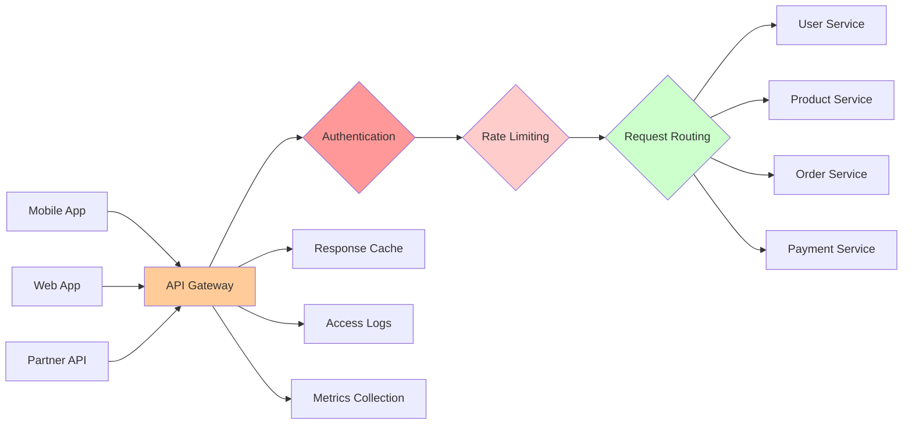

# API Gateways

An API Gateway serves as the single entry point for all client requests to a microservices architecture, handling cross-cutting concerns like authentication, rate limiting, request routing, protocol translation, and monitoring. Rather than having clients communicate directly with multiple microservices, they interact with the gateway, which routes requests to appropriate services. This pattern simplifies client development, enhances security, and provides centralized control over API traffic.

## The API Gateway Pattern

The gateway acts as a reverse proxy sitting between clients and services.



### Basic Gateway Implementation

```javascript
class APIGateway {
  constructor() {
    this.routes = new Map();
    this.middlewares = [];
    this.serviceRegistry = new ServiceRegistry();
  }
  
  use(middleware) {
    this.middlewares.push(middleware);
  }
  
  registerRoute(pattern, serviceName, options = {}) {
    this.routes.set(pattern, {
      serviceName,
      methods: options.methods || ['GET', 'POST', 'PUT', 'DELETE'],
      authRequired: options.authRequired !== false,
      rateLimit: options.rateLimit
    });
  }
  
  async handleRequest(req, res) {
    try {
      // Apply middlewares
      const context = { req, res, metadata: {} };
      
      for (const middleware of this.middlewares) {
        await middleware(context);
        
        if (context.handled) {
          return; // Middleware handled the request
        }
      }
      
      // Route to service
      const route = this.findRoute(req.path, req.method);
      
      if (!route) {
        return res.status(404).json({ error: 'Route not found' });
      }
      
      // Get service instance
      const serviceUrl = await this.serviceRegistry.getService(route.serviceName);
      
      // Forward request
      const response = await this.forwardRequest(serviceUrl, req);
      
      // Return response
      res.status(response.status).json(response.data);
      
    } catch (error) {
      console.error('Gateway error:', error);
      res.status(500).json({ error: 'Internal server error' });
    }
  }
  
  findRoute(path, method) {
    for (const [pattern, route] of this.routes) {
      if (this.matchPath(path, pattern) && route.methods.includes(method)) {
        return route;
      }
    }
    return null;
  }
  
  matchPath(path, pattern) {
    const regex = new RegExp('^' + pattern.replace(/:\w+/g, '([^/]+)') + '$');
    return regex.test(path);
  }
  
  async forwardRequest(serviceUrl, req) {
    const response = await fetch(`${serviceUrl}${req.path}`, {
      method: req.method,
      headers: this.forwardHeaders(req.headers),
      body: req.method !== 'GET' ? JSON.stringify(req.body) : undefined
    });
    
    return {
      status: response.status,
      data: await response.json()
    };
  }
  
  forwardHeaders(headers) {
    // Forward relevant headers, remove gateway-specific ones
    const forwarded = { ...headers };
    delete forwarded['host'];
    delete forwarded['connection'];
    
    return forwarded;
  }
}

// Setup gateway
const gateway = new APIGateway();

// Register routes
gateway.registerRoute('/api/users/:id', 'user-service');
gateway.registerRoute('/api/products/:id', 'product-service');
gateway.registerRoute('/api/orders/:id', 'order-service', {
  authRequired: true,
  rateLimit: { requests: 100, window: 60000 }
});

// Start server
const server = express();
server.all('*', (req, res) => gateway.handleRequest(req, res));
server.listen(8080);
```

## Authentication and Authorization

The gateway enforces authentication before routing requests.

```javascript
class AuthenticationMiddleware {
  constructor(jwtSecret) {
    this.jwtSecret = jwtSecret;
    this.publicPaths = ['/api/auth/login', '/api/auth/register'];
  }
  
  async handle(context) {
    const { req, res } = context;
    
    // Skip auth for public paths
    if (this.isPublicPath(req.path)) {
      return;
    }
    
    // Extract token
    const token = this.extractToken(req);
    
    if (!token) {
      res.status(401).json({ error: 'No authentication token provided' });
      context.handled = true;
      return;
    }
    
    try {
      // Verify JWT
      const decoded = jwt.verify(token, this.jwtSecret);
      
      // Add user info to context
      context.user = {
        id: decoded.sub,
        email: decoded.email,
        roles: decoded.roles || []
      };
      
      // Add user ID header for downstream services
      req.headers['X-User-ID'] = decoded.sub;
      req.headers['X-User-Roles'] = decoded.roles.join(',');
      
    } catch (error) {
      res.status(401).json({ error: 'Invalid authentication token' });
      context.handled = true;
      return;
    }
  }
  
  extractToken(req) {
    const authHeader = req.headers['authorization'];
    
    if (!authHeader) return null;
    
    const parts = authHeader.split(' ');
    
    if (parts.length !== 2 || parts[0] !== 'Bearer') {
      return null;
    }
    
    return parts[1];
  }
  
  isPublicPath(path) {
    return this.publicPaths.some(publicPath => 
      path.startsWith(publicPath)
    );
  }
}

// Authorization middleware
class AuthorizationMiddleware {
  async handle(context) {
    const { req, res, user } = context;
    
    // Get route configuration
    const route = this.getRoute(req.path);
    
    if (!route || !route.requiredRoles) {
      return; // No authorization required
    }
    
    // Check if user has required role
    const hasRole = route.requiredRoles.some(role => 
      user.roles.includes(role)
    );
    
    if (!hasRole) {
      res.status(403).json({ 
        error: 'Insufficient permissions',
        required: route.requiredRoles,
        actual: user.roles
      });
      context.handled = true;
      return;
    }
  }
}

// Usage
gateway.use(new AuthenticationMiddleware('secret-key'));
gateway.use(new AuthorizationMiddleware());
```

## Rate Limiting

Protect services from overload by limiting request rates.

```javascript
class RateLimitMiddleware {
  constructor() {
    this.limits = new Map(); // key → { count, resetTime }
    this.defaultLimit = { requests: 1000, window: 60000 }; // 1000 req/min
  }
  
  async handle(context) {
    const { req, res } = context;
    
    // Determine rate limit key (by user, IP, or API key)
    const key = this.getRateLimitKey(req);
    
    // Get limit for this route
    const limit = this.getLimit(req.path);
    
    // Check rate limit
    const allowed = await this.checkRateLimit(key, limit);
    
    if (!allowed) {
      const resetTime = this.limits.get(key).resetTime;
      
      res.status(429).json({
        error: 'Rate limit exceeded',
        limit: limit.requests,
        window: limit.window,
        resetAt: new Date(resetTime).toISOString()
      });
      
      res.setHeader('X-RateLimit-Limit', limit.requests);
      res.setHeader('X-RateLimit-Remaining', 0);
      res.setHeader('X-RateLimit-Reset', resetTime);
      
      context.handled = true;
      return;
    }
    
    // Add rate limit headers
    const bucket = this.limits.get(key);
    res.setHeader('X-RateLimit-Limit', limit.requests);
    res.setHeader('X-RateLimit-Remaining', limit.requests - bucket.count);
    res.setHeader('X-RateLimit-Reset', bucket.resetTime);
  }
  
  async checkRateLimit(key, limit) {
    const now = Date.now();
    let bucket = this.limits.get(key);
    
    // Create or reset bucket
    if (!bucket || now > bucket.resetTime) {
      bucket = {
        count: 0,
        resetTime: now + limit.window
      };
      this.limits.set(key, bucket);
    }
    
    // Increment counter
    bucket.count++;
    
    // Check if over limit
    return bucket.count <= limit.requests;
  }
  
  getRateLimitKey(req) {
    // Prefer user ID, fall back to IP
    return req.headers['X-User-ID'] || req.ip;
  }
  
  getLimit(path) {
    // Different limits for different paths
    if (path.startsWith('/api/search')) {
      return { requests: 100, window: 60000 }; // Lower limit for expensive operations
    }
    
    return this.defaultLimit;
  }
}

// Token bucket algorithm for smoother rate limiting
class TokenBucketRateLimiter {
  constructor(capacity, refillRate) {
    this.capacity = capacity; // Max tokens
    this.refillRate = refillRate; // Tokens per second
    this.buckets = new Map(); // key → { tokens, lastRefill }
  }
  
  async tryConsume(key, tokens = 1) {
    const now = Date.now();
    let bucket = this.buckets.get(key);
    
    if (!bucket) {
      bucket = {
        tokens: this.capacity,
        lastRefill: now
      };
      this.buckets.set(key, bucket);
    }
    
    // Refill tokens based on time elapsed
    const elapsed = (now - bucket.lastRefill) / 1000; // seconds
    const tokensToAdd = elapsed * this.refillRate;
    bucket.tokens = Math.min(this.capacity, bucket.tokens + tokensToAdd);
    bucket.lastRefill = now;
    
    // Try to consume tokens
    if (bucket.tokens >= tokens) {
      bucket.tokens -= tokens;
      return true;
    }
    
    return false;
  }
}
```

## Request Routing and Load Balancing

Route requests to appropriate service instances with load balancing.

```javascript
class IntelligentRouter {
  constructor() {
    this.serviceRegistry = new ServiceRegistry();
    this.loadBalancer = new LoadBalancer();
    this.circuitBreakers = new Map();
  }
  
  async route(req) {
    // Determine target service
    const serviceName = this.getServiceName(req.path);
    
    // Get healthy instances
    const instances = await this.serviceRegistry.getHealthyInstances(serviceName);
    
    if (instances.length === 0) {
      throw new Error(`No healthy instances of ${serviceName}`);
    }
    
    // Select instance with load balancing
    const instance = await this.loadBalancer.select(instances, req);
    
    // Check circuit breaker
    const circuitBreaker = this.getCircuitBreaker(instance.id);
    
    if (circuitBreaker.isOpen()) {
      // Try different instance
      return await this.routeToFallback(serviceName, instances, req);
    }
    
    try {
      // Forward request
      const response = await this.forwardToInstance(instance, req);
      
      circuitBreaker.recordSuccess();
      
      return response;
      
    } catch (error) {
      circuitBreaker.recordFailure();
      
      // Retry with different instance
      return await this.routeToFallback(serviceName, instances, req);
    }
  }
  
  async routeToFallback(serviceName, instances, req) {
    // Find instance with open circuit breaker
    const available = instances.filter(instance => {
      const cb = this.getCircuitBreaker(instance.id);
      return !cb.isOpen();
    });
    
    if (available.length === 0) {
      throw new Error(`All instances of ${serviceName} unavailable`);
    }
    
    const instance = this.loadBalancer.select(available, req);
    return await this.forwardToInstance(instance, req);
  }
  
  getCircuitBreaker(instanceId) {
    if (!this.circuitBreakers.has(instanceId)) {
      this.circuitBreakers.set(instanceId, new CircuitBreaker({
        failureThreshold: 5,
        timeout: 30000
      }));
    }
    
    return this.circuitBreakers.get(instanceId);
  }
}

class LoadBalancer {
  constructor(algorithm = 'round-robin') {
    this.algorithm = algorithm;
    this.counters = new Map();
  }
  
  select(instances, req) {
    switch (this.algorithm) {
      case 'round-robin':
        return this.roundRobin(instances);
        
      case 'least-connections':
        return this.leastConnections(instances);
        
      case 'weighted':
        return this.weighted(instances);
        
      case 'consistent-hash':
        return this.consistentHash(instances, req);
        
      default:
        return instances[0];
    }
  }
  
  roundRobin(instances) {
    const key = 'round-robin';
    const counter = this.counters.get(key) || 0;
    
    const instance = instances[counter % instances.length];
    
    this.counters.set(key, counter + 1);
    
    return instance;
  }
  
  leastConnections(instances) {
    return instances.reduce((least, instance) => 
      instance.connections < least.connections ? instance : least
    );
  }
  
  weighted(instances) {
    // Select based on weight (higher weight = higher probability)
    const totalWeight = instances.reduce((sum, i) => sum + i.weight, 0);
    let random = Math.random() * totalWeight;
    
    for (const instance of instances) {
      random -= instance.weight;
      if (random <= 0) {
        return instance;
      }
    }
    
    return instances[instances.length - 1];
  }
  
  consistentHash(instances, req) {
    // Hash user ID or session for sticky sessions
    const key = req.headers['X-User-ID'] || req.sessionId;
    const hash = this.hash(key);
    
    return instances[hash % instances.length];
  }
  
  hash(str) {
    let hash = 0;
    for (let i = 0; i < str.length; i++) {
      hash = ((hash << 5) - hash) + str.charCodeAt(i);
      hash = hash & hash;
    }
    return Math.abs(hash);
  }
}
```

## Response Transformation and Aggregation

Transform and aggregate responses from multiple services.

```javascript
class ResponseAggregator {
  async aggregateUserProfile(userId) {
    // Fetch data from multiple services in parallel
    const [user, orders, recommendations] = await Promise.allSettled([
      this.userService.getUser(userId),
      this.orderService.getUserOrders(userId),
      this.recommendationService.getRecommendations(userId)
    ]);
    
    // Aggregate into single response
    return {
      user: user.status === 'fulfilled' ? user.value : null,
      orders: orders.status === 'fulfilled' ? orders.value : [],
      recommendations: recommendations.status === 'fulfilled' 
        ? recommendations.value 
        : this.getDefaultRecommendations()
    };
  }
  
  transformResponse(serviceResponse, format) {
    // Transform service response to client format
    if (format === 'mobile') {
      return this.transformForMobile(serviceResponse);
    } else if (format === 'web') {
      return this.transformForWeb(serviceResponse);
    }
    
    return serviceResponse;
  }
  
  transformForMobile(data) {
    // Simplified response for mobile
    return {
      id: data.id,
      name: data.name,
      imageUrl: data.thumbnailUrl, // Use thumbnail instead of full image
      price: data.price,
      available: data.stock > 0
    };
  }
}
```

## Kong API Gateway

Kong is a popular open-source API gateway built on Nginx.

```yaml
# Kong declarative configuration
_format_version: "2.1"

services:
  - name: user-service
    url: http://user-service:3000
    routes:
      - name: user-routes
        paths:
          - /api/users
        methods:
          - GET
          - POST
        plugins:
          - name: rate-limiting
            config:
              minute: 100
              policy: local
          - name: jwt
            config:
              secret_is_base64: false

  - name: order-service
    url: http://order-service:3000
    routes:
      - name: order-routes
        paths:
          - /api/orders
        plugins:
          - name: jwt
          - name: request-transformer
            config:
              add:
                headers:
                  - X-Service-Name:order-service

plugins:
  - name: cors
    config:
      origins:
        - http://localhost:3001
      methods:
        - GET
        - POST
      headers:
        - Authorization
        - Content-Type
      
  - name: prometheus
    config:
      per_consumer: true
```

## AWS API Gateway

AWS API Gateway is a fully managed service for creating and managing APIs.

```javascript
// AWS API Gateway configuration (CloudFormation)
const apiGatewayConfig = {
  Resources: {
    ApiGateway: {
      Type: 'AWS::ApiGatewayV2::Api',
      Properties: {
        Name: 'microservices-api',
        ProtocolType: 'HTTP',
        CorsConfiguration: {
          AllowOrigins: ['*'],
          AllowMethods: ['GET', 'POST', 'PUT', 'DELETE'],
          AllowHeaders: ['Content-Type', 'Authorization']
        }
      }
    },
    
    UserServiceIntegration: {
      Type: 'AWS::ApiGatewayV2::Integration',
      Properties: {
        ApiId: { Ref: 'ApiGateway' },
        IntegrationType: 'HTTP_PROXY',
        IntegrationUri: 'http://user-service.internal:3000',
        IntegrationMethod: 'ANY',
        PayloadFormatVersion: '1.0'
      }
    },
    
    UsersRoute: {
      Type: 'AWS::ApiGatewayV2::Route',
      Properties: {
        ApiId: { Ref: 'ApiGateway' },
        RouteKey: 'ANY /users/{proxy+}',
        Target: {
          'Fn::Join': ['/', [
            'integrations',
            { Ref: 'UserServiceIntegration' }
          ]]
        },
        AuthorizationType: 'JWT',
        AuthorizerId: { Ref: 'JWTAuthorizer' }
      }
    },
    
    JWTAuthorizer: {
      Type: 'AWS::ApiGatewayV2::Authorizer',
      Properties: {
        ApiId: { Ref: 'ApiGateway' },
        AuthorizerType: 'JWT',
        IdentitySource: ['$request.header.Authorization'],
        JwtConfiguration: {
          Audience: ['api'],
          Issuer: 'https://auth.example.com'
        }
      }
    },
    
    ThrottlingSettings: {
      Type: 'AWS::ApiGatewayV2::Stage',
      Properties: {
        ApiId: { Ref: 'ApiGateway' },
        StageName: 'prod',
        ThrottleSettings: {
          RateLimit: 1000,
          BurstLimit: 2000
        }
      }
    }
  }
};
```

API Gateways provide centralized control over microservices communication, handling authentication, rate limiting, routing, and protocol translation while shielding internal architecture from external clients and enabling independent service evolution.
