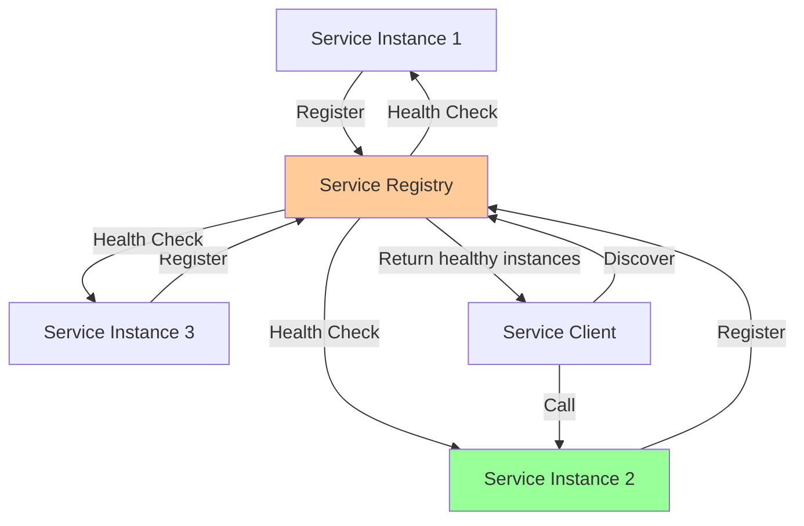

# Service Discovery

In microservices architectures, services are dynamically deployed across multiple hosts with changing IP addresses and ports. Service discovery solves the problem of how services locate and communicate with each other in this dynamic environment. Rather than hardcoding service locations, discovery mechanisms automatically track available service instances and route traffic appropriately. This chapter explores client-side and server-side discovery patterns, implementations using Consul and Kubernetes DNS, and health checking strategies.

## The Service Discovery Problem

Traditional static configuration doesn't work in dynamic cloud environments.

```javascript
// Static configuration - doesn't work in microservices
class StaticServiceLocator {
  constructor() {
    this.services = {
      'user-service': 'http://10.0.1.5:3000',
      'order-service': 'http://10.0.1.6:3000',
      'payment-service': 'http://10.0.1.7:3000'
    };
  }
  
  getServiceURL(serviceName) {
    return this.services[serviceName];
  }
}

// Problems:
// 1. What if service moves to different IP?
// 2. What if service has multiple instances?
// 3. What if instance becomes unhealthy?
// 4. How to add new instances dynamically?
```

Service discovery provides dynamic service location:



## Client-Side Discovery

In client-side discovery, the client queries the service registry and selects an instance.

### Client-Side Discovery Pattern

```javascript
class ClientSideDiscovery {
  constructor(serviceRegistry) {
    this.serviceRegistry = serviceRegistry;
    this.loadBalancer = new LoadBalancer();
    this.cache = new Map(); // Cache service instances
    this.cacheTTL = 30000; // 30 seconds
  }
  
  async callService(serviceName, path, options = {}) {
    // Get service instances
    const instances = await this.getServiceInstances(serviceName);
    
    if (instances.length === 0) {
      throw new Error(`No instances available for ${serviceName}`);
    }
    
    // Client performs load balancing
    const instance = this.loadBalancer.select(instances);
    
    // Make request
    try {
      const response = await fetch(`${instance.url}${path}`, {
        method: options.method || 'GET',
        headers: options.headers,
        body: options.body
      });
      
      return await response.json();
      
    } catch (error) {
      // On failure, mark instance as unhealthy and retry with another
      await this.markUnhealthy(instance);
      
      const healthyInstances = instances.filter(i => i.id !== instance.id);
      
      if (healthyInstances.length > 0) {
        return await this.callService(serviceName, path, options);
      }
      
      throw error;
    }
  }
  
  async getServiceInstances(serviceName) {
    const cached = this.cache.get(serviceName);
    
    // Use cache if available and fresh
    if (cached && Date.now() - cached.timestamp < this.cacheTTL) {
      return cached.instances;
    }
    
    // Query service registry
    const instances = await this.serviceRegistry.lookup(serviceName);
    
    // Filter to healthy instances only
    const healthy = instances.filter(instance => instance.status === 'healthy');
    
    // Cache results
    this.cache.set(serviceName, {
      instances: healthy,
      timestamp: Date.now()
    });
    
    return healthy;
  }
  
  async markUnhealthy(instance) {
    // Remove from local cache
    for (const [serviceName, cached] of this.cache) {
      cached.instances = cached.instances.filter(i => i.id !== instance.id);
    }
    
    console.log(`Marked instance ${instance.id} as unhealthy`);
  }
}

// Usage
const discovery = new ClientSideDiscovery(new ConsulRegistry());

const orderServiceClient = {
  async createOrder(order) {
    return await discovery.callService('order-service', '/orders', {
      method: 'POST',
      headers: { 'Content-Type': 'application/json' },
      body: JSON.stringify(order)
    });
  },
  
  async getOrder(orderId) {
    return await discovery.callService('order-service', `/orders/${orderId}`);
  }
};
```

### Advantages

- Simple, no additional infrastructure
- Client controls load balancing
- Client can implement custom routing logic

### Disadvantages

- Service discovery logic in every client
- Client must implement load balancing
- Clients must handle service registry protocol

## Server-Side Discovery

In server-side discovery, a load balancer queries the service registry and routes requests.

### Server-Side Discovery Pattern

```javascript
class ServerSideLoadBalancer {
  constructor(serviceRegistry) {
    this.serviceRegistry = serviceRegistry;
    this.instanceCache = new Map();
    this.healthCheckInterval = 10000; // 10 seconds
    
    this.startHealthChecking();
  }
  
  async handleRequest(req, res) {
    // Extract service name from request
    const serviceName = this.extractServiceName(req.path);
    
    // Get available instances
    const instances = await this.getHealthyInstances(serviceName);
    
    if (instances.length === 0) {
      return res.status(503).json({
        error: 'Service Unavailable',
        service: serviceName
      });
    }
    
    // Select instance (round-robin)
    const instance = this.selectInstance(instances);
    
    // Forward request
    await this.forwardRequest(instance, req, res);
  }
  
  async getHealthyInstances(serviceName) {
    // Check cache first
    if (this.instanceCache.has(serviceName)) {
      return this.instanceCache.get(serviceName);
    }
    
    // Query registry
    const instances = await this.serviceRegistry.getHealthyInstances(serviceName);
    
    // Cache instances
    this.instanceCache.set(serviceName, instances);
    
    return instances;
  }
  
  startHealthChecking() {
    setInterval(async () => {
      // Refresh instance cache periodically
      for (const serviceName of this.instanceCache.keys()) {
        const instances = await this.serviceRegistry.getHealthyInstances(serviceName);
        this.instanceCache.set(serviceName, instances);
      }
    }, this.healthCheckInterval);
  }
  
  selectInstance(instances) {
    // Round-robin selection
    const index = Math.floor(Math.random() * instances.length);
    return instances[index];
  }
  
  async forwardRequest(instance, req, res) {
    try {
      const response = await fetch(`${instance.url}${req.path}`, {
        method: req.method,
        headers: this.prepareHeaders(req.headers),
        body: req.method !== 'GET' ? req.body : undefined
      });
      
      res.status(response.status);
      res.send(await response.json());
      
    } catch (error) {
      console.error(`Failed to forward to ${instance.id}:`, error);
      res.status(500).json({ error: 'Internal Server Error' });
    }
  }
  
  prepareHeaders(headers) {
    const forwarded = { ...headers };
    delete forwarded['host'];
    return forwarded;
  }
  
  extractServiceName(path) {
    // Extract service from path like /api/orders/123 -> order-service
    const parts = path.split('/');
    return parts[2] ? `${parts[2]}-service` : null;
  }
}
```

### Advantages

- Clients don't need discovery logic
- Centralized load balancing
- Can use dedicated load balancer (HAProxy, Nginx)

### Disadvantages

- Load balancer is single point of failure
- Additional network hop
- Load balancer must understand service registry

## Consul Service Discovery

Consul provides service discovery with health checking and a distributed key-value store.

### Service Registration with Consul

```javascript
class ConsulServiceRegistration {
  constructor(consulHost = 'localhost:8500') {
    this.consulHost = consulHost;
    this.consul = new Consul({ host: consulHost });
  }
  
  async registerService(serviceName, port, options = {}) {
    const serviceId = `${serviceName}-${process.env.HOSTNAME || 'local'}`;
    
    const registration = {
      ID: serviceId,
      Name: serviceName,
      Port: port,
      Address: options.address || this.getLocalIP(),
      Tags: options.tags || [],
      Meta: options.metadata || {},
      
      // Health check
      Check: {
        HTTP: `http://${options.address || this.getLocalIP()}:${port}/health`,
        Interval: '10s',
        Timeout: '5s',
        DeregisterCriticalServiceAfter: '30s'
      }
    };
    
    await this.consul.agent.service.register(registration);
    
    console.log(`Registered ${serviceName} with Consul (ID: ${serviceId})`);
    
    // Deregister on shutdown
    process.on('SIGTERM', async () => {
      await this.deregisterService(serviceId);
    });
    
    return serviceId;
  }
  
  async deregisterService(serviceId) {
    await this.consul.agent.service.deregister(serviceId);
    console.log(`Deregistered service: ${serviceId}`);
  }
  
  async discoverService(serviceName, options = {}) {
    const result = await this.consul.health.service({
      service: serviceName,
      passing: true, // Only healthy instances
      ...options
    });
    
    return result.map(entry => ({
      id: entry.Service.ID,
      address: entry.Service.Address,
      port: entry.Service.Port,
      tags: entry.Service.Tags,
      metadata: entry.Service.Meta
    }));
  }
  
  async watchService(serviceName, callback) {
    const watch = this.consul.watch({
      method: this.consul.health.service,
      options: {
        service: serviceName,
        passing: true
      }
    });
    
    watch.on('change', (data) => {
      const instances = data.map(entry => ({
        id: entry.Service.ID,
        url: `http://${entry.Service.Address}:${entry.Service.Port}`
      }));
      
      callback(instances);
    });
    
    watch.on('error', (err) => {
      console.error('Watch error:', err);
    });
    
    return watch;
  }
  
  getLocalIP() {
    const interfaces = require('os').networkInterfaces();
    
    for (const iface of Object.values(interfaces)) {
      for (const config of iface) {
        if (config.family === 'IPv4' && !config.internal) {
          return config.address;
        }
      }
    }
    
    return '127.0.0.1';
  }
}

// Register a service
const consul = new ConsulServiceRegistration();

await consul.registerService('order-service', 3000, {
  tags: ['v1.0.0', 'production'],
  metadata: {
    version: '1.0.0',
    region: 'us-west-2'
  }
});

// Discover services
const orderInstances = await consul.discoverService('order-service');
console.log('Order service instances:', orderInstances);

// Watch for changes
await consul.watchService('order-service', (instances) => {
  console.log('Order service instances updated:', instances);
});
```

### Consul Health Checks

```javascript
class HealthCheckEndpoint {
  constructor(dependencies) {
    this.dependencies = dependencies;
  }
  
  async check() {
    const checks = {
      status: 'healthy',
      timestamp: new Date().toISOString(),
      checks: {}
    };
    
    // Database check
    try {
      await this.dependencies.database.ping();
      checks.checks.database = { status: 'healthy' };
    } catch (error) {
      checks.checks.database = {
        status: 'unhealthy',
        error: error.message
      };
      checks.status = 'unhealthy';
    }
    
    // External service check
    try {
      await this.dependencies.paymentService.ping();
      checks.checks.paymentService = { status: 'healthy' };
    } catch (error) {
      checks.checks.paymentService = {
        status: 'degraded',
        error: error.message
      };
    }
    
    // Memory check
    const memUsage = process.memoryUsage();
    const memPercentage = (memUsage.heapUsed / memUsage.heapTotal) * 100;
    
    if (memPercentage > 90) {
      checks.checks.memory = {
        status: 'warning',
        usage: memPercentage.toFixed(2) + '%'
      };
    } else {
      checks.checks.memory = { status: 'healthy' };
    }
    
    return checks;
  }
  
  setupEndpoint(app) {
    app.get('/health', async (req, res) => {
      const health = await this.check();
      
      const statusCode = health.status === 'healthy' ? 200 : 503;
      res.status(statusCode).json(health);
    });
  }
}
```

## Kubernetes DNS Service Discovery

Kubernetes provides built-in service discovery through DNS.

### Kubernetes Service Definition

```yaml
# order-service-deployment.yaml
apiVersion: apps/v1
kind: Deployment
metadata:
  name: order-service
spec:
  replicas: 3
  selector:
    matchLabels:
      app: order-service
  template:
    metadata:
      labels:
        app: order-service
        version: v1
    spec:
      containers:
      - name: order-service
        image: myregistry/order-service:1.0.0
        ports:
        - containerPort: 3000
        env:
        - name: DATABASE_URL
          value: postgres://db:5432/orders
        livenessProbe:
          httpGet:
            path: /health
            port: 3000
          initialDelaySeconds: 30
          periodSeconds: 10
        readinessProbe:
          httpGet:
            path: /ready
            port: 3000
          initialDelaySeconds: 5
          periodSeconds: 5

---
# order-service-service.yaml
apiVersion: v1
kind: Service
metadata:
  name: order-service
spec:
  selector:
    app: order-service
  ports:
  - port: 80
    targetPort: 3000
  type: ClusterIP
```

### Using Kubernetes DNS

```javascript
class KubernetesServiceClient {
  constructor(serviceName, namespace = 'default') {
    // Kubernetes DNS format: <service>.<namespace>.svc.cluster.local
    this.serviceURL = `http://${serviceName}.${namespace}.svc.cluster.local`;
  }
  
  async call(path, options = {}) {
    const url = `${this.serviceURL}${path}`;
    
    const response = await fetch(url, {
      method: options.method || 'GET',
      headers: options.headers,
      body: options.body
    });
    
    return await response.json();
  }
}

// Usage - Kubernetes handles service discovery automatically
const orderClient = new KubernetesServiceClient('order-service');

const order = await orderClient.call('/orders/123');
// Kubernetes DNS resolves 'order-service' to one of the healthy pods
// Kubernetes Service provides load balancing across pods
```

### Kubernetes Service Mesh (Istio)

```yaml
# Istio VirtualService for advanced routing
apiVersion: networking.istio.io/v1alpha3
kind: VirtualService
metadata:
  name: order-service
spec:
  hosts:
  - order-service
  http:
  - match:
    - headers:
        version:
          exact: v2
    route:
    - destination:
        host: order-service
        subset: v2
  - route:
    - destination:
        host: order-service
        subset: v1
      weight: 90
    - destination:
        host: order-service
        subset: v2
      weight: 10

---
# DestinationRule for load balancing
apiVersion: networking.istio.io/v1alpha3
kind: DestinationRule
metadata:
  name: order-service
spec:
  host: order-service
  trafficPolicy:
    loadBalancer:
      consistentHash:
        httpHeaderName: user-id
  subsets:
  - name: v1
    labels:
      version: v1
  - name: v2
    labels:
      version: v2
```

## Advanced Health Checking

Sophisticated health checks beyond simple ping.

```javascript
class AdvancedHealthCheck {
  constructor() {
    this.checks = [];
  }
  
  addCheck(name, checkFunction, options = {}) {
    this.checks.push({
      name,
      check: checkFunction,
      critical: options.critical !== false,
      timeout: options.timeout || 5000
    });
  }
  
  async runChecks() {
    const results = {
      status: 'healthy',
      timestamp: Date.now(),
      checks: {}
    };
    
    for (const check of this.checks) {
      try {
        const startTime = Date.now();
        
        const checkResult = await Promise.race([
          check.check(),
          this.timeout(check.timeout)
        ]);
        
        const duration = Date.now() - startTime;
        
        results.checks[check.name] = {
          status: checkResult.status || 'healthy',
          duration,
          ...checkResult
        };
        
        if (check.critical && checkResult.status === 'unhealthy') {
          results.status = 'unhealthy';
        }
        
      } catch (error) {
        results.checks[check.name] = {
          status: 'unhealthy',
          error: error.message
        };
        
        if (check.critical) {
          results.status = 'unhealthy';
        }
      }
    }
    
    return results;
  }
  
  timeout(ms) {
    return new Promise((_, reject) =>
      setTimeout(() => reject(new Error('Health check timeout')), ms)
    );
  }
}

// Setup health checks
const healthCheck = new AdvancedHealthCheck();

healthCheck.addCheck('database', async () => {
  await database.query('SELECT 1');
  
  const connections = await database.getActiveConnections();
  
  return {
    status: connections < 100 ? 'healthy' : 'degraded',
    connections
  };
}, { critical: true });

healthCheck.addCheck('redis', async () => {
  await redis.ping();
  
  const memInfo = await redis.info('memory');
  
  return {
    status: 'healthy',
    memory: memInfo
  };
}, { critical: false });

healthCheck.addCheck('disk-space', async () => {
  const usage = await getDiskUsage();
  
  return {
    status: usage.percentage < 90 ? 'healthy' : 'warning',
    usage: usage.percentage + '%'
  };
}, { critical: false });

// Expose health endpoint
app.get('/health', async (req, res) => {
  const health = await healthCheck.runChecks();
  
  res.status(health.status === 'healthy' ? 200 : 503).json(health);
});
```

Service discovery enables microservices to locate and communicate with each other in dynamic cloud environments, with patterns ranging from client-side discovery for maximum control to server-side discovery for simplicity, and implementations from Consul's flexible service mesh to Kubernetes' built-in DNS-based discovery.
