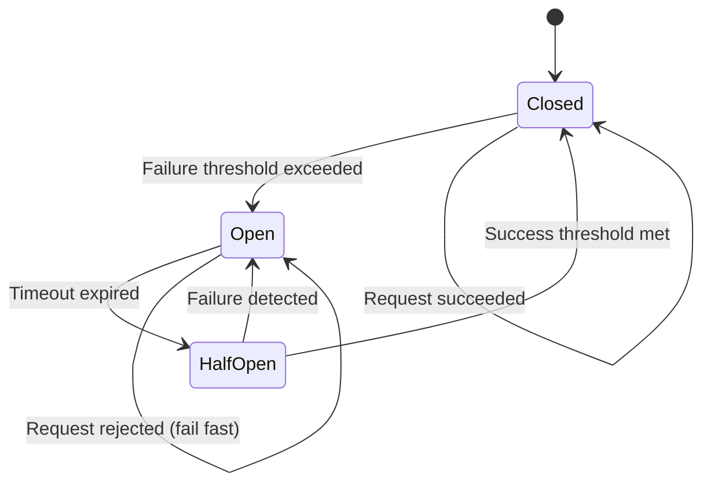
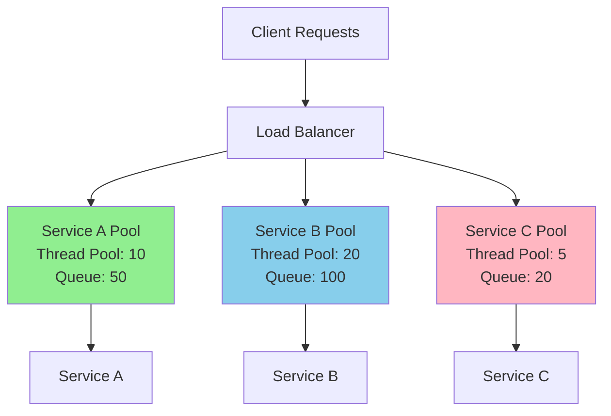

# Circuit Breakers and Resilience Patterns

In distributed microservices architectures, failures are inevitable. Services can become slow, unresponsive, or completely unavailable due to network issues, resource exhaustion, or bugs. Without proper resilience patterns, these failures can cascade throughout the system, causing widespread outages. Circuit breakers and related patterns help build fault-tolerant systems that gracefully handle failures and recover automatically.

## The Circuit Breaker Pattern

The circuit breaker pattern, inspired by electrical circuit breakers, prevents an application from repeatedly trying to execute an operation that's likely to fail. It acts as a proxy between the client and the service, monitoring for failures and "opening" the circuit when failures exceed a threshold.

### Circuit States

A circuit breaker operates in three states:



1. **Closed State**: Normal operation. Requests pass through to the service. The circuit breaker counts failures, and if they exceed a threshold within a time window, it transitions to Open.

2. **Open State**: Requests fail immediately without attempting to call the service. This gives the failing service time to recover and prevents resource exhaustion from waiting on timeouts. After a configured timeout period, the circuit transitions to Half-Open.

3. **Half-Open State**: A limited number of requests are allowed through to test if the service has recovered. If these succeed, the circuit closes. If they fail, it reopens.

### Basic Circuit Breaker Implementation

Here's a simplified circuit breaker implementation in JavaScript:

```javascript
class CircuitBreaker {
  constructor(options = {}) {
    this.failureThreshold = options.failureThreshold || 5;
    this.successThreshold = options.successThreshold || 2;
    this.timeout = options.timeout || 60000; // 60 seconds
    this.state = 'CLOSED';
    this.failureCount = 0;
    this.successCount = 0;
    this.nextAttempt = Date.now();
  }

  async call(serviceFunction, ...args) {
    if (this.state === 'OPEN') {
      if (Date.now() < this.nextAttempt) {
        throw new Error('Circuit breaker is OPEN');
      }
      // Transition to HALF_OPEN
      this.state = 'HALF_OPEN';
    }

    try {
      const result = await serviceFunction(...args);
      this.onSuccess();
      return result;
    } catch (error) {
      this.onFailure();
      throw error;
    }
  }

  onSuccess() {
    this.failureCount = 0;

    if (this.state === 'HALF_OPEN') {
      this.successCount++;
      if (this.successCount >= this.successThreshold) {
        this.state = 'CLOSED';
        this.successCount = 0;
      }
    }
  }

  onFailure() {
    this.failureCount++;
    this.successCount = 0;

    if (this.failureCount >= this.failureThreshold) {
      this.state = 'OPEN';
      this.nextAttempt = Date.now() + this.timeout;
    }
  }

  getState() {
    return this.state;
  }

  reset() {
    this.state = 'CLOSED';
    this.failureCount = 0;
    this.successCount = 0;
  }
}

// Usage example
const breaker = new CircuitBreaker({
  failureThreshold: 3,
  successThreshold: 2,
  timeout: 30000
});

async function callExternalService(userId) {
  return breaker.call(async () => {
    const response = await fetch(`https://api.example.com/users/${userId}`);
    if (!response.ok) {
      throw new Error(`HTTP ${response.status}`);
    }
    return response.json();
  });
}

// Circuit breaker protects against repeated failures
try {
  const user = await callExternalService(123);
  console.log('User:', user);
} catch (error) {
  console.error('Service call failed:', error.message);
  // Circuit may be OPEN, preventing further calls
}
```

### Advanced Circuit Breaker Features

Production-ready circuit breakers include additional features:

```javascript
class AdvancedCircuitBreaker {
  constructor(options = {}) {
    this.failureThreshold = options.failureThreshold || 5;
    this.successThreshold = options.successThreshold || 2;
    this.timeout = options.timeout || 60000;
    this.volumeThreshold = options.volumeThreshold || 10;
    this.errorThresholdPercentage = options.errorThresholdPercentage || 50;
    this.rollingWindowSize = options.rollingWindowSize || 10000;

    this.state = 'CLOSED';
    this.metrics = {
      requests: [],
      failures: 0,
      successes: 0
    };
    this.nextAttempt = Date.now();
    this.fallbackFunction = options.fallback || null;
    this.listeners = [];
  }

  async call(serviceFunction, ...args) {
    if (this.state === 'OPEN') {
      if (Date.now() < this.nextAttempt) {
        this.emit('rejected');
        if (this.fallbackFunction) {
          return this.fallbackFunction(...args);
        }
        throw new Error('Circuit breaker is OPEN');
      }
      this.state = 'HALF_OPEN';
      this.emit('halfOpen');
    }

    const startTime = Date.now();

    try {
      const result = await this.executeWithTimeout(
        serviceFunction(...args),
        this.timeout
      );

      this.recordSuccess(Date.now() - startTime);
      return result;
    } catch (error) {
      this.recordFailure(Date.now() - startTime);

      if (this.fallbackFunction && this.state === 'OPEN') {
        return this.fallbackFunction(...args);
      }

      throw error;
    }
  }

  async executeWithTimeout(promise, timeout) {
    return Promise.race([
      promise,
      new Promise((_, reject) =>
        setTimeout(() => reject(new Error('Timeout')), timeout)
      )
    ]);
  }

  recordSuccess(duration) {
    const now = Date.now();
    this.metrics.requests.push({ time: now, success: true, duration });
    this.metrics.successes++;
    this.cleanOldMetrics(now);

    if (this.state === 'HALF_OPEN') {
      if (this.metrics.successes >= this.successThreshold) {
        this.state = 'CLOSED';
        this.metrics.successes = 0;
        this.metrics.failures = 0;
        this.emit('closed');
      }
    }
  }

  recordFailure(duration) {
    const now = Date.now();
    this.metrics.requests.push({ time: now, success: false, duration });
    this.metrics.failures++;
    this.cleanOldMetrics(now);

    if (this.shouldOpen()) {
      this.state = 'OPEN';
      this.nextAttempt = now + this.timeout;
      this.emit('open');
    }
  }

  shouldOpen() {
    const totalRequests = this.metrics.requests.length;

    // Not enough volume to make a decision
    if (totalRequests < this.volumeThreshold) {
      return false;
    }

    const errorRate = (this.metrics.failures / totalRequests) * 100;
    return errorRate >= this.errorThresholdPercentage;
  }

  cleanOldMetrics(now) {
    const cutoff = now - this.rollingWindowSize;
    this.metrics.requests = this.metrics.requests.filter(
      req => req.time > cutoff
    );

    // Recalculate counts
    this.metrics.failures = this.metrics.requests.filter(r => !r.success).length;
    this.metrics.successes = this.metrics.requests.filter(r => r.success).length;
  }

  getMetrics() {
    const totalRequests = this.metrics.requests.length;
    const successRate = totalRequests > 0
      ? (this.metrics.successes / totalRequests) * 100
      : 0;
    const avgDuration = totalRequests > 0
      ? this.metrics.requests.reduce((sum, r) => sum + r.duration, 0) / totalRequests
      : 0;

    return {
      state: this.state,
      totalRequests,
      failures: this.metrics.failures,
      successes: this.metrics.successes,
      successRate: successRate.toFixed(2) + '%',
      avgDuration: avgDuration.toFixed(2) + 'ms'
    };
  }

  on(event, listener) {
    this.listeners.push({ event, listener });
  }

  emit(event) {
    this.listeners
      .filter(l => l.event === event)
      .forEach(l => l.listener(this.getMetrics()));
  }
}

// Usage with monitoring
const breaker = new AdvancedCircuitBreaker({
  failureThreshold: 5,
  successThreshold: 2,
  timeout: 30000,
  volumeThreshold: 10,
  errorThresholdPercentage: 50,
  rollingWindowSize: 60000,
  fallback: (userId) => {
    // Return cached or default data
    return { id: userId, name: 'Guest', cached: true };
  }
});

breaker.on('open', (metrics) => {
  console.error('Circuit OPENED:', metrics);
  // Alert operations team
});

breaker.on('halfOpen', (metrics) => {
  console.warn('Circuit HALF_OPEN:', metrics);
});

breaker.on('closed', (metrics) => {
  console.info('Circuit CLOSED:', metrics);
});
```

## Resilience4j: Production-Ready Resilience

Resilience4j is a lightweight fault tolerance library inspired by Netflix Hystrix but designed for Java 8 and functional programming. It provides several resilience patterns.

### Circuit Breaker Configuration

```javascript
// Equivalent JavaScript implementation inspired by Resilience4j
class Resilience4jCircuitBreaker {
  constructor(config = {}) {
    // Sliding window configuration
    this.slidingWindowType = config.slidingWindowType || 'COUNT_BASED';
    this.slidingWindowSize = config.slidingWindowSize || 100;
    this.minimumNumberOfCalls = config.minimumNumberOfCalls || 10;

    // Threshold configuration
    this.failureRateThreshold = config.failureRateThreshold || 50;
    this.slowCallRateThreshold = config.slowCallRateThreshold || 100;
    this.slowCallDurationThreshold = config.slowCallDurationThreshold || 60000;

    // State transition configuration
    this.waitDurationInOpenState = config.waitDurationInOpenState || 60000;
    this.permittedNumberOfCallsInHalfOpenState =
      config.permittedNumberOfCallsInHalfOpenState || 10;
    this.automaticTransitionFromOpenToHalfOpenEnabled =
      config.automaticTransitionFromOpenToHalfOpenEnabled || false;

    // Ignored exceptions
    this.ignoreExceptions = config.ignoreExceptions || [];
    this.recordExceptions = config.recordExceptions || [];

    this.state = 'CLOSED';
    this.slidingWindow = [];
    this.nextAttempt = null;
    this.halfOpenCalls = 0;
  }

  async executeCallable(callable) {
    this.updateState();

    if (this.state === 'OPEN') {
      throw new Error('CircuitBreaker is OPEN');
    }

    if (this.state === 'HALF_OPEN' &&
        this.halfOpenCalls >= this.permittedNumberOfCallsInHalfOpenState) {
      throw new Error('CircuitBreaker is HALF_OPEN and max calls reached');
    }

    const startTime = Date.now();

    try {
      const result = await callable();
      const duration = Date.now() - startTime;
      this.recordResult(true, duration);
      return result;
    } catch (error) {
      const duration = Date.now() - startTime;

      if (this.shouldIgnoreException(error)) {
        throw error;
      }

      this.recordResult(false, duration);
      throw error;
    }
  }

  recordResult(success, duration) {
    const isSlow = duration >= this.slowCallDurationThreshold;

    this.slidingWindow.push({
      success,
      duration,
      isSlow,
      timestamp: Date.now()
    });

    if (this.slidingWindowType === 'COUNT_BASED') {
      if (this.slidingWindow.length > this.slidingWindowSize) {
        this.slidingWindow.shift();
      }
    } else {
      // TIME_BASED: remove entries older than slidingWindowSize
      const cutoff = Date.now() - this.slidingWindowSize;
      this.slidingWindow = this.slidingWindow.filter(
        entry => entry.timestamp > cutoff
      );
    }

    if (this.state === 'HALF_OPEN') {
      this.halfOpenCalls++;

      if (this.halfOpenCalls >= this.permittedNumberOfCallsInHalfOpenState) {
        if (this.shouldClose()) {
          this.transitionTo('CLOSED');
        } else {
          this.transitionTo('OPEN');
        }
      }
    } else if (this.state === 'CLOSED') {
      if (this.shouldOpen()) {
        this.transitionTo('OPEN');
      }
    }
  }

  shouldOpen() {
    if (this.slidingWindow.length < this.minimumNumberOfCalls) {
      return false;
    }

    const failures = this.slidingWindow.filter(e => !e.success).length;
    const failureRate = (failures / this.slidingWindow.length) * 100;

    const slowCalls = this.slidingWindow.filter(e => e.isSlow).length;
    const slowCallRate = (slowCalls / this.slidingWindow.length) * 100;

    return failureRate >= this.failureRateThreshold ||
           slowCallRate >= this.slowCallRateThreshold;
  }

  shouldClose() {
    const recentCalls = this.slidingWindow.slice(-this.permittedNumberOfCallsInHalfOpenState);
    const failures = recentCalls.filter(e => !e.success).length;
    const failureRate = (failures / recentCalls.length) * 100;

    return failureRate < this.failureRateThreshold;
  }

  transitionTo(newState) {
    const oldState = this.state;
    this.state = newState;

    if (newState === 'OPEN') {
      this.nextAttempt = Date.now() + this.waitDurationInOpenState;
      this.halfOpenCalls = 0;
    } else if (newState === 'HALF_OPEN') {
      this.halfOpenCalls = 0;
    } else if (newState === 'CLOSED') {
      this.slidingWindow = [];
      this.nextAttempt = null;
    }

    console.log(`Circuit breaker transitioned: ${oldState} -> ${newState}`);
  }

  updateState() {
    if (this.state === 'OPEN' && this.nextAttempt && Date.now() >= this.nextAttempt) {
      this.transitionTo('HALF_OPEN');
    }
  }

  shouldIgnoreException(error) {
    return this.ignoreExceptions.some(
      ExceptionClass => error instanceof ExceptionClass
    );
  }
}

// Usage example
const circuitBreaker = new Resilience4jCircuitBreaker({
  slidingWindowType: 'COUNT_BASED',
  slidingWindowSize: 100,
  minimumNumberOfCalls: 10,
  failureRateThreshold: 50,
  slowCallRateThreshold: 50,
  slowCallDurationThreshold: 2000,
  waitDurationInOpenState: 60000,
  permittedNumberOfCallsInHalfOpenState: 10
});

async function fetchUserWithCircuitBreaker(userId) {
  return circuitBreaker.executeCallable(async () => {
    const response = await fetch(`https://api.example.com/users/${userId}`);
    if (!response.ok) {
      throw new Error(`HTTP ${response.status}`);
    }
    return response.json();
  });
}
```

## Bulkhead Pattern

The bulkhead pattern isolates resources for different parts of an application, preventing cascading failures. Like compartments in a ship's hull, if one compartment is breached, the others remain intact.



### Implementing Bulkhead Pattern

```javascript
class Bulkhead {
  constructor(maxConcurrent, maxQueueSize = 0) {
    this.maxConcurrent = maxConcurrent;
    this.maxQueueSize = maxQueueSize;
    this.currentExecutions = 0;
    this.queue = [];
  }

  async execute(fn) {
    // Check if we can execute immediately
    if (this.currentExecutions < this.maxConcurrent) {
      return this.executeNow(fn);
    }

    // Check if queue is full
    if (this.queue.length >= this.maxQueueSize) {
      throw new Error('Bulkhead queue is full');
    }

    // Add to queue
    return new Promise((resolve, reject) => {
      this.queue.push({ fn, resolve, reject });
    });
  }

  async executeNow(fn) {
    this.currentExecutions++;

    try {
      const result = await fn();
      return result;
    } finally {
      this.currentExecutions--;
      this.processQueue();
    }
  }

  processQueue() {
    if (this.queue.length === 0 || this.currentExecutions >= this.maxConcurrent) {
      return;
    }

    const { fn, resolve, reject } = this.queue.shift();

    this.executeNow(fn)
      .then(resolve)
      .catch(reject);
  }

  getStats() {
    return {
      currentExecutions: this.currentExecutions,
      queueSize: this.queue.length,
      availableSlots: this.maxConcurrent - this.currentExecutions
    };
  }
}

// Create separate bulkheads for different services
const userServiceBulkhead = new Bulkhead(10, 50);
const paymentServiceBulkhead = new Bulkhead(5, 20);
const emailServiceBulkhead = new Bulkhead(20, 100);

// User service calls won't affect payment service capacity
async function getUser(userId) {
  return userServiceBulkhead.execute(async () => {
    const response = await fetch(`https://api.example.com/users/${userId}`);
    return response.json();
  });
}

async function processPayment(paymentData) {
  return paymentServiceBulkhead.execute(async () => {
    const response = await fetch('https://api.example.com/payments', {
      method: 'POST',
      body: JSON.stringify(paymentData)
    });
    return response.json();
  });
}

// Even if user service is overloaded, payments still work
async function handleRequest(userId, paymentData) {
  try {
    const [user, payment] = await Promise.all([
      getUser(userId),
      processPayment(paymentData)
    ]);
    return { user, payment };
  } catch (error) {
    console.error('Request handling error:', error);
    throw error;
  }
}
```

## Retry Pattern

The retry pattern automatically retries failed operations with configurable strategies to handle transient failures.

### Retry Strategies

```javascript
class RetryPolicy {
  constructor(config = {}) {
    this.maxAttempts = config.maxAttempts || 3;
    this.backoffStrategy = config.backoffStrategy || 'exponential';
    this.initialDelay = config.initialDelay || 1000;
    this.maxDelay = config.maxDelay || 30000;
    this.multiplier = config.multiplier || 2;
    this.jitter = config.jitter || true;
    this.retryableErrors = config.retryableErrors || [];
  }

  async execute(fn) {
    let lastError;

    for (let attempt = 1; attempt <= this.maxAttempts; attempt++) {
      try {
        return await fn();
      } catch (error) {
        lastError = error;

        if (!this.shouldRetry(error, attempt)) {
          throw error;
        }

        if (attempt < this.maxAttempts) {
          const delay = this.calculateDelay(attempt);
          console.log(`Retry attempt ${attempt} after ${delay}ms`);
          await this.sleep(delay);
        }
      }
    }

    throw lastError;
  }

  shouldRetry(error, attempt) {
    if (attempt >= this.maxAttempts) {
      return false;
    }

    // Retry specific error types
    if (this.retryableErrors.length > 0) {
      return this.retryableErrors.some(pattern => {
        if (typeof pattern === 'string') {
          return error.message.includes(pattern);
        }
        return error instanceof pattern;
      });
    }

    // Default: retry timeout and 5xx errors
    return error.message.includes('timeout') ||
           error.message.includes('ECONNRESET') ||
           (error.status && error.status >= 500);
  }

  calculateDelay(attempt) {
    let delay;

    switch (this.backoffStrategy) {
      case 'fixed':
        delay = this.initialDelay;
        break;

      case 'linear':
        delay = this.initialDelay * attempt;
        break;

      case 'exponential':
        delay = this.initialDelay * Math.pow(this.multiplier, attempt - 1);
        break;

      default:
        delay = this.initialDelay;
    }

    // Apply max delay cap
    delay = Math.min(delay, this.maxDelay);

    // Apply jitter to prevent thundering herd
    if (this.jitter) {
      const jitterAmount = delay * 0.1; // 10% jitter
      delay += (Math.random() - 0.5) * 2 * jitterAmount;
    }

    return Math.floor(delay);
  }

  sleep(ms) {
    return new Promise(resolve => setTimeout(resolve, ms));
  }
}

// Usage examples
const exponentialRetry = new RetryPolicy({
  maxAttempts: 5,
  backoffStrategy: 'exponential',
  initialDelay: 1000,
  maxDelay: 30000,
  multiplier: 2,
  jitter: true
});

async function fetchWithRetry(url) {
  return exponentialRetry.execute(async () => {
    const response = await fetch(url);
    if (!response.ok) {
      const error = new Error(`HTTP ${response.status}`);
      error.status = response.status;
      throw error;
    }
    return response.json();
  });
}

// Combining retry with circuit breaker
class ResilientServiceClient {
  constructor() {
    this.circuitBreaker = new CircuitBreaker({
      failureThreshold: 5,
      timeout: 30000
    });

    this.retryPolicy = new RetryPolicy({
      maxAttempts: 3,
      backoffStrategy: 'exponential'
    });

    this.bulkhead = new Bulkhead(10, 50);
  }

  async call(serviceFn, ...args) {
    return this.bulkhead.execute(async () => {
      return this.retryPolicy.execute(async () => {
        return this.circuitBreaker.call(serviceFn, ...args);
      });
    });
  }
}

const client = new ResilientServiceClient();

async function getUserData(userId) {
  return client.call(async () => {
    const response = await fetch(`https://api.example.com/users/${userId}`);
    if (!response.ok) {
      throw new Error(`HTTP ${response.status}`);
    }
    return response.json();
  });
}
```

## Timeout Pattern

Proper timeout configuration prevents resource exhaustion from hanging operations.

```javascript
class TimeoutManager {
  static async withTimeout(promise, timeoutMs, errorMessage) {
    let timeoutHandle;

    const timeoutPromise = new Promise((_, reject) => {
      timeoutHandle = setTimeout(() => {
        reject(new Error(errorMessage || `Operation timed out after ${timeoutMs}ms`));
      }, timeoutMs);
    });

    try {
      const result = await Promise.race([promise, timeoutPromise]);
      clearTimeout(timeoutHandle);
      return result;
    } catch (error) {
      clearTimeout(timeoutHandle);
      throw error;
    }
  }

  static async withAdaptiveTimeout(promise, options = {}) {
    const baseTimeout = options.baseTimeout || 5000;
    const percentile = options.percentile || 0.95;
    const history = options.history || [];

    // Calculate adaptive timeout based on historical performance
    let timeout = baseTimeout;
    if (history.length > 0) {
      const sortedHistory = [...history].sort((a, b) => a - b);
      const index = Math.floor(sortedHistory.length * percentile);
      timeout = sortedHistory[index];
    }

    const startTime = Date.now();

    try {
      const result = await this.withTimeout(promise, timeout);
      const duration = Date.now() - startTime;

      // Record successful duration
      if (options.onComplete) {
        options.onComplete(duration);
      }

      return result;
    } catch (error) {
      throw error;
    }
  }
}

// Adaptive timeout example
class ServiceClientWithAdaptiveTimeout {
  constructor() {
    this.requestHistory = [];
    this.maxHistorySize = 100;
  }

  async makeRequest(url) {
    return TimeoutManager.withAdaptiveTimeout(
      fetch(url),
      {
        baseTimeout: 5000,
        percentile: 0.95,
        history: this.requestHistory,
        onComplete: (duration) => {
          this.requestHistory.push(duration);
          if (this.requestHistory.length > this.maxHistorySize) {
            this.requestHistory.shift();
          }
        }
      }
    );
  }
}
```

## Combining Resilience Patterns

In production, multiple patterns work together to provide comprehensive fault tolerance:

```javascript
class ResilientMicroserviceClient {
  constructor(serviceName, config = {}) {
    this.serviceName = serviceName;

    // Circuit breaker to prevent cascading failures
    this.circuitBreaker = new AdvancedCircuitBreaker({
      failureThreshold: config.cbFailureThreshold || 5,
      timeout: config.cbTimeout || 30000,
      volumeThreshold: config.cbVolumeThreshold || 10,
      errorThresholdPercentage: config.cbErrorPercentage || 50
    });

    // Bulkhead to isolate resources
    this.bulkhead = new Bulkhead(
      config.maxConcurrent || 10,
      config.maxQueueSize || 50
    );

    // Retry policy for transient failures
    this.retryPolicy = new RetryPolicy({
      maxAttempts: config.retryAttempts || 3,
      backoffStrategy: config.backoffStrategy || 'exponential',
      initialDelay: config.retryInitialDelay || 1000
    });

    // Metrics collection
    this.metrics = {
      totalRequests: 0,
      successfulRequests: 0,
      failedRequests: 0,
      retriedRequests: 0,
      rejectedRequests: 0
    };
  }

  async execute(operation, options = {}) {
    this.metrics.totalRequests++;

    try {
      // Apply bulkhead
      return await this.bulkhead.execute(async () => {
        // Apply retry policy
        return await this.retryPolicy.execute(async () => {
          // Apply circuit breaker
          return await this.circuitBreaker.call(async () => {
            // Execute actual operation with timeout
            return await TimeoutManager.withTimeout(
              operation(),
              options.timeout || 10000,
              `${this.serviceName} request timed out`
            );
          });
        });
      });

      this.metrics.successfulRequests++;
    } catch (error) {
      this.metrics.failedRequests++;

      if (error.message.includes('Bulkhead')) {
        this.metrics.rejectedRequests++;
      }

      throw error;
    }
  }

  getMetrics() {
    return {
      ...this.metrics,
      circuitBreakerState: this.circuitBreaker.getState(),
      bulkheadStats: this.bulkhead.getStats()
    };
  }
}

// Usage
const userServiceClient = new ResilientMicroserviceClient('UserService', {
  maxConcurrent: 15,
  cbFailureThreshold: 5,
  retryAttempts: 3
});

const productServiceClient = new ResilientMicroserviceClient('ProductService', {
  maxConcurrent: 20,
  cbFailureThreshold: 3,
  retryAttempts: 2
});

async function getOrderDetails(orderId) {
  try {
    const [user, products] = await Promise.all([
      userServiceClient.execute(async () => {
        const res = await fetch(`https://users.example.com/api/users/${orderId}`);
        return res.json();
      }),
      productServiceClient.execute(async () => {
        const res = await fetch(`https://products.example.com/api/products/${orderId}`);
        return res.json();
      })
    ]);

    return { user, products };
  } catch (error) {
    console.error('Failed to get order details:', error);

    // Log metrics for debugging
    console.log('User service metrics:', userServiceClient.getMetrics());
    console.log('Product service metrics:', productServiceClient.getMetrics());

    throw error;
  }
}
```

## Best Practices

1. **Configure Timeouts Appropriately**: Set timeouts based on actual service behavior, not arbitrary values.

2. **Use Adaptive Thresholds**: Monitor service behavior and adjust circuit breaker thresholds dynamically.

3. **Implement Graceful Degradation**: Provide fallback responses when services are unavailable.

4. **Monitor Circuit Breaker State**: Alert when circuits open frequently—it indicates underlying problems.

5. **Combine Patterns Thoughtfully**: Too many retry attempts with circuit breakers can extend outages.

6. **Test Failure Scenarios**: Regularly test your resilience patterns with chaos engineering.

Circuit breakers and resilience patterns are essential for building robust microservices that handle failures gracefully and maintain system stability even when individual components fail.
