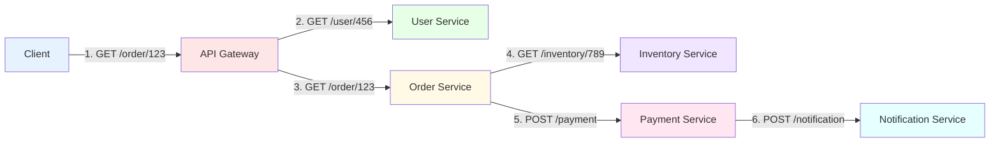

# Distributed Tracing and Observability

In microservices architectures, a single user request often traverses multiple services, making it challenging to understand system behavior, diagnose performance issues, and troubleshoot errors. Distributed tracing solves this problem by tracking requests as they flow through the system, providing visibility into service interactions, latencies, and failures.

## Why Distributed Tracing?

Traditional monitoring approaches fall short in distributed systems:



**Challenges without distributed tracing:**

1. **Request correlation**: Which logs belong to the same user request?
2. **Performance bottlenecks**: Which service is slow?
3. **Error propagation**: Where did the error originate?
4. **Service dependencies**: What services does a request touch?

## Core Concepts

### Traces and Spans

A **trace** represents the entire journey of a request through the system. A **span** represents a single unit of work within that trace.

```mermaid
gantt
    title Request Trace (Total: 450ms)
    dateFormat  X
    axisFormat %L

    section API Gateway
    Gateway Processing    :0, 50

    section User Service
    User Lookup          :50, 100

    section Order Service
    Order Processing     :50, 200

    section Inventory Service
    Inventory Check      :150, 100

    section Payment Service
    Payment Processing   :250, 150

    section Notification
    Send Email          :400, 50
```



Each span contains:
- **Span ID**: Unique identifier for the span
- **Trace ID**: Shared across all spans in the trace
- **Parent Span ID**: Links spans into a hierarchy
- **Operation name**: What the span represents
- **Start time and duration**: When it started and how long it took
- **Tags**: Key-value metadata
- **Logs**: Timestamped events within the span
- **Baggage**: Cross-service context propagation

### Span Context and Propagation

For distributed tracing to work, context must propagate across service boundaries. This is typically done via HTTP headers:

```
X-B3-TraceId: 463ac35c9f6413ad48485a3953bb6124
X-B3-SpanId: a2fb4a1d1a96d312
X-B3-ParentSpanId: 0020000000000001
X-B3-Sampled: 1
```

## Implementing Distributed Tracing

### Basic Tracing with OpenTelemetry

OpenTelemetry is an open standard for telemetry data collection. Here's a comprehensive implementation:

```javascript
const { trace, context, propagation } = require('@opentelemetry/api');
const { NodeTracerProvider } = require('@opentelemetry/sdk-trace-node');
const { registerInstrumentations } = require('@opentelemetry/instrumentation');
const { HttpInstrumentation } = require('@opentelemetry/instrumentation-http');
const { ExpressInstrumentation } = require('@opentelemetry/instrumentation-express');
const { JaegerExporter } = require('@opentelemetry/exporter-jaeger');
const { Resource } = require('@opentelemetry/resources');
const { SemanticResourceAttributes } = require('@opentelemetry/semantic-conventions');

// Initialize tracer provider
const provider = new NodeTracerProvider({
  resource: new Resource({
    [SemanticResourceAttributes.SERVICE_NAME]: 'order-service',
    [SemanticResourceAttributes.SERVICE_VERSION]: '1.0.0',
    [SemanticResourceAttributes.DEPLOYMENT_ENVIRONMENT]: 'production'
  })
});

// Configure Jaeger exporter
const jaegerExporter = new JaegerExporter({
  endpoint: 'http://jaeger:14268/api/traces',
  tags: [],
  maxPacketSize: 65000
});

provider.addSpanProcessor(
  new BatchSpanProcessor(jaegerExporter)
);

// Register the provider
provider.register();

// Auto-instrument HTTP and Express
registerInstrumentations({
  instrumentations: [
    new HttpInstrumentation({
      requestHook: (span, request) => {
        span.setAttribute('http.request.body.size', request.headers['content-length']);
      },
      responseHook: (span, response) => {
        span.setAttribute('http.response.body.size', response.headers['content-length']);
      }
    }),
    new ExpressInstrumentation()
  ]
});

// Get tracer instance
const tracer = trace.getTracer('order-service', '1.0.0');

// Express application with tracing
const express = require('express');
const app = express();

app.use(express.json());

// Middleware to extract trace context from incoming requests
app.use((req, res, next) => {
  // OpenTelemetry auto-instrumentation handles this
  // but here's what it does under the hood:
  const extractedContext = propagation.extract(context.active(), req.headers);
  context.with(extractedContext, () => {
    next();
  });
});

// Example route with custom spans
app.get('/orders/:orderId', async (req, res) => {
  const { orderId } = req.params;

  // Create a custom span
  const span = tracer.startSpan('get_order', {
    attributes: {
      'order.id': orderId,
      'http.method': 'GET',
      'http.route': '/orders/:orderId'
    }
  });

  try {
    // Set span as active context
    await context.with(trace.setSpan(context.active(), span), async () => {
      // Fetch order details
      const order = await getOrderFromDatabase(orderId);

      // Add event to span
      span.addEvent('order_retrieved', {
        'order.status': order.status,
        'order.total': order.total
      });

      // Fetch user information in a child span
      const user = await getUserInfo(order.userId);

      // Fetch inventory in another child span
      const inventory = await checkInventory(order.items);

      // Add tags based on business logic
      if (order.total > 1000) {
        span.setAttribute('order.high_value', true);
      }

      span.setStatus({ code: SpanStatusCode.OK });

      res.json({
        order,
        user,
        inventory
      });
    });
  } catch (error) {
    // Record exception in span
    span.recordException(error);
    span.setStatus({
      code: SpanStatusCode.ERROR,
      message: error.message
    });

    res.status(500).json({ error: error.message });
  } finally {
    // End the span
    span.end();
  }
});

// Helper function with custom span
async function getOrderFromDatabase(orderId) {
  const span = tracer.startSpan('database.get_order', {
    attributes: {
      'db.system': 'postgresql',
      'db.name': 'orders',
      'db.operation': 'SELECT',
      'db.statement': 'SELECT * FROM orders WHERE id = $1'
    }
  });

  try {
    // Simulate database query
    const result = await db.query('SELECT * FROM orders WHERE id = $1', [orderId]);

    span.setAttribute('db.rows_affected', result.rows.length);

    return result.rows[0];
  } finally {
    span.end();
  }
}

// Helper function that makes external HTTP call
async function getUserInfo(userId) {
  const span = tracer.startSpan('http.get_user', {
    attributes: {
      'http.method': 'GET',
      'http.url': `http://user-service/users/${userId}`,
      'peer.service': 'user-service'
    }
  });

  try {
    // Inject trace context into outgoing request
    const headers = {};
    propagation.inject(
      trace.setSpan(context.active(), span),
      headers
    );

    const response = await fetch(`http://user-service/users/${userId}`, {
      headers
    });

    span.setAttribute('http.status_code', response.status);

    if (!response.ok) {
      throw new Error(`User service returned ${response.status}`);
    }

    const user = await response.json();
    return user;
  } catch (error) {
    span.recordException(error);
    throw error;
  } finally {
    span.end();
  }
}

// Helper for inventory check with parallel spans
async function checkInventory(items) {
  const span = tracer.startSpan('inventory.check_multiple', {
    attributes: {
      'inventory.items_count': items.length
    }
  });

  try {
    const inventoryChecks = items.map(item =>
      context.with(trace.setSpan(context.active(), span), async () => {
        const itemSpan = tracer.startSpan('inventory.check_item', {
          attributes: {
            'item.id': item.id,
            'item.quantity': item.quantity
          }
        });

        try {
          const available = await checkItemInventory(item.id, item.quantity);
          itemSpan.setAttribute('inventory.available', available);
          return { itemId: item.id, available };
        } finally {
          itemSpan.end();
        }
      })
    );

    const results = await Promise.all(inventoryChecks);
    return results;
  } finally {
    span.end();
  }
}

app.listen(3000, () => {
  console.log('Order service listening on port 3000');
});
```

### Advanced Span Attributes and Events

Spans can be enriched with semantic attributes following OpenTelemetry conventions:

```javascript
class TracedServiceClient {
  constructor(serviceName, baseUrl) {
    this.serviceName = serviceName;
    this.baseUrl = baseUrl;
    this.tracer = trace.getTracer('service-client');
  }

  async request(method, path, options = {}) {
    const span = this.tracer.startSpan(`${method} ${path}`, {
      kind: SpanKind.CLIENT,
      attributes: {
        // HTTP attributes
        'http.method': method,
        'http.url': `${this.baseUrl}${path}`,
        'http.target': path,
        'http.scheme': 'https',
        'http.host': new URL(this.baseUrl).host,

        // Service attributes
        'peer.service': this.serviceName,

        // Custom business attributes
        'client.retry_count': 0,
        'client.timeout': options.timeout || 5000
      }
    });

    let retryCount = 0;
    const startTime = Date.now();

    try {
      // Add event for request start
      span.addEvent('request.start', {
        'request.headers': JSON.stringify(options.headers || {})
      });

      const response = await this.makeRequest(method, path, options);

      // Calculate metrics
      const duration = Date.now() - startTime;

      // Add response attributes
      span.setAttributes({
        'http.status_code': response.status,
        'http.response_content_length': response.headers.get('content-length'),
        'http.duration_ms': duration
      });

      // Add event for successful response
      span.addEvent('request.success', {
        'response.cached': response.headers.get('x-cache') === 'HIT',
        'response.duration': duration
      });

      // Mark span as successful
      span.setStatus({ code: SpanStatusCode.OK });

      return response;
    } catch (error) {
      // Record detailed error information
      span.recordException(error, {
        'exception.escaped': false,
        'exception.stacktrace': error.stack
      });

      span.setAttributes({
        'error': true,
        'error.type': error.constructor.name,
        'error.message': error.message
      });

      span.setStatus({
        code: SpanStatusCode.ERROR,
        message: error.message
      });

      throw error;
    } finally {
      span.end();
    }
  }

  async makeRequest(method, path, options) {
    const headers = { ...options.headers };

    // Inject trace context
    propagation.inject(context.active(), headers);

    const response = await fetch(`${this.baseUrl}${path}`, {
      method,
      headers,
      body: options.body
    });

    return response;
  }
}

// Usage
const userServiceClient = new TracedServiceClient(
  'user-service',
  'https://users.example.com'
);

async function processOrder(orderId) {
  const span = tracer.startSpan('process_order', {
    attributes: {
      'order.id': orderId
    }
  });

  await context.with(trace.setSpan(context.active(), span), async () => {
    try {
      // Each call creates a child span
      const user = await userServiceClient.request('GET', `/users/${orderId}`);

      span.addEvent('user_retrieved', {
        'user.tier': user.tier,
        'user.region': user.region
      });

      // More processing...
      span.setStatus({ code: SpanStatusCode.OK });
    } catch (error) {
      span.recordException(error);
      span.setStatus({ code: SpanStatusCode.ERROR });
      throw error;
    } finally {
      span.end();
    }
  });
}
```

## Correlation IDs and Request Tracking

Correlation IDs tie together logs, metrics, and traces for a single request:

```javascript
const { v4: uuidv4 } = require('uuid');

// Middleware to generate or extract correlation ID
function correlationIdMiddleware(req, res, next) {
  // Try to get correlation ID from header, or generate new one
  const correlationId = req.headers['x-correlation-id'] || uuidv4();

  // Store in request
  req.correlationId = correlationId;

  // Add to response headers
  res.setHeader('x-correlation-id', correlationId);

  // Make available in current context
  const currentContext = context.active();
  const contextWithCorrelation = currentContext.setValue(
    'correlationId',
    correlationId
  );

  context.with(contextWithCorrelation, () => {
    next();
  });
}

// Logger that includes correlation ID
class CorrelatedLogger {
  constructor(serviceName) {
    this.serviceName = serviceName;
  }

  log(level, message, metadata = {}) {
    const correlationId = context.active().getValue('correlationId');
    const span = trace.getSpan(context.active());
    const traceId = span?.spanContext().traceId;
    const spanId = span?.spanContext().spanId;

    const logEntry = {
      timestamp: new Date().toISOString(),
      level,
      service: this.serviceName,
      correlationId,
      traceId,
      spanId,
      message,
      ...metadata
    };

    console.log(JSON.stringify(logEntry));

    // Also add as span event
    if (span) {
      span.addEvent(message, metadata);
    }
  }

  info(message, metadata) {
    this.log('INFO', message, metadata);
  }

  error(message, error, metadata) {
    this.log('ERROR', message, {
      ...metadata,
      error: {
        message: error.message,
        stack: error.stack,
        type: error.constructor.name
      }
    });
  }

  warn(message, metadata) {
    this.log('WARN', message, metadata);
  }
}

const logger = new CorrelatedLogger('order-service');

// Use in application
app.use(correlationIdMiddleware);

app.post('/orders', async (req, res) => {
  logger.info('Creating new order', {
    userId: req.body.userId,
    itemCount: req.body.items.length
  });

  try {
    const order = await createOrder(req.body);

    logger.info('Order created successfully', {
      orderId: order.id,
      total: order.total
    });

    res.json(order);
  } catch (error) {
    logger.error('Failed to create order', error, {
      userId: req.body.userId
    });

    res.status(500).json({ error: 'Failed to create order' });
  }
});
```

## Sampling Strategies

Tracing every request can generate massive amounts of data. Sampling reduces overhead while maintaining visibility:

```javascript
const { ParentBasedSampler, TraceIdRatioBasedSampler } = require('@opentelemetry/sdk-trace-base');

// Simple probability-based sampling (10% of traces)
const probabilitySampler = new TraceIdRatioBasedSampler(0.1);

// Custom adaptive sampler
class AdaptiveSampler {
  constructor(options = {}) {
    this.baseRate = options.baseRate || 0.1;
    this.errorRate = options.errorRate || 1.0;
    this.slowThreshold = options.slowThreshold || 1000;
    this.slowRate = options.slowRate || 1.0;
    this.recentRequests = [];
    this.maxHistorySize = 1000;
  }

  shouldSample(context, traceId, spanName, spanKind, attributes, links) {
    // Always sample errors
    if (attributes['error'] === true) {
      return {
        decision: SamplingDecision.RECORD_AND_SAMPLED,
        attributes: { 'sampling.reason': 'error' }
      };
    }

    // Always sample slow requests
    if (attributes['http.duration_ms'] > this.slowThreshold) {
      return {
        decision: SamplingDecision.RECORD_AND_SAMPLED,
        attributes: { 'sampling.reason': 'slow_request' }
      };
    }

    // Sample based on request rate
    const currentRate = this.calculateCurrentRate();

    if (Math.random() < currentRate) {
      return {
        decision: SamplingDecision.RECORD_AND_SAMPLED,
        attributes: { 'sampling.reason': 'probability' }
      };
    }

    return {
      decision: SamplingDecision.NOT_RECORD
    };
  }

  calculateCurrentRate() {
    // Increase sampling rate when error rate is high
    const recentErrors = this.recentRequests.filter(r => r.error).length;
    const errorRate = recentErrors / this.recentRequests.length;

    if (errorRate > 0.05) {
      return Math.min(this.baseRate * 5, 1.0);
    }

    return this.baseRate;
  }

  recordRequest(error, duration) {
    this.recentRequests.push({ error, duration, timestamp: Date.now() });

    if (this.recentRequests.length > this.maxHistorySize) {
      this.recentRequests.shift();
    }
  }
}

// Use custom sampler
const provider = new NodeTracerProvider({
  sampler: new AdaptiveSampler({
    baseRate: 0.1,
    slowThreshold: 1000
  })
});
```

## Trace Visualization and Analysis

Once traces are collected, they need to be visualized and analyzed. Here's how to query and visualize traces:

```javascript
// Jaeger Query API client
class JaegerClient {
  constructor(baseUrl) {
    this.baseUrl = baseUrl;
  }

  async getTrace(traceId) {
    const response = await fetch(`${this.baseUrl}/api/traces/${traceId}`);
    const data = await response.json();
    return data.data[0];
  }

  async searchTraces(options = {}) {
    const params = new URLSearchParams({
      service: options.service,
      operation: options.operation,
      start: options.start || Date.now() - 3600000,
      end: options.end || Date.now(),
      limit: options.limit || 100,
      ...options.tags
    });

    const response = await fetch(`${this.baseUrl}/api/traces?${params}`);
    const data = await response.json();
    return data.data;
  }

  async getServiceDependencies(lookback = 3600000) {
    const response = await fetch(
      `${this.baseUrl}/api/dependencies?endTs=${Date.now()}&lookback=${lookback}`
    );
    return response.json();
  }

  analyzeTrace(trace) {
    const spans = trace.spans;
    const rootSpan = spans.find(s => !s.references || s.references.length === 0);

    // Calculate critical path
    const criticalPath = this.calculateCriticalPath(spans, rootSpan);

    // Identify bottlenecks
    const bottlenecks = this.findBottlenecks(spans);

    // Calculate service times
    const serviceTimes = this.calculateServiceTimes(spans);

    return {
      traceId: trace.traceID,
      duration: rootSpan.duration,
      criticalPath,
      bottlenecks,
      serviceTimes,
      spanCount: spans.length,
      errorCount: spans.filter(s => s.tags.some(t => t.key === 'error' && t.value === true)).length
    };
  }

  calculateCriticalPath(spans, rootSpan) {
    // Build span graph
    const spanMap = new Map(spans.map(s => [s.spanID, s]));
    const children = new Map();

    spans.forEach(span => {
      const parentRef = span.references?.find(r => r.refType === 'CHILD_OF');
      if (parentRef) {
        const parentId = parentRef.spanID;
        if (!children.has(parentId)) {
          children.set(parentId, []);
        }
        children.get(parentId).push(span);
      }
    });

    // Find longest path
    const findLongestPath = (span) => {
      const childSpans = children.get(span.spanID) || [];

      if (childSpans.length === 0) {
        return [span];
      }

      const childPaths = childSpans.map(findLongestPath);
      const longestChildPath = childPaths.reduce((longest, current) =>
        this.pathDuration(current) > this.pathDuration(longest) ? current : longest
      );

      return [span, ...longestChildPath];
    };

    return findLongestPath(rootSpan);
  }

  pathDuration(path) {
    return path.reduce((sum, span) => sum + span.duration, 0);
  }

  findBottlenecks(spans) {
    const avgDuration = spans.reduce((sum, s) => sum + s.duration, 0) / spans.length;
    const threshold = avgDuration * 2;

    return spans
      .filter(s => s.duration > threshold)
      .map(s => ({
        operation: s.operationName,
        duration: s.duration,
        percentOfTrace: (s.duration / this.pathDuration(spans)) * 100
      }))
      .sort((a, b) => b.duration - a.duration);
  }

  calculateServiceTimes(spans) {
    const serviceTimes = {};

    spans.forEach(span => {
      const service = span.process.serviceName;
      if (!serviceTimes[service]) {
        serviceTimes[service] = {
          totalTime: 0,
          spanCount: 0,
          operations: {}
        };
      }

      serviceTimes[service].totalTime += span.duration;
      serviceTimes[service].spanCount++;

      if (!serviceTimes[service].operations[span.operationName]) {
        serviceTimes[service].operations[span.operationName] = {
          totalTime: 0,
          count: 0
        };
      }

      serviceTimes[service].operations[span.operationName].totalTime += span.duration;
      serviceTimes[service].operations[span.operationName].count++;
    });

    return serviceTimes;
  }
}

// Usage
const jaeger = new JaegerClient('http://jaeger:16686');

async function analyzeSlowRequests() {
  // Find slow traces
  const traces = await jaeger.searchTraces({
    service: 'api-gateway',
    tags: { 'http.status_code': '200' },
    minDuration: '1s'
  });

  const analyses = traces.map(trace => jaeger.analyzeTrace(trace));

  // Find common bottlenecks
  const allBottlenecks = analyses.flatMap(a => a.bottlenecks);
  const bottlenecksByOperation = {};

  allBottlenecks.forEach(b => {
    if (!bottlenecksByOperation[b.operation]) {
      bottlenecksByOperation[b.operation] = [];
    }
    bottlenecksByOperation[b.operation].push(b.duration);
  });

  console.log('Common bottlenecks:');
  Object.entries(bottlenecksByOperation)
    .sort((a, b) => b[1].length - a[1].length)
    .forEach(([operation, durations]) => {
      const avgDuration = durations.reduce((a, b) => a + b, 0) / durations.length;
      console.log(`${operation}: ${durations.length} occurrences, avg ${avgDuration}µs`);
    });
}
```

## Best Practices

1. **Use Semantic Conventions**: Follow OpenTelemetry semantic conventions for consistent attribute naming.

2. **Sample Intelligently**: Always trace errors and slow requests, sample normal traffic.

3. **Propagate Context**: Always propagate trace context across service boundaries.

4. **Meaningful Span Names**: Use operation names that clearly describe what the span does.

5. **Add Business Context**: Include business-relevant attributes to make traces more useful.

6. **Monitor Trace Backend**: Ensure your tracing system can handle the volume of traces.

7. **Correlate with Logs**: Include trace IDs in logs for complete observability.

8. **Regular Analysis**: Periodically analyze traces to identify performance issues and optimization opportunities.

Distributed tracing is essential for understanding complex microservices systems, enabling rapid troubleshooting, performance optimization, and providing deep insights into system behavior.
