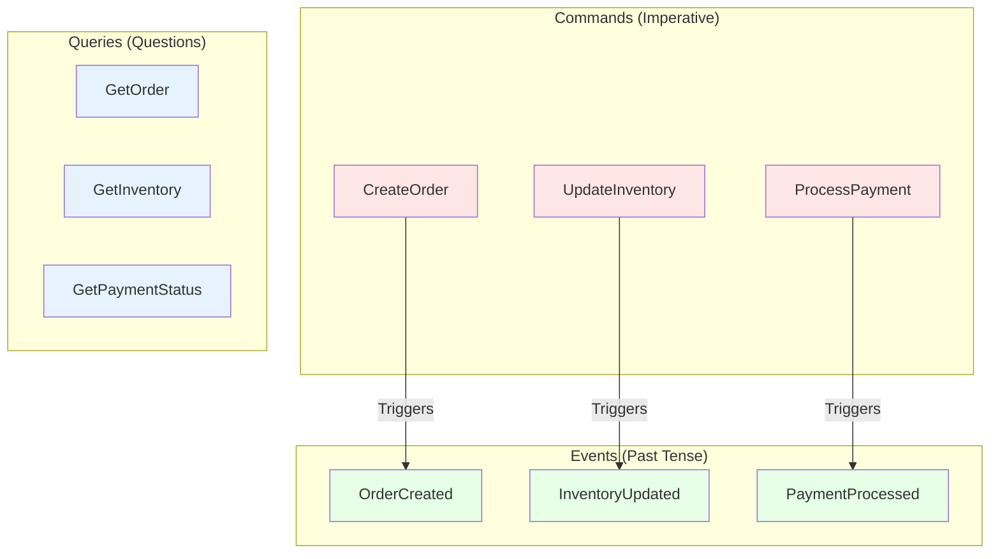
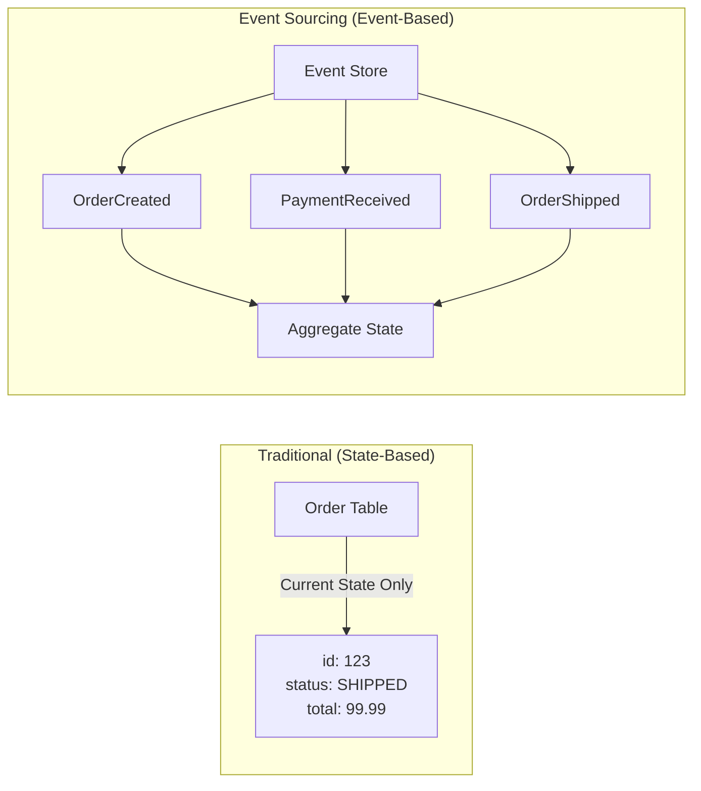
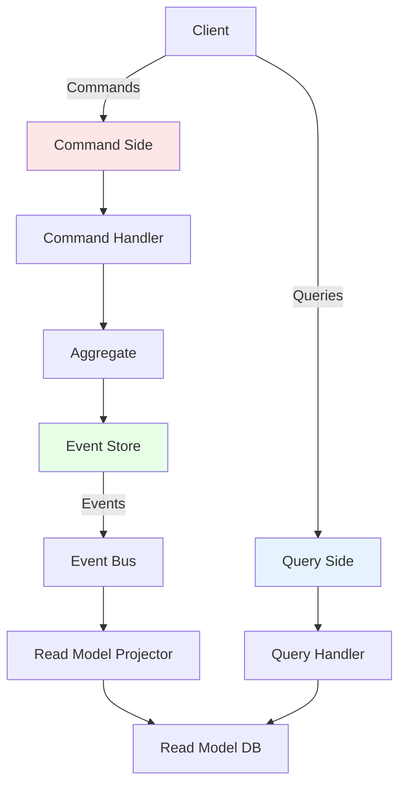
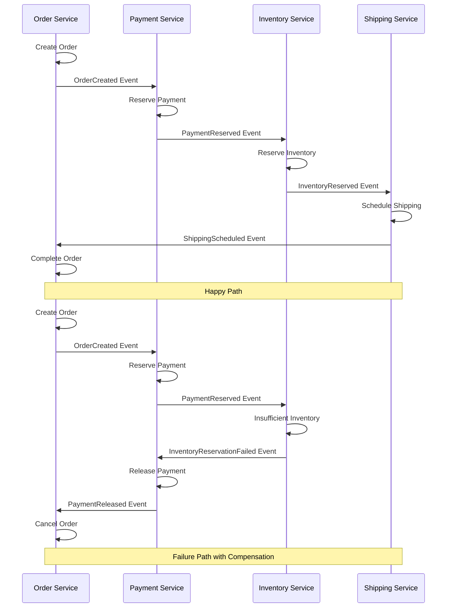
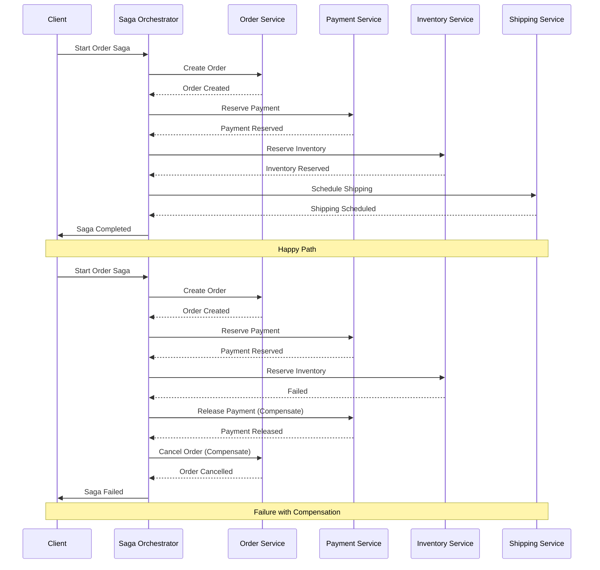

# Event-Driven Architecture

Event-driven architecture (EDA) is a design paradigm where services communicate through events—notifications of state changes or significant occurrences. Unlike request-response communication, events decouple services, enabling asynchronous processing, scalability, and flexibility in microservices systems.

## Core Concepts

### Events vs Commands vs Queries

Understanding the distinction between these message types is crucial:



- **Commands**: Intent to change state ("CreateOrder", "CancelSubscription")
- **Events**: Record of something that happened ("OrderCreated", "SubscriptionCancelled")
- **Queries**: Request for current state ("GetOrder", "ListOrders")

### Event Structure

A well-designed event contains everything consumers need:

```javascript
{
  // Event metadata
  "eventId": "550e8400-e29b-41d4-a716-446655440000",
  "eventType": "OrderCreated",
  "eventVersion": "1.0",
  "timestamp": "2024-01-20T10:30:00Z",
  "correlationId": "abc-123-def",

  // Source information
  "source": {
    "service": "order-service",
    "instance": "order-service-pod-1",
    "userId": "user-123"
  },

  // Event payload
  "data": {
    "orderId": "order-789",
    "customerId": "customer-456",
    "items": [
      {
        "productId": "product-101",
        "quantity": 2,
        "price": 29.99
      }
    ],
    "totalAmount": 59.98,
    "currency": "USD",
    "shippingAddress": {
      "street": "123 Main St",
      "city": "Springfield",
      "country": "US"
    }
  },

  // Optional metadata
  "metadata": {
    "userAgent": "Mozilla/5.0...",
    "ipAddress": "192.168.1.1",
    "sessionId": "session-xyz"
  }
}
```

## Event Sourcing

Event sourcing stores the complete history of state changes as a sequence of events, rather than just the current state.

### Traditional State Storage vs Event Sourcing



### Implementing Event Sourcing

```javascript
class EventStore {
  constructor() {
    this.events = new Map(); // aggregateId -> [events]
    this.snapshots = new Map(); // aggregateId -> snapshot
  }

  async append(aggregateId, event) {
    if (!this.events.has(aggregateId)) {
      this.events.set(aggregateId, []);
    }

    const events = this.events.get(aggregateId);
    event.version = events.length + 1;
    event.timestamp = new Date();

    events.push(event);

    // Publish event to subscribers
    await this.publishEvent(event);

    // Create snapshot every 100 events
    if (events.length % 100 === 0) {
      await this.createSnapshot(aggregateId);
    }

    return event;
  }

  async getEvents(aggregateId, fromVersion = 0) {
    const events = this.events.get(aggregateId) || [];
    return events.filter(e => e.version > fromVersion);
  }

  async getAllEvents(aggregateId) {
    return this.events.get(aggregateId) || [];
  }

  async createSnapshot(aggregateId) {
    const events = await this.getAllEvents(aggregateId);
    const aggregate = await this.rehydrate(aggregateId);

    this.snapshots.set(aggregateId, {
      aggregateId,
      version: events.length,
      state: aggregate.state,
      timestamp: new Date()
    });
  }

  async getSnapshot(aggregateId) {
    return this.snapshots.get(aggregateId);
  }

  async rehydrate(aggregateId) {
    // Try to load from snapshot first
    const snapshot = await this.getSnapshot(aggregateId);

    let aggregate;
    let fromVersion = 0;

    if (snapshot) {
      aggregate = new Order(aggregateId);
      aggregate.state = { ...snapshot.state };
      fromVersion = snapshot.version;
    } else {
      aggregate = new Order(aggregateId);
    }

    // Apply events since snapshot
    const events = await this.getEvents(aggregateId, fromVersion);
    events.forEach(event => aggregate.apply(event));

    return aggregate;
  }

  async publishEvent(event) {
    // Publish to message broker (Kafka, RabbitMQ, etc.)
    // This is a simplified implementation
    console.log(`Publishing event: ${event.type}`, event);
  }
}

// Aggregate Root
class Order {
  constructor(orderId) {
    this.orderId = orderId;
    this.state = {
      status: 'NEW',
      items: [],
      totalAmount: 0,
      customerId: null
    };
    this.uncommittedEvents = [];
  }

  // Command handlers
  create(customerId, items) {
    if (this.state.status !== 'NEW') {
      throw new Error('Order already created');
    }

    const totalAmount = items.reduce(
      (sum, item) => sum + item.price * item.quantity,
      0
    );

    this.raiseEvent({
      type: 'OrderCreated',
      data: {
        orderId: this.orderId,
        customerId,
        items,
        totalAmount
      }
    });
  }

  addItem(productId, quantity, price) {
    if (this.state.status === 'CANCELLED' || this.state.status === 'SHIPPED') {
      throw new Error('Cannot modify order in current state');
    }

    this.raiseEvent({
      type: 'ItemAdded',
      data: {
        orderId: this.orderId,
        productId,
        quantity,
        price
      }
    });
  }

  ship(trackingNumber) {
    if (this.state.status !== 'PAID') {
      throw new Error('Order must be paid before shipping');
    }

    this.raiseEvent({
      type: 'OrderShipped',
      data: {
        orderId: this.orderId,
        trackingNumber,
        shippedAt: new Date()
      }
    });
  }

  cancel(reason) {
    if (this.state.status === 'SHIPPED') {
      throw new Error('Cannot cancel shipped order');
    }

    this.raiseEvent({
      type: 'OrderCancelled',
      data: {
        orderId: this.orderId,
        reason,
        cancelledAt: new Date()
      }
    });
  }

  // Event handlers (apply state changes)
  apply(event) {
    switch (event.type) {
      case 'OrderCreated':
        this.state.status = 'CREATED';
        this.state.customerId = event.data.customerId;
        this.state.items = event.data.items;
        this.state.totalAmount = event.data.totalAmount;
        break;

      case 'ItemAdded':
        this.state.items.push({
          productId: event.data.productId,
          quantity: event.data.quantity,
          price: event.data.price
        });
        this.state.totalAmount += event.data.price * event.data.quantity;
        break;

      case 'PaymentReceived':
        this.state.status = 'PAID';
        this.state.paymentId = event.data.paymentId;
        break;

      case 'OrderShipped':
        this.state.status = 'SHIPPED';
        this.state.trackingNumber = event.data.trackingNumber;
        this.state.shippedAt = event.data.shippedAt;
        break;

      case 'OrderCancelled':
        this.state.status = 'CANCELLED';
        this.state.cancelReason = event.data.reason;
        this.state.cancelledAt = event.data.cancelledAt;
        break;
    }
  }

  raiseEvent(event) {
    this.apply(event);
    this.uncommittedEvents.push(event);
  }

  async commit(eventStore) {
    for (const event of this.uncommittedEvents) {
      await eventStore.append(this.orderId, event);
    }
    this.uncommittedEvents = [];
  }
}

// Usage
const eventStore = new EventStore();

async function createOrder(orderId, customerId, items) {
  const order = new Order(orderId);

  // Execute command
  order.create(customerId, items);

  // Persist events
  await order.commit(eventStore);

  return order;
}

async function addItemToOrder(orderId, productId, quantity, price) {
  // Rehydrate from events
  const order = await eventStore.rehydrate(orderId);

  // Execute command
  order.addItem(productId, quantity, price);

  // Persist new events
  await order.commit(eventStore);

  return order;
}

// Example usage
const order = await createOrder('order-123', 'customer-456', [
  { productId: 'product-1', quantity: 2, price: 29.99 }
]);

await addItemToOrder('order-123', 'product-2', 1, 49.99);

const rehydratedOrder = await eventStore.rehydrate('order-123');
console.log('Order state:', rehydratedOrder.state);
```

## CQRS (Command Query Responsibility Segregation)

CQRS separates read and write models, optimizing each for its specific use case.



### Implementing CQRS

```javascript
// Command Side
class OrderCommandHandler {
  constructor(eventStore) {
    this.eventStore = eventStore;
  }

  async handle(command) {
    switch (command.type) {
      case 'CreateOrder':
        return this.handleCreateOrder(command);
      case 'AddItem':
        return this.handleAddItem(command);
      case 'ShipOrder':
        return this.handleShipOrder(command);
      default:
        throw new Error(`Unknown command: ${command.type}`);
    }
  }

  async handleCreateOrder(command) {
    const order = new Order(command.orderId);
    order.create(command.customerId, command.items);
    await order.commit(this.eventStore);
    return { success: true, orderId: command.orderId };
  }

  async handleAddItem(command) {
    const order = await this.eventStore.rehydrate(command.orderId);
    order.addItem(command.productId, command.quantity, command.price);
    await order.commit(this.eventStore);
    return { success: true, orderId: command.orderId };
  }

  async handleShipOrder(command) {
    const order = await this.eventStore.rehydrate(command.orderId);
    order.ship(command.trackingNumber);
    await order.commit(this.eventStore);
    return { success: true, orderId: command.orderId };
  }
}

// Query Side - Read Models
class OrderReadModel {
  constructor() {
    this.orders = new Map();
    this.ordersByCustomer = new Map();
    this.orderStats = {
      totalOrders: 0,
      totalRevenue: 0,
      averageOrderValue: 0
    };
  }

  // Event handlers to update read models
  on(event) {
    switch (event.type) {
      case 'OrderCreated':
        this.handleOrderCreated(event);
        break;
      case 'ItemAdded':
        this.handleItemAdded(event);
        break;
      case 'OrderShipped':
        this.handleOrderShipped(event);
        break;
      case 'OrderCancelled':
        this.handleOrderCancelled(event);
        break;
    }
  }

  handleOrderCreated(event) {
    const order = {
      orderId: event.data.orderId,
      customerId: event.data.customerId,
      items: event.data.items,
      totalAmount: event.data.totalAmount,
      status: 'CREATED',
      createdAt: event.timestamp
    };

    this.orders.set(order.orderId, order);

    // Update customer index
    if (!this.ordersByCustomer.has(order.customerId)) {
      this.ordersByCustomer.set(order.customerId, []);
    }
    this.ordersByCustomer.get(order.customerId).push(order.orderId);

    // Update statistics
    this.orderStats.totalOrders++;
    this.orderStats.totalRevenue += order.totalAmount;
    this.orderStats.averageOrderValue =
      this.orderStats.totalRevenue / this.orderStats.totalOrders;
  }

  handleItemAdded(event) {
    const order = this.orders.get(event.data.orderId);
    if (order) {
      order.items.push({
        productId: event.data.productId,
        quantity: event.data.quantity,
        price: event.data.price
      });
      order.totalAmount += event.data.price * event.data.quantity;

      // Update statistics
      this.orderStats.totalRevenue += event.data.price * event.data.quantity;
      this.orderStats.averageOrderValue =
        this.orderStats.totalRevenue / this.orderStats.totalOrders;
    }
  }

  handleOrderShipped(event) {
    const order = this.orders.get(event.data.orderId);
    if (order) {
      order.status = 'SHIPPED';
      order.trackingNumber = event.data.trackingNumber;
      order.shippedAt = event.data.shippedAt;
    }
  }

  handleOrderCancelled(event) {
    const order = this.orders.get(event.data.orderId);
    if (order) {
      order.status = 'CANCELLED';
      order.cancelReason = event.data.reason;

      // Update statistics
      this.orderStats.totalRevenue -= order.totalAmount;
      this.orderStats.averageOrderValue =
        this.orderStats.totalRevenue / this.orderStats.totalOrders;
    }
  }
}

// Query Handlers
class OrderQueryHandler {
  constructor(readModel) {
    this.readModel = readModel;
  }

  getOrder(orderId) {
    return this.readModel.orders.get(orderId);
  }

  getCustomerOrders(customerId) {
    const orderIds = this.readModel.ordersByCustomer.get(customerId) || [];
    return orderIds.map(id => this.readModel.orders.get(id));
  }

  getOrderStatistics() {
    return this.readModel.orderStats;
  }

  searchOrders(criteria) {
    let results = Array.from(this.readModel.orders.values());

    if (criteria.status) {
      results = results.filter(o => o.status === criteria.status);
    }

    if (criteria.minAmount) {
      results = results.filter(o => o.totalAmount >= criteria.minAmount);
    }

    if (criteria.startDate) {
      results = results.filter(o => new Date(o.createdAt) >= criteria.startDate);
    }

    return results;
  }
}

// Wire everything together
const eventStore = new EventStore();
const commandHandler = new OrderCommandHandler(eventStore);
const readModel = new OrderReadModel();
const queryHandler = new OrderQueryHandler(readModel);

// Subscribe read model to events
eventStore.on('event', (event) => {
  readModel.on(event);
});

// API Layer
class OrderAPI {
  // Command endpoints
  async createOrder(req, res) {
    try {
      const result = await commandHandler.handle({
        type: 'CreateOrder',
        orderId: generateId(),
        customerId: req.body.customerId,
        items: req.body.items
      });
      res.json(result);
    } catch (error) {
      res.status(400).json({ error: error.message });
    }
  }

  // Query endpoints
  async getOrder(req, res) {
    const order = queryHandler.getOrder(req.params.orderId);
    if (!order) {
      res.status(404).json({ error: 'Order not found' });
      return;
    }
    res.json(order);
  }

  async getCustomerOrders(req, res) {
    const orders = queryHandler.getCustomerOrders(req.params.customerId);
    res.json(orders);
  }

  async searchOrders(req, res) {
    const results = queryHandler.searchOrders(req.query);
    res.json(results);
  }

  async getStatistics(req, res) {
    const stats = queryHandler.getOrderStatistics();
    res.json(stats);
  }
}
```

## Saga Pattern

Sagas manage distributed transactions across multiple services using a sequence of local transactions with compensating actions for rollback.

### Choreography-Based Saga

Services coordinate through events without a central coordinator:



```javascript
// Choreography-based saga implementation
class OrderService {
  constructor(eventBus) {
    this.eventBus = eventBus;
    this.orders = new Map();

    // Subscribe to events
    this.eventBus.subscribe('PaymentFailed', this.handlePaymentFailed.bind(this));
    this.eventBus.subscribe('InventoryReservationFailed', this.handleInventoryFailed.bind(this));
    this.eventBus.subscribe('ShippingScheduled', this.handleShippingScheduled.bind(this));
  }

  async createOrder(customerId, items) {
    const orderId = generateId();

    const order = {
      orderId,
      customerId,
      items,
      status: 'PENDING',
      totalAmount: items.reduce((sum, item) => sum + item.price * item.quantity, 0)
    };

    this.orders.set(orderId, order);

    // Publish event to start the saga
    await this.eventBus.publish({
      type: 'OrderCreated',
      data: {
        orderId,
        customerId,
        items,
        totalAmount: order.totalAmount
      }
    });

    return order;
  }

  async handlePaymentFailed(event) {
    const order = this.orders.get(event.data.orderId);
    if (order) {
      order.status = 'PAYMENT_FAILED';

      await this.eventBus.publish({
        type: 'OrderCancelled',
        data: {
          orderId: order.orderId,
          reason: 'Payment failed'
        }
      });
    }
  }

  async handleInventoryFailed(event) {
    const order = this.orders.get(event.data.orderId);
    if (order) {
      order.status = 'INVENTORY_FAILED';

      // Trigger compensation
      await this.eventBus.publish({
        type: 'OrderCancelled',
        data: {
          orderId: order.orderId,
          reason: 'Insufficient inventory'
        }
      });
    }
  }

  async handleShippingScheduled(event) {
    const order = this.orders.get(event.data.orderId);
    if (order) {
      order.status = 'COMPLETED';
      order.trackingNumber = event.data.trackingNumber;
    }
  }
}

class PaymentService {
  constructor(eventBus) {
    this.eventBus = eventBus;
    this.payments = new Map();

    this.eventBus.subscribe('OrderCreated', this.handleOrderCreated.bind(this));
    this.eventBus.subscribe('OrderCancelled', this.handleOrderCancelled.bind(this));
  }

  async handleOrderCreated(event) {
    const { orderId, customerId, totalAmount } = event.data;

    try {
      // Attempt to reserve payment
      const paymentId = await this.reservePayment(customerId, totalAmount);

      this.payments.set(orderId, {
        paymentId,
        status: 'RESERVED',
        amount: totalAmount
      });

      await this.eventBus.publish({
        type: 'PaymentReserved',
        data: {
          orderId,
          paymentId,
          amount: totalAmount
        }
      });
    } catch (error) {
      await this.eventBus.publish({
        type: 'PaymentFailed',
        data: {
          orderId,
          reason: error.message
        }
      });
    }
  }

  async handleOrderCancelled(event) {
    const payment = this.payments.get(event.data.orderId);
    if (payment && payment.status === 'RESERVED') {
      // Compensating action: release payment
      await this.releasePayment(payment.paymentId);
      payment.status = 'RELEASED';

      await this.eventBus.publish({
        type: 'PaymentReleased',
        data: {
          orderId: event.data.orderId,
          paymentId: payment.paymentId
        }
      });
    }
  }

  async reservePayment(customerId, amount) {
    // Payment processing logic
    return generateId();
  }

  async releasePayment(paymentId) {
    // Release reserved payment
  }
}

class InventoryService {
  constructor(eventBus) {
    this.eventBus = eventBus;
    this.reservations = new Map();

    this.eventBus.subscribe('PaymentReserved', this.handlePaymentReserved.bind(this));
    this.eventBus.subscribe('OrderCancelled', this.handleOrderCancelled.bind(this));
  }

  async handlePaymentReserved(event) {
    const { orderId } = event.data;

    try {
      // Get order details (would need to query or cache)
      const items = []; // Retrieved from event or query

      const reservationId = await this.reserveInventory(items);

      this.reservations.set(orderId, {
        reservationId,
        status: 'RESERVED',
        items
      });

      await this.eventBus.publish({
        type: 'InventoryReserved',
        data: {
          orderId,
          reservationId
        }
      });
    } catch (error) {
      await this.eventBus.publish({
        type: 'InventoryReservationFailed',
        data: {
          orderId,
          reason: error.message
        }
      });
    }
  }

  async handleOrderCancelled(event) {
    const reservation = this.reservations.get(event.data.orderId);
    if (reservation && reservation.status === 'RESERVED') {
      // Compensating action: release inventory
      await this.releaseInventory(reservation.reservationId);
      reservation.status = 'RELEASED';
    }
  }

  async reserveInventory(items) {
    // Reserve inventory logic
    return generateId();
  }

  async releaseInventory(reservationId) {
    // Release inventory logic
  }
}
```

### Orchestration-Based Saga

A central coordinator manages the saga workflow:



```javascript
class SagaOrchestrator {
  constructor(services) {
    this.services = services;
    this.sagas = new Map();
  }

  async executeSaga(sagaId, steps, compensations) {
    const saga = {
      sagaId,
      steps,
      compensations,
      currentStep: 0,
      completedSteps: [],
      status: 'RUNNING'
    };

    this.sagas.set(sagaId, saga);

    try {
      for (let i = 0; i < steps.length; i++) {
        saga.currentStep = i;
        const step = steps[i];

        console.log(`Executing step ${i}: ${step.name}`);
        const result = await step.execute();

        saga.completedSteps.push({
          step: i,
          name: step.name,
          result
        });
      }

      saga.status = 'COMPLETED';
      return { success: true, saga };
    } catch (error) {
      console.error(`Saga failed at step ${saga.currentStep}:`, error);
      saga.status = 'COMPENSATING';

      // Execute compensations in reverse order
      for (let i = saga.completedSteps.length - 1; i >= 0; i--) {
        const completedStep = saga.completedSteps[i];
        const compensation = compensations[completedStep.step];

        if (compensation) {
          try {
            console.log(`Compensating step ${completedStep.step}: ${compensation.name}`);
            await compensation.execute(completedStep.result);
          } catch (compensationError) {
            console.error(`Compensation failed for step ${completedStep.step}:`, compensationError);
            // Log to monitoring system - manual intervention may be needed
          }
        }
      }

      saga.status = 'FAILED';
      return { success: false, error: error.message, saga };
    }
  }
}

// Define order saga
class OrderSaga {
  constructor(orchestrator, services) {
    this.orchestrator = orchestrator;
    this.services = services;
  }

  async createOrder(customerId, items) {
    const sagaId = generateId();
    const orderContext = {
      orderId: null,
      paymentId: null,
      reservationId: null,
      customerId,
      items
    };

    const steps = [
      {
        name: 'CreateOrder',
        execute: async () => {
          const order = await this.services.orderService.create(customerId, items);
          orderContext.orderId = order.orderId;
          return order;
        }
      },
      {
        name: 'ReservePayment',
        execute: async () => {
          const payment = await this.services.paymentService.reserve(
            customerId,
            orderContext.orderId,
            items.reduce((sum, item) => sum + item.price * item.quantity, 0)
          );
          orderContext.paymentId = payment.paymentId;
          return payment;
        }
      },
      {
        name: 'ReserveInventory',
        execute: async () => {
          const reservation = await this.services.inventoryService.reserve(
            orderContext.orderId,
            items
          );
          orderContext.reservationId = reservation.reservationId;
          return reservation;
        }
      },
      {
        name: 'ScheduleShipping',
        execute: async () => {
          const shipping = await this.services.shippingService.schedule(
            orderContext.orderId,
            items
          );
          return shipping;
        }
      }
    ];

    const compensations = [
      {
        name: 'CancelOrder',
        execute: async (order) => {
          await this.services.orderService.cancel(orderContext.orderId);
        }
      },
      {
        name: 'ReleasePayment',
        execute: async (payment) => {
          await this.services.paymentService.release(orderContext.paymentId);
        }
      },
      {
        name: 'ReleaseInventory',
        execute: async (reservation) => {
          await this.services.inventoryService.release(orderContext.reservationId);
        }
      },
      null // No compensation needed for shipping scheduling
    ];

    return this.orchestrator.executeSaga(sagaId, steps, compensations);
  }
}

// Usage
const orchestrator = new SagaOrchestrator();
const orderSaga = new OrderSaga(orchestrator, {
  orderService: new OrderService(),
  paymentService: new PaymentService(),
  inventoryService: new InventoryService(),
  shippingService: new ShippingService()
});

const result = await orderSaga.createOrder('customer-123', [
  { productId: 'product-1', quantity: 2, price: 29.99 }
]);

if (result.success) {
  console.log('Order completed successfully');
} else {
  console.error('Order failed:', result.error);
}
```

## Choreography vs Orchestration

| Aspect | Choreography | Orchestration |
|--------|--------------|---------------|
| **Coordination** | Decentralized, peer-to-peer | Centralized coordinator |
| **Coupling** | Loose coupling | Services coupled to orchestrator |
| **Complexity** | Distributed logic, harder to understand | Centralized logic, easier to understand |
| **Failure Handling** | Each service handles its own failures | Orchestrator manages compensations |
| **Scalability** | Better scalability | Orchestrator can become bottleneck |
| **Monitoring** | Harder to track saga progress | Easy to monitor saga state |
| **Use Case** | Simple workflows, few services | Complex workflows, many steps |

## Eventual Consistency

Event-driven systems embrace eventual consistency—data becomes consistent across services over time:

```javascript
class EventuallyConsistentReadModel {
  constructor(eventBus) {
    this.data = new Map();
    this.pendingUpdates = [];
    this.lastProcessedEventId = null;

    eventBus.subscribe('*', this.handleEvent.bind(this));

    // Process pending updates periodically
    setInterval(() => this.processPendingUpdates(), 1000);
  }

  async handleEvent(event) {
    // Events may arrive out of order
    this.pendingUpdates.push(event);
  }

  async processPendingUpdates() {
    // Sort events by timestamp
    this.pendingUpdates.sort((a, b) =>
      new Date(a.timestamp) - new Date(b.timestamp)
    );

    for (const event of this.pendingUpdates) {
      if (this.shouldProcess(event)) {
        await this.applyEvent(event);
        this.lastProcessedEventId = event.eventId;
      }
    }

    // Clear processed events
    this.pendingUpdates = this.pendingUpdates.filter(
      e => !this.shouldProcess(e)
    );
  }

  shouldProcess(event) {
    // Implement idempotency check
    return event.eventId > this.lastProcessedEventId;
  }

  async applyEvent(event) {
    // Update read model based on event
    switch (event.type) {
      case 'OrderCreated':
        this.data.set(event.data.orderId, {
          ...event.data,
          status: 'CREATED'
        });
        break;
      case 'OrderShipped':
        const order = this.data.get(event.data.orderId);
        if (order) {
          order.status = 'SHIPPED';
          order.trackingNumber = event.data.trackingNumber;
        }
        break;
    }
  }

  async query(orderId) {
    // May return stale data until events are processed
    return this.data.get(orderId);
  }
}
```

## Best Practices

1. **Design Events Carefully**: Include all necessary data; events are the contract between services.

2. **Ensure Idempotency**: Event handlers must be idempotent—processing the same event multiple times should have the same effect.

3. **Handle Out-of-Order Events**: Events may arrive in different orders than they were published.

4. **Version Events**: As systems evolve, event schemas change. Version events and support multiple versions.

5. **Monitor Event Processing**: Track event lag, processing failures, and dead-letter queues.

6. **Choose the Right Pattern**: Use choreography for simple workflows, orchestration for complex ones.

7. **Implement Compensation Carefully**: Test compensation logic thoroughly—it's critical for system reliability.

8. **Embrace Eventual Consistency**: Design UIs and business processes that work with eventually consistent data.

Event-driven architecture enables loosely coupled, scalable microservices systems that can handle complex distributed workflows while maintaining system resilience and flexibility.
