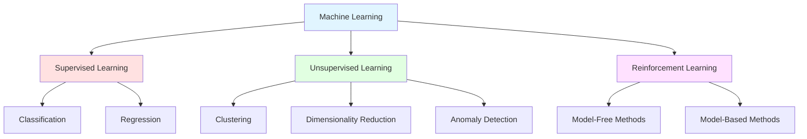
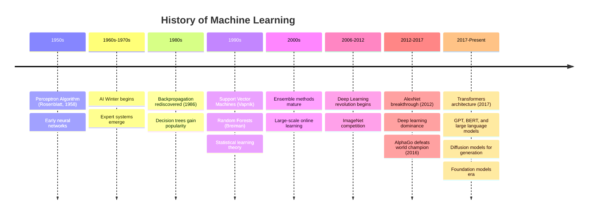

# Machine Learning Introduction

## What is Machine Learning?

Machine Learning (ML) is a subfield of artificial intelligence that focuses on developing algorithms and statistical models that enable computer systems to improve their performance on a specific task through experience, without being explicitly programmed for every possible scenario. Rather than following pre-defined rules, machine learning systems learn patterns from data and use those patterns to make predictions or decisions.

At its core, machine learning is about finding patterns in data and using those patterns to make intelligent decisions about new, unseen data. The fundamental premise is that systems can learn from data, identify patterns, and make decisions with minimal human intervention.

### Formal Definition

More formally, Tom Mitchell (1997) defined machine learning as: "A computer program is said to learn from experience E with respect to some class of tasks T and performance measure P, if its performance at tasks in T, as measured by P, improves with experience E."

For example:
- **Task (T)**: Classifying emails as spam or not spam
- **Experience (E)**: A dataset of emails labeled as spam or not spam
- **Performance (P)**: The percentage of emails correctly classified

## The Three Main Types of Machine Learning

Machine learning approaches can be broadly categorized into three main paradigms, each suited for different types of problems and data availability scenarios.

### 1. Supervised Learning

Supervised learning is the most common machine learning paradigm. In supervised learning, the algorithm learns from labeled training data, where each training example consists of an input and its corresponding desired output (label). The goal is to learn a mapping function from inputs to outputs that can generalize to new, unseen data.

**Key Characteristics:**
- Requires labeled training data
- Learning is guided by correct answers
- Objective is to minimize prediction error
- Can be evaluated using ground truth labels

**Mathematical Formulation:**

Given a training dataset $$D = \{(x_1, y_1), (x_2, y_2), ..., (x_n, y_n)\}$$ where $$x_i$$ represents input features and $$y_i$$ represents the corresponding label, the goal is to learn a function $$f: X \rightarrow Y$$ such that:

$$f(x_i) \approx y_i$$

**Common Applications:**
- Email spam detection (spam/not spam)
- Medical diagnosis (disease present/absent)
- Stock price prediction
- Credit risk assessment
- Image recognition
- Speech recognition

### 2. Unsupervised Learning

Unsupervised learning works with unlabeled data, where the algorithm must discover hidden patterns or structures without explicit guidance about what to look for. The system tries to learn the underlying structure of the data without any predefined categories or labels.

**Key Characteristics:**
- Works with unlabeled data
- Discovers hidden patterns autonomously
- No explicit feedback signal
- Often used for exploratory data analysis

**Mathematical Formulation:**

Given a dataset $$D = \{x_1, x_2, ..., x_n\}$$ (note: no labels), the goal is to discover structure, such as:
- Grouping similar examples: $$f: X \rightarrow \{1, 2, ..., k\}$$
- Reducing dimensionality: $$f: X \rightarrow Z$$ where $$\text{dim}(Z) < \text{dim}(X)$$
- Finding probability distributions: $$p(x)$$

**Common Applications:**
- Customer segmentation
- Market basket analysis
- Anomaly detection in network security
- Gene sequence analysis
- Recommendation systems
- Data compression

### 3. Reinforcement Learning

Reinforcement learning is a paradigm where an agent learns to make decisions by interacting with an environment. The agent receives feedback in the form of rewards or penalties and learns to maximize cumulative rewards over time through trial and error.

**Key Characteristics:**
- Learning through interaction with environment
- Delayed rewards and consequences
- Exploration vs. exploitation tradeoff
- Sequential decision-making

**Mathematical Formulation:**

The reinforcement learning problem is typically formulated as a Markov Decision Process (MDP) defined by:
- States: $$S$$
- Actions: $$A$$
- Transition probabilities: $$P(s'|s, a)$$
- Reward function: $$R(s, a, s')$$
- Policy: $$\pi: S \rightarrow A$$

The goal is to find an optimal policy $$\pi^*$$ that maximizes expected cumulative reward:

$$\pi^* = \arg\max_{\pi} \mathbb{E}\left[\sum_{t=0}^{\infty} \gamma^t R_t | \pi\right]$$

where $$\gamma \in [0, 1]$$ is a discount factor.

**Common Applications:**
- Game playing (chess, Go, video games)
- Robotics control
- Autonomous vehicles
- Resource management
- Trading strategies
- Personalized recommendations

## Additional Learning Paradigms

Beyond the main three categories, several other important paradigms have emerged:

### Semi-Supervised Learning

Combines labeled and unlabeled data, leveraging the structure in unlabeled data to improve learning with limited labels. This is particularly useful when labeling is expensive but unlabeled data is abundant.

**Use Cases:**
- Web content classification
- Medical image analysis where expert labeling is costly
- Speech analysis

### Self-Supervised Learning

A form of unsupervised learning where the system generates its own supervisory signal from the input data. The model learns to predict part of the input from other parts.

**Examples:**
- Predicting next word in a sentence (language modeling)
- Predicting masked words (BERT)
- Predicting image rotations
- Contrastive learning for image representations

### Transfer Learning

Learning from one task and applying that knowledge to a related but different task. Pre-trained models are fine-tuned for specific applications.

**Applications:**
- Using ImageNet pre-trained models for medical imaging
- Using language models for domain-specific NLP tasks

### Multi-Task Learning

Training a model simultaneously on multiple related tasks, allowing the model to share representations and improve generalization.

## History of Machine Learning

Machine learning has a rich history spanning several decades, with periods of intense progress and occasional setbacks.

### Key Milestones

**1943**: McCulloch & Pitts create computational model of neural networks

**1950**: Alan Turing proposes the "Turing Test"

**1957**: Frank Rosenblatt invents the Perceptron, one of the first artificial neural networks

**1969**: Minsky & Papert publish "Perceptrons," highlighting limitations of single-layer networks, contributing to the first AI winter

**1986**: Backpropagation algorithm popularized by Rumelhart, Hinton, and Williams, enabling training of multi-layer neural networks

**1995**: Support Vector Machines introduced by Cortes and Vapnik, becoming a dominant method for classification

**1997**: IBM's Deep Blue defeats world chess champion Garry Kasparov

**2001**: Random Forests algorithm published by Leo Breiman

**2006**: Geoffrey Hinton introduces Deep Belief Networks, reigniting interest in neural networks

**2012**: AlexNet wins ImageNet competition by a large margin, demonstrating the power of deep convolutional neural networks

**2014**: Generative Adversarial Networks (GANs) introduced by Ian Goodfellow

**2016**: AlphaGo defeats Lee Sedol, world champion Go player

**2017**: "Attention is All You Need" paper introduces Transformer architecture, revolutionizing NLP

**2018**: BERT demonstrates breakthrough performance on NLP benchmarks

**2020**: GPT-3 shows impressive few-shot learning capabilities with 175 billion parameters

**2022**: ChatGPT demonstrates conversational AI capabilities to broad public

**2023**: Large Language Models (LLMs) and Generative AI become mainstream

## Why Machine Learning Matters

Machine learning has become crucial in modern society for several compelling reasons:

### 1. Data Abundance

The digital age has created unprecedented amounts of data. Machine learning provides the tools to extract value from this data:

- **Volume**: Billions of transactions, interactions, and measurements daily
- **Velocity**: Real-time data streams requiring immediate processing
- **Variety**: Text, images, video, audio, sensor data, and more

### 2. Automation of Complex Tasks

ML enables automation of tasks that are difficult to program explicitly:

- Pattern recognition in images and speech
- Natural language understanding
- Complex decision-making under uncertainty
- Adaptive behavior in changing environments

### 3. Personalization

ML powers personalized experiences that adapt to individual preferences:

- Recommendation systems (Netflix, Spotify, Amazon)
- Personalized medicine and treatment plans
- Adaptive learning systems
- Targeted marketing and advertising

### 4. Scientific Discovery

ML accelerates scientific research:

- Drug discovery and protein folding (AlphaFold)
- Climate modeling and prediction
- Genomics and personalized medicine
- Particle physics and astronomy

### 5. Economic Impact

ML drives economic value across industries:

- Improved efficiency and productivity
- New products and services
- Enhanced decision-making
- Cost reduction through automation

## Challenges and Limitations

Despite its successes, machine learning faces several important challenges:

### Data Requirements

- Supervised learning requires large labeled datasets
- Labeling is often expensive and time-consuming
- Data quality directly impacts model performance
- Bias in training data leads to biased models

### Interpretability

- Many ML models are "black boxes"
- Difficult to explain decisions in critical applications
- Regulatory requirements for explainability
- Trust and accountability concerns

### Generalization

- Models may not generalize to different distributions
- Adversarial examples can fool models
- Overfitting to training data
- Domain shift and concept drift

### Computational Resources

- Deep learning requires significant computational power
- Large models have environmental costs
- Inference latency in real-time applications
- Model size and deployment constraints

### Ethical Considerations

- Privacy concerns with personal data
- Algorithmic bias and fairness
- Job displacement through automation
- Misuse potential (deepfakes, surveillance)

## The Machine Learning Mindset

Successful machine learning requires a particular way of thinking:

### Data-Driven Thinking

Focus on what the data shows rather than preconceptions:
- Let patterns emerge from data
- Validate assumptions empirically
- Continuously test and iterate

### Probabilistic Reasoning

Embrace uncertainty and think in probabilities:
- No model is perfect
- Quantify confidence in predictions
- Consider multiple hypotheses

### Iterative Development

ML is an iterative process:
1. Start simple (baseline models)
2. Evaluate systematically
3. Identify bottlenecks
4. Improve incrementally
5. Repeat

### Critical Evaluation

Always question and validate:
- Is the data representative?
- Are metrics appropriate?
- What are the failure modes?
- Will this generalize?

## Conclusion

Machine learning represents a fundamental shift in how we build intelligent systems. Rather than programming explicit rules, we create systems that learn from experience. The three main paradigms—supervised, unsupervised, and reinforcement learning—provide different approaches suited to different types of problems and data availability.

The field has evolved from early perceptrons to modern deep learning systems capable of remarkable feats like natural language understanding, image generation, and game playing. Yet challenges remain around data requirements, interpretability, generalization, and ethical considerations.

As we progress through this course, we'll dive deeper into the algorithms, mathematics, and practical techniques that make machine learning work. Understanding both the capabilities and limitations of ML is essential for applying it effectively and responsibly to real-world problems.

The journey from understanding basic concepts to building sophisticated ML systems requires mastering mathematical foundations, algorithmic techniques, and practical engineering skills. This introduction provides the conceptual framework upon which we'll build throughout the course.
