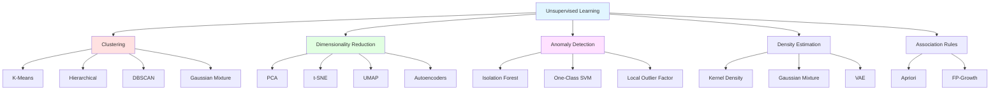
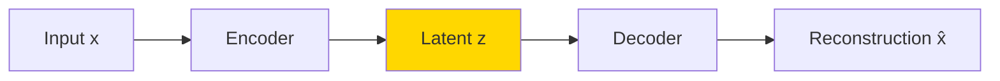

# Unsupervised Learning

## Introduction

Unsupervised learning represents a fundamentally different approach to machine learning compared to supervised learning. Rather than learning from labeled examples, unsupervised learning algorithms discover hidden patterns, structures, and relationships within unlabeled data. This paradigm is particularly powerful because unlabeled data is far more abundant than labeled data—the vast majority of data in the world exists without annotations or labels.

The name "unsupervised" reflects the absence of supervision or guidance in the form of labels. The algorithm must autonomously discover what is interesting or meaningful about the data without being told explicitly what to look for. This makes unsupervised learning both more challenging and, in some ways, more similar to how humans naturally learn about the world through observation and pattern recognition.

Unsupervised learning serves multiple purposes: exploratory data analysis, preprocessing for supervised learning, dimensionality reduction, anomaly detection, and discovering latent structure. These capabilities make it an indispensable tool in the machine learning practitioner's toolkit.

## Mathematical Framework

### Problem Formulation

Unlike supervised learning where we have pairs $$(x, y)$$, in unsupervised learning we only have:

$$D = \{x^{(1)}, x^{(2)}, ..., x^{(n)}\}$$

where $$x^{(i)} \in \mathbb{R}^d$$ are feature vectors without corresponding labels.

**Objectives vary by task:**

**Clustering:**
$$f: \mathbb{R}^d \rightarrow \{1, 2, ..., k\}$$
Assign each point to one of $$k$$ clusters.

**Dimensionality Reduction:**
$$f: \mathbb{R}^d \rightarrow \mathbb{R}^m$$ where $$m < d$$
Project to lower-dimensional space while preserving important structure.

**Density Estimation:**
$$f: \mathbb{R}^d \rightarrow \mathbb{R}^+$$
Estimate probability density $$p(x)$$ over input space.

**Anomaly Detection:**
$$f: \mathbb{R}^d \rightarrow \{0, 1\}$$
Identify unusual or anomalous examples.

## Clustering

Clustering algorithms group similar examples together without predefined categories. The goal is to maximize intra-cluster similarity while minimizing inter-cluster similarity.

### What is Clustering?

Clustering partitions data into groups (clusters) such that:
- Examples within a cluster are similar to each other
- Examples in different clusters are dissimilar from each other

**Formal Definition:**

Given dataset $$D = \{x^{(1)}, ..., x^{(n)}\}$$, find partition $$C = \{C_1, C_2, ..., C_k\}$$ where:

$$C_i \cap C_j = \emptyset \text{ for } i \neq j$$
$$\bigcup_{i=1}^{k} C_i = D$$

### Similarity and Distance Metrics

Clustering requires defining similarity or distance between examples.

**Euclidean Distance:**
$$d(x, y) = \sqrt{\sum_{j=1}^{d}(x_j - y_j)^2} = ||x - y||_2$$

**Manhattan Distance (L1):**
$$d(x, y) = \sum_{j=1}^{d}|x_j - y_j| = ||x - y||_1$$

**Cosine Similarity:**
$$\text{sim}(x, y) = \frac{x \cdot y}{||x|| \cdot ||y||} = \frac{\sum_{j=1}^{d}x_j y_j}{\sqrt{\sum_{j=1}^{d}x_j^2}\sqrt{\sum_{j=1}^{d}y_j^2}}$$

Cosine distance: $$d(x, y) = 1 - \text{sim}(x, y)$$

**Mahalanobis Distance:**
$$d(x, y) = \sqrt{(x - y)^T S^{-1} (x - y)}$$

where $$S$$ is the covariance matrix. Accounts for correlations between features.

### K-Means Clustering

The most widely used clustering algorithm, based on iteratively refining cluster centers.

**Algorithm:**

1. Initialize $$k$$ cluster centers $$\mu_1, ..., \mu_k$$ (randomly or using K-Means++)
2. Repeat until convergence:
   - **Assignment step**: Assign each point to nearest center
   $$c^{(i)} = \arg\min_{j} ||x^{(i)} - \mu_j||^2$$
   - **Update step**: Recompute centers as mean of assigned points
   $$\mu_j = \frac{1}{|C_j|}\sum_{i \in C_j} x^{(i)}$$

**Objective Function:**

K-Means minimizes within-cluster sum of squares (inertia):

$$J = \sum_{j=1}^{k}\sum_{i \in C_j}||x^{(i)} - \mu_j||^2$$

**Properties:**
- Guaranteed convergence (to local optimum)
- Time complexity: $$O(nkdt)$$ where $$t$$ is number of iterations
- Sensitive to initialization (use K-Means++ or multiple random starts)
- Assumes spherical clusters of similar size
- Requires specifying $$k$$ in advance

**Choosing K:**

**Elbow Method:**
Plot inertia vs. $$k$$, look for "elbow" where improvement slows:

$$\text{Inertia}(k) = \sum_{j=1}^{k}\sum_{i \in C_j}||x^{(i)} - \mu_j||^2$$

**Silhouette Score:**

For each point, compute:

$$s(i) = \frac{b(i) - a(i)}{\max(a(i), b(i))}$$

where:
- $$a(i)$$: Mean distance to points in same cluster
- $$b(i)$$: Mean distance to points in nearest different cluster

Silhouette ranges from -1 (wrong cluster) to +1 (perfect cluster).

Average silhouette score across all points indicates clustering quality.

### Hierarchical Clustering

Builds a hierarchy of clusters, represented as a dendrogram.

**Agglomerative (Bottom-Up):**

1. Start with each point as its own cluster
2. Repeatedly merge the two closest clusters
3. Continue until all points in one cluster or desired number reached

**Linkage Criteria:**

**Single Linkage (Minimum):**
$$d(C_i, C_j) = \min_{x \in C_i, y \in C_j} d(x, y)$$

Can create long, chain-like clusters.

**Complete Linkage (Maximum):**
$$d(C_i, C_j) = \max_{x \in C_i, y \in C_j} d(x, y)$$

Tends to create compact, spherical clusters.

**Average Linkage:**
$$d(C_i, C_j) = \frac{1}{|C_i||C_j|}\sum_{x \in C_i}\sum_{y \in C_j}d(x, y)$$

**Ward's Linkage:**
Minimize within-cluster variance (similar to K-Means objective).

$$\Delta(C_i, C_j) = \sum_{x \in C_i \cup C_j}||x - \mu_{ij}||^2 - \sum_{x \in C_i}||x - \mu_i||^2 - \sum_{x \in C_j}||x - \mu_j||^2$$

**Properties:**
- Produces dendrogram showing hierarchy
- No need to specify $$k$$ beforehand (cut dendrogram at desired level)
- Time complexity: $$O(n^2 \log n)$$ or $$O(n^3)$$
- Deterministic (no random initialization)
- Cannot undo merges (greedy algorithm)

### Density-Based Clustering (DBSCAN)

Clusters are dense regions separated by sparse regions.

**Key Concepts:**

**Core Point:**
Point with at least $$\text{minPts}$$ neighbors within radius $$\epsilon$$.

**Border Point:**
Not a core point, but within $$\epsilon$$ of a core point.

**Noise Point:**
Neither core nor border point.

**Algorithm:**

1. For each unvisited point $$p$$:
   - Mark $$p$$ as visited
   - If $$p$$ is core point:
     - Create new cluster
     - Add $$p$$ and all density-reachable points to cluster
   - Else if $$p$$ is border point:
     - Assign to nearest cluster
   - Else:
     - Mark as noise

**Properties:**
- Automatically determines number of clusters
- Can find arbitrarily shaped clusters
- Robust to outliers (marks as noise)
- Sensitive to parameters $$\epsilon$$ and $$\text{minPts}$$
- Time complexity: $$O(n \log n)$$ with spatial index, $$O(n^2)$$ without

### Gaussian Mixture Models (GMM)

Probabilistic clustering: data generated from mixture of Gaussian distributions.

**Model:**

$$p(x) = \sum_{k=1}^{K}\pi_k \mathcal{N}(x | \mu_k, \Sigma_k)$$

where:
- $$\pi_k$$: Mixing coefficient ($$\sum_k \pi_k = 1$$)
- $$\mathcal{N}(x | \mu_k, \Sigma_k)$$: Gaussian with mean $$\mu_k$$ and covariance $$\Sigma_k$$

**Expectation-Maximization (EM) Algorithm:**

**E-Step:**
Compute responsibility (probability point $$i$$ belongs to cluster $$k$$):

$$\gamma_{ik} = \frac{\pi_k \mathcal{N}(x^{(i)} | \mu_k, \Sigma_k)}{\sum_{j=1}^{K}\pi_j \mathcal{N}(x^{(i)} | \mu_j, \Sigma_j)}$$

**M-Step:**
Update parameters using responsibilities:

$$\mu_k = \frac{\sum_{i}\gamma_{ik}x^{(i)}}{\sum_{i}\gamma_{ik}}$$

$$\Sigma_k = \frac{\sum_{i}\gamma_{ik}(x^{(i)} - \mu_k)(x^{(i)} - \mu_k)^T}{\sum_{i}\gamma_{ik}}$$

$$\pi_k = \frac{1}{n}\sum_{i}\gamma_{ik}$$

**Properties:**
- Soft clustering (probabilistic assignments)
- Can model clusters with different shapes and sizes
- Provides generative model of data
- Requires specifying $$K$$
- Can overfit with many parameters

### Clustering Evaluation

Without ground truth labels, evaluating clustering is challenging.

**Internal Metrics (No ground truth):**

**Silhouette Score:**
Already discussed above. Range [-1, 1], higher is better.

**Davies-Bouldin Index:**

$$DB = \frac{1}{k}\sum_{i=1}^{k}\max_{j \neq i}\frac{s_i + s_j}{d_{ij}}$$

where $$s_i$$ is average distance within cluster $$i$$, $$d_{ij}$$ is distance between cluster centers.

Lower is better.

**Calinski-Harabasz Index (Variance Ratio):**

$$CH = \frac{\text{Between-cluster variance}}{\text{Within-cluster variance}} \cdot \frac{n - k}{k - 1}$$

Higher is better.

**External Metrics (With ground truth):**

**Adjusted Rand Index (ARI):**

Measures agreement between two partitions, adjusted for chance.

$$ARI = \frac{\text{RI} - E[\text{RI}]}{\max(\text{RI}) - E[\text{RI}]}$$

Range: [-1, 1], with 1 indicating perfect agreement, 0 indicating random labeling.

**Normalized Mutual Information (NMI):**

$$NMI = \frac{2 \cdot I(C, G)}{H(C) + H(G)}$$

where $$I$$ is mutual information, $$H$$ is entropy.

Range: [0, 1], with 1 indicating perfect agreement.

## Dimensionality Reduction

High-dimensional data is difficult to visualize and can cause computational and statistical problems (curse of dimensionality). Dimensionality reduction projects data to lower dimensions while preserving important structure.

### The Curse of Dimensionality

As dimensionality increases:
- Distance between points becomes less meaningful
- Data becomes increasingly sparse
- Computational cost increases exponentially
- Risk of overfitting increases

**Volume of hypersphere:**
$$V_d(r) = \frac{\pi^{d/2}}{\Gamma(d/2 + 1)}r^d$$

In high dimensions, almost all volume is near the surface.

### Principal Component Analysis (PCA)

PCA finds orthogonal directions of maximum variance in data.

**Mathematical Formulation:**

Find directions (principal components) that maximize variance:

$$\max_{w: ||w||=1} \text{Var}(w^T X) = w^T \Sigma w$$

where $$\Sigma$$ is the covariance matrix.

**Solution:**

Principal components are eigenvectors of covariance matrix $$\Sigma$$:

$$\Sigma w_i = \lambda_i w_i$$

Eigenvalues $$\lambda_i$$ represent variance explained by component $$i$$.

**Algorithm:**

1. Standardize data: $$X' = \frac{X - \mu}{\sigma}$$
2. Compute covariance matrix: $$\Sigma = \frac{1}{n}X^T X$$
3. Compute eigenvectors and eigenvalues of $$\Sigma$$
4. Sort eigenvectors by eigenvalues (descending)
5. Project data: $$Z = X W_k$$

where $$W_k$$ contains top $$k$$ eigenvectors.

**Choosing Number of Components:**

**Variance Explained:**

$$\frac{\sum_{i=1}^{k}\lambda_i}{\sum_{i=1}^{d}\lambda_i} \geq 0.95$$

Retain components explaining 95% of variance.

**Scree Plot:**
Plot eigenvalues, look for "elbow".

**Properties:**
- Linear transformation (can reconstruct original data)
- Optimal for Gaussian data
- Sensitive to scaling (always standardize)
- Assumes linear relationships
- Components are orthogonal
- Fast computation (SVD)

**Reconstruction:**

$$\hat{X} = Z W_k^T = X W_k W_k^T$$

**Reconstruction Error:**

$$E = ||X - \hat{X}||^2 = \sum_{i=k+1}^{d}\lambda_i$$

### t-SNE (t-Distributed Stochastic Neighbor Embedding)

Non-linear dimensionality reduction for visualization (typically 2D or 3D).

**Key Idea:**

Preserve local structure by matching probability distributions in high and low dimensions.

**High-Dimensional Similarity:**

$$p_{ij} = \frac{\exp(-||x_i - x_j||^2 / 2\sigma^2)}{\sum_{k \neq l}\exp(-||x_k - x_l||^2 / 2\sigma^2)}$$

**Low-Dimensional Similarity (Student t-distribution):**

$$q_{ij} = \frac{(1 + ||y_i - y_j||^2)^{-1}}{\sum_{k \neq l}(1 + ||y_k - y_l||^2)^{-1}}$$

**Objective (KL Divergence):**

$$C = \sum_{i}\sum_{j}p_{ij}\log\frac{p_{ij}}{q_{ij}}$$

Minimize using gradient descent.

**Properties:**
- Excellent for visualization
- Preserves local structure well
- Non-deterministic (random initialization)
- Computationally expensive ($$O(n^2)$$)
- Not for dimensionality reduction to $$d > 3$$
- Cannot transform new points (no explicit mapping)

### UMAP (Uniform Manifold Approximation and Projection)

Modern alternative to t-SNE with better scalability and preservation of global structure.

**Key Advantages over t-SNE:**
- Faster ($$O(n)$$ vs. $$O(n^2)$$)
- Better preserves global structure
- Can transform new points
- More consistent across runs
- Tunable balance between local and global structure

**Parameters:**
- $$n\_neighbors$$: Controls local vs. global structure
- $$min\_dist$$: Controls how tightly points cluster

### Autoencoders

Neural network-based dimensionality reduction.

**Architecture:**

**Encoder:** $$z = f_{\text{enc}}(x; \theta_{\text{enc}})$$

**Decoder:** $$\hat{x} = f_{\text{dec}}(z; \theta_{\text{dec}})$$

**Objective:**
$$\min_{\theta} \sum_{i}||x^{(i)} - f_{\text{dec}}(f_{\text{enc}}(x^{(i)}))||^2$$

**Properties:**
- Non-linear transformation
- Can learn complex manifolds
- Requires training (unlike PCA)
- Can transform new points
- Can be regularized (variational autoencoders)

## Anomaly Detection

Identify unusual or anomalous examples that don't fit typical patterns.

### Applications

- Fraud detection (credit card, insurance)
- Network intrusion detection
- Manufacturing defect detection
- Medical diagnosis (rare diseases)
- System monitoring (server failures)

### Challenges

**Imbalanced Data:**
Anomalies are rare by definition (often <1% of data).

**Unknown Anomaly Types:**
May not have examples of all types of anomalies.

**Concept Drift:**
What's anomalous can change over time.

### Statistical Methods

**Z-Score Method:**

$$z = \frac{x - \mu}{\sigma}$$

Flag points with $$|z| > \text{threshold}$$ (typically 3).

**Assumptions:**
- Gaussian distribution
- Univariate (can extend to multivariate)

**Mahalanobis Distance:**

$$d(x) = \sqrt{(x - \mu)^T \Sigma^{-1} (x - \mu)}$$

Accounts for correlations. Flag points with large distance.

### Density-Based Methods

**Local Outlier Factor (LOF):**

Compares local density of point to densities of its neighbors.

$$LOF(x) = \frac{\sum_{y \in N(x)}\frac{\rho(y)}{\rho(x)}}{|N(x)|}$$

where $$\rho(x)$$ is local density.

$$LOF(x) \approx 1$$: Normal
$$LOF(x) >> 1$$: Outlier (less dense than neighbors)

### Model-Based Methods

**One-Class SVM:**

Learn decision boundary around normal examples.

**Objective:**

$$\min_{w, \xi, \rho} \frac{1}{2}||w||^2 - \rho + \frac{1}{\nu n}\sum_{i}\xi_i$$

subject to: $$w^T \phi(x^{(i)}) \geq \rho - \xi_i$$

Anomaly if $$w^T \phi(x) < \rho$$.

**Isolation Forest:**

Build ensemble of random trees. Anomalies are easier to isolate (require fewer splits).

**Anomaly Score:**

$$s(x) = 2^{-\frac{E[h(x)]}{c(n)}}$$

where $$h(x)$$ is path length in tree, $$c(n)$$ is normalization constant.

Anomalies have shorter average path length (higher score).

**Properties:**
- Fast training and prediction
- Effective for high-dimensional data
- No need to define distance metric
- Scales well to large datasets

### Evaluation

**With labeled anomalies:**
- Precision, Recall, F1
- AUC-ROC, AUC-PR

**Without labels:**
- Visual inspection
- Domain expert validation
- Synthetic anomaly injection (test on known anomalies)

## Applications of Unsupervised Learning

### Customer Segmentation

**Problem:** Group customers by behavior for targeted marketing.

**Approach:**
- Cluster customers using features (purchase history, demographics)
- Analyze cluster characteristics
- Design targeted campaigns per segment

### Document Organization

**Problem:** Organize large document collections.

**Approach:**
- Represent documents as vectors (TF-IDF, embeddings)
- Cluster similar documents
- Visualize using dimensionality reduction

### Recommender Systems

**Problem:** Suggest items users might like.

**Approach:**
- Cluster users or items
- Recommend items popular within user's cluster
- Combine with collaborative filtering

### Feature Learning

**Problem:** Learn useful representations for downstream tasks.

**Approach:**
- Use autoencoders or PCA to learn features
- Use learned features in supervised learning
- Often improves performance and reduces overfitting

### Data Preprocessing

**Problem:** Prepare data for supervised learning.

**Approaches:**
- Dimensionality reduction (PCA) for computational efficiency
- Anomaly detection to remove outliers
- Clustering to handle class imbalance (oversample minority clusters)

## Challenges and Limitations

### No Ground Truth

**Problem:** Difficult to evaluate quality without labels.

**Solutions:**
- Use internal metrics (silhouette, etc.)
- Domain expert validation
- Downstream task performance

### Choosing Hyperparameters

**Problem:** Number of clusters, dimension, etc.

**Solutions:**
- Try multiple values, use metrics to compare
- Domain knowledge
- Visual inspection

### Interpretability

**Problem:** Understanding what patterns were discovered.

**Solutions:**
- Cluster visualization and profiling
- Feature importance analysis
- Example-based explanations

### Scalability

**Problem:** Many algorithms have $$O(n^2)$$ or worse complexity.

**Solutions:**
- Sampling and approximation
- Mini-batch variants
- Specialized algorithms (K-Means++, UMAP)

## Conclusion

Unsupervised learning provides powerful tools for discovering structure in unlabeled data. From clustering customers to reducing dimensionality for visualization, from detecting anomalies to learning features, unsupervised methods are essential for exploratory analysis and preprocessing.

The three main tasks—clustering, dimensionality reduction, and anomaly detection—each serve distinct purposes but share the challenge of operating without labels. This requires careful algorithm selection, parameter tuning, and evaluation using domain knowledge and internal metrics.

While unsupervised learning lacks the clear objective of supervised learning (minimize prediction error), it excels at revealing hidden patterns and structure that might not be apparent from raw data. As data continues to grow exponentially, the importance of unsupervised methods for understanding and organizing this data will only increase.

The algorithms and techniques introduced here form the foundation of unsupervised learning. Mastering them enables practitioners to extract value from unlabeled data, perform exploratory analysis, and prepare data for supervised learning tasks.