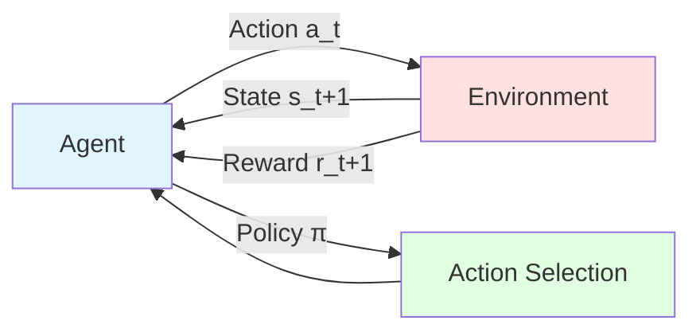
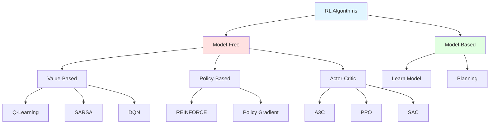

# Reinforcement Learning

## Introduction

Reinforcement Learning (RL) represents a fundamentally different approach to machine learning, one inspired by behavioral psychology and how animals (including humans) learn through interaction with their environment. Unlike supervised learning, which learns from labeled examples, or unsupervised learning, which discovers patterns in unlabeled data, reinforcement learning learns through trial and error, guided by rewards and penalties.

The central paradigm of RL is an agent interacting with an environment over time. The agent observes states of the environment, takes actions, and receives rewards (or penalties). Through these interactions, the agent learns a policy—a strategy for selecting actions—that maximizes cumulative reward over time. This framework is remarkably general and applies to domains ranging from game playing to robotics, from resource allocation to autonomous systems.

What makes RL particularly challenging and interesting is the credit assignment problem: when a reward is received, which of the many preceding actions was responsible? Additionally, agents must balance exploration (trying new actions to discover better strategies) with exploitation (using known good strategies to accumulate rewards). These challenges make RL both theoretically rich and practically demanding.

## Key Components of Reinforcement Learning

The RL framework consists of several fundamental components that define the learning problem.

### Agent

The learner or decision-maker that interacts with the environment. The agent:
- Observes the current state
- Selects actions according to its policy
- Receives rewards
- Updates its policy to improve future performance

The agent's goal is to learn an optimal policy that maximizes expected cumulative reward.

### Environment

Everything outside the agent that it interacts with. The environment:
- Maintains a state that may be fully or partially observable
- Responds to agent actions by transitioning to new states
- Provides rewards based on state transitions
- May be deterministic or stochastic

The environment defines the rules of the world the agent operates in.

### State

A representation of the current situation or configuration of the environment. Formally:

$$s_t \in \mathcal{S}$$

where $$\mathcal{S}$$ is the state space.

**Fully Observable:** Agent observes complete state (Markov Decision Process)

**Partially Observable:** Agent observes incomplete information (Partially Observable MDP)

**State Examples:**
- Chess: Board configuration
- Robot navigation: Position, velocity, sensor readings
- Stock trading: Current prices, portfolio, market indicators

### Action

A decision or move the agent makes. Formally:

$$a_t \in \mathcal{A}(s_t)$$

where $$\mathcal{A}(s_t)$$ is the set of actions available in state $$s_t$$.

**Discrete Actions:** Finite set of choices (chess moves, button presses)

**Continuous Actions:** Real-valued vectors (robot joint torques, steering angles)

### Reward

A scalar feedback signal indicating how good or bad an action was. Formally:

$$r_t \in \mathbb{R}$$

The reward at time $$t$$ depends on the current state, action, and resulting next state:

$$r_t = R(s_t, a_t, s_{t+1})$$

**Key Principle:** The reward hypothesis states that all goals can be described as maximizing expected cumulative reward.

**Reward Design:**
- Sparse rewards: Only at goal (chess: +1 for win, -1 for loss, 0 otherwise)
- Dense rewards: At every step (distance to goal)
- Shaped rewards: Carefully designed to guide learning

**Challenges:**
- Delayed rewards: Actions now affect rewards later
- Credit assignment: Which actions were responsible for reward?

### Policy

A strategy for selecting actions. The policy $$\pi$$ maps states to actions.

**Deterministic Policy:**
$$\pi: \mathcal{S} \rightarrow \mathcal{A}$$
$$a_t = \pi(s_t)$$

**Stochastic Policy:**
$$\pi: \mathcal{S} \times \mathcal{A} \rightarrow [0, 1]$$
$$a_t \sim \pi(\cdot | s_t)$$
$$P(a_t = a | s_t) = \pi(a | s_t)$$

The goal of RL is to learn an optimal policy $$\pi^*$$ that maximizes expected cumulative reward.

### Value Functions

Value functions estimate how good it is to be in a state or take an action, providing a basis for policy improvement.

**State Value Function:**

$$V^\pi(s) = \mathbb{E}_\pi\left[\sum_{t=0}^{\infty}\gamma^t r_t | s_0 = s\right]$$

Expected cumulative discounted reward starting from state $$s$$ following policy $$\pi$$.

**Action Value Function (Q-function):**

$$Q^\pi(s, a) = \mathbb{E}_\pi\left[\sum_{t=0}^{\infty}\gamma^t r_t | s_0 = s, a_0 = a\right]$$

Expected cumulative reward starting from state $$s$$, taking action $$a$$, then following policy $$\pi$$.

**Relationship:**
$$V^\pi(s) = \sum_{a}\pi(a|s)Q^\pi(s, a)$$

For deterministic policy:
$$V^\pi(s) = Q^\pi(s, \pi(s))$$

### Discount Factor

The discount factor $$\gamma \in [0, 1]$$ determines the importance of future rewards:

$$G_t = r_t + \gamma r_{t+1} + \gamma^2 r_{t+2} + ... = \sum_{k=0}^{\infty}\gamma^k r_{t+k}$$

**$$\gamma = 0$$:** Myopic agent, only cares about immediate reward

**$$\gamma \rightarrow 1$$:** Far-sighted agent, values future rewards nearly as much as immediate rewards

**Why discount?**
- Mathematical convenience (ensures convergence)
- Models time preference or uncertainty about future
- Encourages agent to reach goals sooner

## Markov Decision Processes (MDPs)

The standard mathematical framework for RL is the Markov Decision Process.

### Formal Definition

An MDP is defined by the tuple $$(\mathcal{S}, \mathcal{A}, P, R, \gamma)$$:

- $$\mathcal{S}$$: State space
- $$\mathcal{A}$$: Action space
- $$P$$: Transition probability function $$P(s'|s, a)$$
- $$R$$: Reward function $$R(s, a, s')$$ or $$R(s, a)$$
- $$\gamma$$: Discount factor

### Markov Property

The future is independent of the past given the present:

$$P(s_{t+1}|s_t, a_t, s_{t-1}, a_{t-1}, ..., s_0, a_0) = P(s_{t+1}|s_t, a_t)$$

The current state contains all relevant information for decision-making.

### Dynamics

The environment dynamics are defined by transition probabilities:

$$P(s'|s, a) = P(S_{t+1} = s' | S_t = s, A_t = a)$$

**Deterministic:** $$P(s'|s, a) \in \{0, 1\}$$

**Stochastic:** $$P(s'|s, a) \in [0, 1]$$, $$\sum_{s'}P(s'|s, a) = 1$$

### Return

The cumulative discounted reward from time $$t$$:

$$G_t = r_t + \gamma r_{t+1} + \gamma^2 r_{t+2} + ... = \sum_{k=0}^{\infty}\gamma^k r_{t+k}$$

Can also be defined recursively:

$$G_t = r_t + \gamma G_{t+1}$$

### Bellman Equations

The Bellman equations express recursive relationships between value functions.

**Bellman Expectation Equation for $$V^\pi$$:**

$$V^\pi(s) = \sum_{a}\pi(a|s)\sum_{s'}P(s'|s, a)[R(s, a, s') + \gamma V^\pi(s')]$$

**Bellman Expectation Equation for $$Q^\pi$$:**

$$Q^\pi(s, a) = \sum_{s'}P(s'|s, a)[R(s, a, s') + \gamma \sum_{a'}\pi(a'|s')Q^\pi(s', a')]$$

**Bellman Optimality Equation for $$V^*$$:**

$$V^*(s) = \max_{a}\sum_{s'}P(s'|s, a)[R(s, a, s') + \gamma V^*(s')]$$

**Bellman Optimality Equation for $$Q^*$$:**

$$Q^*(s, a) = \sum_{s'}P(s'|s, a)[R(s, a, s') + \gamma \max_{a'}Q^*(s', a')]$$

**Optimal Policy:**

$$\pi^*(s) = \arg\max_{a}Q^*(s, a)$$

## The Exploration-Exploitation Tradeoff

One of the fundamental challenges in RL is balancing exploration and exploitation.

**Exploitation:** Choose actions that maximize reward based on current knowledge

**Exploration:** Try new actions to discover potentially better strategies

**The Dilemma:**
- Pure exploitation: May miss better strategies
- Pure exploration: May never use good strategies found

### Epsilon-Greedy Strategy

With probability $$\epsilon$$, choose random action (explore). Otherwise, choose best known action (exploit).

$$a_t = \begin{cases}
\text{random action} & \text{with probability } \epsilon \\
\arg\max_{a}Q(s_t, a) & \text{with probability } 1 - \epsilon
\end{cases}$$

**Decaying epsilon:**
$$\epsilon_t = \max(\epsilon_{\min}, \epsilon_0 \cdot \text{decay}^t)$$

Start with high exploration, gradually reduce to focus on exploitation.

### Boltzmann Exploration (Softmax)

Choose actions probabilistically based on their values:

$$P(a|s) = \frac{e^{Q(s, a)/\tau}}{\sum_{a'}e^{Q(s, a')/\tau}}$$

where $$\tau$$ is the temperature parameter:
- High $$\tau$$: More random (exploration)
- Low $$\tau$$: More greedy (exploitation)

### Upper Confidence Bound (UCB)

Balance exploration and exploitation by adding uncertainty bonus:

$$a_t = \arg\max_{a}\left[Q(s_t, a) + c\sqrt{\frac{\log t}{N(s_t, a)}}\right]$$

where:
- $$N(s_t, a)$$: Number of times action $$a$$ taken in state $$s_t$$
- $$c$$: Exploration constant

Explores actions that are uncertain (low $$N$$) or promising (high $$Q$$).

## Q-Learning: A Fundamental RL Algorithm

Q-learning is a model-free, off-policy algorithm that learns the optimal action-value function directly.

### Algorithm

**Initialize:** $$Q(s, a)$$ arbitrarily for all $$s, a$$

**For each episode:**
1. Initialize state $$s$$
2. **For each step of episode:**
   - Choose action $$a$$ from $$s$$ using policy derived from $$Q$$ (e.g., $$\epsilon$$-greedy)
   - Take action $$a$$, observe reward $$r$$ and next state $$s'$$
   - Update Q-value:
   $$Q(s, a) \leftarrow Q(s, a) + \alpha[r + \gamma \max_{a'}Q(s', a') - Q(s, a)]$$
   - $$s \leftarrow s'$$
3. Until $$s$$ is terminal

### Q-Learning Update Rule

$$Q(s, a) \leftarrow Q(s, a) + \alpha[r + \gamma \max_{a'}Q(s', a') - Q(s, a)]$$

**Components:**
- $$\alpha \in [0, 1]$$: Learning rate
- $$r + \gamma \max_{a'}Q(s', a')$$: TD target (what we think $$Q(s, a)$$ should be)
- $$r + \gamma \max_{a'}Q(s', a') - Q(s, a)$$: TD error (difference between target and current estimate)

**Key Properties:**
- **Model-free:** Doesn't require knowing $$P(s'|s, a)$$
- **Off-policy:** Learns optimal $$Q$$ while following exploratory policy
- **Convergence:** Converges to $$Q^*$$ under certain conditions (visit all state-action pairs infinitely often, learning rate decays appropriately)

### Tabular Q-Learning

For small state and action spaces, store $$Q(s, a)$$ in a table:

$$\begin{array}{c|ccc}
& a_1 & a_2 & a_3 \\
\hline
s_1 & Q(s_1, a_1) & Q(s_1, a_2) & Q(s_1, a_3) \\
s_2 & Q(s_2, a_1) & Q(s_2, a_2) & Q(s_2, a_3) \\
s_3 & Q(s_3, a_1) & Q(s_3, a_2) & Q(s_3, a_3)
\end{array}$$

**Limitations:**
- Doesn't scale to large or continuous state spaces
- No generalization to unseen states
- Requires visiting every state-action pair

### Function Approximation

For large state spaces, approximate $$Q$$ with a function:

$$Q(s, a) \approx \hat{Q}(s, a; \theta)$$

where $$\theta$$ are parameters (e.g., neural network weights).

**Deep Q-Networks (DQN):**

Use deep neural networks to approximate $$Q$$:

$$\hat{Q}(s, a; \theta) = \text{NeuralNetwork}(s, a; \theta)$$

**Update:**

$$\theta \leftarrow \theta + \alpha[r + \gamma \max_{a'}\hat{Q}(s', a'; \theta^-) - \hat{Q}(s, a; \theta)]\nabla_\theta \hat{Q}(s, a; \theta)$$

where $$\theta^-$$ are target network parameters (updated periodically for stability).

## SARSA: On-Policy Learning

SARSA is similar to Q-learning but is on-policy (learns value of policy being followed).

### Algorithm

**Initialize:** $$Q(s, a)$$ arbitrarily

**For each episode:**
1. Initialize state $$s$$
2. Choose action $$a$$ from $$s$$ using policy derived from $$Q$$
3. **For each step of episode:**
   - Take action $$a$$, observe $$r$$, $$s'$$
   - Choose $$a'$$ from $$s'$$ using policy derived from $$Q$$
   - Update:
   $$Q(s, a) \leftarrow Q(s, a) + \alpha[r + \gamma Q(s', a') - Q(s, a)]$$
   - $$s \leftarrow s'$$, $$a \leftarrow a'$$
4. Until $$s$$ is terminal

### Q-Learning vs. SARSA

**Q-Learning (Off-policy):**
- Learns optimal policy regardless of behavior policy
- Target: $$r + \gamma \max_{a'}Q(s', a')$$
- Can learn from exploratory or even random actions
- More aggressive, can be unstable

**SARSA (On-policy):**
- Learns value of policy being followed
- Target: $$r + \gamma Q(s', a')$$ where $$a'$$ is actually chosen
- More conservative, accounts for exploration
- More stable, safer in some domains

**Example (Cliff Walking):**
- Q-learning learns optimal but risky path along cliff edge
- SARSA learns safer path farther from cliff (accounts for exploration risk)

## Types of RL Algorithms

### Model-Free vs. Model-Based

**Model-Free:**
- Learn policy/value function directly from experience
- No explicit model of environment dynamics
- Simpler but requires more experience
- Q-learning, SARSA, policy gradient methods

**Model-Based:**
- Learn model of environment ($$P(s'|s, a)$$, $$R(s, a)$$)
- Use model for planning
- More sample-efficient but complex
- Can suffer from model errors

## Applications of Reinforcement Learning

### Game Playing

**Achievements:**
- **TD-Gammon (1992):** Backgammon at expert level
- **DQN (2013):** Atari games from pixels
- **AlphaGo (2016):** Defeated world champion at Go
- **AlphaStar (2019):** StarCraft II at Grandmaster level
- **OpenAI Five (2018):** Dota 2 at professional level

### Robotics

**Applications:**
- Manipulation (grasping, assembly)
- Locomotion (walking, running)
- Navigation (path planning, obstacle avoidance)
- Helicopter aerobatics

**Challenges:**
- Sample efficiency (real-world interactions are slow and costly)
- Safety (exploration can be dangerous)
- Sim-to-real transfer (training in simulation, deploying in reality)

### Autonomous Vehicles

**Tasks:**
- Lane keeping
- Adaptive cruise control
- Traffic light navigation
- Parking

**Considerations:**
- Safety-critical
- Multi-agent interactions
- Partially observable environment

### Resource Management

**Applications:**
- Data center cooling (Google achieved 40% reduction in energy)
- Traffic signal control
- Power grid management
- Cloud resource allocation

### Personalization

**Applications:**
- Recommendation systems (YouTube, Netflix)
- Online advertising
- Personalized education
- Healthcare treatment optimization

### Finance

**Applications:**
- Algorithmic trading
- Portfolio management
- Option pricing
- Risk management

## Challenges in Reinforcement Learning

### Sample Efficiency

**Problem:** RL often requires millions of interactions to learn.

**Solutions:**
- Model-based RL
- Transfer learning
- Imitation learning (learn from expert demonstrations)
- Meta-learning (learn to learn faster)

### Credit Assignment

**Problem:** Which actions were responsible for rewards received much later?

**Solutions:**
- Eligibility traces
- Hindsight experience replay
- Attention mechanisms

### Partial Observability

**Problem:** Agent doesn't observe full state.

**Solutions:**
- Recurrent neural networks (maintain memory)
- Belief state tracking
- Observation history as state

### Reward Design

**Problem:** Specifying reward function that captures desired behavior.

**Challenges:**
- Reward hacking (agent exploits unintended loopholes)
- Sparse rewards (no signal for learning)
- Multi-objective tradeoffs

**Solutions:**
- Inverse reinforcement learning (learn reward from demonstrations)
- Reward shaping (add intermediate rewards)
- Multi-objective optimization

### Safety and Ethics

**Concerns:**
- Exploration can cause harm in real world
- Unforeseen behaviors
- Alignment with human values

**Approaches:**
- Safe exploration
- Constrained RL
- Human-in-the-loop
- Formal verification

## Conclusion

Reinforcement learning provides a powerful framework for learning through interaction. By framing problems as Markov Decision Processes and learning policies that maximize cumulative reward, RL has achieved remarkable successes in game playing, robotics, and autonomous systems.

The core concepts—agent, environment, states, actions, rewards, and policies—form a general framework applicable to diverse domains. Value functions and the Bellman equations provide principled ways to evaluate and improve policies. Q-learning demonstrates how optimal behavior can be learned without a model of the environment.

However, RL faces significant challenges: sample efficiency, credit assignment, exploration-exploitation tradeoffs, and safety concerns. Ongoing research addresses these challenges through deep learning, model-based methods, meta-learning, and safe exploration techniques.

As we progress through this course, we'll see how RL concepts connect with supervised and unsupervised learning, and how modern deep RL methods combine neural networks with classical RL algorithms to tackle complex real-world problems. Understanding RL fundamentals is essential for developing intelligent agents that learn and adapt through interaction with their environment.