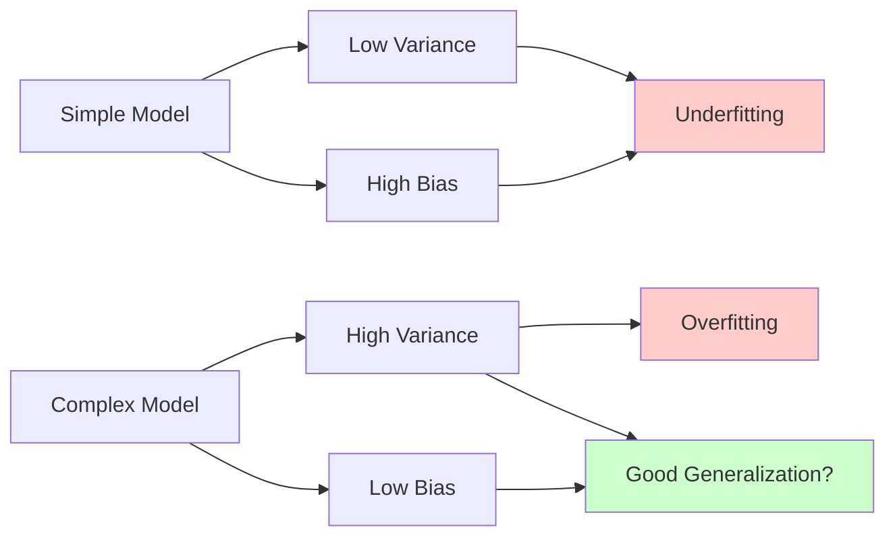
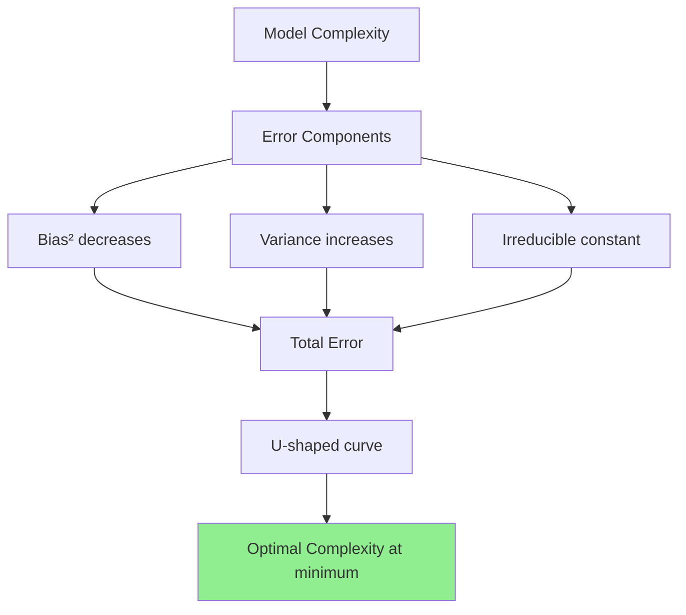
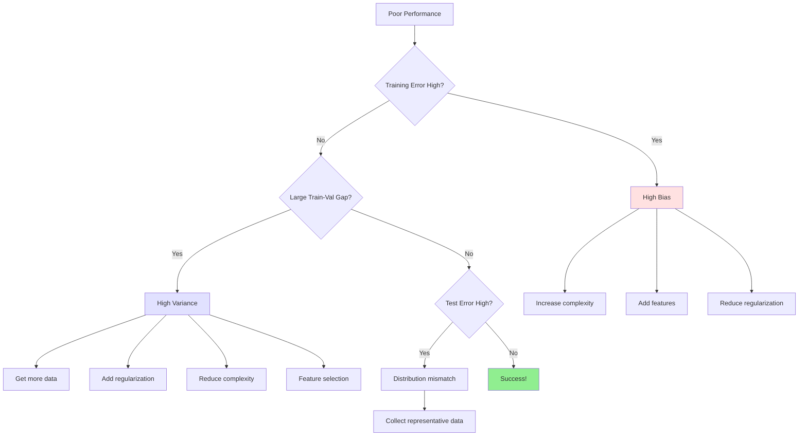

# Bias-Variance Tradeoff

## Introduction

The bias-variance tradeoff is one of the most fundamental concepts in machine learning and statistics. It explains why models fail to generalize and provides a framework for understanding the sources of prediction error. Every machine learning practitioner must deeply understand this tradeoff to build models that perform well on unseen data.

When we train a model, our ultimate goal isn't simply to fit the training data perfectly—it's to make accurate predictions on new, unseen examples. The bias-variance tradeoff illuminates why this is challenging: reducing one source of error often increases another. This fundamental tension shapes how we design, train, and evaluate machine learning models.

Understanding the bias-variance decomposition helps us diagnose why models underperform and guides us toward appropriate solutions. Is the model too simple to capture patterns (high bias)? Is it too complex and fitting noise (high variance)? Or do we simply need more data or better features? These questions are central to successful machine learning practice.

## The Bias-Variance Decomposition

### Mathematical Framework

Consider a supervised learning problem where we want to learn a function $$f: X \rightarrow Y$$ that maps inputs $$x$$ to outputs $$y$$. The true relationship includes inherent noise:

$$y = f(x) + \epsilon$$

where $$\epsilon$$ is irreducible noise with $$\mathbb{E}[\epsilon] = 0$$ and $$\text{Var}(\epsilon) = \sigma^2$$.

We train a model $$\hat{f}$$ on a training dataset $$D$$, and we want to understand the expected prediction error at a new point $$x_0$$.

### Expected Mean Squared Error

The expected prediction error (over all possible training sets) can be decomposed:

$$\mathbb{E}_D[(y_0 - \hat{f}(x_0))^2] = \text{Bias}[\hat{f}(x_0)]^2 + \text{Var}[\hat{f}(x_0)] + \sigma^2$$

This remarkable equation shows that prediction error comes from three sources:

**Bias:** Error from incorrect assumptions in the learning algorithm

**Variance:** Error from sensitivity to fluctuations in the training data

**Irreducible Error:** Noise inherent in the problem

### Detailed Derivation

Let's derive this decomposition step by step:

$$\mathbb{E}_D[(y_0 - \hat{f}(x_0))^2]$$

Let $$\bar{f}(x_0) = \mathbb{E}_D[\hat{f}(x_0)]$$ be the average prediction across all possible training sets.

$$= \mathbb{E}_D[(y_0 - \bar{f}(x_0) + \bar{f}(x_0) - \hat{f}(x_0))^2]$$

$$= \mathbb{E}_D[(y_0 - \bar{f}(x_0))^2] + \mathbb{E}_D[(\bar{f}(x_0) - \hat{f}(x_0))^2] + 2\mathbb{E}_D[(y_0 - \bar{f}(x_0))(\bar{f}(x_0) - \hat{f}(x_0))]$$

The cross term vanishes because $$\bar{f}(x_0)$$ is constant with respect to $$\mathbb{E}_D$$ and $$\mathbb{E}_D[\hat{f}(x_0)] = \bar{f}(x_0)$$:

$$= (f(x_0) - \bar{f}(x_0))^2 + \sigma^2 + \mathbb{E}_D[(\hat{f}(x_0) - \bar{f}(x_0))^2]$$

$$= \text{Bias}[\hat{f}(x_0)]^2 + \text{Var}[\hat{f}(x_0)] + \sigma^2$$

where:

$$\text{Bias}[\hat{f}(x_0)] = \mathbb{E}_D[\hat{f}(x_0)] - f(x_0) = \bar{f}(x_0) - f(x_0)$$

$$\text{Var}[\hat{f}(x_0)] = \mathbb{E}_D[(\hat{f}(x_0) - \bar{f}(x_0))^2]$$

## Understanding Bias

### Definition

Bias measures how far, on average, predictions deviate from the true values:

$$\text{Bias}[\hat{f}(x)] = \mathbb{E}_D[\hat{f}(x)] - f(x)$$

High bias indicates systematic errors—the model makes consistent mistakes regardless of the training data.

### Sources of Bias

**Insufficient Model Complexity:**
- Linear model for non-linear relationship
- Too few features
- Strong regularization

**Incorrect Assumptions:**
- Assuming independence when features are correlated
- Wrong distribution family
- Missing important interactions

**Poor Feature Representation:**
- Relevant information not captured in features
- Wrong feature transformations

### High Bias Symptoms

**Underfitting:** Model too simple to capture underlying patterns

**Characteristics:**
- Poor performance on both training and test data
- Large training error
- Training and test errors are similar (both high)
- Learning curves plateau at high error

**Visual Example:**

Consider fitting a quadratic function $$f(x) = x^2$$ with different models:

**Linear model (high bias):**
$$\hat{f}(x) = \theta_0 + \theta_1 x$$

No matter how much data we collect, a linear model cannot capture the curvature. The bias is the difference between the best possible linear fit and the true function.

### Reducing Bias

**Increase Model Complexity:**
- Use more powerful model class (linear → polynomial → neural network)
- Add more features
- Add polynomial/interaction features

**Reduce Regularization:**
- Decrease regularization strength $$\lambda$$
- Allow model more flexibility

**Improve Features:**
- Engineer better features
- Use domain knowledge
- Add non-linear transformations

**Train Longer:**
- More iterations for iterative algorithms
- Ensure convergence

## Understanding Variance

### Definition

Variance measures how much predictions vary across different training sets:

$$\text{Var}[\hat{f}(x)] = \mathbb{E}_D[(\hat{f}(x) - \mathbb{E}_D[\hat{f}(x)])^2]$$

High variance means the model is sensitive to small fluctuations in training data—it fits the specific quirks of each training set rather than general patterns.

### Sources of Variance

**Excessive Model Complexity:**
- Too many parameters relative to training data
- Very flexible model (high-degree polynomials, deep trees)
- No regularization

**Small Training Set:**
- Fewer examples provide less constraint
- Model fits noise in the limited data

**Noisy Features:**
- Random features increase variance
- Irrelevant features add flexibility without benefit

### High Variance Symptoms

**Overfitting:** Model fits training data too closely, including noise

**Characteristics:**
- Excellent performance on training data
- Poor performance on test data
- Large gap between training and test error
- Small changes in training data cause large changes in model

**Visual Example:**

**High-degree polynomial (high variance):**
$$\hat{f}(x) = \sum_{i=0}^{20}\theta_i x^i$$

With 20 parameters and limited data, the model fits training points nearly perfectly but oscillates wildly between them. Different training sets produce very different polynomials.

### Reducing Variance

**Reduce Model Complexity:**
- Simpler model class
- Fewer features (feature selection)
- Smaller neural networks

**Increase Regularization:**
- L1 (Lasso), L2 (Ridge), Elastic Net
- Dropout (neural networks)
- Early stopping

**Get More Data:**
- More training examples provide stronger constraints
- Data augmentation (if applicable)

**Ensemble Methods:**
- Bagging (Bootstrap Aggregating)
- Random Forests
- Average predictions from multiple models

## The Tradeoff

### Why the Tradeoff Exists



**The Fundamental Tension:**

Increasing model complexity:
- Reduces bias (can fit more complex patterns)
- Increases variance (more sensitive to data)

Reducing model complexity:
- Increases bias (less flexible)
- Reduces variance (more stable)

**Optimal Complexity:**

There exists a sweet spot where total error is minimized:

$$\text{Total Error} = \text{Bias}^2 + \text{Variance} + \text{Irreducible Error}$$



### Visualizing the Tradeoff

Imagine plotting error vs. model complexity:

**Low Complexity (left):**
- High bias, low variance
- Underfitting
- Both training and test error high

**Optimal Complexity (middle):**
- Balanced bias and variance
- Best generalization
- Lowest test error

**High Complexity (right):**
- Low bias, high variance
- Overfitting
- Low training error, high test error

## Overfitting

### What is Overfitting?

Overfitting occurs when a model learns patterns specific to the training data, including noise and random fluctuations, rather than the underlying generalizable patterns.

**Metaphor:** Memorizing exam questions vs. understanding concepts

A student who memorizes specific exam questions performs perfectly on practice tests but fails on new questions. Similarly, an overfit model performs well on training data but poorly on new examples.

### Mathematical Perspective

An overfit model has:
- Low bias: $$\mathbb{E}_D[\hat{f}(x)] \approx f(x)$$
- High variance: $$\text{Var}[\hat{f}(x)]$$ is large
- Low training error: $$\frac{1}{n}\sum_{i=1}^{n}(y^{(i)} - \hat{f}(x^{(i)}))^2 \approx 0$$
- High test error: $$\mathbb{E}[(y - \hat{f}(x))^2]$$ is large

### Causes of Overfitting

**Model Too Complex:**
- Too many parameters: $$p > n$$ (parameters exceed samples)
- Too flexible (high-degree polynomials, deep trees, large neural networks)

**Insufficient Data:**
- Small training set $$n$$
- Training data not representative of population

**Training Too Long:**
- Continuing to optimize after generalizable patterns learned
- Fitting noise in later iterations

**Noisy Features:**
- Including random or irrelevant features
- Model fits spurious correlations

### Detecting Overfitting

**Training vs. Validation Error:**

```
Training Error: Low
Validation Error: High
Gap: Large
```

**Learning Curves:**

Plot error vs. training set size:

**Overfit model:**
- Training error remains low as data increases
- Validation error starts high, slowly decreases
- Large gap persists even with more data

**Validation Curve:**

Plot error vs. model complexity (e.g., polynomial degree):

**Overfit region:**
- Training error continues decreasing
- Validation error starts increasing (U-shape)

### Preventing Overfitting

**Cross-Validation:**
- K-fold cross-validation
- Provides robust estimate of generalization
- Helps detect overfitting during development

**Regularization:**

Add penalty term to loss function:

$$L(\theta) = \text{Data Loss} + \lambda \cdot \text{Regularization}$$

Forces simpler models by constraining parameters.

**Early Stopping:**

Monitor validation error during training:

```
1. Track validation error each epoch
2. Stop when validation error stops improving
3. Return parameters from best validation epoch
```

**Data Augmentation:**
- Artificially expand training set
- Images: rotations, crops, flips
- Text: synonym replacement, back-translation

**Ensemble Methods:**
- Combine multiple models
- Reduces variance through averaging
- Bootstrap aggregating (bagging)

**Dropout (Neural Networks):**

Randomly deactivate neurons during training:

$$h_i = \begin{cases}
0 & \text{with probability } p \\
\text{activation} & \text{with probability } 1-p
\end{cases}$$

Prevents co-adaptation of neurons.

## Underfitting

### What is Underfitting?

Underfitting occurs when a model is too simple to capture underlying patterns in the data.

**Metaphor:** Using a straight edge to trace a curve

No matter how carefully you try, a straight edge cannot capture curvature. Similarly, an underfit model lacks the complexity to represent the true relationship.

### Mathematical Perspective

An underfit model has:
- High bias: $$|\mathbb{E}_D[\hat{f}(x)] - f(x)|$$ is large
- Low variance: $$\text{Var}[\hat{f}(x)]$$ is small
- High training error
- High test error (similar to training error)

### Causes of Underfitting

**Model Too Simple:**
- Insufficient parameters or complexity
- Linear model for non-linear relationship
- Too few features

**Excessive Regularization:**
- $$\lambda$$ too large
- Over-constrains model flexibility

**Insufficient Training:**
- Stopped optimization too early
- Learning rate too low

### Detecting Underfitting

**Training Error High:**
```
Training Error: High
Validation Error: High
Gap: Small (both bad)
```

**Learning Curves:**

**Underfit model:**
- Both training and validation error high
- Errors converge quickly to plateau
- More data doesn't help significantly

**Validation Curve:**

**Underfit region:**
- Both errors high
- Decreasing as complexity increases

### Fixing Underfitting

**Increase Model Complexity:**
- More parameters
- More powerful model class (linear → polynomial → neural network)

**Add Features:**
- Engineer new features
- Polynomial features
- Interaction terms

**Reduce Regularization:**
- Decrease $$\lambda$$
- Remove constraints

**Train Longer:**
- More epochs/iterations
- Ensure convergence

**Remove Noise:**
- Clean data
- Remove outliers that mislead simple models

## Regularization

Regularization is the primary tool for managing the bias-variance tradeoff by adding constraints to model complexity.

### Why Regularize?

Without regularization, models with many parameters tend to overfit:
- Fit noise in training data
- Large parameter values can cause instability
- Poor generalization

Regularization adds inductive bias, preferring simpler models.

### L2 Regularization (Ridge)

Add squared magnitude of parameters to loss:

$$L(\theta) = \frac{1}{n}\sum_{i=1}^{n}(y^{(i)} - h_\theta(x^{(i)}))^2 + \lambda||\theta||_2^2$$

$$||\theta||_2^2 = \sum_{j=1}^{d}\theta_j^2$$

**Effect:**
- Penalizes large weights
- Shrinks weights toward zero (but not exactly zero)
- Smooth weight decay
- Closed-form solution for linear regression:

$$\theta = (X^T X + \lambda I)^{-1}X^T y$$

**Properties:**
- Differentiable everywhere
- All features retained (weights shrunk but non-zero)
- Works well when many features are moderately useful

### L1 Regularization (Lasso)

Add absolute magnitude of parameters:

$$L(\theta) = \frac{1}{n}\sum_{i=1}^{n}(y^{(i)} - h_\theta(x^{(i)}))^2 + \lambda||\theta||_1$$

$$||\theta||_1 = \sum_{j=1}^{d}|\theta_j|$$

**Effect:**
- Drives some weights exactly to zero
- Performs feature selection
- Sparse solutions

**Properties:**
- Not differentiable at zero (use subgradients)
- Built-in feature selection
- Works well when few features are truly important

### Elastic Net

Combines L1 and L2:

$$L(\theta) = \text{Data Loss} + \lambda_1||\theta||_1 + \lambda_2||\theta||_2^2$$

**Benefits:**
- Feature selection (L1) with stability (L2)
- Handles correlated features better than Lasso
- Two hyperparameters to tune

### Choosing Regularization Strength

**Grid Search:**
```
λ_candidates = [0.001, 0.01, 0.1, 1, 10, 100]
For each λ:
    Train model with λ
    Evaluate on validation set
Choose λ with best validation performance
```

**Cross-Validation:**

Use k-fold CV for robust evaluation at each $$\lambda$$.

**Regularization Path:**

Plot validation error vs. $$\log(\lambda)$$:
- Too small: overfitting
- Too large: underfitting
- Sweet spot: minimum validation error

### Regularization in Practice

**Neural Networks:**
- L2 (weight decay): Most common
- Dropout: Randomly deactivate neurons
- Batch normalization: Normalizes activations
- Early stopping: Stop when validation error increases

**Decision Trees:**
- Max depth
- Min samples per leaf
- Max features to consider

**Ensemble Methods:**
- Number of models
- Subsample size

## Learning Curves

Learning curves plot performance metrics vs. training set size or training iterations, providing insights into bias and variance.

### Types of Learning Curves

**Performance vs. Training Set Size:**

Plot training and validation error as training data increases.

**Performance vs. Training Iterations:**

Plot error vs. epochs/iterations during training.

### Interpreting Learning Curves

**High Bias (Underfitting):**

```
Training Error: High, plateaus quickly
Validation Error: High, similar to training
Gap: Small
Interpretation: More data won't help much; need more complex model
```

**High Variance (Overfitting):**

```
Training Error: Low, continues decreasing
Validation Error: Higher than training, slowly decreasing
Gap: Large
Interpretation: More data will likely help; reduce complexity or regularize
```

**Well-Fit:**

```
Training Error: Low
Validation Error: Low, close to training error
Gap: Small
Interpretation: Good balance; model generalizes well
```

### Using Learning Curves for Diagnosis

**If training and validation errors are high:**
- High bias problem
- Solution: Increase model complexity, add features

**If large gap between training and validation:**
- High variance problem
- Solution: More data, regularization, simpler model

**If errors are low and close:**
- Good fit
- May try slightly more complex model for improvement

## Practical Guidelines

### Model Development Workflow

1. **Start Simple:**
   - Begin with simple baseline model
   - Establishes minimum performance
   - Quick to train and debug

2. **Diagnose:**
   - Plot learning curves
   - Compare training and validation error
   - Identify bias vs. variance

3. **Iterate:**
   - If high bias: Increase complexity
   - If high variance: Regularize or get more data
   - Repeat until satisfactory performance

### Debugging Decision Tree



## Conclusion

The bias-variance tradeoff is fundamental to understanding machine learning. Every model faces this tradeoff: simple models have high bias but low variance (underfitting), while complex models have low bias but high variance (overfitting). The goal is finding the right balance.

Understanding the decomposition of expected error into bias, variance, and irreducible error provides a framework for diagnosing and fixing model issues. Learning curves, cross-validation, and regularization are essential tools for managing this tradeoff.

Key takeaways:
- **Bias** comes from incorrect assumptions and insufficient complexity
- **Variance** comes from excessive complexity and sensitivity to training data
- **Regularization** manages the tradeoff by constraining model complexity
- **Cross-validation** provides robust estimates of generalization
- **Learning curves** diagnose whether problems are bias or variance

Mastering the bias-variance tradeoff transforms machine learning from alchemy to engineering. Rather than randomly trying different models and hyperparameters, we can systematically diagnose issues and apply appropriate solutions. This understanding is essential for building models that generalize well to new data.