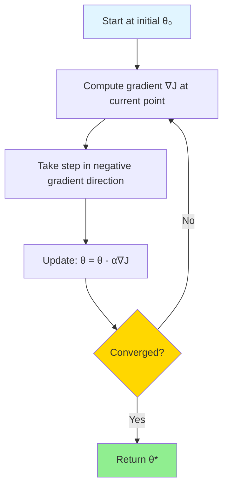
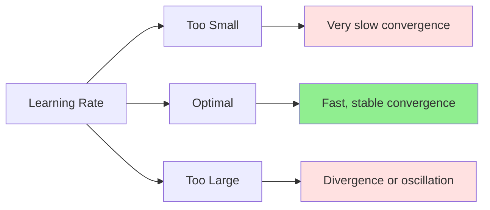

# Gradient Descent

## Introduction

Gradient descent is one of the most fundamental optimization algorithms in machine learning. While linear regression has a closed-form solution via normal equations, most machine learning models—especially neural networks—require iterative optimization. Gradient descent provides a general framework for finding parameters that minimize a loss function, making it the workhorse of modern machine learning.

The core idea is elegantly simple: to minimize a function, repeatedly take steps in the direction of steepest descent. By following the negative gradient, we navigate the loss landscape toward local (or global) minima. Despite this simplicity, gradient descent in practice requires careful consideration of step sizes, convergence criteria, and computational efficiency.

Understanding gradient descent deeply is essential for machine learning practitioners. It underlies training algorithms for neural networks (backpropagation), logistic regression, support vector machines, and countless other methods. Mastering its variants—batch, stochastic, and mini-batch gradient descent—and understanding learning rates, convergence behavior, and optimization challenges provides the foundation for training modern ML models.

## The Gradient Descent Algorithm

### Mathematical Foundation

Given a differentiable loss function $$J(\theta)$$ where $$\theta$$ represents model parameters, we want to find:

$$\theta^* = \arg\min_\theta J(\theta)$$

**Gradient descent update rule:**

$$\theta_{t+1} = \theta_t - \alpha \nabla_\theta J(\theta_t)$$

where:
- $$\theta_t$$: Parameters at iteration $$t$$
- $$\alpha$$: Learning rate (step size)
- $$\nabla_\theta J(\theta_t)$$: Gradient of loss with respect to parameters

**Intuition:**

The gradient $$\nabla_\theta J(\theta)$$ points in the direction of steepest ascent. The negative gradient $$-\nabla_\theta J(\theta)$$ points toward steepest descent. By taking steps in this direction, we move toward lower loss values.

### Geometric Interpretation



**In 1D:**

Imagine a U-shaped curve (parabola). The gradient tells us the slope:
- Positive slope: Move left (decrease $$\theta$$)
- Negative slope: Move right (increase $$\theta$$)
- Zero slope: At minimum (stop)

**In higher dimensions:**

The gradient is a vector pointing uphill. The negative gradient points downhill toward the nearest valley (local minimum).

### Algorithm Pseudocode

```
Initialize θ randomly or to zeros
Set learning rate α
Set convergence threshold ε

Repeat:
    1. Compute gradient: g = ∇_θ J(θ)
    2. Update parameters: θ = θ - α · g
    3. Check convergence: if ||g|| < ε, break

Return θ
```

## Batch Gradient Descent

### Definition

Batch gradient descent (BGD) uses the **entire training dataset** to compute the gradient at each iteration.

**For linear regression:**

$$J(\theta) = \frac{1}{2m}\sum_{i=1}^{m}(h_\theta(x^{(i)}) - y^{(i)})^2$$

**Gradient:**

$$\nabla_\theta J(\theta) = \frac{1}{m}\sum_{i=1}^{m}(h_\theta(x^{(i)}) - y^{(i)})x^{(i)}$$

**Update:**

$$\theta_j = \theta_j - \alpha \frac{1}{m}\sum_{i=1}^{m}(h_\theta(x^{(i)}) - y^{(i)})x_j^{(i)}$$

for each parameter $$\theta_j$$.

### Vectorized Implementation

For efficiency, implement using matrix operations:

**Forward pass:**
$$\hat{y} = X\theta$$

**Error:**
$$e = \hat{y} - y$$

**Gradient:**
$$\nabla_\theta J = \frac{1}{m}X^T e$$

**Update:**
$$\theta = \theta - \alpha \cdot \frac{1}{m}X^T e$$

### Advantages

**Guaranteed convergence** (for convex functions with appropriate learning rate):
- Smooth updates
- Stable convergence
- Well-defined trajectory

**Theoretical guarantees:**
- For convex functions: Converges to global minimum
- Convergence rate: $$O(1/k)$$ for non-smooth, $$O(1/k^2)$$ for smooth

**Efficient computation:**
- Vectorized operations leverage optimized libraries (BLAS)
- GPU parallelization effective

### Disadvantages

**Slow for large datasets:**
- Must process entire dataset for single update
- Memory intensive for large $$m$$
- Redundant computation if data has redundancy

**Stuck in local minima:**
- Deterministic trajectory
- Cannot escape local minima or saddle points

**Cannot handle online learning:**
- Requires all data available upfront
- Cannot adapt to streaming data

## Stochastic Gradient Descent (SGD)

### Definition

SGD updates parameters using **one training example** at a time.

**Update rule:**

At iteration $$t$$, randomly sample one example $$(x^{(i)}, y^{(i)})$$:

$$\theta = \theta - \alpha \nabla_\theta J^{(i)}(\theta)$$

where $$J^{(i)}(\theta) = \frac{1}{2}(h_\theta(x^{(i)}) - y^{(i)})^2$$ is the loss on example $$i$$.

**For linear regression:**

$$\theta_j = \theta_j - \alpha (h_\theta(x^{(i)}) - y^{(i)})x_j^{(i)}$$

### Algorithm

```
Shuffle training data
For each epoch:
    For each example (x^(i), y^(i)):
        1. Compute prediction: ŷ = h_θ(x^(i))
        2. Compute gradient: g = (ŷ - y^(i)) · x^(i)
        3. Update: θ = θ - α · g
```

### Advantages

**Fast iterations:**
- One example per update
- Much faster than batch GD for large datasets
- Early iterations make significant progress

**Can escape local minima:**
- Noisy updates provide randomness
- Can jump out of poor local minima
- Explores loss landscape more broadly

**Online learning:**
- Can adapt to streaming data
- Update model as new data arrives
- Suitable for dynamic environments

**Memory efficient:**
- Process one example at a time
- No need to load entire dataset

### Disadvantages

**Noisy updates:**
- High variance in gradient estimates
- Erratic convergence path
- Loss oscillates rather than smooth decrease

**Never truly converges:**
- Continues oscillating around minimum
- May need learning rate decay

**Slower convergence:**
- More iterations to reach same loss
- Each iteration is fast, but needs many iterations

**Harder to parallelize:**
- Sequential updates
- Less benefit from vectorization

### Convergence Behavior

SGD gradient is an **unbiased estimate** of true gradient:

$$\mathbb{E}_{i}[\nabla J^{(i)}(\theta)] = \nabla J(\theta)$$

But with high variance:

$$\text{Var}[\nabla J^{(i)}(\theta)] > 0$$

**Trade-off:**
- Fast early progress (gradient points roughly in right direction)
- Slow final convergence (noise prevents settling at minimum)

## Mini-Batch Gradient Descent

### Definition

Mini-batch GD is the **best of both worlds**: use a small batch of examples (typically 32, 64, 128, or 256) for each update.

**Update rule:**

For mini-batch $$\mathcal{B}$$ of size $$b$$:

$$\theta = \theta - \alpha \frac{1}{b}\sum_{i \in \mathcal{B}}\nabla J^{(i)}(\theta)$$

### Algorithm

```
Set batch size b (e.g., 64)
Shuffle training data

For each epoch:
    Split data into mini-batches of size b
    For each mini-batch B:
        1. Compute predictions for batch
        2. Compute average gradient over batch
        3. Update parameters
```

### Why Mini-Batches?

**Reduced gradient variance:**

Averaging over $$b$$ examples reduces variance by factor of $$b$$:

$$\text{Var}\left[\frac{1}{b}\sum_{i=1}^{b}g_i\right] = \frac{1}{b}\text{Var}[g_i]$$

**Computational efficiency:**
- Vectorized operations on batches
- GPU parallelization effective
- Modern hardware optimized for batch operations

**Faster convergence:**
- More stable than SGD
- Faster than batch GD for large datasets

### Choosing Batch Size

**Small batches (32, 64):**
- More noise, better generalization (implicit regularization)
- Fit in GPU memory
- More frequent updates

**Large batches (256, 512):**
- Less noise, more stable convergence
- Better hardware utilization
- Fewer updates per epoch

**Trade-offs:**
- Generalization: Small batches often generalize better
- Speed: Large batches faster per epoch but may need more epochs
- Memory: Limited by GPU/CPU memory

**Common practice:** Start with 32 or 64, increase if training is stable.

### Comparison Table

| Aspect | Batch GD | Mini-Batch GD | SGD |
|--------|----------|---------------|-----|
| Update frequency | Once per epoch | Multiple per epoch | Once per example |
| Gradient variance | Zero | Medium | High |
| Convergence speed | Slow (large $$m$$) | Fast | Very fast initially |
| Memory usage | High | Medium | Low |
| Parallelization | Excellent | Excellent | Poor |
| Generalization | Good | Best | Good |

## Learning Rate

The learning rate $$\alpha$$ is the most important hyperparameter in gradient descent, controlling step size.

### Impact of Learning Rate

**Too small ($$\alpha$$ too low):**
- Slow convergence
- Many iterations needed
- May not reach minimum in reasonable time
- Stuck in plateau regions

**Too large ($$\alpha$$ too high):**
- Overshooting minimum
- Divergence (loss increases)
- Oscillation around minimum
- Numerical instability

**Just right:**
- Steady decrease in loss
- Reasonable convergence speed
- Reaches (near) minimum



### Choosing Initial Learning Rate

**Grid search:**
Try exponentially spaced values: 0.001, 0.003, 0.01, 0.03, 0.1, 0.3

**Learning rate range test:**
1. Start with very small $$\alpha$$
2. Gradually increase $$\alpha$$ each iteration
3. Plot loss vs. $$\alpha$$
4. Choose $$\alpha$$ where loss decreases fastest (before divergence)

**Rule of thumb:**
- Logistic regression: 0.01 to 0.1
- Neural networks: 0.001 to 0.01
- Large datasets: Smaller $$\alpha$$

**Adaptive methods** (covered later): Adam, RMSprop automatically adjust learning rates.

### Learning Rate Schedules

Keep learning rate constant initially, then decay to fine-tune convergence.

**Step Decay:**

$$\alpha_t = \alpha_0 \cdot \gamma^{\lfloor t / k \rfloor}$$

Drop learning rate by factor $$\gamma$$ every $$k$$ epochs.

**Example:** $$\alpha_0 = 0.1$$, $$\gamma = 0.5$$, $$k = 10$$
- Epochs 0-9: $$\alpha = 0.1$$
- Epochs 10-19: $$\alpha = 0.05$$
- Epochs 20-29: $$\alpha = 0.025$$

**Exponential Decay:**

$$\alpha_t = \alpha_0 e^{-kt}$$

Smooth exponential decrease.

**Polynomial Decay:**

$$\alpha_t = \alpha_0 \left(1 + \frac{t}{T}\right)^{-p}$$

where $$T$$ is total iterations, $$p$$ is power (typically 0.5 or 1).

**Cosine Annealing:**

$$\alpha_t = \alpha_{\min} + \frac{1}{2}(\alpha_{\max} - \alpha_{\min})\left(1 + \cos\left(\frac{t\pi}{T}\right)\right)$$

Smooth decrease following cosine curve.

**1/t Decay:**

$$\alpha_t = \frac{\alpha_0}{1 + kt}$$

Theoretical guarantees for convergence.

**Warm Restarts:**

Periodically reset learning rate to initial value (helps escape local minima).

## Convergence Criteria

When to stop training?

### Gradient Norm

$$||\nabla_\theta J(\theta)|| < \epsilon$$

Stop when gradient is sufficiently small (near critical point).

**Issues:**
- May stop at saddle points
- Expensive to compute full gradient

### Parameter Change

$$||\theta_{t+1} - \theta_t|| < \epsilon$$

Stop when parameters barely change.

**Issues:**
- May indicate small learning rate, not convergence
- Sensitive to scale

### Loss Change

$$|J(\theta_{t+1}) - J(\theta_t)| < \epsilon$$

Stop when loss improvement is negligible.

**Most practical approach** for training.

### Maximum Iterations

Set maximum epochs/iterations to prevent infinite loops.

Always include as safeguard.

### Validation Performance

**Early stopping:** Monitor validation loss, stop when it stops improving.

Best practice for preventing overfitting.

### Combined Criteria

```python
if (loss_change < ε_loss) or
   (param_change < ε_param) or
   (epoch >= max_epochs) or
   (val_loss increased for patience epochs):
    stop training
```

## Challenges and Solutions

### Local Minima

**Problem:** Gradient descent finds local minima, not necessarily global.

**For convex functions:** All local minima are global minima.

**For non-convex (deep learning):**
- Multiple local minima
- Saddle points (gradient zero but not minimum)

**Solutions:**
- Random initialization (different starting points)
- SGD noise helps escape poor local minima
- Momentum-based methods
- Advanced optimizers (Adam)

### Saddle Points

**Definition:** Points where gradient is zero but not a minimum (some directions increase, others decrease).

**Problem in high dimensions:** Saddle points more common than local minima.

**Detection:** Compute Hessian (second derivatives). Negative eigenvalues indicate saddle.

**Solutions:**
- SGD noise helps escape
- Second-order methods
- Careful initialization

### Plateaus

**Definition:** Flat regions where gradient is very small but far from minimum.

**Problem:** Slow progress (gradient $$\approx 0$$).

**Solutions:**
- Increase learning rate temporarily
- Momentum (accumulate velocity)
- Adaptive learning rates

### Ill-Conditioned Problems

**Definition:** Loss surface has different curvatures in different directions (elongated valleys).

**Condition number:** $$\kappa = \frac{\lambda_{\max}}{\lambda_{\min}}$$ (ratio of largest to smallest eigenvalue of Hessian)

**Problem:**
- Gradient points toward steep direction, not toward minimum
- Oscillation in steep directions
- Slow progress in flat directions

**Solutions:**
- Feature scaling (standardization)
- Preconditioning
- Second-order methods (Newton's method)
- Adaptive learning rates (different rates per parameter)

### Vanishing/Exploding Gradients

**Vanishing:** Gradients become extremely small (deep networks with sigmoids)

**Exploding:** Gradients become extremely large (RNNs)

**Solutions:**
- Gradient clipping (cap gradient magnitude)
- Careful initialization
- Batch normalization
- Better activation functions (ReLU vs sigmoid)

## Variants and Extensions

### Momentum

Accumulate velocity from previous gradients:

$$v_{t+1} = \beta v_t + (1-\beta)\nabla J(\theta_t)$$

$$\theta_{t+1} = \theta_t - \alpha v_{t+1}$$

**Benefits:**
- Accelerates convergence in consistent directions
- Dampens oscillations
- Helps escape local minima

Typical: $$\beta = 0.9$$

### Nesterov Accelerated Gradient (NAG)

"Look ahead" version of momentum:

$$v_{t+1} = \beta v_t + \nabla J(\theta_t - \beta v_t)$$

$$\theta_{t+1} = \theta_t - \alpha v_{t+1}$$

Compute gradient at future position, not current.

**Benefit:** Better anticipation, often faster convergence.

### AdaGrad (Adaptive Gradient)

Adapt learning rate per parameter based on historical gradients:

$$\theta_{t+1,j} = \theta_{t,j} - \frac{\alpha}{\sqrt{G_{t,jj} + \epsilon}}g_{t,j}$$

where $$G_t$$ accumulates squared gradients:

$$G_{t,jj} = \sum_{i=1}^{t}g_{i,j}^2$$

**Effect:**
- Frequent features get smaller learning rates
- Infrequent features get larger learning rates

**Problem:** Learning rate decreases monotonically, may become too small.

### RMSprop

Fixes AdaGrad by using exponential moving average:

$$E[g^2]_t = \beta E[g^2]_{t-1} + (1-\beta)g_t^2$$

$$\theta_{t+1} = \theta_t - \frac{\alpha}{\sqrt{E[g^2]_t + \epsilon}}g_t$$

Typical: $$\beta = 0.9$$

### Adam (Adaptive Moment Estimation)

Combines momentum and RMSprop:

**First moment (mean):**
$$m_t = \beta_1 m_{t-1} + (1-\beta_1)g_t$$

**Second moment (variance):**
$$v_t = \beta_2 v_{t-1} + (1-\beta_2)g_t^2$$

**Bias correction:**
$$\hat{m}_t = \frac{m_t}{1-\beta_1^t}$$
$$\hat{v}_t = \frac{v_t}{1-\beta_2^t}$$

**Update:**
$$\theta_{t+1} = \theta_t - \frac{\alpha}{\sqrt{\hat{v}_t} + \epsilon}\hat{m}_t$$

**Default hyperparameters:**
- $$\alpha = 0.001$$
- $$\beta_1 = 0.9$$
- $$\beta_2 = 0.999$$
- $$\epsilon = 10^{-8}$$

**Why popular:**
- Works well across diverse problems
- Robust to hyperparameter choices
- Fast convergence
- Little tuning needed

## Practical Tips

### Monitoring Training

**Plot loss curves:**
- Training loss should decrease
- Validation loss should decrease then plateau
- If validation loss increases: overfitting

**Check gradient norms:**
- Should decrease over time
- If constant or increasing: learning rate too high or divergence

**Visualize parameters:**
- Check for NaN or Inf values
- Monitor parameter distributions

### Debugging

**Loss not decreasing:**
- Learning rate too low: Increase
- Wrong gradient computation: Check implementation
- Bug in code: Verify on simple example

**Loss exploding:**
- Learning rate too high: Decrease
- Gradient clipping: Cap gradient magnitude
- Check for bugs (wrong signs)

**Loss oscillating:**
- Learning rate too high: Decrease
- Use momentum or adaptive methods

### Hyperparameter Tuning

**Priority:**
1. Learning rate (most important)
2. Batch size
3. Learning rate schedule
4. Momentum coefficient

**Process:**
1. Start with defaults (Adam with $$\alpha = 0.001$$)
2. Adjust learning rate if needed
3. Try different batch sizes
4. Add learning rate decay if needed

### Implementation Checklist

- [ ] Shuffle data before each epoch
- [ ] Normalize/standardize features
- [ ] Initialize parameters properly
- [ ] Implement gradient correctly (check with numerical gradient)
- [ ] Set appropriate learning rate
- [ ] Monitor training and validation loss
- [ ] Implement early stopping
- [ ] Save best model (based on validation)

## Gradient Descent for Linear Regression

### Closed Form vs Gradient Descent

**Normal Equations:**
$$\theta = (X^T X)^{-1}X^T y$$

**Pros:** Direct solution, no iterations
**Cons:** $$O(n^3)$$ complexity, fails for singular $$X^T X$$

**Gradient Descent:**
$$\theta = \theta - \alpha \frac{1}{m}X^T(X\theta - y)$$

**Pros:** $$O(kn^2)$$ where $$k$$ is iterations, handles large $$n$$
**Cons:** Requires tuning $$\alpha$$, iterative

**When to use each:**
- $$n < 10000$$: Normal equations
- $$n > 10000$$: Gradient descent
- Online learning: Gradient descent

### Worked Example

**Dataset:** $$m = 3$$ examples, $$n = 1$$ feature

$$X = \begin{bmatrix}1 & 1 \\ 1 & 2 \\ 1 & 3\end{bmatrix}, \quad y = \begin{bmatrix}1 \\ 2 \\ 3\end{bmatrix}$$

**Initialize:** $$\theta = \begin{bmatrix}0 \\ 0\end{bmatrix}$$, $$\alpha = 0.1$$

**Iteration 1:**

Predictions: $$\hat{y} = X\theta = \begin{bmatrix}0 \\ 0 \\ 0\end{bmatrix}$$

Error: $$e = \hat{y} - y = \begin{bmatrix}-1 \\ -2 \\ -3\end{bmatrix}$$

Gradient: $$\nabla J = \frac{1}{3}X^T e = \frac{1}{3}\begin{bmatrix}1 & 1 & 1 \\ 1 & 2 & 3\end{bmatrix}\begin{bmatrix}-1 \\ -2 \\ -3\end{bmatrix} = \begin{bmatrix}-2 \\ -4.67\end{bmatrix}$$

Update: $$\theta = \begin{bmatrix}0 \\ 0\end{bmatrix} - 0.1\begin{bmatrix}-2 \\ -4.67\end{bmatrix} = \begin{bmatrix}0.2 \\ 0.467\end{bmatrix}$$

**Continue until convergence...**

## Conclusion

Gradient descent is the optimization backbone of machine learning. From simple linear regression to complex deep neural networks, gradient descent and its variants enable learning from data by iteratively minimizing loss functions.

Key takeaways:
- **Batch GD:** Stable but slow for large datasets
- **SGD:** Fast but noisy, good for large datasets
- **Mini-batch GD:** Best balance in practice
- **Learning rate:** Most critical hyperparameter
- **Momentum:** Accelerates convergence
- **Adam:** Robust default optimizer for deep learning

Understanding convergence behavior, choosing appropriate learning rates, and recognizing common issues (local minima, saddle points, ill-conditioning) are essential skills. Modern adaptive optimizers like Adam automate much of the tuning, but understanding the underlying principles remains crucial for debugging and advanced applications.

As we progress to more complex models, gradient descent will remain our fundamental tool for optimization. The intuitions developed here—following gradients downhill, balancing step size and stability, managing noise and variance—will prove invaluable throughout machine learning.