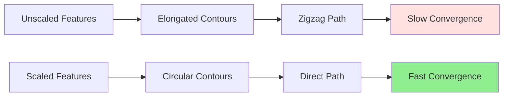

# Feature Scaling

## Introduction

Feature scaling is a crucial preprocessing step that transforms features to similar scales or distributions. While often overlooked by beginners, proper feature scaling can dramatically impact model performance, training speed, and convergence. Many machine learning algorithms are sensitive to the scale of input features, making scaling not just beneficial but essential in many cases.

The fundamental issue is that features in real-world datasets often have vastly different scales. House sizes might range from 500 to 5000 square feet, while the number of bedrooms ranges from 1 to 5. Without scaling, algorithms that compute distances or use gradient descent can perform poorly, converge slowly, or fail entirely.

Understanding when and how to scale features is a critical skill. Different scaling methods suit different algorithms and data distributions. This chapter explores the mathematics, motivation, and practical implementation of feature scaling techniques, providing the knowledge needed to preprocess data effectively for machine learning.

## Why Feature Scaling Matters

### Gradient Descent Convergence

**Problem:** Features with larger scales dominate the gradient.

Consider linear regression with two features:
- $$x_1$$: House size (500-5000)
- $$x_2$$: Number of bedrooms (1-5)

**Cost function:**

$$J(\theta) = \frac{1}{2m}\sum_{i=1}^{m}(\theta_1 x_1^{(i)} + \theta_2 x_2^{(i)} - y^{(i)})^2$$

**Gradient:**

$$\frac{\partial J}{\partial \theta_1} \propto x_1 \text{ (large)}$$

$$\frac{\partial J}{\partial \theta_2} \propto x_2 \text{ (small)}$$

**Impact:**
- Large $$\frac{\partial J}{\partial \theta_1}$$ causes large $$\theta_1$$ updates
- Small $$\frac{\partial J}{\partial \theta_2}$$ causes small $$\theta_2$$ updates
- Oscillation in $$\theta_1$$ direction
- Slow progress in $$\theta_2$$ direction
- Poor convergence

**With scaling:** All gradients on similar scale → balanced updates → fast, stable convergence.

### Loss Function Geometry

**Without scaling:**

Loss function contours are elongated ellipses. Gradient descent zigzags, taking many iterations.

**With scaling:**

Loss function contours are more circular. Gradient descent takes direct path to minimum.



### Distance-Based Algorithms

**Problem:** Features with larger scales dominate distance calculations.

**K-Nearest Neighbors (KNN):**

Euclidean distance:

$$d(x, x') = \sqrt{(x_1 - x_1')^2 + (x_2 - x_2')^2}$$

If $$x_1 \in [500, 5000]$$ and $$x_2 \in [1, 5]$$:

$$(x_1 - x_1')^2 \gg (x_2 - x_2')^2$$

Distance dominated by $$x_1$$, $$x_2$$ essentially ignored!

**Support Vector Machines (SVM):**

Kernel functions (e.g., RBF) compute similarities based on distances. Unscaled features cause biased similarity measures.

**Clustering (K-Means):**

Cluster assignments based on Euclidean distance. Unscaled features lead to clusters driven by high-magnitude features.

### Regularization

**L2 regularization:**

$$\lambda \sum_{j}\theta_j^2$$

Without scaling, regularization penalizes coefficients of small-scale features more:

**Example:**

- $$x_1 \in [0, 1]$$ → $$\theta_1 \approx 100$$ to have impact → large penalty
- $$x_2 \in [0, 1000]$$ → $$\theta_2 \approx 0.1$$ to have impact → small penalty

**Result:** Unfair regularization across features.

**With scaling:** All features on same scale → fair regularization.

### Neural Networks

**Activation saturation:**

Sigmoid/tanh activations saturate (flat gradients) for large inputs:

$$\sigma(z) = \frac{1}{1+e^{-z}}$$

$$\sigma'(z) \approx 0$$ for $$|z| \gg 1$$

Large feature values → large $$z$$ → saturation → vanishing gradients → slow learning.

**Weight initialization:**

Initialization schemes (Xavier, He) assume inputs on similar scale. Unscaled features break these assumptions.

## When Scaling is Necessary

### Algorithms Requiring Scaling

**Critical:**
- Gradient descent-based methods (linear regression, logistic regression, neural networks)
- Distance-based methods (KNN, K-Means, SVM with RBF kernel)
- Regularized models (Ridge, Lasso, Elastic Net)
- Principal Component Analysis (PCA)

### Algorithms Not Requiring Scaling

**Scale-invariant:**
- Tree-based methods (Decision Trees, Random Forests, Gradient Boosting)
  - Splits based on feature values, not distances
  - Scale doesn't affect split points
- Naive Bayes

## Standardization (Z-Score Normalization)

### Definition

Transform features to have mean 0 and standard deviation 1:

$$x' = \frac{x - \mu}{\sigma}$$

where:
- $$\mu = \frac{1}{m}\sum_{i=1}^{m}x^{(i)}$$: Mean
- $$\sigma = \sqrt{\frac{1}{m}\sum_{i=1}^{m}(x^{(i)} - \mu)^2}$$: Standard deviation

### Properties

**Mean:** $$\mathbb{E}[x'] = 0$$

**Variance:** $$\text{Var}(x') = 1$$

**Standard deviation:** $$\text{SD}(x') = 1$$

**Range:** Unbounded (typically $$x' \in [-3, 3]$$ for normal data)

**Effect on outliers:** Preserves (doesn't clip extreme values)

### When to Use

**Best for:**
- Features approximately normally distributed
- Algorithms assuming zero mean (neural networks, PCA)
- Presence of outliers that shouldn't be clipped
- Gaussian-based algorithms

**Example:**

Original: $$x = [100, 200, 300, 400, 500]$$

Mean: $$\mu = 300$$

Std: $$\sigma = 141.4$$

Standardized: $$x' = [-1.41, -0.71, 0, 0.71, 1.41]$$

### Implementation

```python
from sklearn.preprocessing import StandardScaler

scaler = StandardScaler()

# Fit on training data
scaler.fit(X_train)

# Transform training and test data
X_train_scaled = scaler.transform(X_train)
X_test_scaled = scaler.transform(X_test)
```

**Important:** Fit scaler on training data only! Apply same transformation to test data using training statistics.

## Min-Max Normalization (Scaling to Range)

### Definition

Transform features to a fixed range, typically [0, 1]:

$$x' = \frac{x - x_{\min}}{x_{\max} - x_{\min}}$$

**For arbitrary range [a, b]:**

$$x' = a + (b - a) \cdot \frac{x - x_{\min}}{x_{\max} - x_{\min}}$$

### Properties

**Range:** $$x' \in [0, 1]$$ (or specified range)

**Mean:** Not necessarily 0

**Variance:** Not necessarily 1

**Effect on outliers:** Sensitive (outliers compress main distribution)

**Distribution shape:** Preserved (linear transformation)

### When to Use

**Best for:**
- Bounded features needed (e.g., image pixels [0, 255] → [0, 1])
- Neural networks with bounded activations (sigmoid, tanh)
- Algorithms sensitive to feature range
- Data without significant outliers

**Caution:**

Outliers severely affect scaling. Single extreme value compresses all others.

**Example:**

Original: $$x = [10, 20, 30, 40, 50]$$

Min: 10, Max: 50

Normalized: $$x' = [0, 0.25, 0.5, 0.75, 1]$$

**With outlier:**

$$x = [10, 20, 30, 40, 1000]$$

Normalized: $$x' = [0, 0.01, 0.02, 0.03, 1]$$

Main distribution compressed!

### Implementation

```python
from sklearn.preprocessing import MinMaxScaler

scaler = MinMaxScaler(feature_range=(0, 1))

scaler.fit(X_train)
X_train_scaled = scaler.transform(X_train)
X_test_scaled = scaler.transform(X_test)
```

## Robust Scaling

### Definition

Scale using median and interquartile range (IQR), robust to outliers:

$$x' = \frac{x - \text{median}(x)}{IQR(x)}$$

where $$IQR = Q_3 - Q_1$$ (75th percentile - 25th percentile).

### Properties

**Robust to outliers:** Uses median and IQR instead of mean and std

**Range:** Unbounded

**Distribution:** Centered around 0 with IQR = 1

### When to Use

**Best for:**
- Data with outliers
- Skewed distributions
- When outliers are valid (not errors)

**Example:**

$$x = [1, 2, 3, 4, 5, 100]$$

**Standardization:**
Mean = 19.17, Std = 38.35
$$x' = [-0.47, -0.45, -0.42, -0.40, -0.37, 2.11]$$
(Outlier still dominates)

**Robust scaling:**
Median = 3.5, IQR = 3
$$x' = [-0.83, -0.5, -0.17, 0.17, 0.5, 32.17]$$
(Main distribution less compressed)

### Implementation

```python
from sklearn.preprocessing import RobustScaler

scaler = RobustScaler()

scaler.fit(X_train)
X_train_scaled = scaler.transform(X_train)
X_test_scaled = scaler.transform(X_test)
```

## Max Abs Scaling

### Definition

Scale by maximum absolute value:

$$x' = \frac{x}{\max(|x|)}$$

### Properties

**Range:** $$x' \in [-1, 1]$$

**Zero-centered:** Preserves sign

**Sparse data:** Preserves sparsity (zeros remain zeros)

### When to Use

**Best for:**
- Sparse data (many zeros)
- Data already centered around zero
- When preserving sign is important

### Implementation

```python
from sklearn.preprocessing import MaxAbsScaler

scaler = MaxAbsScaler()

scaler.fit(X_train)
X_train_scaled = scaler.transform(X_train)
X_test_scaled = scaler.transform(X_test)
```

## Unit Vector Scaling (Normalization)

### Definition

Scale each sample (row) to unit length:

$$x' = \frac{x}{||x||}$$

**L2 norm (Euclidean):**

$$x' = \frac{x}{\sqrt{\sum_j x_j^2}}$$

**L1 norm (Manhattan):**

$$x' = \frac{x}{\sum_j |x_j|}$$

### Properties

**Sample-wise:** Scales rows, not columns

**Unit length:** $$||x'|| = 1$$

**Preserves direction:** Only magnitude changes

### When to Use

**Best for:**
- Text data (TF-IDF vectors)
- Document similarity (cosine similarity)
- When direction matters more than magnitude

**Not for:**
- Feature-wise scaling
- Gradient descent (doesn't help convergence)

### Implementation

```python
from sklearn.preprocessing import Normalizer

scaler = Normalizer(norm='l2')  # or 'l1', 'max'

X_normalized = scaler.transform(X)
```

## Comparison of Scaling Methods

| Method | Formula | Range | Outliers | Use Case |
|--------|---------|-------|----------|----------|
| Standardization | $$(x-\mu)/\sigma$$ | Unbounded | Affected | Normal data, neural nets |
| Min-Max | $$(x-\min)/(\max-\min)$$ | [0, 1] | Sensitive | Bounded range, no outliers |
| Robust | $$(x-\text{median})/IQR$$ | Unbounded | Robust | Data with outliers |
| Max Abs | $$x/\max(\vert x\vert)$$ | [-1, 1] | Affected | Sparse data |
| Unit Vector | $$x/\Vert x\Vert$$ | N/A | N/A | Text data, directions |

## Practical Guidelines

### Train-Test Split Workflow

**Critical rule:** Fit scaler on training data only!

```python
# 1. Split data FIRST
X_train, X_test, y_train, y_test = train_test_split(X, y)

# 2. Fit scaler on training data
scaler = StandardScaler()
scaler.fit(X_train)  # Only training data!

# 3. Transform both sets using training statistics
X_train_scaled = scaler.transform(X_train)
X_test_scaled = scaler.transform(X_test)

# 4. Train model
model.fit(X_train_scaled, y_train)

# 5. Evaluate
score = model.score(X_test_scaled, y_test)
```

**Why?**

Fitting on test data causes **data leakage**:
- Test statistics influence transformation
- Model indirectly sees test data
- Optimistically biased evaluation
- Won't generalize to new data

### Feature-by-Feature Scaling

**Scale each feature independently:**

```python
# StandardScaler scales each column
X_scaled = scaler.fit_transform(X)

# Result: Each column has mean=0, std=1
print(X_scaled.mean(axis=0))  # [0, 0, 0, ...]
print(X_scaled.std(axis=0))   # [1, 1, 1, ...]
```

**Don't scale all features together** (unless using unit vector normalization).

### When NOT to Scale

**Target variable (y):**

Generally don't scale target in regression. Doesn't help and complicates interpretation.

**Exception:** Neural networks sometimes benefit from scaled targets.

**Binary features:**

Already on same scale (0 or 1). Scaling not necessary but doesn't hurt.

**Categorical variables (one-hot encoded):**

Already on same scale. Don't scale.

**Tree-based models:**

Decision trees, random forests, gradient boosting don't need scaling.

### Scaling in Pipelines

**scikit-learn Pipeline:**

```python
from sklearn.pipeline import Pipeline
from sklearn.preprocessing import StandardScaler
from sklearn.linear_model import LogisticRegression

pipeline = Pipeline([
    ('scaler', StandardScaler()),
    ('classifier', LogisticRegression())
])

# Fit pipeline (scaling + training)
pipeline.fit(X_train, y_train)

# Predict (automatically scales first)
y_pred = pipeline.predict(X_test)
```

**Benefits:**
- Prevents data leakage (scaling fit on correct data)
- Cleaner code
- Easier cross-validation
- Reproducible

### Cross-Validation with Scaling

**Wrong way:**

```python
# DON'T DO THIS!
X_scaled = scaler.fit_transform(X)  # Leakage!
cross_val_score(model, X_scaled, y, cv=5)
```

**Right way:**

```python
# Use pipeline
pipeline = Pipeline([
    ('scaler', StandardScaler()),
    ('model', LogisticRegression())
])

# Scaling fit separately for each fold
cross_val_score(pipeline, X, y, cv=5)
```

## Special Cases

### Log Transformation

**For skewed data:** Apply log before scaling

$$x' = \log(x + c)$$

where $$c$$ is small constant to handle zeros.

**Use when:**
- Right-skewed distribution
- Multiplicative relationships
- Wide range of magnitudes

**Then scale** the log-transformed features.

### Power Transformation

**Box-Cox:**

$$x' = \begin{cases}
\frac{x^\lambda - 1}{\lambda} & \lambda \neq 0 \\
\log(x) & \lambda = 0
\end{cases}$$

Finds optimal $$\lambda$$ to make data more normal.

**Yeo-Johnson:**

Extension of Box-Cox that handles negative values.

```python
from sklearn.preprocessing import PowerTransformer

pt = PowerTransformer(method='yeo-johnson')
X_transformed = pt.fit_transform(X_train)
```

### Quantile Transformation

Map features to uniform or normal distribution:

```python
from sklearn.preprocessing import QuantileTransformer

qt = QuantileTransformer(output_distribution='uniform')
X_transformed = qt.fit_transform(X_train)
```

**Effect:**
- Forces distribution to be uniform or Gaussian
- Robust to outliers
- Non-linear transformation
- Can distort linear relationships

## Impact on Model Performance

### Linear Models

**Before scaling:**
- Slow convergence
- Numerical issues
- Poor regularization

**After scaling:**
- Fast convergence
- Numerical stability
- Fair regularization

**Improvement:** Often 2-10x faster convergence, sometimes better accuracy

### Distance-Based Models

**Before scaling:**
- Dominated by high-magnitude features
- Poor nearest neighbor selection
- Biased cluster assignments

**After scaling:**
- Balanced feature importance
- Better neighbor selection
- Sensible clusters

**Improvement:** Can dramatically improve accuracy (10-50%+ in extreme cases)

### Neural Networks

**Before scaling:**
- Slow training
- Vanishing/exploding gradients
- Activation saturation
- Numerical instability

**After scaling:**
- Faster training (2-10x)
- Stable gradients
- Active neurons
- Better convergence

**Improvement:** Often critical for successful training

### Tree-Based Models

**Impact:** Minimal to none

Trees learn split points from data. Scaling doesn't change relative ordering or split quality.

## Common Mistakes

### Mistake 1: Fitting on All Data

```python
# WRONG!
scaler.fit(X)  # Includes test data
X_train_scaled = scaler.transform(X_train)
X_test_scaled = scaler.transform(X_test)
```

**Problem:** Data leakage, optimistic evaluation

### Mistake 2: Scaling Target Variable Unnecessarily

```python
# Usually unnecessary
y_scaler = StandardScaler()
y_train_scaled = y_scaler.fit_transform(y_train)
```

**Problem:** Complicates interpretation, doesn't help most models

### Mistake 3: Different Scalers for Train and Test

```python
# WRONG!
X_train_scaled = StandardScaler().fit_transform(X_train)
X_test_scaled = StandardScaler().fit_transform(X_test)
```

**Problem:** Different transformations, incompatible scales

### Mistake 4: Not Scaling in Deployment

```python
# Training
X_train_scaled = scaler.fit_transform(X_train)
model.fit(X_train_scaled, y_train)

# Deployment
prediction = model.predict(X_new)  # WRONG! X_new not scaled
```

**Correct:**

```python
X_new_scaled = scaler.transform(X_new)
prediction = model.predict(X_new_scaled)
```

## Inverse Transformation

Sometimes need to transform predictions back to original scale:

```python
# Scale target during training
y_scaler = StandardScaler()
y_train_scaled = y_scaler.fit_transform(y_train.reshape(-1, 1))

# Train model
model.fit(X_train_scaled, y_train_scaled)

# Predict (scaled)
y_pred_scaled = model.predict(X_test_scaled)

# Transform back to original scale
y_pred = y_scaler.inverse_transform(y_pred_scaled.reshape(-1, 1))
```

## Conclusion

Feature scaling is a critical preprocessing step that significantly impacts model performance, training speed, and numerical stability. While conceptually simple, proper scaling requires understanding when to scale, which method to use, and how to avoid data leakage.

**Key takeaways:**

- **Standardization:** Default choice for normal data and neural networks
- **Min-Max:** When bounded range needed, no outliers
- **Robust scaling:** When outliers present
- **Train-test workflow:** Fit on training data only
- **Algorithm dependency:** Critical for gradient descent and distance-based methods, unnecessary for trees
- **Pipelines:** Prevent leakage and ensure correct workflow

Feature scaling exemplifies the importance of data preprocessing in machine learning. A few lines of scaling code can mean the difference between a model that fails to converge and one that achieves state-of-the-art performance. Master feature scaling, and you've mastered a fundamental aspect of practical machine learning.