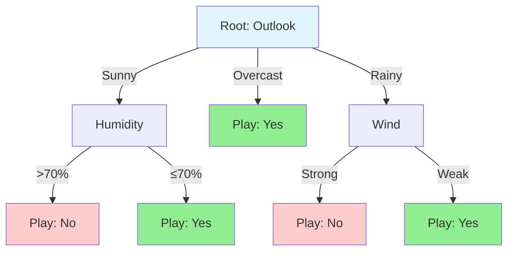

# Decision Trees

## Introduction

Decision trees are one of the most intuitive and interpretable machine learning algorithms. They model decisions as a tree structure, where each internal node represents a test on a feature, each branch represents an outcome of the test, and each leaf node represents a class label or continuous value. This mirrors human decision-making: "If temperature > 30°C, then take umbrella, else if humidity > 80%, then take umbrella, else don't."

The power of decision trees lies in their simplicity and versatility. They handle both numerical and categorical features naturally, require minimal data preprocessing (no scaling needed!), can model non-linear relationships, and provide clear, interpretable rules. Unlike black-box models, decision trees explain their predictions through a sequence of logical conditions that anyone can understand.

However, decision trees have significant limitations. They easily overfit training data, creating complex trees that memorize noise. They're unstable—small changes in data can produce completely different trees. They struggle with linear relationships that simpler models capture effortlessly. Understanding both their strengths and limitations is essential, as decision trees form the foundation for powerful ensemble methods like Random Forests and Gradient Boosting.

## Tree Structure

### Components

**Root Node:** Top of tree, contains all training data

**Internal Nodes:** Decision points, test a feature

**Branches:** Outcomes of tests, lead to child nodes

**Leaf Nodes (Terminal Nodes):** Final predictions



### Decision Rules

Each path from root to leaf represents a decision rule:

**Example:**

```
IF Outlook = Sunny AND Humidity ≤ 70%
THEN Play = Yes

IF Outlook = Rainy AND Wind = Strong
THEN Play = No
```

**Predictions:**

Traverse tree based on feature values until reaching a leaf. Leaf's value is the prediction.

## Building Decision Trees

### CART Algorithm

**Classification and Regression Trees (CART)** is the most common decision tree algorithm.

**Algorithm:**

```
Build_Tree(Data, Features):
    1. If stopping criterion met:
        Create leaf node with prediction
        Return leaf

    2. Find best feature and split point:
        For each feature:
            For each possible split:
                Compute impurity after split
        Choose split minimizing impurity

    3. Split data into left and right subsets

    4. Recursively build left and right subtrees:
        left_tree = Build_Tree(left_data, features)
        right_tree = Build_Tree(right_data, features)

    5. Return decision node
```

### Choosing the Best Split

**Goal:** Find feature and threshold that best separates classes (classification) or reduces variance (regression).

**For each feature $$j$$ and threshold $$t$$:**

Split data into:
- Left: $$x_j \leq t$$
- Right: $$x_j > t$$

**Quality metric:**

$$\text{Quality}(j, t) = \text{Impurity}_{\text{parent}} - \left(\frac{m_{\text{left}}}{m}\text{Impurity}_{\text{left}} + \frac{m_{\text{right}}}{m}\text{Impurity}_{\text{right}}\right)$$

where $$m$$ is number of samples.

**Choose split:** $$\arg\max_{j,t} \text{Quality}(j, t)$$

## Impurity Measures for Classification

### Gini Impurity

**Definition:**

$$\text{Gini}(S) = 1 - \sum_{k=1}^{K}p_k^2$$

where $$p_k$$ is the proportion of class $$k$$ in set $$S$$.

**Interpretation:** Probability of incorrectly classifying a randomly chosen element if labeled randomly according to distribution.

**Range:** [0, 0.5] for binary, [0, 1-1/K] generally

**Pure node:** Gini = 0 (all samples same class)

**Maximum impurity:** Equal distribution

**Example (binary):**

- All class 0: $$1 - (1^2 + 0^2) = 0$$ (pure)
- 50-50 split: $$1 - (0.5^2 + 0.5^2) = 0.5$$ (maximum impurity)
- 90-10 split: $$1 - (0.9^2 + 0.1^2) = 0.19$$

**Computation:**

```python
def gini_impurity(y):
    m = len(y)
    return 1.0 - sum((np.sum(y == c) / m) ** 2 for c in np.unique(y))
```

### Entropy (Information Gain)

**Definition:**

$$H(S) = -\sum_{k=1}^{K}p_k \log_2(p_k)$$

**Interpretation:** Average number of bits needed to encode class information.

**Range:** [0, $$\log_2(K)$$]

**Pure node:** $$H = 0$$

**Maximum:** Uniform distribution

**Example (binary):**

- All class 0: $$-(1\log_2(1) + 0\log_2(0)) = 0$$
- 50-50: $$-(0.5\log_2(0.5) + 0.5\log_2(0.5)) = 1$$ (maximum)
- 90-10: $$-(0.9\log_2(0.9) + 0.1\log_2(0.1)) \approx 0.47$$

**Information Gain:**

$$IG(S, A) = H(S) - \sum_{v \in \text{Values}(A)}\frac{|S_v|}{|S|}H(S_v)$$

Reduction in entropy after splitting on attribute $$A$$.

**Choose split:** Maximize information gain.

### Classification Error

**Definition:**

$$E(S) = 1 - \max_k p_k$$

**Interpretation:** Probability of misclassification if predicting majority class.

**Less sensitive** to probability changes than Gini or entropy.

**Rarely used** in practice (Gini and entropy preferred).

### Comparison

| Metric | Formula | Range | Properties |
|--------|---------|-------|------------|
| Gini | $$1 - \sum p_k^2$$ | [0, 0.5] | Fast, slight bias to largest class |
| Entropy | $$-\sum p_k \log p_k$$ | [0, 1] | More balanced, slightly slower |
| Error | $$1 - \max p_k$$ | [0, 0.5] | Less sensitive, rarely used |

**Practical difference:** Minimal. Gini slightly faster, entropy slightly more balanced. Both work well.

## Impurity Measure for Regression

### Variance Reduction

For regression trees, use variance as impurity:

$$\text{Var}(S) = \frac{1}{m}\sum_{i=1}^{m}(y_i - \bar{y})^2$$

where $$\bar{y} = \frac{1}{m}\sum_{i}y_i$$ is the mean.

**Variance Reduction:**

$$VR(S, t) = \text{Var}(S) - \left(\frac{m_L}{m}\text{Var}(S_L) + \frac{m_R}{m}\text{Var}(S_R)\right)$$

**Choose split:** Maximize variance reduction.

**Leaf predictions:** Mean of target values in leaf.

### Mean Absolute Error (MAE)

Alternative for regression:

$$MAE(S) = \frac{1}{m}\sum_{i=1}^{m}|y_i - \text{median}(S)|$$

**Leaf prediction:** Median of target values.

**More robust to outliers** than variance.

## Stopping Criteria

**When to stop growing the tree?**

### Maximum Depth

Limit tree depth to prevent overfitting:

```python
max_depth = 5  # Tree can have at most 5 levels
```

**Small depth:** Underfitting (too simple)
**Large depth:** Overfitting (too complex)

Typical: 3-10 for interpretability, 10-30 for accuracy

### Minimum Samples per Split

Require minimum samples to consider splitting:

```python
min_samples_split = 20
```

Prevents creating nodes from very few samples.

### Minimum Samples per Leaf

Require minimum samples in leaf nodes:

```python
min_samples_leaf = 10
```

Ensures leaves represent sufficient data.

### Minimum Impurity Decrease

Only split if impurity decreases by at least threshold:

```python
min_impurity_decrease = 0.01
```

Prevents splits providing negligible improvement.

### Maximum Leaf Nodes

Limit total number of leaf nodes:

```python
max_leaf_nodes = 100
```

Controls tree size directly.

### Pure Nodes

Stop when node is pure (all samples same class):

$$\text{Gini}(S) = 0$$ or $$H(S) = 0$$

**Default behavior:** Always applied.

## Pruning

**Problem:** Fully grown trees overfit.

**Solution:** Prune tree after building.

### Post-Pruning (Reduced Error Pruning)

**Algorithm:**

1. Build full tree on training data
2. For each internal node (bottom-up):
   - Temporarily replace subtree with leaf
   - Evaluate on validation set
   - If performance improves (or doesn't degrade), keep as leaf
3. Return pruned tree

**Pros:** Simple, effective

**Cons:** Requires validation set

### Cost Complexity Pruning (Weakest Link Pruning)

**Cost-Complexity Criterion:**

$$R_\alpha(T) = R(T) + \alpha |T|$$

where:
- $$R(T)$$: Training error (misclassification rate)
- $$|T|$$: Number of leaf nodes
- $$\alpha$$: Complexity parameter

**Algorithm:**

1. Build full tree
2. For increasing $$\alpha$$:
   - Find subtree with smallest increase in error per leaf removed
   - Prune that subtree
3. Use cross-validation to select best $$\alpha$$

**Benefit:** Creates sequence of trees, choose via cross-validation.

**Implementation:** `ccp_alpha` parameter in scikit-learn.

```python
from sklearn.tree import DecisionTreeClassifier

clf = DecisionTreeClassifier(ccp_alpha=0.01)
clf.fit(X_train, y_train)
```

## Making Predictions

### Classification

**Traverse tree:**

1. Start at root
2. At each internal node, test feature
3. Follow appropriate branch
4. Reach leaf node
5. Return leaf's class label

**Probability estimates:**

$$P(c|x) = \frac{\text{Number of class } c \text{ samples in leaf}}{\text{Total samples in leaf}}$$

### Regression

**Same traversal**, but leaf contains continuous value (mean or median of training samples in leaf).

## Advantages of Decision Trees

### Interpretability

**White-box model:** Can visualize and understand decisions.

**Decision rules** directly interpretable by humans.

**Feature importance** easily computed.

### Minimal Preprocessing

**No feature scaling required:** Tree splits based on thresholds, scale irrelevant.

**Handles categorical features naturally** (without one-hot encoding).

**Handles missing values:** Various strategies (surrogate splits, send to most common child).

### Non-Linear Relationships

**Automatically captures** complex non-linear relationships.

**No need for polynomial features** or basis functions.

### Both Classification and Regression

**Unified framework** handles both tasks with minimal changes.

### Multi-Output

Can predict multiple outputs simultaneously.

## Disadvantages of Decision Trees

### Overfitting

**Easily overfit** without constraints or pruning.

**Memorize noise** in training data.

**Solution:** Pruning, depth limits, ensemble methods.

### Instability

**Small data changes** can produce very different trees.

**High variance:** Sensitive to training data.

**Example:** Adding one sample can completely restructure tree.

**Solution:** Ensemble methods (Random Forests, Boosting).

### Bias Toward Dominant Classes

**Imbalanced datasets:** Biased toward majority class.

**Solution:** Class weights, resampling.

### Greedy Algorithm

**Locally optimal splits:** May not produce globally optimal tree.

**Can't backtrack:** Once split made, it's permanent.

### Linear Relationships

**Inefficient at modeling** linear relationships.

**Example:** Decision boundary $$x + y = 1$$ requires many axis-aligned splits.

**Simple linear model** would be much more efficient.

### Axis-Aligned Splits

**Only splits parallel to axes:** Can't create diagonal boundaries directly.

**Workaround:** Feature engineering (create $$x + y$$ feature).

## Feature Importance

Decision trees provide natural feature importance measures.

### Gini Importance (Mean Decrease Impurity)

$$\text{Importance}(f) = \sum_{t \in \text{splits on } f}\frac{m_t}{m}\Delta I_t$$

where:
- $$m_t$$: Number of samples at node $$t$$
- $$\Delta I_t$$: Impurity decrease at split $$t$$

**Interpretation:** Total impurity reduction from all splits on feature $$f$$.

**Normalized** to sum to 1 across all features.

**Accessing in scikit-learn:**

```python
clf = DecisionTreeClassifier()
clf.fit(X_train, y_train)

importances = clf.feature_importances_
for i, imp in enumerate(importances):
    print(f'Feature {i}: {imp:.4f}')
```

### Permutation Importance

**Alternative method:**

1. Train model
2. For each feature:
   - Shuffle feature values
   - Measure decrease in performance
3. Higher decrease → more important feature

**Advantage:** Works for any model, not just trees.

## Visualization

### Plotting Trees

```python
from sklearn.tree import plot_tree
import matplotlib.pyplot as plt

plt.figure(figsize=(20, 10))
plot_tree(clf, filled=True, feature_names=feature_names,
          class_names=class_names, rounded=True)
plt.show()
```

### Text Representation

```python
from sklearn.tree import export_text

tree_rules = export_text(clf, feature_names=feature_names)
print(tree_rules)
```

**Example output:**

```
|--- feature_0 <= 0.5
|   |--- class: 0
|--- feature_0 > 0.5
|   |--- feature_1 <= 0.3
|   |   |--- class: 1
|   |--- feature_1 > 0.3
|   |   |--- class: 2
```

## Hyperparameter Tuning

### Grid Search

```python
from sklearn.model_selection import GridSearchCV

param_grid = {
    'max_depth': [3, 5, 7, 10, None],
    'min_samples_split': [2, 5, 10, 20],
    'min_samples_leaf': [1, 2, 5, 10],
    'criterion': ['gini', 'entropy']
}

clf = DecisionTreeClassifier(random_state=42)
grid_search = GridSearchCV(clf, param_grid, cv=5, scoring='accuracy')
grid_search.fit(X_train, y_train)

print(f'Best parameters: {grid_search.best_params_}')
print(f'Best cross-validation score: {grid_search.best_score_:.4f}')
```

### Common Hyperparameters

**max_depth:** Maximum tree depth (prevent overfitting)

**min_samples_split:** Minimum samples to split node (prevent tiny splits)

**min_samples_leaf:** Minimum samples in leaf (smoother predictions)

**criterion:** 'gini' or 'entropy' (minimal practical difference)

**max_features:** Maximum features to consider per split (used in ensembles)

**class_weight:** Handle class imbalance ('balanced' or custom)

## Handling Categorical Features

### Native Support (Some Libraries)

Some implementations handle categorical features directly.

### One-Hot Encoding

Convert categorical to binary features:

```python
from sklearn.preprocessing import OneHotEncoder

encoder = OneHotEncoder(sparse=False)
X_encoded = encoder.fit_transform(X_categorical)
```

**Note:** Can create many binary features, increasing tree complexity.

### Ordinal Encoding

For ordinal categories (small < medium < large):

```python
from sklearn.preprocessing import OrdinalEncoder

encoder = OrdinalEncoder(categories=[['small', 'medium', 'large']])
X_encoded = encoder.fit_transform(X_categorical)
```

## Handling Missing Values

### Imputation

Fill missing values before training:

```python
from sklearn.impute import SimpleImputer

imputer = SimpleImputer(strategy='mean')  # or 'median', 'most_frequent'
X_imputed = imputer.fit_transform(X_train)
```

### Surrogate Splits

**Advanced method:** When feature with missing values used, tree finds surrogate (backup) feature that produces similar split.

**Supported by:** Some libraries (R's rpart)

**Not in scikit-learn:** Must impute first.

## Practical Tips

### Start Simple

Begin with shallow trees (max_depth=3-5) for interpretability.

### Use Cross-Validation

Always validate hyperparameters to prevent overfitting.

### Visualize Trees

Plot small trees to understand decision logic.

### Check Feature Importance

Identify which features matter most.

### Consider Ensembles

For better performance, use Random Forests or Gradient Boosting instead of single trees.

### Handle Imbalance

Use `class_weight='balanced'` for imbalanced datasets.

### Feature Engineering

Despite trees handling non-linearity, good features still help.

## Applications

**Medical Diagnosis:**
- Interpretable rules for doctors
- Example: "If symptom A and lab test B > threshold, then disease likely"

**Credit Risk:**
- Decision rules for loan approval
- Regulatory compliance (explainable decisions)

**Customer Segmentation:**
- Identify customer groups based on behavior
- Targeted marketing strategies

**Fraud Detection:**
- Rule-based anomaly detection
- Easy to audit and update rules

**Manufacturing Quality Control:**
- Identify defect causes
- Actionable insights for process improvement

## Comparison to Other Algorithms

| Aspect | Decision Trees | Linear Models | Neural Networks | KNN |
|--------|----------------|---------------|-----------------|-----|
| Interpretability | Excellent | Good | Poor | Moderate |
| Non-linearity | Natural | Needs feature eng | Natural | Natural |
| Overfitting risk | High | Low | Medium | Medium |
| Training speed | Fast | Very fast | Slow | Instant |
| Prediction speed | Fast | Very fast | Fast | Slow |
| Feature scaling | Not needed | Needed | Needed | Needed |

## Conclusion

Decision trees are powerful, interpretable algorithms that model decisions as tree structures. Their ability to handle non-linear relationships without feature engineering, work with minimal preprocessing, and provide clear decision rules makes them invaluable for many applications.

**Key takeaways:**

- **Tree structure:** Root, internal nodes, leaves
- **Splitting criteria:** Gini impurity, entropy (information gain)
- **CART algorithm:** Greedy, top-down construction
- **Overfitting:** Major concern, addressed by pruning and depth limits
- **Instability:** High variance, sensitive to data changes
- **Interpretability:** Major advantage over black-box models
- **Foundation for ensembles:** Random Forests, Gradient Boosting

While single decision trees have limitations—instability, overfitting tendency, and inefficiency with linear relationships—they form the foundation for powerful ensemble methods. Understanding decision trees deeply is essential for mastering Random Forests and Gradient Boosting, which address the weaknesses of individual trees while preserving their strengths.

The simplicity and interpretability of decision trees make them excellent for initial data exploration, feature importance analysis, and domains requiring explainable AI. As we move to ensemble methods, we'll see how combining many trees overcomes individual tree limitations while maintaining many advantages.