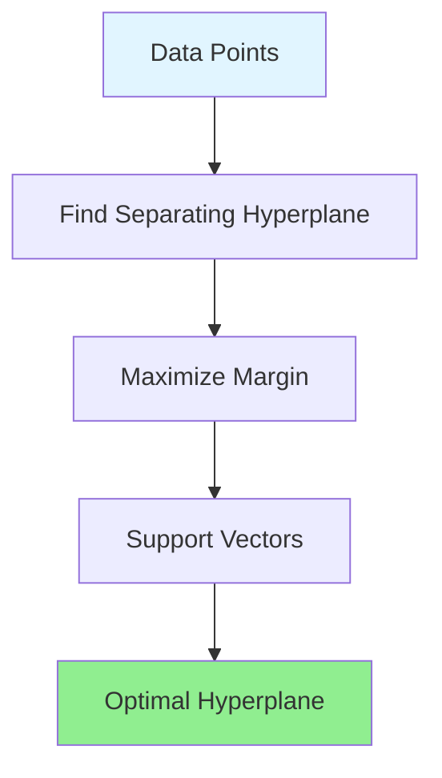

# Support Vector Machines (SVM)

## Introduction

Support Vector Machines (SVMs) are powerful supervised learning algorithms for classification and regression. The key idea is finding the optimal hyperplane that maximally separates classes, maximizing the margin between the decision boundary and the nearest data points. This maximum margin principle provides strong generalization guarantees and makes SVMs particularly effective for high-dimensional data.

SVMs elegantly handle non-linear classification through the kernel trick, implicitly mapping data to high-dimensional spaces without explicit computation. This mathematical sophistication, combined with solid theoretical foundations in statistical learning theory, made SVMs the dominant classification algorithm in the 1990s and early 2000s.

While deep learning has surpassed SVMs for many tasks, they remain valuable for small to medium-sized datasets, high-dimensional problems, and when interpretability and theoretical guarantees matter. Understanding SVMs provides essential insights into optimization, duality, and kernel methods that extend far beyond classification.

## Linear SVM

### Maximum Margin Classifier

**Goal:** Find hyperplane that separates classes with maximum margin.

**Hyperplane:** $$w^T x + b = 0$$

**Decision function:** $$f(x) = \text{sign}(w^T x + b)$$

**Margin:** Distance from hyperplane to nearest point of each class.

**Functional margin:** $$\tilde{\gamma}_i = y_i(w^T x_i + b)$$

**Geometric margin:** $$\gamma = \frac{\tilde{\gamma}}{||w||}$$



### Optimization Problem

**Primal formulation:**

$$\min_{w,b} \frac{1}{2}||w||^2$$

subject to: $$y_i(w^T x_i + b) \geq 1, \quad \forall i$$

**Intuition:**
- Minimize $$||w||$$ maximizes margin $$\frac{1}{||w||}$$
- Constraints ensure correct classification with margin ≥ 1

### Support Vectors

**Support vectors:** Points on margin boundaries where $$y_i(w^T x_i + b) = 1$$

**Key property:** Only support vectors determine the hyperplane!

**Sparsity:** Most training points don't affect decision boundary.

## Soft Margin SVM

### Handling Non-Separable Data

**Problem:** Real data often not linearly separable.

**Solution:** Allow some misclassification with penalty.

**Slack variables:** $$\xi_i \geq 0$$ measures constraint violation.

### C-SVM Formulation

$$\min_{w,b,\xi} \frac{1}{2}||w||^2 + C\sum_{i=1}^{n}\xi_i$$

subject to:
- $$y_i(w^T x_i + b) \geq 1 - \xi_i$$
- $$\xi_i \geq 0$$

**Parameter C:**
- Large C: Fewer misclassifications, risk overfitting
- Small C: More errors allowed, simpler model
- Trade-off between margin and training accuracy

### Hinge Loss Interpretation

**Equivalent unconstrained formulation:**

$$\min_{w,b} \frac{1}{2}||w||^2 + C\sum_{i=1}^{n}\max(0, 1 - y_i(w^T x_i + b))$$

**Hinge loss:** $$L(y, f(x)) = \max(0, 1 - yf(x))$$

**Properties:**
- Zero loss if margin ≥ 1
- Linear penalty for violations
- Convex, enables efficient optimization

## Dual Formulation

### Lagrangian Dual

**Dual problem:**

$$\max_{\alpha} \sum_{i=1}^{n}\alpha_i - \frac{1}{2}\sum_{i,j}\alpha_i\alpha_j y_i y_j x_i^T x_j$$

subject to:
- $$0 \leq \alpha_i \leq C$$
- $$\sum_{i}\alpha_i y_i = 0$$

**Solution:**

$$w = \sum_{i=1}^{n}\alpha_i y_i x_i$$

**Prediction:**

$$f(x) = \text{sign}\left(\sum_{i=1}^{n}\alpha_i y_i x_i^T x + b\right)$$

### Why Dual?

**Advantages:**
1. Depends only on dot products $$x_i^T x_j$$ (enables kernel trick)
2. Sparsity: Most $$\alpha_i = 0$$ (non-support vectors)
3. Efficient for high-dimensional data
4. Quadratic programming (well-studied)

## Kernel Trick

### Non-Linear Classification

**Idea:** Map data to higher-dimensional space where linear separation possible.

**Feature map:** $$\phi: \mathbb{R}^d \rightarrow \mathbb{R}^D$$ where $$D >> d$$

**Linear separator in transformed space:**

$$f(x) = w^T\phi(x) + b$$

**Problem:** High-dimensional $$\phi(x)$$ expensive to compute.

### Kernel Function

**Kernel:** $$K(x, x') = \phi(x)^T\phi(x')$$

**Computes dot product in transformed space without explicit $$\phi$$!**

**Dual with kernels:**

$$f(x) = \text{sign}\left(\sum_{i=1}^{n}\alpha_i y_i K(x_i, x) + b\right)$$

**Only need kernel values, never explicit $$\phi(x)$$.**

### Common Kernels

**Linear Kernel:**

$$K(x, x') = x^T x'$$

Equivalent to no transformation.

**Polynomial Kernel:**

$$K(x, x') = (x^T x' + c)^d$$

**Parameters:**
- $$d$$: Degree
- $$c$$: Constant (often 1)

**Implicit feature space:** All monomials up to degree $$d$$.

**RBF (Gaussian) Kernel:**

$$K(x, x') = \exp\left(-\frac{||x - x'||^2}{2\sigma^2}\right) = \exp(-\gamma||x - x'||^2)$$

where $$\gamma = \frac{1}{2\sigma^2}$$.

**Properties:**
- Infinite-dimensional feature space
- Smooth decision boundaries
- Universal kernel (can approximate any function)

**Parameter $$\gamma$$:**
- Large $$\gamma$$: Narrow influence, complex boundaries, risk overfitting
- Small $$\gamma$$: Wide influence, smooth boundaries, risk underfitting

**Sigmoid Kernel:**

$$K(x, x') = \tanh(\alpha x^T x' + c)$$

Similar to neural network activation.

## Implementation

### Scikit-learn SVM

```python
from sklearn.svm import SVC
from sklearn.preprocessing import StandardScaler
from sklearn.pipeline import Pipeline

# Linear SVM
svm_linear = SVC(kernel='linear', C=1.0)
svm_linear.fit(X_train, y_train)

# RBF SVM
svm_rbf = SVC(kernel='rbf', C=1.0, gamma='scale')
svm_rbf.fit(X_train, y_train)

# Polynomial SVM
svm_poly = SVC(kernel='poly', degree=3, C=1.0)
svm_poly.fit(X_train, y_train)

# Predictions
y_pred = svm_rbf.predict(X_test)

# Decision function values (distances from hyperplane)
decision_values = svm_rbf.decision_function(X_test)

# Support vectors
support_vectors = svm_rbf.support_vectors_
n_support = svm_rbf.n_support_
```

### Complete Pipeline

```python
from sklearn.model_selection import GridSearchCV
from sklearn.metrics import classification_report

# Pipeline with scaling (important for SVM!)
pipeline = Pipeline([
    ('scaler', StandardScaler()),
    ('svm', SVC())
])

# Hyperparameter tuning
param_grid = {
    'svm__C': [0.1, 1, 10, 100],
    'svm__gamma': ['scale', 'auto', 0.001, 0.01, 0.1],
    'svm__kernel': ['rbf', 'poly', 'linear']
}

grid_search = GridSearchCV(
    pipeline, param_grid, cv=5, scoring='accuracy', n_jobs=-1
)

grid_search.fit(X_train, y_train)

print(f'Best parameters: {grid_search.best_params_}')
print(f'Best CV score: {grid_search.best_score_:.4f}')

# Evaluate on test set
best_svm = grid_search.best_estimator_
y_pred = best_svm.predict(X_test)
print(classification_report(y_test, y_pred))
```

## SVM for Regression (SVR)

### ε-insensitive Loss

**Support Vector Regression** minimizes:

$$\min_{w,b} \frac{1}{2}||w||^2 + C\sum_{i=1}^{n}(L_\epsilon(y_i - f(x_i)))$$

**ε-insensitive loss:**

$$L_\epsilon(r) = \begin{cases}
0 & |r| \leq \epsilon \\
|r| - \epsilon & |r| > \epsilon
\end{cases}$$

**Interpretation:** No penalty for errors within $$\epsilon$$ tube around predictions.

**Parameters:**
- $$C$$: Regularization strength
- $$\epsilon$$: Tube width (tolerance)

### Implementation

```python
from sklearn.svm import SVR

# Linear SVR
svr_linear = SVR(kernel='linear', C=1.0, epsilon=0.1)
svr_linear.fit(X_train, y_train)

# RBF SVR
svr_rbf = SVR(kernel='rbf', C=1.0, epsilon=0.1, gamma='scale')
svr_rbf.fit(X_train, y_train)

# Predictions
y_pred = svr_rbf.predict(X_test)

# Evaluate
from sklearn.metrics import mean_squared_error, r2_score
mse = mean_squared_error(y_test, y_pred)
r2 = r2_score(y_test, y_pred)
print(f'MSE: {mse:.4f}, R²: {r2:.4f}')
```

## Multiclass Classification

### One-vs-Rest (OvR)

Train $$K$$ binary classifiers, one per class.

**Prediction:** Class with highest decision function value.

**Default in scikit-learn.**

### One-vs-One (OvO)

Train $$\frac{K(K-1)}{2}$$ classifiers for each pair.

**Prediction:** Majority voting.

**More classifiers but simpler problems.**

```python
# Specify multiclass strategy
svm_ovr = SVC(kernel='rbf', decision_function_shape='ovr')
svm_ovo = SVC(kernel='rbf', decision_function_shape='ovo')
```

## Feature Scaling

**Critical for SVM!**

**Why:** SVM uses distances (kernels), sensitive to scale.

**Always standardize:**

```python
from sklearn.preprocessing import StandardScaler

scaler = StandardScaler()
X_train_scaled = scaler.fit_transform(X_train)
X_test_scaled = scaler.transform(X_test)

svm = SVC(kernel='rbf')
svm.fit(X_train_scaled, y_train)
```

## Hyperparameter Tuning

### Parameter C

**Controls margin vs misclassification trade-off:**

- Large C: Hard margin, fewer errors, risk overfitting
- Small C: Soft margin, more errors allowed, better generalization

**Typical range:** [0.1, 1, 10, 100, 1000]

### Parameter gamma (RBF kernel)

**Controls kernel width:**

- Large $$\gamma$$: Narrow Gaussian, complex boundaries, overfitting risk
- Small $$\gamma$$: Wide Gaussian, smooth boundaries, underfitting risk

**Typical range:** [0.001, 0.01, 0.1, 1]

### Grid Search Strategy

```python
param_grid = [
    # RBF kernel
    {
        'svm__kernel': ['rbf'],
        'svm__C': [0.1, 1, 10, 100],
        'svm__gamma': ['scale', 0.001, 0.01, 0.1, 1]
    },
    # Polynomial kernel
    {
        'svm__kernel': ['poly'],
        'svm__C': [0.1, 1, 10],
        'svm__degree': [2, 3, 4],
        'svm__gamma': ['scale', 'auto']
    },
    # Linear kernel
    {
        'svm__kernel': ['linear'],
        'svm__C': [0.1, 1, 10, 100]
    }
]
```

## Advantages of SVM

**Effective in high dimensions:** Works well when $$d > n$$.

**Memory efficient:** Only uses support vectors.

**Versatile:** Different kernels for different problems.

**Robust:** Less prone to overfitting in high dimensions (with proper C).

**Theoretical guarantees:** Strong foundation in statistical learning theory.

**Global optimum:** Convex optimization, no local minima.

## Disadvantages of SVM

**Sensitive to scaling:** Requires feature standardization.

**Choice of kernel and parameters:** Requires cross-validation.

**Training time:** $$O(n^2)$$ to $$O(n^3)$$ for large datasets (not scalable).

**No probability estimates:** Must use Platt scaling (computationally expensive).

**Interpretability:** Difficult to interpret, especially with non-linear kernels.

**Large datasets:** Inefficient compared to linear models or tree ensembles.

## Practical Tips

**Start with RBF kernel:** Most versatile, works well generally.

**Scale features:** Always standardize before training.

**Use cross-validation:** Tune C and gamma together.

**For large datasets:** Consider LinearSVC or SGDClassifier instead.

**Check support vector ratio:** If > 50%, model may be overfitting.

**Probability calibration:** Use CalibratedClassifierCV if probabilities needed.

## Comparison with Other Algorithms

| Aspect | SVM | Logistic Regression | Random Forest | Neural Network |
|--------|-----|---------------------|---------------|----------------|
| Training speed | Slow | Fast | Medium | Slow |
| Prediction speed | Fast | Very fast | Medium | Fast |
| High dimensions | Excellent | Good | Good | Excellent |
| Large datasets | Poor | Good | Excellent | Good |
| Interpretability | Low | High | Medium | Very low |
| Hyperparameter sensitivity | High | Low | Low | High |

## Applications

**Text classification:** High-dimensional sparse features (bag-of-words).

**Image classification:** Before deep learning, HOG + SVM was standard.

**Bioinformatics:** Gene expression classification, protein function prediction.

**Handwriting recognition:** MNIST and similar datasets.

**Face detection:** Viola-Jones algorithm uses SVM-like cascade.

## Conclusion

Support Vector Machines provide a powerful, theoretically-grounded approach to classification and regression. The maximum margin principle, kernel trick, and strong generalization guarantees make SVMs particularly effective for high-dimensional data and problems with clear margins of separation.

**Key takeaways:**

- **Maximum margin:** Finds optimal separating hyperplane
- **Kernel trick:** Non-linear classification without explicit feature mapping
- **Support vectors:** Sparse representation using only boundary points
- **C parameter:** Controls margin-error trade-off
- **RBF kernel:** Most versatile, controlled by gamma parameter
- **Feature scaling:** Essential for good performance
- **Not scalable:** Best for small-medium datasets

While deep learning has surpassed SVMs for many tasks, they remain valuable for certain problem types: high-dimensional data, small datasets, interpretability requirements, and when theoretical guarantees matter. Understanding SVMs provides essential insights into optimization and kernel methods that extend throughout machine learning.