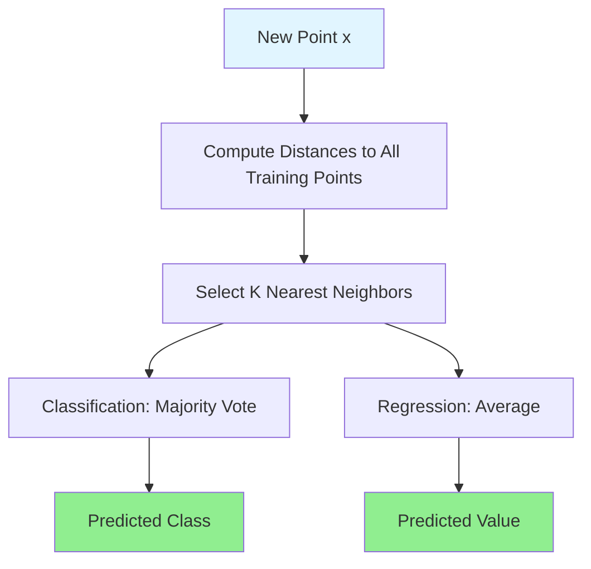
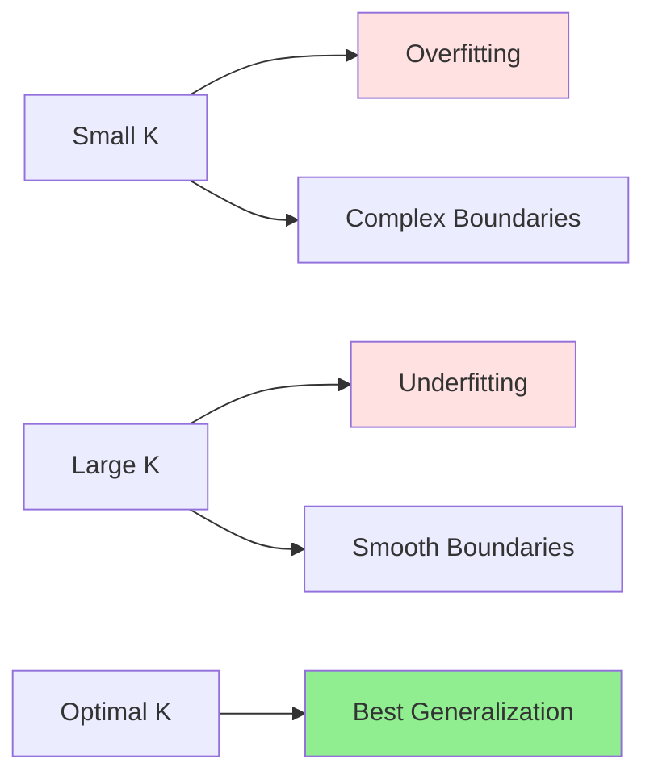

# K-Nearest Neighbors (KNN)

## Introduction

K-Nearest Neighbors is one of the simplest yet effective machine learning algorithms. Unlike parametric models that learn explicit parameters during training, KNN is a non-parametric, instance-based algorithm that makes predictions by finding the K most similar training examples and using their labels. This "lazy learning" approach defers computation until prediction time, making training instant but prediction potentially slow.

The core intuition is beautifully simple: similar examples should have similar labels. If a new data point is surrounded by examples of class A, it's likely class A itself. Despite this simplicity, KNN can capture complex, non-linear decision boundaries and works surprisingly well across diverse problems.

However, KNN has significant limitations: sensitivity to irrelevant features, computational cost at prediction time, and the curse of dimensionality. Understanding when to use KNN—and when not to—is essential for practical machine learning.

## Algorithm

### K-Nearest Neighbors for Classification

**Training:** Store all training examples.

**Prediction for new point $$x$$:**

1. Compute distance from $$x$$ to all training points
2. Select K nearest neighbors
3. Return majority class among K neighbors

$$\hat{y} = \text{mode}(y_{(1)}, y_{(2)}, ..., y_{(K)})$$

where $$y_{(i)}$$ is the label of the $$i$$-th nearest neighbor.

### K-Nearest Neighbors for Regression

**Prediction:**

$$\hat{y} = \frac{1}{K}\sum_{i=1}^{K}y_{(i)}$$

Average of K nearest neighbors' values.



## Distance Metrics

### Euclidean Distance

**Most common:**

$$d(x, x') = \sqrt{\sum_{j=1}^{d}(x_j - x'_j)^2} = ||x - x'||_2$$

**Properties:**
- Sensitive to scale
- Assumes all features equally important
- Works well for continuous features

### Manhattan Distance (L1)

$$d(x, x') = \sum_{j=1}^{d}|x_j - x'_j| = ||x - x'||_1$$

**Properties:**
- Less sensitive to outliers
- Better for grid-like spaces
- Faster to compute

### Minkowski Distance

**Generalization:**

$$d(x, x') = \left(\sum_{j=1}^{d}|x_j - x'_j|^p\right)^{1/p}$$

- $$p=1$$: Manhattan
- $$p=2$$: Euclidean
- $$p=\infty$$: Chebyshev (maximum coordinate difference)

### Cosine Similarity

**For text and sparse data:**

$$\text{similarity}(x, x') = \frac{x \cdot x'}{||x|| \cdot ||x'||}$$

$$\text{distance}(x, x') = 1 - \text{similarity}(x, x')$$

**Properties:**
- Focuses on direction, not magnitude
- Good for high-dimensional sparse data
- Common in text classification

### Hamming Distance

**For categorical features:**

$$d(x, x') = \sum_{j=1}^{d}\mathbb{1}[x_j \neq x'_j]$$

Count of differing features.

## Choosing K

### Effect of K

**K = 1 (Nearest Neighbor):**
- Most flexible
- High variance, low bias
- Overfitting risk
- Decision boundary irregular

**Large K:**
- Smoother decision boundary
- Low variance, higher bias
- Underfitting risk
- More robust to noise

**Optimal K:**
- Balance bias and variance
- Typically odd number (avoid ties)
- Common range: 3-20



### Cross-Validation for K

```python
from sklearn.neighbors import KNeighborsClassifier
from sklearn.model_selection import cross_val_score
import numpy as np

k_range = range(1, 31)
k_scores = []

for k in k_range:
    knn = KNeighborsClassifier(n_neighbors=k)
    scores = cross_val_score(knn, X_train, y_train, cv=5, scoring='accuracy')
    k_scores.append(scores.mean())

# Find best K
optimal_k = k_range[np.argmax(k_scores)]
print(f'Optimal K: {optimal_k}')

# Plot
import matplotlib.pyplot as plt
plt.plot(k_range, k_scores)
plt.xlabel('K')
plt.ylabel('Cross-Validation Accuracy')
plt.title('Optimal K Selection')
plt.show()
```

## Implementation

### Scikit-learn KNN

```python
from sklearn.neighbors import KNeighborsClassifier, KNeighborsRegressor
from sklearn.preprocessing import StandardScaler
from sklearn.pipeline import Pipeline

# Classification
knn_clf = KNeighborsClassifier(
    n_neighbors=5,
    weights='uniform',  # or 'distance'
    algorithm='auto',  # 'ball_tree', 'kd_tree', 'brute'
    metric='euclidean',
    n_jobs=-1  # parallel processing
)

# With scaling (important!)
pipeline = Pipeline([
    ('scaler', StandardScaler()),
    ('knn', KNeighborsClassifier(n_neighbors=5))
])

pipeline.fit(X_train, y_train)
y_pred = pipeline.predict(X_test)

# Get probabilities
probs = pipeline.predict_proba(X_test)

# Regression
knn_reg = KNeighborsRegressor(n_neighbors=5, weights='distance')
knn_reg.fit(X_train, y_train)
y_pred = knn_reg.predict(X_test)
```

### Complete Example

```python
from sklearn.datasets import load_iris
from sklearn.model_selection import train_test_split, GridSearchCV
from sklearn.metrics import classification_report, accuracy_score

# Load data
X, y = load_iris(return_X_y=True)

# Split
X_train, X_test, y_train, y_test = train_test_split(
    X, y, test_size=0.2, random_state=42
)

# Create pipeline
pipeline = Pipeline([
    ('scaler', StandardScaler()),
    ('knn', KNeighborsClassifier())
])

# Hyperparameter tuning
param_grid = {
    'knn__n_neighbors': [3, 5, 7, 9, 11, 15],
    'knn__weights': ['uniform', 'distance'],
    'knn__metric': ['euclidean', 'manhattan']
}

grid_search = GridSearchCV(
    pipeline, param_grid, cv=5, scoring='accuracy', n_jobs=-1
)

grid_search.fit(X_train, y_train)

print(f'Best parameters: {grid_search.best_params_}')
print(f'Best CV score: {grid_search.best_score_:.4f}')

# Evaluate
best_knn = grid_search.best_estimator_
y_pred = best_knn.predict(X_test)
print(f'Test accuracy: {accuracy_score(y_test, y_pred):.4f}')
print(classification_report(y_test, y_pred))
```

## Weighted KNN

### Distance Weighting

**Problem:** All K neighbors weighted equally.

**Solution:** Weight by inverse distance.

**Weights:**

$$w_i = \frac{1}{d(x, x_i)}$$

**Prediction (classification):**

$$\hat{y} = \arg\max_c \sum_{i=1}^{K}w_i \cdot \mathbb{1}[y_i = c]$$

**Prediction (regression):**

$$\hat{y} = \frac{\sum_{i=1}^{K}w_i y_i}{\sum_{i=1}^{K}w_i}$$

**Benefits:**
- Closer neighbors have more influence
- Smoother predictions
- Often better performance

```python
knn = KNeighborsClassifier(n_neighbors=5, weights='distance')
```

## Efficient Nearest Neighbor Search

### Brute Force

**Compute distance to all training points.**

**Complexity:** $$O(nd)$$ per query where $$n$$ is training size, $$d$$ is dimensions.

**Works for:** Small datasets, any distance metric.

### KD-Tree

**Binary space partitioning tree.**

**Build:** $$O(dn\log n)$$

**Query:** $$O(\log n)$$ average, $$O(n)$$ worst case

**Works best:** Low dimensions ($$d < 20$$), Euclidean distance

**Degrades:** High dimensions (curse of dimensionality)

### Ball Tree

**Tree structure using hyperspheres.**

**Build:** $$O(dn\log n)$$

**Query:** $$O(\log n)$$ average

**Better than KD-Tree:** Higher dimensions, non-Euclidean metrics

### Choosing Algorithm

```python
# Automatic selection
knn = KNeighborsClassifier(algorithm='auto')  # Chooses best based on data

# Manual selection
knn_brute = KNeighborsClassifier(algorithm='brute')
knn_kd = KNeighborsClassifier(algorithm='kd_tree')
knn_ball = KNeighborsClassifier(algorithm='ball_tree')
```

**Recommendations:**
- Small data: 'brute'
- Low dimensions: 'kd_tree'
- High dimensions: 'ball_tree'
- Unknown: 'auto'

## Feature Scaling

**Critical for KNN!**

**Why:** Distance-based, features with larger scales dominate.

**Example:**

Feature 1: House size (500-5000 sq ft)
Feature 2: Bedrooms (1-5)

Without scaling, size dominates distance calculation!

**Always scale:**

```python
from sklearn.preprocessing import StandardScaler, MinMaxScaler

# Standardization (preferred)
scaler = StandardScaler()
X_train_scaled = scaler.fit_transform(X_train)
X_test_scaled = scaler.transform(X_test)

# Or Min-Max normalization
scaler = MinMaxScaler()
X_train_scaled = scaler.fit_transform(X_train)
X_test_scaled = scaler.transform(X_test)
```

## Curse of Dimensionality

### Problem

**In high dimensions:**
- Distances become less meaningful
- All points become equidistant
- Nearest neighbors not actually "near"
- Exponential growth in volume

**Example:** In 100 dimensions, most volume of hypersphere is near surface!

### Manifestation

**Distance concentration:**

$$\frac{d_{\max} - d_{\min}}{d_{\min}} \to 0$$ as $$d \to \infty$$

All distances become similar.

### Solutions

**Dimensionality reduction:**
- PCA
- Feature selection
- Domain knowledge to select relevant features

**Different algorithms:**
- Tree-based methods (Random Forest)
- Linear models
- Neural networks

**Feature engineering:**
- Create informative features
- Remove redundant features

## Advantages of KNN

**Simple and intuitive:** Easy to understand and implement.

**No training time:** Instant "training" (just stores data).

**Non-parametric:** Makes no assumptions about data distribution.

**Naturally handles multiclass:** No modification needed.

**Online learning:** Easy to add new examples.

**Decision boundary:** Can model complex, non-linear boundaries.

## Disadvantages of KNN

**Slow prediction:** Must compute distances to all training points.

**Memory intensive:** Stores entire training set.

**Curse of dimensionality:** Performs poorly in high dimensions.

**Sensitive to irrelevant features:** All features affect distance equally.

**Sensitive to scale:** Requires feature scaling.

**Sensitive to imbalanced data:** Majority class can dominate.

**No interpretability:** Doesn't provide feature importance or model structure.

## Handling Categorical Features

### One-Hot Encoding

```python
from sklearn.preprocessing import OneHotEncoder

encoder = OneHotEncoder(sparse=False)
X_encoded = encoder.fit_transform(X_categorical)
```

**Issue:** Binary features treated equally in distance.

### Hamming Distance

For all-categorical data:

```python
knn = KNeighborsClassifier(n_neighbors=5, metric='hamming')
```

### Mixed Data

**Gower distance:** Handles mixed numerical and categorical.

```python
from scipy.spatial.distance import pdist, squareform

def gower_distance(X):
    # Custom implementation or use gower package
    pass

knn = KNeighborsClassifier(n_neighbors=5, metric=gower_distance)
```

## Handling Imbalanced Data

### Problem

**Majority class dominates voting.**

**Example:** K=10, 9 class A neighbors, 1 class B neighbor → Predicts A even if B is very close.

### Solutions

**Distance weighting:**

```python
knn = KNeighborsClassifier(n_neighbors=10, weights='distance')
```

Closer neighbors weighted more.

**Different K per class:**

Use fewer neighbors for minority class.

**Class weights:**

Not directly supported in KNN, but can modify distance metric.

**SMOTE oversampling:**

```python
from imblearn.over_sampling import SMOTE

smote = SMOTE(random_state=42)
X_resampled, y_resampled = smote.fit_resample(X_train, y_train)

knn = KNeighborsClassifier(n_neighbors=5)
knn.fit(X_resampled, y_resampled)
```

## Radius Neighbors

### Alternative: Fixed Radius

**Instead of K neighbors, use all neighbors within radius $$r$$.**

```python
from sklearn.neighbors import RadiusNeighborsClassifier

rnn = RadiusNeighborsClassifier(radius=1.0, weights='distance')
rnn.fit(X_train, y_train)
y_pred = rnn.predict(X_test)
```

**Advantage:** Adapts to local density.

**Disadvantage:** May have no neighbors for some points.

**Use case:** Anomaly detection (points with few neighbors are anomalies).

## Practical Tips

### Start with K=5

**Good default:** Balances bias and variance.

### Always Scale Features

**Use StandardScaler** or MinMaxScaler in pipeline.

### Use Cross-Validation

**Tune K** on validation set, not training set.

### Consider Dimensionality

**If $$d > 20$$:** KNN may not be best choice.

**Apply PCA** or feature selection first.

### Use Distance Weighting

**weights='distance'** often improves performance.

### Check Computation Time

**For large datasets:** KNN prediction slow, consider alternatives.

### Feature Selection

**Remove irrelevant features** to improve distance metric.

## Applications

**Recommendation systems:** Find similar users/items.

**Pattern recognition:** Handwriting recognition, face recognition.

**Anomaly detection:** Points with few neighbors are anomalies.

**Imputation:** Fill missing values with K-nearest neighbors.

**Preprocessing:** KNN imputer for missing data.

**Lazy evaluation:** When training data changes frequently.

## Comparison with Other Algorithms

| Aspect | KNN | Decision Tree | SVM | Neural Network |
|--------|-----|---------------|-----|----------------|
| Training speed | Instant | Fast | Slow | Very slow |
| Prediction speed | Slow | Fast | Fast | Fast |
| High dimensions | Poor | Good | Good | Good |
| Interpretability | Low | High | Low | Very low |
| Parametric | No | No | Yes | Yes |
| Memory | High | Low | Low | Medium |

## Advanced Topics

### Approximate Nearest Neighbors

**For very large datasets:**

**Locality-Sensitive Hashing (LSH):** Hash similar items to same buckets.

**Annoy (Approximate Nearest Neighbors Oh Yeah):** Tree-based approximate search.

**FAISS (Facebook AI Similarity Search):** GPU-accelerated similarity search.

**Trade-off:** Speed for slight accuracy loss.

### Weighted Features

**Different weights for different features:**

$$d(x, x') = \sqrt{\sum_{j=1}^{d}w_j(x_j - x'_j)^2}$$

Learn weights to improve performance.

### Locally Weighted Learning

**Fit local model weighted by distance:**

Instead of voting, fit regression model using K neighbors weighted by distance.

More flexible than simple averaging.

## Conclusion

K-Nearest Neighbors is a simple, intuitive, and effective algorithm that makes predictions based on similarity to training examples. Its non-parametric nature and ability to model complex decision boundaries make it valuable for many applications.

**Key takeaways:**

- **Instance-based:** No training, stores all data
- **Distance metric:** Choice affects performance significantly
- **Parameter K:** Controls bias-variance tradeoff
- **Feature scaling:** Essential for good performance
- **Curse of dimensionality:** Degrades in high dimensions
- **Slow prediction:** Computes distances to all training points
- **Distance weighting:** Often improves performance

While KNN has limitations—slow prediction, curse of dimensionality, sensitivity to irrelevant features—it remains useful for small to medium datasets, especially when decision boundaries are complex and non-linear. Understanding when to use KNN and how to address its limitations is essential for practical machine learning.

For modern applications with large datasets or high dimensions, tree-based ensembles or neural networks typically outperform KNN. However, KNN remains valuable for baseline models, recommendation systems, and problems where simplicity and interpretability of the algorithm (if not the model) matter.