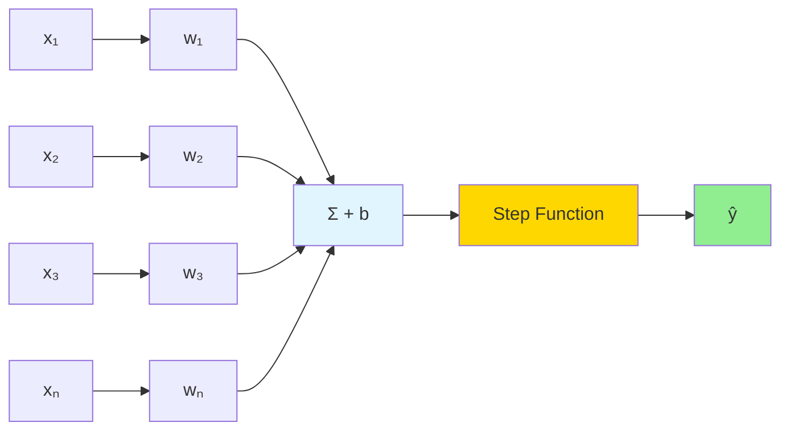

# The Perceptron

## Introduction

The perceptron, introduced by Frank Rosenblatt in 1958, is the simplest neural network and the foundation of modern deep learning. While a single perceptron can only learn linearly separable patterns, understanding its mechanics—forward propagation, weights, biases, and learning rules—provides essential insights that extend to complex neural networks.

The perceptron represents a binary linear classifier that learns through iterative weight updates. When the perceptron makes a mistake, it adjusts weights to move the decision boundary closer to correct classification. This simple learning rule, while limited, introduced key concepts that persist in modern neural networks: weighted sums, activation functions, and gradient-based learning.

Despite its limitations (famously unable to learn XOR), the perceptron's historical significance and conceptual clarity make it essential for understanding neural networks. Modern deep learning is essentially stacked perceptrons with non-linear activations, making the perceptron the atomic unit of neural computation.

## Perceptron Model

### Architecture

**Inputs:** $$x = [x_1, x_2, ..., x_n]$$

**Weights:** $$w = [w_1, w_2, ..., w_n]$$

**Bias:** $$b$$

**Weighted sum:** $$z = w^T x + b = \sum_{i=1}^{n}w_i x_i + b$$

**Activation (step function):**

$$\hat{y} = \begin{cases}
1 & \text{if } z \geq 0 \\
0 & \text{if } z < 0
\end{cases}$$

Or equivalently: $$\hat{y} = \text{step}(w^T x + b)$$



### Geometric Interpretation

**Decision boundary:** $$w^T x + b = 0$$

**Hyperplane** separating two classes in n-dimensional space.

**Classification:**
- Points where $$w^T x + b > 0$$: Class 1
- Points where $$w^T x + b < 0$$: Class 0

**Weight vector $$w$$:** Perpendicular to decision boundary

**Bias $$b$$:** Shifts boundary from origin

## Perceptron Learning Algorithm

### Update Rule

**For each training example $$(x^{(i)}, y^{(i)})$$:**

$$w = w + \eta(y^{(i)} - \hat{y}^{(i)})x^{(i)}$$

$$b = b + \eta(y^{(i)} - \hat{y}^{(i)})$$

where $$\eta$$ is the learning rate.

**Intuition:**
- If correct ($$y = \hat{y}$$): No change
- If predict 0 but should be 1: Increase weights
- If predict 1 but should be 0: Decrease weights

### Training Algorithm

```
Initialize: w = 0, b = 0
Set learning rate η and max iterations

For epoch = 1 to max_epochs:
    For each training example (x, y):
        1. Compute prediction: ŷ = step(wᵀx + b)
        2. If error (y ≠ ŷ):
            Update: w = w + η(y - ŷ)x
            Update: b = b + η(y - ŷ)

    If no errors on entire dataset:
        Converged! Break

Return w, b
```

### Convergence Theorem

**Perceptron convergence theorem:** If data is linearly separable, the perceptron learning algorithm will converge in finite steps.

**However:** No guarantee on number of steps, and fails if data not linearly separable.

## Implementation

### NumPy Implementation

```python
import numpy as np

class Perceptron:
    def __init__(self, learning_rate=0.01, n_iterations=1000):
        self.lr = learning_rate
        self.n_iterations = n_iterations
        self.weights = None
        self.bias = None

    def step_function(self, x):
        return np.where(x >= 0, 1, 0)

    def fit(self, X, y):
        n_samples, n_features = X.shape

        # Initialize weights and bias
        self.weights = np.zeros(n_features)
        self.bias = 0

        # Training loop
        for epoch in range(self.n_iterations):
            errors = 0
            for idx, x_i in enumerate(X):
                # Forward pass
                linear_output = np.dot(x_i, self.weights) + self.bias
                y_pred = self.step_function(linear_output)

                # Update if error
                update = self.lr * (y[idx] - y_pred)
                if update != 0:
                    self.weights += update * x_i
                    self.bias += update
                    errors += 1

            # Check convergence
            if errors == 0:
                print(f'Converged at epoch {epoch}')
                break

        return self

    def predict(self, X):
        linear_output = np.dot(X, self.weights) + self.bias
        return self.step_function(linear_output)

# Example usage
X = np.array([[0, 0], [0, 1], [1, 0], [1, 1]])
y_and = np.array([0, 0, 0, 1])  # AND function

perceptron = Perceptron(learning_rate=0.1, n_iterations=100)
perceptron.fit(X, y_and)

predictions = perceptron.predict(X)
print(f'Predictions: {predictions}')
print(f'Weights: {perceptron.weights}')
print(f'Bias: {perceptron.bias}')
```

### Scikit-learn Implementation

```python
from sklearn.linear_model import Perceptron as SKPerceptron
from sklearn.datasets import make_classification
from sklearn.model_selection import train_test_split

# Generate data
X, y = make_classification(n_samples=100, n_features=2, n_redundant=0,
                           n_informative=2, n_clusters_per_class=1,
                           random_state=42)

X_train, X_test, y_train, y_test = train_test_split(X, y, test_size=0.2)

# Train perceptron
clf = SKPerceptron(eta0=0.1, max_iter=1000, random_state=42)
clf.fit(X_train, y_train)

# Evaluate
train_acc = clf.score(X_train, y_train)
test_acc = clf.score(X_test, y_test)

print(f'Train accuracy: {train_acc:.4f}')
print(f'Test accuracy: {test_acc:.4f}')
print(f'Weights: {clf.coef_}')
print(f'Bias: {clf.intercept_}')
```

## Boolean Functions

### AND Function

$$y = x_1 \land x_2$$

**Truth table:**

| $$x_1$$ | $$x_2$$ | $$y$$ |
|---------|---------|-------|
| 0 | 0 | 0 |
| 0 | 1 | 0 |
| 1 | 0 | 0 |
| 1 | 1 | 1 |

**Linearly separable!** Perceptron can learn.

**Example weights:** $$w_1 = 1, w_2 = 1, b = -1.5$$

Decision: $$x_1 + x_2 - 1.5 \geq 0$$

### OR Function

$$y = x_1 \lor x_2$$

**Truth table:**

| $$x_1$$ | $$x_2$$ | $$y$$ |
|---------|---------|-------|
| 0 | 0 | 0 |
| 0 | 1 | 1 |
| 1 | 0 | 1 |
| 1 | 1 | 1 |

**Linearly separable!**

**Example weights:** $$w_1 = 1, w_2 = 1, b = -0.5$$

### XOR Function (The Problem)

$$y = x_1 \oplus x_2$$

**Truth table:**

| $$x_1$$ | $$x_2$$ | $$y$$ |
|---------|---------|-------|
| 0 | 0 | 0 |
| 0 | 1 | 1 |
| 1 | 0 | 1 |
| 1 | 1 | 0 |

**NOT linearly separable!**

No single line can separate (0,1) and (1,0) from (0,0) and (1,1).

**Solution:** Multi-layer perceptron (MLP) with hidden layer.

## Linear Separability

### Definition

**Dataset is linearly separable** if exists hyperplane perfectly separating classes.

**Mathematically:** Exists $$w, b$$ such that:
- $$w^T x^{(i)} + b > 0$$ for all $$y^{(i)} = 1$$
- $$w^T x^{(i)} + b < 0$$ for all $$y^{(i)} = 0$$

### Testing Separability

**Try training perceptron:**
- Converges → linearly separable
- Doesn't converge → not linearly separable

**Or use SVM with linear kernel:** If perfect accuracy possible, linearly separable.

### Real-World Implications

**Most real-world problems NOT linearly separable.**

**Solutions:**
1. Feature engineering (add non-linear features)
2. Kernel methods (implicit feature mapping)
3. Multi-layer networks (learn non-linear representations)

## Limitations of Perceptron

### Cannot Learn Non-Linear Patterns

**XOR problem** demonstrates fundamental limitation.

### No Hidden Layers

**Single layer** limits representational capacity.

### Binary Classification Only

**Original perceptron** handles two classes.

**Extension needed** for multi-class.

### Hard Decision Boundary

**Step function** provides no confidence measure.

**Modern networks** use smooth activations (sigmoid, ReLU).

### Sensitive to Feature Scaling

**Large-magnitude features** dominate.

**Solution:** Normalize/standardize features.

## Extensions

### Pocket Algorithm

**For non-separable data:** Keep best weights seen during training.

**Modification:** Track weights with lowest error, return those instead of final weights.

### Voted Perceptron

**Ensemble of perceptrons** from different training iterations.

**Prediction:** Weighted vote of perceptrons.

### Multi-Class Perceptron

**One-vs-All:** Train one perceptron per class.

**Prediction:** Class with highest activation.

### Perceptron with Smooth Activation

**Replace step with sigmoid:**

$$\hat{y} = \sigma(w^T x + b) = \frac{1}{1 + e^{-(w^T x + b)}}$$

**This is logistic regression!**

## Perceptron vs Logistic Regression

| Aspect | Perceptron | Logistic Regression |
|--------|------------|---------------------|
| Activation | Step function | Sigmoid |
| Output | Binary (0/1) | Probability [0,1] |
| Loss | 0-1 loss | Log loss (cross-entropy) |
| Convergence | Only if separable | Always converges |
| Probabilities | No | Yes |
| Optimization | Perceptron rule | Gradient descent |

**Logistic regression = Smooth perceptron**

## Historical Significance

### 1958: Birth of Neural Networks

**Rosenblatt's perceptron** sparked enthusiasm for neural networks.

**Promise:** Machines that could learn like brains.

### 1969: First AI Winter

**Minsky & Papert's book "Perceptrons":** Highlighted limitations (XOR problem).

**Result:** Funding dried up, neural network research declined.

### 1986: Resurrection

**Backpropagation algorithm** enabled training multi-layer networks.

**Solution to XOR:** Hidden layers learn non-linear representations.

### Modern Era

**Perceptron = Neuron = Unit** in deep neural networks.

**Foundation:** All modern deep learning builds on perceptron concept.

## Practical Tips

### Always Normalize Features

```python
from sklearn.preprocessing import StandardScaler

scaler = StandardScaler()
X_train_scaled = scaler.fit_transform(X_train)
X_test_scaled = scaler.transform(X_test)
```

### Start with Small Learning Rate

**Too large:** Oscillation, no convergence

**Too small:** Slow learning

**Typical range:** 0.001 - 0.1

### Monitor Convergence

```python
def fit_with_monitoring(self, X, y):
    for epoch in range(self.n_iterations):
        errors = 0
        for idx, x_i in enumerate(X):
            update = self.lr * (y[idx] - self.predict_single(x_i))
            if abs(update) > 1e-6:
                self.weights += update * x_i
                self.bias += update
                errors += 1

        if epoch % 10 == 0:
            print(f'Epoch {epoch}: {errors} errors')

        if errors == 0:
            break
```

### Check Linear Separability

```python
from sklearn.svm import LinearSVC

# If SVM achieves perfect accuracy, likely linearly separable
svm = LinearSVC()
svm.fit(X_train, y_train)
if svm.score(X_train, y_train) == 1.0:
    print('Likely linearly separable')
else:
    print('Not linearly separable - consider MLP')
```

## Conclusion

The perceptron, despite its simplicity and limitations, remains foundational to understanding neural networks. Its learning rule, geometric interpretation, and the concepts of weights, biases, and activations extend directly to modern deep learning.

**Key takeaways:**

- **Binary linear classifier:** Learns decision hyperplane
- **Perceptron learning rule:** Update weights when wrong
- **Convergence:** Guaranteed if linearly separable
- **XOR problem:** Cannot learn non-linear patterns
- **Historical importance:** Foundation of neural networks
- **Modern relevance:** Building block of deep networks

Understanding the perceptron provides essential intuition for multi-layer networks. While single perceptrons are limited, stacking them with non-linear activations creates arbitrarily complex function approximators. The journey from perceptron to deep learning is one of composition and scale, not fundamental algorithmic change.

As we move to multi-layer perceptrons, remember that each neuron is fundamentally a perceptron—a weighted sum followed by an activation. Deep learning's power comes from combining many simple perceptrons in clever architectures, trained with sophisticated algorithms like backpropagation.