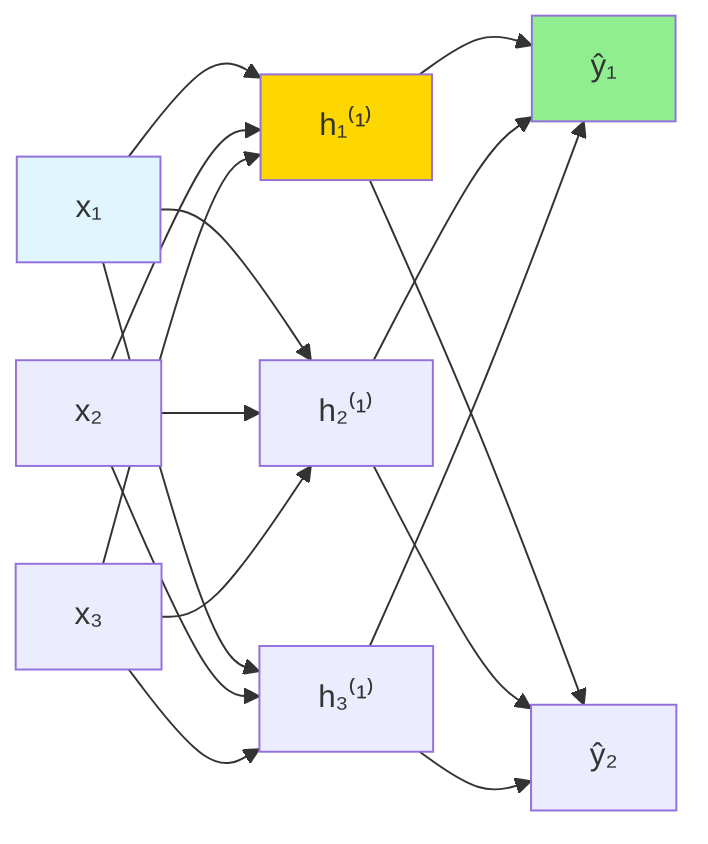

# Multilayer Perceptron (MLP)

## Introduction

The Multilayer Perceptron (MLP) extends the single perceptron by introducing hidden layers between inputs and outputs. This seemingly simple addition fundamentally transforms capabilities—MLPs can learn arbitrary non-linear functions, solving the XOR problem and countless other tasks impossible for single-layer networks.

The MLP architecture stacks layers of perceptrons (neurons), where each layer's outputs become the next layer's inputs. With sufficient neurons and appropriate non-linear activation functions, MLPs are universal function approximators—they can approximate any continuous function to arbitrary precision. This theoretical power, combined with practical training algorithms like backpropagation, makes MLPs the foundation of deep learning.

Understanding MLPs is essential for grasping modern neural networks. Concepts introduced here—hidden layers, forward propagation, non-linear activations, and network depth—extend directly to convolutional networks, recurrent networks, and transformers. Master the MLP, and you've mastered the core of deep learning.

## Architecture

### Network Structure

**Layers:**
- **Input layer:** Features (not really a layer, just input values)
- **Hidden layers:** One or more layers of neurons
- **Output layer:** Predictions

**Fully connected (dense):** Every neuron in layer $$l$$ connects to every neuron in layer $$l+1$$.



### Notation

**Layers:**
- $$L$$: Total number of layers (excluding input)
- $$l$$: Layer index (1 to $$L$$)

**Neurons:**
- $$n^{[l]}$$: Number of neurons in layer $$l$$

**Parameters:**
- $$W^{[l]}$$: Weight matrix for layer $$l$$ (shape: $$n^{[l]} \times n^{[l-1]}$$)
- $$b^{[l]}$$: Bias vector for layer $$l$$ (shape: $$n^{[l]} \times 1$$)

**Activations:**
- $$a^{[l]}$$: Activations of layer $$l$$
- $$a^{[0]} = x$$: Input features
- $$z^{[l]}$$: Pre-activation (weighted sum)

### Single Neuron Computation

**For neuron $$j$$ in layer $$l$$:**

$$z_j^{[l]} = \sum_{i=1}^{n^{[l-1]}} w_{ji}^{[l]} a_i^{[l-1]} + b_j^{[l]}$$

$$a_j^{[l]} = g^{[l]}(z_j^{[l]})$$

where $$g^{[l]}$$ is the activation function.

**Vectorized:**

$$z^{[l]} = W^{[l]}a^{[l-1]} + b^{[l]}$$

$$a^{[l]} = g^{[l]}(z^{[l]})$$

## Forward Propagation

### Layer-by-Layer Computation

**For each layer $$l = 1, 2, ..., L$$:**

1. Compute pre-activation: $$z^{[l]} = W^{[l]}a^{[l-1]} + b^{[l]}$$
2. Apply activation: $$a^{[l]} = g^{[l]}(z^{[l]})$$

**Final output:** $$\hat{y} = a^{[L]}$$

### Example: 3-Layer Network

**Given:** Input $$x \in \mathbb{R}^3$$, hidden layer with 4 neurons, output layer with 2 neurons.

**Layer 1 (Hidden):**

$$z^{[1]} = W^{[1]}x + b^{[1]}$$ where $$W^{[1]} \in \mathbb{R}^{4 \times 3}$$, $$b^{[1]} \in \mathbb{R}^4$$

$$a^{[1]} = \text{ReLU}(z^{[1]})$$

**Layer 2 (Output):**

$$z^{[2]} = W^{[2]}a^{[1]} + b^{[2]}$$ where $$W^{[2]} \in \mathbb{R}^{2 \times 4}$$, $$b^{[2]} \in \mathbb{R}^2$$

$$a^{[2]} = \text{softmax}(z^{[2]})$$

**Prediction:** $$\hat{y} = a^{[2]}$$

### Implementation

```python
import numpy as np

def sigmoid(z):
    return 1 / (1 + np.exp(-z))

def relu(z):
    return np.maximum(0, z)

def forward_propagation(X, parameters):
    """
    Forward propagation for 2-layer network

    X: Input data (n_features, m_examples)
    parameters: Dictionary with W1, b1, W2, b2
    """
    W1 = parameters['W1']
    b1 = parameters['b1']
    W2 = parameters['W2']
    b2 = parameters['b2']

    # Layer 1
    Z1 = np.dot(W1, X) + b1
    A1 = relu(Z1)

    # Layer 2 (output)
    Z2 = np.dot(W2, A1) + b2
    A2 = sigmoid(Z2)

    cache = {'Z1': Z1, 'A1': A1, 'Z2': Z2, 'A2': A2}

    return A2, cache
```

## Universal Approximation Theorem

### Statement

**A feedforward network with:**
- Single hidden layer
- Finite number of neurons
- Non-linear activation function

**Can approximate any continuous function** on compact subsets of $$\mathbb{R}^n$$ to arbitrary precision.

### Implications

**Theoretical:** MLPs can learn any relationship between inputs and outputs.

**Practical caveats:**
- May require exponentially many neurons
- Finding optimal weights is hard (non-convex optimization)
- Generalization not guaranteed
- Deeper networks often more efficient than wide shallow networks

### Example: XOR with Hidden Layer

**Architecture:** 2 inputs → 2 hidden neurons → 1 output

**Hidden layer learns features:**
- Neuron 1: $$a_1 = \text{ReLU}(x_1 + x_2 - 0.5)$$
- Neuron 2: $$a_2 = \text{ReLU}(-x_1 - x_2 + 1.5)$$

**Output layer combines:**
- $$\hat{y} = \text{sigmoid}(a_1 - a_2)$$

**Result:** Solves XOR!

```python
# XOR network example
X = np.array([[0, 0], [0, 1], [1, 0], [1, 1]]).T
y = np.array([[0, 1, 1, 0]])

# Manual weights that solve XOR
W1 = np.array([[1, 1], [-1, -1]])
b1 = np.array([[-0.5], [1.5]])
W2 = np.array([[1, -1]])
b2 = np.array([[0]])

# Forward pass
Z1 = np.dot(W1, X) + b1
A1 = np.maximum(0, Z1)  # ReLU
Z2 = np.dot(W2, A1) + b2
A2 = 1 / (1 + np.exp(-Z2))  # Sigmoid

print("XOR predictions:", A2)
print("XOR targets:", y)
```

## Depth vs Width

### Shallow vs Deep Networks

**Shallow (wide):**
- Few layers, many neurons per layer
- Example: 1 hidden layer with 1000 neurons

**Deep (narrow):**
- Many layers, fewer neurons per layer
- Example: 10 hidden layers with 100 neurons each

### Advantages of Depth

**Hierarchical features:**
- Early layers: Simple features (edges in images)
- Middle layers: Combinations (shapes, textures)
- Late layers: Complex concepts (objects, faces)

**Efficiency:**
- Deep networks more parameter-efficient
- Can represent exponentially complex functions with polynomial parameters

**Empirical performance:**
- Deep networks consistently outperform shallow networks in practice

**Example (Computer Vision):**
- Layer 1: Edge detectors
- Layer 2: Corner and contour detectors
- Layer 3: Object parts
- Layer 4: Object detection

### The Depth-Width Tradeoff

**Too shallow:** Limited representational capacity

**Too deep:**
- Vanishing gradients
- Harder to train
- More hyperparameters

**Modern practice:** Start deep (10+ layers), use skip connections (ResNet) if needed.

## Loss Functions

### Regression

**Mean Squared Error:**

$$L = \frac{1}{m}\sum_{i=1}^{m}(y^{(i)} - \hat{y}^{(i)})^2$$

**Output activation:** Linear (identity) or ReLU

### Binary Classification

**Binary Cross-Entropy:**

$$L = -\frac{1}{m}\sum_{i=1}^{m}[y^{(i)}\log(\hat{y}^{(i)}) + (1-y^{(i)})\log(1-\hat{y}^{(i)})]$$

**Output activation:** Sigmoid

### Multi-Class Classification

**Categorical Cross-Entropy:**

$$L = -\frac{1}{m}\sum_{i=1}^{m}\sum_{k=1}^{K}y_k^{(i)}\log(\hat{y}_k^{(i)})$$

**Output activation:** Softmax

## Building an MLP

### Design Decisions

**1. Number of layers:**
- Start with 2-3 hidden layers
- Increase if underfitting

**2. Neurons per layer:**
- Common: Decreasing (e.g., 128 → 64 → 32)
- Rule of thumb: Between input and output size
- Try powers of 2 (64, 128, 256)

**3. Activation functions:**
- Hidden layers: ReLU (default)
- Output layer: Task-dependent (sigmoid, softmax, linear)

**4. Learning rate:**
- Start with 0.001
- Use adaptive optimizers (Adam)

**5. Batch size:**
- Common: 32, 64, 128
- Smaller: More noise, better generalization
- Larger: Faster training, smoother gradients

### Implementation with Keras

```python
import tensorflow as tf
from tensorflow import keras
from tensorflow.keras import layers

# Define model
model = keras.Sequential([
    layers.Dense(128, activation='relu', input_shape=(input_dim,)),
    layers.Dense(64, activation='relu'),
    layers.Dense(32, activation='relu'),
    layers.Dense(num_classes, activation='softmax')
])

# Compile
model.compile(
    optimizer='adam',
    loss='categorical_crossentropy',
    metrics=['accuracy']
)

# Train
history = model.fit(
    X_train, y_train,
    batch_size=32,
    epochs=50,
    validation_split=0.2,
    verbose=1
)

# Evaluate
test_loss, test_acc = model.evaluate(X_test, y_test)
print(f'Test accuracy: {test_acc:.4f}')

# Predict
predictions = model.predict(X_new)
```

### Implementation with PyTorch

```python
import torch
import torch.nn as nn
import torch.optim as optim

class MLP(nn.Module):
    def __init__(self, input_dim, hidden_dims, output_dim):
        super(MLP, self).__init__()

        layers = []
        prev_dim = input_dim

        # Hidden layers
        for hidden_dim in hidden_dims:
            layers.append(nn.Linear(prev_dim, hidden_dim))
            layers.append(nn.ReLU())
            prev_dim = hidden_dim

        # Output layer
        layers.append(nn.Linear(prev_dim, output_dim))

        self.network = nn.Sequential(*layers)

    def forward(self, x):
        return self.network(x)

# Create model
model = MLP(input_dim=784, hidden_dims=[128, 64], output_dim=10)

# Loss and optimizer
criterion = nn.CrossEntropyLoss()
optimizer = optim.Adam(model.parameters(), lr=0.001)

# Training loop
for epoch in range(num_epochs):
    for batch_X, batch_y in train_loader:
        # Forward pass
        outputs = model(batch_X)
        loss = criterion(outputs, batch_y)

        # Backward pass
        optimizer.zero_grad()
        loss.backward()
        optimizer.step()

    print(f'Epoch {epoch+1}, Loss: {loss.item():.4f}')
```

## Mini-Batch Processing

### Why Mini-Batches?

**Full batch:** Stable but slow, memory intensive

**Single example (SGD):** Fast but noisy

**Mini-batch:** Best of both worlds

**Batch computation:**

$$Z^{[l]} = W^{[l]}A^{[l-1]} + b^{[l]}$$

where $$A^{[l-1]} \in \mathbb{R}^{n^{[l-1]} \times m}$$ (each column is one example)

### Vectorized Forward Propagation

```python
def forward_propagation_batch(X, parameters):
    """
    X: (n_features, m_examples)
    Returns: A_L (n_output, m_examples)
    """
    A = X
    caches = []
    L = len(parameters) // 2

    for l in range(1, L):
        A_prev = A
        W = parameters[f'W{l}']
        b = parameters[f'b{l}']

        Z = np.dot(W, A_prev) + b
        A = relu(Z)

        caches.append((A_prev, W, b, Z))

    # Output layer
    W = parameters[f'W{L}']
    b = parameters[f'b{L}']
    Z = np.dot(W, A) + b
    A = sigmoid(Z)  # or softmax for multi-class

    caches.append((A_prev, W, b, Z))

    return A, caches
```

## Output Layer Design

### Regression

**Activation:** Linear (none)

$$\hat{y} = z^{[L]} = W^{[L]}a^{[L-1]} + b^{[L]}$$

**Loss:** MSE or MAE

**Range:** $$(-\infty, \infty)$$

### Binary Classification

**Activation:** Sigmoid

$$\hat{y} = \sigma(z^{[L]}) = \frac{1}{1 + e^{-z^{[L]}}}$$

**Loss:** Binary cross-entropy

**Range:** $$(0, 1)$$

**Interpretation:** Probability of class 1

### Multi-Class Classification

**Activation:** Softmax

$$\hat{y}_k = \frac{e^{z_k^{[L]}}}{\sum_{j=1}^{K}e^{z_j^{[L]}}}$$

**Loss:** Categorical cross-entropy

**Range:** Each $$\hat{y}_k \in (0, 1)$$, $$\sum_k \hat{y}_k = 1$$

**Interpretation:** Probability distribution over classes

## Hyperparameter Tuning

### Grid Search

```python
from sklearn.model_selection import GridSearchCV
from sklearn.neural_network import MLPClassifier

param_grid = {
    'hidden_layer_sizes': [(50,), (100,), (50, 50), (100, 50)],
    'activation': ['relu', 'tanh'],
    'learning_rate_init': [0.001, 0.01],
    'alpha': [0.0001, 0.001, 0.01]  # L2 regularization
}

mlp = MLPClassifier(max_iter=1000, random_state=42)

grid_search = GridSearchCV(mlp, param_grid, cv=5, scoring='accuracy', n_jobs=-1)
grid_search.fit(X_train, y_train)

print(f'Best parameters: {grid_search.best_params_}')
print(f'Best CV score: {grid_search.best_score_:.4f}')
```

### Random Search

```python
from sklearn.model_selection import RandomizedSearchCV
from scipy.stats import randint, uniform

param_distributions = {
    'hidden_layer_sizes': [(50,), (100,), (50, 50), (100, 50), (100, 100)],
    'activation': ['relu', 'tanh'],
    'learning_rate_init': uniform(0.0001, 0.01),
    'alpha': uniform(0.0001, 0.01)
}

random_search = RandomizedSearchCV(
    mlp, param_distributions, n_iter=50, cv=5, random_state=42, n_jobs=-1
)
random_search.fit(X_train, y_train)
```

## Common Architectures

### Autoencoder

**Purpose:** Dimensionality reduction, feature learning

**Architecture:** Encoder-decoder structure

$$\text{Input} \xrightarrow{\text{Encoder}} \text{Latent} \xrightarrow{\text{Decoder}} \text{Reconstruction}$$

```python
encoder = keras.Sequential([
    layers.Dense(128, activation='relu', input_shape=(784,)),
    layers.Dense(64, activation='relu'),
    layers.Dense(32, activation='relu')  # Latent representation
])

decoder = keras.Sequential([
    layers.Dense(64, activation='relu', input_shape=(32,)),
    layers.Dense(128, activation='relu'),
    layers.Dense(784, activation='sigmoid')  # Reconstruction
])

autoencoder = keras.Sequential([encoder, decoder])
autoencoder.compile(optimizer='adam', loss='mse')
```

### Residual Connections

**Skip connections** help gradient flow:

$$a^{[l+1]} = g(z^{[l+1]} + a^{[l]})$$

```python
class ResidualBlock(nn.Module):
    def __init__(self, dim):
        super().__init__()
        self.linear1 = nn.Linear(dim, dim)
        self.linear2 = nn.Linear(dim, dim)
        self.relu = nn.ReLU()

    def forward(self, x):
        identity = x
        out = self.relu(self.linear1(x))
        out = self.linear2(out)
        out += identity  # Skip connection
        out = self.relu(out)
        return out
```

## Practical Tips

### Start Simple

**Begin with:** 2 hidden layers, 64-128 neurons each

**Increase complexity** only if underfitting

### Monitor Training

```python
history = model.fit(X_train, y_train, validation_split=0.2, epochs=100)

plt.plot(history.history['loss'], label='train')
plt.plot(history.history['val_loss'], label='validation')
plt.legend()
plt.show()
```

**Look for:**
- Training and validation loss both decreasing: Good
- Validation loss increasing while training decreases: Overfitting
- Both losses high and flat: Underfitting

### Feature Scaling

**Always normalize inputs:**

```python
from sklearn.preprocessing import StandardScaler

scaler = StandardScaler()
X_train_scaled = scaler.fit_transform(X_train)
X_test_scaled = scaler.transform(X_test)
```

### Initialize Weights Properly

**Default initializations usually good** (Xavier, He initialization)

**Manual initialization:**

```python
from tensorflow.keras import initializers

model.add(layers.Dense(
    64,
    activation='relu',
    kernel_initializer=initializers.HeNormal(),
    bias_initializer='zeros'
))
```

## Advantages of MLPs

**Universal approximators:** Can learn any function

**Flexible:** Work for classification, regression, multi-output

**Automatic feature learning:** No manual feature engineering

**Scalable:** Parallelize on GPUs

**Transfer learning:** Pre-trained features reusable

## Limitations

**Black box:** Hard to interpret

**Hyperparameter sensitive:** Many choices to make

**Require large data:** Deep networks need lots of examples

**Computationally expensive:** Training can be slow

**Local minima:** Non-convex optimization

**Overfitting prone:** Need regularization

## Conclusion

Multilayer Perceptrons extend single perceptrons with hidden layers, enabling learning of arbitrary non-linear functions. This architectural innovation, combined with backpropagation for training, forms the foundation of modern deep learning.

**Key takeaways:**

- **Hidden layers:** Enable non-linear feature learning
- **Universal approximation:** Can learn any continuous function
- **Forward propagation:** Layer-by-layer computation
- **Depth vs width:** Deep networks often more efficient
- **Activation functions:** Non-linearity essential
- **Output layer:** Task-dependent (sigmoid, softmax, linear)
- **Hyperparameters:** Many design choices

MLPs demonstrate that combining simple components (perceptrons) in deep hierarchies creates powerful learning systems. While specialized architectures (CNNs, RNNs, Transformers) dominate specific domains, the core MLP concepts—layers, activations, forward propagation—remain fundamental to all neural networks.

Understanding MLPs thoroughly prepares you for advanced architectures and optimization techniques. The next step is learning how to train these networks efficiently through backpropagation and gradient descent.