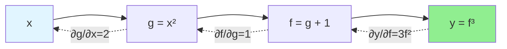

# Backpropagation

## Introduction

Backpropagation is the algorithm that made training deep neural networks practical. Before backpropagation, computing gradients for multi-layer networks was computationally prohibitive. Backpropagation efficiently computes gradients by propagating errors backward through the network using the chain rule of calculus.

The elegance of backpropagation lies in its systematic reuse of computations. Rather than independently computing each partial derivative, backpropagation recursively applies the chain rule, computing gradients layer-by-layer from output to input. This reduces complexity from exponential to linear in network depth.

Understanding backpropagation deeply—both the mathematics and implementation—is essential for debugging neural networks, developing custom architectures, and grasping why deep learning works. While modern frameworks automate gradient computation, knowing backpropagation enables you to understand, troubleshoot, and innovate in deep learning.

## The Chain Rule

### Single Variable

For composed functions $$y = f(g(x))$$:

$$\frac{dy}{dx} = \frac{dy}{dg} \cdot \frac{dg}{dx}$$

**Example:** $$y = (x^2 + 1)^3$$

Let $$g = x^2 + 1$$, then $$y = g^3$$

$$\frac{dy}{dx} = \frac{dy}{dg} \cdot \frac{dg}{dx} = 3g^2 \cdot 2x = 3(x^2 + 1)^2 \cdot 2x$$

### Multiple Variables

For $$z = f(x, y)$$ where $$x = g(t)$$ and $$y = h(t)$$:

$$\frac{dz}{dt} = \frac{\partial z}{\partial x}\frac{dx}{dt} + \frac{\partial z}{\partial y}\frac{dy}{dt}$$

### Computational Graph

**Represents function as directed acyclic graph:**

- Nodes: Operations
- Edges: Data flow

**Forward pass:** Compute outputs

**Backward pass:** Compute gradients using chain rule



## Forward Propagation (Recap)

### Computation

**For each layer $$l = 1, ..., L$$:**

$$z^{[l]} = W^{[l]}a^{[l-1]} + b^{[l]}$$

$$a^{[l]} = g^{[l]}(z^{[l]})$$

**Initial:** $$a^{[0]} = x$$

**Final:** $$\hat{y} = a^{[L]}$$

**Loss:** $$L(\hat{y}, y)$$

### Store Intermediate Values

**Cache** $$z^{[l]}$$ and $$a^{[l]}$$ for backward pass.

**Needed for computing gradients.**

## Backward Propagation

### Goal

**Compute gradients:**

$$\frac{\partial L}{\partial W^{[l]}}, \quad \frac{\partial L}{\partial b^{[l]}}$$

for all layers $$l$$.

### Output Layer Gradient

**Start with loss gradient:**

$$\frac{\partial L}{\partial a^{[L]}}$$

**Example (Binary Cross-Entropy + Sigmoid):**

$$L = -[y\log(a^{[L]}) + (1-y)\log(1-a^{[L]})]$$

$$\frac{\partial L}{\partial a^{[L]}} = -\frac{y}{a^{[L]}} + \frac{1-y}{1-a^{[L]}}$$

**Gradient w.r.t. $$z^{[L]}$$:**

$$\frac{\partial L}{\partial z^{[L]}} = \frac{\partial L}{\partial a^{[L]}} \cdot \frac{\partial a^{[L]}}{\partial z^{[L]}}$$

For sigmoid: $$\frac{\partial a^{[L]}}{\partial z^{[L]}} = a^{[L]}(1 - a^{[L]})$$

**Combining:** $$\frac{\partial L}{\partial z^{[L]}} = a^{[L]} - y$$

(Remarkably simple!)

### Recursive Gradient Computation

**Given $$\frac{\partial L}{\partial z^{[l]}}$$, compute:**

**1. Weight gradient:**

$$\frac{\partial L}{\partial W^{[l]}} = \frac{\partial L}{\partial z^{[l]}} (a^{[l-1]})^T$$

**2. Bias gradient:**

$$\frac{\partial L}{\partial b^{[l]}} = \frac{\partial L}{\partial z^{[l]}}$$

(Sum over batch if using mini-batches)

**3. Previous layer activation gradient:**

$$\frac{\partial L}{\partial a^{[l-1]}} = (W^{[l]})^T \frac{\partial L}{\partial z^{[l]}}$$

**4. Previous layer pre-activation gradient:**

$$\frac{\partial L}{\partial z^{[l-1]}} = \frac{\partial L}{\partial a^{[l-1]}} \odot g'^{[l-1]}(z^{[l-1]})$$

where $$\odot$$ is element-wise multiplication.

### Backpropagation Algorithm

**Forward Pass:**

```
For l = 1 to L:
    z^[l] = W^[l] a^[l-1] + b^[l]
    a^[l] = g^[l](z^[l])
    Store z^[l], a^[l]
```

**Compute Loss:** $$L = L(a^{[L]}, y)$$

**Backward Pass:**

```
dL/da^[L] = gradient of loss w.r.t. output

For l = L down to 1:
    dL/dz^[l] = dL/da^[l] ⊙ g'^[l](z^[l])
    dL/dW^[l] = dL/dz^[l] (a^[l-1])^T
    dL/db^[l] = dL/dz^[l]
    dL/da^[l-1] = (W^[l])^T dL/dz^[l]
```

**Parameter Update:**

```
W^[l] = W^[l] - α dL/dW^[l]
b^[l] = b^[l] - α dL/db^[l]
```

## Detailed Example: 2-Layer Network

### Setup

**Architecture:**
- Input: $$x \in \mathbb{R}^2$$
- Hidden: 3 neurons, ReLU activation
- Output: 1 neuron, sigmoid activation
- Loss: Binary cross-entropy

### Forward Pass

**Layer 1:**

$$z^{[1]} = W^{[1]}x + b^{[1]}$$ (3 × 2) × (2 × 1) + (3 × 1) = (3 × 1)

$$a^{[1]} = \text{ReLU}(z^{[1]})$$

**Layer 2:**

$$z^{[2]} = W^{[2]}a^{[1]} + b^{[2]}$$ (1 × 3) × (3 × 1) + (1 × 1) = (1 × 1)

$$a^{[2]} = \sigma(z^{[2]})$$

**Loss:**

$$L = -[y\log(a^{[2]}) + (1-y)\log(1-a^{[2]})]$$

### Backward Pass

**Output layer:**

$$\frac{\partial L}{\partial z^{[2]}} = a^{[2]} - y$$ (scalar)

$$\frac{\partial L}{\partial W^{[2]}} = \frac{\partial L}{\partial z^{[2]}} (a^{[1]})^T$$ (1 × 3)

$$\frac{\partial L}{\partial b^{[2]}} = \frac{\partial L}{\partial z^{[2]}}$$ (scalar)

**Hidden layer:**

$$\frac{\partial L}{\partial a^{[1]}} = (W^{[2]})^T \frac{\partial L}{\partial z^{[2]}}$$ (3 × 1)

$$\frac{\partial L}{\partial z^{[1]}} = \frac{\partial L}{\partial a^{[1]}} \odot \begin{cases}
1 & \text{if } z^{[1]} > 0 \\
0 & \text{if } z^{[1]} \leq 0
\end{cases}$$

$$\frac{\partial L}{\partial W^{[1]}} = \frac{\partial L}{\partial z^{[1]}} x^T$$ (3 × 2)

$$\frac{\partial L}{\partial b^{[1]}} = \frac{\partial L}{\partial z^{[1]}}$$ (3 × 1)

## Implementation

### NumPy Implementation

```python
import numpy as np

def sigmoid(z):
    return 1 / (1 + np.exp(-z))

def sigmoid_derivative(a):
    return a * (1 - a)

def relu(z):
    return np.maximum(0, z)

def relu_derivative(z):
    return (z > 0).astype(float)

def forward_propagation(X, parameters):
    W1, b1 = parameters['W1'], parameters['b1']
    W2, b2 = parameters['W2'], parameters['b2']

    # Layer 1
    Z1 = np.dot(W1, X) + b1
    A1 = relu(Z1)

    # Layer 2
    Z2 = np.dot(W2, A1) + b2
    A2 = sigmoid(Z2)

    cache = {'Z1': Z1, 'A1': A1, 'Z2': Z2, 'A2': A2}
    return A2, cache

def backward_propagation(X, Y, parameters, cache):
    m = X.shape[1]  # Number of examples
    W1, W2 = parameters['W1'], parameters['W2']
    A1, A2 = cache['A1'], cache['A2']
    Z1 = cache['Z1']

    # Output layer gradients
    dZ2 = A2 - Y
    dW2 = (1/m) * np.dot(dZ2, A1.T)
    db2 = (1/m) * np.sum(dZ2, axis=1, keepdims=True)

    # Hidden layer gradients
    dA1 = np.dot(W2.T, dZ2)
    dZ1 = dA1 * relu_derivative(Z1)
    dW1 = (1/m) * np.dot(dZ1, X.T)
    db1 = (1/m) * np.sum(dZ1, axis=1, keepdims=True)

    gradients = {
        'dW1': dW1, 'db1': db1,
        'dW2': dW2, 'db2': db2
    }

    return gradients

def update_parameters(parameters, gradients, learning_rate):
    parameters['W1'] -= learning_rate * gradients['dW1']
    parameters['b1'] -= learning_rate * gradients['db1']
    parameters['W2'] -= learning_rate * gradients['dW2']
    parameters['b2'] -= learning_rate * gradients['db2']

    return parameters

# Training loop
def train(X, Y, layer_dims, learning_rate=0.01, num_iterations=10000):
    # Initialize parameters
    parameters = initialize_parameters(layer_dims)

    for i in range(num_iterations):
        # Forward propagation
        A2, cache = forward_propagation(X, parameters)

        # Compute cost
        cost = -(1/m) * np.sum(Y * np.log(A2) + (1-Y) * np.log(1-A2))

        # Backward propagation
        gradients = backward_propagation(X, Y, parameters, cache)

        # Update parameters
        parameters = update_parameters(parameters, gradients, learning_rate)

        if i % 1000 == 0:
            print(f'Cost after iteration {i}: {cost:.4f}')

    return parameters
```

### Verification with Gradient Checking

```python
def gradient_check(X, Y, parameters, gradients, epsilon=1e-7):
    """
    Numerical gradient checking to verify backpropagation
    """
    params_vector = dictionary_to_vector(parameters)
    grads_vector = dictionary_to_vector(gradients)

    num_params = params_vector.shape[0]
    gradapprox = np.zeros((num_params, 1))

    for i in range(num_params):
        # Compute J(theta + epsilon)
        theta_plus = np.copy(params_vector)
        theta_plus[i] += epsilon
        params_plus = vector_to_dictionary(theta_plus, layer_dims)
        AL_plus, _ = forward_propagation(X, params_plus)
        J_plus = compute_cost(AL_plus, Y)

        # Compute J(theta - epsilon)
        theta_minus = np.copy(params_vector)
        theta_minus[i] -= epsilon
        params_minus = vector_to_dictionary(theta_minus, layer_dims)
        AL_minus, _ = forward_propagation(X, params_minus)
        J_minus = compute_cost(AL_minus, Y)

        # Compute numerical gradient
        gradapprox[i] = (J_plus - J_minus) / (2 * epsilon)

    # Compare with backpropagation gradient
    numerator = np.linalg.norm(grads_vector - gradapprox)
    denominator = np.linalg.norm(grads_vector) + np.linalg.norm(gradapprox)
    difference = numerator / denominator

    if difference < 1e-7:
        print("✓ Gradient check passed!")
    else:
        print(f"✗ Gradient check failed. Difference: {difference}")

    return difference
```

## Activation Function Derivatives

### Sigmoid

$$g(z) = \frac{1}{1 + e^{-z}}$$

$$g'(z) = g(z)(1 - g(z))$$

**In terms of activation:** $$g'(z) = a(1-a)$$

### Tanh

$$g(z) = \tanh(z) = \frac{e^z - e^{-z}}{e^z + e^{-z}}$$

$$g'(z) = 1 - \tanh^2(z) = 1 - a^2$$

### ReLU

$$g(z) = \max(0, z)$$

$$g'(z) = \begin{cases}
1 & \text{if } z > 0 \\
0 & \text{if } z \leq 0
\end{cases}$$

**Undefined at 0:** Convention uses 0 or 1.

### Leaky ReLU

$$g(z) = \max(0.01z, z)$$

$$g'(z) = \begin{cases}
1 & \text{if } z > 0 \\
0.01 & \text{if } z \leq 0
\end{cases}$$

### Softmax

For output layer with $$K$$ classes:

$$a_i = \frac{e^{z_i}}{\sum_{j=1}^{K}e^{z_j}}$$

**Jacobian (complex):**

$$\frac{\partial a_i}{\partial z_j} = a_i(\delta_{ij} - a_j)$$

where $$\delta_{ij}$$ is Kronecker delta.

**With cross-entropy loss:** Simplifies to $$\frac{\partial L}{\partial z} = a - y$$

## Batch Processing

### Mini-Batch Backpropagation

**Forward:** $$A^{[l]} \in \mathbb{R}^{n^{[l]} \times m}$$ (m examples)

**Backward:** Same dimensions for gradients

**Weight gradient:**

$$\frac{\partial L}{\partial W^{[l]}} = \frac{1}{m}\frac{\partial L}{\partial Z^{[l]}}(A^{[l-1]})^T$$

**Bias gradient:**

$$\frac{\partial L}{\partial b^{[l]}} = \frac{1}{m}\sum_{i=1}^{m}\frac{\partial L}{\partial z^{[l](i)}}$$

Average over batch.

## Computational Complexity

### Time Complexity

**Forward pass:** $$O(W)$$ where $$W$$ is total number of weights

**Backward pass:** $$O(W)$$ (same order as forward)

**Each layer:**
- Matrix multiplication: $$O(n^{[l]} \cdot n^{[l-1]})$$
- Backward also: $$O(n^{[l]} \cdot n^{[l-1]})$$

**Total per iteration:** $$O(W)$$

### Memory Complexity

**Store for each layer:**
- Activations $$a^{[l]}$$
- Pre-activations $$z^{[l]}$$

**Memory:** $$O(\sum_l n^{[l]} \cdot m)$$

where $$m$$ is batch size.

**Trade-off:** Larger batch → more memory → potentially faster

## Common Issues

### Vanishing Gradients

**Problem:** Gradients become very small in early layers.

**Cause:** Repeated multiplication by small values (sigmoid derivatives < 0.25)

**Solutions:**
- Use ReLU instead of sigmoid
- Batch normalization
- Residual connections
- Proper initialization

### Exploding Gradients

**Problem:** Gradients become very large.

**Cause:** Repeated multiplication by large values

**Solutions:**
- Gradient clipping
- Proper initialization
- Batch normalization
- Lower learning rate

### Numerical Stability

**Problem:** Overflow/underflow in exponentials

**Solutions:**
- Subtract max before softmax/sigmoid
- Use log-sum-exp trick
- Use stable implementations

```python
def stable_softmax(z):
    z_max = np.max(z, axis=0, keepdims=True)
    exp_z = np.exp(z - z_max)
    return exp_z / np.sum(exp_z, axis=0, keepdims=True)
```

## Automatic Differentiation

### Modern Frameworks

**PyTorch, TensorFlow:** Automatic gradient computation

**Define forward pass → Gradients computed automatically**

```python
import torch

# Define model
x = torch.tensor([1.0, 2.0], requires_grad=True)
w = torch.tensor([[1.0, 2.0], [3.0, 4.0]], requires_grad=True)
b = torch.tensor([0.5, 0.5], requires_grad=True)

# Forward pass
z = torch.matmul(w, x) + b
a = torch.sigmoid(z)
loss = ((a - torch.tensor([0.0, 1.0]))**2).sum()

# Backward pass (automatic!)
loss.backward()

# Access gradients
print(f'Gradient w.r.t. w: {w.grad}')
print(f'Gradient w.r.t. b: {b.grad}')
```

### How It Works

**Computational graph:** Tracks all operations

**Backward pass:** Automatically applies chain rule

**Benefits:**
- No manual gradient derivation
- Correct gradients guaranteed
- Easy to experiment with architectures

## Practical Tips

### Gradient Checking

**During development:** Verify backpropagation with numerical gradients

**Production:** Disable (too slow)

### Monitor Gradients

```python
# PyTorch example
for name, param in model.named_parameters():
    if param.grad is not None:
        print(f'{name}: mean={param.grad.mean():.4f}, std={param.grad.std():.4f}')
```

**Watch for:**
- Very small gradients (vanishing)
- Very large gradients (exploding)
- NaN or Inf values

### Debugging Backpropagation

**Common errors:**
- Wrong matrix dimensions
- Forgetting to transpose
- Not averaging over batch
- Incorrect activation derivatives

**Debug strategy:**
1. Implement forward pass
2. Test on small example
3. Implement backward pass
4. Gradient check on small example
5. Scale to full network

## Conclusion

Backpropagation is the engine that powers neural network training. By efficiently computing gradients through recursive application of the chain rule, backpropagation makes deep learning practical.

**Key takeaways:**

- **Chain rule:** Foundation of backpropagation
- **Recursive computation:** Gradients flow backward layer-by-layer
- **Computational efficiency:** Linear in network depth
- **Cache activations:** Needed for backward pass
- **Activation derivatives:** Critical for gradient flow
- **Automatic differentiation:** Modern frameworks handle it
- **Gradient checking:** Verify implementation correctness

While modern frameworks automate backpropagation, understanding the algorithm deeply enables you to debug networks, develop custom layers, and grasp why certain architectural choices matter. The interplay between forward and backward passes, activation functions, and gradient flow shapes all of deep learning.

With backpropagation mastered, you can confidently train neural networks and understand how learning actually occurs—through iterative gradient-based optimization of network parameters.