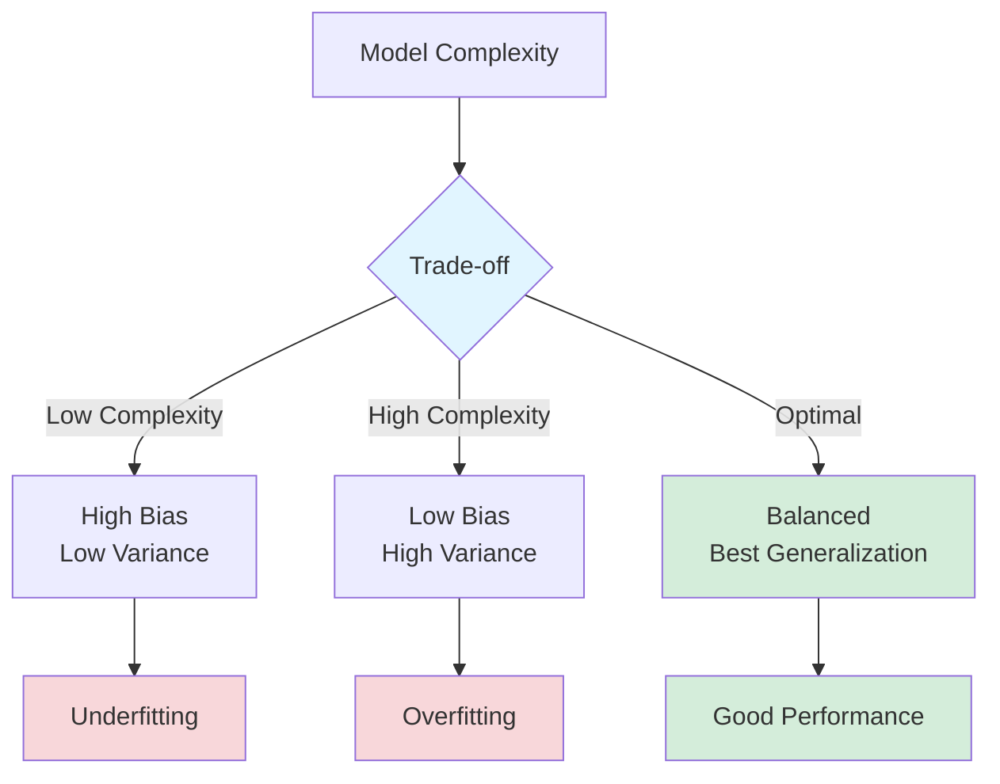
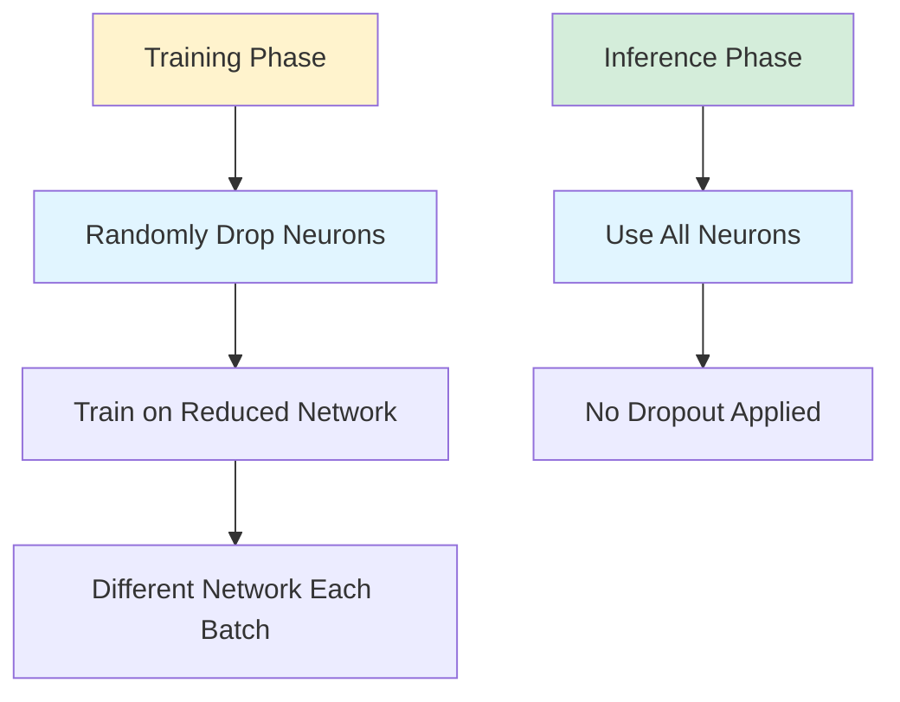
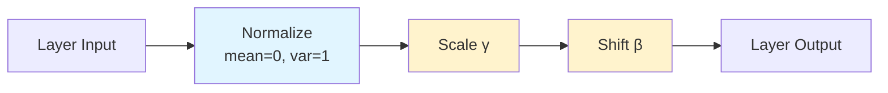
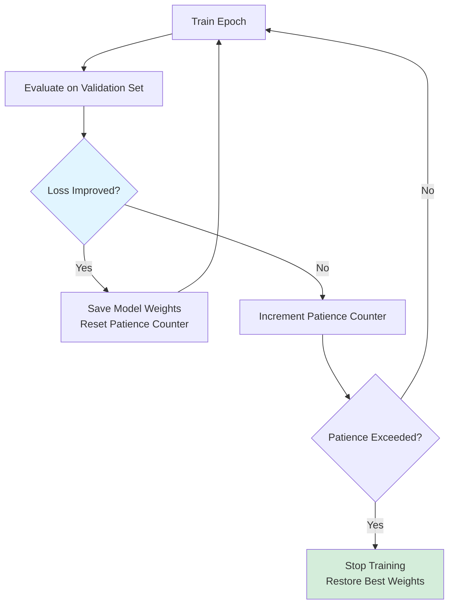

# Regularization in Neural Networks

Regularization techniques are essential tools for preventing overfitting and improving the generalization performance of neural networks. While neural networks are powerful function approximators capable of learning complex patterns, this flexibility makes them prone to memorizing training data rather than learning generalizable features.

Overfitting occurs when a model performs well on training data but poorly on unseen test data. This happens because the model captures noise and spurious patterns specific to the training set. Regularization methods constrain the model's complexity or learning process to encourage simpler, more generalizable solutions.

Understanding and applying appropriate regularization techniques is crucial for building robust neural networks that perform well in production environments.

## The Bias-Variance Tradeoff

The fundamental challenge in machine learning is balancing model complexity with generalization ability.

### Mathematical Framework

The expected test error can be decomposed as:

$$
\mathbb{E}[(y - \hat{f}(x))^2] = \text{Bias}^2 + \text{Variance} + \text{Irreducible Error}
$$

Where:
- **Bias**: Error from incorrect assumptions in the model (underfitting)
- **Variance**: Error from sensitivity to training data fluctuations (overfitting)
- **Irreducible Error**: Noise inherent in the data



### Visualization

```python
import numpy as np
import matplotlib.pyplot as plt
from sklearn.preprocessing import PolynomialFeatures
from sklearn.linear_model import LinearRegression
from sklearn.metrics import mean_squared_error

# Generate synthetic data
np.random.seed(42)
X = np.linspace(0, 10, 50).reshape(-1, 1)
y = 2 * np.sin(X).ravel() + np.random.normal(0, 0.5, X.shape[0])

X_test = np.linspace(0, 10, 200).reshape(-1, 1)
y_test_true = 2 * np.sin(X_test).ravel()

# Train models with different complexities
degrees = [1, 3, 10, 20]
fig, axes = plt.subplots(2, 2, figsize=(14, 10))
axes = axes.ravel()

for idx, degree in enumerate(degrees):
    # Transform features
    poly = PolynomialFeatures(degree=degree)
    X_poly = poly.fit_transform(X)
    X_test_poly = poly.transform(X_test)

    # Train model
    model = LinearRegression()
    model.fit(X_poly, y)

    # Predict
    y_pred = model.predict(X_poly)
    y_test_pred = model.predict(X_test_poly)

    # Calculate errors
    train_error = mean_squared_error(y, y_pred)
    test_error = mean_squared_error(y_test_true, y_test_pred)

    # Plot
    axes[idx].scatter(X, y, alpha=0.6, label='Training data')
    axes[idx].plot(X_test, y_test_true, 'g--', label='True function', linewidth=2)
    axes[idx].plot(X_test, y_test_pred, 'r-', label='Prediction', linewidth=2)
    axes[idx].set_title(f'Degree {degree}\nTrain MSE: {train_error:.3f}, Test MSE: {test_error:.3f}')
    axes[idx].set_xlabel('x')
    axes[idx].set_ylabel('y')
    axes[idx].legend()
    axes[idx].grid(True, alpha=0.3)

    if degree == 1:
        axes[idx].text(0.5, 0.95, 'HIGH BIAS (Underfitting)',
                      transform=axes[idx].transAxes, ha='center', va='top',
                      bbox=dict(boxstyle='round', facecolor='wheat', alpha=0.5))
    elif degree == 20:
        axes[idx].text(0.5, 0.95, 'HIGH VARIANCE (Overfitting)',
                      transform=axes[idx].transAxes, ha='center', va='top',
                      bbox=dict(boxstyle='round', facecolor='salmon', alpha=0.5))
    elif degree == 3:
        axes[idx].text(0.5, 0.95, 'GOOD BALANCE',
                      transform=axes[idx].transAxes, ha='center', va='top',
                      bbox=dict(boxstyle='round', facecolor='lightgreen', alpha=0.5))

plt.tight_layout()
plt.show()
```

## L1 and L2 Regularization (Weight Decay)

Weight regularization adds a penalty term to the loss function to discourage large weight values, promoting simpler models.

### L2 Regularization (Weight Decay)

L2 regularization adds the squared magnitude of weights to the loss:

$$
\mathcal{L}_{\text{regularized}} = \mathcal{L}_{\text{original}} + \frac{\lambda}{2}\sum_{i} w_i^2
$$

where $\lambda$ is the regularization strength.

The gradient becomes:

$$
\frac{\partial \mathcal{L}_{\text{regularized}}}{\partial w_i} = \frac{\partial \mathcal{L}_{\text{original}}}{\partial w_i} + \lambda w_i
$$

Weight update:

$$
w_i \leftarrow w_i - \eta\left(\frac{\partial \mathcal{L}_{\text{original}}}{\partial w_i} + \lambda w_i\right) = (1 - \eta\lambda)w_i - \eta\frac{\partial \mathcal{L}_{\text{original}}}{\partial w_i}
$$

The term $(1 - \eta\lambda)$ causes weights to decay toward zero, hence "weight decay."

### L1 Regularization (Lasso)

L1 regularization adds the absolute value of weights:

$$
\mathcal{L}_{\text{regularized}} = \mathcal{L}_{\text{original}} + \lambda\sum_{i} |w_i|
$$

L1 promotes sparsity by driving some weights exactly to zero, effectively performing feature selection.

### Comparison

| Property | L1 (Lasso) | L2 (Ridge) |
|----------|-----------|-----------|
| Penalty | $\lambda\sum_i \|w_i\|$ | $\frac{\lambda}{2}\sum_i w_i^2$ |
| Sparsity | Produces sparse weights | Shrinks all weights |
| Feature selection | Yes | No |
| Gradient | Non-differentiable at 0 | Smooth everywhere |
| Solution | May have multiple optima | Unique solution |

### Implementation

```python
import torch
import torch.nn as nn
import torch.optim as optim
from torch.utils.data import TensorDataset, DataLoader

# Generate synthetic data
np.random.seed(42)
n_samples = 1000
n_features = 50
n_informative = 10

X = np.random.randn(n_samples, n_features)
# Only first n_informative features are relevant
true_weights = np.zeros(n_features)
true_weights[:n_informative] = np.random.randn(n_informative)
y = X @ true_weights + 0.1 * np.random.randn(n_samples)

# Split data
split = int(0.8 * n_samples)
X_train, X_test = X[:split], X[split:]
y_train, y_test = y[:split], y[split:]

# Convert to PyTorch tensors
X_train_t = torch.FloatTensor(X_train)
y_train_t = torch.FloatTensor(y_train).reshape(-1, 1)
X_test_t = torch.FloatTensor(X_test)
y_test_t = torch.FloatTensor(y_test).reshape(-1, 1)

# Create dataset and dataloader
train_dataset = TensorDataset(X_train_t, y_train_t)
train_loader = DataLoader(train_dataset, batch_size=32, shuffle=True)

# Define model
class LinearModel(nn.Module):
    def __init__(self, input_dim):
        super(LinearModel, self).__init__()
        self.linear = nn.Linear(input_dim, 1)

    def forward(self, x):
        return self.linear(x)

# Training function with L2 regularization (weight decay)
def train_with_l2(weight_decay, epochs=100):
    model = LinearModel(n_features)
    criterion = nn.MSELoss()
    optimizer = optim.Adam(model.parameters(), lr=0.01, weight_decay=weight_decay)

    train_losses = []
    test_losses = []

    for epoch in range(epochs):
        model.train()
        epoch_loss = 0
        for batch_X, batch_y in train_loader:
            optimizer.zero_grad()
            predictions = model(batch_X)
            loss = criterion(predictions, batch_y)
            loss.backward()
            optimizer.step()
            epoch_loss += loss.item()

        train_losses.append(epoch_loss / len(train_loader))

        # Evaluate on test set
        model.eval()
        with torch.no_grad():
            test_pred = model(X_test_t)
            test_loss = criterion(test_pred, y_test_t).item()
            test_losses.append(test_loss)

    return model, train_losses, test_losses

# Train with different L2 regularization strengths
l2_strengths = [0.0, 0.001, 0.01, 0.1]
results = {}

for l2 in l2_strengths:
    print(f"\nTraining with L2 = {l2}")
    model, train_losses, test_losses = train_with_l2(l2, epochs=100)
    results[l2] = {'train': train_losses, 'test': test_losses, 'model': model}

    # Check weight sparsity
    weights = model.linear.weight.data.numpy().flatten()
    n_near_zero = np.sum(np.abs(weights) < 0.01)
    print(f"Weights near zero: {n_near_zero}/{n_features}")
    print(f"Final train loss: {train_losses[-1]:.4f}, test loss: {test_losses[-1]:.4f}")

# Plot results
fig, axes = plt.subplots(1, 2, figsize=(14, 5))

# Loss curves
for l2, data in results.items():
    axes[0].plot(data['train'], label=f'L2={l2} (train)', linestyle='--')
    axes[0].plot(data['test'], label=f'L2={l2} (test)')

axes[0].set_xlabel('Epoch')
axes[0].set_ylabel('Loss')
axes[0].set_title('Effect of L2 Regularization')
axes[0].legend()
axes[0].grid(True, alpha=0.3)

# Weight distributions
for l2, data in results.items():
    weights = data['model'].linear.weight.data.numpy().flatten()
    axes[1].hist(weights, bins=30, alpha=0.5, label=f'L2={l2}')

axes[1].set_xlabel('Weight Value')
axes[1].set_ylabel('Frequency')
axes[1].set_title('Weight Distributions')
axes[1].legend()
axes[1].grid(True, alpha=0.3)

plt.tight_layout()
plt.show()

# L1 Regularization (manual implementation)
def train_with_l1(l1_lambda, epochs=100):
    model = LinearModel(n_features)
    criterion = nn.MSELoss()
    optimizer = optim.Adam(model.parameters(), lr=0.01)

    train_losses = []
    test_losses = []

    for epoch in range(epochs):
        model.train()
        epoch_loss = 0
        for batch_X, batch_y in train_loader:
            optimizer.zero_grad()
            predictions = model(batch_X)
            loss = criterion(predictions, batch_y)

            # Add L1 penalty
            l1_penalty = l1_lambda * torch.sum(torch.abs(model.linear.weight))
            total_loss = loss + l1_penalty

            total_loss.backward()
            optimizer.step()
            epoch_loss += loss.item()

        train_losses.append(epoch_loss / len(train_loader))

        # Evaluate on test set
        model.eval()
        with torch.no_grad():
            test_pred = model(X_test_t)
            test_loss = criterion(test_pred, y_test_t).item()
            test_losses.append(test_loss)

    return model, train_losses, test_losses

# Train with L1
model_l1, train_l1, test_l1 = train_with_l1(l1_lambda=0.01, epochs=100)
weights_l1 = model_l1.linear.weight.data.numpy().flatten()
print(f"\nL1 Regularization:")
print(f"Weights exactly zero: {np.sum(weights_l1 == 0)}/{n_features}")
print(f"Weights near zero (|w| < 0.01): {np.sum(np.abs(weights_l1) < 0.01)}/{n_features}")
```

## Dropout

Dropout is a powerful regularization technique that randomly "drops out" (sets to zero) a fraction of neurons during training, preventing co-adaptation of features.

### How Dropout Works

During training, each neuron is kept with probability $p$ (typically 0.5) and dropped with probability $(1-p)$:

$$
h_i = \begin{cases}
0 & \text{with probability } 1-p \\
\frac{a_i}{p} & \text{with probability } p
\end{cases}
$$

The scaling factor $\frac{1}{p}$ ensures that expected output remains the same.

During inference, all neurons are active (no dropout), but their outputs are implicitly scaled by the keep probability.



### Intuition

Dropout can be viewed as:
1. **Ensemble method**: Training many thinned networks and averaging their predictions
2. **Noise injection**: Adding noise makes the network more robust
3. **Feature independence**: Prevents co-adaptation by forcing features to work independently

### Implementation

```python
import torch
import torch.nn as nn
import torch.nn.functional as F

# Simple dropout example
class DropoutVisualization(nn.Module):
    def __init__(self, input_size, hidden_size, dropout_rate=0.5):
        super(DropoutVisualization, self).__init__()
        self.fc1 = nn.Linear(input_size, hidden_size)
        self.dropout = nn.Dropout(p=dropout_rate)
        self.fc2 = nn.Linear(hidden_size, 1)

    def forward(self, x):
        x = F.relu(self.fc1(x))
        x = self.dropout(x)  # Dropout applied here
        x = self.fc2(x)
        return x

# Demonstrate dropout behavior
model = DropoutVisualization(10, 100, dropout_rate=0.5)
x = torch.randn(1, 10)

print("Training mode (dropout active):")
model.train()
for i in range(3):
    output = model(x)
    # Check which neurons were dropped
    activations = F.relu(model.fc1(x))
    activations_dropped = model.dropout(activations)
    n_active = torch.sum(activations_dropped != 0).item()
    print(f"  Run {i+1}: {n_active}/100 neurons active")

print("\nInference mode (no dropout):")
model.eval()
for i in range(3):
    output = model(x)
    activations = F.relu(model.fc1(x))
    n_active = torch.sum(activations != 0).item()
    print(f"  Run {i+1}: {n_active}/100 neurons active")

# Full training example with dropout
class MLPWithDropout(nn.Module):
    def __init__(self, input_dim, hidden_dims, output_dim, dropout_rate=0.5):
        super(MLPWithDropout, self).__init__()
        layers = []
        prev_dim = input_dim

        for hidden_dim in hidden_dims:
            layers.append(nn.Linear(prev_dim, hidden_dim))
            layers.append(nn.ReLU())
            layers.append(nn.Dropout(dropout_rate))
            prev_dim = hidden_dim

        layers.append(nn.Linear(prev_dim, output_dim))
        self.network = nn.Sequential(*layers)

    def forward(self, x):
        return self.network(x)

# Generate more complex data
from sklearn.datasets import make_classification

X, y = make_classification(n_samples=2000, n_features=20, n_informative=15,
                           n_redundant=5, random_state=42)

X_train, X_test = X[:1600], X[1600:]
y_train, y_test = y[:1600], y[1600:]

X_train_t = torch.FloatTensor(X_train)
y_train_t = torch.FloatTensor(y_train)
X_test_t = torch.FloatTensor(X_test)
y_test_t = torch.FloatTensor(y_test)

train_dataset = TensorDataset(X_train_t, y_train_t)
train_loader = DataLoader(train_dataset, batch_size=32, shuffle=True)

# Train with different dropout rates
def train_with_dropout(dropout_rate, epochs=100):
    model = MLPWithDropout(20, [128, 64, 32], 1, dropout_rate=dropout_rate)
    criterion = nn.BCEWithLogitsLoss()
    optimizer = optim.Adam(model.parameters(), lr=0.001)

    train_losses = []
    test_losses = []
    test_accuracies = []

    for epoch in range(epochs):
        model.train()
        epoch_loss = 0
        for batch_X, batch_y in train_loader:
            optimizer.zero_grad()
            predictions = model(batch_X).squeeze()
            loss = criterion(predictions, batch_y)
            loss.backward()
            optimizer.step()
            epoch_loss += loss.item()

        train_losses.append(epoch_loss / len(train_loader))

        # Evaluate
        model.eval()
        with torch.no_grad():
            test_pred = model(X_test_t).squeeze()
            test_loss = criterion(test_pred, y_test_t).item()
            test_losses.append(test_loss)

            # Calculate accuracy
            test_pred_binary = (torch.sigmoid(test_pred) > 0.5).float()
            accuracy = (test_pred_binary == y_test_t).float().mean().item()
            test_accuracies.append(accuracy)

    return model, train_losses, test_losses, test_accuracies

# Compare different dropout rates
dropout_rates = [0.0, 0.2, 0.5, 0.7]
dropout_results = {}

for rate in dropout_rates:
    print(f"\nTraining with dropout rate = {rate}")
    model, train_loss, test_loss, test_acc = train_with_dropout(rate, epochs=100)
    dropout_results[rate] = {
        'train_loss': train_loss,
        'test_loss': test_loss,
        'test_acc': test_acc
    }
    print(f"Final test accuracy: {test_acc[-1]:.4f}")

# Plot results
fig, axes = plt.subplots(1, 3, figsize=(18, 5))

# Training loss
for rate, data in dropout_results.items():
    axes[0].plot(data['train_loss'], label=f'Dropout={rate}')
axes[0].set_xlabel('Epoch')
axes[0].set_ylabel('Training Loss')
axes[0].set_title('Training Loss vs Dropout Rate')
axes[0].legend()
axes[0].grid(True, alpha=0.3)

# Test loss
for rate, data in dropout_results.items():
    axes[1].plot(data['test_loss'], label=f'Dropout={rate}')
axes[1].set_xlabel('Epoch')
axes[1].set_ylabel('Test Loss')
axes[1].set_title('Test Loss vs Dropout Rate')
axes[1].legend()
axes[1].grid(True, alpha=0.3)

# Test accuracy
for rate, data in dropout_results.items():
    axes[2].plot(data['test_acc'], label=f'Dropout={rate}')
axes[2].set_xlabel('Epoch')
axes[2].set_ylabel('Test Accuracy')
axes[2].set_title('Test Accuracy vs Dropout Rate')
axes[2].legend()
axes[2].grid(True, alpha=0.3)

plt.tight_layout()
plt.show()
```

### Dropout Variants

**Spatial Dropout**: Drops entire feature maps in CNNs instead of individual pixels

```python
import torch.nn as nn

class CNNWithSpatialDropout(nn.Module):
    def __init__(self):
        super(CNNWithSpatialDropout, self).__init__()
        self.conv1 = nn.Conv2d(3, 64, kernel_size=3, padding=1)
        self.spatial_dropout = nn.Dropout2d(p=0.2)  # Drops entire channels
        self.conv2 = nn.Conv2d(64, 128, kernel_size=3, padding=1)

    def forward(self, x):
        x = F.relu(self.conv1(x))
        x = self.spatial_dropout(x)
        x = F.relu(self.conv2(x))
        return x
```

**DropConnect**: Randomly drops weights instead of activations

**Variational Dropout**: Uses the same dropout mask for all time steps in RNNs

## Batch Normalization

Batch normalization normalizes layer inputs across mini-batches, reducing internal covariate shift and acting as a regularizer.

### Algorithm

For a mini-batch $\mathcal{B} = \{x_1, \ldots, x_m\}$:

1. Compute mini-batch mean:
$$
\mu_{\mathcal{B}} = \frac{1}{m}\sum_{i=1}^m x_i
$$

2. Compute mini-batch variance:
$$
\sigma_{\mathcal{B}}^2 = \frac{1}{m}\sum_{i=1}^m (x_i - \mu_{\mathcal{B}})^2
$$

3. Normalize:
$$
\hat{x}_i = \frac{x_i - \mu_{\mathcal{B}}}{\sqrt{\sigma_{\mathcal{B}}^2 + \epsilon}}
$$

4. Scale and shift (learnable parameters $\gamma$, $\beta$):
$$
y_i = \gamma\hat{x}_i + \beta
$$

During inference, use running statistics instead of batch statistics.

### Benefits

1. **Faster training**: Allows higher learning rates
2. **Regularization**: Adds noise through batch statistics
3. **Reduces sensitivity to initialization**: Helps gradient flow
4. **Reduces internal covariate shift**: Stabilizes layer inputs



### Implementation

```python
import torch
import torch.nn as nn
import torch.nn.functional as F

# Manual batch normalization
class BatchNormManual:
    def __init__(self, num_features, eps=1e-5, momentum=0.1):
        self.num_features = num_features
        self.eps = eps
        self.momentum = momentum

        # Learnable parameters
        self.gamma = np.ones(num_features)
        self.beta = np.zeros(num_features)

        # Running statistics (for inference)
        self.running_mean = np.zeros(num_features)
        self.running_var = np.ones(num_features)

    def forward(self, x, training=True):
        if training:
            # Compute batch statistics
            batch_mean = np.mean(x, axis=0)
            batch_var = np.var(x, axis=0)

            # Normalize
            x_norm = (x - batch_mean) / np.sqrt(batch_var + self.eps)

            # Update running statistics
            self.running_mean = (1 - self.momentum) * self.running_mean + \
                               self.momentum * batch_mean
            self.running_var = (1 - self.momentum) * self.running_var + \
                              self.momentum * batch_var
        else:
            # Use running statistics for inference
            x_norm = (x - self.running_mean) / np.sqrt(self.running_var + self.eps)

        # Scale and shift
        out = self.gamma * x_norm + self.beta
        return out

# Test manual implementation
np.random.seed(42)
X = np.random.randn(10, 5)
bn = BatchNormManual(5)

# Training mode
X_normalized_train = bn.forward(X, training=True)
print("Training mode:")
print("Input mean:", np.mean(X, axis=0))
print("Output mean:", np.mean(X_normalized_train, axis=0))
print("Output std:", np.std(X_normalized_train, axis=0))

# Inference mode
X_test = np.random.randn(5, 5)
X_normalized_test = bn.forward(X_test, training=False)
print("\nInference mode:")
print("Uses running statistics (not batch statistics)")

# PyTorch implementation
class MLPWithBatchNorm(nn.Module):
    def __init__(self, input_dim, hidden_dims, output_dim, use_batchnorm=True):
        super(MLPWithBatchNorm, self).__init__()
        layers = []
        prev_dim = input_dim

        for hidden_dim in hidden_dims:
            layers.append(nn.Linear(prev_dim, hidden_dim))
            if use_batchnorm:
                layers.append(nn.BatchNorm1d(hidden_dim))
            layers.append(nn.ReLU())
            prev_dim = hidden_dim

        layers.append(nn.Linear(prev_dim, output_dim))
        self.network = nn.Sequential(*layers)

    def forward(self, x):
        return self.network(x)

# Generate data
from sklearn.datasets import make_moons
X, y = make_moons(n_samples=2000, noise=0.2, random_state=42)
X_train, X_test = X[:1600], X[1600:]
y_train, y_test = y[:1600], y[1600:]

X_train_t = torch.FloatTensor(X_train)
y_train_t = torch.LongTensor(y_train)
X_test_t = torch.FloatTensor(X_test)
y_test_t = torch.LongTensor(y_test)

train_dataset = TensorDataset(X_train_t, y_train_t)
train_loader = DataLoader(train_dataset, batch_size=32, shuffle=True)

# Train with and without batch normalization
def train_with_batchnorm(use_bn, epochs=100):
    model = MLPWithBatchNorm(2, [64, 32, 16], 2, use_batchnorm=use_bn)
    criterion = nn.CrossEntropyLoss()
    optimizer = optim.Adam(model.parameters(), lr=0.001)

    train_losses = []
    test_accuracies = []

    for epoch in range(epochs):
        model.train()
        epoch_loss = 0
        for batch_X, batch_y in train_loader:
            optimizer.zero_grad()
            predictions = model(batch_X)
            loss = criterion(predictions, batch_y)
            loss.backward()
            optimizer.step()
            epoch_loss += loss.item()

        train_losses.append(epoch_loss / len(train_loader))

        # Evaluate
        model.eval()
        with torch.no_grad():
            test_pred = model(X_test_t)
            _, predicted = torch.max(test_pred, 1)
            accuracy = (predicted == y_test_t).float().mean().item()
            test_accuracies.append(accuracy)

    return model, train_losses, test_accuracies

# Compare with and without batch norm
print("Training WITHOUT batch normalization...")
model_no_bn, loss_no_bn, acc_no_bn = train_with_batchnorm(False, epochs=100)

print("Training WITH batch normalization...")
model_with_bn, loss_with_bn, acc_with_bn = train_with_batchnorm(True, epochs=100)

# Plot comparison
fig, axes = plt.subplots(1, 2, figsize=(14, 5))

axes[0].plot(loss_no_bn, label='Without BatchNorm', linewidth=2)
axes[0].plot(loss_with_bn, label='With BatchNorm', linewidth=2)
axes[0].set_xlabel('Epoch')
axes[0].set_ylabel('Training Loss')
axes[0].set_title('Training Loss: Effect of Batch Normalization')
axes[0].legend()
axes[0].grid(True, alpha=0.3)

axes[1].plot(acc_no_bn, label='Without BatchNorm', linewidth=2)
axes[1].plot(acc_with_bn, label='With BatchNorm', linewidth=2)
axes[1].set_xlabel('Epoch')
axes[1].set_ylabel('Test Accuracy')
axes[1].set_title('Test Accuracy: Effect of Batch Normalization')
axes[1].legend()
axes[1].grid(True, alpha=0.3)

plt.tight_layout()
plt.show()

print(f"\nFinal test accuracy without BN: {acc_no_bn[-1]:.4f}")
print(f"Final test accuracy with BN: {acc_with_bn[-1]:.4f}")
```

### Layer Normalization

Layer normalization normalizes across features instead of batch dimension, useful for RNNs and small batches.

$$
\text{LayerNorm}(x) = \gamma \frac{x - \mu}{\sqrt{\sigma^2 + \epsilon}} + \beta
$$

where $\mu$ and $\sigma^2$ are computed across features for each sample.

```python
# Layer Normalization
class MLPWithLayerNorm(nn.Module):
    def __init__(self, input_dim, hidden_dims, output_dim):
        super(MLPWithLayerNorm, self).__init__()
        layers = []
        prev_dim = input_dim

        for hidden_dim in hidden_dims:
            layers.append(nn.Linear(prev_dim, hidden_dim))
            layers.append(nn.LayerNorm(hidden_dim))  # LayerNorm instead of BatchNorm
            layers.append(nn.ReLU())
            prev_dim = hidden_dim

        layers.append(nn.Linear(prev_dim, output_dim))
        self.network = nn.Sequential(*layers)

    def forward(self, x):
        return self.network(x)
```

## Early Stopping

Early stopping halts training when validation performance stops improving, preventing overfitting.

### Algorithm

1. Monitor validation loss after each epoch
2. If validation loss doesn't improve for $n$ epochs (patience), stop training
3. Restore model weights from the best epoch



### Implementation

```python
class EarlyStopping:
    def __init__(self, patience=10, min_delta=0.0, verbose=True):
        """
        Early stopping to stop training when validation loss stops improving.

        Args:
            patience: Number of epochs to wait for improvement
            min_delta: Minimum change to qualify as improvement
            verbose: Print messages
        """
        self.patience = patience
        self.min_delta = min_delta
        self.verbose = verbose
        self.counter = 0
        self.best_loss = None
        self.early_stop = False
        self.best_model_state = None

    def __call__(self, val_loss, model):
        if self.best_loss is None:
            self.best_loss = val_loss
            self.save_checkpoint(model)
        elif val_loss > self.best_loss - self.min_delta:
            self.counter += 1
            if self.verbose:
                print(f'EarlyStopping counter: {self.counter}/{self.patience}')
            if self.counter >= self.patience:
                self.early_stop = True
        else:
            self.best_loss = val_loss
            self.save_checkpoint(model)
            self.counter = 0

    def save_checkpoint(self, model):
        """Save model when validation loss decreases."""
        if self.verbose:
            print(f'Validation loss decreased to {self.best_loss:.6f}. Saving model...')
        self.best_model_state = model.state_dict().copy()

    def load_best_model(self, model):
        """Load the best model state."""
        if self.best_model_state is not None:
            model.load_state_dict(self.best_model_state)

# Training with early stopping
def train_with_early_stopping(patience=10, epochs=200):
    model = MLPWithBatchNorm(2, [64, 32, 16], 2, use_batchnorm=True)
    criterion = nn.CrossEntropyLoss()
    optimizer = optim.Adam(model.parameters(), lr=0.001)
    early_stopping = EarlyStopping(patience=patience, verbose=True)

    train_losses = []
    val_losses = []
    test_accuracies = []

    # Create validation split
    n_val = len(X_train_t) // 5
    X_train_split = X_train_t[:-n_val]
    y_train_split = y_train_t[:-n_val]
    X_val = X_train_t[-n_val:]
    y_val = y_train_t[-n_val:]

    train_dataset_split = TensorDataset(X_train_split, y_train_split)
    train_loader_split = DataLoader(train_dataset_split, batch_size=32, shuffle=True)

    for epoch in range(epochs):
        # Training
        model.train()
        epoch_loss = 0
        for batch_X, batch_y in train_loader_split:
            optimizer.zero_grad()
            predictions = model(batch_X)
            loss = criterion(predictions, batch_y)
            loss.backward()
            optimizer.step()
            epoch_loss += loss.item()

        train_losses.append(epoch_loss / len(train_loader_split))

        # Validation
        model.eval()
        with torch.no_grad():
            val_pred = model(X_val)
            val_loss = criterion(val_pred, y_val).item()
            val_losses.append(val_loss)

            # Test accuracy
            test_pred = model(X_test_t)
            _, predicted = torch.max(test_pred, 1)
            accuracy = (predicted == y_test_t).float().mean().item()
            test_accuracies.append(accuracy)

        if epoch % 10 == 0:
            print(f'Epoch {epoch}: Train Loss = {train_losses[-1]:.4f}, '
                  f'Val Loss = {val_loss:.4f}, Test Acc = {accuracy:.4f}')

        # Early stopping check
        early_stopping(val_loss, model)
        if early_stopping.early_stop:
            print(f'\nEarly stopping triggered at epoch {epoch}')
            break

    # Load best model
    early_stopping.load_best_model(model)

    return model, train_losses, val_losses, test_accuracies, epoch

# Train with early stopping
print("Training with early stopping (patience=10)...")
model_es, train_es, val_es, acc_es, stopped_epoch = train_with_early_stopping(
    patience=10, epochs=200
)

# Plot results
fig, axes = plt.subplots(1, 2, figsize=(14, 5))

axes[0].plot(train_es, label='Training Loss')
axes[0].plot(val_es, label='Validation Loss')
axes[0].axvline(x=stopped_epoch, color='r', linestyle='--',
               label=f'Stopped at epoch {stopped_epoch}')
axes[0].set_xlabel('Epoch')
axes[0].set_ylabel('Loss')
axes[0].set_title('Early Stopping: Loss Curves')
axes[0].legend()
axes[0].grid(True, alpha=0.3)

axes[1].plot(acc_es, label='Test Accuracy')
axes[1].axvline(x=stopped_epoch, color='r', linestyle='--',
               label=f'Stopped at epoch {stopped_epoch}')
axes[1].set_xlabel('Epoch')
axes[1].set_ylabel('Accuracy')
axes[1].set_title('Early Stopping: Test Accuracy')
axes[1].legend()
axes[1].grid(True, alpha=0.3)

plt.tight_layout()
plt.show()
```

## Data Augmentation

Data augmentation artificially increases training data size by applying transformations, especially effective for computer vision.

### Common Techniques

**For Images:**
- Rotation, flipping, translation
- Color jittering (brightness, contrast, saturation)
- Random cropping, scaling
- Cutout, Mixup, CutMix

**For Text:**
- Synonym replacement
- Back-translation
- Random insertion/deletion

**For Audio:**
- Time stretching, pitch shifting
- Adding noise
- Time masking

### Implementation

```python
from torchvision import transforms
from PIL import Image

# Define augmentation pipeline
train_transform = transforms.Compose([
    transforms.RandomHorizontalFlip(p=0.5),
    transforms.RandomRotation(degrees=15),
    transforms.ColorJitter(brightness=0.2, contrast=0.2,
                          saturation=0.2, hue=0.1),
    transforms.RandomResizedCrop(size=224, scale=(0.8, 1.0)),
    transforms.ToTensor(),
    transforms.Normalize(mean=[0.485, 0.456, 0.406],
                        std=[0.229, 0.224, 0.225])
])

# No augmentation for validation/test
val_transform = transforms.Compose([
    transforms.Resize(256),
    transforms.CenterCrop(224),
    transforms.ToTensor(),
    transforms.Normalize(mean=[0.485, 0.456, 0.406],
                        std=[0.229, 0.224, 0.225])
])

# Example usage with PyTorch dataset
from torchvision.datasets import CIFAR10

train_dataset = CIFAR10(root='./data', train=True, download=True,
                        transform=train_transform)
test_dataset = CIFAR10(root='./data', train=False, download=True,
                       transform=val_transform)
```

## Combining Regularization Techniques

In practice, multiple regularization techniques are often used together.

### Best Practices

```python
class RegularizedMLP(nn.Module):
    def __init__(self, input_dim, hidden_dims, output_dim,
                dropout_rate=0.5, use_batchnorm=True):
        super(RegularizedMLP, self).__init__()
        layers = []
        prev_dim = input_dim

        for i, hidden_dim in enumerate(hidden_dims):
            # Linear layer
            layers.append(nn.Linear(prev_dim, hidden_dim))

            # Batch normalization
            if use_batchnorm:
                layers.append(nn.BatchNorm1d(hidden_dim))

            # Activation
            layers.append(nn.ReLU())

            # Dropout (typically not on last hidden layer)
            if i < len(hidden_dims) - 1:
                layers.append(nn.Dropout(dropout_rate))

            prev_dim = hidden_dim

        layers.append(nn.Linear(prev_dim, output_dim))
        self.network = nn.Sequential(*layers)

    def forward(self, x):
        return self.network(x)

# Train with multiple regularization techniques
model = RegularizedMLP(20, [128, 64, 32], 2,
                      dropout_rate=0.5, use_batchnorm=True)
optimizer = optim.AdamW(model.parameters(), lr=0.001,
                       weight_decay=0.01)  # L2 regularization

# Use early stopping
early_stopping = EarlyStopping(patience=15)

# Apply data augmentation (if applicable)
# Use learning rate scheduling
scheduler = torch.optim.lr_scheduler.ReduceLROnPlateau(
    optimizer, mode='min', factor=0.5, patience=5
)
```

### Recommended Combinations

| Architecture | Recommended Regularization |
|--------------|---------------------------|
| MLP/FFN | Dropout + L2 + Early Stopping |
| CNN | Dropout + BatchNorm + Data Augmentation |
| RNN/LSTM | Dropout (input/output) + Gradient Clipping |
| Transformer | Dropout + LayerNorm + Label Smoothing |

## Conclusion

Regularization is essential for training neural networks that generalize well to unseen data. The key is finding the right balance between model capacity and regularization strength.

Key takeaways:
- Start with dropout (0.5) and L2 regularization (0.01)
- Add batch normalization for faster training
- Always use early stopping with validation set
- Apply data augmentation for vision tasks
- Combine multiple techniques for best results
- Monitor train/validation gap to detect overfitting
- Tune regularization strength on validation set

Effective regularization allows you to train larger, more expressive models without sacrificing generalization performance.
