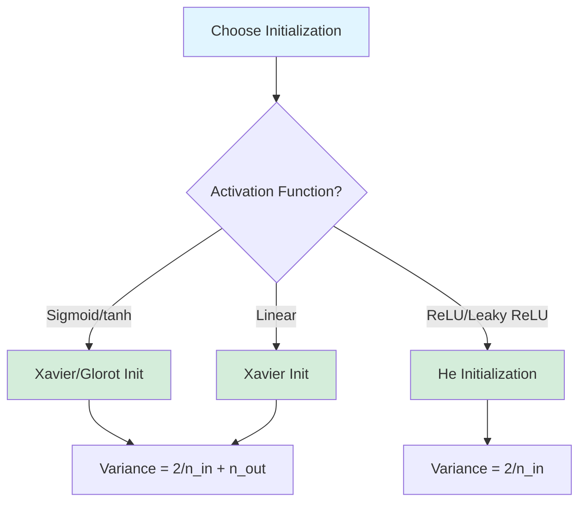
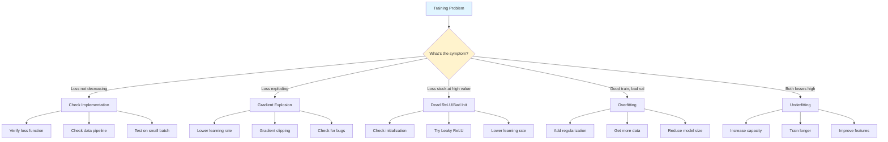
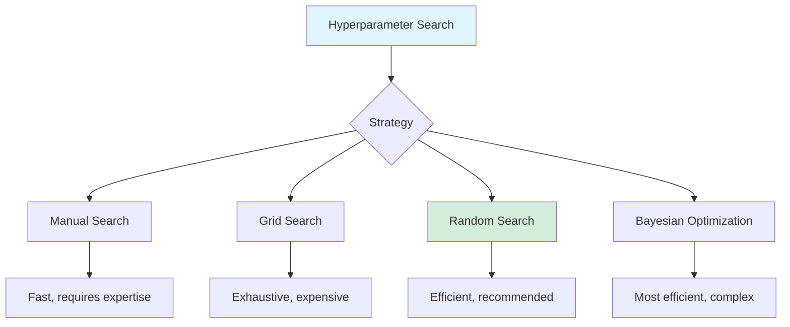

# Practical Training of Neural Networks

Training neural networks is both an art and a science. While theoretical understanding of architectures, loss functions, and optimization algorithms is crucial, practical experience in debugging, hyperparameter tuning, and addressing common training issues is equally important for building effective models.

This guide covers the essential practical aspects of neural network training, from proper initialization and debugging strategies to hyperparameter tuning and handling common problems. These techniques are based on years of collective experience from the machine learning community and are vital for successfully training deep neural networks.

## Weight Initialization

Proper weight initialization is critical for successful training. Poor initialization can lead to vanishing or exploding gradients, slow convergence, or complete training failure.

### The Problem with Bad Initialization

**All zeros**: If all weights are initialized to zero, all neurons compute the same output and receive the same gradient updates, making them redundant.

**Too large**: Large weights lead to large activations, which can cause:
- Saturation in sigmoid/tanh (gradients near zero)
- Exploding gradients
- Numerical instability

**Too small**: Small weights lead to small activations and gradients, causing:
- Vanishing gradients
- Slow learning
- Information loss

### Xavier/Glorot Initialization

Designed for layers with sigmoid or tanh activation, Xavier initialization maintains variance across layers.

For a layer with $n_{in}$ input neurons and $n_{out}$ output neurons:

$$
W \sim \mathcal{U}\left(-\sqrt{\frac{6}{n_{in} + n_{out}}}, \sqrt{\frac{6}{n_{in} + n_{out}}}\right)
$$

Or from a normal distribution:

$$
W \sim \mathcal{N}\left(0, \sqrt{\frac{2}{n_{in} + n_{out}}}\right)
$$

### He Initialization

Designed specifically for ReLU activations, accounting for the fact that ReLU zeroes out half the neurons:

$$
W \sim \mathcal{N}\left(0, \sqrt{\frac{2}{n_{in}}}\right)
$$

The extra factor compensates for the variance reduction caused by ReLU.



### Implementation and Comparison

```python
import numpy as np
import matplotlib.pyplot as plt
import torch
import torch.nn as nn
import torch.nn.init as init

# Demonstrate effect of different initializations
def test_initialization(init_method, num_layers=50, layer_size=100):
    """
    Test how activations propagate through a deep network with different initializations.
    """
    x = np.random.randn(1000, layer_size)  # Input batch

    activations = [x]
    weights = []

    for layer in range(num_layers):
        if init_method == 'zeros':
            W = np.zeros((layer_size, layer_size))
        elif init_method == 'small':
            W = 0.01 * np.random.randn(layer_size, layer_size)
        elif init_method == 'large':
            W = 1.0 * np.random.randn(layer_size, layer_size)
        elif init_method == 'xavier':
            std = np.sqrt(2.0 / (layer_size + layer_size))
            W = np.random.randn(layer_size, layer_size) * std
        elif init_method == 'he':
            std = np.sqrt(2.0 / layer_size)
            W = np.random.randn(layer_size, layer_size) * std
        else:
            raise ValueError(f"Unknown init method: {init_method}")

        weights.append(W)

        # Forward pass with ReLU
        x = x @ W
        x = np.maximum(0, x)  # ReLU
        activations.append(x)

    return activations, weights

# Test different initialization methods
init_methods = ['small', 'large', 'xavier', 'he']
results = {}

for method in init_methods:
    print(f"\nTesting {method} initialization...")
    activations, weights = test_initialization(method)
    results[method] = activations

# Visualize activation statistics
fig, axes = plt.subplots(2, 2, figsize=(14, 10))
axes = axes.ravel()

for idx, method in enumerate(init_methods):
    activations = results[method]

    # Compute mean and std for each layer
    means = [np.mean(act) for act in activations]
    stds = [np.std(act) for act in activations]

    axes[idx].plot(means, label='Mean', linewidth=2)
    axes[idx].plot(stds, label='Std Dev', linewidth=2)
    axes[idx].set_xlabel('Layer')
    axes[idx].set_ylabel('Value')
    axes[idx].set_title(f'{method.capitalize()} Initialization')
    axes[idx].legend()
    axes[idx].grid(True, alpha=0.3)

    # Add warning text for bad initializations
    if method in ['small', 'large']:
        color = 'red' if method == 'large' else 'orange'
        axes[idx].text(0.5, 0.95, 'WARNING: Unstable',
                      transform=axes[idx].transAxes,
                      ha='center', va='top',
                      bbox=dict(boxstyle='round', facecolor=color, alpha=0.3))
    else:
        axes[idx].text(0.5, 0.95, 'Good: Stable propagation',
                      transform=axes[idx].transAxes,
                      ha='center', va='top',
                      bbox=dict(boxstyle='round', facecolor='lightgreen', alpha=0.5))

plt.tight_layout()
plt.show()

# PyTorch initialization
class InitializedNetwork(nn.Module):
    def __init__(self, input_dim, hidden_dims, output_dim, init_method='he'):
        super(InitializedNetwork, self).__init__()
        self.layers = nn.ModuleList()

        prev_dim = input_dim
        for hidden_dim in hidden_dims:
            layer = nn.Linear(prev_dim, hidden_dim)

            # Apply initialization
            if init_method == 'xavier':
                init.xavier_uniform_(layer.weight)
            elif init_method == 'xavier_normal':
                init.xavier_normal_(layer.weight)
            elif init_method == 'he':
                init.kaiming_uniform_(layer.weight, nonlinearity='relu')
            elif init_method == 'he_normal':
                init.kaiming_normal_(layer.weight, nonlinearity='relu')
            elif init_method == 'orthogonal':
                init.orthogonal_(layer.weight)

            init.zeros_(layer.bias)  # Biases typically initialized to zero

            self.layers.append(layer)
            prev_dim = hidden_dim

        self.output_layer = nn.Linear(prev_dim, output_dim)
        init.xavier_uniform_(self.output_layer.weight)
        init.zeros_(self.output_layer.bias)

    def forward(self, x):
        for layer in self.layers:
            x = torch.relu(layer(x))
        x = self.output_layer(x)
        return x

# Test different PyTorch initializations
X_train = torch.randn(1000, 20)
y_train = torch.randint(0, 2, (1000,))

init_methods_torch = ['xavier', 'xavier_normal', 'he', 'he_normal']

for method in init_methods_torch:
    model = InitializedNetwork(20, [128, 64, 32], 2, init_method=method)
    print(f"\n{method} initialization:")
    print(f"  First layer weight std: {model.layers[0].weight.std().item():.4f}")
    print(f"  Expected std (He): {np.sqrt(2.0/20):.4f}")
    print(f"  Expected std (Xavier): {np.sqrt(2.0/40):.4f}")
```

## Monitoring Training

Effective monitoring is crucial for diagnosing problems and understanding training dynamics.

### Key Metrics to Track

1. **Training and validation loss**: Primary indicators of learning
2. **Training and validation accuracy**: Task-specific performance
3. **Learning rate**: Track if using scheduling
4. **Gradient norms**: Detect vanishing/exploding gradients
5. **Weight norms**: Monitor weight magnitudes
6. **Activation statistics**: Check for dead neurons

### Implementation

```python
import torch
import torch.nn as nn
import torch.optim as optim
from torch.utils.data import TensorDataset, DataLoader
from collections import defaultdict

class TrainingMonitor:
    """
    Monitor and log training metrics.
    """
    def __init__(self):
        self.history = defaultdict(list)

    def log(self, metrics):
        """Log metrics for current epoch."""
        for key, value in metrics.items():
            self.history[key].append(value)

    def plot(self, figsize=(15, 10)):
        """Plot training history."""
        metrics = list(self.history.keys())
        n_metrics = len(metrics)
        n_cols = 3
        n_rows = (n_metrics + n_cols - 1) // n_cols

        fig, axes = plt.subplots(n_rows, n_cols, figsize=figsize)
        axes = axes.ravel() if n_rows > 1 else [axes]

        for idx, metric in enumerate(metrics):
            if idx < len(axes):
                axes[idx].plot(self.history[metric], linewidth=2)
                axes[idx].set_xlabel('Epoch')
                axes[idx].set_ylabel(metric)
                axes[idx].set_title(metric.replace('_', ' ').title())
                axes[idx].grid(True, alpha=0.3)

        # Hide unused subplots
        for idx in range(len(metrics), len(axes)):
            axes[idx].axis('off')

        plt.tight_layout()
        plt.show()

    def get_summary(self):
        """Get summary of recent training."""
        summary = {}
        for key, values in self.history.items():
            if values:
                summary[f'{key}_latest'] = values[-1]
                summary[f'{key}_best'] = min(values) if 'loss' in key else max(values)
        return summary

def compute_gradient_norm(model):
    """Compute total gradient norm."""
    total_norm = 0.0
    for p in model.parameters():
        if p.grad is not None:
            param_norm = p.grad.data.norm(2)
            total_norm += param_norm.item() ** 2
    total_norm = total_norm ** 0.5
    return total_norm

def compute_weight_norm(model):
    """Compute total weight norm."""
    total_norm = 0.0
    for p in model.parameters():
        param_norm = p.data.norm(2)
        total_norm += param_norm.item() ** 2
    total_norm = total_norm ** 0.5
    return total_norm

def check_dead_neurons(model, dataloader):
    """Check for dead ReLU neurons (always output 0)."""
    activations = defaultdict(list)

    def hook_fn(module, input, output):
        # Check if any neurons are always inactive
        if isinstance(module, nn.ReLU):
            activations[id(module)].append((output == 0).float().mean().item())

    hooks = []
    for module in model.modules():
        if isinstance(module, nn.ReLU):
            hooks.append(module.register_forward_hook(hook_fn))

    model.eval()
    with torch.no_grad():
        for batch_X, _ in dataloader:
            model(batch_X)
            break  # Just one batch for checking

    for hook in hooks:
        hook.remove()

    # Calculate average dead neuron percentage
    dead_percentages = []
    for acts in activations.values():
        dead_percentages.append(np.mean(acts))

    return np.mean(dead_percentages) if dead_percentages else 0.0

# Training function with comprehensive monitoring
def train_with_monitoring(model, train_loader, val_loader, epochs=100):
    criterion = nn.CrossEntropyLoss()
    optimizer = optim.Adam(model.parameters(), lr=0.001)
    monitor = TrainingMonitor()

    for epoch in range(epochs):
        # Training phase
        model.train()
        train_loss = 0.0
        train_correct = 0
        train_total = 0

        for batch_X, batch_y in train_loader:
            optimizer.zero_grad()
            outputs = model(batch_X)
            loss = criterion(outputs, batch_y)
            loss.backward()

            # Compute gradient norm before clipping/optimizer step
            grad_norm = compute_gradient_norm(model)

            optimizer.step()

            train_loss += loss.item()
            _, predicted = torch.max(outputs, 1)
            train_total += batch_y.size(0)
            train_correct += (predicted == batch_y).sum().item()

        # Validation phase
        model.eval()
        val_loss = 0.0
        val_correct = 0
        val_total = 0

        with torch.no_grad():
            for batch_X, batch_y in val_loader:
                outputs = model(batch_X)
                loss = criterion(outputs, batch_y)
                val_loss += loss.item()
                _, predicted = torch.max(outputs, 1)
                val_total += batch_y.size(0)
                val_correct += (predicted == batch_y).sum().item()

        # Compute additional metrics
        weight_norm = compute_weight_norm(model)
        dead_neurons_pct = check_dead_neurons(model, train_loader)

        # Log metrics
        metrics = {
            'train_loss': train_loss / len(train_loader),
            'val_loss': val_loss / len(val_loader),
            'train_accuracy': train_correct / train_total,
            'val_accuracy': val_correct / val_total,
            'gradient_norm': grad_norm,
            'weight_norm': weight_norm,
            'dead_neurons_pct': dead_neurons_pct,
            'learning_rate': optimizer.param_groups[0]['lr']
        }
        monitor.log(metrics)

        if epoch % 10 == 0:
            print(f"Epoch {epoch}:")
            print(f"  Train Loss: {metrics['train_loss']:.4f}, "
                  f"Val Loss: {metrics['val_loss']:.4f}")
            print(f"  Train Acc: {metrics['train_accuracy']:.4f}, "
                  f"Val Acc: {metrics['val_accuracy']:.4f}")
            print(f"  Grad Norm: {metrics['gradient_norm']:.4f}, "
                  f"Weight Norm: {metrics['weight_norm']:.4f}")
            print(f"  Dead Neurons: {metrics['dead_neurons_pct']*100:.1f}%")

    return model, monitor

# Generate sample data
from sklearn.datasets import make_classification

X, y = make_classification(n_samples=2000, n_features=20, n_informative=15,
                           n_redundant=5, n_classes=3, random_state=42)

# Split data
X_train, X_val = X[:1600], X[1600:]
y_train, y_val = y[:1600], y[1600:]

X_train_t = torch.FloatTensor(X_train)
y_train_t = torch.LongTensor(y_train)
X_val_t = torch.FloatTensor(X_val)
y_val_t = torch.LongTensor(y_val)

train_dataset = TensorDataset(X_train_t, y_train_t)
val_dataset = TensorDataset(X_val_t, y_val_t)

train_loader = DataLoader(train_dataset, batch_size=32, shuffle=True)
val_loader = DataLoader(val_dataset, batch_size=32)

# Train and monitor
model = InitializedNetwork(20, [128, 64, 32], 3, init_method='he')
model, monitor = train_with_monitoring(model, train_loader, val_loader, epochs=50)

# Plot training history
monitor.plot()

# Print summary
print("\nTraining Summary:")
print("="*50)
for key, value in monitor.get_summary().items():
    print(f"{key}: {value:.4f}")
```

## Debugging Neural Networks

Debugging neural networks requires systematic approaches to identify and fix issues.

### Common Problems and Solutions



### Debugging Checklist

```python
def debug_neural_network(model, train_loader, verbose=True):
    """
    Comprehensive debugging checks for neural networks.
    """
    print("=" * 60)
    print("NEURAL NETWORK DEBUGGING CHECKLIST")
    print("=" * 60)

    # 1. Check model architecture
    print("\n1. MODEL ARCHITECTURE")
    print("-" * 60)
    total_params = sum(p.numel() for p in model.parameters())
    trainable_params = sum(p.numel() for p in model.parameters() if p.requires_grad)
    print(f"Total parameters: {total_params:,}")
    print(f"Trainable parameters: {trainable_params:,}")

    # 2. Check forward pass
    print("\n2. FORWARD PASS")
    print("-" * 60)
    try:
        model.eval()
        batch_X, batch_y = next(iter(train_loader))
        with torch.no_grad():
            output = model(batch_X)
        print(f"✓ Forward pass successful")
        print(f"  Input shape: {batch_X.shape}")
        print(f"  Output shape: {output.shape}")
        print(f"  Output range: [{output.min().item():.4f}, {output.max().item():.4f}]")

        # Check for NaN/Inf
        if torch.isnan(output).any():
            print("✗ WARNING: Output contains NaN!")
        elif torch.isinf(output).any():
            print("✗ WARNING: Output contains Inf!")
        else:
            print("✓ No NaN/Inf in outputs")

    except Exception as e:
        print(f"✗ Forward pass failed: {str(e)}")
        return

    # 3. Check backward pass
    print("\n3. BACKWARD PASS")
    print("-" * 60)
    try:
        model.train()
        batch_X, batch_y = next(iter(train_loader))
        optimizer = optim.SGD(model.parameters(), lr=0.01)

        optimizer.zero_grad()
        output = model(batch_X)
        loss = nn.CrossEntropyLoss()(output, batch_y)
        loss.backward()

        print(f"✓ Backward pass successful")
        print(f"  Loss: {loss.item():.4f}")

        # Check gradients
        grad_norms = []
        for name, param in model.named_parameters():
            if param.grad is not None:
                grad_norm = param.grad.norm().item()
                grad_norms.append(grad_norm)
                if verbose:
                    print(f"  {name}: grad norm = {grad_norm:.6f}")

                # Check for NaN/Inf in gradients
                if torch.isnan(param.grad).any():
                    print(f"  ✗ WARNING: NaN in gradient of {name}")
                elif torch.isinf(param.grad).any():
                    print(f"  ✗ WARNING: Inf in gradient of {name}")

        if grad_norms:
            avg_grad_norm = np.mean(grad_norms)
            print(f"\n  Average gradient norm: {avg_grad_norm:.6f}")

            if avg_grad_norm < 1e-7:
                print("  ✗ WARNING: Gradients very small (vanishing gradients?)")
            elif avg_grad_norm > 1e3:
                print("  ✗ WARNING: Gradients very large (exploding gradients?)")
            else:
                print("  ✓ Gradient magnitudes reasonable")

    except Exception as e:
        print(f"✗ Backward pass failed: {str(e)}")
        return

    # 4. Check weight updates
    print("\n4. WEIGHT UPDATES")
    print("-" * 60)
    try:
        # Save initial weights
        initial_weights = {name: param.clone()
                          for name, param in model.named_parameters()}

        # Perform one optimization step
        optimizer.step()

        # Check which weights changed
        updated_count = 0
        for name, param in model.named_parameters():
            if not torch.equal(param, initial_weights[name]):
                updated_count += 1

        print(f"✓ {updated_count}/{len(list(model.parameters()))} "
              f"parameter groups updated")

        if updated_count == 0:
            print("  ✗ WARNING: No weights were updated!")

    except Exception as e:
        print(f"✗ Weight update failed: {str(e)}")

    # 5. Overfit single batch (sanity check)
    print("\n5. OVERFIT SINGLE BATCH (Sanity Check)")
    print("-" * 60)
    try:
        model = type(model)(20, [128, 64, 32], 3, init_method='he')  # Fresh model
        optimizer = optim.Adam(model.parameters(), lr=0.001)
        criterion = nn.CrossEntropyLoss()

        batch_X, batch_y = next(iter(train_loader))

        initial_loss = None
        for step in range(100):
            optimizer.zero_grad()
            output = model(batch_X)
            loss = criterion(output, batch_y)
            loss.backward()
            optimizer.step()

            if step == 0:
                initial_loss = loss.item()

            if step % 20 == 0:
                print(f"  Step {step}: Loss = {loss.item():.4f}")

        final_loss = loss.item()
        print(f"\n  Initial loss: {initial_loss:.4f}")
        print(f"  Final loss: {final_loss:.4f}")
        print(f"  Reduction: {((initial_loss - final_loss) / initial_loss * 100):.1f}%")

        if final_loss < 0.1:
            print("  ✓ Successfully overfitted single batch")
        else:
            print("  ✗ WARNING: Failed to overfit single batch - "
                  "model may have fundamental issues")

    except Exception as e:
        print(f"✗ Single batch overfit test failed: {str(e)}")

    print("\n" + "=" * 60)
    print("DEBUGGING COMPLETE")
    print("=" * 60)

# Run debugging
model_debug = InitializedNetwork(20, [128, 64, 32], 3, init_method='he')
debug_neural_network(model_debug, train_loader, verbose=False)
```

### Gradient Clipping

Gradient clipping prevents exploding gradients by limiting gradient magnitude.

```python
def train_with_gradient_clipping(model, train_loader, clip_value=1.0, epochs=50):
    """
    Train with gradient clipping.
    """
    criterion = nn.CrossEntropyLoss()
    optimizer = optim.Adam(model.parameters(), lr=0.001)

    grad_norms_before = []
    grad_norms_after = []

    for epoch in range(epochs):
        model.train()
        for batch_X, batch_y in train_loader:
            optimizer.zero_grad()
            outputs = model(batch_X)
            loss = criterion(outputs, batch_y)
            loss.backward()

            # Record gradient norm before clipping
            grad_norm_before = compute_gradient_norm(model)
            grad_norms_before.append(grad_norm_before)

            # Clip gradients
            torch.nn.utils.clip_grad_norm_(model.parameters(), clip_value)

            # Record gradient norm after clipping
            grad_norm_after = compute_gradient_norm(model)
            grad_norms_after.append(grad_norm_after)

            optimizer.step()

        if epoch % 10 == 0:
            print(f"Epoch {epoch}: Avg grad norm before clip: "
                  f"{np.mean(grad_norms_before[-len(train_loader):]):.4f}")

    # Plot gradient norms
    plt.figure(figsize=(12, 4))
    plt.plot(grad_norms_before, alpha=0.5, label='Before clipping')
    plt.plot(grad_norms_after, alpha=0.5, label='After clipping')
    plt.axhline(y=clip_value, color='r', linestyle='--',
               label=f'Clip value = {clip_value}')
    plt.xlabel('Iteration')
    plt.ylabel('Gradient Norm')
    plt.title('Effect of Gradient Clipping')
    plt.legend()
    plt.grid(True, alpha=0.3)
    plt.yscale('log')
    plt.show()

    return model

# Train with gradient clipping
model_clip = InitializedNetwork(20, [128, 64, 32], 3, init_method='he')
model_clip = train_with_gradient_clipping(model_clip, train_loader,
                                         clip_value=1.0, epochs=30)
```

## Hyperparameter Tuning

Systematic hyperparameter search is essential for optimal performance.

### Key Hyperparameters

| Hyperparameter | Typical Range | Impact |
|----------------|---------------|--------|
| Learning rate | 1e-4 to 1e-1 | High |
| Batch size | 16 to 512 | Medium |
| Network depth | 2 to 10 layers | High |
| Network width | 32 to 1024 neurons | Medium |
| Dropout rate | 0.0 to 0.7 | Medium |
| Weight decay (L2) | 1e-5 to 1e-2 | Medium |
| Optimizer | SGD, Adam, AdamW | Medium |

### Search Strategies



### Random Search Implementation

```python
import itertools
from sklearn.model_selection import ParameterSampler

def random_search(param_distributions, n_iter=20):
    """
    Perform random hyperparameter search.

    Args:
        param_distributions: Dictionary of parameter distributions
        n_iter: Number of random configurations to try

    Returns:
        Best parameters and results
    """
    results = []

    # Generate random parameter combinations
    param_list = list(ParameterSampler(param_distributions, n_iter=n_iter,
                                      random_state=42))

    for idx, params in enumerate(param_list):
        print(f"\n{'='*60}")
        print(f"Configuration {idx+1}/{n_iter}")
        print(f"{'='*60}")
        print(f"Parameters: {params}")

        try:
            # Create model with current hyperparameters
            model = InitializedNetwork(
                20,
                [params['hidden_size']] * params['num_layers'],
                3,
                init_method='he'
            )

            # Add dropout
            class ModelWithDropout(nn.Module):
                def __init__(self, base_model, dropout_rate):
                    super(ModelWithDropout, self).__init__()
                    self.layers = base_model.layers
                    self.output_layer = base_model.output_layer
                    self.dropout = nn.Dropout(dropout_rate)

                def forward(self, x):
                    for layer in self.layers:
                        x = torch.relu(layer(x))
                        x = self.dropout(x)
                    x = self.output_layer(x)
                    return x

            model = ModelWithDropout(model, params['dropout_rate'])

            # Setup optimizer
            if params['optimizer'] == 'adam':
                optimizer = optim.Adam(model.parameters(),
                                      lr=params['learning_rate'],
                                      weight_decay=params['weight_decay'])
            else:
                optimizer = optim.SGD(model.parameters(),
                                     lr=params['learning_rate'],
                                     momentum=0.9,
                                     weight_decay=params['weight_decay'])

            # Train
            criterion = nn.CrossEntropyLoss()
            best_val_acc = 0.0

            for epoch in range(30):  # Short training for search
                model.train()
                for batch_X, batch_y in train_loader:
                    optimizer.zero_grad()
                    outputs = model(batch_X)
                    loss = criterion(outputs, batch_y)
                    loss.backward()
                    optimizer.step()

                # Validate
                if epoch % 5 == 0:
                    model.eval()
                    val_correct = 0
                    val_total = 0
                    with torch.no_grad():
                        for batch_X, batch_y in val_loader:
                            outputs = model(batch_X)
                            _, predicted = torch.max(outputs, 1)
                            val_total += batch_y.size(0)
                            val_correct += (predicted == batch_y).sum().item()

                    val_acc = val_correct / val_total
                    best_val_acc = max(best_val_acc, val_acc)

            print(f"Best validation accuracy: {best_val_acc:.4f}")

            results.append({
                'params': params,
                'val_accuracy': best_val_acc
            })

        except Exception as e:
            print(f"Configuration failed: {str(e)}")
            results.append({
                'params': params,
                'val_accuracy': 0.0,
                'error': str(e)
            })

    # Sort by validation accuracy
    results.sort(key=lambda x: x['val_accuracy'], reverse=True)

    print(f"\n{'='*60}")
    print("TOP 5 CONFIGURATIONS")
    print(f"{'='*60}")
    for idx, result in enumerate(results[:5]):
        print(f"\n{idx+1}. Validation Accuracy: {result['val_accuracy']:.4f}")
        print(f"   Parameters: {result['params']}")

    return results

# Define search space
param_distributions = {
    'learning_rate': [1e-4, 5e-4, 1e-3, 5e-3, 1e-2],
    'batch_size': [16, 32, 64, 128],
    'hidden_size': [32, 64, 128, 256],
    'num_layers': [2, 3, 4],
    'dropout_rate': [0.0, 0.2, 0.3, 0.5],
    'weight_decay': [0.0, 1e-5, 1e-4, 1e-3],
    'optimizer': ['adam', 'sgd']
}

# Run random search
search_results = random_search(param_distributions, n_iter=10)
```

### Learning Rate Finder

The learning rate finder helps identify optimal learning rate ranges.

```python
def find_learning_rate(model, train_loader, init_lr=1e-7, final_lr=1.0,
                      beta=0.98):
    """
    Find optimal learning rate using the learning rate range test.

    Reference: Smith, 2017 (Cyclical Learning Rates)
    """
    num_iterations = len(train_loader)
    mult = (final_lr / init_lr) ** (1 / num_iterations)
    lr = init_lr

    optimizer = optim.Adam(model.parameters(), lr=lr)
    criterion = nn.CrossEntropyLoss()

    avg_loss = 0.0
    best_loss = float('inf')
    lrs = []
    losses = []

    model.train()
    for i, (batch_X, batch_y) in enumerate(train_loader):
        # Forward pass
        optimizer.zero_grad()
        outputs = model(batch_X)
        loss = criterion(outputs, batch_y)

        # Compute smoothed loss
        avg_loss = beta * avg_loss + (1 - beta) * loss.item()
        smoothed_loss = avg_loss / (1 - beta ** (i + 1))

        # Check if loss is exploding
        if i > 0 and smoothed_loss > 4 * best_loss:
            print(f"Stopping early at iteration {i}")
            break

        # Record best loss
        if smoothed_loss < best_loss:
            best_loss = smoothed_loss

        # Store values
        lrs.append(lr)
        losses.append(smoothed_loss)

        # Backward pass
        loss.backward()
        optimizer.step()

        # Update learning rate
        lr *= mult
        for param_group in optimizer.param_groups:
            param_group['lr'] = lr

        if i % 10 == 0:
            print(f"LR: {lr:.6f}, Loss: {smoothed_loss:.4f}")

    # Plot results
    plt.figure(figsize=(10, 5))
    plt.plot(lrs, losses, linewidth=2)
    plt.xscale('log')
    plt.xlabel('Learning Rate (log scale)')
    plt.ylabel('Loss')
    plt.title('Learning Rate Finder')
    plt.grid(True, alpha=0.3)

    # Find optimal learning rate (steepest descent)
    if len(losses) > 10:
        gradients = np.gradient(losses)
        optimal_idx = np.argmin(gradients)
        optimal_lr = lrs[optimal_idx]

        plt.axvline(x=optimal_lr, color='r', linestyle='--',
                   label=f'Suggested LR: {optimal_lr:.6f}')
        plt.legend()

        print(f"\nSuggested learning rate: {optimal_lr:.6f}")
        print("Consider using a learning rate between "
              f"{optimal_lr/10:.6f} and {optimal_lr:.6f}")

    plt.show()

    return lrs, losses

# Run learning rate finder
model_lr = InitializedNetwork(20, [128, 64, 32], 3, init_method='he')
lrs, losses = find_learning_rate(model_lr, train_loader)
```

## Best Practices Summary

### Training Checklist

```python
def training_best_practices_checklist():
    """
    Comprehensive checklist for neural network training.
    """
    checklist = """
    NEURAL NETWORK TRAINING BEST PRACTICES CHECKLIST
    ================================================

    DATA PREPARATION
    ☐ Normalize/standardize input features
    ☐ Split data into train/val/test sets (typically 70/15/15)
    ☐ Check for class imbalance
    ☐ Visualize sample data
    ☐ Verify data pipeline (no data leakage)

    MODEL ARCHITECTURE
    ☐ Start with simple architecture
    ☐ Use appropriate activation functions (ReLU for hidden, softmax/sigmoid for output)
    ☐ Initialize weights properly (He for ReLU, Xavier for tanh)
    ☐ Match output layer to task (softmax for classification, linear for regression)

    OPTIMIZATION
    ☐ Start with Adam optimizer (lr=0.001)
    ☐ Use mini-batch gradient descent (batch size 32-128)
    ☐ Consider learning rate scheduling
    ☐ Apply gradient clipping if needed (clip_norm=1.0)

    REGULARIZATION
    ☐ Add dropout (0.5) to hidden layers
    ☐ Use L2 regularization (weight_decay=0.01)
    ☐ Apply batch normalization between layers
    ☐ Implement early stopping (patience=10-20)
    ☐ Use data augmentation (for vision tasks)

    MONITORING
    ☐ Track training and validation loss
    ☐ Monitor gradient norms
    ☐ Check for dead neurons
    ☐ Visualize learning curves
    ☐ Log hyperparameters

    DEBUGGING
    ☐ Test forward pass on single batch
    ☐ Verify backward pass computes gradients
    ☐ Overfit single batch (sanity check)
    ☐ Check for NaN/Inf in outputs/gradients
    ☐ Verify data preprocessing

    HYPERPARAMETER TUNING
    ☐ Use learning rate finder
    ☐ Perform random search over key hyperparameters
    ☐ Cross-validate results
    ☐ Test on held-out test set only once

    FINAL EVALUATION
    ☐ Report metrics on test set
    ☐ Analyze failure cases
    ☐ Check for bias in predictions
    ☐ Document model architecture and hyperparameters
    ☐ Save trained model
    """
    print(checklist)

training_best_practices_checklist()
```

### Common Hyperparameter Starting Points

```python
def get_default_config():
    """
    Return sensible default hyperparameters.
    """
    config = {
        # Optimizer
        'optimizer': 'adam',
        'learning_rate': 0.001,
        'beta1': 0.9,
        'beta2': 0.999,
        'weight_decay': 0.01,  # L2 regularization

        # Training
        'batch_size': 32,
        'epochs': 100,
        'patience': 15,  # For early stopping

        # Architecture
        'hidden_sizes': [128, 64, 32],
        'dropout_rate': 0.5,
        'use_batch_norm': True,
        'activation': 'relu',

        # Initialization
        'init_method': 'he',  # For ReLU

        # Other
        'gradient_clip_value': 1.0,
        'random_seed': 42
    }
    return config

# Example usage
config = get_default_config()
print("Default configuration:")
for key, value in config.items():
    print(f"  {key}: {value}")
```

## Conclusion

Successfully training neural networks requires attention to many practical details beyond theoretical understanding. Key takeaways:

1. **Initialization matters**: Use He initialization for ReLU, Xavier for tanh/sigmoid
2. **Monitor everything**: Track losses, gradients, weights, and activations
3. **Debug systematically**: Use the checklist to identify and fix issues
4. **Start simple**: Begin with basic architecture and default hyperparameters
5. **Regularize appropriately**: Combine dropout, L2, batch norm, and early stopping
6. **Tune carefully**: Use learning rate finder and random search
7. **Validate properly**: Always use separate validation and test sets

With these practical techniques, you'll be well-equipped to train robust neural networks that generalize well to new data.
