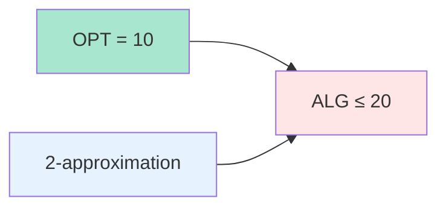
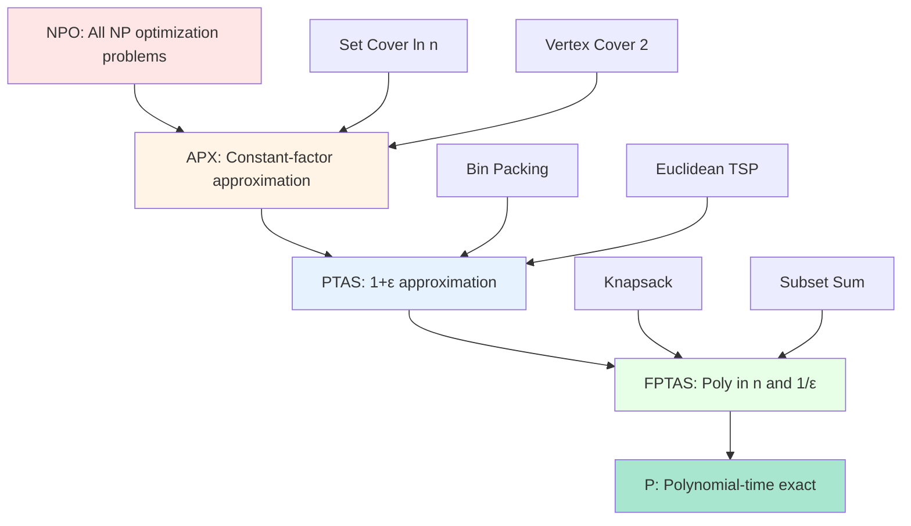

# Introduction to Approximation Algorithms: Approximation Ratio, PTAS, FPTAS

## Introduction

When faced with NP-complete optimization problems, we often cannot find optimal solutions efficiently. Approximation algorithms provide a powerful alternative: they guarantee solutions within a provable factor of optimal in polynomial time. This represents a fundamental tradeoff between solution quality and computational efficiency.

Understanding approximation algorithms is crucial for practical algorithm design, as many real-world problems are NP-hard. Rather than settling for heuristics without guarantees, approximation algorithms provide worst-case performance bounds while remaining computationally tractable.

## Optimization Problems

### Minimization vs Maximization

**Minimization problem**: Find solution with minimum cost
- Example: Minimum Vertex Cover, Minimum Set Cover, TSP

**Maximization problem**: Find solution with maximum value  
- Example: Maximum Independent Set, Maximum Cut, Max-SAT

### Optimal Solution

Let **OPT** denote the optimal solution value:
- For minimization: OPT = minimum possible cost
- For maximization: OPT = maximum possible value

## Approximation Ratio

### Definition

For a **minimization** problem:

An algorithm is an **α-approximation** (or has approximation ratio α) if it produces solution ALG satisfying:

$$\text{ALG} \leq \alpha \cdot \text{OPT}$$

for all instances, where α ≥ 1.

For a **maximization** problem:

$$\text{ALG} \geq \frac{1}{\alpha} \cdot \text{OPT}$$

or equivalently:

$$\text{ALG} \geq \beta \cdot \text{OPT}$$

where 0 < β ≤ 1. Here β is often called the approximation ratio.

### Relative Error

The **relative error** is:

$$\epsilon = \frac{|\text{ALG} - \text{OPT}|}{|\text{OPT}|}$$

For minimization with α-approximation:
$$\epsilon \leq \alpha - 1$$

For maximization with β-approximation:
$$\epsilon \leq 1 - \beta$$

### Example: 2-Approximation

If ALG is a 2-approximation for minimum vertex cover:
- If OPT = 10, then ALG ≤ 20
- If OPT = 100, then ALG ≤ 200
- Relative error ≤ 100%



### Tightness

An approximation ratio is **tight** if there exist instances where the algorithm achieves exactly that ratio.

**Example**: Vertex Cover 2-approximation
- Lower bound: ∃ instances where ALG = 2 · OPT
- Upper bound: ∀ instances ALG ≤ 2 · OPT
- Therefore, ratio of 2 is tight

## Types of Approximation Algorithms

### Constant-Factor Approximation

**Definition**: α is a constant independent of input size.

**Examples**:
- Vertex Cover: 2-approximation
- Metric TSP: 1.5-approximation (Christofides)
- Set Cover: ln(n)-approximation

**Pros**: 
- Simple to implement
- Fast (polynomial time)
- Useful guarantees

**Cons**: 
- May be far from optimal for some instances
- Constant factor may be large (e.g., 100-approximation)

### Approximation Schemes

More refined approach: approximation ratio depends on parameter ε.

## Polynomial-Time Approximation Scheme (PTAS)

### Definition

A **PTAS** is a family of algorithms $\{A_\epsilon\}$ where for each ε > 0:
- $A_\epsilon$ is a (1+ε)-approximation algorithm
- $A_\epsilon$ runs in polynomial time in n (input size)
- Running time may depend on ε (possibly exponentially)

**Formally**: $A_\epsilon$ runs in time $O(n^{f(1/\epsilon)})$ for some function f.

### Example: PTAS for Knapsack

For Knapsack problem, there exists a PTAS with running time:

$$O\left(n^3 \cdot \frac{1}{\epsilon}\right)$$

For ε = 0.1 (10% error):
$$O(10n^3)$$ - very practical!

For ε = 0.01 (1% error):
$$O(100n^3)$$ - still reasonable

For ε = 0.001 (0.1% error):
$$O(1000n^3)$$ - getting expensive

### PTAS Algorithm Structure

```typescript
function PTAS<T>(instance: T, epsilon: number): Solution {
    // Scale/round to reduce problem size
    const scalingFactor = computeScaling(instance, epsilon);
    const roundedInstance = round(instance, scalingFactor);
    
    // Solve rounded instance exactly
    const roundedSolution = solveExactly(roundedInstance);
    
    // Convert back to original instance
    const solution = unround(roundedSolution, scalingFactor);
    
    return solution;
}
```

**Key idea**: Trading accuracy for speed through rounding/scaling.

### When PTAS Exists

**Sufficient conditions** (informal):
- Problem has "nice" structure allowing rounding
- Weakly NP-complete (pseudo-polynomial algorithm exists)
- Geometric problems with Euclidean distances

**Examples with PTAS**:
- Knapsack
- Bin Packing
- Euclidean TSP
- Makespan Scheduling

**Examples without PTAS** (unless P=NP):
- Vertex Cover
- Set Cover  
- General TSP
- Max Clique

## Fully Polynomial-Time Approximation Scheme (FPTAS)

### Definition

An **FPTAS** is a PTAS where running time is polynomial in both n and 1/ε.

**Formally**: FPTAS runs in time $O\left(\text{poly}(n, \frac{1}{\epsilon})\right)$

Example: $O\left(n^3 \cdot \frac{1}{\epsilon^2}\right)$

### FPTAS vs PTAS

**FPTAS ⊂ PTAS** (every FPTAS is a PTAS, but not vice versa)

| Property | PTAS | FPTAS |
|----------|------|-------|
| Approximation | (1+ε) | (1+ε) |
| Time in n | Polynomial | Polynomial |
| Time in 1/ε | Arbitrary | Polynomial |
| Example | Euclidean TSP | Knapsack |

**Practical impact**:
- FPTAS with ε = 0.001 is still polynomial
- PTAS with ε = 0.001 may be infeasible

### Example: FPTAS for Knapsack

**Algorithm**:
```typescript
function knapsackFPTAS(
    items: Item[],
    capacity: number,
    epsilon: number
): number {
    const n = items.length;
    const maxValue = Math.max(...items.map(item => item.value));
    
    // Scaling factor
    const K = (epsilon * maxValue) / n;
    
    // Round down values
    const roundedItems = items.map(item => ({
        weight: item.weight,
        value: Math.floor(item.value / K)
    }));
    
    // Solve rounded instance with DP
    const roundedSolution = knapsackDP(roundedItems, capacity);
    
    // Convert back
    return roundedSolution * K;
}

function knapsackDP(items: Item[], capacity: number): number {
    const n = items.length;
    const maxValue = items.reduce((sum, item) => sum + item.value, 0);
    
    // dp[i][v] = minimum weight to achieve value v using first i items
    const dp: number[][] = Array(n + 1).fill(null)
        .map(() => Array(maxValue + 1).fill(Infinity));
    
    dp[0][0] = 0;
    
    for (let i = 1; i <= n; i++) {
        const {weight, value} = items[i-1];
        for (let v = 0; v <= maxValue; v++) {
            dp[i][v] = dp[i-1][v]; // Don't take item
            if (v >= value && dp[i-1][v - value] + weight <= capacity) {
                dp[i][v] = Math.min(dp[i][v], dp[i-1][v - value] + weight);
            }
        }
    }
    
    // Find maximum achievable value
    for (let v = maxValue; v >= 0; v--) {
        if (dp[n][v] <= capacity) return v;
    }
    return 0;
}
```

**Analysis**:
- Rounded values in range $[0, n/\epsilon]$
- DP table size: $O(n \cdot n/\epsilon) = O(n^2/\epsilon)$
- Time: $O(n^3/\epsilon)$
- Approximation: (1+ε) due to rounding error

**Proof of approximation ratio**:

Let OPT = optimal value, ALG = algorithm output.

Each item's value reduced by at most K:
$$\text{OPT}_{\text{rounded}} \geq \text{OPT} - nK$$

Since we solve rounded instance optimally:
$$\text{ALG}_{\text{rounded}} = \text{OPT}_{\text{rounded}}$$

Converting back:
$$\text{ALG} \geq \text{ALG}_{\text{rounded}} \cdot K \geq (\text{OPT} - nK) \cdot K = \text{OPT} \cdot K - nK^2$$

But $K = \epsilon \cdot \text{OPT} / n$, so $nK = \epsilon \cdot \text{OPT}$:

$$\text{ALG} \geq \text{OPT} - \epsilon \cdot \text{OPT} = (1-\epsilon) \cdot \text{OPT}$$

Therefore, ALG is a $(1+\epsilon)$-approximation. ✓

### When FPTAS Exists

**Theorem**: No strongly NP-complete problem has an FPTAS unless P=NP.

**Intuition**: FPTAS exists only for weakly NP-complete problems (where pseudo-polynomial algorithms exist).

**Examples with FPTAS**:
- Knapsack
- Subset Sum
- Partition

**Examples without FPTAS** (strongly NP-complete):
- Bin Packing (has PTAS but not FPTAS)
- Vertex Cover
- Max-SAT

## Approximation Classes

### Hierarchy

$$\text{FPTAS} \subseteq \text{PTAS} \subseteq \text{APX} \subseteq \text{NPO}$$

Where:
- **NPO**: All NP optimization problems
- **APX**: Problems with constant-factor approximation
- **PTAS**: Problems with (1+ε)-approximation for any ε
- **FPTAS**: PTAS with polynomial dependence on 1/ε



### APX-Complete

**Definition**: Hardest problems in APX (similar to NP-complete for NP).

**Property**: If any APX-complete problem has a PTAS, then P=NP.

**Examples**:
- Max-3SAT
- Vertex Cover
- Metric TSP

### Inapproximability

**PCP Theorem** (Probabilistically Checkable Proofs):

Connects hardness of approximation to complexity theory.

**Implications**:
- MAX-3SAT cannot be approximated better than 7/8 unless P=NP
- Set Cover cannot be approximated better than ln(n) unless P=NP
- Clique cannot be approximated within $n^{1-\epsilon}$ unless P=NP

## Performance Guarantees

### Absolute vs Relative Approximation

**Absolute approximation**:
$$|\text{ALG} - \text{OPT}| \leq k$$

for constant k.

**Relative approximation**:
$$\frac{\text{ALG}}{\text{OPT}} \leq \alpha$$

Most problems use relative approximation.

### Asymptotic Approximation

**Asymptotic approximation ratio**: Guarantee holds for sufficiently large instances.

**Example**: Bin Packing
- Absolute: ALG ≤ OPT + k for constant k
- Asymptotic: ALG ≤ α · OPT + β for constants α, β

**First Fit Decreasing for Bin Packing**:
$$\text{FFD}(I) \leq \frac{11}{9} \text{OPT}(I) + \frac{6}{9}$$

Asymptotic ratio: 11/9

## Analyzing Approximation Algorithms

### Proof Techniques

**1. Lower bound on OPT**
- Find relaxation that's easier to solve
- Fractional solutions, LP relaxation
- Structural properties

**2. Upper bound on ALG**
- Analyze algorithm's construction
- Relate to lower bound on OPT

**3. Show ALG ≤ α · Lower Bound ≤ α · OPT**

### Example: Vertex Cover Analysis

**Algorithm**: Pick edge (u,v), add both to cover, remove adjacent edges.

**Analysis**:
- Let M = set of edges picked by algorithm
- |ALG| = 2|M| (two vertices per edge)
- M is a matching (no two edges share a vertex)
- Any vertex cover must cover all edges in M
- Since M is a matching, need at least |M| vertices
- Therefore: OPT ≥ |M|
- So: ALG = 2|M| ≤ 2 · OPT ✓

## Practical Considerations

### Choosing ε

**Tradeoff**: Accuracy vs running time

For FPTAS with time $O(n^3/\epsilon)$:
- ε = 0.1: Time = $O(10n^3)$, Error ≤ 10%
- ε = 0.01: Time = $O(100n^3)$, Error ≤ 1%  
- ε = 0.001: Time = $O(1000n^3)$, Error ≤ 0.1%

**Guidelines**:
- Start with ε = 0.1 for quick results
- Refine with smaller ε if needed
- Balance accuracy requirements with time constraints

### Empirical Performance

**Average-case** performance often better than worst-case guarantee.

**Example**: Greedy Set Cover
- Worst-case: ln(n)-approximation
- Typical instances: 2-3 times optimal

**Recommendation**: 
- Use approximation ratio for guarantees
- Benchmark on realistic instances
- Compare with exact solutions when possible

## Conclusion

Approximation algorithms provide a rigorous framework for tackling NP-hard optimization problems:

1. **Constant-factor**: Simple, fast, reasonable guarantees
2. **PTAS**: Flexible accuracy, may be slow for small ε
3. **FPTAS**: Best of both worlds (when they exist)

Understanding approximation theory is essential for:
- Designing practical algorithms with guarantees
- Recognizing when problems are truly hard to approximate
- Making informed tradeoffs between quality and efficiency

The hierarchy of approximation classes (FPTAS ⊂ PTAS ⊂ APX) mirrors the complexity hierarchy (P ⊂ NP), providing structure to the landscape of tractable approximation.
