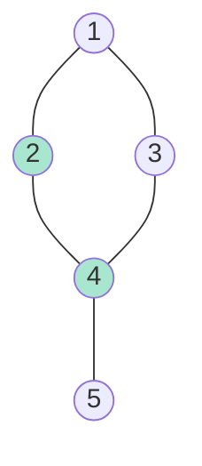
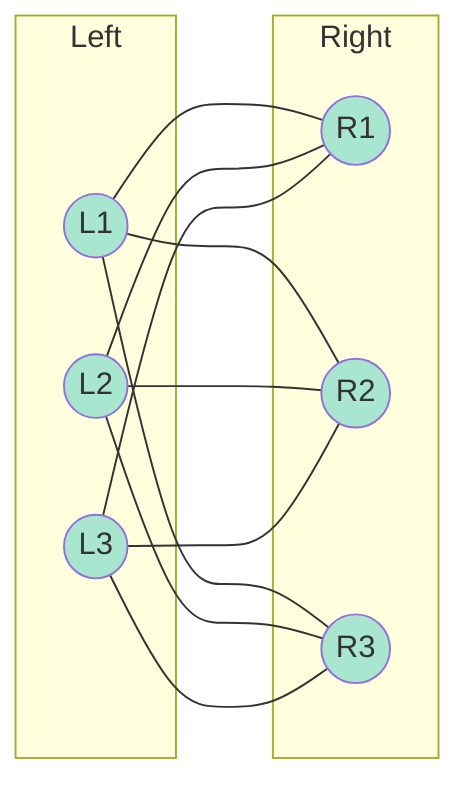

# Vertex Cover 2-Approximation Algorithm

## Introduction

The Vertex Cover problem is one of Karp's 21 NP-complete problems and serves as a canonical example for approximation algorithms. While finding the minimum vertex cover is NP-complete, we can efficiently find a solution guaranteed to be at most twice the optimal size.

This 2-approximation algorithm is elegant, simple to implement, and demonstrates fundamental techniques used throughout approximation algorithm design. Understanding this algorithm provides insights into matching theory, LP relaxations, and the limits of polynomial-time approximation.

## Problem Definition

### Vertex Cover

**Input**: Undirected graph $G = (V, E)$

**Output**: Minimum set $C \subseteq V$ such that every edge has at least one endpoint in $C$

**Formally**:
$$\forall (u,v) \in E: u \in C \lor v \in C$$

**Optimization goal**: Minimize $|C|$

### Example



Vertex cover: $\{2, 4\}$ (size 2)
- Edge (1,2): covered by 2 ✓
- Edge (1,3): covered by... need vertex 1 or 3!

Let me reconsider:
Vertex cover: $\{1, 4\}$ (size 2)
- (1,2): covered by 1 ✓
- (1,3): covered by 1 ✓
- (2,4): covered by 4 ✓
- (3,4): covered by 4 ✓
- (4,5): covered by 4 ✓

This is optimal (minimum).

## The 2-Approximation Algorithm

### Algorithm

**Idea**: Repeatedly pick an edge, add both endpoints to cover, remove all adjacent edges.

```typescript
function vertexCover2Approx(G: Graph): Set<Vertex> {
    const cover = new Set<Vertex>();
    const edges = new Set(G.edges());
    
    while (edges.size > 0) {
        // Pick any uncovered edge
        const [u, v] = edges.values().next().value;
        
        // Add both endpoints to cover
        cover.add(u);
        cover.add(v);
        
        // Remove all edges incident to u or v
        for (const edge of [...edges]) {
            if (edge.includes(u) || edge.includes(v)) {
                edges.delete(edge);
            }
        }
    }
    
    return cover;
}
```

**Time complexity**: $O(|V| + |E|)$
- Each edge examined at most once
- Each vertex added at most once

### Example Execution

Graph: 
```
1 --- 2 --- 4
|           |
3 ----------+
```

Edges: $(1,2), (1,3), (2,4), (3,4)$

**Iteration 1**: Pick edge (1,2)
- Add vertices 1, 2 to cover
- Remove edges (1,2), (1,3) [incident to 1 or 2]
- Remaining edges: $(2,4), (3,4)$
- Wait, (2,4) is incident to 2, so remove it too
- Remaining: $(3,4)$

**Iteration 2**: Pick edge (3,4)
- Add vertices 3, 4 to cover
- Remove edge (3,4)
- Remaining edges: empty

**Result**: Cover = $\{1, 2, 3, 4\}$ (size 4)

**Optimal**: $\{1, 4\}$ or $\{2, 3\}$ (size 2)

**Ratio**: $\frac{4}{2} = 2$ ✓

## Proof of Approximation Ratio

### Theorem

The algorithm is a 2-approximation for minimum vertex cover.

**Proof**:

Let:
- ALG = size of cover found by algorithm
- OPT = size of optimal cover
- M = set of edges picked by algorithm

**Claim 1**: ALG = 2|M|

**Proof**: Each iteration picks one edge and adds 2 vertices. ✓

**Claim 2**: M is a matching

**Proof**: No two edges in M share a vertex (we remove all incident edges after picking an edge). ✓

**Claim 3**: OPT ≥ |M|

**Proof**: 
- M is a matching (no shared vertices)
- Any vertex cover must include at least one endpoint of each edge in M
- Since edges in M are disjoint, we need at least |M| distinct vertices
- Therefore, OPT ≥ |M| ✓

**Conclusion**:
$$\text{ALG} = 2|M| \leq 2 \cdot \text{OPT}$$

Therefore, the algorithm is a 2-approximation. ∎

### Tightness

The analysis is **tight**: there exist graphs where ALG = 2 · OPT.

**Example**: Complete bipartite graph $K_{n,n}$



**Optimal cover**: One side (n vertices)
**Algorithm output**: Both sides (2n vertices)
**Ratio**: 2 ✓

## Lower Bounds on Approximation

### Hardness Results

**Theorem** (Khot-Regev, 2008): 
Assuming the Unique Games Conjecture, Vertex Cover cannot be approximated within factor $2 - \epsilon$ for any $\epsilon > 0$ in polynomial time.

**Implication**: The 2-approximation is essentially best possible (unless UGC is false).

### Related Problems

**Independent Set**: Complement of Vertex Cover
- If $C$ is vertex cover, then $V \setminus C$ is independent set
- Independent Set is hard to approximate within $n^{1-\epsilon}$

**Maximum Matching**: Related via LP duality
- Max matching ≤ Min vertex cover ≤ 2 · Max matching

## Linear Programming Relaxation

### Integer Linear Program

Vertex Cover can be formulated as an ILP:

**Variables**: $x_v \in \{0, 1\}$ for each vertex $v$

**Objective**: 
$$\min \sum_{v \in V} x_v$$

**Constraints**:
$$x_u + x_v \geq 1 \quad \forall (u,v) \in E$$
$$x_v \in \{0, 1\} \quad \forall v \in V$$

**Interpretation**: $x_v = 1$ iff $v$ is in the cover.

### LP Relaxation

Relax integrality: $x_v \in [0, 1]$

$$\begin{align}
\min \quad & \sum_{v \in V} x_v \\
\text{s.t.} \quad & x_u + x_v \geq 1 \quad \forall (u,v) \in E \\
& 0 \leq x_v \leq 1 \quad \forall v \in V
\end{align}$$

**Properties**:
- Solvable in polynomial time
- LP-OPT ≤ ILP-OPT = OPT

### Rounding Algorithm

```typescript
function vertexCoverLPRounding(G: Graph): Set<Vertex> {
    // Solve LP relaxation
    const lpSolution = solveLPRelaxation(G);
    
    // Round: include vertex if x_v ≥ 1/2
    const cover = new Set<Vertex>();
    for (const v of G.vertices()) {
        if (lpSolution[v] >= 0.5) {
            cover.add(v);
        }
    }
    
    return cover;
}
```

**Analysis**:

**Claim 1**: Cover is valid

**Proof**: For edge $(u,v)$: $x_u + x_v \geq 1$
- If $x_u \geq 1/2$, then $u \in$ cover ✓
- If $x_u < 1/2$, then $x_v > 1/2$, so $v \in$ cover ✓
- Therefore, every edge is covered. ✓

**Claim 2**: 2-approximation

**Proof**:
$$|C| = \sum_{v \in C} 1 \leq \sum_{v : x_v \geq 1/2} 2x_v \leq 2 \sum_{v \in V} x_v = 2 \cdot \text{LP-OPT} \leq 2 \cdot \text{OPT}$$

Therefore, LP rounding gives a 2-approximation. ✓

### Integrality Gap

**Integrality gap** = worst-case ratio $\frac{\text{ILP-OPT}}{\text{LP-OPT}}$

For Vertex Cover: integrality gap = 2

**Example**: $K_{n,n}$
- LP-OPT = $n$ (set all $x_v = 1/2$)
- ILP-OPT = $n$
- Gap = $n/n = 1$... wait

Actually:
- LP-OPT = $n$ (optimal fractional solution)
- ILP-OPT = $n$ (optimal integral solution)

Hmm, let me reconsider. For $K_{2,2}$:
- Vertices: $\{L_1, L_2, R_1, R_2\}$
- Edges: all 4 between left and right
- LP: Set $x_{L_1} = x_{L_2} = x_{R_1} = x_{R_2} = 1/2$
- LP-OPT = $4 \cdot 1/2 = 2$
- ILP-OPT = 2 (take one side)
- Gap = $2/2 = 1$

For general $K_{n,n}$:
- LP-OPT = $n$ (all vertices at 1/2)
- ILP-OPT = $n$ (one side)
- Gap = $n/n = 1$

Actually, the integrality gap is tight at 2 for specific graphs. The standard example involves more complex construction.

## Variations and Extensions

### Weighted Vertex Cover

**Input**: Graph $G$ with weight $w(v)$ for each vertex

**Goal**: Minimize $\sum_{v \in C} w(v)$

**Algorithm**: LP rounding still gives 2-approximation

```typescript
function weightedVertexCover(G: Graph, weights: Map<Vertex, number>): Set<Vertex> {
    const lpSolution = solveWeightedLP(G, weights);
    
    const cover = new Set<Vertex>();
    for (const v of G.vertices()) {
        if (lpSolution[v] >= 0.5) {
            cover.add(v);
        }
    }
    
    return cover;
}
```

**Analysis**: Same as unweighted case
$$\sum_{v \in C} w(v) \leq 2 \sum_{v} w(v) \cdot x_v^* \leq 2 \cdot \text{OPT}$$

### k-Vertex Cover

**Input**: Find vertex cover of size at most $k$

**Problem**: Fixed-parameter tractable (FPT)

**Algorithm**: Branching with kernelization
- Time: $O(2^k + kn)$
- Exact solution for small $k$

### Partial Vertex Cover

**Input**: Cover at least $k$ edges

**Goal**: Minimize number of vertices

**Algorithm**: LP rounding gives 2-approximation

## Practical Implementations

### Greedy Heuristic

**Idea**: Repeatedly pick vertex covering most uncovered edges

```typescript
function greedyVertexCover(G: Graph): Set<Vertex> {
    const cover = new Set<Vertex>();
    const uncovered = new Set(G.edges());
    
    while (uncovered.size > 0) {
        // Find vertex covering most uncovered edges
        let maxVertex = null;
        let maxCount = 0;
        
        for (const v of G.vertices()) {
            const count = [...uncovered].filter(e => e.includes(v)).length;
            if (count > maxCount) {
                maxCount = count;
                maxVertex = v;
            }
        }
        
        cover.add(maxVertex);
        
        // Remove covered edges
        for (const edge of [...uncovered]) {
            if (edge.includes(maxVertex)) {
                uncovered.delete(edge);
            }
        }
    }
    
    return cover;
}
```

**Analysis**: No constant-factor approximation guarantee
- Can be $\Theta(\log n)$-approximation
- Often works well in practice

### Branch and Bound

For small to medium instances, exact algorithms practical:

```typescript
function exactVertexCover(G: Graph, k: number): Set<Vertex> | null {
    if (G.edges().length === 0) return new Set();
    if (k === 0) return null;
    
    // Pick an edge (u, v)
    const [u, v] = G.edges()[0];
    
    // Try including u
    const G1 = G.removeVertex(u);
    const sol1 = exactVertexCover(G1, k - 1);
    if (sol1 !== null) {
        sol1.add(u);
        return sol1;
    }
    
    // Try including v
    const G2 = G.removeVertex(v);
    const sol2 = exactVertexCover(G2, k - 1);
    if (sol2 !== null) {
        sol2.add(v);
        return sol2;
    }
    
    return null;
}
```

**Time**: $O(2^k \cdot |E|)$ - FPT algorithm

## Applications

### Network Security

**Vertices**: Computers
**Edges**: Communication links
**Cover**: Firewalls/monitors ensuring all links are monitored

### Bioinformatics

**Vertices**: Proteins
**Edges**: Interactions  
**Cover**: Minimum set of proteins to target with drugs

### Social Networks

**Vertices**: Users
**Edges**: Friendships
**Cover**: Influential users reaching all connections

## Conclusion

The 2-approximation for Vertex Cover demonstrates:
1. **Matching-based analysis**: Using maximal matching as lower bound
2. **LP rounding**: Solving relaxation and rounding fractional solution
3. **Tight analysis**: Algorithm achieves worst-case ratio
4. **Optimality**: Likely best possible under UGC

This algorithm serves as a template for approximation algorithm design and analysis, with techniques applicable to numerous optimization problems.
