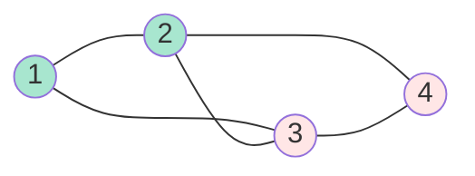

# Karger's Min-Cut Algorithm: Contraction and Success Probability

## Introduction

The minimum cut problem asks for the minimum number of edges whose removal disconnects a graph. Karger's randomized contraction algorithm (1993) is remarkably simple yet achieves polynomial expected running time.

This algorithm exemplifies how randomization can lead to elegant solutions for problems where deterministic algorithms are complex.

## Minimum Cut Problem

**Input**: Undirected graph $G = (V, E)$

**Output**: Partition of vertices $(S, V\setminus S)$ minimizing edges crossing the cut

**Min-cut value**: $|\{(u,v) \in E : u \in S, v \in V\setminus S\}|$

### Example



Min-cut: Separate {1,2} from {3,4}, cutting 2 edges.

## Karger's Algorithm

**Idea**: Randomly contract edges until 2 vertices remain.

**Edge contraction**: Merge endpoints, remove self-loops.

```typescript
function kargerMinCut(G: Graph): number {
    let H = G.clone();
    
    while (H.vertexCount() > 2) {
        // Choose random edge uniformly
        const edge = H.randomEdge();
        
        // Contract edge
        H = H.contract(edge);
    }
    
    // Return number of edges between final 2 super-vertices
    return H.edgeCount();
}

class Graph {
    contract(edge: Edge): Graph {
        const [u, v] = edge;
        const newGraph = this.clone();
        
        // Merge v into u
        for (const neighbor of newGraph.neighbors(v)) {
            if (neighbor !== u) {
                newGraph.addEdge(u, neighbor);
            }
        }
        
        newGraph.removeVertex(v);
        return newGraph;
    }
}
```

**Time**: $O(n^2)$ per run.

## Analysis

**Theorem**: Algorithm finds min-cut with probability $\geq \frac{2}{n(n-1)}$.

**Proof**:

Let $C$ = min-cut with $k$ edges.

**Goal**: Show $\Pr[\text{no edge of } C \text{ contracted}] \geq \frac{2}{n(n-1)}$.

**Observation 1**: Every vertex has degree $\geq k$ (otherwise cutting edges incident to low-degree vertex gives smaller cut).

**Therefore**: $|E| \geq \frac{nk}{2}$

**Iteration 1**: 
$$\Pr[\text{avoid } C] = 1 - \frac{k}{|E|} \geq 1 - \frac{k}{nk/2} = 1 - \frac{2}{n}$$

**After iteration 1**: $n-1$ vertices, min-cut still $\geq k$.

**Iteration 2**:
$$\Pr[\text{avoid } C | \text{avoided in iteration 1}] \geq 1 - \frac{2}{n-1}$$

**General**: After $i$ contractions, $n-i$ vertices remain.
$$\Pr[\text{avoid } C \text{ in iteration } i+1] \geq 1 - \frac{2}{n-i}$$

**Overall**:
$$\begin{align}
\Pr[\text{success}] &= \prod_{i=0}^{n-3} \left(1 - \frac{2}{n-i}\right) \\
&= \prod_{i=0}^{n-3} \frac{n-i-2}{n-i} \\
&= \frac{n-2}{n} \cdot \frac{n-3}{n-1} \cdot \frac{n-4}{n-2} \cdots \frac{2}{4} \cdot \frac{1}{3} \\
&= \frac{2 \cdot 1}{n(n-1)} = \frac{2}{n(n-1)}
\end{align}$$

Therefore, success probability is $\Omega(1/n^2)$. ✓

## Amplification

**Repeat** $N = \binom{n}{2} \ln n = \frac{n(n-1)}{2} \ln n$ times, return minimum cut found.

**Probability of failure**:
$$\Pr[\text{all runs fail}] = \left(1 - \frac{2}{n(n-1)}\right)^{N}$$

Using $1-x \leq e^{-x}$:
$$\leq e^{-\frac{2N}{n(n-1)}} = e^{-\ln n} = \frac{1}{n}$$

**Therefore**: With $O(n^2 \log n)$ runs (total time $O(n^4 \log n)$), find min-cut with high probability.

## Faster Version: Karger-Stein

**Idea**: Use recursive calls and early stopping.

```typescript
function kargerStein(G: Graph): number {
    if (G.vertexCount() <= 6) {
        return bruteForceMinCut(G);
    }
    
    const t = Math.ceil(1 + G.vertexCount() / Math.sqrt(2));
    
    // Contract to t vertices twice
    const G1 = contractTo(G, t);
    const G2 = contractTo(G, t);
    
    // Recurse
    const cut1 = kargerStein(G1);
    const cut2 = kargerStein(G2);
    
    return Math.min(cut1, cut2);
}
```

**Time**: $O(n^2 \log n)$ per run (faster than basic version)

**Runs needed**: $O(\log n)$ for high probability

**Total time**: $O(n^2 \log^3 n)$ with high probability

## Deterministic Min-Cut

**Stoer-Wagner algorithm** (1997): Deterministic $O(mn + n^2 \log n)$ time.

**Comparison**:
- Karger: Simple, randomized, $O(n^2 \log^3 n)$
- Stoer-Wagner: Complex, deterministic, $O(mn + n^2 \log n)$

**For dense graphs** ($m = \Theta(n^2)$): Similar performance.

## Applications

**Network reliability**: Minimum edge set whose failure disconnects network

**Image segmentation**: Partition image into regions (min-cut on pixel graph)

**Community detection**: Find natural partitions in social networks

## Conclusion

Karger's algorithm showcases randomization at its best:
- Extremely simple algorithm (few lines of code)
- Non-obvious correctness proof
- Amplification gives high-probability guarantee
- Competitive with complex deterministic algorithms

The analysis techniques (probability over random choices, product of survival probabilities) appear throughout randomized algorithms.
