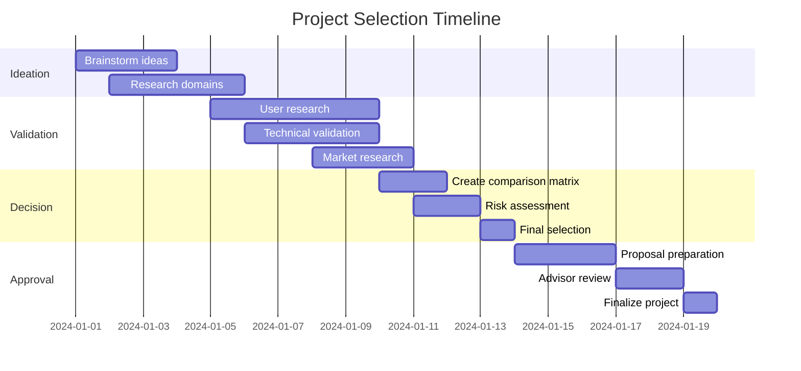

# Project Selection

## Introduction

Project selection is the foundational step in your capstone journey. The project you choose will consume hundreds of hours of your time, challenge your technical abilities, and serve as a portfolio piece for your career. This decision requires careful consideration of your interests, skills, available resources, and career goals.

A well-chosen project strikes a balance between ambition and feasibility. It should be challenging enough to demonstrate your capabilities but realistic enough to complete within the given timeframe. The best capstone projects solve real problems, incorporate modern technologies, and showcase a breadth of software engineering skills.

## Learning Objectives

By the end of this lesson, you will be able to:

- Evaluate project ideas against specific criteria for feasibility and impact
- Identify personal interests and technical skills that align with potential projects
- Conduct market research to validate project ideas
- Define clear problem statements and value propositions
- Assess technical complexity and required resources
- Create a project comparison matrix for decision-making
- Articulate project goals that align with learning objectives

## Criteria for Project Selection

### Personal Interest and Passion

Your capstone project will require sustained effort over several months. Choose something that genuinely excites you. Ask yourself:

- What problems do I encounter in my daily life that frustrate me?
- What technologies or domains have I always wanted to explore?
- What type of software do I enjoy using and want to build?
- What causes or communities do I care about?

Projects driven by genuine interest are more likely to be completed successfully. When you encounter inevitable obstacles, your passion will sustain your motivation.

### Technical Feasibility

Assess whether the project can be reasonably completed with your current skills and the time available:

**Scope Appropriateness:**
- Can core features be implemented in 12-16 weeks?
- Are there clear milestones that can be achieved incrementally?
- Can the project be delivered as a minimum viable product (MVP) first, with additional features as stretch goals?

**Technology Stack:**
- Do you have experience with the required technologies, or can you learn them quickly?
- Are there good documentation and community support for your chosen stack?
- Are the tools and services accessible (cost, licensing, availability)?

**Complexity Management:**
- Is the problem well-defined, or will you need extensive research?
- Can you break the project into manageable components?
- Are there existing libraries or APIs that can accelerate development?

### Learning Value

Your capstone should demonstrate and expand your software engineering capabilities:

- Does it require you to integrate multiple technical skills?
- Will it expose you to new technologies or methodologies?
- Does it involve architectural decisions and system design?
- Will it give you experience with the full development lifecycle?
- Does it showcase skills relevant to your career goals?

Aim for projects that push you slightly beyond your comfort zone while building on your existing foundation.

### Impact and Value

Consider the real-world value of your project:

**User Impact:**
- Does it solve a genuine problem for real users?
- Is there a target audience who would use this product?
- Can you get feedback from potential users during development?

**Portfolio Value:**
- Will this project impress potential employers or graduate schools?
- Does it demonstrate skills in high demand?
- Can you articulate clear business or social value?

**Novelty:**
- Does it offer a unique perspective or approach?
- If similar solutions exist, does yours provide meaningful differentiation?

### Resource Availability

Evaluate the resources required:

**Time:**
- Do you have sufficient time given other commitments?
- Have you accounted for unexpected challenges and learning curves?

**Financial Resources:**
- Are there costs for hosting, APIs, or third-party services?
- Can you use free tiers or educational credits?
- Are there open-source alternatives to paid services?

**Access and Data:**
- Do you need access to specific data sets, APIs, or systems?
- Are there privacy or security considerations?
- Do you need approval or partnerships to access required resources?

**External Dependencies:**
- Does your project depend on other people or organizations?
- Can you proceed if external factors change?

## Project Categories

### Web Applications

Full-stack web applications remain popular for capstone projects due to their versatility and visibility:

**Examples:**
- Social platforms for niche communities
- Productivity tools and dashboards
- Educational platforms or learning management systems
- E-commerce or marketplace applications
- Content management systems
- Collaboration tools

**Advantages:**
- Clear user interface for demonstrations
- Broad skill demonstration (frontend, backend, database)
- Easy to deploy and share
- Rich ecosystem of frameworks and libraries

**Considerations:**
- Competitive space requires differentiation
- Security and authentication can be complex
- User adoption may be challenging for portfolio pieces

### Mobile Applications

Native or cross-platform mobile apps offer unique opportunities:

**Examples:**
- Health and fitness tracking applications
- Location-based services
- Augmented reality experiences
- Personal finance management
- Habit tracking and productivity apps

**Advantages:**
- Access to device-specific features (GPS, camera, sensors)
- Growing market and career opportunities
- Impressive portfolio pieces

**Considerations:**
- Platform-specific development challenges
- Distribution through app stores can be complex
- Testing across devices requires resources

### Data Science and Machine Learning

Projects focused on data analysis, visualization, or machine learning:

**Examples:**
- Predictive models for specific domains
- Natural language processing applications
- Computer vision systems
- Data visualization dashboards
- Recommendation systems

**Advantages:**
- High demand for these skills
- Can work with publicly available datasets
- Demonstrates analytical and algorithmic thinking

**Considerations:**
- Requires strong mathematical foundation
- Quality results depend on data availability
- Computational resources may be significant

### Systems and Infrastructure

Low-level systems programming or infrastructure projects:

**Examples:**
- Developer tools or CLI applications
- Performance monitoring systems
- Custom databases or search engines
- Networking tools or protocols
- Automation and orchestration platforms

**Advantages:**
- Demonstrates deep technical knowledge
- Less competition in this space
- Valuable for systems engineering roles

**Considerations:**
- May be harder to demonstrate visually
- Requires strong foundational knowledge
- Testing and debugging can be challenging

### Games and Interactive Media

Game development or interactive experiences:

**Examples:**
- 2D or 3D games
- Educational games and simulations
- Interactive storytelling platforms
- Game engines or frameworks

**Advantages:**
- Highly engaging and demonstrable
- Combines technical and creative skills
- Rich opportunities for innovation

**Considerations:**
- Art and design assets can be time-consuming
- Complex physics and game logic
- Balancing technical challenge with fun gameplay

## Project Ideation Process

### Brainstorming Techniques

**Problem-First Approach:**
1. List problems you or others face regularly
2. Prioritize by frequency and severity
3. Evaluate which could be addressed with software
4. Research existing solutions and identify gaps

**Technology-First Approach:**
1. Identify technologies you want to learn or showcase
2. Research typical applications of these technologies
3. Find intersection with your interests
4. Develop unique project concepts

**Domain-First Approach:**
1. Choose an industry or domain you're passionate about
2. Research current challenges and trends
3. Identify opportunities for innovation
4. Validate with domain experts when possible

### Idea Validation

Before committing to a project, validate your idea:

**User Research:**
- Interview potential users about the problem
- Survey target audiences about needs and preferences
- Observe how people currently solve the problem
- Validate that the pain point is real and significant

**Market Research:**
- Analyze existing solutions and competitors
- Identify market gaps and opportunities
- Assess trends and future outlook
- Consider sustainability and growth potential

**Technical Validation:**
- Build small proof-of-concepts for risky components
- Research availability of required APIs and services
- Assess learning curve for new technologies
- Verify that core technical approach is viable

## Decision-Making Framework

### Project Comparison Matrix

Create a matrix to evaluate multiple project ideas objectively:

```
Criteria                | Weight | Project A | Project B | Project C
------------------------|--------|-----------|-----------|----------
Personal Interest       | 20%    | 8/10      | 9/10      | 6/10
Technical Feasibility   | 25%    | 7/10      | 5/10      | 9/10
Learning Value          | 20%    | 8/10      | 9/10      | 6/10
Impact & Portfolio      | 20%    | 6/10      | 8/10      | 7/10
Resource Availability   | 15%    | 9/10      | 6/10      | 8/10
------------------------|--------|-----------|-----------|----------
Weighted Score          | 100%   | 7.5       | 7.4       | 7.3
```

Rate each criterion on a scale of 1-10, apply weights based on your priorities, and calculate weighted scores.

### Risk Assessment

For your top choices, conduct a risk assessment:

**Technical Risks:**
- What could go wrong technically?
- What are your mitigation strategies?
- Do you have plan B for high-risk components?

**Schedule Risks:**
- What could cause delays?
- How much buffer time do you have?
- Can you reduce scope if needed?

**External Risks:**
- What external factors could impact the project?
- How dependent are you on third parties?
- What's your contingency plan?

### The Goldilocks Principle

Your project should be "just right":

**Too Easy:**
- Uses only technologies you've mastered
- Could be completed in a few days
- Doesn't demonstrate growth or learning
- Won't impress evaluators or employers

**Too Hard:**
- Requires learning entirely new paradigms
- Depends on complex systems you don't understand
- Has unclear scope or requirements
- Likely to be abandoned due to overwhelm

**Just Right:**
- Builds on existing skills while introducing new challenges
- Has clear core features and optional extensions
- Demonstrates multiple competencies
- Achievable with focused effort

## Project Selection Checklist

Before finalizing your project selection, ensure you can answer "yes" to these questions:

### Passion and Interest
- [ ] Am I genuinely excited about this project?
- [ ] Will I still care about this in three months?
- [ ] Do I understand why this problem matters?

### Feasibility
- [ ] Can I complete an MVP within the allocated time?
- [ ] Do I have or can I learn the required technical skills?
- [ ] Are the necessary resources available to me?
- [ ] Have I identified and mitigated major risks?

### Value and Impact
- [ ] Does this solve a real problem?
- [ ] Can I identify specific users who would benefit?
- [ ] Will this project strengthen my portfolio?
- [ ] Does it demonstrate career-relevant skills?

### Scope and Clarity
- [ ] Can I clearly explain what the project does?
- [ ] Have I defined the core features?
- [ ] Can I break it into incremental milestones?
- [ ] Do I know what success looks like?

### Support and Resources
- [ ] Do I have access to mentors or advisors if needed?
- [ ] Are there learning resources for new technologies?
- [ ] Can I get user feedback during development?
- [ ] Have I budgeted for any necessary costs?

## Common Pitfalls to Avoid

### Scope Creep Vulnerability

Some project types are particularly susceptible to scope creep:
- Social networks (endless features to add)
- Games (always "just one more level")
- Marketplaces (two-sided platforms are complex)
- AI projects (improving accuracy is never-ending)

If choosing these types, define strict MVP boundaries upfront.

### Technology Overload

Avoid projects that require:
- Learning multiple new frameworks simultaneously
- Complex infrastructure you've never worked with
- Cutting-edge technologies with poor documentation
- Deep expertise in unfamiliar domains

You should learn new things, but not everything should be new.

### Dependency Traps

Be cautious of projects that depend on:
- Third-party APIs that could change or disappear
- Access to proprietary data or systems
- Collaboration from other people or organizations
- Hardware or equipment you don't own

Ensure you have control over critical dependencies.

### Perfectionism Paralysis

Avoid projects where:
- Quality bar is impossibly high (professional game graphics, enterprise-scale performance)
- Success depends on factors beyond your control (viral adoption, perfect UX)
- Requirements are too vague or aspirational

Focus on what you can realistically deliver and demonstrate.

## Project Selection Timeline



## Case Studies

### Case Study 1: Budget Tracking App

**Student Background:** Sarah, interested in personal finance and web development

**Initial Idea:** "A budgeting app better than Mint"

**Problem:** Too broad, highly competitive, unclear differentiation

**Refinement Process:**
1. Identified specific pain point: existing apps don't work well for freelancers with irregular income
2. Narrowed focus to income prediction and expense smoothing
3. Validated with 10 freelancer friends
4. Scoped MVP to core prediction algorithm and simple expense tracking
5. Identified stretch goals: bank API integration, mobile app

**Final Project:** "Freelance Finance Forecaster" - web app for income prediction and budget smoothing for freelancers

**Outcome:** Successfully completed, demonstrated machine learning (prediction), full-stack development, and clear user value

### Case Study 2: Game Development

**Student Background:** James, passionate about games but limited graphics skills

**Initial Idea:** "3D multiplayer battle royale game"

**Problem:** Scope too large, asset creation overwhelming, network programming complex

**Refinement Process:**
1. Reduced scope to 2D to minimize asset requirements
2. Changed from multiplayer to single-player to avoid networking complexity
3. Focused on procedural generation to reduce manual level design
4. Used existing art assets and focused on mechanics

**Final Project:** "Rogue-Space" - procedurally generated 2D space exploration game with permadeath mechanics

**Outcome:** Completed on time, demonstrated algorithms (procedural generation), game design, and state management

### Case Study 3: Data Visualization

**Student Background:** Maria, interested in climate science and data visualization

**Initial Idea:** "Predict future climate change"

**Problem:** Requires advanced climate science expertise, complex modeling beyond scope

**Refinement Process:**
1. Shifted from prediction to visualization of existing data
2. Focused on making climate data accessible to general public
3. Identified free, well-documented climate datasets
4. Emphasized interactive, educational approach

**Final Project:** "Climate Explorer" - interactive web dashboard visualizing historical climate trends with educational narratives

**Outcome:** Successfully completed, demonstrated data processing, visualization skills, and public science communication

## Reflection Questions

1. What problems do you encounter regularly that could be solved with software?
2. Which technology domains align with your career aspirations?
3. What have you built before that you were most proud of, and why?
4. What would you want to talk about in job interviews?
5. If you could only work on one project for the next semester, what would make the effort worthwhile?

## Summary

Project selection is a critical decision that sets the foundation for your entire capstone experience. The ideal project balances personal interest, technical feasibility, learning value, and real-world impact. Use structured evaluation criteria, validate your ideas through research, and ensure your project is scoped appropriately for the available time and resources.

Remember that the "perfect" project doesn't exist. Once you've done your due diligence and selected a solid project that meets the key criteria, commit to it fully. Your success will depend more on your execution, problem-solving, and persistence than on the specific project you chose.

The project selection process itself is valuable learning. It teaches you to evaluate trade-offs, assess risk, conduct research, and make strategic decisions—skills that will serve you throughout your software engineering career.

## Additional Resources

- "The Lean Startup" by Eric Ries - validation and MVP concepts
- "Sprint" by Jake Knapp - rapid prototyping and validation
- "The Mom Test" by Rob Fitzpatrick - how to talk to users
- Y Combinator's Startup Ideas - inspiration for problem-solving
- GitHub's trending repositories - popular open-source projects
- Product Hunt - discover new products and identify gaps
- Academic conference proceedings in your domain of interest
