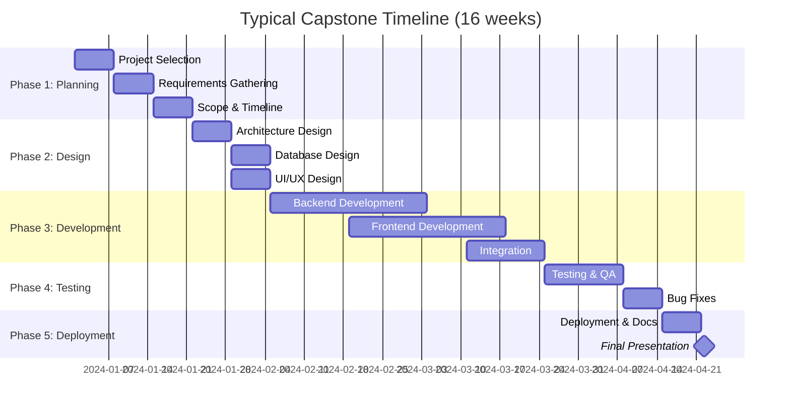
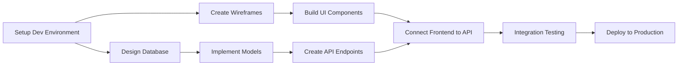
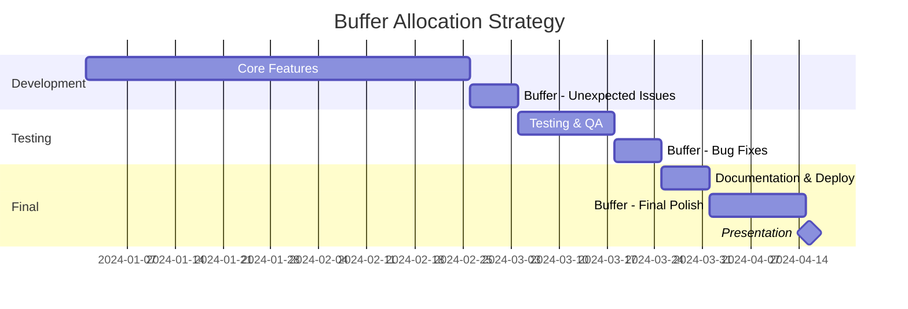

# Timeline Planning

## Introduction

Timeline planning transforms your project scope into a structured schedule with milestones, deadlines, and dependencies. A well-crafted timeline provides a roadmap for execution, helps you stay on track, and enables early identification of potential delays. For capstone projects, effective timeline planning is often the difference between delivering a polished product and scrambling at the last minute.

Unlike open-ended projects, capstone projects have fixed deadlines. You can't extend the semester or delay your graduation. This makes timeline planning both critical and challenging—you must be realistic about what's achievable while building in contingency for the inevitable unexpected obstacles.

## Learning Objectives

By the end of this lesson, you will be able to:

- Break down project scope into schedulable tasks
- Estimate task duration using multiple techniques
- Identify task dependencies and critical paths
- Create realistic project timelines with milestones
- Allocate time for learning, debugging, and polish
- Build in buffer time and contingency plans
- Use Gantt charts and other visualization tools
- Track progress and adjust timelines proactively
- Balance multiple commitments with project work

## Time Estimation Fundamentals

### Task Decomposition

Break your project into tasks small enough to estimate accurately:

**Task Granularity:**
- **Too Large:** "Build the backend" (weeks of work, impossible to estimate)
- **Too Small:** "Write one function" (minutes, too granular for planning)
- **Just Right:** "Implement user authentication API endpoints" (4-8 hours)

**Effective Decomposition:**
1. Start with major phases (Planning, Development, Testing, Deployment)
2. Break phases into features (User Auth, Dashboard, Data Entry)
3. Decompose features into tasks (Design schema, Build API, Create UI)
4. Stop when tasks are 2-16 hours of focused work

### Estimation Techniques

#### Three-Point Estimation

For each task, estimate:
- **Optimistic (O):** Best-case scenario, everything goes perfectly
- **Most Likely (M):** Realistic estimate with normal challenges
- **Pessimistic (P):** Worst-case scenario with significant obstacles

**Calculate Expected Duration:**
```
Expected Duration = (O + 4M + P) / 6
```

**Example:**
Task: Implement password reset functionality
- Optimistic: 3 hours (you've done this before, straightforward)
- Most Likely: 6 hours (account for email integration testing)
- Pessimistic: 12 hours (email service issues, security edge cases)
- Expected: (3 + 24 + 12) / 6 = 6.5 hours

#### Historical Data

Use your past experience:
- How long did similar tasks take in previous projects?
- Were your estimates accurate or did you underestimate?
- What unexpected issues arose?

**Personal Estimation Factor:**
Track your estimation accuracy over time. If tasks consistently take 1.5x your estimates, apply this factor:

```
Adjusted Estimate = Raw Estimate × 1.5
```

#### Comparison Estimation

Compare to tasks you've completed:
- "This is similar to X, which took 5 hours"
- "This is about twice as complex as Y"
- "This is simpler than Z, so probably half the time"

#### Planning Poker (Team Projects)

If working with others:
1. Each member estimates independently
2. Reveal estimates simultaneously
3. Discuss discrepancies (high and low explain their reasoning)
4. Re-estimate until consensus

### The 8-Hour Day Myth

**Reality of Productive Time:**

For a typical "8-hour work day":
- 2 hours: Meetings, communication, breaks
- 1 hour: Email, admin, context switching
- 1 hour: Learning, reading, research
- 4 hours: Actual focused coding/development

**For Capstone Projects:**
Students often overestimate available time:
- "I'll work 20 hours this week" → 8 hours of actual coding
- Classes, assignments, work, life consume time
- Energy and focus vary throughout the day
- Learning curve for new technologies

**Realistic Capacity:**
- Assume 50-60% of planned time for actual development
- Build this into estimates from the start
- Track actual vs. planned to calibrate

## Creating Your Project Timeline

### Phase-Based Approach

Typical capstone project phases:



### Milestone-Based Planning

**Milestones are:**
- Significant accomplishments or deliverables
- Clearly verifiable (you know when you've reached them)
- Spaced throughout the project
- Natural points for review and adjustment

**Example Milestones:**

**Week 3: Project Approved**
- Deliverable: Approved project proposal
- Criteria: Advisor sign-off on scope and feasibility

**Week 6: Architecture Complete**
- Deliverable: Architecture document and database schema
- Criteria: All major technical decisions documented

**Week 9: Backend MVP**
- Deliverable: Functional API with core endpoints
- Criteria: CRUD operations work, tests passing

**Week 12: Frontend MVP**
- Deliverable: User interface for core features
- Criteria: Users can complete primary workflows

**Week 14: Integration Complete**
- Deliverable: Full-stack application deployed
- Criteria: End-to-end functionality working

**Week 16: Project Complete**
- Deliverable: Final presentation and documentation
- Criteria: All acceptance criteria met

### Sprint-Based Planning

Organize work into 1-2 week sprints:

**Sprint Structure:**
1. **Sprint Planning:** Define goals and tasks for sprint
2. **Daily Work:** Execute tasks, track progress
3. **Sprint Review:** Demonstrate completed work
4. **Sprint Retrospective:** Reflect on what worked and what didn't

**Example Sprint Breakdown:**

**Sprint 1 (Weeks 1-2): Project Foundation**
- Complete project proposal
- Set up development environment
- Initialize code repository
- Design database schema

**Sprint 2 (Weeks 3-4): Authentication System**
- Implement user registration
- Build login/logout functionality
- Create password reset flow
- Write authentication tests

**Sprint 3 (Weeks 5-6): Core Feature Development**
- Build primary data models
- Implement CRUD API endpoints
- Create basic frontend components
- Integration testing

### Task Dependencies

**Types of Dependencies:**

**Finish-to-Start (FS):**
Task B cannot start until Task A finishes
```
Design Database Schema → Implement Database Models
```

**Start-to-Start (SS):**
Task B cannot start until Task A starts
```
Frontend Development ⇢ Backend Development (can work in parallel)
```

**Finish-to-Finish (FF):**
Task B cannot finish until Task A finishes
```
All Features → Integration Testing
```

**Start-to-Finish (SF):**
Rare in software projects

**Dependency Mapping:**



**Critical Path:**
The longest sequence of dependent tasks determines your minimum project duration:
```
A → B → D → F → G → H → I
```

If any task on the critical path is delayed, the entire project is delayed.

### Detailed Timeline Example

**Project: EcoTracker (16-week timeline)**

| Week | Phase | Tasks | Hours | Deliverables |
|------|-------|-------|-------|--------------|
| 1 | Planning | Project proposal, requirements, scope | 12 | Approved proposal |
| 2 | Design | Architecture design, tech stack selection | 15 | Architecture doc |
| 3 | Design | Database schema, API design, wireframes | 15 | Design documents |
| 4 | Dev | Dev environment, project setup, CI/CD | 12 | Repo initialized |
| 5 | Dev | User authentication backend | 18 | Auth API working |
| 6 | Dev | User authentication frontend | 15 | Login/register UI |
| 7 | Dev | Activity tracking backend (CRUD) | 18 | Activity API |
| 8 | Dev | Activity tracking frontend | 18 | Activity logging UI |
| 9 | Dev | Data analytics backend | 15 | Analytics API |
| 10 | Dev | Data visualization frontend | 20 | Dashboard with charts |
| 11 | Dev | Recommendations system | 15 | Recommendations working |
| 12 | Testing | Unit tests, integration tests | 18 | 70%+ test coverage |
| 13 | Testing | User testing, bug fixes | 15 | User feedback incorporated |
| 14 | Polish | Performance optimization, UI polish | 15 | Production-ready app |
| 15 | Deploy | Deployment, monitoring, documentation | 12 | Live application |
| 16 | Present | Demo preparation, final presentation | 10 | Final presentation |

**Total Hours:** 233 hours (~15 hours/week average)

## Buffer and Contingency Planning

### The Planning Fallacy

**Why We Underestimate:**
- Focus on best-case scenarios
- Ignore past experiences with delays
- Fail to account for unknown unknowns
- Optimism bias

**Reality:**
- 80% of software projects exceed their estimates
- Average overrun is 30-40%
- First-time estimates are especially unreliable

### Building in Buffer

**Task-Level Buffer (Already in Three-Point Estimation):**
Using the formula `(O + 4M + P) / 6` naturally includes some buffer.

**Sprint-Level Buffer:**
Only plan for 80% of available sprint time:
- 2-week sprint with 20 hours/week = 40 hours available
- Plan only 32 hours of tasks
- Reserve 8 hours for unexpected issues

**Project-Level Buffer:**
Reserve 20-30% of total timeline for contingency:
- 16-week project → plan completions by week 12-13
- Use weeks 13-16 for polish, unexpected delays, and buffer

**Strategic Buffer Placement:**


### Contingency Plans

**What if you fall behind?**

**Tier 1 Response (1-2 weeks behind):**
- Work extra hours temporarily
- Reduce scope of less critical features
- Simplify implementation approaches
- Defer nice-to-have features

**Tier 2 Response (3-4 weeks behind):**
- Formal scope reduction
- Cut entire features from MVP
- Focus on core functionality only
- Extend timeline if possible (with approval)

**Tier 3 Response (5+ weeks behind):**
- Major scope pivot
- Consider alternative project approach
- Consult with advisor immediately
- May need to simplify project significantly

**Pre-Define Scope Flex:**
```markdown
# Scope Flexibility Plan

## Must-Have (Cannot Cut):
- User authentication
- Basic activity logging
- Simple data display

## Should-Have (Cut if 2+ weeks behind):
- Data visualization charts
- Recommendations system
- Advanced filtering

## Nice-to-Have (Cut if 1+ week behind):
- User profile customization
- Export functionality
- Achievement badges
```

## Timeline Tracking and Adjustment

### Progress Tracking Methods

**Weekly Progress Reviews:**
```markdown
## Week 7 Progress Report

**Planned Tasks:**
- [x] Activity tracking backend API (18 hours planned)
- [x] API documentation
- [ ] Basic error handling (deferred)

**Actual Time Spent:** 22 hours

**Completed:**
- Full CRUD API for activities
- Comprehensive API documentation
- Database migrations

**Challenges:**
- Database relationship complexity took longer than expected
- Spent 4 hours debugging PostgreSQL issues

**Status vs. Timeline:**
- 4 hours behind schedule
- On track for milestone (Activity API complete by week 8)

**Next Week Plan:**
- Activity tracking frontend (18 hours)
- Make up 4-hour deficit
- Total planned: 22 hours

**Adjustments Needed:**
- None yet, within buffer range
- Monitor frontend complexity closely
```

### Burndown Charts

Track remaining work over time:

```mermaid
line chart
    title Sprint Burndown Chart
    x-axis "Day" [1, 2, 3, 4, 5, 6, 7, 8, 9, 10]
    y-axis "Hours Remaining" 0 --> 40
    line "Ideal" [40, 36, 32, 28, 24, 20, 16, 12, 8, 4, 0]
    line "Actual" [40, 38, 34, 32, 26, 24, 18, 14, 10, 5, 0]
```

**Interpretation:**
- Above ideal line: Behind schedule
- Below ideal line: Ahead of schedule
- Diverging: Risk of not completing sprint goals
- Converging: Catching up

### Velocity Tracking

Measure how much work you complete per sprint:

**Sprint 1:** Planned 30 hours, completed 24 hours → Velocity = 24
**Sprint 2:** Planned 32 hours, completed 28 hours → Velocity = 28
**Sprint 3:** Planned 30 hours, completed 26 hours → Velocity = 26

**Average Velocity:** 26 hours per sprint

**Adjust Future Planning:**
Use average velocity for future sprint planning instead of aspirational hours.

### Red/Yellow/Green Status

**Green (On Track):**
- Within 10% of timeline
- All milestones hit
- No major blockers

**Yellow (At Risk):**
- 10-20% behind timeline
- Some milestone delays
- Known blockers with mitigation plans

**Red (Behind Schedule):**
- More than 20% behind
- Multiple missed milestones
- Significant blockers without clear solutions
- Requires immediate action

**Escalation:**
- Yellow: Adjust plan, increase hours if possible
- Red: Reduce scope, consult advisor, formal re-planning

## Timeline Visualization Tools

### Gantt Charts

Best for showing:
- Task durations and dependencies
- Parallel work streams
- Critical path
- Overall project timeline

**Tools:**
- Microsoft Project
- GanttProject (free, open-source)
- TeamGantt
- Monday.com
- Excel/Google Sheets

### Kanban Boards

Best for showing:
- Current task status
- Workflow stages
- Bottlenecks
- Work in progress

**Columns:**
```
To Do | In Progress | In Review | Done
```

**Tools:**
- Trello (simple, visual)
- Jira (powerful, complex)
- GitHub Projects (integrated with repos)
- Notion (flexible)

### Calendar-Based Views

Best for showing:
- Deadlines and due dates
- Meeting and review dates
- Time blocking
- Weekly planning

**Tools:**
- Google Calendar
- Outlook Calendar
- Notion Calendar
- TimeBlocks

### Combined Approach

Use multiple tools for different purposes:
- **Gantt chart:** Overall project timeline, share with advisor
- **Kanban board:** Day-to-day task management
- **Calendar:** Block time for focused work, track deadlines
- **Spreadsheet:** Detailed time tracking and burndown

## Time Management for Capstone Projects

### Weekly Time Blocking

Protect time for focused work:

**Example Weekly Schedule:**
```
Monday:
- 9am-12pm: Deep work block (development)
- 2pm-3pm: Code review and refactoring

Wednesday:
- 9am-12pm: Deep work block (development)
- 7pm-9pm: Learning/research time

Friday:
- 9am-12pm: Deep work block (development)
- 2pm-3pm: Testing and documentation

Saturday:
- 10am-1pm: Deep work block (development)
- 2pm-3pm: Weekly review and planning

Sunday:
- Off (or buffer for catch-up if needed)
```

**Total:** ~18 hours per week

**Deep Work Blocks:**
- Eliminate distractions
- Turn off notifications
- Close unnecessary applications
- Work on one task at a time
- Take breaks every 90 minutes

### Balancing Competing Priorities

**Common Conflicts:**
- Other coursework
- Part-time job
- Extracurriculars
- Personal life

**Strategies:**

**1. Front-Load When Possible:**
Start capstone early when other classes are lighter.

**2. Negotiate Flexibility:**
Communicate with employers/others about capstone deadline periods.

**3. Say No Strategically:**
Limit new commitments during capstone semester.

**4. Batch Similar Tasks:**
Group all capstone documentation work, or all research, to minimize context switching.

**5. Use Natural Energy Patterns:**
Schedule hardest development work during your peak energy hours.

### Procrastination Management

**Why We Procrastinate on Capstones:**
- Task seems overwhelming
- Unclear where to start
- Fear of failure
- Perfectionism
- More appealing short-term alternatives

**Countermeasures:**

**Break Tasks Down:**
"Build the entire app" → "Write the User model class"

**Two-Minute Rule:**
Commit to just 2 minutes of work. Often, starting is the hardest part.

**Implementation Intention:**
"When X happens, I will do Y."
Example: "When I finish breakfast on Wednesday, I will open my IDE and work on the authentication feature."

**Accountability:**
- Weekly check-ins with advisor
- Share progress with peers
- Public commitment (tell friends your deadline)

**Remove Friction:**
- Keep development environment ready
- Have tasks pre-defined
- Minimize setup time

## Timeline Planning Checklist

### Initial Planning
- [ ] Project decomposed into phases
- [ ] Phases broken into features
- [ ] Features divided into tasks (2-16 hours each)
- [ ] Task durations estimated (three-point method)
- [ ] Dependencies identified
- [ ] Critical path determined
- [ ] Milestones defined with clear criteria
- [ ] Buffer time allocated (20-30% of timeline)
- [ ] Contingency plan created
- [ ] Timeline documented and shared

### Ongoing Management
- [ ] Weekly progress reviews conducted
- [ ] Actual vs. planned time tracked
- [ ] Burndown chart updated
- [ ] Velocity calculated and applied
- [ ] Status (Green/Yellow/Red) assessed
- [ ] Blockers identified and addressed
- [ ] Timeline adjustments made proactively
- [ ] Stakeholders informed of status

### Tools Setup
- [ ] Gantt chart created
- [ ] Kanban board configured
- [ ] Calendar blocked for focused work
- [ ] Time tracking system in place
- [ ] Regular review sessions scheduled

## Common Timeline Pitfalls

### Optimistic Scheduling

**Mistake:** Planning as if everything will go perfectly.

**Reality:** Things always take longer than expected.

**Solution:** Use three-point estimation, apply personal historical factor, build in buffer.

### No Learning Time

**Mistake:** Assuming you can immediately be productive with new technologies.

**Reality:** Learning curves are real and consume time.

**Solution:** Allocate 20-30% extra time for tasks using new tech. Schedule dedicated learning time before implementation.

### Ignoring Integration Time

**Mistake:** Estimating components separately without integration.

**Reality:** Making things work together takes significant time.

**Solution:** Explicitly schedule integration sprints. Estimate integration at 15-20% of total development time.

### End-Loading Polish

**Mistake:** Planning all polish, documentation, and deployment for the final week.

**Reality:** Polish takes longer than expected, and you'll be tired.

**Solution:** Document as you go. Polish incrementally. Reserve final weeks for unexpected issues, not planned work.

### No Milestone Checkpoints

**Mistake:** No progress reviews until the end.

**Reality:** You won't notice you're behind until it's too late.

**Solution:** Weekly reviews, multiple milestones, early and frequent reality checks.

### Calendar Blindness

**Mistake:** Forgetting holidays, exam weeks, other commitments.

**Reality:** Your capstone isn't the only thing happening.

**Solution:** Review your actual calendar. Mark unavailable time. Adjust estimates accordingly.

## Summary

Timeline planning transforms your project scope into a structured, achievable schedule. Effective timelines are built on realistic estimates, clear dependencies, meaningful milestones, and adequate buffer time. They require breaking work into manageable tasks, estimating based on historical data and three-point analysis, and tracking progress diligently.

The key to successful timeline planning is realism. Acknowledge that things will take longer than you initially think. Account for learning curves, debugging, integration challenges, and life's interruptions. Build buffer into your timeline from the start, not as an afterthought.

Remember that your timeline is a living document. Track your progress weekly, adjust as needed, and communicate changes proactively. The goal isn't to follow the initial plan perfectly—it's to deliver a complete, quality project on time by adapting intelligently to reality.

## Additional Resources

- "The Mythical Man-Month" by Frederick Brooks - classic on software estimation
- "Software Estimation: Demystifying the Black Art" by Steve McConnell
- "Scrum: The Art of Doing Twice the Work in Half the Time" by Jeff Sutherland
- Joel Spolsky's "Evidence-Based Scheduling"
- Hofstadter's Law: "It always takes longer than you expect, even when you take into account Hofstadter's Law"
- Trello, Jira, Asana - project management tools
- Toggl, RescueTime - time tracking tools
