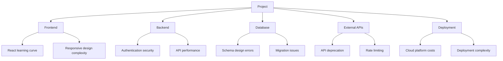

# Risk Assessment

## Introduction

Risk assessment is the systematic process of identifying, analyzing, and planning for potential problems that could impact your project. Every software project faces risks—technical challenges, time constraints, resource limitations, and unexpected obstacles. The difference between successful and failed projects often lies not in avoiding all risks, but in identifying them early and having mitigation strategies ready.

For capstone projects, risk management is particularly crucial because you typically work alone, have fixed deadlines, and may be exploring unfamiliar technologies. A single significant risk that materializes without a mitigation plan can derail your entire project. Proactive risk assessment allows you to make informed decisions, prepare contingencies, and sleep better at night.

## Learning Objectives

By the end of this lesson, you will be able to:

- Identify potential risks across technical, schedule, scope, and resource categories
- Assess risk probability and impact systematically
- Calculate risk exposure and prioritize mitigation efforts
- Develop effective risk mitigation and contingency strategies
- Create and maintain a risk register
- Monitor risks throughout the project lifecycle
- Communicate risks effectively to stakeholders
- Make risk-informed project decisions

## Understanding Project Risks

### Risk vs. Issue

**Risk:**
- Something that might happen in the future
- Has probability (may or may not occur)
- Preventable or mitigatable
- Example: "The API we plan to use might be deprecated"

**Issue:**
- Something that is currently happening
- Has already materialized
- Requires immediate action
- Example: "The API we're using was deprecated yesterday"

**Risk Management:** Proactive, prevents issues
**Issue Management:** Reactive, solves problems

### Risk Categories for Capstone Projects

**Technical Risks:**
- Technology complexity beyond your current skill level
- Integration challenges between components
- Performance or scalability limitations
- Security vulnerabilities
- Third-party API dependencies
- Infrastructure and deployment issues
- Technology becoming obsolete during project

**Schedule Risks:**
- Underestimation of task duration
- Learning curve for new technologies
- Competing academic commitments
- Personal circumstances (illness, family issues)
- Delayed feedback from advisors
- Extended debugging time
- Scope creep consuming time buffer

**Scope Risks:**
- Unclear or changing requirements
- Feature complexity underestimated
- Scope creep from stakeholders or self-imposed
- Perfectionism preventing completion
- MVP not well-defined
- Essential features prove infeasible

**Resource Risks:**
- Limited access to required tools or services
- Cost overruns for paid services
- Hardware limitations
- Loss of work due to inadequate backups
- Insufficient computing resources for testing
- Lack of access to subject matter experts

**External Dependency Risks:**
- Third-party API changes or shutdown
- Database or hosting service outages
- Library or framework breaking changes
- Dependency on other people's availability
- Access to proprietary data or systems
- External service pricing changes

**Quality Risks:**
- Insufficient testing coverage
- Undiscovered bugs in critical paths
- Poor code quality affecting maintainability
- Security vulnerabilities
- Accessibility issues
- Performance problems at scale

## Risk Identification Techniques

### Brainstorming

**Approach:**
1. Schedule dedicated risk identification session
2. Use "What if...?" questions
3. Consider each project phase and component
4. Don't filter or evaluate yet—just list possibilities

**Prompting Questions:**
- What if the technology doesn't work as expected?
- What if I can't learn X in time?
- What if the data I need isn't available?
- What if I get sick for two weeks?
- What if the API changes during development?
- What if performance is too slow?
- What if I can't find users for testing?

### Assumption Analysis

Every project makes assumptions. Each assumption is a potential risk:

**Example Assumptions and Associated Risks:**

| Assumption | Associated Risk |
|------------|-----------------|
| "React is easy to learn" | Learning curve longer than expected |
| "Free tier is sufficient" | Exceeding free tier limits |
| "Users will provide feedback" | Insufficient user testing participants |
| "Deployment is straightforward" | Complex deployment consuming final week |
| "Authentication library works" | Security vulnerabilities in library |

**Process:**
1. List all project assumptions
2. For each assumption, ask "What if this is wrong?"
3. Document the resulting risk

### Historical Analysis

Learn from past projects:

**Your Own History:**
- What went wrong in previous projects?
- What took longer than expected?
- What surprised you?
- What would you do differently?

**Others' Experiences:**
- Ask peers about their capstone challenges
- Read project post-mortems
- Review similar projects on GitHub
- Consult with advisor about common pitfalls

### SWOT Analysis

**Strengths:**
- What advantages do you have?
- What are you good at?
- What resources can you access?

**Weaknesses:**
- What skills are you lacking?
- What resources are you missing?
- What have you struggled with before?

**Opportunities:**
- What favorable conditions exist?
- What can you leverage?
- What external support is available?

**Threats:**
- What could go wrong?
- What obstacles might you face?
- What external factors could impact you?

Weaknesses and Threats often reveal risks.

### Component Analysis

Examine each project component:



For each component, identify specific risks.

## Risk Analysis

### Probability Assessment

Estimate the likelihood of each risk occurring:

**Qualitative Scale:**
- **Very Low (1):** 0-10% chance
- **Low (2):** 10-30% chance
- **Medium (3):** 30-50% chance
- **High (4):** 50-70% chance
- **Very High (5):** 70-100% chance

**Calibration Examples:**
- "API might be deprecated during project" → Low (5%)
- "Will underestimate some tasks" → Very High (90%)
- "Might need extra week for debugging" → High (60%)
- "Hard drive failure losing all work" → Very Low (1% with backups)

### Impact Assessment

Estimate the consequence if the risk materializes:

**Impact Dimensions:**
- **Schedule Impact:** How much delay would this cause?
- **Scope Impact:** Would features need to be cut?
- **Quality Impact:** Would final product quality suffer?
- **Learning Impact:** Would learning objectives be compromised?

**Qualitative Scale:**
- **Very Low (1):** Negligible impact, easily absorbed
- **Low (2):** Minor setback, recoverable within buffer
- **Medium (3):** Noticeable impact, requires adjustment
- **High (4):** Significant impact, major changes needed
- **Very High (5):** Critical impact, project success threatened

**Calibration Examples:**
- "Laptop stolen with no backups" → Very High (project essentially lost)
- "Deployment takes 3 extra hours" → Very Low (minor inconvenience)
- "Need to learn entirely new framework" → High (several weeks delay)
- "UI library has a bug" → Low (workaround likely exists)

### Risk Exposure Calculation

**Risk Exposure = Probability × Impact**

This quantifies which risks deserve the most attention:

| Risk | Probability | Impact | Exposure | Priority |
|------|-------------|--------|----------|----------|
| API deprecated | Low (2) | Very High (5) | 10 | High |
| Task underestimation | Very High (5) | Medium (3) | 15 | Critical |
| Hard drive failure | Very Low (1) | Very High (5) | 5 | Medium |
| UI complexity | Medium (3) | Low (2) | 6 | Medium |
| Deployment issues | High (4) | Medium (3) | 12 | High |

**Prioritization:**
- **15-25:** Critical - Immediate mitigation required
- **10-14:** High - Mitigation plan needed
- **5-9:** Medium - Monitor and prepare contingency
- **1-4:** Low - Accept or monitor

### Risk Matrix Visualization

```mermaid
quadrant-chart
    title Risk Assessment Matrix
    x-axis Low Probability --> High Probability
    y-axis Low Impact --> High Impact
    quadrant-1 Monitor Closely
    quadrant-2 Critical Risks
    quadrant-3 Accept
    quadrant-4 Manage Actively
    API Deprecated: [0.2, 0.9]
    Task Underestimation: [0.9, 0.6]
    Hard Drive Failure: [0.1, 0.9]
    UI Complexity: [0.5, 0.4]
    Deployment Issues: [0.7, 0.6]
    Learning Curve: [0.6, 0.5]
```

**Quadrant Strategy:**
- **Low Probability, Low Impact:** Accept
- **Low Probability, High Impact:** Contingency plan
- **High Probability, Low Impact:** Mitigate
- **High Probability, High Impact:** Immediate action

## Risk Mitigation Strategies

### Four Risk Response Strategies

**1. Avoidance:**
Eliminate the risk by changing approach.

**Example:**
- **Risk:** Third-party API might be deprecated
- **Avoidance:** Build your own service instead of relying on API
- **Trade-off:** More development work, but eliminates dependency risk

**2. Mitigation:**
Reduce probability or impact of the risk.

**Example:**
- **Risk:** Learning curve for React might cause delays
- **Mitigation:** Complete React tutorial before starting project, prototype critical features early
- **Result:** Reduced probability of delays

**3. Transfer:**
Shift the risk to another party.

**Example:**
- **Risk:** Infrastructure management complexity
- **Transfer:** Use managed cloud platform (Heroku, Vercel) instead of AWS EC2
- **Result:** Cloud provider handles infrastructure risk

**4. Acceptance:**
Acknowledge the risk and prepare to deal with it if it occurs.

**Example:**
- **Risk:** Might get sick for a few days
- **Acceptance:** Build buffer time into schedule, can accommodate 3-5 day illness
- **Result:** No action now, respond if it happens

### Specific Mitigation Techniques

**Technical Risk Mitigation:**

**Proof of Concepts:**
Build small prototypes to validate risky technical approaches:
```
Risk: Uncertain if real-time features are feasible
Mitigation: Build WebSocket proof-of-concept in week 2
Timeline: 8 hours
Success Criteria: Basic real-time communication working
```

**Technology Evaluation:**
Research and test before committing:
- Read documentation thoroughly
- Review GitHub issues for known problems
- Check last update date and activity
- Test with sample code before integration

**Architectural Flexibility:**
Design for modularity and swappability:
```
Risk: Email service might not work well
Mitigation: Create email service interface, make implementation swappable
Benefit: Can switch providers without major refactoring
```

**Schedule Risk Mitigation:**

**Buffer Allocation:**
Build explicit buffer into timeline:
- Task-level: Use three-point estimation
- Sprint-level: Plan for 80% capacity
- Project-level: Reserve 20-30% for contingency

**Time Tracking:**
Monitor actual vs. estimated time weekly:
```
Week 3 Review:
- Estimated: 15 hours
- Actual: 19 hours
- Factor: 1.27
- Action: Increase future estimates by 25%
```

**Early Start:**
Begin project as soon as possible:
- More buffer time available
- More time to handle unexpected issues
- Less pressure at the end

**Scope Risk Mitigation:**

**Clear Scope Definition:**
Document and get approval on scope boundaries:
- Written scope statement
- Explicit inclusions and exclusions
- Stakeholder sign-off

**MoSCoW Prioritization:**
Pre-define what can be cut:
```
Must Have: Cannot compromise
Should Have: Can delay if needed
Could Have: Cut if 1 week behind
Won't Have: Explicitly excluded
```

**Change Control:**
Formal process for scope changes:
- Written change request
- Impact analysis
- Approval required
- Trade-offs identified

**Resource Risk Mitigation:**

**Backup Strategy:**
Multiple backup layers:
- Git repository (GitHub, GitLab)
- Daily automated backups
- Weekly external drive backup
- Cloud storage for critical documents

**Free Tier Management:**
Monitor usage proactively:
- Set up usage alerts
- Track consumption weekly
- Stay well below limits
- Have backup service identified

**Cost Contingency:**
Budget for unexpected costs:
- Identify free tier alternatives
- Set maximum budget
- Monitor spending
- Plan to use student credits

**External Dependency Risk Mitigation:**

**Dependency Isolation:**
Wrap external dependencies in abstractions:
```typescript
interface EmailService {
  sendEmail(to: string, subject: string, body: string): Promise<void>;
}

class SendGridEmailService implements EmailService {
  // Implementation
}

class FallbackEmailService implements EmailService {
  // Alternative implementation
}
```

**Version Pinning:**
Lock dependency versions:
```json
{
  "dependencies": {
    "react": "18.2.0",  // Not "^18.2.0"
    "express": "4.18.2"
  }
}
```

**Fallback Options:**
Have plan B for critical dependencies:
```
Primary: SendGrid API for emails
Fallback: Nodemailer with SMTP
Last Resort: Manual email sending for MVP demo
```

## Risk Monitoring and Control

### Risk Register

Maintain a living document tracking all risks:

```markdown
# Project Risk Register

## Risk ID: R001
**Risk:** Learning curve for GraphQL might cause delays
**Category:** Technical
**Probability:** High (70%)
**Impact:** Medium (3)
**Exposure:** 12 (High Priority)
**Status:** Active
**Owner:** Student
**Mitigation Strategy:**
- Complete GraphQL tutorial in week 1
- Build simple proof-of-concept
- Fallback to REST API if needed by week 3
**Contingency Plan:** Switch to REST API if not proficient by week 3 decision point
**Trigger Conditions:** Unable to implement basic queries/mutations after 15 hours
**Last Review:** 2024-01-15
**Notes:** Tutorial completed, feeling more confident. Reducing probability to Medium.

## Risk ID: R002
**Risk:** Third-party weather API might change or be unavailable
**Category:** External Dependency
**Probability:** Low (20%)
**Impact:** Very High (5)
**Exposure:** 10 (High Priority)
**Status:** Active
**Owner:** Student
**Mitigation Strategy:**
- Create abstraction layer for weather service
- Identify two backup weather APIs
- Version pin API calls
**Contingency Plan:** Switch to OpenWeather or Weather.gov API if primary fails
**Trigger Conditions:** API returns errors, documentation mentions deprecation
**Last Review:** 2024-01-10
**Notes:** API stable, no issues. Added usage monitoring.
```

### Regular Risk Reviews

**Weekly Risk Review Process:**

1. **Review Existing Risks:**
   - Has probability or impact changed?
   - Have trigger conditions occurred?
   - Is mitigation working?
   - Should risk be closed?

2. **Identify New Risks:**
   - What new concerns have emerged?
   - What assumptions proved wrong?
   - What unexpected issues arose?

3. **Update Risk Register:**
   - Add new risks
   - Update existing risk assessments
   - Close resolved risks
   - Document changes

4. **Communicate Changes:**
   - Inform advisor of high-priority risks
   - Update stakeholders on significant changes

**Risk Review Template:**
```markdown
## Weekly Risk Review - Week 5

**Date:** 2024-02-05

**Risks Closed:**
- R003: Database schema complexity (resolved by completing schema)

**Risks Added:**
- R007: User testing recruitment challenging
  - Probability: Medium
  - Impact: Medium
  - Mitigation: Post in additional communities, offer incentives

**Risks Updated:**
- R001: GraphQL learning curve
  - Changed probability from High to Low (completed training)
  - Changed status from Active to Monitoring

**Risks Elevated:**
- R004: Testing coverage taking longer than planned
  - Increased impact from Low to Medium
  - Action: Allocate additional time in week 6

**Overall Risk Status:** Yellow (one high-priority risk active)

**Action Items:**
- [ ] Complete GraphQL proof-of-concept by Wed
- [ ] Post user testing recruitment by Fri
- [ ] Review testing approach with advisor
```

### Trigger Conditions and Early Warning

Define specific conditions that indicate a risk is materializing:

**Examples:**

**Risk:** Project falling behind schedule
**Triggers:**
- Two consecutive weeks over estimated hours
- Burndown chart consistently above ideal
- Milestone missed by more than 3 days
**Action:** Activate contingency plan, consider scope reduction

**Risk:** Third-party API issues
**Triggers:**
- API response time exceeds 3 seconds
- Error rate above 5%
- Deprecation notice received
**Action:** Begin migration to backup API

**Risk:** Quality concerns
**Triggers:**
- Test coverage below 60%
- More than 5 critical bugs open
- User feedback indicates major usability issues
**Action:** Dedicate sprint to quality improvement

### Risk Metrics Dashboard

Track key risk indicators:

```markdown
## Risk Dashboard - Week 6

**Overall Risk Level:** Yellow

**Active Risks:** 8
- Critical: 1
- High: 2
- Medium: 3
- Low: 2

**Closed Risks This Week:** 2

**New Risks This Week:** 1

**Risks Requiring Attention:**
- R001: Schedule variance (2 weeks behind)
- R005: Test coverage below target

**Risk Trend:** Improving (was Red last week)

**Schedule Health:** 85% (acceptable)

**Budget Health:** 100% (on track)

**Quality Health:** 75% (needs attention)
```

## Communicating Risks

### Risk Communication Matrix

Different stakeholders need different information:

| Stakeholder | What to Communicate | When | Format |
|-------------|-------------------|------|--------|
| Project Advisor | High/critical risks, changes in status | Weekly | Written report |
| Self | All risks, detailed tracking | Daily/Weekly | Risk register |
| Evaluators | Risks overcome, mitigation success | Final presentation | Summary slide |
| Users/Testers | Quality risks affecting their experience | As needed | Direct communication |

### Risk Reporting Template

**For Advisor:**
```markdown
## Risk Status Report - Week 7

**Overall Status:** Yellow (At Risk)

**Top 3 Risks:**
1. **Schedule Variance** (Critical)
   - Currently 1.5 weeks behind planned timeline
   - Cause: Authentication complexity underestimated
   - Mitigation: Reduced scope (cutting achievement system)
   - Expected Recovery: Week 9

2. **API Rate Limiting** (High)
   - Approaching free tier limits during testing
   - Mitigation: Implementing caching layer
   - May need to budget $15/month if limits exceeded

3. **User Testing Recruitment** (Medium)
   - Only 2 of 5 target users recruited
   - Posting in additional communities
   - Backup: Recruit from classmates

**Risks Resolved:**
- Database migration issues (completed)
- Development environment setup (completed)

**New Risks:**
- None

**Assistance Needed:**
- Advice on scope reduction priority
- Recommendations for user testing recruitment

**Next Steps:**
- Complete authentication by end of week
- Implement API caching
- Recruit 3 more testers
```

### When to Escalate

Escalate to advisor when:
- Critical risk has materialized
- High-priority risk likely to materialize soon
- Multiple risks creating compound effect
- You're unsure how to proceed
- Significant scope or timeline changes needed
- Resource constraints cannot be resolved independently

**Don't:**
- Wait until crisis point
- Hide problems hoping they'll resolve
- Escalate every minor issue
- Present problems without having thought through solutions

**Do:**
- Escalate early when significant
- Prepare options and recommendations
- Be honest about status
- Ask for specific guidance

## Risk Assessment Checklist

### Initial Risk Assessment
- [ ] Brainstorming session completed
- [ ] All major risk categories considered
- [ ] Assumptions identified and analyzed
- [ ] Historical lessons reviewed
- [ ] Component-level analysis done
- [ ] Risks documented in risk register
- [ ] Probability and impact assessed
- [ ] Risk exposure calculated
- [ ] Risks prioritized
- [ ] Mitigation strategies defined
- [ ] Contingency plans created
- [ ] Trigger conditions identified

### Ongoing Risk Management
- [ ] Weekly risk reviews scheduled
- [ ] Risk register updated regularly
- [ ] New risks identified and added
- [ ] Resolved risks closed
- [ ] Status communicated to stakeholders
- [ ] Mitigation strategies executed
- [ ] Effectiveness monitored
- [ ] Adjustments made as needed

## Common Risks and Mitigation Strategies

### Technology Learning Curve

**Risk:** New framework/language takes longer to learn than expected

**Mitigation:**
- Complete tutorials before starting development
- Build proof-of-concepts for risky features
- Allocate learning time in schedule (20-30% extra)
- Have fallback to familiar technology
- Set decision deadline (e.g., "Must be productive by week 3 or switch")

### Third-Party API Dependency

**Risk:** API changes, gets rate-limited, or shuts down

**Mitigation:**
- Abstract API behind interface
- Identify backup APIs before starting
- Pin API versions where possible
- Monitor API status and announcements
- Cache responses to reduce calls
- Stay well within rate limits

### Scope Creep

**Risk:** Project grows beyond manageable size

**Mitigation:**
- Document and lock scope early
- Use formal change control process
- Pre-define must-have vs. nice-to-have
- Regular scope reviews with advisor
- Practice saying no to yourself
- Maintain parking lot for future features

### Time Management

**Risk:** Competing priorities derail progress

**Mitigation:**
- Time block in calendar
- Start early in semester
- Front-load when possible
- Track time weekly
- Communicate with employers/others about key periods
- Build buffer for other obligations

### Data Loss

**Risk:** Work lost due to hardware failure, accidental deletion

**Mitigation:**
- Multiple Git repositories (local + GitHub + GitLab)
- Daily commits
- Automated backups
- Cloud storage for documents
- Test restoration process
- Version control for everything

## Summary

Risk assessment is not about pessimism—it's about preparedness. By systematically identifying potential problems, assessing their likelihood and impact, and developing mitigation strategies, you transform anxiety into action. Effective risk management doesn't eliminate all problems, but it ensures you're rarely caught completely off-guard.

For capstone projects, the most critical risks typically fall into three categories: technical complexity, schedule pressure, and scope creep. Address these proactively through proof-of-concepts, realistic timeline planning with buffer, and strict scope discipline.

Remember that risk management is ongoing. Your risk landscape changes as the project evolves. Regular reviews, honest assessment, and proactive communication are essential. The risks you identify and manage rarely derail you; it's the risks you ignore or don't see coming that cause real problems.

## Additional Resources

- "Waltzing with Bears: Managing Risk on Software Projects" by Tom DeMarco
- PMI's PMBOK Guide - Risk Management section
- "The Lean Startup" by Eric Ries - validated learning and risk reduction
- NASA Risk Management Handbook
- Software Engineering Institute Risk Management resources
- Joel Spolsky's "Evidence-Based Scheduling"
