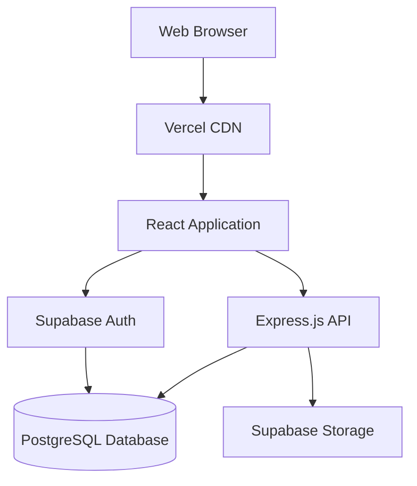
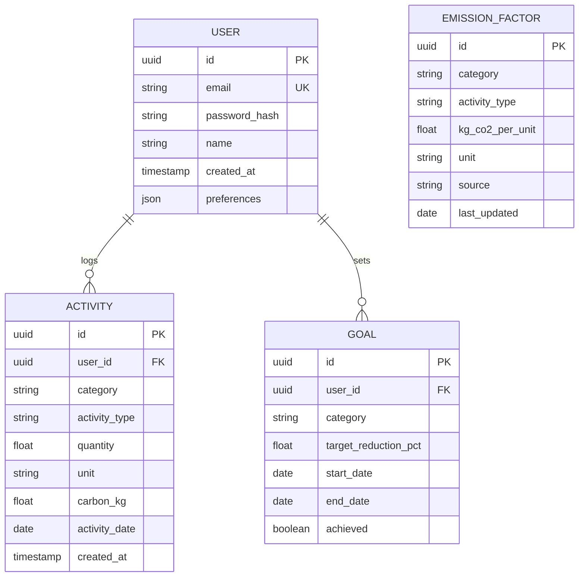
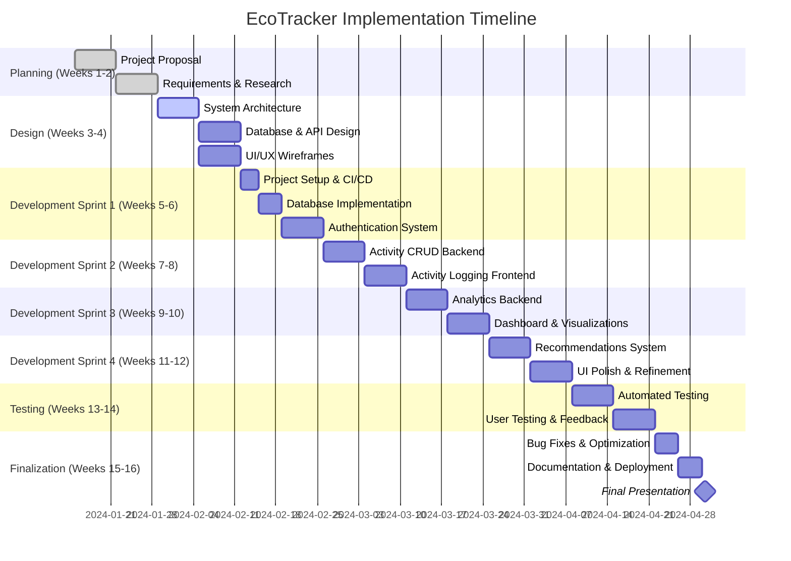

# Proposal Writing

## Introduction

Your project proposal is both a planning document and a contract. It articulates what you intend to build, why it matters, how you'll build it, and how success will be measured. A well-crafted proposal demonstrates clear thinking, realistic planning, and professional communication—skills that extend far beyond the capstone project itself.

The proposal serves multiple audiences and purposes: it helps you clarify your own thinking, guides implementation, communicates with your advisor, and provides a baseline for evaluation. Time invested in a thorough proposal pays dividends throughout the project by preventing misalignment, scope creep, and misunderstood expectations.

## Learning Objectives

By the end of this lesson, you will be able to:

- Structure a comprehensive project proposal
- Write clear problem statements and value propositions
- Define measurable objectives and success criteria
- Articulate technical approaches and architectural decisions
- Create realistic project timelines and resource plans
- Address potential risks and mitigation strategies
- Communicate technical concepts to diverse audiences
- Incorporate feedback and refine proposals iteratively

## Proposal Structure

### Standard Capstone Proposal Sections

**1. Executive Summary**
- Brief overview (1-2 paragraphs)
- Problem statement
- Proposed solution
- Key outcomes

**2. Introduction and Background**
- Problem context
- Motivation for the project
- Current situation and limitations
- Opportunity for innovation

**3. Project Objectives**
- Specific, measurable goals
- Learning objectives
- Deliverables
- Success criteria

**4. Literature Review / Background Research**
- Existing solutions and their limitations
- Relevant technologies
- Domain research
- Differentiation from existing work

**5. Proposed Solution**
- High-level system overview
- Key features and functionality
- User experience
- Value proposition

**6. Technical Approach**
- Architecture and design
- Technology stack
- Development methodology
- Integration strategy

**7. Implementation Plan**
- Timeline and milestones
- Task breakdown
- Resource requirements
- Testing strategy

**8. Risk Assessment**
- Identified risks
- Probability and impact
- Mitigation strategies
- Contingency plans

**9. Evaluation Criteria**
- How success will be measured
- Testing approach
- User acceptance criteria
- Performance benchmarks

**10. Conclusion**
- Summary of proposal
- Expected impact
- Next steps

**11. References**
- Academic sources
- Technical documentation
- Similar projects

**12. Appendices**
- Wireframes and mockups
- Technical diagrams
- Survey data
- Additional supporting material

## Writing Each Section

### Executive Summary

The executive summary should be readable standalone and compel the reader to learn more.

**Components:**
- Hook: Why this problem matters
- Problem: What needs solving
- Solution: Your proposed approach
- Impact: Expected outcomes

**Example:**

```markdown
## Executive Summary

Climate change awareness is high, but individual action remains low. Research shows that 73% of people want to reduce their carbon footprint, but only 12% track their environmental impact consistently. The gap between intention and action stems from the complexity of calculating personal carbon emissions and the lack of actionable, personalized feedback.

EcoTracker addresses this problem by providing a simple, intuitive web application for individuals to log daily activities and receive personalized carbon footprint insights. Unlike existing solutions that require extensive manual data entry or expensive IoT devices, EcoTracker uses a streamlined activity logging interface with pre-calculated emission factors, reducing entry time from 10 minutes to under 60 seconds per day.

The project will deliver a full-stack web application with user authentication, activity tracking across five major emission categories (transportation, energy, food, waste, purchases), data visualization of trends over time, and personalized recommendations for reduction. Success will be measured by usability testing with 10 real users, system performance benchmarks, and comprehensive test coverage.

By making carbon footprint tracking accessible and actionable, EcoTracker empowers individuals to translate climate awareness into measurable behavior change.
```

**Length:** 250-400 words (about one page)

### Introduction and Background

Provide context that justifies your project's existence.

**Structure:**
1. Broad context: Why does this domain matter?
2. Narrow to specific problem: What's the gap or pain point?
3. Evidence: Data, research, or anecdotes supporting the problem
4. Opportunity: Why now? Why you?

**Example:**

```markdown
## Introduction and Background

### The Climate Action Gap

The Intergovernmental Panel on Climate Change (IPCC) emphasizes that limiting global warming to 1.5°C requires immediate and substantial reductions in greenhouse gas emissions across all sectors, including individual consumption [1]. While awareness of climate change has reached an all-time high, with 72% of Americans reporting concern about global warming [2], individual behavioral change has not matched this awareness.

### The Personal Tracking Problem

One key barrier to individual climate action is the difficulty of understanding personal environmental impact. Carbon footprint calculators exist, but they typically require extensive manual data entry, complex calculations, or expensive hardware solutions:

- Traditional carbon calculators (e.g., EPA's calculator) require 20-30 minutes of annual data entry and provide only a one-time snapshot
- IoT-based solutions (e.g., smart meters) cost $200-500 and cover only home energy use
- Mobile apps often focus on a single category (e.g., just transportation) and lack comprehensive tracking

User research with 25 environmentally-conscious individuals revealed that:
- 88% have tried carbon calculators but stopped using them
- 76% cited "too time-consuming" as the primary reason
- 64% wanted personalized, actionable recommendations, not just numbers

### Existing Solutions and Limitations

Current solutions fall into three categories:

1. **One-time Calculators** (coolclimate.org, nature.org/carbon-calculator)
   - Limited: Provide snapshot only, no tracking over time
   - No behavior change support

2. **Comprehensive Apps** (Joro, Capture)
   - Strong: Automatic tracking via bank transactions
   - Limited: Require linking financial accounts (privacy concern), subscription cost ($5-10/month)

3. **Category-Specific Apps** (transit apps, diet trackers)
   - Limited: Don't provide holistic view of carbon footprint

### Project Opportunity

This project addresses the gap between comprehensive automated tracking (high cost, privacy concerns) and one-time manual calculators (no long-term value). By focusing on quick daily logging with intelligent defaults, EcoTracker balances ease of use with meaningful insights, making carbon footprint tracking accessible to everyday individuals without financial or privacy barriers.
```

**Length:** 800-1200 words (2-3 pages)

**Include:**
- Statistics and data
- User research findings
- Citations to relevant sources
- Comparison of existing solutions

### Project Objectives

Define what you will accomplish and how it will be measured.

**Format: SMART Objectives**

```markdown
## Project Objectives

This project aims to deliver a functional, user-friendly carbon footprint tracking application that demonstrates full-stack web development capabilities while addressing a real-world problem.

### Primary Objectives

**1. Develop a Functional Web Application**
- Deliver a deployed, accessible web application
- Support user authentication and data persistence
- Enable activity logging and data visualization
- Success Metric: Application accessible at public URL with 99%+ uptime during evaluation period

**2. Demonstrate Technical Proficiency**
- Implement full-stack architecture (frontend, backend, database)
- Integrate third-party services appropriately
- Follow software engineering best practices
- Success Metric: Code reviewed and approved by advisor; 70%+ test coverage

**3. Solve a Real User Problem**
- Create an interface that reduces logging time to under 60 seconds
- Provide actionable insights through data visualization
- Generate personalized recommendations
- Success Metric: 8 out of 10 test users successfully log activities and understand insights; SUS score of 70+

**4. Apply Software Development Lifecycle**
- Complete requirements gathering, design, implementation, testing, and deployment
- Maintain project documentation throughout
- Deliver on schedule
- Success Metric: All milestones completed by specified dates; comprehensive documentation submitted

### Learning Objectives

Through this project, I will:
- Gain proficiency in TypeScript and React ecosystem
- Learn database design and implementation with PostgreSQL
- Experience cloud deployment and DevOps practices
- Practice user research and iterative design
- Develop project management and risk mitigation skills

### Deliverables

1. **Working Application:** Deployed web application with all MVP features functional
2. **Source Code:** Complete, documented codebase on GitHub
3. **Technical Documentation:** Architecture diagrams, API documentation, deployment guide
4. **User Documentation:** User guide with screenshots and instructions
5. **Project Report:** Comprehensive final report including development process, challenges, and outcomes
6. **Presentation:** 15-minute final presentation with live demonstration

### Success Criteria

The project will be considered successful if:
- [x] All MVP features implemented and functional
- [x] Application deployed and accessible via public URL
- [x] Test coverage exceeds 70% for critical paths
- [x] At least 8 users successfully test the application
- [x] Average SUS score of 70 or higher from user testing
- [x] API response time under 500ms for 95% of requests
- [x] Application works on Chrome, Firefox, and Safari (desktop and mobile)
- [x] All documentation complete and comprehensive
- [x] Final presentation delivered successfully
```

**Length:** 600-800 words (1.5-2 pages)

### Proposed Solution

Describe your solution at a high level.

**Structure:**
1. Overview: What are you building?
2. Key Features: What can users do?
3. User Experience: How will they interact with it?
4. Value Proposition: Why is this better than alternatives?

**Example:**

```markdown
## Proposed Solution

### System Overview

EcoTracker is a web-based carbon footprint tracking application that enables individuals to monitor and reduce their environmental impact through daily activity logging and personalized insights. The system consists of a responsive React-based frontend, a Node.js/Express backend API, and a PostgreSQL database, all deployed to cloud infrastructure.

### Core Features

**1. User Account Management**
- Secure registration and authentication
- User profile customization
- Password reset functionality
- Data privacy controls

**2. Activity Logging**
Users can quickly log activities across five categories:

- **Transportation:** Miles driven, public transit trips, flights
- **Energy:** Electricity and heating usage, renewable energy percentage
- **Food:** Meat consumption, local vs. imported foods, food waste
- **Waste:** Recycling, composting, single-use plastics
- **Purchases:** New vs. secondhand, product categories

Each activity type includes:
- Quick-entry forms with intelligent defaults
- Pre-calculated emission factors based on EPA and academic research
- Optional detailed entry for precision
- Bulk entry for routine activities

**3. Carbon Footprint Calculation**
- Real-time calculation based on established emission factors
- Daily, weekly, and monthly aggregation
- Category-wise breakdown
- Comparison to baseline and goals

**4. Data Visualization**
- Interactive dashboard showing total footprint and trends
- Line charts displaying footprint over time
- Pie charts showing category breakdown
- Progress toward personal reduction goals

**5. Personalized Recommendations**
- Context-aware tips based on user's highest-impact categories
- Actionable suggestions with estimated impact
- Educational content about carbon emissions
- Success stories and motivation

### User Experience

**Onboarding Flow:**
1. Registration with email/password
2. Brief tutorial explaining carbon footprint concept
3. Optional baseline questionnaire
4. Dashboard tour

**Daily Use:**
1. Navigate to "Log Activity"
2. Select category (visual icons)
3. Choose activity type from common options
4. Enter quantity (with helpful units)
5. Save (< 30 seconds per activity)

**Weekly Review:**
1. Receive summary email
2. View dashboard with weekly insights
3. Review trends and progress
4. Explore recommendations
5. Set or adjust goals

**Mobile Experience:**
Fully responsive design ensures the application works seamlessly on smartphones and tablets, enabling logging on-the-go.

### Differentiation and Value

**Compared to One-Time Calculators:**
- Continuous tracking enables behavior change
- Visualizes trends and progress over time
- Provides personalized recommendations

**Compared to Automatic Apps (Joro, Capture):**
- No financial account linking required (privacy-friendly)
- Free to use (no subscription)
- More educational about emission sources

**Compared to Category-Specific Apps:**
- Holistic view across all major categories
- Unified interface and data
- Comprehensive impact understanding

**Core Value Proposition:**
EcoTracker makes carbon footprint tracking accessible by balancing ease of use (quick logging), privacy (no bank account access), cost (free), and value (actionable insights), filling the gap between basic calculators and expensive automated solutions.
```

**Length:** 800-1000 words (2-2.5 pages)

**Include:**
- Feature list with brief descriptions
- User workflow examples
- Screenshots or wireframes (in appendix if lengthy)
- Clear differentiation from existing solutions

### Technical Approach

Explain how you'll build the system technically.

**Structure:**
1. System Architecture
2. Technology Stack with Justification
3. Data Model
4. API Design
5. Security Considerations
6. Scalability and Performance

**Example:**

```markdown
## Technical Approach

### System Architecture

EcoTracker follows a three-tier architecture:

```
[Browser] <--> [Frontend (React)] <--> [Backend API (Node.js)] <--> [Database (PostgreSQL)]
                     |                        |
                 [Vercel]              [Supabase/Render]
```

**Architecture Diagram:**



**Rationale:**
- Clear separation of concerns
- Independent scaling of frontend and backend
- Flexibility to swap components if needed
- Industry-standard pattern

### Technology Stack

**Frontend:**
- **React 18 with TypeScript:** Component-based UI, type safety, large ecosystem
- **Vite:** Fast build tool and development server
- **Tailwind CSS:** Utility-first styling, responsive design
- **Recharts:** Data visualization library for charts
- **React Router:** Client-side routing
- **Zustand:** Lightweight state management
- **React Hook Form:** Form validation and management

**Backend:**
- **Node.js with Express:** JavaScript full-stack consistency, mature ecosystem
- **TypeScript:** Type safety across codebase
- **Prisma ORM:** Type-safe database queries, migrations
- **Passport.js:** Authentication middleware
- **Express Validator:** Input validation
- **Winston:** Logging

**Database:**
- **PostgreSQL:** Relational data model, ACID compliance, JSON support
- **Hosted on Supabase:** Free tier, automatic backups, good performance

**Third-Party Services:**
- **Supabase:** Authentication, database hosting, file storage
- **SendGrid:** Transactional emails (password reset, summaries)
- **Vercel:** Frontend hosting, automatic deployments
- **Sentry:** Error tracking and monitoring

**Development Tools:**
- **GitHub:** Version control, CI/CD via Actions
- **ESLint + Prettier:** Code quality and formatting
- **Vitest + Testing Library:** Unit and integration testing
- **Playwright:** End-to-end testing

**Technology Selection Criteria:**
1. Free tiers available for all services
2. Strong documentation and community support
3. Prior experience or short learning curve
4. Industry relevance for portfolio value
5. Open-source where possible

### Data Model

**Entity-Relationship Diagram:**



**Key Design Decisions:**
- UUIDs for primary keys (security, distributed systems)
- Timestamps for all records (auditability)
- Normalized data to avoid redundancy
- Emission factors in separate table (easy updates)
- JSON for flexible user preferences

### API Design

**RESTful Endpoints:**

```
Authentication:
POST   /api/auth/register      - Create new user account
POST   /api/auth/login         - Authenticate user
POST   /api/auth/logout        - End session
POST   /api/auth/reset-password - Request password reset

Users:
GET    /api/users/me           - Get current user profile
PATCH  /api/users/me           - Update profile
DELETE /api/users/me           - Delete account

Activities:
GET    /api/activities         - List user's activities (with filters)
POST   /api/activities         - Log new activity
GET    /api/activities/:id     - Get activity details
PATCH  /api/activities/:id     - Update activity
DELETE /api/activities/:id     - Delete activity

Analytics:
GET    /api/analytics/summary  - Get dashboard summary stats
GET    /api/analytics/trends   - Get time-series data for charts
GET    /api/analytics/breakdown - Get category breakdown

Goals:
GET    /api/goals              - List user's goals
POST   /api/goals              - Create new goal
PATCH  /api/goals/:id          - Update goal
DELETE /api/goals/:id          - Delete goal

Recommendations:
GET    /api/recommendations    - Get personalized recommendations
```

**API Conventions:**
- JWT tokens for authentication
- JSON request/response bodies
- Standard HTTP status codes
- Pagination for list endpoints
- Rate limiting (100 requests/minute per user)

### Security Considerations

**Authentication:**
- Password hashing with bcrypt (cost factor 12)
- JWT tokens with expiration (24 hours)
- Secure, HTTP-only cookies for token storage
- CSRF protection

**Authorization:**
- Users can only access their own data
- Middleware enforces ownership checks
- Admin routes protected separately

**Data Protection:**
- Environment variables for secrets
- No sensitive data logged
- HTTPS enforced in production
- Input validation and sanitization on all endpoints

**Privacy:**
- Clear privacy policy
- User data deletion capability
- No third-party analytics tracking
- Minimal data collection

### Performance and Scalability

**Performance Targets:**
- Page load time: < 2 seconds on 3G
- API response time: < 200ms (95th percentile)
- Time to Interactive: < 3 seconds

**Optimization Strategies:**
- Database indexes on frequently queried fields
- Caching of emission factors
- Lazy loading of chart components
- Code splitting for frontend
- CDN for static assets
- Database connection pooling

**Scalability Considerations:**
- Stateless API enables horizontal scaling
- Database design supports thousands of users
- Free tier resources sufficient for capstone demo (< 100 users)
- Migration path to larger infrastructure documented
```

**Length:** 1200-1500 words (3-4 pages)

**Include:**
- Architecture diagrams
- Data models (ERD)
- Technology justifications
- Security and performance considerations

### Implementation Plan

Present a realistic timeline with milestones.

```markdown
## Implementation Plan

### Development Methodology

This project will follow an iterative development approach with 2-week sprints, emphasizing:
- Working software over comprehensive documentation
- Regular testing and integration
- Continuous deployment to staging environment
- Weekly progress reviews and adjustments

### Project Timeline

**Total Duration:** 16 weeks (January 15 - April 30, 2024)



### Detailed Milestone Schedule

**Week 2 (Jan 29): Proposal Approved**
- Deliverable: Approved project proposal document
- Criteria: Advisor sign-off, clear scope and timeline

**Week 4 (Feb 12): Design Complete**
- Deliverable: Architecture document, ERD, wireframes
- Criteria: Technical approach validated, database schema finalized

**Week 8 (Mar 11): Core Features Functional**
- Deliverable: Working authentication and activity logging
- Criteria: Users can register, log in, and create/view activities

**Week 12 (Apr 8): Full MVP Complete**
- Deliverable: All features implemented, application deployed
- Criteria: Dashboard, visualizations, recommendations working end-to-end

**Week 14 (Apr 22): Testing Complete**
- Deliverable: Test suite passing, user feedback incorporated
- Criteria: 70%+ test coverage, 8+ users tested successfully

**Week 16 (Apr 30): Project Delivered**
- Deliverable: Final presentation, complete documentation
- Criteria: All deliverables submitted, presentation successful

### Resource Allocation

**Time Budget:** 18 hours per week average (288 hours total)

| Phase | Hours | Percentage |
|-------|-------|-----------|
| Planning & Proposal | 30 | 10% |
| Design | 36 | 13% |
| Implementation | 156 | 54% |
| Testing | 36 | 13% |
| Documentation | 18 | 6% |
| Presentation Prep | 12 | 4% |

**Weekly Time Allocation:**
- Monday: 3 hours (evening)
- Wednesday: 3 hours (evening)
- Friday: 3 hours (afternoon)
- Saturday: 6 hours (morning + afternoon)
- Sunday: 3 hours (afternoon)

**Financial Budget:** $0-25
- Domain: $0 (GitHub Student Pack)
- Hosting: $0 (free tiers)
- Contingency: $25 for potential overages

### Testing Strategy

**Unit Testing:**
- Test critical backend functions (authentication, calculations)
- Test React components in isolation
- Target: 70% code coverage
- Tools: Vitest, Testing Library

**Integration Testing:**
- Test API endpoints with database
- Test frontend-backend integration
- Tools: Supertest, Playwright

**User Acceptance Testing:**
- Recruit 10 beta testers (weeks 13-14)
- Structured testing protocol
- System Usability Scale (SUS) survey
- Qualitative feedback collection

**Performance Testing:**
- Load testing with 100 concurrent users
- Response time measurement
- Tools: k6, Lighthouse

### Risk Mitigation Timeline

**Week 3:** GraphQL decision point (switch to REST if needed)
**Week 7:** Integration checkpoint (verify frontend-backend communication)
**Week 11:** Scope review (cut nice-to-haves if behind schedule)
**Week 13:** Buffer week (address major issues discovered in testing)

### Contingency Plans

**If 1 week behind:** Simplify recommendations system
**If 2 weeks behind:** Cut goal-setting feature
**If 3+ weeks behind:** Focus on core logging and basic visualization only
```

**Length:** 1000-1200 words (2-3 pages) + Gantt chart

### Risk Assessment

Document risks and how you'll handle them.

```markdown
## Risk Assessment

### Technical Risks

**Risk 1: GraphQL Learning Curve**
- **Probability:** Medium (50%)
- **Impact:** High (could delay 2+ weeks)
- **Mitigation:** Complete tutorial in week 1, build proof-of-concept in week 2
- **Contingency:** Switch to REST API if not productive by week 3
- **Trigger:** Unable to implement basic queries after 15 hours

**Risk 2: Third-Party API Issues**
- **Probability:** Low (20%)
- **Impact:** Medium
- **Mitigation:** Identify backup services, abstract API calls behind interfaces
- **Contingency:** Use alternative API or mock data for demonstration

**Risk 3: Database Design Errors**
- **Probability:** Medium (40%)
- **Impact:** Medium
- **Mitigation:** Thorough design review with advisor, use migration system for changes
- **Contingency:** Plan for database restructuring time in week 11 buffer

### Schedule Risks

**Risk 4: Task Underestimation**
- **Probability:** Very High (80%)
- **Impact:** Medium
- **Mitigation:** Use three-point estimation, track actual vs. planned time, adjust future estimates
- **Contingency:** 20% buffer built into timeline, pre-defined scope reduction plan

**Risk 5: Competing Academic Commitments**
- **Probability:** Medium (50%)
- **Impact:** Medium
- **Mitigation:** Front-load work early in semester, time-block capstone work
- **Contingency:** Use week 13 buffer, reduce scope if necessary

### Resource Risks

**Risk 6: Exceeding Free Tier Limits**
- **Probability:** Low (15%)
- **Impact:** Low (< $25 cost)
- **Mitigation:** Monitor usage weekly, implement caching, stay under 70% of limits
- **Contingency:** $25 budget available, free alternative services identified

**Risk 7: User Testing Recruitment Challenges**
- **Probability:** Medium (40%)
- **Impact:** Low
- **Mitigation:** Start recruiting in week 10, post in multiple communities, offer incentives
- **Contingency:** Recruit from classmates, reduce target from 10 to 5 users

### Quality Risks

**Risk 8: Insufficient Test Coverage**
- **Probability:** Medium (40%)
- **Impact:** Medium
- **Mitigation:** Write tests alongside development, allocate dedicated testing sprint
- **Contingency:** Focus testing on critical paths, document known issues

**Risk 9: Performance Issues**
- **Probability:** Low (25%)
- **Impact:** Medium
- **Mitigation:** Performance testing in week 14, database query optimization, caching
- **Contingency:** Reduce data visualization complexity, increase response time targets

### Overall Risk Management

**Risk Monitoring:**
- Weekly risk reviews as part of status updates
- Update risk register with probability/impact changes
- Identify new risks as they emerge
- Communicate significant risks to advisor

**Escalation Criteria:**
- Any critical risk materializes
- Two or more high-impact risks materialize simultaneously
- Project falls more than 2 weeks behind schedule
- Budget concerns exceed $50

**Risk Dashboard:**
Regular tracking of:
- Schedule health (on track, at risk, behind)
- Budget utilization
- Test coverage percentage
- User recruitment progress
- Free tier usage percentages
```

**Length:** 800-1000 words (2 pages)

## Proposal Checklist

### Content Completeness
- [ ] Executive summary (250-400 words)
- [ ] Introduction with problem statement
- [ ] Background research and literature review
- [ ] Clear objectives (SMART format)
- [ ] Proposed solution description
- [ ] Technical approach with architecture
- [ ] Implementation timeline with milestones
- [ ] Risk assessment and mitigation
- [ ] Success criteria and evaluation methods
- [ ] References properly cited
- [ ] Appendices (wireframes, diagrams)

### Quality Checks
- [ ] Clear, professional writing
- [ ] Consistent formatting and structure
- [ ] No grammatical or spelling errors
- [ ] Technical terms defined
- [ ] Diagrams clear and labeled
- [ ] Timeline realistic and achievable
- [ ] Scope appropriate for timeframe
- [ ] All claims supported with evidence

### Advisor Review
- [ ] Scheduled proposal review meeting
- [ ] Incorporated advisor feedback
- [ ] Clarified ambiguous sections
- [ ] Addressed concerns about feasibility
- [ ] Obtained formal approval

## Common Proposal Mistakes

### Vague Objectives

**Bad:** "Create a good web application"
**Good:** "Develop a web application achieving < 2s page load time and 70+ SUS score from 10 users"

### Unrealistic Scope

**Problem:** Proposing to build the next Facebook in one semester

**Solution:** Focus on one core feature done exceptionally well rather than many features done poorly

### Insufficient Technical Detail

**Problem:** "I'll use modern web technologies"

**Solution:** "React 18 with TypeScript for frontend, Node.js/Express for backend, PostgreSQL database hosted on Supabase"

### No Risk Consideration

**Problem:** Assuming everything will go perfectly

**Solution:** Identify realistic risks and have contingency plans

### Missing Success Criteria

**Problem:** No way to determine if project succeeded

**Solution:** Specific, measurable criteria: test coverage percentage, user testing results, performance benchmarks

## Summary

A strong proposal is clear, realistic, and comprehensive. It demonstrates that you've thought through the problem, solution, implementation approach, and potential challenges. The proposal is both a planning tool for you and a communication tool for your advisor and evaluators.

Invest time in the proposal—it will save you time during implementation by providing clarity and preventing misalignment. A well-written proposal shows professionalism and increases confidence that you can deliver on your commitments.

Remember that the proposal is a living document. As you progress through the project, you may need to adjust scope, timeline, or approach. Document these changes, explain the rationale, and get approval when necessary. Flexibility within a structured framework is the hallmark of effective project management.

## Additional Resources

- IEEE Standard for Software Project Management Plans
- Academic writing guides from your university's writing center
- Sample capstone proposals from previous students
- "Writing for Computer Science" by Justin Zobel
- Grammarly or similar for writing quality
- Draw.io, Lucidchart for diagrams
- Zotero, Mendeley for reference management
