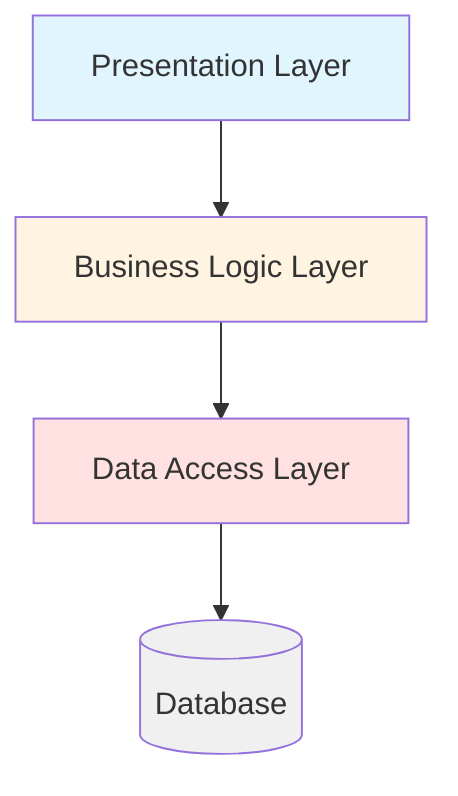
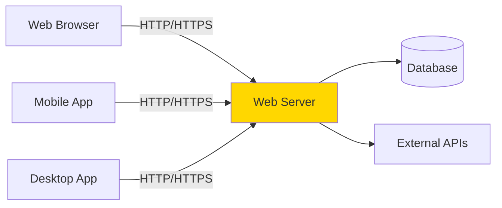
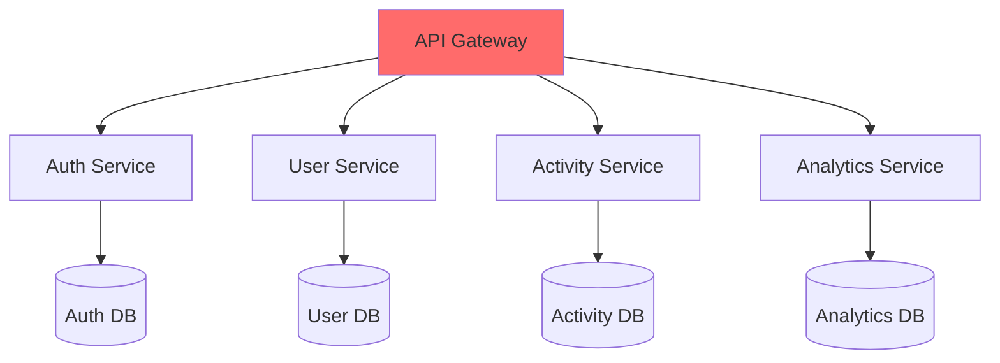
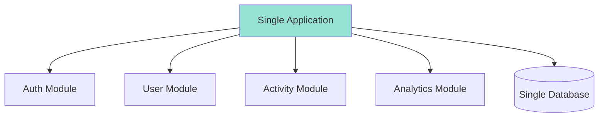
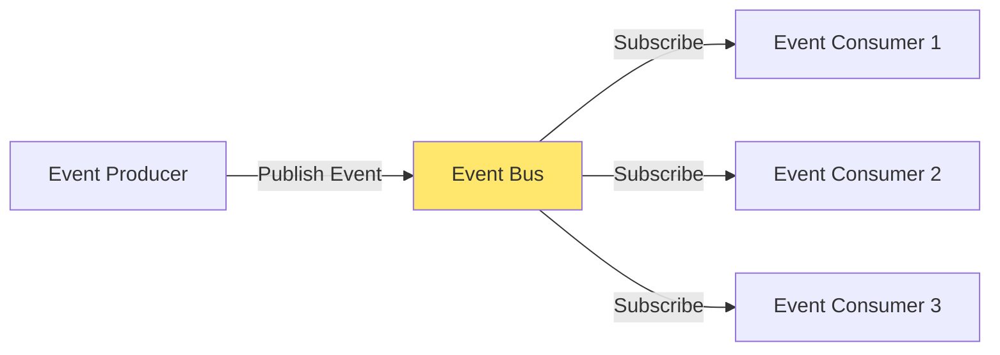
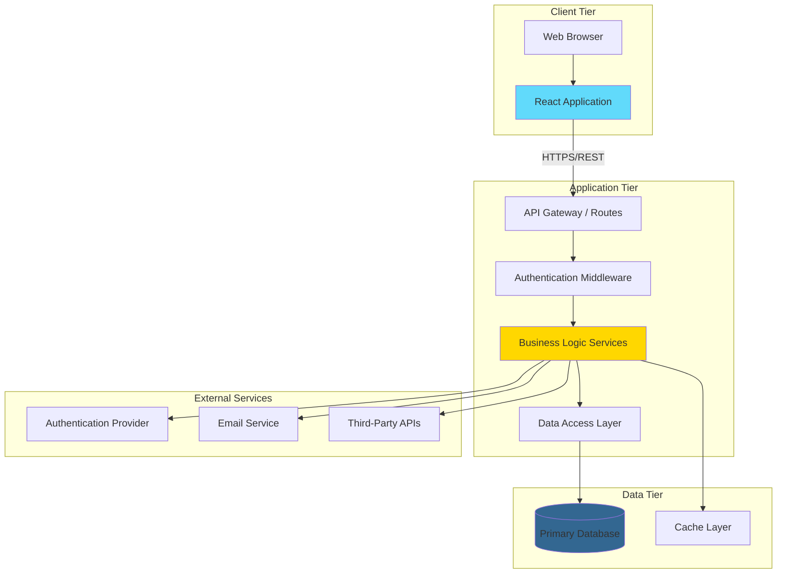
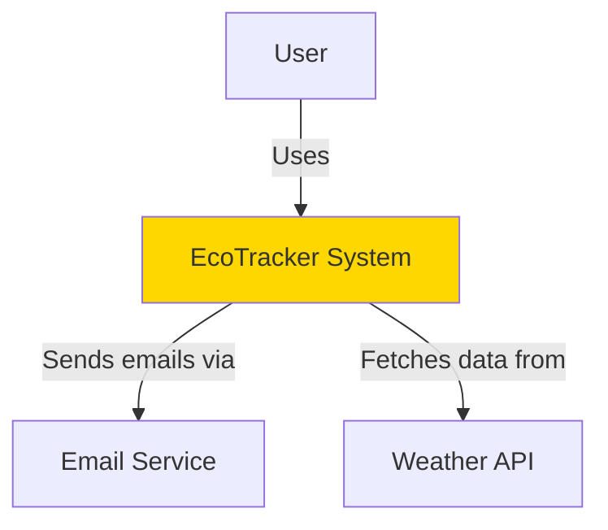
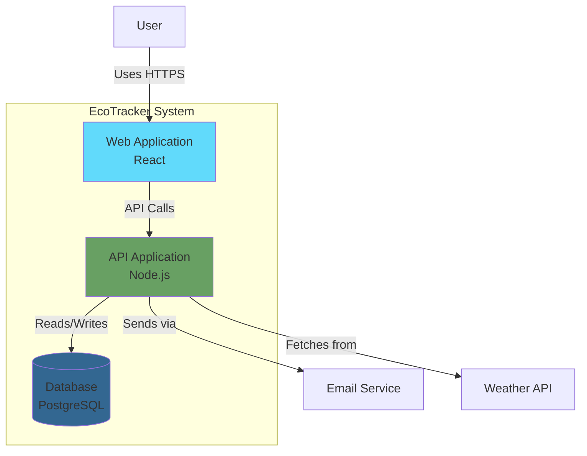
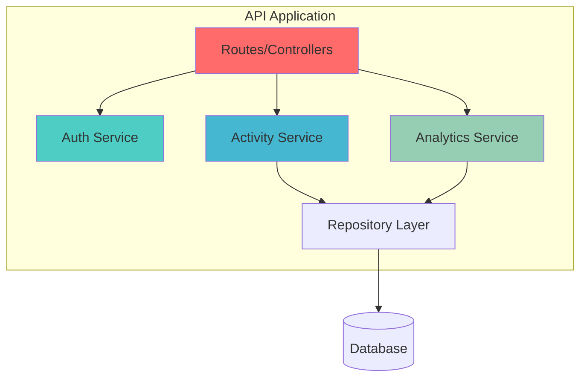

# System Architecture

## Introduction

System architecture is the high-level structure of your software—the fundamental organization of components, their relationships, and the principles governing their design and evolution. Good architecture makes your system understandable, maintainable, testable, and scalable. Poor architecture leads to technical debt, complexity spirals, and eventual system failure.

For capstone projects, architecture might seem like over-engineering, but even small projects benefit from thoughtful structure. The key is finding the right balance: enough architecture to provide clarity and flexibility, but not so much complexity that it becomes a burden for a solo developer with limited time.

## Learning Objectives

By the end of this lesson, you will be able to:

- Understand common architectural patterns and their trade-offs
- Design a system architecture appropriate for your project scale
- Create clear architectural diagrams using standard notations
- Make and document architectural decisions
- Balance architectural quality attributes (performance, maintainability, scalability)
- Apply separation of concerns and modularity principles
- Evolve architecture iteratively without over-engineering

## Architectural Thinking

### What is Architecture?

**System architecture defines:**
- Major components and their responsibilities
- Interfaces between components
- Data flow and communication patterns
- Technology choices and their rationale
- Quality attributes and trade-offs

**Architecture is NOT:**
- Every class and function (that's detailed design)
- The final, unchangeable structure (architecture evolves)
- Just diagrams (it's about decisions and principles)
- Optional for small projects (structure always matters)

### Why Architecture Matters

**For Capstone Projects:**

**Clarity:**
- Helps you understand what you're building
- Makes development decisions easier
- Provides a roadmap for implementation

**Communication:**
- Explains your system to advisors and evaluators
- Demonstrates systems thinking
- Shows professional software engineering practices

**Quality:**
- Supports testability and maintainability
- Enables performance optimization
- Facilitates future extensions

**Risk Mitigation:**
- Identifies technical challenges early
- Reveals integration complexity
- Highlights architectural risks

### Architectural Principles

**Separation of Concerns:**
Different parts of the system should handle different responsibilities.

**Example:**
```
✗ Bad: Frontend component directly writes to database
✓ Good: Frontend → API → Service Layer → Database
```

**Modularity:**
Break system into independent, cohesive modules.

**Benefits:**
- Easier to understand each piece
- Can test components in isolation
- Can replace or upgrade parts independently
- Parallel development possible

**Single Responsibility:**
Each component should have one clear purpose.

**Example:**
```
✗ Bad: UserController handles auth, profile, payments, notifications
✓ Good: Separate controllers for auth, profile, payments, notifications
```

**Dependency Management:**
Control how components depend on each other.

**Prefer:**
- High-level modules don't depend on low-level details
- Depend on abstractions, not concretions
- Avoid circular dependencies

**Don't Repeat Yourself (DRY):**
Avoid duplicating logic across the system.

**Trade-off:** Balance with over-abstraction. Sometimes a little duplication is better than wrong abstraction.

## Common Architectural Patterns

### Layered (N-Tier) Architecture

**Structure:**
System organized into horizontal layers, each with specific responsibility.



**Typical Layers:**

**Presentation Layer:**
- User interface
- Input validation
- Display formatting
- Example: React components

**Business Logic Layer:**
- Core application logic
- Business rules
- Domain models
- Example: Service classes

**Data Access Layer:**
- Database operations
- Data persistence
- Query logic
- Example: Repository classes, ORM

**Rules:**
- Each layer only communicates with layer directly below
- No skipping layers
- Data flows through layers

**Advantages:**
- Clear separation of concerns
- Easy to understand
- Testable layers
- Can replace layers independently

**Disadvantages:**
- Can be overly rigid
- May add unnecessary indirection
- Performance overhead from layer traversal

**When to Use:**
- Traditional web applications
- CRUD-heavy applications
- Team familiar with pattern
- Clear distinction between UI, logic, data

**Capstone Example:**
```
Frontend (React)
    ↓
API Layer (Express routes)
    ↓
Service Layer (Business logic)
    ↓
Repository Layer (Prisma ORM)
    ↓
Database (PostgreSQL)
```

### Client-Server Architecture

**Structure:**
Clients request services from centralized servers.



**Characteristics:**
- Clear separation between client and server
- Clients are typically "thin" (UI only)
- Server contains business logic and data
- Communication via network protocols

**Advantages:**
- Centralized data and logic
- Multiple client types possible
- Easier to update server
- Better security (sensitive logic on server)

**Disadvantages:**
- Network dependency
- Server becomes bottleneck
- Requires API design

**When to Use:**
- Web and mobile applications (most capstone projects)
- Multiple client platforms
- Centralized data management needed

### Microservices Architecture

**Structure:**
Application as collection of loosely coupled, independently deployable services.



**Characteristics:**
- Each service is independent application
- Services communicate via APIs
- Each service has own database
- Can use different technologies per service

**Advantages:**
- Independent deployment and scaling
- Technology flexibility
- Team autonomy (if multiple teams)
- Fault isolation

**Disadvantages:**
- Increased complexity
- Distributed system challenges
- More infrastructure overhead
- Harder to debug

**For Capstone:**
**Generally AVOID** unless you have specific reasons:
- Too complex for solo developer
- Deployment overhead
- Limited time

**Exception:** Consider for learning microservices specifically, but keep simple (2-3 services max).

### Monolithic Architecture

**Structure:**
Single deployable unit containing all functionality.



**Characteristics:**
- All code in one repository and deployment
- Shared database
- Tight coupling between features
- Single technology stack

**Advantages:**
- Simple to develop and deploy
- Easy to debug
- No network latency between components
- Simpler testing

**Disadvantages:**
- Can become large and hard to understand
- Scaling requires scaling entire app
- Changes require full redeployment
- Technology lock-in

**For Capstone:**
**RECOMMENDED for most projects:**
- Appropriate for scope
- Simpler to manage alone
- Faster development
- Easier deployment

**Can still be well-architected:**
- Modular code organization
- Clear boundaries between features
- Preparation for future extraction if needed

### Event-Driven Architecture

**Structure:**
Components communicate through events.



**Characteristics:**
- Components don't directly call each other
- Publish events when something happens
- Consumers subscribe to events of interest
- Asynchronous communication

**Advantages:**
- Loose coupling
- Easy to add new consumers
- Scalable
- Natural fit for certain domains

**Disadvantages:**
- Harder to trace flow
- Eventual consistency challenges
- Debugging complexity
- Requires message broker

**For Capstone:**
**Use selectively:**
- Good for specific features (notifications, audit logs)
- Avoid as primary architecture (complexity)
- Consider in-process events (not distributed message queues)

**Example Use Case:**
```
User creates activity
    → Event: ActivityCreated
        → Update analytics
        → Recalculate carbon footprint
        → Check if goal achieved
        → Send notification if milestone reached
```

## Designing Your Architecture

### Architecture Design Process

**1. Understand Requirements**
- Functional requirements (features)
- Non-functional requirements (performance, security, scalability)
- Constraints (time, budget, technology)

**2. Identify Key Architectural Drivers**

What requirements significantly influence architecture?

**Examples:**
- "Must support 1000 concurrent users" → Scalability driver
- "Must work offline" → Client architecture driver
- "Must integrate with 5 external APIs" → Integration architecture driver
- "Response time < 200ms" → Performance driver

**3. Choose Architectural Patterns**

Based on drivers, select appropriate patterns:
- Most capstone projects: Layered monolith with client-server
- Real-time features: Add WebSocket server
- Complex data processing: Add background job processor

**4. Define Major Components**

Identify main building blocks:
- Frontend application
- Backend API
- Database
- External service integrations
- Authentication service
- Background workers (if needed)

**5. Specify Interfaces**

Define how components communicate:
- REST API endpoints
- GraphQL schema
- WebSocket messages
- Database schema
- Event contracts

**6. Address Quality Attributes**

Ensure architecture supports:
- Performance requirements
- Security requirements
- Scalability needs
- Maintainability goals
- Testability requirements

**7. Document Decisions**

Record architectural decisions and rationale.

### Capstone Architecture Template

**For typical web applications:**



**Component Responsibilities:**

**Frontend (React Application):**
- User interface rendering
- User input handling
- Client-side validation
- State management
- API communication

**API Gateway / Routes:**
- Request routing
- Input validation
- Error handling
- Response formatting
- Rate limiting

**Authentication Middleware:**
- JWT token validation
- User session management
- Authorization checks

**Business Logic Services:**
- Core application logic
- Business rule enforcement
- Data transformation
- Calculations and algorithms

**Data Access Layer:**
- Database queries
- Data persistence
- Transaction management
- Data model mapping

**Primary Database:**
- Data storage
- Data integrity enforcement
- Query execution

**Cache Layer:**
- Frequently accessed data
- Session storage
- Rate limiting data

**External Services:**
- Authentication providers (OAuth)
- Email sending
- SMS notifications
- Third-party APIs

## Technology Stack Decisions

### Frontend Technology

**Options:**

**React:**
- Pros: Large ecosystem, component-based, great for SPAs
- Cons: Learning curve, need additional routing/state libraries
- Use when: Building interactive, dynamic UIs

**Vue:**
- Pros: Gentle learning curve, comprehensive framework
- Cons: Smaller ecosystem than React
- Use when: Want simpler framework, prefer integrated solutions

**Svelte:**
- Pros: No virtual DOM, excellent performance, simple syntax
- Cons: Smaller community, fewer resources
- Use when: Performance critical, want modern approach

**Plain HTML/CSS/JS:**
- Pros: No dependencies, simple, fast
- Cons: Repetitive, no components, harder to maintain
- Use when: Very simple UI, learning fundamentals

**Decision Framework:**
```
Interactive, complex UI → React or Vue
Simple, content-focused → Plain HTML/CSS or framework
Learning focus → Try Svelte
Portfolio value → React (most jobs)
```

### Backend Technology

**Node.js (Express):**
- Pros: JavaScript full-stack, large ecosystem, non-blocking I/O
- Cons: Callback hell potential, single-threaded
- Use when: JavaScript expertise, I/O-bound operations, real-time features

**Python (FastAPI/Django):**
- Pros: Clean syntax, great for data/ML, comprehensive frameworks
- Cons: Slower than compiled languages, GIL limitations
- Use when: Data processing, ML integration, rapid development

**Go:**
- Pros: Fast, concurrent, compiled, simple deployment
- Cons: Verbose, smaller web ecosystem
- Use when: Performance critical, learning Go, high concurrency

**Java (Spring Boot):**
- Pros: Enterprise-grade, mature ecosystem, strong typing
- Cons: Verbose, heavier resource usage
- Use when: Enterprise focus, prior Java experience

**Decision Framework:**
```
Full-stack JavaScript → Node.js
Data/ML heavy → Python
Performance critical → Go
Enterprise focus → Java
```

### Database Technology

**PostgreSQL:**
- Pros: Full-featured, reliable, open-source, great for complex queries
- Cons: More complex than some alternatives
- Use when: Relational data, complex queries, data integrity important

**MySQL:**
- Pros: Simple, popular, good performance
- Cons: Fewer features than PostgreSQL
- Use when: Simple relational data, prefer simplicity

**MongoDB:**
- Pros: Flexible schema, good for rapid iteration, JSON-native
- Cons: No transactions (older versions), can lead to messy data
- Use when: Unstructured data, rapid schema changes, document-oriented

**SQLite:**
- Pros: Zero configuration, serverless, simple
- Cons: Limited concurrency, not for production scale
- Use when: Development only, very simple projects, local-only apps

**Decision Framework:**
```
Structured, relational data → PostgreSQL or MySQL
Flexible, document-based → MongoDB
Development/testing → SQLite
Learning SQL → PostgreSQL
```

## Architecture Documentation

### C4 Model

Hierarchical approach to architecture diagrams:

**Level 1: Context Diagram**
Shows system in context with users and external systems.



**Level 2: Container Diagram**
Shows major containers (applications, databases).



**Level 3: Component Diagram**
Shows components within a container.



**Level 4: Code Diagram**
Class diagrams, sequence diagrams (usually not needed for capstone proposals).

### Architecture Decision Records (ADRs)

Document significant architectural decisions:

```markdown
# ADR 001: Use PostgreSQL for Primary Database

## Status
Accepted

## Context
We need to choose a database for storing user data, activities, and analytics. Key requirements:
- Support for complex queries (joins, aggregations)
- Data integrity and ACID transactions
- Good TypeScript ORM support
- Free hosting options available

## Decision
We will use PostgreSQL as the primary database.

## Consequences

### Positive
- Full SQL feature set for complex queries
- Strong data integrity guarantees
- Excellent Prisma ORM support
- Available on Supabase free tier
- Well-documented and widely used
- Good performance for our scale

### Negative
- Slightly more complex than simpler alternatives
- Must design schema upfront (less flexible than NoSQL)
- Requires understanding of SQL and relational design

### Neutral
- Need to learn Prisma ORM (estimated 4-6 hours)
- Must set up migrations for schema changes

## Alternatives Considered

### MongoDB
- Rejected: Don't need flexible schema, relational model fits better
- Analytics queries easier with SQL

### MySQL
- Considered: Very similar to PostgreSQL
- PostgreSQL chosen for slightly richer feature set and better JSON support

### SQLite
- Rejected: Not suitable for cloud deployment
- Good for development, but need production solution
```

**ADR Template:**
```markdown
# ADR [number]: [Title]

## Status
[Proposed | Accepted | Deprecated | Superseded]

## Context
[What is the issue we're addressing?]
[What factors are influencing this decision?]
[What requirements drive this?]

## Decision
[What we decided to do]

## Consequences
### Positive
[Good outcomes from this decision]

### Negative
[Drawbacks or costs of this decision]

### Neutral
[Other implications]

## Alternatives Considered
[What other options did we consider?]
[Why did we reject them?]
```

## Architecture Quality Attributes

### Performance

**Considerations:**
- Response time requirements
- Throughput needs
- Resource utilization

**Architecture Decisions:**
- Caching strategy
- Database indexing
- Asynchronous processing
- CDN for static assets
- Code splitting

**Example:**
```
Requirement: Dashboard loads in < 2 seconds

Architecture Response:
- Cache expensive queries (Redis)
- Lazy load chart components
- CDN for static assets
- Database indexes on common queries
- Pagination for large datasets
```

### Scalability

**Considerations:**
- Current user load
- Expected growth
- Scaling strategy (vertical vs. horizontal)

**For Capstone:**
- Usually not critical (< 100 users)
- Design for reasonable scale, but don't over-engineer
- Document scaling path for future

**Example:**
```
Current: < 50 users
Architecture: Monolith on single server (appropriate)

Future Scaling Path (documented, not implemented):
1. Add database read replicas
2. Horizontal API server scaling
3. Separate cache layer
4. CDN for global distribution
```

### Security

**Considerations:**
- Authentication mechanism
- Authorization model
- Data encryption
- Input validation
- API security

**Architecture Decisions:**
```
Authentication: JWT tokens
Authorization: Role-based (user, admin)
Data Protection: HTTPS, encrypted passwords, env variables
Input Validation: At API boundary
API Security: Rate limiting, CORS configuration
```

### Maintainability

**Considerations:**
- Code organization
- Separation of concerns
- Documentation
- Testing strategy

**Architecture Support:**
```
Code Organization: Layered architecture
Modularity: Feature-based structure
Documentation: ADRs, API docs, code comments
Testing: Unit tests for services, integration tests for APIs
```

### Testability

**Architecture enables testing:**

```
Good Architecture:
- Services have single responsibility
- Dependencies injected
- Database abstracted behind repository
- External APIs mockable

Bad Architecture:
- Direct database calls scattered everywhere
- Tight coupling between components
- Hard-coded dependencies
- No interfaces or abstractions
```

## Architecture Checklist

### Design Phase
- [ ] Requirements understood (functional and non-functional)
- [ ] Architectural drivers identified
- [ ] Appropriate patterns selected
- [ ] Major components defined
- [ ] Component responsibilities clear
- [ ] Interfaces specified
- [ ] Technology stack selected and justified
- [ ] Quality attributes addressed

### Documentation
- [ ] Context diagram created
- [ ] Container diagram created
- [ ] Component diagram created (for complex parts)
- [ ] Architecture decisions documented (ADRs)
- [ ] Technology stack documented
- [ ] Data flow described
- [ ] Deployment architecture shown

### Quality Checks
- [ ] Architecture supports all requirements
- [ ] Performance considerations addressed
- [ ] Security measures defined
- [ ] Scalability path clear
- [ ] Testing strategy enabled
- [ ] Trade-offs understood and documented
- [ ] Risks identified

### Advisor Review
- [ ] Architecture reviewed with advisor
- [ ] Concerns addressed
- [ ] Feasibility confirmed
- [ ] Approval obtained

## Summary

System architecture is about making deliberate, documented decisions about how your software is organized. For capstone projects, the goal is appropriate architecture—not the most sophisticated, but the right level of structure for your scope, timeline, and skills.

Most capstone web applications benefit from a layered monolithic architecture with clear separation between frontend, API, and data layers. This provides structure without overwhelming complexity. Document your architecture through diagrams and decision records, showing you understand the trade-offs and can think at a system level.

Remember: architecture evolves. Start with a clear initial design, but be ready to refine as you learn more during implementation. The architecture you deliver is often different from the architecture you proposed—that's normal, as long as you understand why and document the evolution.

## Additional Resources

- "Software Architecture in Practice" by Bass, Clements, and Kazman
- "Clean Architecture" by Robert C. Martin
- C4 Model: c4model.com
- ADRs: adr.github.io
- "Designing Data-Intensive Applications" by Martin Kleppmann
- "Building Microservices" by Sam Newman (if exploring microservices)
- Architectural patterns catalog: martinfowler.com
