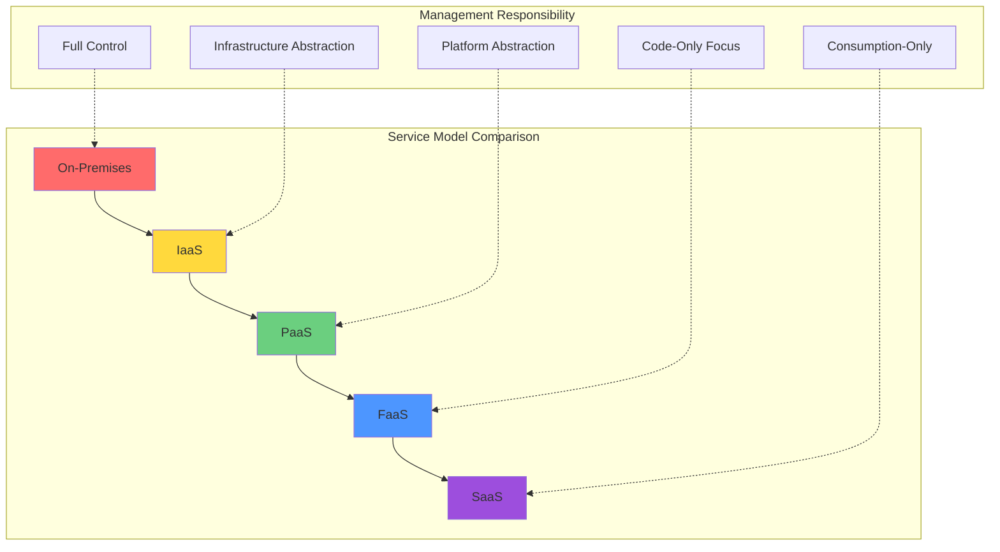

# Cloud Service Models

## Overview of Service Models

Cloud computing offers multiple service models, each providing different levels of abstraction and control. Understanding these models is crucial for selecting appropriate solutions for specific use cases. The primary service models—Infrastructure as a Service (IaaS), Platform as a Service (PaaS), Software as a Service (SaaS), and the emerging Function as a Service (FaaS)—represent different points along the abstraction spectrum.

These models differ in terms of what the provider manages versus what the customer manages. As you move from IaaS to SaaS, the provider assumes more responsibility for the underlying infrastructure and platform, while customers focus increasingly on business logic and data.

## Infrastructure as a Service (IaaS)

### What is IaaS?

Infrastructure as a Service provides fundamental computing resources—virtual machines, storage, and networking—on demand over the internet. IaaS offers the most control and flexibility among cloud service models, essentially providing virtual data centers without the capital expense and operational overhead of physical infrastructure.

With IaaS, cloud providers manage physical hardware, virtualization, storage, and networking infrastructure. Customers are responsible for managing operating systems, middleware, runtime environments, applications, and data. This division of responsibilities offers flexibility while eliminating infrastructure management burdens.

### Key Characteristics

**Virtualized Resources**: IaaS delivers virtualized computing resources including:
- Virtual machines with configurable CPU, memory, and disk
- Block storage volumes for persistent data
- Virtual networks with subnets, routing tables, and firewalls
- Load balancers for distributing traffic
- IP addresses and DNS management

**Elastic Scaling**: Resources scale up or down based on demand. Customers can:
- Launch additional VMs during traffic spikes
- Resize VMs by changing instance types
- Add or remove storage volumes
- Adjust network bandwidth
- Automate scaling based on metrics

**Pay-per-Use Pricing**: Customers pay only for resources consumed, typically billed by:
- Instance-hours for compute
- Gigabyte-months for storage
- Bandwidth for data transfer
- Additional charges for premium features like dedicated hosts or reserved IPs

**Self-Service Provisioning**: Web consoles, APIs, and infrastructure-as-code tools enable customers to provision resources without provider intervention. Infrastructure changes that once took weeks now complete in minutes.

### Popular IaaS Providers

**Amazon Web Services (AWS) EC2**: The pioneering IaaS offering launched in 2006. EC2 provides:
- 400+ instance types optimized for different workloads
- Compute-optimized, memory-optimized, storage-optimized, and GPU instances
- Spot instances at up to 90% discount for fault-tolerant workloads
- Reserved instances for capacity commitments with discounted rates
- Integration with 200+ AWS services

**Microsoft Azure Virtual Machines**: Azure's IaaS offering tightly integrates with Microsoft ecosystem tools:
- Windows and Linux support
- Azure Hybrid Benefit for existing Windows licenses
- Integration with Active Directory
- Support for specialized workloads like SAP and HPC

**Google Compute Engine (GCE)**: Google's IaaS emphasizes performance and cost efficiency:
- Custom machine types for precise resource matching
- Per-second billing for cost optimization
- Preemptible VMs at 80% discount
- Live migration for maintenance without downtime
- Global load balancing included

**Additional Providers**: IBM Cloud, Oracle Cloud Infrastructure, Alibaba Cloud, and DigitalOcean serve different markets with varying feature sets and pricing models.

### Use Cases

**Website and Application Hosting**: Organizations host web applications on IaaS for scalability and reliability:
- E-commerce sites handle seasonal traffic variations
- Media sites manage viral content spikes
- Enterprise applications scale globally

**Development and Testing**: IaaS enables rapid environment provisioning:
- Developers create isolated environments in minutes
- Testing teams replicate production configurations
- Environments are destroyed when no longer needed, eliminating costs

**Disaster Recovery**: IaaS provides cost-effective disaster recovery:
- Minimal standby infrastructure until needed
- Geographic redundancy without multiple data centers
- Automated failover during outages
- Regular recovery testing without additional hardware

**Big Data Analytics**: Processing large datasets requires substantial temporary compute:
- Spin up clusters for analysis jobs
- Scale to hundreds or thousands of nodes
- Process data and shut down infrastructure
- Pay only for processing time, not idle capacity

### Advantages

**Maximum Control**: Full access to virtual machines enables:
- Custom operating system configurations
- Installation of any software
- Low-level performance tuning
- Integration with existing tools and processes

**Infrastructure Automation**: Infrastructure-as-code tools like Terraform enable:
- Version-controlled infrastructure definitions
- Reproducible deployments
- Automated testing of infrastructure changes
- Self-documenting architecture

**Cost Optimization**: Fine-grained control over resources allows:
- Selecting exact instance sizes needed
- Using spot instances for fault-tolerant workloads
- Scheduling non-production resources to run only during business hours
- Optimizing storage types based on performance needs

### Limitations

**Management Overhead**: Customers remain responsible for:
- Operating system patching and security
- Application deployment and configuration
- Backup and disaster recovery planning
- Monitoring and log management
- Capacity planning and optimization

**Complexity**: Managing IaaS requires expertise in:
- Operating system administration
- Network configuration
- Security hardening
- High availability architecture
- Performance optimization

**Operational Costs**: While infrastructure costs may decrease, operational costs can be substantial for:
- Staff to manage infrastructure
- Tools for automation and monitoring
- Security and compliance efforts

## Platform as a Service (PaaS)

### What is PaaS?

Platform as a Service provides a complete development and deployment environment in the cloud. PaaS includes infrastructure (servers, storage, networking) plus middleware, development tools, database management systems, and operating systems. Developers focus on writing code while the platform handles deployment, scaling, patching, and infrastructure management.

PaaS sits between IaaS and SaaS in terms of abstraction. Providers manage everything from physical infrastructure through the runtime environment. Customers manage applications and data, deploying code that the platform automatically runs at scale.

### Key Characteristics

**Integrated Development Environment**: PaaS provides tools for the entire application lifecycle:
- Code editors and IDEs accessible via browser
- Source control integration (Git, SVN)
- Automated build and testing pipelines
- Staging and production environments
- Rollback capabilities for failed deployments

**Automatic Scaling**: Platforms automatically handle scaling without customer intervention:
- Monitor application metrics
- Add or remove instances based on load
- Load balance traffic across instances
- Scale databases to match demand

**Built-in Services**: Common services are provided as managed components:
- Relational and NoSQL databases
- Caching layers
- Message queues
- Search engines
- Authentication and authorization

**Multi-Tenancy**: PaaS efficiently serves multiple customers on shared infrastructure while maintaining isolation, reducing costs through resource pooling.

### Popular PaaS Providers

**Heroku**: Pioneer in PaaS, known for developer experience:
- Git-based deployment workflow
- Buildpacks for automatic dependency detection
- Add-ons marketplace for services
- Dyno-based scaling (lightweight containers)
- Free tier for experimentation

**Google App Engine**: Fully managed PaaS from Google:
- Standard environment with automatic scaling
- Flexible environment with custom runtimes
- Integration with Google Cloud services
- Generous free quota
- Global load balancing

**Microsoft Azure App Service**: PaaS offering for web and mobile applications:
- Support for .NET, Java, Node.js, Python, PHP
- Deployment slots for staging
- Built-in CI/CD with GitHub and Azure DevOps
- Hybrid connectivity to on-premises resources
- Enterprise authentication integration

**AWS Elastic Beanstalk**: Amazon's PaaS solution:
- Support for multiple programming languages
- Choice of platforms (Tomcat, IIS, Nginx)
- Full control over underlying resources
- Integration with AWS services
- CloudFormation-based infrastructure

**Cloud Foundry**: Open-source PaaS supporting multiple clouds:
- Deploy to AWS, Azure, GCP, or on-premises
- Avoid vendor lock-in
- Support for multiple languages via buildpacks
- Enterprise-grade security and compliance

### Use Cases

**Web Applications**: PaaS excels at hosting web applications:
- Rapid deployment from source code
- Automatic HTTPS certificate management
- Built-in monitoring and logging
- Database integration
- Continuous deployment from Git repositories

**API Development**: Building and deploying APIs benefits from:
- API gateway integration
- Authentication and authorization
- Rate limiting and throttling
- Documentation generation
- Version management

**Mobile Backends**: Mobile applications need scalable backends:
- Push notification services
- User authentication
- Data synchronization
- File storage
- Analytics integration

**Microservices**: PaaS supports microservice architectures:
- Independent deployment of services
- Service discovery
- Load balancing
- Container orchestration
- Inter-service communication

### Advantages

**Developer Productivity**: Developers focus on code rather than infrastructure:
- No server management
- Automatic dependency installation
- Built-in development tools
- Faster time to market

**Automatic Scaling**: Platform handles scaling transparently:
- No capacity planning required
- Instant response to traffic changes
- Pay only for actual usage
- Geographic distribution

**Built-in High Availability**: Platforms provide reliability without additional effort:
- Automatic health checks
- Self-healing infrastructure
- Multi-zone deployment
- Automated backups

**Cost Efficiency**: Pay-per-use pricing aligns costs with value:
- No idle resources
- Granular billing (often per-second)
- No upfront investment
- Reduced operational overhead

### Limitations

**Less Control**: Abstraction reduces flexibility:
- Limited operating system access
- Restricted runtime configurations
- Platform-specific features may cause lock-in
- Constrained customization options

**Vendor Lock-In**: Migrating between platforms can be difficult:
- Platform-specific APIs
- Proprietary services
- Different deployment models
- Integration dependencies

**Cost Predictability**: While efficient, costs can be unpredictable:
- Pricing based on requests, compute time, or other metrics
- Unexpected traffic spikes can increase costs
- Additional charges for premium features

**Limited Language/Framework Support**: Not all technologies are supported:
- Specific language versions may not be available
- Newer frameworks might not be supported
- Custom dependencies may be restricted

## Software as a Service (SaaS)

### What is SaaS?

Software as a Service delivers complete applications over the internet. Users access software through web browsers without installing, configuring, or maintaining anything. Providers manage all infrastructure, platforms, and application software. Customers simply use the application and manage their data.

SaaS represents maximum abstraction in cloud service models. Users interact solely with application features, completely abstracted from underlying technology. This model dominates for business applications like email, CRM, collaboration tools, and productivity suites.

### Key Characteristics

**Complete Application Delivery**: Everything needed to use the software is provided:
- Application functionality
- User interface
- Data storage
- Security and compliance
- Updates and patches

**Subscription-Based Pricing**: Users typically pay recurring fees:
- Per-user monthly or annual subscriptions
- Tiered pricing based on features
- Usage-based pricing for some services
- Often includes free trials or freemium tiers

**Multi-Tenant Architecture**: Single application instance serves multiple customers:
- Shared infrastructure reduces costs
- All users receive updates simultaneously
- Data isolation ensures privacy and security
- Customization through configuration rather than code changes

**Accessibility**: Applications are accessible from anywhere:
- Web browser access
- Mobile applications
- APIs for integration
- Offline functionality in some cases

### Popular SaaS Examples

**Salesforce**: Customer relationship management platform:
- Sales, service, and marketing automation
- Customizable with declarative configuration
- AppExchange marketplace for add-ons
- Integration with thousands of applications

**Microsoft 365**: Productivity suite including:
- Word, Excel, PowerPoint (Office applications)
- Outlook (email and calendar)
- Teams (collaboration and communication)
- OneDrive (file storage and sharing)
- SharePoint (intranet and document management)

**Google Workspace**: Collaboration and productivity tools:
- Gmail, Calendar, Meet
- Docs, Sheets, Slides
- Drive (file storage)
- Admin console for organization management

**Slack**: Team communication platform:
- Channel-based messaging
- Direct messages and group conversations
- File sharing
- App integrations (2,000+ apps)
- Search and knowledge management

**Dropbox**: File synchronization and sharing:
- Cloud storage
- File synchronization across devices
- Sharing and collaboration
- Version history
- Mobile access

### Use Cases

**Business Productivity**: Organizations use SaaS for core productivity:
- Email and calendar management
- Document creation and collaboration
- Spreadsheets and presentations
- Note-taking and knowledge management

**Customer Relationship Management**: Sales and marketing teams leverage SaaS CRM:
- Contact and lead management
- Sales pipeline tracking
- Marketing automation
- Customer service and support

**Human Resources**: HR departments use SaaS for:
- Applicant tracking and recruiting
- Onboarding and training
- Performance management
- Benefits administration
- Payroll processing

**Collaboration and Communication**: Teams coordinate using SaaS tools:
- Video conferencing
- Team messaging
- Project management
- Shared calendars and scheduling

### Advantages

**Zero Maintenance**: Providers handle all operational aspects:
- Infrastructure management
- Security patches
- Feature updates
- Backup and disaster recovery
- Scaling and performance optimization

**Immediate Access**: Users start quickly:
- No installation required
- Access from any device with a browser
- Instant updates to latest version
- Onboarding in minutes rather than months

**Predictable Costs**: Subscription pricing simplifies budgeting:
- Fixed monthly or annual costs
- Per-user pricing is straightforward
- No surprise infrastructure bills
- Includes support and updates

**Automatic Updates**: Everyone uses the latest version:
- New features automatically available
- Security patches applied immediately
- No upgrade projects or migrations
- Consistent experience across organization

### Limitations

**Limited Customization**: Applications provide configuration rather than customization:
- Can't modify source code
- Limited to available features
- Customization through configuration may be insufficient
- Workarounds may be necessary for unique requirements

**Data Control**: Data resides with the provider:
- Concerns about data privacy
- Regulatory compliance complexity
- Vendor bankruptcy or service termination risks
- Export and migration challenges

**Internet Dependency**: Applications require connectivity:
- Outages impact productivity
- Network issues affect performance
- Limited offline functionality
- Bandwidth consumption

**Integration Challenges**: Connecting SaaS applications can be complex:
- API limitations
- Data synchronization issues
- Authentication complexity
- Custom integration development

## Function as a Service (FaaS) / Serverless

### What is FaaS?

Function as a Service, also known as serverless computing, provides event-driven compute execution. Developers write functions that execute in response to events without managing servers or infrastructure. The platform automatically provisions compute resources, executes functions, and scales based on demand.

Despite the "serverless" name, servers still exist—developers simply don't think about them. The serverless model represents maximum abstraction, with developers writing only business logic and the platform handling everything else.

### Key Characteristics

**Event-Driven Execution**: Functions respond to triggers:
- HTTP requests via API Gateway
- Database changes
- File uploads to object storage
- Scheduled events (cron)
- Message queue entries
- IoT device data

**Automatic Scaling**: Platforms scale from zero to thousands of concurrent executions:
- Each request can trigger a separate function instance
- No capacity planning required
- Automatic scaling to zero when not in use
- Built-in high availability

**Pay-per-Execution**: Billing based on actual usage:
- Charged only when code runs
- Typically billed by invocations and execution duration
- Generous free tiers (1M requests/month on AWS Lambda)
- No charges for idle time

**Stateless Execution**: Functions are designed to be stateless:
- No persistence between invocations
- External storage (databases, object storage) for state
- Connection pooling and caching optimizations
- Cold start considerations

### Popular FaaS Providers

**AWS Lambda**: Pioneer and market leader in FaaS:
- Support for multiple languages (Node.js, Python, Java, Go, .NET, Ruby)
- Custom runtimes with Lambda Layers
- 15-minute maximum execution time
- Integration with 200+ AWS services
- Extensive trigger options

**Google Cloud Functions**: Google's FaaS offering:
- First-class support for JavaScript/Node.js
- Python, Go support
- Tight integration with Google Cloud services
- Cloud Events standard for event formats
- Simpler deployment than competitors

**Azure Functions**: Microsoft's serverless platform:
- Consumption plan with pay-per-execution
- Premium and dedicated plans for advanced scenarios
- Durable Functions for stateful workflows
- Integration with Azure services and on-premises systems
- Visual Studio integration for .NET developers

**Cloudflare Workers**: Edge-based FaaS:
- Runs at edge locations globally
- V8 isolate architecture for fast startup
- Sub-millisecond execution times
- No cold starts
- WebAssembly support

### Use Cases

**API Backends**: FaaS excels at building APIs:
- Each endpoint as a separate function
- Automatic scaling for variable load
- Pay only for actual requests
- Built-in integration with API gateways

**Data Processing**: Event-driven data transformation:
- Process uploaded files
- Transform data as it enters databases
- ETL workflows triggered by data arrival
- Real-time stream processing

**Scheduled Tasks**: Cron-like job execution:
- Nightly database cleanup
- Report generation
- Data synchronization
- Health checks and monitoring

**Webhooks**: Respond to external events:
- Process payment notifications
- Handle Git push events
- Respond to form submissions
- IoT device data ingestion

**Chatbots and Conversational Interfaces**: Stateless request handling:
- Process chat messages
- Integrate with messaging platforms
- Natural language processing
- Context management via external storage

### Advantages

**No Server Management**: Developers focus entirely on code:
- No operating system patches
- No capacity planning
- No infrastructure provisioning
- Automatic deployment and scaling

**Cost Efficiency**: Pay only for execution:
- Zero cost when idle
- Granular billing (100ms increments)
- No over-provisioning waste
- Free tiers cover many small applications

**Automatic Scaling**: Handle any load without configuration:
- Scale from zero to thousands instantly
- No pre-warming required
- Built-in fault tolerance
- Geographic distribution

**Faster Time to Market**: Focus on business logic:
- Reduced code to write and maintain
- No infrastructure decisions
- Quick iterations
- Rapid prototyping

### Limitations

**Cold Starts**: Initial invocations have latency:
- Platform provisions resources on first request
- Can add 100ms-several seconds latency
- Mitigation strategies (keep-warm functions, provisioned concurrency)
- Impact varies by language and platform

**Execution Time Limits**: Functions have maximum execution duration:
- AWS Lambda: 15 minutes
- Azure Functions: 10 minutes (consumption plan)
- Google Cloud Functions: 9 minutes
- Long-running processes need alternative solutions

**Vendor Lock-In**: FaaS platforms differ significantly:
- Different trigger mechanisms
- Platform-specific APIs
- Deployment formats vary
- Migration requires substantial rework

**Debugging and Monitoring Challenges**: Distributed nature complicates troubleshooting:
- Limited local development/debugging
- Distributed tracing required for multiple functions
- Log aggregation across invocations
- Performance optimization differs from traditional applications

## Service Model Comparison

### Responsibility Matrix

```mermaid
graph LR
    subgraph "On-Premises"
        A1[Applications] --> A2[Data]
        A2 --> A3[Runtime]
        A3 --> A4[Middleware]
        A4 --> A5[OS]
        A5 --> A6[Virtualization]
        A6 --> A7[Servers]
        A7 --> A8[Storage]
        A8 --> A9[Networking]
    end

    subgraph "IaaS"
        B1[Applications] --> B2[Data]
        B2 --> B3[Runtime]
        B3 --> B4[Middleware]
        B4 --> B5[OS]
        B5 --> B6[Virtualization]
        B6 --> B7[Servers]
        B7 --> B8[Storage]
        B8 --> B9[Networking]
    end

    subgraph "PaaS"
        C1[Applications] --> C2[Data]
        C2 --> C3[Runtime]
        C3 --> C4[Middleware]
        C4 --> C5[OS]
        C5 --> C6[Virtualization]
        C6 --> C7[Servers]
        C7 --> C8[Storage]
        C8 --> C9[Networking]
    end

    subgraph "SaaS"
        D1[Applications] --> D2[Data]
        D2 --> D3[Runtime]
        D3 --> D4[Middleware]
        D4 --> D5[OS]
        D5 --> D6[Virtualization]
        D6 --> D7[Servers]
        D7 --> D8[Storage]
        D8 --> D9[Networking]
    end

    style A1 fill:#ff6b6b
    style A2 fill:#ff6b6b
    style A3 fill:#ff6b6b
    style A4 fill:#ff6b6b
    style A5 fill:#ff6b6b
    style A6 fill:#ff6b6b
    style A7 fill:#ff6b6b
    style A8 fill:#ff6b6b
    style A9 fill:#ff6b6b

    style B1 fill:#ff6b6b
    style B2 fill:#ff6b6b
    style B3 fill:#ff6b6b
    style B4 fill:#ff6b6b
    style B5 fill:#ff6b6b
    style B6 fill:#4d96ff
    style B7 fill:#4d96ff
    style B8 fill:#4d96ff
    style B9 fill:#4d96ff

    style C1 fill:#ff6b6b
    style C2 fill:#ff6b6b
    style C3 fill:#4d96ff
    style C4 fill:#4d96ff
    style C5 fill:#4d96ff
    style C6 fill:#4d96ff
    style C7 fill:#4d96ff
    style C8 fill:#4d96ff
    style C9 fill:#4d96ff

    style D1 fill:#4d96ff
    style D2 fill:#ff6b6b
    style D3 fill:#4d96ff
    style D4 fill:#4d96ff
    style D5 fill:#4d96ff
    style D6 fill:#4d96ff
    style D7 fill:#4d96ff
    style D8 fill:#4d96ff
    style D9 fill:#4d96ff
```

Red indicates customer responsibility; blue indicates provider responsibility.

### Selection Criteria

**Choose IaaS when**:
- Maximum control and customization is required
- Existing applications need lift-and-shift migration
- Custom security or compliance requirements exist
- Specialized software needs specific OS configurations
- Infrastructure automation expertise exists in-house

**Choose PaaS when**:
- Focus should be on application development
- Standard web or mobile application architectures fit requirements
- Rapid development and deployment is prioritized
- Automatic scaling is important
- Infrastructure management overhead should be minimized

**Choose SaaS when**:
- Standard business applications meet requirements
- Minimal customization is needed
- Quick deployment is critical
- IT resources are limited
- Predictable subscription costs are preferred

**Choose FaaS when**:
- Applications are event-driven
- Variable and unpredictable workloads exist
- Extreme cost optimization is needed
- Stateless processing is acceptable
- Development speed is paramount

## Hybrid and Multi-Model Approaches

Real-world architectures often combine service models:

**Hybrid IaaS/PaaS**: Use IaaS for databases requiring specific configurations while leveraging PaaS for application logic, balancing control and convenience.

**SaaS with Custom Integration**: Use SaaS applications for standard functionality while building custom integrations using FaaS, extending capabilities without managing infrastructure.

**Multi-Cloud Strategy**: Leverage different providers' strengths, using AWS for IaaS, Google Cloud for data analytics (PaaS), and Microsoft 365 for productivity (SaaS).

**Serverless Augmentation**: Add FaaS functions to existing IaaS or PaaS applications for specific tasks like image processing or data transformation, optimizing costs for variable workloads.

## Conclusion

Cloud service models—IaaS, PaaS, SaaS, and FaaS—provide different trade-offs between control, convenience, and cost. IaaS offers maximum flexibility with significant management responsibility. PaaS balances developer productivity with some platform constraints. SaaS maximizes convenience at the cost of customization. FaaS enables ultimate scaling efficiency for event-driven workloads.

Selecting appropriate service models requires understanding:
- Technical requirements and constraints
- Team skills and preferences
- Cost considerations and optimization strategies
- Compliance and security requirements
- Long-term flexibility needs versus short-term delivery speed

Most organizations use multiple service models simultaneously, selecting the best fit for each workload. As cloud technologies evolve, the lines between models blur, with new hybrid approaches emerging that combine benefits while mitigating limitations.

Success in cloud computing requires not just understanding individual service models, but knowing when and how to combine them effectively for optimal outcomes.
