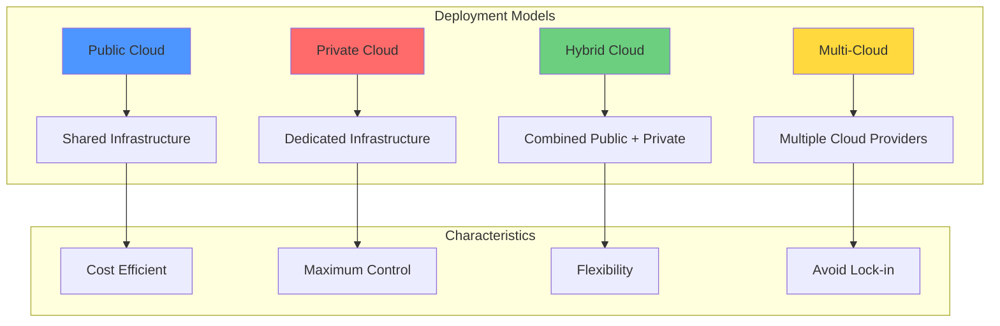

# Cloud Deployment Models

## Introduction to Deployment Models

Cloud deployment models define where and how cloud infrastructure is hosted, who has access to it, and who manages it. While service models (IaaS, PaaS, SaaS) describe what services are provided, deployment models describe the deployment environment and ownership structure. The primary deployment models—public cloud, private cloud, hybrid cloud, and multi-cloud—each offer distinct advantages and trade-offs regarding cost, control, security, and compliance.

Organizations must carefully evaluate deployment models based on their specific requirements, including data sensitivity, regulatory constraints, existing infrastructure investments, and business objectives. Many modern organizations employ multiple deployment models simultaneously, using the most appropriate model for each workload.

## Public Cloud

### Overview

Public cloud is the most common deployment model, where computing resources are owned and operated by third-party cloud service providers and delivered over the internet. Multiple organizations (tenants) share the same infrastructure, though strong isolation mechanisms ensure data separation and security. Major public cloud providers include Amazon Web Services (AWS), Microsoft Azure, Google Cloud Platform (GCP), IBM Cloud, and Oracle Cloud Infrastructure.

In the public cloud model, the provider owns, manages, and maintains all hardware, software, and supporting infrastructure at their data centers. Customers access services and manage their resources through web-based interfaces, command-line tools, or APIs. This model epitomizes the cloud computing value proposition: on-demand access to virtually unlimited computing resources without capital investment or infrastructure management overhead.

### Key Characteristics

**Shared Infrastructure**: Resources are pooled across many customers:
- Physical servers host virtual machines from multiple tenants
- Storage systems contain data from different organizations
- Network infrastructure carries traffic from various customers
- Isolation mechanisms (virtualization, encryption, access controls) ensure security and privacy

**Multi-Tenancy**: A single infrastructure serves many customers:
- Reduced costs through economies of scale
- Higher utilization rates optimize resource usage
- Shared operational overhead (staff, facilities, power)
- Statistical multiplexing allows over-subscription

**No Capital Investment**: Customers avoid upfront infrastructure costs:
- No server purchases
- No data center construction or leasing
- No networking equipment acquisition
- No power and cooling infrastructure

**Pay-as-You-Go Pricing**: Consumption-based billing aligns costs with usage:
- Per-hour or per-second billing for compute resources
- Storage billed by gigabyte-month
- Data transfer charges for bandwidth
- No long-term commitments required (though often available for discounts)

**Global Infrastructure**: Major providers operate worldwide:
- Dozens of geographic regions across continents
- Multiple availability zones within each region
- Hundreds of edge locations for content delivery
- Customers deploy globally without physical presence

### Advantages

**Cost Efficiency**: Public cloud offers the lowest infrastructure costs:
- No upfront capital expenditure
- Operational expenses scale with actual usage
- Provider economies of scale yield lower per-unit costs
- Competition drives prices down over time
- Free tiers and credits for new customers

**Scalability**: Near-unlimited capacity is available on demand:
- Scale from one to thousands of servers instantly
- No capacity planning or lead times
- Automatic scaling based on demand
- Pay only for resources actually consumed

**Reliability**: Providers invest heavily in availability:
- Redundant infrastructure across availability zones
- 99.9% to 99.99% uptime SLAs
- Automatic failover capabilities
- Geographic redundancy for disaster recovery

**Innovation**: Access to cutting-edge services:
- Hundreds of managed services (databases, AI/ML, analytics)
- Continuous feature releases and improvements
- No upgrade cycles or migration projects
- Latest hardware and software technologies

**Global Reach**: Deploy applications worldwide without infrastructure investment:
- Reduce latency for global users
- Meet data residency requirements
- Expand into new markets quickly
- Serve customers from nearby regions

**Reduced Time to Market**: Deploy new applications rapidly:
- Resources available in minutes
- No procurement or installation delays
- Experiment quickly without commitments
- Fast iteration cycles

### Limitations

**Security Concerns**: Shared infrastructure raises security questions:
- Data resides on multi-tenant systems
- Provider access to customer data
- Compliance with industry regulations
- Perception issues even when actual security is strong

**Limited Control**: Customers don't control underlying infrastructure:
- Can't modify hypervisor or physical network
- Limited ability to optimize for specific workloads
- Dependent on provider's roadmap for new features
- Some specialized requirements may not be supported

**Compliance Challenges**: Regulatory requirements may complicate public cloud use:
- Data sovereignty restrictions
- Industry-specific regulations (HIPAA, PCI DSS, FedRAMP)
- Audit and certification requirements
- Data location and residency concerns

**Internet Dependency**: Access requires internet connectivity:
- Network outages impact operations
- Latency for distant data centers
- Bandwidth costs for large data transfers
- Performance variability

**Data Transfer Costs**: Moving data out of the cloud incurs charges:
- Egress fees can be substantial
- Complicates hybrid architectures
- Vendor lock-in through economic friction
- Unpredictable costs for high-traffic applications

### Use Cases

**Startups and New Ventures**: Public cloud ideal for organizations without existing infrastructure:
- Low initial costs enable experimentation
- Scale as business grows
- Access enterprise-grade infrastructure
- Focus resources on product development

**Web Applications**: Scalable, globally distributed applications:
- E-commerce platforms handling variable traffic
- Content delivery for media and streaming
- Social networks scaling with user growth
- SaaS applications serving global customers

**Development and Testing**: Non-production environments benefit from public cloud:
- Quickly provision environments
- Tear down when not needed
- Match production configurations
- Parallel testing with isolated environments

**Big Data and Analytics**: Process large datasets cost-effectively:
- Spin up massive compute clusters
- Process data and terminate resources
- Pay only for processing time
- Access specialized hardware (GPUs, high-memory instances)

**Disaster Recovery**: Public cloud provides cost-effective DR:
- Minimal standby costs
- Geographic redundancy
- Rapid failover capabilities
- Regular DR testing without additional resources

## Private Cloud

### Overview

Private cloud is a cloud computing environment dedicated to a single organization. The infrastructure may be hosted on-premises at the organization's data center, at a third-party colocation facility, or by a cloud provider offering dedicated private cloud services. Unlike public cloud's multi-tenant architecture, private cloud serves a single organization, providing greater control and customization.

Private clouds use virtualization and orchestration technologies similar to public clouds, offering self-service provisioning, automated scaling, and resource pooling. The key difference lies in who owns and accesses the infrastructure. Organizations choose private cloud for regulatory compliance, data sensitivity, performance requirements, or existing infrastructure investments.

### Key Characteristics

**Dedicated Infrastructure**: Resources serve a single organization:
- Physical servers dedicated to one customer
- Isolated networks
- Dedicated storage systems
- No multi-tenant sharing

**Enhanced Security and Control**: Organizations maintain complete control:
- Custom security configurations
- Proprietary network architectures
- Specialized hardware for specific workloads
- Physical access control

**Regulatory Compliance**: Meet strict compliance requirements:
- Data never leaves organization control
- Custom audit and logging
- Specialized certifications
- Industry-specific controls

**Customization**: Tailor infrastructure to specific needs:
- Custom hardware configurations
- Specialized software stacks
- Legacy system integration
- Unique networking requirements

### Deployment Options

**On-Premises Private Cloud**: Infrastructure hosted in organization's data center:
- Maximum control and security
- Lowest latency for local users
- Integration with existing systems
- Requires capital investment and operational expertise

**Hosted Private Cloud**: Third party hosts dedicated infrastructure:
- Provider owns and maintains hardware
- Customer has exclusive use
- Professional management included
- Reduces operational burden while maintaining control

**Managed Private Cloud**: Provider delivers private cloud as a service:
- Similar to public cloud experience
- Dedicated infrastructure
- Professional management and support
- Hybrid of private cloud control and public cloud convenience

### Technologies

**VMware vSphere**: Leading private cloud platform:
- ESXi hypervisor for virtualization
- vCenter for centralized management
- vSAN for software-defined storage
- NSX for network virtualization
- Extensive ecosystem and tooling

**OpenStack**: Open-source cloud platform:
- No licensing costs
- Customizable and extensible
- Large community
- Supports multiple hypervisors
- Complex to deploy and manage

**Microsoft Azure Stack**: Extends Azure to on-premises:
- Consistent Azure experience
- Hybrid cloud integration
- Support for Azure services locally
- Tight integration with Microsoft ecosystem

**Red Hat OpenShift**: Container-based private cloud:
- Kubernetes foundation
- Integrated CI/CD
- Multi-cloud support
- Enterprise support and training

### Advantages

**Maximum Control**: Complete infrastructure control:
- Custom configurations for specific workloads
- Select exact hardware components
- Optimize for particular requirements
- Implement proprietary technologies

**Enhanced Security**: Dedicated resources reduce attack surface:
- No multi-tenant security concerns
- Custom security policies
- Physical access control
- Proprietary network architecture

**Regulatory Compliance**: Meet strict requirements:
- Data remains within organizational boundaries
- Demonstrate physical and logical controls
- Support for specialized certifications
- Easier compliance audits

**Predictable Performance**: Dedicated resources eliminate noisy neighbors:
- Consistent performance
- Optimized for specific workloads
- No contention with other tenants
- Fine-tuned resource allocation

**Legacy Integration**: Easier integration with existing systems:
- Same network as legacy applications
- Direct connections to mainframes and proprietary systems
- Support for specialized protocols
- Preserve existing investments

### Limitations

**High Costs**: Private cloud is expensive:
- Capital expenditure for hardware
- Data center facilities and infrastructure
- Power, cooling, and physical security
- Operational staff for management

**Limited Scalability**: Capacity constrained by owned hardware:
- Scaling requires hardware purchase and installation
- Lead times for capacity expansion
- Over-provisioning to handle peak loads
- Underutilization during normal periods

**Management Complexity**: Organizations bear operational responsibility:
- Requires specialized skills
- Ongoing maintenance and upgrades
- Disaster recovery planning and implementation
- Security patch management

**Lack of Geographic Distribution**: Limited to owned facilities:
- Difficult to achieve global presence
- Higher latency for distant users
- Complex disaster recovery across geographies

**Slower Innovation**: Technology updates require active management:
- Manual upgrades and migrations
- Delayed access to new capabilities
- Compatibility testing before upgrades
- Upgrade projects disrupt operations

### Use Cases

**Highly Regulated Industries**: Financial services, healthcare, government:
- Meet strict regulatory requirements
- Demonstrate data control
- Support compliance audits
- Implement specialized security controls

**Sensitive Data**: Organizations handling confidential information:
- Intellectual property protection
- Customer data privacy
- National security applications
- Competitive information

**Performance-Critical Applications**: Workloads requiring consistent performance:
- High-frequency trading
- Real-time analytics
- Low-latency applications
- Specialized hardware requirements

**Large Enterprises with Existing Infrastructure**: Organizations with substantial IT investments:
- Leverage existing data centers
- Utilize owned hardware
- Support legacy applications
- Gradual cloud transition

## Hybrid Cloud

### Overview

Hybrid cloud combines public and private cloud deployments, allowing data and applications to move between them. This model provides greater flexibility by enabling organizations to run workloads in the most appropriate environment while maintaining connectivity and integration between environments.

Hybrid cloud is not simply using both public and private clouds independently; it requires orchestration and management across environments. Workloads can move between environments as needs change, data is synchronized, and applications span both environments. This integration provides the control and security of private cloud with the scalability and innovation of public cloud.

### Architecture Patterns

**Cloud Bursting**: Scale to public cloud during demand spikes:
- Applications run primarily in private cloud
- Automatic scaling to public cloud during peaks
- Return to private cloud when demand normalizes
- Cost optimization by paying for peaks only temporarily

**Disaster Recovery**: Use public cloud as DR target:
- Primary workloads in private cloud
- Replicate data to public cloud continuously
- Failover to public cloud during disasters
- Cost-effective DR without duplicate private infrastructure

**Data Processing**: Separate data storage from processing:
- Store sensitive data in private cloud
- Process data in public cloud for scalability
- Transfer results back to private cloud
- Balance security with processing power

**Development/Production Split**: Different environments in different clouds:
- Development and testing in public cloud
- Production in private cloud
- Rapid environment provisioning
- Cost optimization for non-production

### Key Technologies

**VPN and Direct Connect**: Network connectivity between clouds:
- Site-to-site VPNs over internet
- Direct connections for higher bandwidth and lower latency
- Redundant connections for reliability
- Encrypted data transfer

**Hybrid Cloud Management Platforms**: Unified management:
- VMware Cloud Foundation for consistent infrastructure
- Azure Arc for managing resources across environments
- Google Anthos for multi-cloud Kubernetes
- Red Hat OpenShift for container orchestration

**Data Synchronization**: Keep data consistent:
- Database replication (MySQL replication, Oracle Data Guard)
- File synchronization services
- Object storage replication
- Message queues for eventual consistency

**Identity Federation**: Unified authentication:
- Active Directory across environments
- SAML and OAuth for SSO
- Centralized identity management
- Consistent access controls

### Advantages

**Flexibility**: Run workloads in optimal environments:
- Place sensitive data in private cloud
- Scale variable workloads in public cloud
- Balance cost and control
- Adjust strategy as requirements change

**Cost Optimization**: Pay for public cloud only when needed:
- Baseline capacity in private cloud
- Burst to public cloud during peaks
- Optimize based on workload characteristics
- Balance capital and operational expenses

**Business Continuity**: Leverage both environments for DR:
- Geographic redundancy across clouds
- Failover capabilities
- Data protection
- Minimize downtime

**Gradual Migration**: Transition to cloud incrementally:
- Move workloads gradually
- Maintain existing investments
- Learn and adapt before full commitment
- Reduce migration risk

**Compliance and Performance**: Meet diverse requirements:
- Regulated data in private cloud
- Less sensitive workloads in public cloud
- Performance-critical applications where optimal
- Balance various constraints

### Limitations

**Complexity**: Managing multiple environments is challenging:
- Different management tools and processes
- Network configuration and security
- Data synchronization and consistency
- Skills required for both environments

**Integration Challenges**: Connecting environments requires effort:
- Network latency between clouds
- Data transfer costs
- Application architecture constraints
- Compatibility issues

**Security Concerns**: Attack surface increases:
- Multiple environments to secure
- Network connections between clouds
- Data in transit between environments
- Consistent security policies

**Cost Management**: Tracking costs across environments is complex:
- Multiple billing systems
- Difficult to compare costs
- Hidden integration costs
- Optimization requires expertise

### Use Cases

**Variable Workloads**: Applications with predictable and unpredictable load:
- E-commerce handling seasonal spikes
- Analytics processing periodic large batches
- Rendering farms for media production
- Scientific computing with variable demands

**Regulatory Compliance with Scalability**: Balance requirements:
- Customer data in private cloud for compliance
- Application tier in public cloud for scalability
- Separate environments for different data types
- Meet regulations while maintaining agility

**Gradual Cloud Migration**: Transitioning to cloud over time:
- Move applications systematically
- Maintain operations during migration
- Validate before full commitment
- Minimize disruption

**Geographic Distribution**: Serve users globally:
- Private cloud in headquarters location
- Public cloud regions near remote users
- Consistent experience globally
- Reduced latency for all users

## Multi-Cloud

### Overview

Multi-cloud refers to using multiple public cloud providers simultaneously. Organizations might use AWS for some workloads, Azure for others, and GCP for still others. This strategy differs from hybrid cloud, which combines public and private clouds; multi-cloud uses only public clouds but from different providers.

Organizations adopt multi-cloud for various reasons: avoiding vendor lock-in, leveraging specific provider strengths, regulatory requirements, or redundancy. While offering benefits, multi-cloud also introduces significant complexity in management, integration, and skills.

### Multi-Cloud Strategies

**Best-of-Breed**: Select best service from each provider:
- AWS for mature IaaS offerings
- Azure for Microsoft ecosystem integration
- GCP for data analytics and machine learning
- Leverage each provider's strengths

**Redundancy**: Distribute applications across providers:
- Eliminate single provider dependency
- Geographic redundancy beyond single provider's regions
- Mitigate provider outages
- Meet strict availability requirements

**Regulatory Compliance**: Meet jurisdiction-specific requirements:
- Use regional providers for data sovereignty
- Specialized certifications from different providers
- Avoid restrictions on specific providers in some countries

**Merger and Acquisition**: Combined cloud strategies:
- Acquired companies bring existing cloud commitments
- Gradual consolidation post-merger
- Maintain both during transition

### Key Technologies

**Multi-Cloud Management Platforms**:
- **CloudHealth**: Cost management and optimization across clouds
- **Morpheus**: Unified orchestration and governance
- **Scalr**: Infrastructure automation for multiple clouds
- **HashiCorp Terraform**: Infrastructure as code for any provider

**Kubernetes**: Container orchestration across clouds:
- Deploy consistently to any cloud
- Avoid provider-specific services for compute
- Portable application architecture
- Unified management with cluster federation

**Cloud-Agnostic Services**:
- **Databases**: MongoDB Atlas, Cockroach DB (multi-cloud distributed)
- **Messaging**: Confluent Cloud (Kafka as a service)
- **Security**: Palo Alto Prisma Cloud, Check Point CloudGuard

### Advantages

**Avoid Vendor Lock-In**: Maintain flexibility:
- No dependence on single provider
- Negotiate better pricing with competition
- Switch providers if necessary
- Leverage provider competition

**Leverage Best Services**: Use strengths of each provider:
- AWS for breadth of services
- Azure for enterprise and Microsoft integration
- GCP for data analytics and AI/ML
- Oracle Cloud for Oracle database workloads

**Enhanced Redundancy**: Eliminate single points of failure:
- No single provider outage impacts all systems
- Geographic distribution beyond single provider
- Meet extreme availability requirements
- Regulatory risk mitigation

**Negotiating Power**: Competition reduces costs:
- Providers compete for business
- Volume discounts across multiple providers
- Flexibility to shift workloads
- Avoid price increases

**Compliance and Data Sovereignty**: Meet diverse requirements:
- Choose providers approved in specific jurisdictions
- Data residency requirements across countries
- Avoid political risks of single provider
- Industry-specific provider certifications

### Limitations

**Increased Complexity**: Managing multiple providers is challenging:
- Different management consoles and APIs
- Varied billing systems and pricing models
- Inconsistent capabilities and terminology
- Multiple support relationships

**Skills Gap**: Teams need expertise in multiple platforms:
- Different certification paths
- Provider-specific services and best practices
- Increased training costs
- Difficulty finding multi-cloud experts

**Integration Challenges**: Connecting services across providers:
- No native integration between providers
- Data transfer costs and latency
- Security and compliance complexity
- Custom integration development

**Cost Management**: Optimizing costs is difficult:
- Multiple billing systems
- Different pricing models
- Difficult to compare equivalent services
- Tracking and allocation complexity

**Potential for Vendor Lock-In**: Using provider-specific services:
- Managed databases, AI/ML services, serverless
- High migration costs between providers
- May negate multi-cloud benefits

### Use Cases

**Avoiding Lock-In**: Organizations prioritizing flexibility:
- Concerned about pricing changes
- Want negotiating leverage
- Require exit strategy
- Value independence

**Best-of-Breed Strategy**: Leverage provider strengths:
- Use AWS for general compute
- Azure for Microsoft workloads
- GCP for BigQuery and AI/ML
- Optimize each workload independently

**Geographic Reach**: Serve users globally:
- Use providers with presence in specific regions
- Meet data residency requirements
- Optimize latency worldwide
- Regulatory compliance across jurisdictions

**High Availability**: Eliminate single provider dependency:
- Distribute critical applications across providers
- Failover between providers
- Meet extreme uptime requirements
- Risk mitigation

## Comparison and Selection Criteria

### Decision Framework

**Evaluate Requirements**:
- Data sensitivity and regulatory requirements
- Performance and latency needs
- Scalability and elasticity requirements
- Existing infrastructure and investments
- Budget and cost constraints
- Skills and operational capabilities

**Assess Options**:
- **Public Cloud**: Cost efficiency, scalability, innovation, global reach
- **Private Cloud**: Control, compliance, security, legacy integration
- **Hybrid Cloud**: Flexibility, gradual migration, balance of benefits
- **Multi-Cloud**: Avoid lock-in, best-of-breed, redundancy, negotiating power

**Consider Workload Characteristics**:
- Sensitivity of data processed and stored
- Compliance and regulatory requirements
- Performance and latency requirements
- Scalability and variability of demand
- Integration with existing systems
- Innovation and feature requirements

### Migration Patterns

**Rehost (Lift and Shift)**: Move applications unchanged:
- Fastest migration path
- Minimal application changes
- Use IaaS in public or private cloud
- Optimize later

**Replatform**: Minor modifications for cloud:
- Move to managed databases
- Use cloud load balancers and storage
- Maintain application architecture
- Better cost optimization than rehost

**Refactor**: Redesign for cloud-native:
- Leverage PaaS and FaaS
- Microservices architecture
- Container-based deployment
- Maximum cloud benefits but highest effort

**Replace**: Adopt SaaS alternatives:
- Replace custom applications with SaaS
- Quickest time to value
- Minimal development required
- Potential limitations in customization

## Conclusion

Cloud deployment models—public, private, hybrid, and multi-cloud—each serve different needs and scenarios. Public cloud offers cost efficiency and scalability but may not meet all security or compliance requirements. Private cloud provides maximum control but at higher cost and complexity. Hybrid cloud balances benefits by combining models, while multi-cloud leverages multiple providers' strengths while avoiding lock-in.

Most large organizations employ multiple deployment models simultaneously, carefully selecting the appropriate model for each workload based on specific requirements. Success requires understanding trade-offs, developing necessary skills and processes, and implementing appropriate management and governance frameworks.

As cloud technologies evolve, deployment models increasingly blur. Public cloud providers offer private cloud capabilities within their data centers. Managed service providers deliver private cloud experiences. Kubernetes and containers enable consistent application deployment across any environment. The future of cloud computing lies not in choosing a single deployment model, but in strategically leveraging the right combination of models to meet diverse and evolving business needs.
