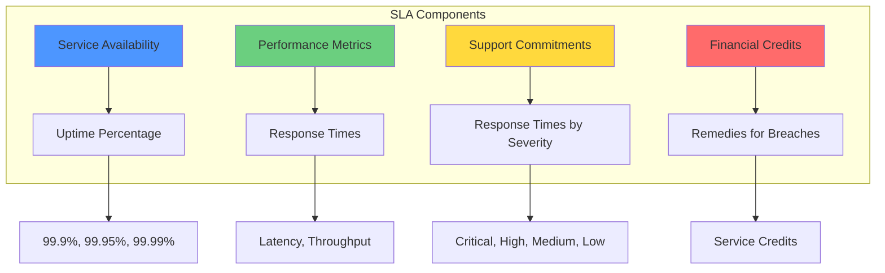
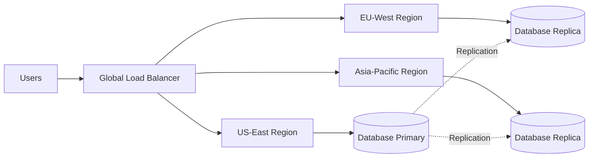

# Service Level Agreements

## Introduction to SLAs in Cloud Computing

Service Level Agreements (SLAs) are formal contracts between cloud service providers and customers that define expected service levels, including availability guarantees, performance metrics, and remedies for failures to meet commitments. SLAs are critical components of cloud services, providing customers with assurance about service quality and recourse when services fall short.

Understanding SLAs is essential for organizations relying on cloud infrastructure for critical business operations. SLAs inform architecture decisions, capacity planning, disaster recovery strategies, and vendor selection. This chapter explores cloud SLA structures, key metrics, provider comparisons, and strategies for architecting systems that meet business availability requirements.



## Understanding Availability

### Uptime Calculations

Availability is typically expressed as a percentage representing the proportion of time a service is operational and accessible. Common SLA tiers include:

**99% Uptime ("Two Nines")**:
- Allows 3.65 days of downtime annually
- 7.3 hours monthly downtime
- Generally considered unacceptable for production services
- May be acceptable for development/testing environments

**99.9% Uptime ("Three Nines")**:
- Allows 8.77 hours of downtime annually
- 43.8 minutes monthly downtime
- Common SLA for standard cloud services
- Suitable for many business applications

**99.95% Uptime ("Three and a Half Nines")**:
- Allows 4.38 hours downtime annually
- 21.9 minutes monthly downtime
- Premium SLA tier offered by many providers
- Balance of cost and reliability

**99.99% Uptime ("Four Nines")**:
- Allows 52.6 minutes downtime annually
- 4.38 minutes monthly downtime
- High availability requirement
- Typical for financial services, e-commerce

**99.999% Uptime ("Five Nines")**:
- Allows 5.26 minutes downtime annually
- 26.3 seconds monthly downtime
- Extremely difficult and expensive to achieve
- Telecommunication systems, critical infrastructure

**99.9999% Uptime ("Six Nines")**:
- Allows 31.5 seconds downtime annually
- 2.6 seconds monthly downtime
- Extremely rare in cloud services
- Emergency services, life-critical systems

### Measuring Availability

**Monthly Uptime Percentage**: Most common measurement period:
```
Monthly Uptime % = (Maximum Available Minutes - Downtime Minutes) / Maximum Available Minutes × 100
```

**Example**: In a 30-day month (43,200 minutes), if service experienced 44 minutes of downtime:
```
Monthly Uptime % = (43,200 - 44) / 43,200 × 100 = 99.898%
```
This falls short of a 99.9% SLA.

**Measurement Windows**:
- Monthly: Most common for SLA calculations
- Quarterly: Some enterprise agreements
- Annual: Long-term trend analysis
- Rolling periods: More complex but fairer to customers

**Exclusions**: SLAs typically exclude downtime due to:
- Customer-caused issues (misconfigurations, API abuse)
- Scheduled maintenance (with proper notice)
- Force majeure events (natural disasters, wars, pandemics)
- Third-party network issues beyond provider control
- Customer failure to follow provider guidelines

### Service Credits

When providers fail to meet SLA commitments, they typically offer service credits rather than cash refunds:

**Tiered Credit Structure**: Credits increase with worse availability:

**AWS Example - Amazon EC2**:
- 99.99% SLA commitment
- <99.99% but >=99.0%: 10% credit
- <99.0% but >=95.0%: 25% credit
- <95.0%: 100% credit

**Azure Example - Virtual Machines**:
- 99.9% SLA for single VM with premium storage
- <99.9% but >=99.0%: 10% credit
- <99.0% but >=95.0%: 25% credit
- <95.0%: 100% credit

**Important Limitations**:
- Credits limited to affected services only
- Maximum credit usually 100% of affected service cost
- Credits must be requested (not automatic)
- Request deadlines (typically 30-60 days)
- Credits are future service usage, not cash refunds
- Credits may not cover business losses from downtime

**Business Reality**: Service credits rarely compensate for actual business impact:
- E-commerce outage losing $100,000/hour may receive $100 credit
- Reputational damage not compensated
- Customer churn not addressed
- Lost productivity not recovered

## Provider SLA Comparison

### AWS SLAs

AWS publishes service-specific SLAs for major services:

**Compute - EC2**:
- 99.99% for Multi-AZ deployments
- 99.5% for Single-AZ deployments
- Measured per region

**Storage - S3**:
- 99.9% availability for standard storage class
- Does not cover data durability (separate 99.999999999% durability design target)

**Database - RDS**:
- 99.95% for Multi-AZ deployments
- No SLA for Single-AZ deployments

**Database - DynamoDB**:
- 99.99% global availability
- 99.999% for global tables

**Key Characteristics**:
- Service-specific SLAs (not account-wide)
- Higher SLAs for multi-region/multi-AZ architectures
- Some services have no SLA for single-instance deployments
- Regional variations may apply

### Azure SLAs

Azure offers competitive SLAs with emphasis on availability sets and zones:

**Compute - Virtual Machines**:
- 99.99% for two or more instances across availability zones
- 99.95% for two or more instances in same availability set
- 99.9% for single instance with premium storage
- 95% for single instance with standard storage

**Storage - Blob Storage**:
- 99.9% for hot and cool access tiers (read)
- 99.9% for hot tier (write)
- 99.0% for cool tier (write)

**Database - SQL Database**:
- 99.995% for business critical tier
- 99.99% for premium and general purpose tiers
- 99.995% for hyperscale tier

**Database - Cosmos DB**:
- 99.999% for multi-region configurations
- 99.99% for single region

**Key Characteristics**:
- Composite SLAs for solutions using multiple services
- Strong emphasis on availability sets and zones
- High SLAs for multi-region configurations
- Detailed SLA calculator for complex architectures

### Google Cloud SLAs

GCP emphasizes simplicity and transparency in SLAs:

**Compute - Compute Engine**:
- 99.99% for regional managed instance groups
- 99.9% for zonal resources
- No SLA for single VMs without managed instance groups

**Storage - Cloud Storage**:
- 99.95% for multi-region
- 99.9% for dual-region
- 99.0% for region storage

**Database - Cloud SQL**:
- 99.95% availability for regional instances
- 99.99% with high availability configuration

**Database - Cloud Spanner**:
- 99.999% for multi-region configurations
- 99.99% for regional configurations

**Key Characteristics**:
- Premium network tier required for some SLAs
- Strong multi-region SLAs
- Clear documentation and calculators
- Focus on regional/multi-regional deployments

## Architecting for High Availability

SLAs represent provider commitments, but achieving business requirements demands proper architecture:

### Multi-AZ Deployments

Availability Zones (AZs) are isolated data center locations within regions:

**Benefits**:
- Protection against single data center failures
- Higher SLA commitments from providers
- Automatic failover capabilities
- Minimal latency between AZs (typically <2ms)

**Implementation**:
- Deploy application instances across multiple AZs
- Use load balancers to distribute traffic
- Database replication across AZs
- Stateless application design for easy failover

**Example**: AWS multi-AZ RDS:
- Synchronous replication to standby in different AZ
- Automatic failover (typically 1-2 minutes)
- Transparent to application (DNS endpoint unchanged)
- 99.95% SLA vs no SLA for single-AZ

### Multi-Region Architectures

Deploying across geographic regions provides maximum availability:

**Benefits**:
- Protection against region-wide outages
- Disaster recovery capabilities
- Lower latency for global users
- Regulatory compliance (data residency)

**Challenges**:
- Higher complexity and costs
- Data consistency challenges
- Network latency between regions
- Application must handle region failures

**Patterns**:

**Active-Passive**: Primary region handles traffic, secondary for DR:
- Lower cost than active-active
- Some data replication to secondary
- Failover requires manual or automated cutover
- RTO (Recovery Time Objective) typically minutes to hours

**Active-Active**: Multiple regions simultaneously serve traffic:
- Highest availability and performance
- Most complex to implement
- Requires global load balancing
- Data consistency challenges
- Highest cost

**Example Multi-Region Setup**:


### Database High Availability

Databases often represent single points of failure:

**Replication Strategies**:

**Synchronous Replication**:
- All writes committed to primary and replicas before acknowledgment
- Zero data loss on failover
- Higher write latency
- Limited geographic distance due to latency

**Asynchronous Replication**:
- Writes committed to primary, asynchronous replication to replicas
- Potential for data loss on failover (replication lag)
- Lower write latency
- Supports global distribution

**Semi-Synchronous**:
- At least one replica must acknowledge
- Balance of durability and performance
- Common in production systems

**Managed Database HA Features**:

**AWS RDS Multi-AZ**:
- Automatic failover in 1-2 minutes
- Synchronous replication
- No application changes required
- Available for MySQL, PostgreSQL, Oracle, SQL Server, MariaDB

**Azure SQL Database**:
- Built-in high availability (99.99% SLA)
- Transparent failover
- Active geo-replication for DR
- Auto-failover groups

**Google Cloud SQL HA**:
- Regional persistent disks
- Automatic failover
- Synchronous replication
- 99.95% SLA

### Load Balancing

Distributing traffic across multiple instances:

**Types**:

**Application Load Balancer**: Layer 7 routing:
- HTTP/HTTPS traffic
- Path-based and host-based routing
- Support for WebSockets
- SSL termination

**Network Load Balancer**: Layer 4 routing:
- TCP/UDP traffic
- Ultra-low latency
- Static IP addresses
- High throughput

**Global Load Balancer**: Multi-region traffic distribution:
- Geographic routing (direct users to nearest region)
- Failover between regions
- Anycast IP addressing
- DDoS protection

**Health Checks**: Ensure traffic routes only to healthy instances:
- HTTP health check endpoints
- TCP connection checks
- Custom check logic
- Configurable intervals and thresholds
- Automatic removal of unhealthy instances

### Auto-Scaling

Automatically adjust capacity based on demand:

**Horizontal Scaling**: Add or remove instances:
- Scale out during high demand
- Scale in during low demand
- Maintain minimum and maximum instance counts
- Metrics-based triggering (CPU, memory, request count)

**Vertical Scaling**: Resize instances:
- Increase instance size for more capacity
- Decrease for cost savings
- Typically requires instance restart
- Less common for dynamic scaling

**Predictive Scaling**: Pre-emptively adjust capacity:
- Machine learning predicts demand
- Scale before traffic arrives
- Useful for predictable patterns (business hours, seasonal)

**Auto-Scaling Best Practices**:
- Use multiple smaller instances vs few large ones
- Gradual scaling (don't scale too aggressively)
- Cool-down periods to avoid thrashing
- Multiple metrics for decisions
- Regular testing and tuning

### Chaos Engineering

Proactively test failure scenarios:

**Principles**:
- Assume failures will happen
- Test in production (carefully)
- Build confidence in system resilience
- Continuously improve

**Practices**:

**Chaos Monkey**: Randomly terminate instances:
- Ensures application tolerates instance failures
- Netflix's famous tool
- Now part of larger Simian Army

**Regional Failures**: Simulate region outages:
- Test multi-region failover
- Identify dependencies
- Validate DR procedures

**Latency Injection**: Add artificial delays:
- Test timeout handling
- Identify cascade failures
- Improve error handling

**Tools**:
- Chaos Monkey (Netflix)
- Gremlin (commercial chaos engineering platform)
- AWS Fault Injection Simulator
- Azure Chaos Studio

## SLA Composition

Understanding how component SLAs combine:

### Serial Dependencies

When components depend on each other sequentially, availability multiplies:

**Example**: Three-tier application:
- Load Balancer: 99.99% SLA
- Application Servers: 99.95% SLA (multi-AZ)
- Database: 99.95% SLA (multi-AZ)

**Combined SLA**:
```
0.9999 × 0.9995 × 0.9995 = 0.9989 = 99.89%
```

Serial dependencies reduce overall availability. Each component must have higher SLA than target.

### Parallel Dependencies

Redundant components improve availability:

**Example**: Two application servers:
- Each server: 99.9% SLA
- Combined availability (assuming independence):
```
1 - (1 - 0.999)² = 1 - 0.001² = 1 - 0.000001 = 0.999999 = 99.9999%
```

Redundancy dramatically improves availability.

### Real-World Considerations

**Shared Failure Modes**: Components may not fail independently:
- Same rack power failure affects multiple instances
- Same network path affects redundant connections
- Correlated failures reduce calculated availability

**Application-Level Failures**: SLA doesn't cover:
- Application bugs causing crashes
- Database deadlocks
- Memory leaks
- Configuration errors
- Dependency failures (external APIs, DNS)

**Maintenance Windows**: Planned downtime:
- Some SLAs exclude scheduled maintenance
- Others include in availability calculations
- Negotiate maintenance windows in enterprise agreements

## Service Level Objectives (SLOs)

While SLAs are contractual agreements with customers, Service Level Objectives (SLOs) are internal targets:

### SLO Definition

SLOs represent target reliability, often more stringent than SLAs:

**Relationship**:
- SLO: Internal target (e.g., 99.95%)
- SLA: External commitment (e.g., 99.9%)
- Error budget: Difference between SLO and 100%

**Example**:
- SLO: 99.95% availability
- This allows 0.05% downtime (error budget)
- In 30-day month: 21.6 minutes acceptable downtime
- Once exhausted, freeze feature releases until stability restored

### Error Budgets

Error budgets enable innovation while maintaining reliability:

**Concept**: System can be unavailable within error budget:
- 99.95% SLO allows 0.05% unavailability
- This is your error budget for innovation, deployment, experiments

**Usage**:
- Deploy frequently when within budget
- Slow deployments when budget exhausted
- Balance innovation and reliability
- Data-driven decision making

**Example**:
- Q1 target: 99.95% availability
- Actual Q1: 99.97% availability
- Underutilized error budget (could deploy more frequently)
- Adjust deployment frequency or increase SLO

### SLIs: Service Level Indicators

Metrics used to measure SLO compliance:

**Common SLIs**:
- Availability: Percentage of successful requests
- Latency: Response time percentiles (p50, p95, p99)
- Throughput: Requests per second
- Error Rate: Percentage of failed requests
- Durability: Data loss rate

**Example SLIs**:
```
Availability SLI = Successful Requests / Total Requests × 100
Latency SLI = Percentage of requests completing within target (e.g., 95% < 200ms)
Error Rate SLI = Failed Requests / Total Requests × 100
```

**Best Practices**:
- User-centric metrics (what users experience)
- Measurable and objective
- Automated monitoring
- Historical baseline for targets

## Enterprise SLA Negotiations

Large organizations often negotiate custom SLAs:

### Negotiation Points

**Higher Availability Commitments**:
- Request 99.99% vs standard 99.9%
- Financial penalties for breaches
- Larger service credits

**Faster Support Response**:
- Dedicated technical account managers
- Priority support queues
- Guaranteed response times by severity

**Custom Exclusions**:
- Limitations on planned maintenance windows
- Advance notice requirements
- Customer approval for disruptive changes

**Performance Guarantees**:
- Latency commitments
- Throughput guarantees
- Storage IOPS commitments

### Enterprise Support Tiers

Providers offer premium support with enhanced commitments:

**AWS Enterprise Support**:
- 15-minute response for business-critical issues
- Technical Account Manager (TAM)
- Infrastructure Event Management
- Operations reviews and recommendations
- Cost: Greater of $15,000/month or 10% of monthly AWS charges

**Azure Premier Support**:
- <15-minute initial response
- Designated Service Delivery Manager
- Proactive advisory services
- Architectural guidance
- Custom pricing based on services and usage

**GCP Premium Support**:
- <15-minute response for critical issues
- Dedicated Technical Account Manager
- Quarterly business reviews
- Cost optimization recommendations
- 3-10% of Google Cloud spend

## Best Practices for SLA Management

### Understand Your Requirements

**Business Impact Analysis**:
- Calculate cost of downtime per hour
- Identify critical vs non-critical systems
- Determine acceptable RTO (Recovery Time Objective)
- Determine acceptable RPO (Recovery Point Objective)

**Map Requirements to SLAs**:
- Choose appropriate SLA tiers
- Architect redundancy for critical systems
- Accept lower SLAs for non-critical systems
- Balance cost and availability

### Monitor Compliance

**Provider Dashboards**:
- Review provider uptime reports
- Track service incidents
- Monitor SLA compliance trends
- Identify patterns in outages

**Third-Party Monitoring**:
- Independent uptime monitoring
- Verify provider claims
- End-user experience monitoring
- Geographic monitoring for global applications

**Internal Metrics**:
- Track your application availability
- Measure actual user impact
- Correlate with provider incidents
- Identify application vs infrastructure issues

### Claim Service Credits

**Process**:
- Document outages and impacts
- Calculate downtime accurately
- Submit claims within deadlines
- Follow provider procedures
- Keep records of all incidents

**Automation**:
- Automated outage detection
- Logging for evidence
- Reminder systems for claim deadlines

### Plan for Failures

**Assume Failures Occur**:
- Design for resilience
- Test failover procedures
- Regular DR drills
- Chaos engineering

**Have Backups and DR**:
- Regular backups tested for recovery
- Documented DR procedures
- RTO and RPO commitments internally
- Regular testing

## Real-World SLA Case Studies

### AWS S3 Outage (February 2017)

**Incident**: Four-hour S3 outage in US-East-1:
- Human error during maintenance
- Affected thousands of services and websites
- Many services with multi-region architecture still failed

**Lessons**:
- Dependency on single region risky
- Many "multi-region" apps not truly independent
- DNS, authentication often still in single region
- Test actual failover, not just architecture diagrams

**SLA Impact**:
- AWS provided service credits per SLA
- Credits minimal compared to business impact
- Many companies suffered >$100,000 losses, received <$1,000 credits

### Azure Global Outage (September 2020)

**Incident**: Global authentication outage:
- Azure Active Directory issue
- Affected multiple Azure services globally
- Lasted several hours

**Lessons**:
- Even multi-region deployments vulnerable to global services
- Identity and authentication critical single points of failure
- Need provider-independent authentication fallbacks
- Understand shared dependencies across services

### Google Cloud Networking Outage (June 2019)

**Incident**: Multi-region outage due to configuration error:
- Affected multiple Google Cloud regions simultaneously
- Demonstrated correlated failure modes
- Four-hour duration

**Lessons**:
- Multi-region doesn't guarantee independence
- Shared infrastructure creates correlated risks
- Need multi-cloud for true independence
- Configuration management critical

## Conclusion

Service Level Agreements establish critical expectations for cloud service quality but understanding SLAs requires nuance. SLA percentages like 99.9% sound impressive but translate to hours of downtime annually. Service credits rarely compensate for business impact. Achieving business availability requirements demands architecting properly with redundancy, geographic distribution, and failover capabilities, not merely relying on provider SLAs.

Key takeaways:

**Understand the Math**: Calculate what SLA percentages mean in actual downtime and assess if that meets business needs.

**Architect for Requirements**: Use multi-AZ deployments, database replication, load balancing, and auto-scaling to exceed base SLAs.

**Measure and Monitor**: Track actual availability, not just assume provider SLAs are met. Use independent monitoring to verify.

**Plan for Failure**: Design assuming components will fail. Test failover procedures regularly. Practice chaos engineering.

**Balance Cost and Availability**: Higher availability costs more. Right-size availability to actual business requirements.

**Read the Fine Print**: Understand SLA exclusions, service credit limitations, and measurement methodologies. Enterprise negotiations can improve terms.

As cloud services mature, SLAs generally improve and providers compete on reliability. However, no SLA guarantees perfect availability. Success requires combining provider SLAs with sound architecture, operational excellence, and realistic expectations about cloud service reliability. Organizations that understand SLA limitations and architect accordingly achieve the reliability their businesses demand even when individual components occasionally fail.
