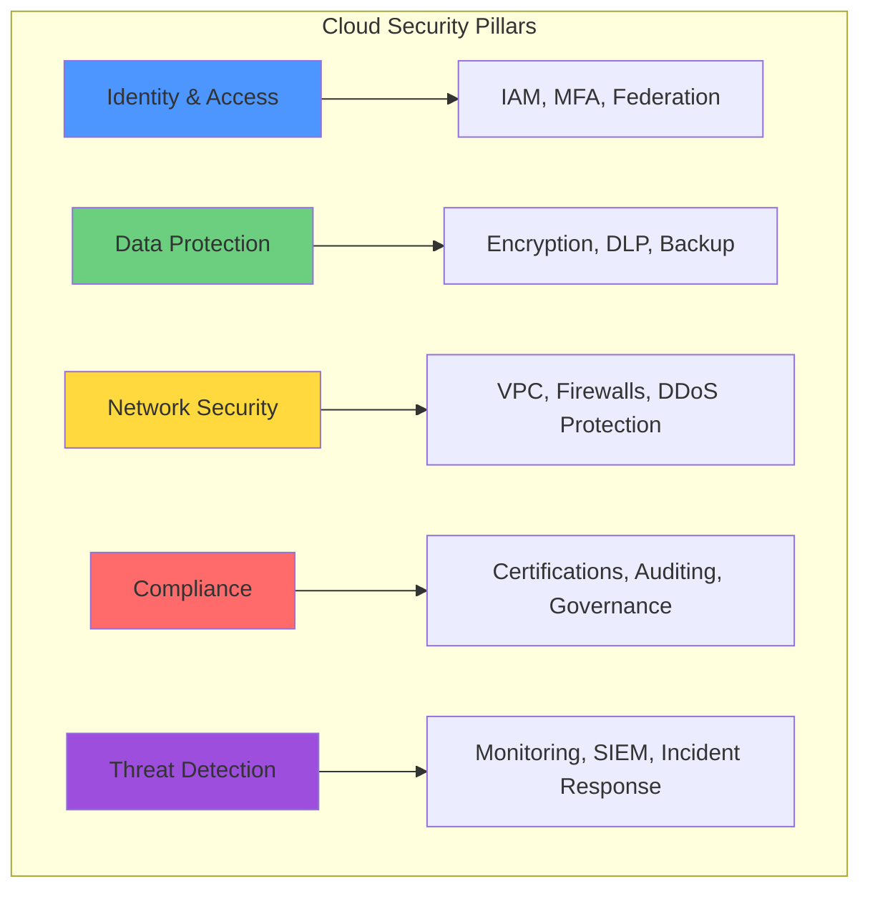
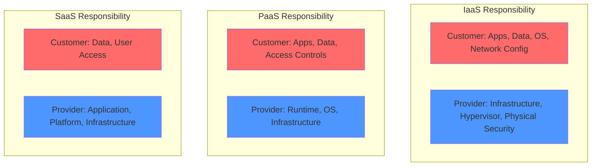
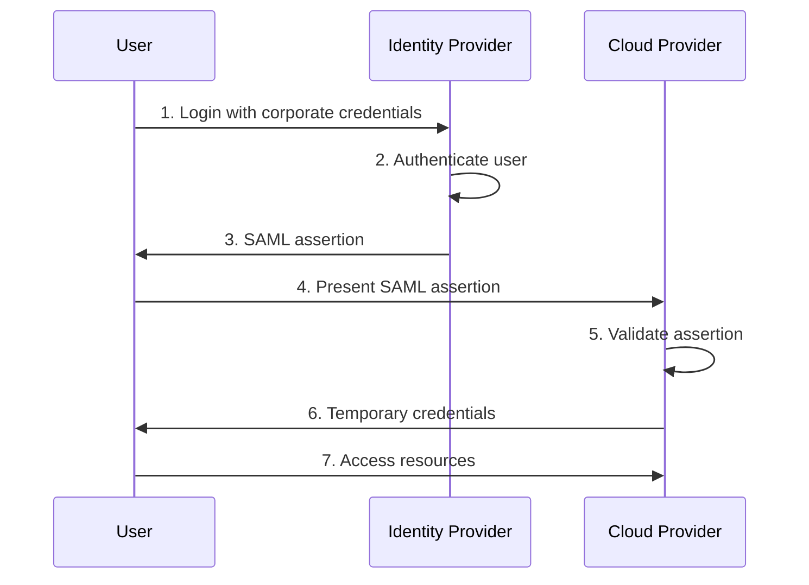
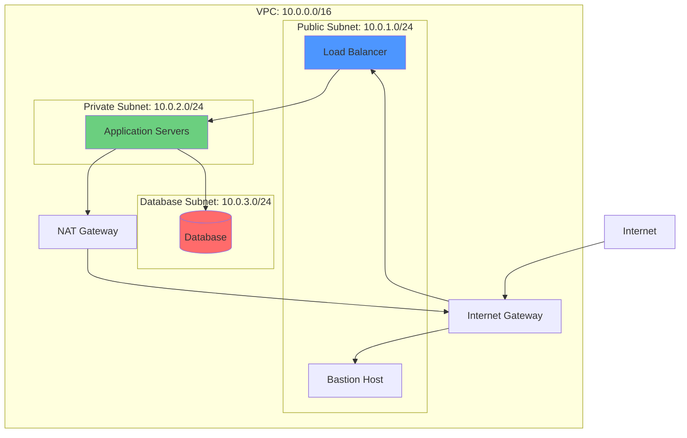

# Cloud Security

## Introduction to Cloud Security

Cloud security encompasses the policies, technologies, controls, and services that protect cloud data, applications, and infrastructure from threats. As organizations move critical workloads to the cloud, security becomes paramount but fundamentally different from traditional on-premises security models. Cloud security operates under a shared responsibility model where providers secure the infrastructure while customers secure their data and applications.

Understanding cloud security requires knowledge of the shared responsibility model, identity and access management, data protection, network security, compliance requirements, and security best practices. This chapter explores cloud security comprehensively, enabling organizations to architect and operate secure cloud environments.



## The Shared Responsibility Model

The cornerstone of cloud security is understanding the division of security responsibilities between cloud providers and customers.

### Provider Responsibilities: Security OF the Cloud

Cloud providers are responsible for securing the underlying infrastructure:

**Physical Security**:
- Data center facilities with military-grade security
- Biometric access controls
- 24/7 video surveillance
- Security guards and access audits
- Secure disposal of retired hardware

**Infrastructure Security**:
- Server hardware security
- Storage infrastructure protection
- Network infrastructure hardening
- Hypervisor security and isolation
- Power and cooling systems

**Environmental Controls**:
- Fire suppression systems
- Environmental monitoring
- Redundant power supplies
- Climate control systems
- Disaster preparedness

**Network Infrastructure**:
- DDoS protection at infrastructure level
- Network segmentation
- Edge security
- Physical network security
- Backbone protection

**Virtualization Layer**:
- Hypervisor security
- Multi-tenancy isolation
- Resource allocation controls
- Virtual network security

### Customer Responsibilities: Security IN the Cloud

Customers secure their workloads, data, and applications:

**Data Protection**:
- Data classification and governance
- Encryption of data at rest
- Encryption of data in transit
- Key management
- Data backup and recovery

**Identity and Access Management**:
- User account management
- Password policies
- Multi-factor authentication
- Role-based access control
- Privilege management

**Application Security**:
- Secure coding practices
- Application vulnerability management
- Web application firewalls
- API security
- Dependency management

**Operating System Security**:
- OS patch management
- Security hardening
- Antivirus and malware protection
- Host-based firewalls
- Intrusion detection

**Network Configuration**:
- Virtual network design
- Security group configuration
- Network access control lists
- Firewall rules
- VPN configuration

**Compliance and Governance**:
- Regulatory compliance
- Security policies
- Audit logging
- Incident response
- Security training

### Shared Responsibility by Service Model

**IaaS (e.g., EC2, Azure VMs)**:
- **Provider**: Physical infrastructure, hypervisor, physical network
- **Customer**: OS, applications, data, network configuration, firewall, encryption

**PaaS (e.g., Heroku, App Engine)**:
- **Provider**: Infrastructure, OS, runtime, middleware
- **Customer**: Application code, data, access controls, configuration

**SaaS (e.g., Salesforce, Microsoft 365)**:
- **Provider**: Everything except customer data and access
- **Customer**: Data, user access, endpoint security, proper usage



## Identity and Access Management (IAM)

IAM is the foundation of cloud security, controlling who can access resources and what they can do.

### Core IAM Concepts

**Principals**: Entities that can request actions:
- Users: Human identities with credentials
- Groups: Collections of users for easier management
- Roles: Sets of permissions without credentials
- Service accounts: Non-human identities for applications

**Authentication**: Verifying identity:
- Username and password
- Multi-factor authentication (MFA)
- Federated authentication (SAML, OAuth, OIDC)
- Certificate-based authentication
- Biometric authentication

**Authorization**: Determining permissions:
- Policy-based access control
- Role-based access control (RBAC)
- Attribute-based access control (ABAC)
- Resource-based policies
- Permission boundaries

### Principle of Least Privilege

Grant minimum permissions necessary for tasks:

**Implementation**:
- Start with no permissions
- Add permissions incrementally as needed
- Regular access reviews
- Automated permission right-sizing
- Temporary elevated access for specific tasks

**Benefits**:
- Reduces blast radius of compromised accounts
- Limits insider threats
- Simplifies compliance audits
- Reduces configuration errors

**Example Policy Progression**:
```
# Too Permissive (Anti-pattern)
{
  "Effect": "Allow",
  "Action": "*",
  "Resource": "*"
}

# Least Privilege (Best Practice)
{
  "Effect": "Allow",
  "Action": [
    "s3:GetObject",
    "s3:PutObject"
  ],
  "Resource": "arn:aws:s3:::my-bucket/my-folder/*"
}
```

### Multi-Factor Authentication (MFA)

Require multiple factors to verify identity:

**Factor Types**:
- **Something you know**: Password, PIN
- **Something you have**: Hardware token, phone, smart card
- **Something you are**: Fingerprint, facial recognition, iris scan

**Implementation**:
- Mandatory MFA for privileged accounts
- MFA for all human access (recommended)
- Virtual MFA apps (Google Authenticator, Authy)
- Hardware tokens (YubiKey, RSA SecurID)
- SMS/phone call (least secure, avoid if possible)

**Benefits**:
- Protects against password compromise
- Reduces phishing success
- Satisfies compliance requirements
- Critical for privileged access

### Identity Federation

Allow users to access cloud resources using existing corporate credentials:

**Protocols**:
- **SAML 2.0**: XML-based federation protocol
- **OAuth 2.0**: Authorization framework
- **OpenID Connect**: Identity layer on OAuth 2.0
- **WS-Federation**: Microsoft federation protocol

**Benefits**:
- Single sign-on (SSO) experience
- Centralized identity management
- Leverage existing identity provider (Active Directory, Okta, Azure AD)
- Reduce credential proliferation

**Example Federation Flow**:


### Service Accounts and Roles

Non-human identities for applications:

**Service Accounts**: Application identities:
- No password (use keys or instance profiles)
- Specific permissions for application needs
- Rotate credentials regularly
- Monitor usage for anomalies

**IAM Roles**: Temporary credentials:
- Applications assume roles
- No long-lived credentials
- Automatic credential rotation
- Cross-account access

**Best Practices**:
- Never embed credentials in code
- Use instance profiles/managed identities
- Rotate service account keys regularly
- Monitor and audit service account usage

## Data Protection

Protecting data at rest, in transit, and in use is critical:

### Encryption at Rest

Encrypt stored data to protect against unauthorized access:

**Server-Side Encryption (SSE)**:
- Cloud provider encrypts data before storage
- Transparent to applications
- Provider-managed keys or customer-managed keys
- No performance impact (typically)

**Client-Side Encryption**:
- Encrypt data before uploading to cloud
- Keys never leave customer control
- More complex to implement
- Maximum control over encryption

**Encryption Key Management**:

**Provider-Managed Keys**: Simplest option:
- Provider generates and manages keys
- Automatic rotation
- Minimal customer effort
- Less control over keys

**Customer-Managed Keys**: More control:
- Customer controls key lifecycle
- Customer controls key rotation
- Audit trail of key usage
- Can revoke access immediately

**Customer-Provided Keys**: Maximum control:
- Customer generates keys externally
- Provide key with each request
- Keys never stored by provider
- Complex but highest security

**Example: AWS S3 Encryption Options**:
- **SSE-S3**: AWS-managed keys (simplest)
- **SSE-KMS**: Customer-managed keys in AWS KMS
- **SSE-C**: Customer-provided keys
- **Client-Side**: Encrypt before upload

### Encryption in Transit

Protect data moving between systems:

**TLS/SSL Encryption**:
- Encrypt network traffic
- Certificate-based authentication
- Perfect forward secrecy
- Strong cipher suites

**VPN Connections**:
- Site-to-site VPN for hybrid architectures
- Client VPN for remote access
- IPsec or SSL/TLS protocols
- Encrypted tunnel for all traffic

**Private Connectivity**:
- AWS Direct Connect, Azure ExpressRoute, Google Cloud Interconnect
- Dedicated physical connection
- Optionally encrypted
- Consistent network performance

**Best Practices**:
- Enforce HTTPS for all web traffic
- Use TLS 1.2 or higher
- Disable weak cipher suites
- Implement certificate pinning
- Use HTTP Strict Transport Security (HSTS)

### Data Classification

Categorize data based on sensitivity:

**Classification Levels**:
- **Public**: No harm if disclosed (marketing materials)
- **Internal**: Limited disclosure (internal memos)
- **Confidential**: Serious harm if disclosed (financial data)
- **Restricted**: Severe harm if disclosed (trade secrets, PII)

**Implementation**:
- Tag or label data with classification
- Apply appropriate controls based on classification
- Automated data discovery and classification
- Data loss prevention (DLP) tools

### Data Loss Prevention (DLP)

Prevent unauthorized data exfiltration:

**Capabilities**:
- Identify sensitive data (credit cards, SSN, PHI)
- Monitor data movement
- Block unauthorized transfers
- Alert on policy violations

**Implementation**:
- Cloud Access Security Brokers (CASB)
- API-based DLP scanning
- Network-based DLP
- Endpoint DLP

### Backup and Recovery

Ensure data availability and durability:

**Backup Strategies**:
- **3-2-1 Rule**: 3 copies, 2 different media, 1 off-site
- Regular automated backups
- Test restores regularly
- Document recovery procedures
- Immutable backups (ransomware protection)

**Cloud Backup Features**:
- Automated snapshots
- Cross-region replication
- Point-in-time recovery
- Versioning
- Lifecycle policies for cost optimization

## Network Security

Secure cloud network infrastructure:

### Virtual Private Cloud (VPC)

Isolated network environments:

**Components**:
- **Subnets**: Network segments (public, private)
- **Route Tables**: Control traffic routing
- **Internet Gateway**: Connect to internet
- **NAT Gateway**: Outbound internet for private subnets
- **VPN Gateway**: Encrypted connections to on-premises

**Network Segmentation**:
- Public subnets for internet-facing resources
- Private subnets for backend services
- Database subnets with additional restrictions
- Management subnets for administrative access

**Example VPC Architecture**:


### Security Groups

Virtual firewalls for instances:

**Characteristics**:
- Stateful (return traffic automatically allowed)
- Default deny inbound, allow outbound
- Rules specify protocol, port, source/destination
- Applied at instance level
- Multiple security groups per instance

**Best Practices**:
- Deny by default, allow explicitly
- Reference other security groups (not IP addresses)
- Separate security groups by tier (web, app, database)
- Document purpose of each rule
- Regular audits for overly permissive rules

**Example Security Group**:
```
# Web Server Security Group
Inbound Rules:
- HTTP (80) from Internet Gateway SG
- HTTPS (443) from Internet Gateway SG
- SSH (22) from Bastion SG

Outbound Rules:
- All traffic (default)
```

### Network Access Control Lists (NACLs)

Subnet-level firewall:

**Characteristics**:
- Stateless (must explicitly allow return traffic)
- Applied at subnet level
- Rule evaluation by number (lowest first)
- Default allow all traffic

**When to Use**:
- Additional layer of defense
- Block specific IP ranges
- Regulatory requirements for subnet-level controls
- DDoS protection (rate limiting)

### Web Application Firewall (WAF)

Protect web applications from common attacks:

**Protection Against**:
- SQL injection
- Cross-site scripting (XSS)
- Cross-site request forgery (CSRF)
- Directory traversal
- File inclusion
- Command injection

**Implementation**:
- Managed WAF rules (OWASP Top 10)
- Custom rules for application-specific threats
- Rate limiting to prevent abuse
- Geographic restrictions
- IP reputation filtering

**Providers**:
- AWS WAF
- Azure Web Application Firewall
- Google Cloud Armor
- Third-party WAFs (Cloudflare, Imperva, F5)

### DDoS Protection

Defend against distributed denial of service attacks:

**Layers of Protection**:
- **Network Layer**: Volumetric attacks (SYN floods, UDP floods)
- **Transport Layer**: Protocol attacks (fragmented packets)
- **Application Layer**: HTTP floods, DNS query floods

**Cloud DDoS Protection**:
- **AWS Shield Standard**: Automatic, no cost
- **AWS Shield Advanced**: Enhanced protection, cost protection, DDoS Response Team
- **Azure DDoS Protection**: Standard and premium tiers
- **Google Cloud Armor**: Adaptive protection, rate limiting

**Best Practices**:
- Use CDN to absorb traffic
- Auto-scaling to handle legitimate traffic spikes
- Rate limiting at application level
- Geo-blocking if appropriate
- Monitor for anomalies

## Compliance and Governance

Meeting regulatory and organizational requirements:

### Compliance Certifications

Cloud providers maintain numerous certifications:

**Common Certifications**:
- **SOC 2 Type II**: Security, availability, processing integrity, confidentiality, privacy
- **ISO 27001**: Information security management
- **PCI DSS**: Payment card data protection
- **HIPAA**: Healthcare data protection
- **FedRAMP**: U.S. federal government cloud security
- **GDPR**: European data protection and privacy

**Provider Compliance**:
- AWS: 100+ compliance programs
- Azure: 90+ compliance offerings
- GCP: 50+ compliance certifications

**Shared Compliance**:
- Providers certify infrastructure
- Customers responsible for their usage
- Customers must configure services appropriately
- Third-party audits verify customer compliance

### Data Sovereignty and Residency

Legal requirements for data location:

**Requirements**:
- GDPR: EU citizen data must be processed in specific jurisdictions
- Russian data localization laws
- Chinese data residency requirements
- Financial services regulations

**Implementation**:
- Select appropriate cloud regions
- Understand provider data replication
- Restrict cross-border data transfer
- Document data location

### Audit Logging

Track all activity for security and compliance:

**What to Log**:
- Authentication and authorization events
- Resource creation, modification, deletion
- Configuration changes
- Data access
- Failed access attempts
- Administrative actions

**Cloud Logging Services**:
- **AWS CloudTrail**: API and user activity logging
- **Azure Activity Log**: Resource-level operations
- **Google Cloud Audit Logs**: Admin and data access logs

**Best Practices**:
- Enable logging on all services
- Centralize logs in secure location
- Retention policies meet compliance requirements
- Automated analysis and alerting
- Immutable log storage
- Encrypt logs
- Monitor log access

### Policy as Code

Define security policies programmatically:

**Benefits**:
- Version controlled policies
- Automated enforcement
- Consistent application
- Rapid deployment
- Testable security controls

**Tools**:
- **AWS Config**: Resource compliance monitoring
- **Azure Policy**: Governance and compliance
- **Google Cloud Organization Policy**: Resource constraints
- **Open Policy Agent (OPA)**: General-purpose policy engine

## Threat Detection and Incident Response

Identify and respond to security threats:

### Security Monitoring

Continuous monitoring for threats:

**Cloud-Native Monitoring**:
- **AWS GuardDuty**: Threat detection using ML
- **Azure Security Center**: Unified security management
- **Google Cloud Security Command Center**: Security and risk dashboard

**Capabilities**:
- Anomalous API calls
- Unusual network traffic
- Compromised instances
- Reconnaissance activity
- Data exfiltration attempts

### Security Information and Event Management (SIEM)

Centralized security event analysis:

**Cloud SIEM Solutions**:
- **Splunk Cloud**: Enterprise SIEM
- **Sumo Logic**: Cloud-native security analytics
- **Azure Sentinel**: Cloud-native SIEM and SOAR
- **Google Chronicle**: Security analytics platform

**Capabilities**:
- Log aggregation from multiple sources
- Real-time analysis and correlation
- Threat intelligence integration
- Automated alerting
- Compliance reporting

### Incident Response

Prepared response to security incidents:

**Incident Response Plan**:
1. **Preparation**: Tools, procedures, training
2. **Detection**: Identify security events
3. **Containment**: Limit damage
4. **Eradication**: Remove threat
5. **Recovery**: Restore normal operations
6. **Lessons Learned**: Improve processes

**Cloud IR Considerations**:
- Pre-authorize IR team access
- Automate incident detection
- Snapshot compromised resources for forensics
- Isolate affected resources
- Provider support (AWS IR, Azure Security Response)
- Document and communicate

### Penetration Testing

Test security controls:

**Cloud Penetration Testing**:
- Most providers allow testing (notify in advance)
- Restrictions on certain activities (DDoS testing)
- Focus on customer-controlled resources
- Third-party security assessments
- Regular testing cycles

**Bug Bounty Programs**:
- Crowdsourced vulnerability discovery
- Platforms: HackerOne, Bugcrowd
- Responsible disclosure
- Financial incentives for researchers

## Security Best Practices

### Defense in Depth

Multiple layers of security:

**Layers**:
1. **Perimeter**: WAF, DDoS protection
2. **Network**: VPC, security groups, NACLs
3. **Host**: OS hardening, antivirus, HIDS
4. **Application**: Secure coding, input validation
5. **Data**: Encryption, DLP, classification

**Redundancy**:
- No single point of failure in security
- Compromise of one layer doesn't expose everything
- Multiple detection opportunities

### Security Automation

Automate security controls:

**Infrastructure as Code (IaC) Security**:
- Version-controlled security configurations
- Automated deployment of secure baselines
- Policy enforcement before deployment
- Scanning for security issues (checkov, tfsec)

**Automated Response**:
- Lambda functions for automated remediation
- Security group lockdown on suspicious activity
- Snapshot and isolate compromised instances
- Automated rotation of credentials

**Benefits**:
- Consistent application of security controls
- Faster response to threats
- Reduced human error
- Scalable security

### Security Training

Educate personnel on security:

**Training Topics**:
- Shared responsibility model
- Secure configuration practices
- Incident response procedures
- Social engineering awareness
- Compliance requirements
- Tool-specific training

**Ongoing Education**:
- Regular security awareness training
- Simulated phishing exercises
- Security champions program
- Cloud security certifications (CCSP, AWS Security Specialty)

## Cloud Security Challenges

### Visibility and Control

Challenges in cloud environments:

**Issues**:
- Distributed resources across regions
- Ephemeral resources (containers, functions)
- Shadow IT (unapproved cloud usage)
- Complex permissions and policies

**Solutions**:
- Cloud Security Posture Management (CSPM) tools
- Centralized logging and monitoring
- Service control policies
- Regular audits and discovery

### Misconfiguration

Leading cause of cloud breaches:

**Common Misconfigurations**:
- Publicly accessible S3 buckets
- Overly permissive security groups
- Unencrypted data
- Default credentials
- Missing MFA
- Excessive IAM permissions

**Prevention**:
- Security baselines and templates
- Automated compliance checking
- Regular security assessments
- Security training for developers

### Insider Threats

Malicious or negligent insiders:

**Risks**:
- Privileged access abuse
- Data exfiltration
- Sabotage
- Accidental exposure

**Mitigation**:
- Least privilege access
- Separation of duties
- Monitoring and auditing
- Data loss prevention
- Background checks
- Exit procedures

## Conclusion

Cloud security requires understanding the shared responsibility model, implementing strong identity and access controls, protecting data through encryption, securing network infrastructure, maintaining compliance, and continuously monitoring for threats. While cloud providers secure the underlying infrastructure, customers must properly configure and secure their applications and data.

Key takeaways:

**Shared Responsibility**: Understand what the provider secures vs what you must secure. Both parties must fulfill their responsibilities for effective security.

**Identity is the Perimeter**: With cloud, network perimeter is less relevant. Strong IAM with MFA and least privilege is critical.

**Encrypt Everything**: Use encryption at rest and in transit. Manage keys appropriately for your security requirements.

**Defense in Depth**: Multiple layers of security controls provide redundancy and reduce risk.

**Automate Security**: Use infrastructure as code, policy as code, and automated monitoring for consistent, scalable security.

**Continuous Monitoring**: Threat detection, logging, and incident response capabilities are essential for identifying and responding to security events.

**Compliance is Continuous**: Regular audits, logging, and security assessments maintain compliance over time.

Cloud security is not a one-time effort but an ongoing process of implementing controls, monitoring for threats, responding to incidents, and continuously improving security posture. Organizations that approach cloud security comprehensively and systematically can achieve security levels exceeding traditional on-premises environments while leveraging cloud's agility, scalability, and innovation advantages.
