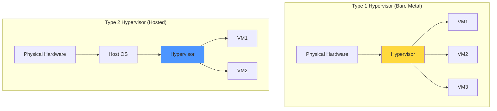

# Hypervisors

## What is a Hypervisor?

A hypervisor, also known as a Virtual Machine Monitor (VMM), is software that creates and manages virtual machines by abstracting physical hardware and allocating resources to guest operating systems. The hypervisor sits between the hardware and the virtual machines, controlling access to CPU, memory, storage, and network resources while maintaining isolation between VMs.

Hypervisors are the core technology enabling virtualization and cloud computing. They allow multiple operating systems to run concurrently on a single physical machine, each believing it has exclusive access to hardware. Understanding hypervisor architecture and capabilities is essential for designing, deploying, and managing virtualized infrastructure.

## Type 1 vs Type 2 Hypervisors

### Type 1 Hypervisors (Bare-Metal)

Type 1 hypervisors run directly on physical hardware without an underlying operating system:

**Architecture**:
- Hypervisor is the first software loaded during boot
- Direct hardware access without OS intermediary
- Thin hypervisor layer for maximum performance
- VMs run directly atop hypervisor

**Characteristics**:
- **Best Performance**: Minimal overhead from direct hardware access
- **Maximum Security**: Smaller attack surface without host OS
- **Enterprise-Grade**: Used in production data centers and cloud providers
- **Hardware Requirements**: Requires CPU virtualization support (VT-x/AMD-V)

**Examples**:
- VMware ESXi
- Microsoft Hyper-V (when running on Windows Server Core or bare metal)
- KVM (Kernel-based Virtual Machine)
- Xen
- Oracle VM Server

**Use Cases**:
- Production data centers
- Cloud service providers (AWS, Azure, GCP)
- High-performance computing clusters
- Mission-critical applications
- Server consolidation projects

**Advantages**:
- Superior performance (2-10% overhead vs 10-20% for Type 2)
- Better resource allocation and scheduling
- Enhanced security posture
- Designed for 24/7 operation
- Supports hundreds of VMs per host
- Advanced features (live migration, high availability, fault tolerance)

**Disadvantages**:
- Dedicated hardware required
- Higher learning curve
- More complex management
- Limited driver support (vendor-specific)
- Cannot run desktop applications on host

### Type 2 Hypervisors (Hosted)

Type 2 hypervisors run as applications on a conventional operating system:

**Architecture**:
- Standard OS runs on hardware (Windows, macOS, Linux)
- Hypervisor application runs atop OS
- VMs created and managed by hypervisor application
- Hardware access mediated through host OS

**Characteristics**:
- **Ease of Use**: Familiar OS environment
- **Desktop-Friendly**: Run VMs alongside desktop applications
- **Development-Oriented**: Quick setup for testing and development
- **Hardware Compatibility**: Leverages host OS drivers

**Examples**:
- VMware Workstation/Fusion
- Oracle VirtualBox
- Parallels Desktop
- QEMU (when used without KVM)

**Use Cases**:
- Desktop virtualization
- Development and testing
- Training and education
- Running multiple OS on workstations
- Legacy application testing
- Cross-platform development

**Advantages**:
- Easy to install and configure
- Works on existing desktops/laptops
- Familiar user interface
- Broad hardware compatibility
- Can run alongside desktop applications
- Lower barrier to entry

**Disadvantages**:
- Higher performance overhead (10-20%)
- Host OS vulnerabilities affect VMs
- Limited scalability
- Not suitable for production servers
- Resource competition with host OS
- Less efficient resource usage

## Major Hypervisor Technologies

### VMware ESXi

The market leader in enterprise virtualization:

**Overview**:
- Type 1 bare-metal hypervisor
- Part of VMware vSphere suite
- Powers millions of VMs worldwide
- Known for reliability and features

**Architecture**:
- Compact hypervisor (hundreds of MB)
- VMkernel for core hypervisor functions
- Userworlds for management agents
- Direct driver model for hardware

**Key Features**:

**vMotion**: Live migration of VMs between hosts
- Move running VMs without downtime
- Requires shared storage
- Load balancing and maintenance enablement
- Cross-datacenter vMotion for long-distance migration

**Storage vMotion**: Migrate VM storage while running
- Move virtual disks between datastores
- No VM downtime
- Storage maintenance and upgrades
- Performance optimization

**High Availability (HA)**: Automatic VM restart after host failure
- Monitors host health
- Restarts VMs on surviving hosts
- Admission control ensures capacity
- Application-level monitoring

**Fault Tolerance (FT)**: Continuous VM availability
- Synchronous replication of VM state
- Zero downtime on host failure
- Lock-step execution on primary and secondary
- Suitable for critical workloads

**Distributed Resource Scheduler (DRS)**: Automated load balancing
- Migrates VMs to balance resource usage
- Initial placement optimization
- Affinity and anti-affinity rules
- Power management integration

**Licensing**:
- Tiered editions: Standard, Enterprise, Enterprise Plus
- Per-processor licensing
- vSphere Essentials for small businesses
- Free ESXi with limitations

**Strengths**:
- Mature, stable platform
- Extensive feature set
- Large ecosystem and marketplace
- Excellent management tools (vCenter)
- Strong vendor support

**Weaknesses**:
- Expensive licensing
- Vendor lock-in concerns
- Complex licensing models
- Heavy management infrastructure

### Microsoft Hyper-V

Microsoft's enterprise hypervisor:

**Overview**:
- Type 1 hypervisor (when on Windows Server Core)
- Integrated with Windows Server
- Included free with Windows Server license
- Powers Microsoft Azure

**Architecture**:
- Hypervisor layer beneath Windows
- Parent partition runs Windows Server
- Child partitions for guest VMs
- VSP/VSC (Virtualization Service Provider/Client) architecture

**Key Features**:

**Live Migration**: Move VMs between hosts without downtime
- No shared storage required (Shared Nothing Live Migration)
- Cross-version migration
- Simultaneous migration of multiple VMs
- Compression and SMB for faster migration

**Replica**: Asynchronous VM replication for DR
- Replicate VMs to remote site
- Application-consistent snapshots
- Planned and unplanned failover
- No shared storage requirement

**Dynamic Memory**: Flexible memory allocation
- Adjust VM memory based on demand
- Memory overcommitment
- Smart paging for memory pressure
- Better density than static allocation

**Shielded VMs**: Enhanced security
- BitLocker disk encryption
- Virtual TPM
- Secure Boot
- Protection from admin access

**Integration with Windows Ecosystem**:
- Active Directory integration
- System Center management
- Azure hybrid benefits
- Windows Admin Center

**Licensing**:
- Free with Windows Server license
- Core-based licensing (Windows Server)
- Datacenter edition for unlimited VMs
- Standard edition for 2 VMs per license

**Strengths**:
- Included with Windows Server
- Excellent Windows guest support
- Strong security features
- Azure integration
- Familiar to Windows administrators

**Weaknesses**:
- Primarily Windows-centric
- Fewer third-party integrations than VMware
- Linux support improving but historically weaker
- Management less polished than VMware

### KVM (Kernel-based Virtual Machine)

Open-source Linux virtualization:

**Overview**:
- Type 1 hypervisor built into Linux kernel
- Turns Linux into a hypervisor
- Powers many cloud providers
- Open-source (GPL license)

**Architecture**:
- KVM kernel module provides hypervisor functions
- QEMU for device emulation and user-space management
- libvirt API for management abstraction
- Each VM runs as Linux process

**Key Features**:

**Live Migration**: Move VMs between KVM hosts
- Based on QEMU migration
- Post-copy migration option
- Shared storage or migrated storage
- Minimal downtime

**Memory Overcommitment**: Run more VMs than physical RAM
- Kernel same-page merging (KSM)
- Memory ballooning
- Swap utilization
- zswap compression

**Hardware Passthrough**: Direct device assignment
- PCI passthrough for GPUs, network cards
- SR-IOV support
- VFIO for secure device assignment
- Near-native performance

**Nested Virtualization**: Run hypervisors in VMs
- Test environments
- Cloud provider development
- Lab scenarios

**Integration**:
- Part of mainline Linux kernel
- Red Hat Enterprise Virtualization (RHEV)
- Ubuntu, Debian, CentOS support
- OpenStack compute (Nova)

**Licensing**:
- Free and open source
- Commercial support available (Red Hat, SUSE, Canonical)
- No per-VM or per-core fees

**Strengths**:
- No licensing costs
- Linux kernel integration
- Excellent Linux guest support
- Used by major cloud providers
- Active development community

**Weaknesses**:
- More complex to set up than commercial offerings
- Management tools less polished
- Requires Linux expertise
- Fragmented management landscape

### Xen

Open-source hypervisor with cloud focus:

**Overview**:
- Type 1 bare-metal hypervisor
- Powers AWS (historically) and other clouds
- Linux Foundation project
- Mature and stable

**Architecture**:
- Xen hypervisor layer
- Dom0 (privileged domain) for management
- DomU (unprivileged domains) for guest VMs
- Paravirtualization and HVM modes

**Key Features**:

**Paravirtualization**: Modified guests for performance
- Guest OS cooperates with hypervisor
- Better performance (before hardware virtualization)
- Requires guest OS modification
- Primarily historical significance now

**Hardware Virtual Machine (HVM)**: Full virtualization
- Unmodified guest operating systems
- Uses hardware virtualization (VT-x/AMD-V)
- QEMU for device emulation
- Current recommended mode

**PV on HVM**: Hybrid approach
- HVM with paravirtualized drivers
- Best of both worlds
- Good performance without guest modification

**Live Migration**: Move VMs between hosts
- xl migrate command
- Remus for fault tolerance
- COLO for disaster recovery

**Security Features**:
- Small hypervisor footprint
- Type 1 security isolation
- Stubdomains for device model isolation
- Used in secure environments (Qubes OS)

**Adoption**:
- Powers (or powered) AWS EC2
- Rackspace Cloud
- Linode (historically)
- Oracle Cloud Infrastructure

**Strengths**:
- Proven at massive scale
- Strong security focus
- Open source with commercial backing
- Efficient resource usage

**Weaknesses**:
- Smaller community than KVM
- Complex architecture
- Management tools less mature
- Declining mindshare

### Oracle VM Server

Oracle's server virtualization platform:

**Overview**:
- Based on Xen hypervisor
- Optimized for Oracle workloads
- Free to download and use
- Support requires Oracle Premier Support

**Key Features**:
- Live migration
- Dynamic resource management
- Oracle VM Templates for quick deployment
- Tight integration with Oracle software stack

**Use Cases**:
- Oracle database virtualization
- Oracle application stack (E-Business Suite, PeopleSoft)
- Consolidation of Oracle workloads

**Strengths**:
- Certified for Oracle databases
- Free licensing
- Simplified Oracle software deployment

**Weaknesses**:
- Limited ecosystem outside Oracle
- Smaller feature set than VMware
- Primarily Oracle-centric

## Hypervisor Comparison

### Performance Comparison

**CPU Performance**:
- All modern hypervisors: 2-10% overhead with hardware virtualization
- Negligible differences in CPU-bound workloads
- HPC workloads: bare metal still preferred

**Memory Performance**:
- EPT/NPT reduces memory virtualization overhead to <5%
- Memory ballooning and overcommit vary by hypervisor
- KSM (KVM) vs transparent page sharing (VMware)

**Storage I/O**:
- Paravirtualized drivers (virtio, VMware tools) essential
- 5-20% overhead typical
- SR-IOV or passthrough for maximum performance
- NVMe support varies

**Network I/O**:
- Paravirtualized network drivers critical
- 5-15% overhead with virtual switches
- SR-IOV enables near-native performance
- DPDK for high-performance networking

**Real-World Impact**:
Performance differences often negligible compared to:
- Proper resource sizing
- Driver optimization
- Workload characteristics
- Configuration best practices

### Feature Comparison

| Feature | VMware ESXi | Hyper-V | KVM | Xen |
|---------|-------------|---------|-----|-----|
| Live Migration | vMotion | Live Migration | Yes | Yes |
| Storage Migration | Storage vMotion | Yes | Yes | Yes |
| High Availability | HA/FT | Failover Clustering | RHEV HA | Remus |
| Memory Overcommit | TPS | Dynamic Memory | KSM | Balloon |
| Device Passthrough | DirectPath I/O | Discrete Device Assignment | VFIO | PCI Passthrough |
| Nested Virtualization | Yes | Yes | Yes | Yes |
| Container Support | vSphere Integrated Containers | Hyper-V Containers | Native | Limited |
| Max vCPUs per VM | 768 | 240 | 288 | 512 |
| Max Memory per VM | 24 TB | 12 TB | 4 TB | 1 TB |

### Management Comparison

**VMware vCenter**:
- Centralized management for ESXi hosts
- Web-based interface
- Extensive features and automation
- Third-party integration ecosystem
- Commercial product (expensive)

**Microsoft System Center / Windows Admin Center**:
- System Center Virtual Machine Manager (enterprise)
- Windows Admin Center (lightweight, free)
- PowerShell for automation
- Azure Stack integration
- Tiered pricing

**KVM Management Options**:
- **oVirt**: Open-source datacenter virtualization management
- **Proxmox VE**: Open-source virtualization platform
- **OpenStack**: Cloud platform with KVM support
- **virt-manager**: Desktop VM management
- **Cockpit**: Web-based management
- Fragmented landscape

**Xen Management**:
- XenCenter (Citrix)
- Xen Orchestra (community and commercial)
- OpenStack support
- Command-line tools (xl)

## Cloud Provider Hypervisors

### AWS Nitro System

Amazon's next-generation hypervisor:

**Architecture**:
- Custom Nitro cards offload hypervisor functions to hardware
- Lightweight Nitro hypervisor based on KVM
- Dedicated hardware for VPC networking, EBS storage, monitoring
- CPU and memory fully available to instances

**Benefits**:
- Near bare-metal performance
- Enhanced security (isolation)
- Faster innovation (hardware-based)
- Dedicated hardware for security monitoring

**Evolution**:
- Earlier: Xen-based hypervisor
- Current: Nitro System
- Transition improved performance and capabilities

### Azure Hypervisor

Microsoft's customized Hyper-V:

**Customization**:
- Based on Hyper-V technology
- Heavily modified for cloud scale
- Automated management at datacenter level
- Integration with Azure fabric

**Security**:
- Shielded VMs support
- Confidential Computing with AMD SEV
- Virtual TPM and Secure Boot
- Isolation and attestation

### Google Compute Engine

Google's KVM-based infrastructure:

**Architecture**:
- KVM with custom modifications
- Andromeda SDN for networking
- Colossus distributed filesystem
- Borg for cluster management

**Innovation**:
- Live migration across security boundaries
- Transparent maintenance
- Custom VM machine types
- Sole-tenant nodes for compliance

## Choosing a Hypervisor

### Decision Criteria

**Existing Investments**:
- Windows Server licenses → Hyper-V included
- VMware infrastructure → Stay with VMware
- Linux expertise → Consider KVM
- Oracle workloads → Oracle VM or VMware

**Workload Requirements**:
- Windows-heavy → Hyper-V or VMware
- Linux-heavy → KVM or Xen
- Mixed → VMware (broadest support)
- Oracle Database → Oracle VM or VMware

**Budget**:
- Limited budget → Hyper-V (included) or KVM (open source)
- Enterprise with budget → VMware
- Oracle shops → Oracle VM (free) or VMware

**Scale and Performance**:
- Small deployment → Any hypervisor suitable
- Large deployment → VMware, Hyper-V, or KVM
- Maximum performance → All modern hypervisors comparable

**Management and Support**:
- Need commercial support → VMware or Hyper-V
- Internal expertise → Can use KVM or Xen
- Managed service provider → Typically VMware

**Cloud Strategy**:
- Azure hybrid → Hyper-V
- AWS migration → Learn Xen/KVM concepts
- Multi-cloud → Vendor-neutral approach
- On-premises only → Any hypervisor

### Migration Considerations

Moving between hypervisors:

**V2V (Virtual-to-Virtual) Migration**:
- Convert VM formats (VMDK, VHD, QCOW2)
- Tools: VMware Converter, MVMC, virt-v2v
- Plan for driver changes
- Test thoroughly before production

**Challenges**:
- Different virtual hardware
- Driver compatibility
- Licensing considerations
- Management tooling changes
- Training for new platform

## Future Trends

### Unikernels

Specialized, minimal operating systems:

**Concept**:
- Application and minimal OS as single image
- No unused OS components
- Library OS approach
- Extreme security and performance

**Benefits**:
- Fast boot times (milliseconds)
- Small footprint (MB instead of GB)
- Reduced attack surface
- Efficient resource usage

**Projects**:
- MirageOS
- IncludeOS
- OSv
- Rumprun

### Confidential Computing

Hardware-encrypted VMs:

**Technologies**:
- Intel SGX
- AMD SEV (Secure Encrypted Virtualization)
- ARM TrustZone

**Use Cases**:
- Encrypt VM memory from hypervisor
- Multi-party computation
- Secure enclaves in cloud
- Regulatory compliance

**Adoption**:
- Azure Confidential Computing
- Google Confidential VMs
- IBM Secure Execution

### Software-Defined Infrastructure

Hypervisor evolution continues:

**Trends**:
- Infrastructure as code
- API-driven management
- Automated operations
- Integration with Kubernetes
- Hybrid cloud orchestration

## Conclusion

Hypervisors are the foundation of virtualization and cloud computing, enabling efficient resource sharing and isolation. Type 1 hypervisors like VMware ESXi, Hyper-V, KVM, and Xen dominate production environments, while Type 2 hypervisors serve development and desktop use cases.

Modern hypervisors offer comparable performance with 2-10% overhead, making feature set, ecosystem, cost, and existing infrastructure more important than raw performance for most organizations. VMware leads in features and ecosystem but commands premium pricing. Hyper-V provides excellent value for Windows shops. KVM offers open-source flexibility and powers major cloud providers.

Choosing a hypervisor depends on workload requirements, budget, existing infrastructure, in-house expertise, and long-term strategy. Many organizations standardize on one hypervisor for simplicity, though some use multiple hypervisors for different use cases or as part of multi-cloud strategies.

As virtualization technology matures, hypervisors increasingly incorporate advanced capabilities like confidential computing, enhanced security, and better integration with containers and orchestration systems. Understanding hypervisor capabilities and trade-offs is essential for anyone designing, deploying, or managing virtualized infrastructure and cloud environments.
