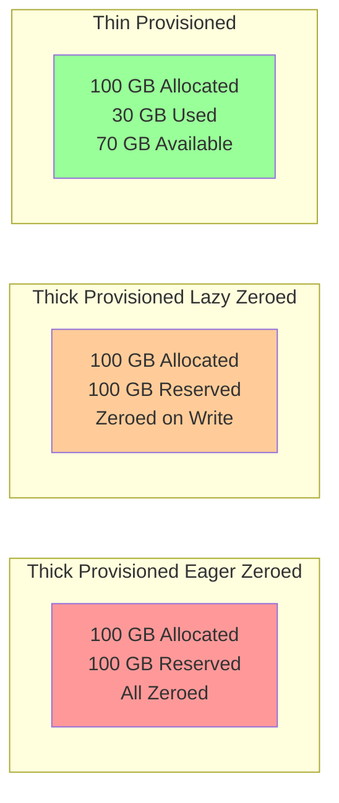
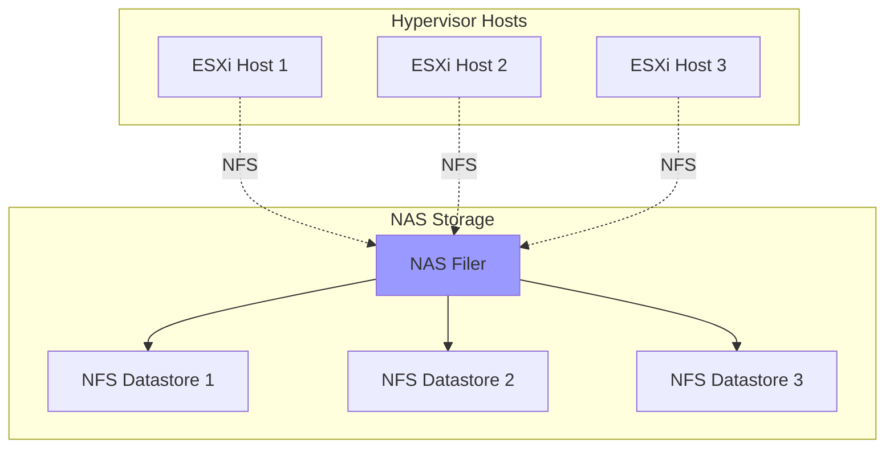
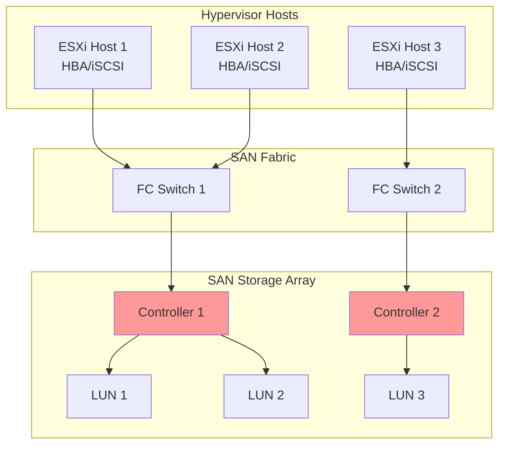
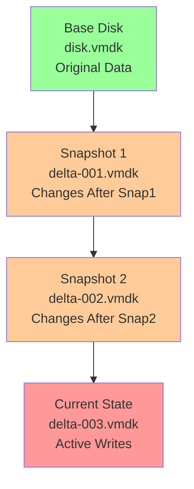

# Virtual Machine Storage

Virtual machine storage is a critical component of virtualized infrastructure, providing persistent data storage for VMs and enabling features like snapshots, cloning, and migration. Understanding VM storage architectures, types, and best practices is essential for building performant, reliable, and scalable virtual environments.

## Virtual Disk Fundamentals

### Virtual Disk Files

Virtual disks are files on the host filesystem that appear as physical hard drives to guest operating systems. They provide storage abstraction and enable advanced features not available with physical disks.

**Virtual Disk Formats**:

| Format | Platform | Features | Use Case |
|--------|----------|----------|----------|
| **VMDK** | VMware | Snapshots, thin provisioning, multi-file | VMware vSphere, Workstation |
| **VHD** | Microsoft | Fixed/dynamic sizing, differencing disks | Hyper-V (legacy) |
| **VHDX** | Microsoft | 64TB size, corruption resilience, trim support | Hyper-V (modern) |
| **QCOW2** | QEMU/KVM | Copy-on-write, snapshots, compression, encryption | KVM, OpenStack |
| **RAW** | Universal | No overhead, maximum performance | High-performance workloads |
| **VDI** | Oracle | Dynamic allocation, snapshots | VirtualBox |

### Virtual Disk Types

**Thick Provisioned (Eager Zeroed)**:
- All space allocated and zeroed at creation time
- Best performance (no overhead during writes)
- Cannot be thin provisioned
- Use case: Production databases, performance-critical applications

**Thick Provisioned (Lazy Zeroed)**:
- All space allocated at creation but zeroed on first write
- Moderate performance (zeroing overhead on first write)
- Faster creation than eager zeroed
- Use case: General production workloads

**Thin Provisioned**:
- Space allocated on demand as data is written
- Storage efficiency (only uses space actually needed)
- Risk of over-provisioning and out-of-space conditions
- Use case: Development, test, VDI, environments with low utilization



**Virtual Disk Creation Examples**:
```bash
# VMware: Create thick eager zeroed disk
vmkfstools -c 100G -d eagerzeroedthick /vmfs/volumes/datastore1/vm1/disk1.vmdk

# VMware: Create thin provisioned disk
vmkfstools -c 100G -d thin /vmfs/volumes/datastore1/vm1/disk2.vmdk

# KVM: Create QCOW2 disk
qemu-img create -f qcow2 disk.qcow2 100G

# KVM: Create RAW disk
qemu-img create -f raw disk.raw 100G

# Hyper-V: Create dynamic VHDX
New-VHD -Path C:\VMs\disk1.vhdx -Dynamic -SizeBytes 100GB

# Hyper-V: Create fixed VHDX
New-VHD -Path C:\VMs\disk2.vhdx -Fixed -SizeBytes 100GB
```

## Storage Architectures

### Direct-Attached Storage (DAS)

DAS connects storage directly to the hypervisor host via local interfaces (SATA, SAS, NVMe).

**Characteristics**:
- **Performance**: Excellent performance, especially with SSDs/NVMe
- **Simplicity**: Simple configuration, no network overhead
- **Limitations**: Limited sharing, no live migration support (without shared storage)
- **Use Cases**: Single-host deployments, performance-critical workloads, edge computing

**DAS Technologies**:
- SATA SSDs: Consumer-grade, good performance
- SAS SSDs: Enterprise-grade, better reliability
- NVMe SSDs: Highest performance, lowest latency
- Hardware RAID: Data protection and performance

### Network-Attached Storage (NAS)

NAS provides file-level storage access over network protocols (NFS, SMB/CIFS).

**Characteristics**:
- **Sharing**: Multiple hosts access same storage
- **Protocols**: NFS (Linux), SMB/CIFS (Windows)
- **Features**: Snapshots, replication, thin provisioning
- **Performance**: Network-dependent, suitable for most workloads
- **Use Cases**: Shared VM storage, centralized management, VDI



**NFS Configuration (VMware)**:
```bash
# Add NFS datastore
esxcli storage nfs add \
  --host=192.168.1.100 \
  --share=/vol/nfs_datastore1 \
  --volume-name=NFS_Datastore1

# List NFS datastores
esxcli storage nfs list

# Remove NFS datastore
esxcli storage nfs remove --volume-name=NFS_Datastore1
```

### Storage Area Network (SAN)

SAN provides block-level storage access over dedicated network infrastructure (Fibre Channel, iSCSI, FCoE).

**SAN Protocols**:

| Protocol | Transport | Speed | Use Case |
|----------|-----------|-------|----------|
| **Fibre Channel (FC)** | Dedicated FC network | 8/16/32 Gbps | Enterprise, mission-critical |
| **iSCSI** | IP network (Ethernet) | 1/10/25/100 Gbps | Cost-effective, flexible |
| **FCoE** | Converged Ethernet | 10/40 Gbps | Datacenter consolidation |
| **NVMe over Fabrics** | RDMA, FC, TCP | 25/100 Gbps | Ultra-high performance |

**Characteristics**:
- **Performance**: High performance, low latency
- **Scalability**: Scales to thousands of hosts and PBs of storage
- **Features**: Advanced features (snapshots, replication, deduplication, thin provisioning)
- **Complexity**: Requires specialized knowledge and infrastructure
- **Use Cases**: Enterprise virtualization, databases, high-performance computing



**iSCSI Configuration (VMware)**:
```bash
# Enable software iSCSI adapter
esxcli iscsi software set --enabled=true

# Get iSCSI adapter name
esxcli iscsi adapter list

# Add iSCSI target
esxcli iscsi adapter discovery sendtarget add \
  --adapter=vmhba65 \
  --address=192.168.1.200:3260

# Rescan for new devices
esxcli storage core adapter rescan --adapter=vmhba65
```

### Hyper-Converged Infrastructure (HCI)

HCI combines compute, storage, and networking in a single appliance, with software-defined storage distributed across cluster nodes.

**Characteristics**:
- **Architecture**: Distributed storage across all nodes
- **Scalability**: Scale-out by adding nodes
- **Simplicity**: Unified management, reduced complexity
- **Resilience**: Data replication across nodes
- **Use Cases**: VDI, remote offices, general virtualization

**HCI Examples**:
- **VMware vSAN**: Aggregates local storage into shared datastore
- **Nutanix**: Complete HCI platform with built-in storage
- **Microsoft Storage Spaces Direct (S2D)**: Windows Server-based HCI
- **Ceph**: Open-source distributed storage system

## Storage Features

### Snapshots

Snapshots capture the state of a VM at a specific point in time, enabling quick recovery and testing.

**Snapshot Types**:
- **Crash-Consistent**: Captures disk state (default)
- **Application-Consistent**: Uses VSS (Windows) or scripts to quiesce applications
- **Memory Snapshots**: Includes VM memory state for complete restoration

**Snapshot Architecture**:


**Best Practices**:
- Limit snapshot retention (24-72 hours maximum)
- Avoid snapshot chains longer than 2-3 snapshots
- Monitor snapshot size and growth
- Delete snapshots promptly after use
- Backup before creating snapshots
- Use storage-based snapshots for long-term retention

**Snapshot Management (VMware)**:
```bash
# Create snapshot
vim-cmd vmsvc/snapshot.create <vmid> "Snapshot Name" "Description" true true

# List snapshots
vim-cmd vmsvc/snapshot.get <vmid>

# Revert to snapshot
vim-cmd vmsvc/snapshot.revert <vmid> <snapshotid>

# Delete snapshot
vim-cmd vmsvc/snapshot.remove <vmid> <snapshotid>

# Delete all snapshots
vim-cmd vmsvc/snapshot.removeall <vmid>
```

### Cloning

Cloning creates a copy of a VM, either as a full clone (independent copy) or linked clone (shares base disk).

**Clone Types**:

**Full Clone**:
- Complete independent copy
- No dependency on source VM
- Requires full disk space
- Use case: Production deployments, disaster recovery

**Linked Clone**:
- Shares base disk with parent
- Fast creation (seconds)
- Space-efficient (only stores differences)
- Dependent on parent disk
- Use case: VDI, testing, development

```bash
# VMware: Full clone via PowerCLI
New-VM -Name "Clone-VM" -VM "Source-VM" -Datastore "datastore1"

# KVM: Clone with virt-clone
virt-clone --original source-vm --name clone-vm --auto-clone

# Convert QCOW2 to full clone
qemu-img convert -O qcow2 source.qcow2 clone.qcow2
```

### Thin Provisioning

Thin provisioning allocates storage on demand, improving storage utilization and reducing costs.

**Benefits**:
- Storage efficiency (only consume space actually used)
- Over-subscription (allocate more virtual capacity than physical)
- Reduced upfront costs
- Faster VM deployment

**Risks**:
- Storage exhaustion if not monitored
- Performance degradation during space reclamation
- Complexity in capacity planning

**Monitoring**:
```bash
# VMware: Check thin provisioned space
esxcli storage vmfs extent list

# Monitor datastore capacity
vim-cmd hostsvc/datastore/info datastore1

# Reclaim unused space (UNMAP)
esxcli storage vmfs unmap -l datastore1
```

### Deduplication and Compression

Storage efficiency features that reduce physical storage requirements.

**Deduplication**:
- Eliminates duplicate data blocks
- Inline (during write) or post-process (background)
- Ratios: 2:1 to 10:1+ depending on workload
- Examples: VMware vSAN dedup, NetApp deduplication

**Compression**:
- Reduces data size using compression algorithms
- Inline or post-process
- Ratios: 1.5:1 to 3:1 typical
- Trade-off: CPU overhead vs. storage savings

### Storage I/O Control (SIOC)

SIOC prioritizes storage I/O during contention, ensuring critical VMs get required performance.

**Features**:
- Automatic threshold detection
- Share-based allocation
- Latency-based triggering
- Per-VM I/O limits

**Configuration (VMware)**:
```bash
# Enable SIOC on datastore
# Set latency threshold (default: 30ms)
# Configure VM shares (high/normal/low)
```

## Performance Optimization

### Storage Performance Metrics

**Key Metrics**:
- **IOPS**: Input/Output Operations Per Second
- **Throughput**: MB/s or GB/s
- **Latency**: Milliseconds (read/write latency)
- **Queue Depth**: Outstanding I/O requests
- **Block Size**: Size of I/O operations (4KB, 8KB, 64KB, etc.)

**Performance Benchmarking**:
```bash
# fio - Flexible I/O tester (Linux)
fio --name=randread --ioengine=libaio --rw=randread --bs=4k \
    --size=10G --numjobs=4 --runtime=60 --group_reporting

# CrystalDiskMark (Windows)
# Sequential read/write, 4K random read/write

# VMware: esxtop storage view
esxtop
# Press 'd' for disk adapter view
# Press 'u' for disk VM view
```

### Best Practices

1. **Align Partitions**: Ensure guest OS partitions are properly aligned (critical for performance)
   ```bash
   # Check alignment (Linux)
   fdisk -lu /dev/sda

   # Windows: Use diskpart or format with cluster size
   ```

2. **Use Paravirtualized SCSI Controllers**: VMware PVSCSI, VirtIO SCSI for better performance
   ```bash
   # VMware: Change to PVSCSI controller
   # Requires driver installation in guest OS
   ```

3. **Separate Workload Types**: Place IOPS-intensive workloads on separate datastores/LUNs

4. **Monitor and Right-Size**: Track actual usage and adjust allocations
   ```bash
   # Monitor disk performance (VMware)
   esxtop -b -d 5 -n 12 > esxtop.csv
   ```

5. **Enable Storage Acceleration**:
   - VAAI (VMware vStorage APIs for Array Integration)
   - ODX (Offloaded Data Transfer) for Hyper-V
   - Hardware offload for cloning, zeroing, locking

6. **Configure Multipathing**: Use multiple paths to storage for redundancy and load balancing
   ```bash
   # VMware: View paths
   esxcli storage nmp path list

   # Set path policy (Round Robin recommended for active-active arrays)
   esxcli storage nmp device set --device naa.xxx --psp VMW_PSP_RR
   ```

7. **Use SSD/NVMe for Hot Data**: Place active data on fast storage tiers

8. **Implement Storage Tiering**: Automatic data movement between tiers based on access patterns

## Cloud Storage

### AWS EBS (Elastic Block Store)

AWS EBS provides block storage for EC2 instances with various performance tiers.

**Volume Types**:
- **gp3**: General Purpose SSD (baseline 3000 IOPS, configurable)
- **gp2**: General Purpose SSD (IOPS scales with size)
- **io2 Block Express**: Provisioned IOPS SSD (up to 256,000 IOPS, sub-ms latency)
- **st1**: Throughput Optimized HDD (big data, data warehouses)
- **sc1**: Cold HDD (infrequent access)

**Features**:
- Snapshots to S3
- Encryption at rest
- Multi-Attach (io2 only)
- Elastic Volumes (resize online)

### Azure Managed Disks

Azure Managed Disks provide block storage for Azure VMs.

**Disk Types**:
- **Ultra Disk**: Highest performance (up to 160,000 IOPS)
- **Premium SSD v2**: Configurable performance independent of size
- **Premium SSD**: Production workloads (up to 20,000 IOPS)
- **Standard SSD**: Web servers, lightly used apps
- **Standard HDD**: Backup, non-critical

**Features**:
- Snapshots and images
- Encryption (SSE, customer-managed keys)
- Shared disks (Premium SSD only)
- Disk bursting

### GCP Persistent Disks

Google Cloud Persistent Disks provide block storage for Compute Engine VMs.

**Disk Types**:
- **Extreme**: Highest performance (up to 120,000 IOPS)
- **SSD**: Balanced performance/cost (up to 100,000 IOPS)
- **Balanced**: Lower cost than SSD (up to 80,000 IOPS)
- **Standard**: HDD-backed, lowest cost

**Features**:
- Regional persistent disks (replicated across zones)
- Snapshots
- Encryption
- Resize while attached

## Backup and Recovery

### Backup Strategies

**Backup Methods**:
- **Full Backup**: Complete copy of all data
- **Incremental Backup**: Only changes since last backup (any type)
- **Differential Backup**: Changes since last full backup

**Backup Technologies**:
- **Image-Based Backup**: Captures entire VM (Veeam, Commvault, Cohesity)
- **Agent-Based Backup**: In-guest agent backs up data
- **Snapshot-Based**: Uses storage snapshots for backup
- **CDP**: Continuous Data Protection (near-zero RPO)

### Disaster Recovery

**Key Metrics**:
- **RTO** (Recovery Time Objective): Maximum acceptable downtime
- **RPO** (Recovery Point Objective): Maximum acceptable data loss

**DR Solutions**:
- **Storage Replication**: Array-based replication to DR site
- **VM Replication**: VMware vSphere Replication, Hyper-V Replica
- **Backup-Based DR**: Restore from backup at DR site
- **DRaaS**: Disaster Recovery as a Service (cloud-based DR)

## Summary

Virtual machine storage is a complex topic with many options for architecture, performance, and features. Key takeaways:

- **Virtual disk formats** (VMDK, VHDX, QCOW2, RAW) provide storage abstraction with various features and performance characteristics
- **Provisioning types** (thick eager/lazy, thin) offer trade-offs between performance and storage efficiency
- **Storage architectures** (DAS, NAS, SAN, HCI) serve different scales and requirements
- **Advanced features** like snapshots, cloning, thin provisioning, and deduplication enable efficiency and flexibility
- **Performance optimization** requires understanding metrics, proper configuration, and continuous monitoring
- **Cloud storage** offers managed block storage with multiple performance tiers and built-in features
- **Backup and DR** are critical for data protection and business continuity

Understanding storage fundamentals and best practices ensures your virtual infrastructure delivers the performance, availability, and data protection required for modern workloads.
