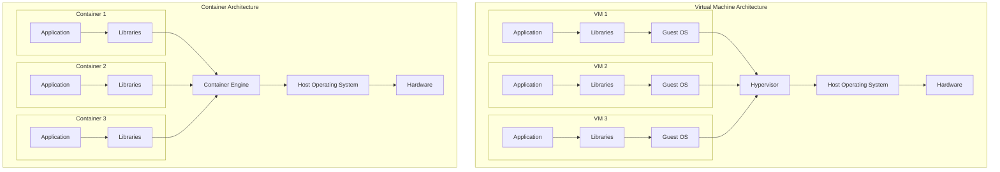
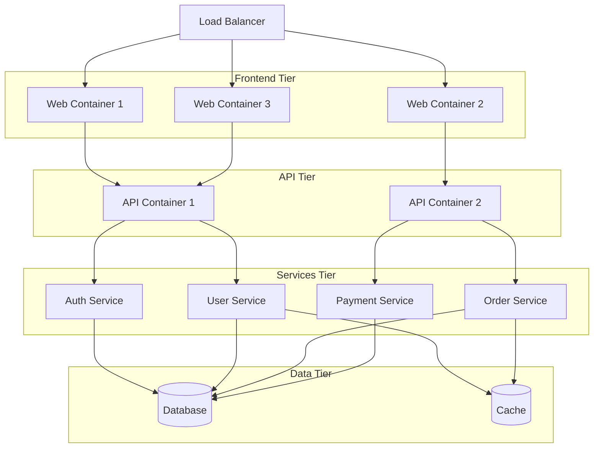
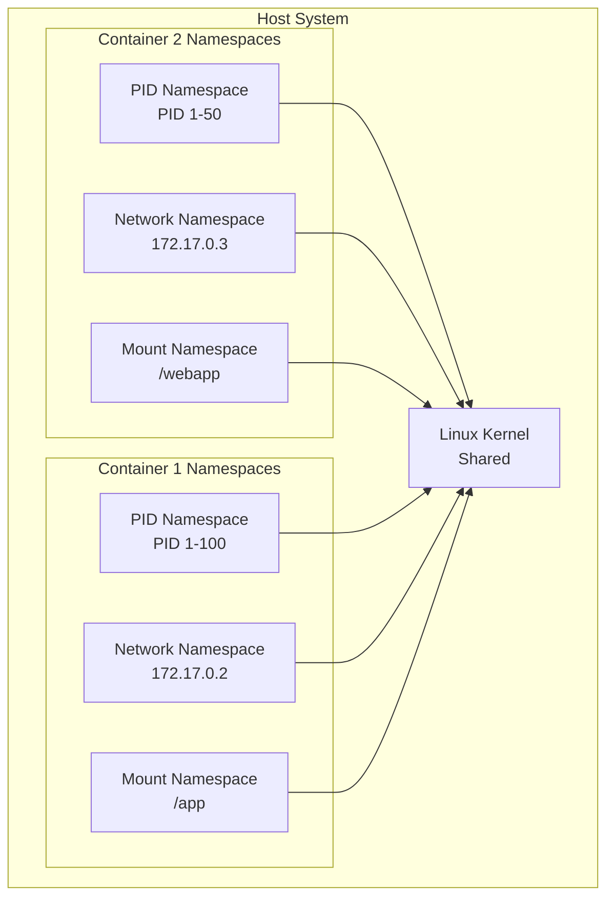
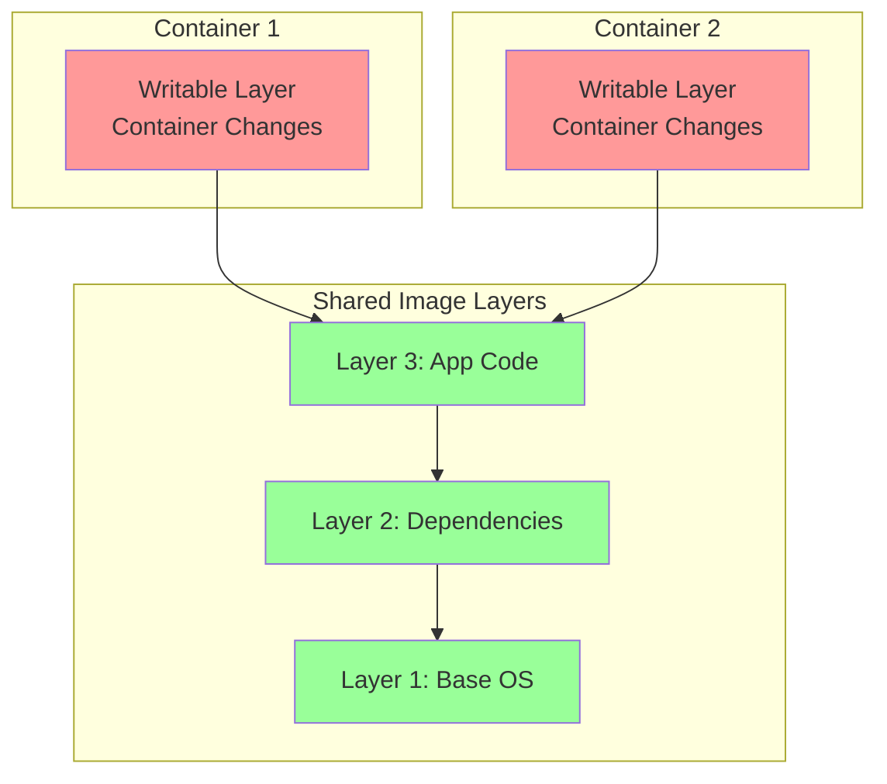

# Introduction to Containers

Containers have revolutionized application deployment by providing lightweight, portable, and consistent environments for running applications. Unlike traditional virtualization that virtualizes hardware, containers virtualize the operating system, enabling multiple isolated applications to share the same OS kernel while maintaining separation and security.

## What Are Containers?

Containers are lightweight, standalone, executable packages that include everything needed to run an application: code, runtime, system tools, libraries, and settings. They package software in a standardized way that works consistently across different computing environments.

**Container Definition**:
> A container is an isolated environment that shares the host operating system kernel but maintains its own filesystem, network, and process namespace, providing application-level virtualization with minimal overhead.

### Container Characteristics

**Lightweight**:
- No full operating system required
- Share host OS kernel
- Megabytes in size vs. gigabytes for VMs
- Start in milliseconds vs. minutes for VMs

**Portable**:
- Run consistently across environments (dev, test, production)
- Work on laptop, on-premises datacenter, and cloud
- "Build once, run anywhere" philosophy

**Isolated**:
- Separate process spaces
- Independent filesystem
- Isolated networking
- Resource limits (CPU, memory)

**Efficient**:
- Higher density than VMs
- Lower resource overhead
- Faster startup and shutdown
- Better resource utilization

## Containers vs. Virtual Machines

Understanding the differences between containers and virtual machines is crucial for selecting the right technology for your use case.



### Comparison Table

| Aspect | Virtual Machines | Containers |
|--------|------------------|------------|
| **Virtualization Level** | Hardware | Operating System |
| **Size** | Gigabytes | Megabytes |
| **Startup Time** | Minutes | Milliseconds to seconds |
| **Performance** | Near-native (with hardware assist) | Native |
| **Isolation** | Complete OS isolation | Process-level isolation |
| **Resource Overhead** | Higher (full OS per VM) | Lower (shared kernel) |
| **Density** | Tens per host | Hundreds to thousands per host |
| **Portability** | Less portable (hardware dependencies) | Highly portable |
| **Security** | Stronger isolation (separate kernel) | Weaker isolation (shared kernel) |
| **Use Cases** | Different OS requirements, strong isolation | Microservices, cloud-native apps, CI/CD |

**When to Use VMs**:
- Running different operating systems (Windows and Linux)
- Strong security isolation requirements
- Legacy applications with specific OS dependencies
- Long-running, stateful applications

**When to Use Containers**:
- Microservices architectures
- Cloud-native applications
- CI/CD pipelines
- Scalable, stateless applications
- Development and testing environments

## Container Technology History

### Evolution Timeline

**2000: FreeBSD Jails**:
- First mainstream container technology
- Process isolation and resource management
- Influenced later container systems

**2004: Solaris Zones**:
- OS-level virtualization for Solaris
- Complete application environment isolation
- Resource management and security

**2005: OpenVZ**:
- Operating system-level virtualization for Linux
- Container-based virtualization
- Template-based deployment

**2006: Process Containers (cgroups)**:
- Google develops control groups (cgroups)
- Resource limiting and prioritization
- Foundation for modern Linux containers

**2008: LXC (Linux Containers)**:
- Combined cgroups and namespaces
- Lightweight virtualization
- Precursor to Docker

**2013: Docker Launch**:
- Made containers accessible to masses
- Simplified container creation and distribution
- Docker Hub for image sharing
- Revolutionized application deployment

**2014: Kubernetes Release**:
- Google releases Kubernetes (K8s)
- Container orchestration platform
- Became industry standard for container management

**2016: containerd and CRI-O**:
- Industry moves toward open standards
- Container runtime standardization
- OCI (Open Container Initiative) specifications

**Present Day**:
- Containers are mainstream in cloud computing
- Dominant deployment model for cloud-native applications
- Integral to DevOps and CI/CD workflows

## Container Use Cases

### Microservices Architecture

Containers are ideal for microservices, where applications are decomposed into small, independent services.

**Benefits**:
- Independent deployment and scaling
- Technology diversity (different languages/frameworks)
- Fault isolation
- Faster development cycles

**Example Architecture**:


### CI/CD Pipelines

Containers provide consistent build, test, and deployment environments.

**Advantages**:
- Consistent environments from dev to production
- Isolated build environments
- Parallel test execution
- Fast deployment and rollback

**Pipeline Example**:


### Development Environments

Containers standardize development environments across teams.

**Benefits**:
- Eliminate "works on my machine" problems
- Quick environment setup (minutes vs. hours/days)
- Version-controlled environment definitions
- Easy sharing and collaboration

### Application Modernization

Containers enable lift-and-shift migrations of legacy applications.

**Strategies**:
- Containerize existing applications without code changes
- Gradual decomposition into microservices
- Run alongside modern cloud-native apps
- Easier cloud migration path

### Edge Computing

Containers are ideal for edge deployments due to their small footprint.

**Use Cases**:
- IoT gateways
- Retail stores
- Manufacturing facilities
- Content delivery networks (CDN)

## Container Ecosystem

### Container Runtimes

**Docker**:
- Most popular container platform
- Complete container lifecycle management
- Docker Hub for image distribution
- Industry-standard image format

**containerd**:
- CNCF graduated project
- Core container runtime (used by Docker, Kubernetes)
- OCI-compliant
- Lightweight and focused

**CRI-O**:
- Kubernetes-native container runtime
- Implements Kubernetes CRI (Container Runtime Interface)
- Optimized for Kubernetes
- Lightweight alternative to Docker

**Podman**:
- Daemonless container engine
- Docker-compatible CLI
- Rootless containers by default
- Red Hat sponsored

### Container Orchestration

**Kubernetes**:
- De facto standard for container orchestration
- Automated deployment, scaling, and management
- Self-healing and load balancing
- Extensive ecosystem

**Docker Swarm**:
- Native Docker orchestration
- Simpler than Kubernetes
- Integrated with Docker CLI
- Good for smaller deployments

**Amazon ECS**:
- AWS-managed container orchestration
- Deep AWS integration
- Fargate for serverless containers
- Good for AWS-centric deployments

### Container Registries

**Docker Hub**:
- Public container image registry
- Millions of images
- Official and community images
- Free and paid tiers

**Harbor**:
- Open-source enterprise registry
- Security scanning and signing
- Replication across registries
- RBAC and LDAP integration

**Cloud Provider Registries**:
- Amazon ECR (Elastic Container Registry)
- Azure Container Registry (ACR)
- Google Container Registry (GCR)
- Private, secure, integrated with cloud services

## Linux Container Fundamentals

### Namespaces

Namespaces provide isolation for containers by creating separate views of system resources.

**Namespace Types**:

1. **PID Namespace**: Process ID isolation
   - Each container has its own process tree
   - PID 1 inside container is different from host PID

2. **Network Namespace**: Network stack isolation
   - Virtual network interfaces
   - Separate IP addresses, routing tables
   - Independent firewall rules

3. **Mount Namespace**: Filesystem isolation
   - Separate filesystem hierarchy
   - Container cannot see host filesystem (except mounted volumes)

4. **UTS Namespace**: Hostname and domain name isolation
   - Each container can have unique hostname

5. **IPC Namespace**: Inter-process communication isolation
   - Separate message queues, semaphores, shared memory

6. **User Namespace**: User and group ID isolation
   - Root inside container can be non-root on host
   - Enhanced security

**Namespace Visualization**:


### Control Groups (cgroups)

cgroups limit and account for resource usage (CPU, memory, disk I/O, network) for groups of processes.

**cgroup Controllers**:

1. **CPU**: CPU time allocation and limits
   - CPU shares (relative priority)
   - CPU quotas (absolute limits)

2. **Memory**: Memory usage limits
   - Hard limit (OOM kill if exceeded)
   - Soft limit (reclaim under pressure)
   - Swap limits

3. **Block I/O**: Disk I/O limits
   - Read/write bandwidth limits
   - IOPS limits
   - Proportional I/O shares

4. **Network**: Network bandwidth control (via tc)
   - Ingress and egress limits

**Resource Limiting Example**:
```bash
# Limit container to 2 CPUs and 2GB memory
docker run --cpus=2 --memory=2g nginx

# Limit read I/O to 100MB/s
docker run --device-read-bps /dev/sda:100mb nginx

# Set CPU shares (relative priority)
docker run --cpu-shares=1024 nginx
```

### Union Filesystems

Union filesystems enable layering of filesystems, allowing containers to share base layers while maintaining separate writable layers.

**How It Works**:
- Read-only layers (image layers) shared across containers
- Writable layer (container layer) per container
- Copy-on-write (COW) for efficiency

**Supported Filesystems**:
- **OverlayFS**: Modern, performant (default in most distros)
- **AUFS**: Legacy, used in older Docker versions
- **Btrfs**: Copy-on-write filesystem
- **Device Mapper**: Block-level storage driver



## Container Security

### Security Considerations

**Kernel Sharing**:
- All containers share host kernel
- Kernel vulnerability affects all containers
- Less isolation than VMs

**Root Access**:
- Container processes often run as root
- Breakout could compromise host
- Use rootless containers when possible

**Image Security**:
- Images may contain vulnerabilities
- Malicious images could compromise system
- Scan images before deployment

### Security Best Practices

1. **Use Official and Trusted Images**:
   - Prefer official images from Docker Hub
   - Verify image signatures
   - Scan images for vulnerabilities

2. **Run as Non-Root User**:
   ```dockerfile
   FROM ubuntu:20.04
   RUN useradd -m appuser
   USER appuser
   ```

3. **Limit Container Capabilities**:
   ```bash
   # Drop all capabilities, add only required ones
   docker run --cap-drop=ALL --cap-add=NET_BIND_SERVICE nginx
   ```

4. **Use Read-Only Filesystems**:
   ```bash
   docker run --read-only --tmpfs /tmp nginx
   ```

5. **Implement Resource Limits**:
   ```bash
   docker run --cpus=1 --memory=512m --pids-limit=100 nginx
   ```

6. **Enable Seccomp and AppArmor/SELinux**:
   - Restrict system calls
   - Mandatory access control
   - Defense in depth

7. **Regular Updates**:
   - Keep host OS patched
   - Update container images regularly
   - Scan for vulnerabilities continuously

## Summary

Containers represent a paradigm shift in application deployment, offering lightweight, portable, and efficient alternatives to traditional virtualization. Key takeaways:

- **Containers virtualize the OS** instead of hardware, sharing the kernel while maintaining application isolation
- **Compared to VMs**, containers are lighter (MBs vs GBs), faster to start (milliseconds vs minutes), and more efficient
- **Use cases** include microservices, CI/CD pipelines, development environments, and edge computing
- **Linux primitives** (namespaces, cgroups, union filesystems) enable container functionality
- **The ecosystem** includes runtimes (Docker, containerd), orchestration (Kubernetes), and registries (Docker Hub, Harbor)
- **Security requires attention** to image quality, user privileges, capabilities, and resource limits

Containers have become essential infrastructure for modern application development and deployment, enabling agility, portability, and efficiency at scale. Understanding container fundamentals prepares you for working with Docker, Kubernetes, and cloud-native architectures.
