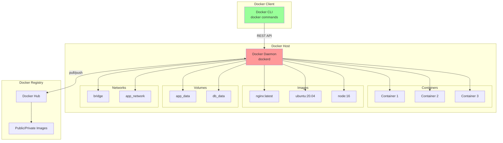
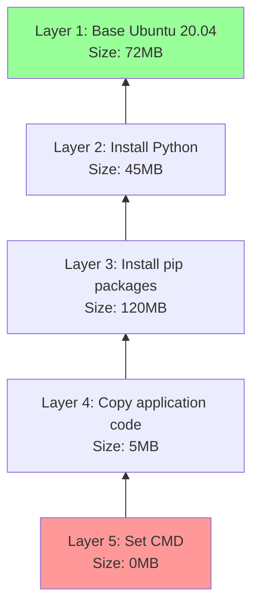
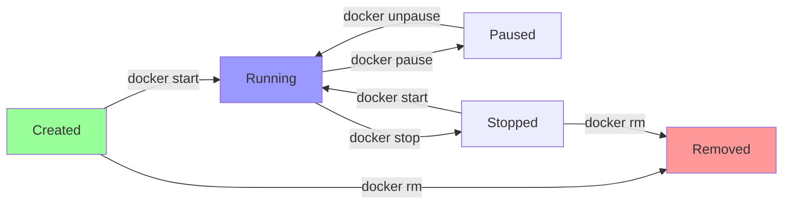

# Docker Basics

Docker is the most widely adopted container platform, providing tools to build, ship, and run containerized applications. This section covers Docker fundamentals, including architecture, installation, core commands, and basic workflows for working with containers and images.

## Docker Architecture

Docker uses a client-server architecture with several key components working together to manage containers.



### Core Components

**Docker Client (docker)**:
- Command-line interface for interacting with Docker
- Sends commands to Docker daemon via REST API
- Can communicate with remote Docker hosts

**Docker Daemon (dockerd)**:
- Background service that manages Docker objects
- Builds, runs, and distributes containers
- Listens for Docker API requests
- Manages images, containers, networks, and volumes

**Docker Images**:
- Read-only templates for creating containers
- Built from Dockerfiles or committed from containers
- Stored in layers for efficiency
- Shared via registries (Docker Hub, private registries)

**Docker Containers**:
- Runnable instances of images
- Isolated environments with own filesystem, network, process tree
- Can be created, started, stopped, moved, and deleted

**Docker Registry**:
- Storage and distribution system for Docker images
- Docker Hub is the default public registry
- Private registries for enterprise use

**Docker Volumes**:
- Persistent data storage outside container filesystem
- Survives container deletion
- Can be shared between containers

**Docker Networks**:
- Virtual networks connecting containers
- Isolation and communication between containers
- Multiple network drivers for different use cases

## Installation

### Linux Installation

```bash
# Ubuntu/Debian
curl -fsSL https://get.docker.com -o get-docker.sh
sudo sh get-docker.sh

# Add user to docker group (avoid sudo)
sudo usermod -aG docker $USER
newgrp docker

# Verify installation
docker --version
docker run hello-world

# CentOS/RHEL
sudo yum install -y yum-utils
sudo yum-config-manager --add-repo https://download.docker.com/linux/centos/docker-ce.repo
sudo yum install docker-ce docker-ce-cli containerd.io
sudo systemctl start docker
sudo systemctl enable docker
```

### macOS and Windows Installation

**Docker Desktop**:
- Download from docker.com
- Includes Docker Engine, Docker CLI, Docker Compose
- Provides GUI for managing containers
- Runs Docker in a lightweight VM

### Verify Installation

```bash
# Check Docker version
docker version

# Check Docker info
docker info

# Run test container
docker run hello-world
```

## Working with Images

### Understanding Images

Docker images are built in layers, with each layer representing a filesystem change. Layers are cached and reused, making images efficient.

**Image Layers**:


### Pulling Images

```bash
# Pull latest version
docker pull nginx

# Pull specific version (tag)
docker pull nginx:1.21

# Pull from specific registry
docker pull gcr.io/google-samples/hello-app:1.0

# Pull all tags of an image
docker pull --all-tags nginx

# View pulled images
docker images
```

### Listing Images

```bash
# List all images
docker images

# List with additional details
docker images --all --digests

# Filter images
docker images nginx
docker images --filter "dangling=true"

# Format output
docker images --format "table {{.Repository}}\t{{.Tag}}\t{{.Size}}"
```

### Inspecting Images

```bash
# View image details
docker inspect nginx:latest

# View image history (layers)
docker history nginx:latest

# View image digest
docker images --digests nginx
```

### Removing Images

```bash
# Remove single image
docker rmi nginx:latest

# Remove multiple images
docker rmi nginx:1.21 ubuntu:20.04

# Remove unused images
docker image prune

# Remove all unused images (not just dangling)
docker image prune -a

# Force removal (even if containers exist)
docker rmi -f nginx:latest
```

### Tagging Images

```bash
# Tag an image
docker tag nginx:latest myregistry.com/nginx:v1.0

# Create multiple tags
docker tag nginx:latest nginx:production
docker tag nginx:latest nginx:1.21.6

# Push tagged image to registry
docker push myregistry.com/nginx:v1.0
```

## Working with Containers

### Creating and Running Containers

**Basic Run Command**:
```bash
# Run container in foreground
docker run nginx

# Run container in background (detached)
docker run -d nginx

# Run with custom name
docker run -d --name my-nginx nginx

# Run and remove after exit
docker run --rm nginx

# Run with interactive terminal
docker run -it ubuntu bash

# Run with port mapping
docker run -d -p 8080:80 nginx

# Run with environment variables
docker run -d -e "ENV=production" -e "DEBUG=false" nginx

# Run with volume mount
docker run -d -v /host/path:/container/path nginx

# Run with resource limits
docker run -d --cpus=2 --memory=1g nginx
```

### Complete Example

```bash
# Run Nginx web server
docker run -d \
  --name web-server \
  -p 8080:80 \
  -v $(pwd)/html:/usr/share/nginx/html:ro \
  -e NGINX_HOST=example.com \
  --restart unless-stopped \
  nginx:latest

# Explanation:
# -d: Run in background
# --name: Assign name "web-server"
# -p 8080:80: Map host port 8080 to container port 80
# -v: Mount local html directory to nginx html directory (read-only)
# -e: Set environment variable
# --restart: Restart policy
# nginx:latest: Image to use
```

### Container Lifecycle



### Managing Containers

**List Containers**:
```bash
# List running containers
docker ps

# List all containers (including stopped)
docker ps -a

# List with custom format
docker ps --format "table {{.ID}}\t{{.Names}}\t{{.Status}}\t{{.Ports}}"

# Filter containers
docker ps --filter "status=running"
docker ps --filter "name=web"
```

**Start/Stop Containers**:
```bash
# Start stopped container
docker start my-nginx

# Stop running container (graceful, 10s timeout)
docker stop my-nginx

# Kill container (immediate termination)
docker kill my-nginx

# Restart container
docker restart my-nginx

# Pause container (freeze processes)
docker pause my-nginx

# Unpause container
docker unpause my-nginx
```

**Remove Containers**:
```bash
# Remove stopped container
docker rm my-nginx

# Force remove running container
docker rm -f my-nginx

# Remove all stopped containers
docker container prune

# Remove container after exit (with run command)
docker run --rm nginx
```

### Interacting with Containers

**Execute Commands**:
```bash
# Execute command in running container
docker exec my-nginx ls /etc/nginx

# Open interactive shell
docker exec -it my-nginx bash

# Execute as specific user
docker exec -u nginx my-nginx whoami

# Execute with environment variables
docker exec -e VAR=value my-nginx env
```

**View Logs**:
```bash
# View container logs
docker logs my-nginx

# Follow logs in real-time
docker logs -f my-nginx

# View last N lines
docker logs --tail 100 my-nginx

# View logs with timestamps
docker logs -t my-nginx

# View logs since specific time
docker logs --since 2024-01-01T00:00:00 my-nginx
```

**Inspect Containers**:
```bash
# View detailed container information
docker inspect my-nginx

# Get specific field (using Go template)
docker inspect --format='{{.State.Status}}' my-nginx
docker inspect --format='{{.NetworkSettings.IPAddress}}' my-nginx

# View container processes
docker top my-nginx

# View container resource usage
docker stats my-nginx

# View container filesystem changes
docker diff my-nginx
```

**Copy Files**:
```bash
# Copy from container to host
docker cp my-nginx:/etc/nginx/nginx.conf ./nginx.conf

# Copy from host to container
docker cp ./index.html my-nginx:/usr/share/nginx/html/

# Copy directory
docker cp my-nginx:/var/log/nginx ./logs
```

## Container Networking Basics

### Network Drivers

**Bridge (default)**:
- Private internal network on host
- Containers can communicate with each other
- NAT for external access

**Host**:
- Share host's network stack
- No network isolation
- Best performance

**None**:
- No networking
- Complete network isolation

```bash
# Run with default bridge network
docker run -d nginx

# Run with host network
docker run -d --network host nginx

# Run with no network
docker run -d --network none nginx

# Create custom bridge network
docker network create my-network
docker run -d --network my-network --name web nginx

# Connect running container to network
docker network connect my-network my-nginx
```

### Port Mapping

```bash
# Map single port
docker run -d -p 8080:80 nginx

# Map to random host port
docker run -d -p 80 nginx

# Map specific host IP
docker run -d -p 127.0.0.1:8080:80 nginx

# Map multiple ports
docker run -d -p 8080:80 -p 8443:443 nginx

# Map UDP port
docker run -d -p 53:53/udp dns-server

# View port mappings
docker port my-nginx
```

## Data Persistence with Volumes

### Volume Types

**Named Volumes** (managed by Docker):
```bash
# Create volume
docker volume create my-data

# Run container with volume
docker run -d -v my-data:/var/lib/mysql mysql

# List volumes
docker volume ls

# Inspect volume
docker volume inspect my-data

# Remove volume
docker volume rm my-data

# Remove unused volumes
docker volume prune
```

**Bind Mounts** (host filesystem path):
```bash
# Mount host directory
docker run -d -v /host/path:/container/path nginx

# Mount as read-only
docker run -d -v /host/path:/container/path:ro nginx

# Mount current directory
docker run -d -v $(pwd):/app node
```

**tmpfs Mounts** (temporary, memory-only):
```bash
# Create tmpfs mount
docker run -d --tmpfs /tmp nginx

# Specify tmpfs options
docker run -d --tmpfs /tmp:rw,size=100m nginx
```

### Volume Best Practices

```bash
# Named volume for database data
docker run -d \
  --name postgres \
  -v pgdata:/var/lib/postgresql/data \
  -e POSTGRES_PASSWORD=secret \
  postgres

# Bind mount for development (live code changes)
docker run -d \
  --name dev-app \
  -v $(pwd)/src:/app/src \
  -p 3000:3000 \
  node:16

# Read-only bind mount for configuration
docker run -d \
  --name nginx \
  -v $(pwd)/nginx.conf:/etc/nginx/nginx.conf:ro \
  -p 80:80 \
  nginx
```

## Environment Variables and Configuration

### Setting Environment Variables

```bash
# Single environment variable
docker run -d -e MYSQL_ROOT_PASSWORD=secret mysql

# Multiple environment variables
docker run -d \
  -e MYSQL_ROOT_PASSWORD=secret \
  -e MYSQL_DATABASE=myapp \
  -e MYSQL_USER=appuser \
  -e MYSQL_PASSWORD=userpass \
  mysql

# Load from file (.env file)
docker run -d --env-file .env mysql
```

**Example .env file**:
```
MYSQL_ROOT_PASSWORD=secret
MYSQL_DATABASE=myapp
MYSQL_USER=appuser
MYSQL_PASSWORD=userpass
```

## Resource Constraints

### CPU Constraints

```bash
# Limit to 2 CPUs
docker run -d --cpus=2 nginx

# CPU shares (relative weight)
docker run -d --cpu-shares=512 nginx

# Specific CPU cores
docker run -d --cpuset-cpus="0,1" nginx
```

### Memory Constraints

```bash
# Limit memory to 512MB
docker run -d --memory=512m nginx

# Memory reservation (soft limit)
docker run -d --memory=1g --memory-reservation=512m nginx

# Disable swap
docker run -d --memory=512m --memory-swap=512m nginx
```

### Storage Constraints

```bash
# Limit storage size
docker run -d --storage-opt size=10G nginx
```

## Restart Policies

```bash
# No restart (default)
docker run -d --restart no nginx

# Always restart
docker run -d --restart always nginx

# Restart on failure
docker run -d --restart on-failure nginx

# Restart on failure with max retry count
docker run -d --restart on-failure:5 nginx

# Restart unless stopped manually
docker run -d --restart unless-stopped nginx
```

## Health Checks

```bash
# Run with health check
docker run -d \
  --name web \
  --health-cmd="curl -f http://localhost/ || exit 1" \
  --health-interval=30s \
  --health-timeout=10s \
  --health-retries=3 \
  nginx

# View health status
docker inspect --format='{{.State.Health.Status}}' web
```

## Practical Examples

### Example 1: Web Server with Custom Content

```bash
# Create HTML content
mkdir -p html
echo '<h1>Hello from Docker!</h1>' > html/index.html

# Run nginx with custom content
docker run -d \
  --name my-website \
  -p 8080:80 \
  -v $(pwd)/html:/usr/share/nginx/html:ro \
  nginx:alpine

# Test
curl http://localhost:8080
```

### Example 2: Database Container

```bash
# Create volume for persistence
docker volume create postgres-data

# Run PostgreSQL
docker run -d \
  --name postgres-db \
  -e POSTGRES_PASSWORD=mysecretpassword \
  -e POSTGRES_DB=myapp \
  -v postgres-data:/var/lib/postgresql/data \
  -p 5432:5432 \
  postgres:14

# Connect to database
docker exec -it postgres-db psql -U postgres -d myapp
```

### Example 3: Development Environment

```bash
# Run Node.js development environment
docker run -it --rm \
  --name node-dev \
  -v $(pwd):/app \
  -w /app \
  -p 3000:3000 \
  node:16 \
  /bin/bash

# Inside container:
# npm install
# npm start
```

### Example 4: Temporary Test Environment

```bash
# Run Ubuntu container for testing
docker run -it --rm ubuntu:20.04 bash

# Container is automatically deleted when you exit
```

## Cleanup Commands

```bash
# Remove all stopped containers
docker container prune

# Remove all unused images
docker image prune -a

# Remove all unused volumes
docker volume prune

# Remove all unused networks
docker network prune

# Remove everything unused
docker system prune -a --volumes

# View disk usage
docker system df
```

## Common Patterns and Best Practices

### 1. Always Use Specific Tags

```bash
# Bad: Uses latest tag (may change)
docker run nginx

# Good: Uses specific version
docker run nginx:1.21.6
```

### 2. Use Named Volumes for Persistence

```bash
# Bad: Anonymous volume
docker run -d -v /var/lib/mysql mysql

# Good: Named volume
docker run -d -v mysql-data:/var/lib/mysql mysql
```

### 3. Set Resource Limits

```bash
# Production container with limits
docker run -d \
  --name prod-app \
  --cpus=2 \
  --memory=2g \
  --restart unless-stopped \
  myapp:v1.0
```

### 4. Use Health Checks

```bash
# Container with health monitoring
docker run -d \
  --name api-server \
  --health-cmd="curl -f http://localhost:8080/health || exit 1" \
  --health-interval=30s \
  api:latest
```

### 5. Clean Up Regularly

```bash
# Weekly cleanup script
#!/bin/bash
docker container prune -f
docker image prune -f
docker volume prune -f
docker network prune -f
```

## Summary

Docker provides a comprehensive platform for containerized application deployment. Key takeaways:

- **Docker architecture** consists of client, daemon, images, containers, registries, volumes, and networks
- **Images** are pulled from registries, stored in layers, and serve as templates for containers
- **Containers** are created from images, managed through their lifecycle, and isolated from each other
- **Networking** enables container communication through bridge, host, or custom networks
- **Volumes** provide persistent storage beyond container lifecycle
- **Resource constraints** control CPU, memory, and storage usage
- **Best practices** include using specific tags, named volumes, resource limits, and health checks

Understanding Docker basics prepares you for building images with Dockerfiles, orchestrating multi-container applications with Docker Compose, and scaling with Kubernetes.
