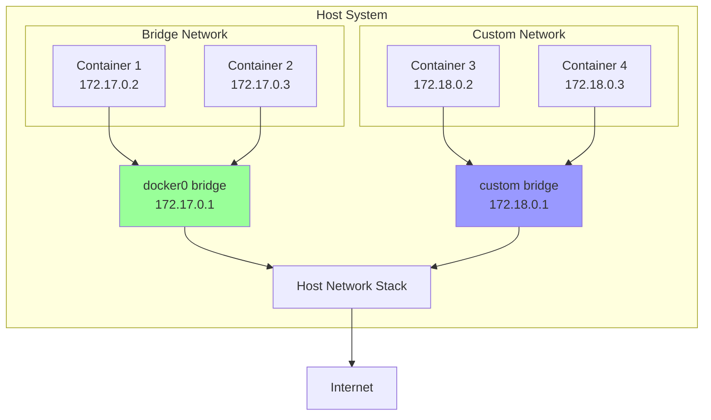
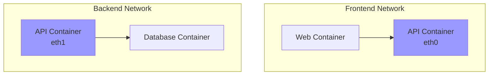

# Docker Networking

Docker networking enables containers to communicate with each other, the host system, and external networks. Understanding Docker's networking model is essential for building multi-container applications, microservices, and distributed systems.

## Docker Network Architecture

Docker uses a pluggable network system with various network drivers for different use cases.



## Network Drivers

### Bridge Network (Default)

Creates a private internal network on the host. Containers on the same bridge network can communicate, while containers on different networks are isolated.

```bash
# Run container on default bridge
docker run -d --name web nginx

# Inspect default bridge network
docker network inspect bridge

# Create custom bridge network
docker network create my-network

# Run container on custom network
docker run -d --name app --network my-network nginx

# Custom bridge with specific subnet
docker network create --subnet=172.20.0.0/16 custom-net
```

**Default Bridge vs Custom Bridge**:

| Feature | Default Bridge | Custom Bridge |
|---------|---------------|---------------|
| **DNS Resolution** | No (use --link) | Yes (automatic) |
| **Isolation** | All containers share | Per-network isolation |
| **Creation** | Automatic | Manual |
| **Best For** | Simple, single container | Multi-container apps |

**Custom Bridge Example**:
```bash
# Create network
docker network create app-network

# Run database
docker run -d \
  --name postgres \
  --network app-network \
  -e POSTGRES_PASSWORD=secret \
  postgres

# Run application (can resolve 'postgres' by name)
docker run -d \
  --name webapp \
  --network app-network \
  -e DB_HOST=postgres \
  myapp

# Containers can communicate by name
docker exec webapp ping postgres
```

### Host Network

Removes network isolation, sharing the host's network stack directly. No port mapping needed.

```bash
# Run with host network
docker run -d --network host nginx

# Container binds directly to host ports
# No -p needed, nginx listens on host's port 80
```

**Use Cases**:
- Maximum network performance
- Complex port requirements
- Network monitoring tools

**Limitations**:
- No network isolation
- Port conflicts with host services
- Not portable (depends on host network config)

### None Network

Complete network isolation - no networking at all.

```bash
# Run with no network
docker run -d --network none alpine sleep 1000

# Container has only loopback interface
docker exec <container> ip addr
```

**Use Cases**:
- Maximum isolation
- Security-sensitive workloads
- Containers that don't need network access

### Overlay Network

Spans multiple Docker hosts, enabling container communication across a cluster. Used with Docker Swarm or Kubernetes.

```bash
# Initialize swarm
docker swarm init

# Create overlay network
docker network create -d overlay my-overlay

# Deploy service using overlay
docker service create \
  --name web \
  --network my-overlay \
  --replicas 3 \
  nginx
```

**Use Cases**:
- Multi-host container deployments
- Docker Swarm services
- Distributed applications

### Macvlan Network

Assigns a MAC address to each container, making them appear as physical devices on the network.

```bash
# Create macvlan network
docker network create -d macvlan \
  --subnet=192.168.1.0/24 \
  --gateway=192.168.1.1 \
  -o parent=eth0 \
  macvlan-net

# Run container with macvlan
docker run -d \
  --network macvlan-net \
  --ip 192.168.1.100 \
  nginx
```

**Use Cases**:
- Legacy applications requiring direct network access
- Network monitoring/packet capture
- Applications expecting to be directly on physical network

## Container Connectivity

### Port Mapping

Expose container ports to the host system.

```bash
# Map single port: host:container
docker run -d -p 8080:80 nginx

# Map to random host port
docker run -d -p 80 nginx

# Map specific interface
docker run -d -p 127.0.0.1:8080:80 nginx

# Map multiple ports
docker run -d -p 8080:80 -p 8443:443 nginx

# Map UDP port
docker run -d -p 53:53/udp dns-server

# Publish all exposed ports
docker run -d -P nginx

# View port mappings
docker port <container>
```

### Container-to-Container Communication

**Using Custom Bridge Networks** (Recommended):
```bash
# Create network
docker network create app-net

# Run containers
docker run -d --name db --network app-net postgres
docker run -d --name backend --network app-net myapp
docker run -d --name frontend --network app-net nginx

# Containers communicate by name
# backend can connect to: postgresql://db:5432
# frontend can proxy to: http://backend:8080
```

**Using Legacy Links** (Deprecated):
```bash
# Not recommended - use custom networks instead
docker run -d --name db postgres
docker run -d --name app --link db:database myapp
```

### DNS Resolution

Custom bridge networks provide automatic DNS resolution.

```bash
# Create network
docker network create mynet

# Run containers
docker run -d --name web --network mynet nginx
docker run -d --name api --network mynet node

# Containers resolve each other by name
docker exec web ping api  # Works
docker exec api curl http://web  # Works

# Container can have network aliases
docker run -d --name db --network mynet --network-alias database postgres
docker exec api ping database  # Works
```

## Network Management

### Create Networks

```bash
# Basic custom network
docker network create mynetwork

# Specify driver
docker network create -d bridge mybridge

# Specify subnet and gateway
docker network create \
  --subnet=172.20.0.0/16 \
  --gateway=172.20.0.1 \
  mynetwork

# Specify IP range
docker network create \
  --subnet=172.20.0.0/16 \
  --ip-range=172.20.240.0/20 \
  mynetwork

# Add labels
docker network create \
  --label env=prod \
  --label app=web \
  mynetwork

# Enable IPv6
docker network create --ipv6 mynetwork
```

### List Networks

```bash
# List all networks
docker network ls

# Filter networks
docker network ls --filter driver=bridge
docker network ls --filter label=env=prod

# Format output
docker network ls --format "{{.ID}}: {{.Name}}"
```

### Inspect Networks

```bash
# Inspect network
docker network inspect mynetwork

# View connected containers
docker network inspect mynetwork --format='{{range .Containers}}{{.Name}} {{end}}'

# View network configuration
docker network inspect mynetwork --format='{{.IPAM.Config}}'
```

### Connect/Disconnect Containers

```bash
# Connect running container to network
docker network connect mynetwork mycontainer

# Connect with specific IP
docker network connect --ip 172.20.0.100 mynetwork mycontainer

# Connect with alias
docker network connect --alias db mynetwork postgres

# Disconnect container
docker network disconnect mynetwork mycontainer

# Disconnect and force (even if container is running)
docker network disconnect -f mynetwork mycontainer
```

### Remove Networks

```bash
# Remove network
docker network rm mynetwork

# Remove all unused networks
docker network prune

# Force remove (even if containers connected)
docker network rm -f mynetwork
```

## Advanced Networking

### Multiple Networks

Containers can connect to multiple networks simultaneously.

```bash
# Create networks
docker network create frontend
docker network create backend

# Run database (backend only)
docker run -d --name db --network backend postgres

# Run API (both networks)
docker run -d --name api --network backend nginx
docker network connect frontend api

# Run web (frontend only)
docker run -d --name web --network frontend nginx

# Result:
# - web can access api (via frontend network)
# - api can access db (via backend network)
# - web CANNOT access db (isolated)
```



### Network Aliases

Provide additional DNS names for containers.

```bash
# Run with alias
docker run -d \
  --name postgres1 \
  --network mynet \
  --network-alias database \
  --network-alias db \
  postgres

# Both names resolve to same container
docker exec client ping database
docker exec client ping db
```

### Custom DNS

Configure custom DNS servers for containers.

```bash
# Set DNS servers
docker run -d --dns 8.8.8.8 --dns 8.8.4.4 nginx

# Set DNS search domains
docker run -d --dns-search example.com nginx

# Add hosts entry
docker run -d --add-host database:192.168.1.100 myapp
```

### Network Options

```bash
# Set container hostname
docker run -d --hostname myhost nginx

# Set domain name
docker run -d --domainname example.com nginx

# Set MAC address
docker run -d --mac-address 02:42:ac:11:00:02 nginx
```

## Network Security

### Network Isolation

```bash
# Isolate with separate networks
docker network create frontend-net
docker network create backend-net
docker network create db-net

# Web tier (frontend only)
docker run -d --name nginx --network frontend-net nginx

# App tier (frontend + backend)
docker run -d --name app --network backend-net myapp
docker network connect frontend-net app

# Database tier (backend only)
docker run -d --name postgres --network db-net postgres
docker network connect backend-net postgres
```

### Encrypted Networks

```bash
# Create encrypted overlay network (Docker Swarm)
docker network create \
  --driver overlay \
  --opt encrypted \
  secure-network
```

### Internal Networks

Create networks without external access.

```bash
# Create internal network (no default gateway)
docker network create --internal db-network

# Containers can communicate internally but not externally
docker run -d --name db --network db-network postgres
docker run -d --name cache --network db-network redis
```

## Practical Examples

### Example 1: Web Application Stack

```bash
# Create networks
docker network create frontend
docker network create backend

# Database (backend only)
docker run -d \
  --name postgres \
  --network backend \
  -e POSTGRES_PASSWORD=secret \
  -v pgdata:/var/lib/postgresql/data \
  postgres:14

# Redis cache (backend only)
docker run -d \
  --name redis \
  --network backend \
  redis:alpine

# API server (both networks)
docker run -d \
  --name api \
  --network backend \
  -e DB_HOST=postgres \
  -e REDIS_HOST=redis \
  myapi:latest

docker network connect frontend api

# Web server (frontend only)
docker run -d \
  --name nginx \
  --network frontend \
  -p 80:80 \
  -v $(pwd)/nginx.conf:/etc/nginx/nginx.conf:ro \
  nginx:alpine
```

### Example 2: Microservices with Service Discovery

```bash
# Create network
docker network create microservices

# Service discovery (Consul)
docker run -d \
  --name consul \
  --network microservices \
  -p 8500:8500 \
  consul agent -server -ui -bootstrap-expect=1 -client=0.0.0.0

# User service
docker run -d \
  --name user-service \
  --network microservices \
  --network-alias users \
  user-service:latest

# Order service
docker run -d \
  --name order-service \
  --network microservices \
  --network-alias orders \
  order-service:latest

# API Gateway
docker run -d \
  --name gateway \
  --network microservices \
  -p 8080:8080 \
  api-gateway:latest
```

### Example 3: Development Environment

```bash
# Create development network
docker network create devnet

# Database
docker run -d \
  --name dev-db \
  --network devnet \
  -e POSTGRES_PASSWORD=dev \
  -p 5432:5432 \
  postgres:14

# Application (with live reload)
docker run -d \
  --name dev-app \
  --network devnet \
  -v $(pwd)/src:/app/src \
  -p 3000:3000 \
  -e DB_HOST=dev-db \
  node:16

# PGAdmin
docker run -d \
  --name pgadmin \
  --network devnet \
  -p 8080:80 \
  -e PGADMIN_DEFAULT_EMAIL=admin@dev.local \
  -e PGADMIN_DEFAULT_PASSWORD=admin \
  dpage/pgadmin4
```

## Troubleshooting

### Inspect Container Network

```bash
# View container network settings
docker inspect <container> --format='{{.NetworkSettings}}'

# Get IP address
docker inspect <container> --format='{{.NetworkSettings.IPAddress}}'

# Get all network connections
docker inspect <container> --format='{{json .NetworkSettings.Networks}}'

# View network from inside container
docker exec <container> ip addr
docker exec <container> ip route
docker exec <container> netstat -tuln
```

### Test Connectivity

```bash
# Ping between containers
docker exec container1 ping container2

# Test specific port
docker exec container1 nc -zv container2 80

# DNS resolution
docker exec container1 nslookup container2
docker exec container1 dig container2

# Trace route
docker exec container1 traceroute container2

# View network connections
docker exec container1 netstat -an
```

### Common Issues

**Issue**: Containers can't communicate by name
```bash
# Solution: Use custom bridge network
docker network create mynet
docker run -d --name c1 --network mynet nginx
docker run -d --name c2 --network mynet alpine
```

**Issue**: Port already in use
```bash
# Find conflicting process
sudo lsof -i :8080
sudo netstat -tuln | grep 8080

# Use different host port
docker run -d -p 8081:80 nginx
```

**Issue**: Can't access external network
```bash
# Check DNS
docker exec container cat /etc/resolv.conf

# Set custom DNS
docker run -d --dns 8.8.8.8 nginx

# Check network connectivity
docker exec container ping 8.8.8.8
```

## Best Practices

1. **Use Custom Bridge Networks**: Enable automatic DNS resolution
   ```bash
   docker network create app-network
   ```

2. **Network Segmentation**: Isolate tiers (frontend, backend, database)
   ```bash
   docker network create frontend
   docker network create backend
   docker network create database
   ```

3. **Use Internal Networks**: For services that don't need external access
   ```bash
   docker network create --internal db-net
   ```

4. **Avoid Host Network**: Unless absolutely necessary for performance

5. **Use Network Aliases**: For service discovery and flexibility
   ```bash
   docker run --network mynet --network-alias api myservice
   ```

6. **Document Port Mappings**: Use labels and documentation
   ```bash
   docker run --label "port.http=8080" -p 8080:80 nginx
   ```

7. **Clean Up Unused Networks**: Regularly prune
   ```bash
   docker network prune
   ```

## Summary

Docker networking provides flexible, powerful options for container communication. Key takeaways:

- **Network drivers** (bridge, host, none, overlay, macvlan) serve different use cases
- **Custom bridge networks** provide automatic DNS resolution and isolation
- **Port mapping** exposes container services to the host and external networks
- **Multiple networks** enable network segmentation and security
- **Network aliases** provide service discovery and flexible naming
- **Best practices** include using custom networks, segmentation, and avoiding unnecessary host network usage

Understanding Docker networking enables you to build secure, scalable, multi-container applications with proper isolation and communication patterns.
