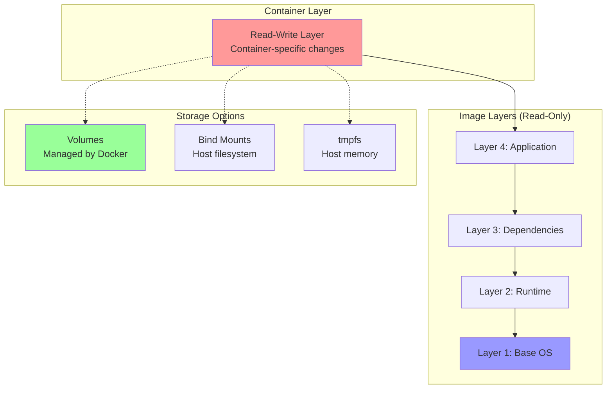

# Docker Storage and Volumes

Docker containers are ephemeral by design - when a container is removed, all data inside it is lost. Docker provides several storage mechanisms to persist data beyond container lifecycle, share data between containers, and optimize storage performance.

## Docker Storage Architecture



## Storage Types

### 1. Volumes (Recommended)

Volumes are managed by Docker and stored in a Docker-managed location on the host filesystem (`/var/lib/docker/volumes/` on Linux).

**Advantages**:
- Managed by Docker
- Persist beyond container lifecycle
- Easy backup and restore
- Can be shared between containers
- Work on all platforms (Linux, Windows, macOS)
- Support volume drivers for remote/cloud storage

**Create and Use Volumes**:
```bash
# Create named volume
docker volume create my-vol

# Create volume with options
docker volume create --driver local \
  --opt type=nfs \
  --opt o=addr=192.168.1.1,rw \
  --opt device=:/path/to/dir \
  my-nfs-vol

# List volumes
docker volume ls

# Inspect volume
docker volume inspect my-vol

# Use volume with container
docker run -d \
  --name web \
  -v my-vol:/usr/share/nginx/html \
  nginx

# Anonymous volume (auto-generated name)
docker run -d -v /usr/share/nginx/html nginx

# Multiple volumes
docker run -d \
  -v data-vol:/data \
  -v config-vol:/etc/config \
  myapp
```

**Volume Management**:
```bash
# Remove volume
docker volume rm my-vol

# Remove all unused volumes
docker volume prune

# Force remove (even if in use)
docker volume rm -f my-vol

# Backup volume
docker run --rm \
  -v my-vol:/source \
  -v $(pwd):/backup \
  ubuntu tar czf /backup/my-vol-backup.tar.gz -C /source .

# Restore volume
docker run --rm \
  -v my-vol:/destination \
  -v $(pwd):/backup \
  ubuntu tar xzf /backup/my-vol-backup.tar.gz -C /destination
```

### 2. Bind Mounts

Bind mounts map a host filesystem path directly into a container. The file or directory must exist on the host.

**Advantages**:
- Direct access to host files
- Useful for development (live code reload)
- Can access files anywhere on host

**Disadvantages**:
- Depend on host filesystem structure
- Security concerns (container can modify host files)
- Not portable across different hosts

**Use Bind Mounts**:
```bash
# Basic bind mount
docker run -d \
  -v /host/path:/container/path \
  nginx

# Current directory
docker run -d \
  -v $(pwd):/app \
  node:16

# Read-only bind mount
docker run -d \
  -v /host/config:/etc/config:ro \
  myapp

# Bind mount specific file
docker run -d \
  -v /host/nginx.conf:/etc/nginx/nginx.conf:ro \
  nginx

# Using --mount (explicit, recommended)
docker run -d \
  --mount type=bind,source=/host/path,target=/container/path,readonly \
  nginx
```

**Development Example**:
```bash
# Mount source code for live reload
docker run -it --rm \
  --name dev-environment \
  -v $(pwd)/src:/app/src \
  -v $(pwd)/package.json:/app/package.json \
  -p 3000:3000 \
  node:16 \
  npm start

# Changes to src/ on host immediately reflected in container
```

### 3. tmpfs Mounts

tmpfs mounts store data in host memory only - never written to disk. Data is lost when container stops.

**Use Cases**:
- Sensitive data that shouldn't persist
- Temporary processing
- High-performance temporary storage

```bash
# Create tmpfs mount
docker run -d \
  --tmpfs /tmp \
  nginx

# Specify size and permissions
docker run -d \
  --tmpfs /tmp:rw,size=100m,mode=1777 \
  myapp

# Using --mount
docker run -d \
  --mount type=tmpfs,destination=/tmp,tmpfs-size=100m \
  nginx
```

## Volume Drivers

Volume drivers enable integration with external storage systems.

### Local Driver (Default)

```bash
# Create local volume
docker volume create --driver local my-vol

# Local volume with NFS
docker volume create --driver local \
  --opt type=nfs \
  --opt o=addr=nfs-server,rw \
  --opt device=:/path/to/nfs \
  nfs-vol

# Local volume with CIFS/SMB
docker volume create --driver local \
  --opt type=cifs \
  --opt o=addr=smb-server,username=user,password=pass \
  --opt device=//server/share \
  smb-vol
```

### Third-Party Drivers

```bash
# REX-Ray for AWS EBS
docker volume create --driver rexray/ebs \
  --opt size=20 \
  --opt volumetype=gp2 \
  my-ebs-vol

# NetApp driver
docker volume create --driver netapp \
  --opt size=100GB \
  netapp-vol
```

## Storage Best Practices

### 1. Use Volumes for Persistent Data

```bash
# Database with volume
docker run -d \
  --name postgres \
  -v pgdata:/var/lib/postgresql/data \
  -e POSTGRES_PASSWORD=secret \
  postgres:14
```

### 2. Bind Mounts for Development

```bash
# Development with live reload
docker run -d \
  --name dev-app \
  -v $(pwd):/app \
  -p 3000:3000 \
  node:16
```

### 3. Read-Only for Configuration

```bash
# Read-only config
docker run -d \
  --name app \
  -v $(pwd)/config.yml:/app/config.yml:ro \
  myapp
```

### 4. tmpfs for Sensitive Data

```bash
# Temporary secrets
docker run -d \
  --name secure-app \
  --tmpfs /run/secrets:rw,mode=700 \
  myapp
```

### 5. Named Volumes Over Anonymous

```bash
# Bad: Anonymous volume
docker run -d -v /data myapp

# Good: Named volume
docker run -d -v app-data:/data myapp
```

## Volume Lifecycle Management

### Volume Sharing Between Containers

```bash
# Create volume
docker volume create shared-data

# Container 1 writes data
docker run -d \
  --name writer \
  -v shared-data:/data \
  alpine sh -c "while true; do date > /data/timestamp; sleep 5; done"

# Container 2 reads data
docker run -d \
  --name reader \
  -v shared-data:/data:ro \
  alpine sh -c "while true; do cat /data/timestamp; sleep 5; done"

# View logs
docker logs -f reader
```

### Volumes from Another Container

```bash
# Create data container
docker create -v /data --name datastore alpine

# Use volumes from datastore
docker run -d \
  --name app1 \
  --volumes-from datastore \
  myapp

docker run -d \
  --name app2 \
  --volumes-from datastore \
  myapp
```

## Complete Examples

### Example 1: WordPress with MySQL

```bash
# Create network
docker network create wordpress-net

# Create volumes
docker volume create wp-db-data
docker volume create wp-content

# MySQL database
docker run -d \
  --name wordpress-db \
  --network wordpress-net \
  -v wp-db-data:/var/lib/mysql \
  -e MYSQL_ROOT_PASSWORD=rootpass \
  -e MYSQL_DATABASE=wordpress \
  -e MYSQL_USER=wpuser \
  -e MYSQL_PASSWORD=wppass \
  mysql:8.0

# WordPress
docker run -d \
  --name wordpress \
  --network wordpress-net \
  -v wp-content:/var/www/html/wp-content \
  -p 8080:80 \
  -e WORDPRESS_DB_HOST=wordpress-db \
  -e WORDPRESS_DB_USER=wpuser \
  -e WORDPRESS_DB_PASSWORD=wppass \
  -e WORDPRESS_DB_NAME=wordpress \
  wordpress:latest
```

### Example 2: Development Environment

```bash
# Create network and volumes
docker network create dev-net
docker volume create node-modules

# Run development container
docker run -it --rm \
  --name dev \
  --network dev-net \
  -v $(pwd):/app \
  -v node-modules:/app/node_modules \
  -p 3000:3000 \
  -p 9229:9229 \
  node:16 \
  bash

# Inside container:
# npm install (installs to volume)
# npm run dev
```

### Example 3: Backup and Restore

```bash
# Original container with data
docker run -d \
  --name app \
  -v app-data:/data \
  myapp

# Backup volume to tar file
docker run --rm \
  -v app-data:/source:ro \
  -v $(pwd):/backup \
  ubuntu \
  tar czf /backup/app-data-$(date +%Y%m%d).tar.gz -C /source .

# Restore from backup
docker volume create app-data-restored
docker run --rm \
  -v app-data-restored:/destination \
  -v $(pwd):/backup \
  ubuntu \
  tar xzf /backup/app-data-20240101.tar.gz -C /destination
```

## Storage Optimization

### Layer Caching

```dockerfile
# Bad: Reinstalls dependencies on any code change
COPY . /app
RUN npm install

# Good: Caches dependencies layer
COPY package*.json /app/
RUN npm install
COPY . /app
```

### Multi-Stage Builds

```dockerfile
# Build stage (large)
FROM node:16 AS builder
WORKDIR /app
COPY package*.json ./
RUN npm install
COPY . .
RUN npm run build

# Production stage (small)
FROM node:16-alpine
WORKDIR /app
COPY --from=builder /app/dist ./dist
COPY --from=builder /app/node_modules ./node_modules
CMD ["node", "dist/index.js"]
```

### .dockerignore

```
node_modules
npm-debug.log
.git
.gitignore
README.md
.env
.vscode
coverage
*.md
.DS_Store
```

## Storage Drivers

Docker uses storage drivers to manage image layers and container read-write layer.

### Available Drivers

| Driver | Description | Use Case |
|--------|-------------|----------|
| **overlay2** | Modern, recommended | Default on most Linux distros |
| **aufs** | Legacy, deprecated | Old Ubuntu versions |
| **devicemapper** | Block-level storage | CentOS/RHEL 7 |
| **btrfs** | Copy-on-write filesystem | Hosts with btrfs |
| **zfs** | Advanced filesystem | Hosts with zfs |
| **vfs** | No CoW, simple | Testing, debugging |

```bash
# Check current driver
docker info | grep "Storage Driver"

# Configure driver (in /etc/docker/daemon.json)
{
  "storage-driver": "overlay2"
}
```

## Troubleshooting

### Check Volume Usage

```bash
# List volumes with size
docker system df -v

# Inspect specific volume
docker volume inspect my-vol

# Find which containers use a volume
docker ps -a --filter volume=my-vol
```

### Permission Issues

```bash
# Issue: Permission denied in container
# Solution: Match user IDs or use --user flag

# Check container user
docker exec container id

# Run as specific user
docker run --user 1000:1000 -v data:/data myapp

# Fix permissions on volume
docker run --rm -v data:/data ubuntu chown -R 1000:1000 /data
```

### Cleanup

```bash
# Remove unused volumes
docker volume prune

# Remove specific volume
docker volume rm my-vol

# Force remove (even if errors)
docker volume rm -f my-vol

# Remove all volumes (dangerous!)
docker volume rm $(docker volume ls -q)
```

## Summary

Docker provides multiple storage mechanisms for different use cases. Key takeaways:

- **Volumes** are Docker-managed, persistent, portable, and recommended for production data
- **Bind mounts** provide direct host access, useful for development and configuration
- **tmpfs mounts** store data in memory for temporary, high-performance needs
- **Volume drivers** enable integration with NFS, cloud storage, and enterprise storage systems
- **Best practices** include using named volumes, read-only mounts for config, and regular backups
- **Storage optimization** uses layer caching, multi-stage builds, and .dockerignore

Understanding Docker storage enables you to build stateful applications, develop efficiently with live reload, and manage data persistence across container lifecycles.
