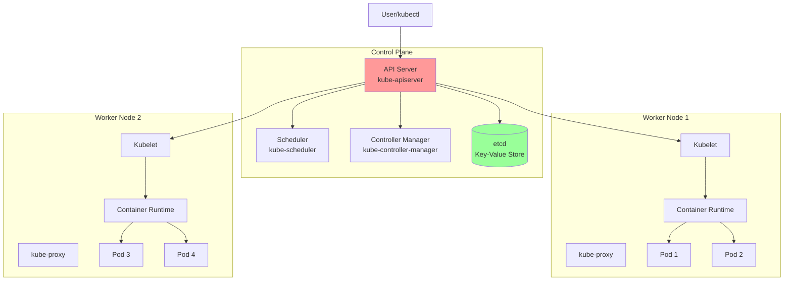

# Introduction to Kubernetes

Kubernetes (K8s) is an open-source container orchestration platform that automates deployment, scaling, and management of containerized applications. Originally developed by Google and now maintained by the Cloud Native Computing Foundation (CNCF), Kubernetes has become the de facto standard for container orchestration.

## What is Kubernetes?

Kubernetes provides a framework to run distributed systems resiliently, handling scaling, failover, deployment patterns, and more.

**Key Capabilities**:
- **Automated deployment and scaling**: Deploy and scale applications automatically
- **Self-healing**: Restart failed containers, replace and reschedule containers
- **Service discovery and load balancing**: Automatic DNS and load balancing
- **Storage orchestration**: Automatically mount storage systems
- **Secret and configuration management**: Deploy and update secrets and configs
- **Batch execution**: Manage batch and CI workloads
- **Horizontal scaling**: Scale applications up and down with commands or automatically

## Kubernetes Architecture



### Control Plane Components

**API Server (kube-apiserver)**:
- Front-end for Kubernetes control plane
- Exposes Kubernetes API
- Scales horizontally
- Handles all REST requests

**etcd**:
- Consistent and highly-available key-value store
- Stores all cluster data
- Backup target for cluster state

**Scheduler (kube-scheduler)**:
- Watches for newly created Pods
- Selects optimal node for Pod placement
- Considers resource requirements, constraints, affinity

**Controller Manager (kube-controller-manager)**:
- Runs controller processes
- Node controller: Monitors node health
- Replication controller: Maintains correct number of Pods
- Endpoints controller: Populates Endpoints objects
- Service Account & Token controllers: Create default accounts and tokens

**Cloud Controller Manager**:
- Runs cloud-specific controller logic
- Node controller: Check cloud provider for deleted nodes
- Route controller: Set up routes in cloud infrastructure
- Service controller: Create, update, delete cloud load balancers

### Node Components

**Kubelet**:
- Agent running on each node
- Ensures containers are running in Pods
- Takes PodSpecs and ensures described containers are running and healthy
- Doesn't manage containers not created by Kubernetes

**kube-proxy**:
- Network proxy on each node
- Maintains network rules
- Implements Service abstraction
- Can use iptables, IPVS, or userspace proxying

**Container Runtime**:
- Software responsible for running containers
- Supports containerd, CRI-O, Docker (via shim)
- Implements Kubernetes CRI (Container Runtime Interface)

## Core Concepts

### Pods

Smallest deployable unit in Kubernetes. A Pod encapsulates one or more containers.

```yaml
apiVersion: v1
kind: Pod
metadata:
  name: nginx-pod
  labels:
    app: nginx
spec:
  containers:
  - name: nginx
    image: nginx:1.21
    ports:
    - containerPort: 80
```

**Pod Characteristics**:
- Shared network namespace (IP address, ports)
- Shared storage volumes
- Lifecycle managed as single unit
- Ephemeral (no persistence guarantee)

### Namespaces

Virtual clusters for resource isolation.

```bash
# List namespaces
kubectl get namespaces

# Create namespace
kubectl create namespace development

# Use namespace
kubectl get pods -n development

# Set default namespace
kubectl config set-context --current --namespace=development
```

**Default Namespaces**:
- `default`: Default for objects with no namespace
- `kube-system`: For Kubernetes system components
- `kube-public`: Publicly readable (usually for cluster info)
- `kube-node-lease`: For node heartbeats

### Labels and Selectors

Key-value pairs attached to objects for organization and selection.

```yaml
metadata:
  labels:
    app: myapp
    tier: frontend
    environment: production
    version: v1.2.3
```

**Selectors**:
```bash
# Equality-based
kubectl get pods -l app=myapp
kubectl get pods -l environment=production,tier!=backend

# Set-based
kubectl get pods -l 'environment in (production, staging)'
kubectl get pods -l 'tier notin (frontend, backend)'
```

### Annotations

Non-identifying metadata for tools and libraries.

```yaml
metadata:
  annotations:
    description: "Production web server"
    build-date: "2024-01-15"
    managed-by: "terraform"
```

## Installing Kubernetes

### Local Development

**Minikube**:
```bash
# Install minikube
curl -LO https://storage.googleapis.com/minikube/releases/latest/minikube-linux-amd64
sudo install minikube-linux-amd64 /usr/local/bin/minikube

# Start cluster
minikube start

# Start with specific driver
minikube start --driver=docker
minikube start --driver=virtualbox

# Check status
minikube status

# Access dashboard
minikube dashboard
```

**kind (Kubernetes in Docker)**:
```bash
# Install kind
curl -Lo ./kind https://kind.sigs.k8s.io/dl/latest/kind-linux-amd64
chmod +x ./kind
sudo mv ./kind /usr/local/bin/kind

# Create cluster
kind create cluster

# Create multi-node cluster
kind create cluster --config=kind-config.yaml

# Delete cluster
kind delete cluster
```

**k3s (Lightweight Kubernetes)**:
```bash
# Install k3s
curl -sfL https://get.k3s.io | sh -

# Check status
sudo systemctl status k3s

# Use kubectl
sudo kubectl get nodes
```

### kubectl

Kubernetes command-line tool.

```bash
# Install kubectl
curl -LO "https://dl.k8s.io/release/$(curl -L -s https://dl.k8s.io/release/stable.txt)/bin/linux/amd64/kubectl"
sudo install -o root -g root -m 0755 kubectl /usr/local/bin/kubectl

# Verify installation
kubectl version --client

# Configure kubectl
kubectl config view
kubectl config use-context minikube

# Get cluster info
kubectl cluster-info
kubectl get nodes
```

## Basic kubectl Commands

```bash
# Get resources
kubectl get pods
kubectl get services
kubectl get deployments
kubectl get all

# Describe resources
kubectl describe pod nginx-pod
kubectl describe service nginx-service

# Create resources
kubectl create -f pod.yaml
kubectl apply -f deployment.yaml

# Delete resources
kubectl delete pod nginx-pod
kubectl delete -f deployment.yaml

# View logs
kubectl logs nginx-pod
kubectl logs -f nginx-pod  # Follow
kubectl logs nginx-pod -c container-name  # Specific container

# Execute commands
kubectl exec nginx-pod -- ls /
kubectl exec -it nginx-pod -- /bin/bash

# Port forwarding
kubectl port-forward pod/nginx-pod 8080:80

# Labels
kubectl label pods nginx-pod environment=production
kubectl get pods --show-labels

# Scaling
kubectl scale deployment nginx --replicas=5

# Editing
kubectl edit deployment nginx
```

## Kubernetes Objects

### Imperative vs Declarative

**Imperative** (commands):
```bash
kubectl create deployment nginx --image=nginx:1.21
kubectl expose deployment nginx --port=80 --type=LoadBalancer
kubectl scale deployment nginx --replicas=3
```

**Declarative** (YAML files):
```yaml
apiVersion: apps/v1
kind: Deployment
metadata:
  name: nginx
spec:
  replicas: 3
  selector:
    matchLabels:
      app: nginx
  template:
    metadata:
      labels:
        app: nginx
    spec:
      containers:
      - name: nginx
        image: nginx:1.21
        ports:
        - containerPort: 80
```

```bash
kubectl apply -f deployment.yaml
```

### YAML Structure

```yaml
apiVersion: v1  # API version
kind: Pod  # Resource type
metadata:  # Metadata about object
  name: my-pod
  labels:
    app: myapp
spec:  # Desired state
  containers:
  - name: nginx
    image: nginx:1.21
status:  # Current state (managed by Kubernetes)
```

## Common Workflows

### Deploy Application

```bash
# 1. Create deployment
kubectl create deployment nginx --image=nginx:1.21

# 2. Expose as service
kubectl expose deployment nginx --port=80 --type=LoadBalancer

# 3. Check status
kubectl get pods
kubectl get services

# 4. Scale
kubectl scale deployment nginx --replicas=3

# 5. Update image
kubectl set image deployment/nginx nginx=nginx:1.22

# 6. Check rollout
kubectl rollout status deployment/nginx

# 7. Rollback if needed
kubectl rollout undo deployment/nginx
```

### Debug Application

```bash
# View logs
kubectl logs -f pod-name

# Describe resources
kubectl describe pod pod-name

# Execute commands in container
kubectl exec -it pod-name -- /bin/bash

# Get events
kubectl get events --sort-by=.metadata.creationTimestamp

# Port forward for local access
kubectl port-forward pod/pod-name 8080:80
```

## Why Kubernetes?

### Benefits

**Portability**: Run anywhere (on-premises, public cloud, hybrid)

**Scalability**: Auto-scaling based on metrics

**High Availability**: Self-healing, replicas, rolling updates

**Resource Efficiency**: Optimal resource utilization

**Declarative Configuration**: Infrastructure as code

**Large Ecosystem**: Huge community, tools, integrations

### Use Cases

- **Microservices**: Ideal for containerized microservices
- **Batch Processing**: Run batch jobs and scheduled tasks
- **Machine Learning**: Train and deploy ML models
- **CI/CD**: Automated deployment pipelines
- **Hybrid Cloud**: Consistent platform across environments
- **Edge Computing**: Run workloads close to data sources

## Summary

Kubernetes is a powerful container orchestration platform that automates deployment, scaling, and management of containerized applications. Key takeaways:

- **Architecture** consists of control plane (API server, scheduler, controllers, etcd) and worker nodes (kubelet, kube-proxy, container runtime)
- **Pods** are the smallest deployable units, containing one or more containers
- **kubectl** is the command-line tool for interacting with clusters
- **Namespaces** provide virtual cluster isolation
- **Labels and selectors** enable flexible resource organization and selection
- **Declarative configuration** using YAML files is the preferred approach
- **Local development** tools include minikube, kind, and k3s

Understanding Kubernetes fundamentals prepares you for deploying and managing containerized applications at scale in production environments.
