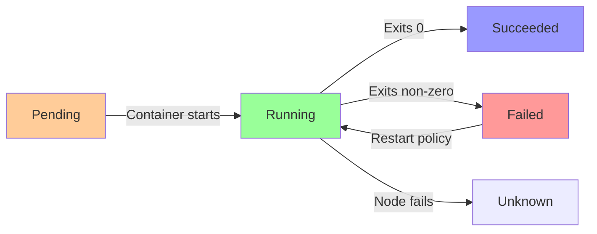

# Kubernetes Workloads

Workload resources manage sets of pods, providing replication, rolling updates, and lifecycle management. Understanding workload controllers is essential for running applications reliably in Kubernetes.

## Deployments

Deployments provide declarative updates for Pods and ReplicaSets, managing rolling updates and rollbacks.

```yaml
apiVersion: apps/v1
kind: Deployment
metadata:
  name: nginx-deployment
  labels:
    app: nginx
spec:
  replicas: 3
  selector:
    matchLabels:
      app: nginx
  template:
    metadata:
      labels:
        app: nginx
    spec:
      containers:
      - name: nginx
        image: nginx:1.21
        ports:
        - containerPort: 80
        resources:
          requests:
            memory: "64Mi"
            cpu: "250m"
          limits:
            memory: "128Mi"
            cpu: "500m"
```

**Key Features**:
- Rolling updates with zero downtime
- Rollback capability
- Scaling (manual and auto)
- Self-healing (recreates failed pods)

**Commands**:
```bash
# Create deployment
kubectl create deployment nginx --image=nginx:1.21 --replicas=3

# Apply from file
kubectl apply -f deployment.yaml

# Scale
kubectl scale deployment nginx --replicas=5

# Update image
kubectl set image deployment/nginx nginx=nginx:1.22

# Check rollout status
kubectl rollout status deployment/nginx

# View rollout history
kubectl rollout history deployment/nginx

# Rollback
kubectl rollout undo deployment/nginx
kubectl rollout undo deployment/nginx --to-revision=2

# Pause/Resume rollout
kubectl rollout pause deployment/nginx
kubectl rollout resume deployment/nginx
```

## ReplicaSets

ReplicaSets ensure a specified number of pod replicas are running. Deployments manage ReplicaSets automatically.

```yaml
apiVersion: apps/v1
kind: ReplicaSet
metadata:
  name: frontend
spec:
  replicas: 3
  selector:
    matchLabels:
      app: frontend
  template:
    metadata:
      labels:
        app: frontend
    spec:
      containers:
      - name: nginx
        image: nginx:1.21
```

**Note**: Prefer Deployments over direct ReplicaSets for better update management.

## StatefulSets

StatefulSets manage stateful applications requiring stable network identities and persistent storage.

```yaml
apiVersion: apps/v1
kind: StatefulSet
metadata:
  name: mysql
spec:
  serviceName: mysql
  replicas: 3
  selector:
    matchLabels:
      app: mysql
  template:
    metadata:
      labels:
        app: mysql
    spec:
      containers:
      - name: mysql
        image: mysql:8.0
        ports:
        - containerPort: 3306
        volumeMounts:
        - name: data
          mountPath: /var/lib/mysql
        env:
        - name: MYSQL_ROOT_PASSWORD
          valueFrom:
            secretKeyRef:
              name: mysql-secret
              key: password
  volumeClaimTemplates:
  - metadata:
      name: data
    spec:
      accessModes: ["ReadWriteOnce"]
      resources:
        requests:
          storage: 10Gi
```

**Characteristics**:
- Stable, unique network identifiers (pod-0, pod-1, pod-2)
- Stable, persistent storage
- Ordered, graceful deployment and scaling
- Ordered, automated rolling updates

**Use Cases**:
- Databases (MySQL, PostgreSQL, MongoDB)
- Distributed systems (ZooKeeper, etcd, Consul)
- Applications requiring stable network identity

## DaemonSets

DaemonSets ensure a copy of a Pod runs on all (or selected) nodes.

```yaml
apiVersion: apps/v1
kind: DaemonSet
metadata:
  name: fluentd
spec:
  selector:
    matchLabels:
      app: fluentd
  template:
    metadata:
      labels:
        app: fluentd
    spec:
      containers:
      - name: fluentd
        image: fluentd:v1.14
        volumeMounts:
        - name: varlog
          mountPath: /var/log
      volumes:
      - name: varlog
        hostPath:
          path: /var/log
```

**Use Cases**:
- Node monitoring (node-exporter, datadog-agent)
- Log collection (fluentd, filebeat)
- Storage daemons (ceph, glusterd)
- Network plugins (calico, flannel)

## Jobs

Jobs create one or more Pods and ensure a specified number complete successfully.

```yaml
apiVersion: batch/v1
kind: Job
metadata:
  name: pi-calculation
spec:
  template:
    spec:
      containers:
      - name: pi
        image: perl:5.34
        command: ["perl", "-Mbignum=bpi", "-wle", "print bpi(2000)"]
      restartPolicy: Never
  backoffLimit: 4
  completions: 1
  parallelism: 1
```

**Job Types**:

**Single Job**: Run once to completion
```yaml
spec:
  completions: 1
```

**Parallel Jobs**: Run multiple pods in parallel
```yaml
spec:
  completions: 10
  parallelism: 3  # Run 3 at a time
```

**Commands**:
```bash
# Create job
kubectl create job pi --image=perl:5.34 -- perl -Mbignum=bpi -wle 'print bpi(2000)'

# View jobs
kubectl get jobs

# View job pods
kubectl get pods --selector=job-name=pi

# View logs
kubectl logs job/pi

# Delete job
kubectl delete job pi
```

## CronJobs

CronJobs create Jobs on a repeating schedule.

```yaml
apiVersion: batch/v1
kind: CronJob
metadata:
  name: backup-job
spec:
  schedule: "0 2 * * *"  # Daily at 2 AM
  jobTemplate:
    spec:
      template:
        spec:
          containers:
          - name: backup
            image: backup-tool:latest
            command: ["/scripts/backup.sh"]
          restartPolicy: OnFailure
  successfulJobsHistoryLimit: 3
  failedJobsHistoryLimit: 1
```

**Cron Schedule Format**:
```
# ┌───────────── minute (0 - 59)
# │ ┌───────────── hour (0 - 23)
# │ │ ┌───────────── day of month (1 - 31)
# │ │ │ ┌───────────── month (1 - 12)
# │ │ │ │ ┌───────────── day of week (0 - 6) (Sunday to Saturday)
# │ │ │ │ │
# * * * * *
```

**Examples**:
- `*/5 * * * *` - Every 5 minutes
- `0 */2 * * *` - Every 2 hours
- `0 2 * * *` - Daily at 2 AM
- `0 0 * * 0` - Weekly on Sunday
- `0 0 1 * *` - Monthly on 1st

## Pod Lifecycle



**Pod Phases**:
- **Pending**: Accepted but not running (waiting for scheduling/image pull)
- **Running**: At least one container is running
- **Succeeded**: All containers exited with status 0
- **Failed**: At least one container exited with non-zero status
- **Unknown**: State cannot be determined

**Restart Policies**:
```yaml
spec:
  restartPolicy: Always  # Default for Deployments
  # restartPolicy: OnFailure  # Default for Jobs
  # restartPolicy: Never
```

## Init Containers

Containers that run before app containers start.

```yaml
apiVersion: v1
kind: Pod
metadata:
  name: myapp
spec:
  initContainers:
  - name: init-db
    image: busybox:1.35
    command: ['sh', '-c', 'until nslookup mydb; do echo waiting for mydb; sleep 2; done']
  - name: init-cache
    image: busybox:1.35
    command: ['sh', '-c', 'until nslookup cache; do echo waiting for cache; sleep 2; done']
  containers:
  - name: app
    image: myapp:latest
```

**Use Cases**:
- Wait for dependencies
- Populate data
- Clone git repository
- Configuration generation

## Resource Management

```yaml
apiVersion: v1
kind: Pod
metadata:
  name: resource-demo
spec:
  containers:
  - name: app
    image: nginx
    resources:
      requests:  # Minimum guaranteed
        memory: "64Mi"
        cpu: "250m"
      limits:  # Maximum allowed
        memory: "128Mi"
        cpu: "500m"
```

**CPU Units**:
- `1` = 1 CPU core
- `100m` = 0.1 CPU (100 millicores)
- `500m` = 0.5 CPU

**Memory Units**:
- `Mi` = Mebibytes (1024^2)
- `Gi` = Gibibytes (1024^3)
- `M` = Megabytes (1000^2)
- `G` = Gigabytes (1000^3)

## Quality of Service Classes

Based on resource requests and limits:

**Guaranteed**: Requests = Limits for all containers
```yaml
resources:
  requests:
    memory: "200Mi"
    cpu: "500m"
  limits:
    memory: "200Mi"
    cpu: "500m"
```

**Burstable**: Requests < Limits
```yaml
resources:
  requests:
    memory: "100Mi"
  limits:
    memory: "200Mi"
```

**BestEffort**: No requests or limits (lowest priority)

## Pod Disruption Budgets

Ensure minimum availability during voluntary disruptions.

```yaml
apiVersion: policy/v1
kind: PodDisruptionBudget
metadata:
  name: app-pdb
spec:
  minAvailable: 2
  selector:
    matchLabels:
      app: myapp
```

```yaml
# Alternative: maxUnavailable
spec:
  maxUnavailable: 1
  selector:
    matchLabels:
      app: myapp
```

## Complete Example

Full application deployment:

```yaml
apiVersion: apps/v1
kind: Deployment
metadata:
  name: webapp
  labels:
    app: webapp
spec:
  replicas: 3
  strategy:
    type: RollingUpdate
    rollingUpdate:
      maxSurge: 1
      maxUnavailable: 1
  selector:
    matchLabels:
      app: webapp
  template:
    metadata:
      labels:
        app: webapp
        version: v1.0
    spec:
      initContainers:
      - name: init-db
        image: busybox:1.35
        command: ['sh', '-c', 'until nslookup postgres; do sleep 2; done']
      containers:
      - name: webapp
        image: mywebapp:1.0
        ports:
        - containerPort: 8080
        env:
        - name: DB_HOST
          value: postgres
        - name: DB_PASSWORD
          valueFrom:
            secretKeyRef:
              name: db-secret
              key: password
        resources:
          requests:
            memory: "128Mi"
            cpu: "250m"
          limits:
            memory: "256Mi"
            cpu: "500m"
        livenessProbe:
          httpGet:
            path: /health
            port: 8080
          initialDelaySeconds: 30
          periodSeconds: 10
        readinessProbe:
          httpGet:
            path: /ready
            port: 8080
          initialDelaySeconds: 5
          periodSeconds: 5
        volumeMounts:
        - name: config
          mountPath: /etc/config
      volumes:
      - name: config
        configMap:
          name: app-config
```

## Summary

Kubernetes workload resources provide robust mechanisms for running applications reliably at scale. Key takeaways:

- **Deployments** manage stateless applications with rolling updates and rollbacks
- **StatefulSets** handle stateful applications requiring stable identity and persistent storage
- **DaemonSets** ensure pods run on all nodes (monitoring, logging, networking)
- **Jobs** run tasks to completion (batch processing, data migration)
- **CronJobs** schedule recurring tasks (backups, reports, cleanup)
- **Resource management** uses requests (guaranteed) and limits (maximum) for CPU and memory
- **Init containers** run setup tasks before main containers start
- **Pod Disruption Budgets** ensure availability during maintenance

Understanding workload controllers enables you to deploy and manage applications effectively in production Kubernetes clusters.
