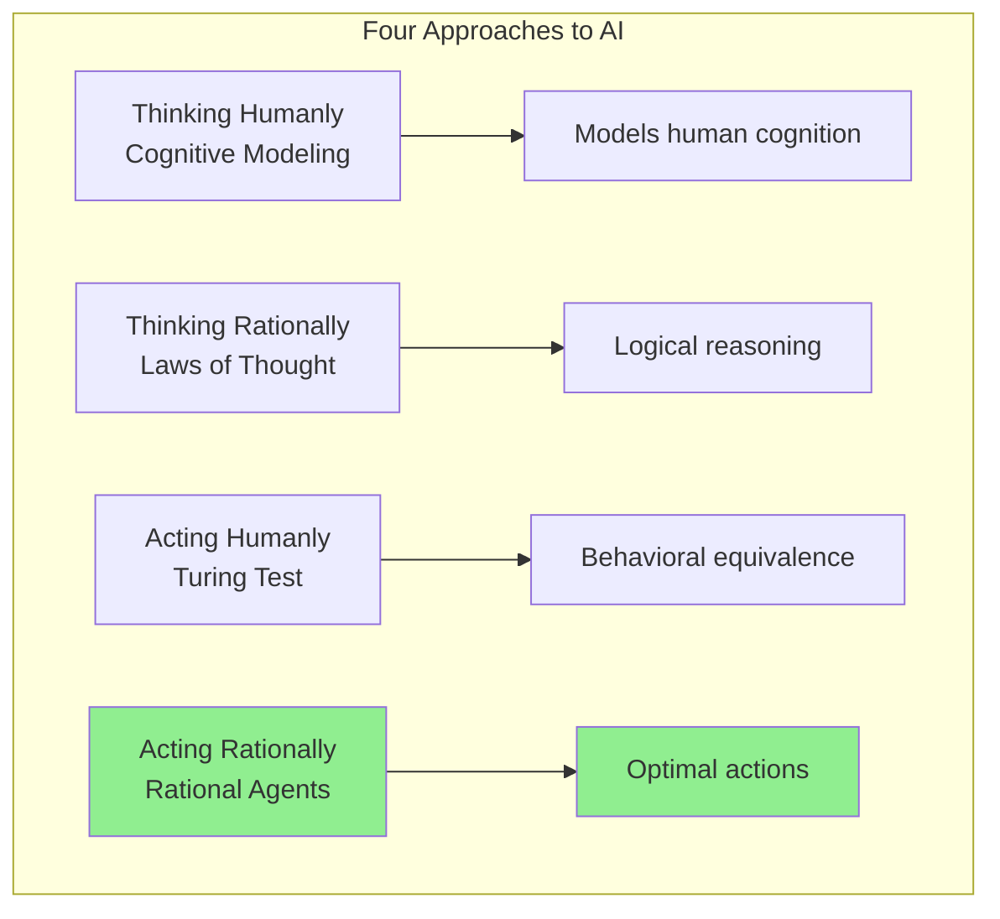
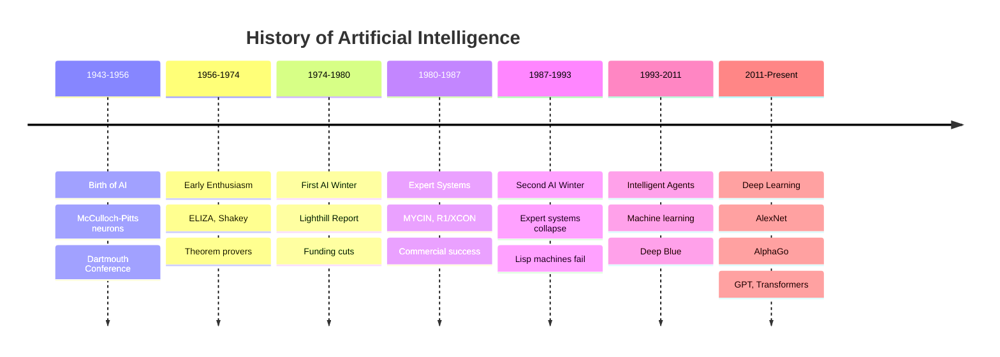
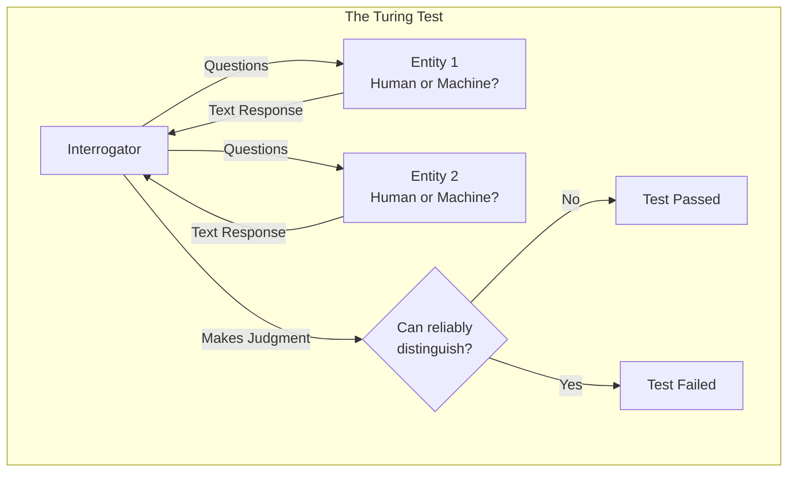

# Introduction to Artificial Intelligence

## Introduction

Artificial Intelligence (AI) stands as one of the most transformative and philosophically profound fields in computer science. At its core, AI is the science and engineering of making machines intelligent, where intelligence is defined as the ability to perceive the environment, reason about it, learn from experience, and take actions that maximize the chance of achieving goals. This deceptively simple definition masks immense complexity and raises fundamental questions about the nature of intelligence, consciousness, and what it means to think.

The field of AI has evolved from theoretical speculation to practical systems that pervade every aspect of modern life. AI powers the recommendations you see on Netflix, the voice assistant on your phone, the fraud detection systems protecting your bank account, the autonomous vehicles navigating city streets, and the language models capable of engaging in sophisticated conversations. The progress has been remarkable, yet we remain far from creating artificial general intelligence that matches human cognitive abilities across all domains.

What makes AI particularly fascinating is its interdisciplinary nature. AI draws from computer science, mathematics, statistics, neuroscience, psychology, linguistics, philosophy, and even economics. To build intelligent systems, we must understand not only algorithms and data structures but also how humans and animals learn, perceive, reason, and make decisions. We must grapple with questions that have puzzled philosophers for millennia: What is intelligence? Can machines think? Is consciousness computable?

The journey of AI has been characterized by cycles of excitement and disappointment, breakthroughs and limitations, bold predictions and humble reality checks. Understanding this history, the philosophical foundations, and the current state of the field is essential for anyone seeking to contribute to AI's future or deploy AI systems responsibly.

## What is Artificial Intelligence?

Defining artificial intelligence precisely is surprisingly challenging, as both "artificial" and "intelligence" are complex concepts. Various definitions emphasize different aspects of the field:

### Thinking Humanly: The Cognitive Modeling Approach

This perspective defines AI as systems that think like humans. To claim that a program thinks like a human, we must understand how humans think, which requires insights from cognitive science and psychology. This approach led to cognitive architectures like ACT-R and SOAR, which attempt to model human problem-solving processes.

The cognitive modeling approach is scientifically valuable for understanding human cognition but has limitations for practical AI. Human thinking is not always optimal—we have biases, make errors, and use heuristics that work in our evolutionary context but may not be ideal for all problems. Moreover, requiring AI to mimic human thought processes may be unnecessarily restrictive.

### Thinking Rationally: The Laws of Thought Approach

This view defines AI as systems that think rationally, based on logical reasoning. The tradition dates to Aristotle's syllogisms, which provided patterns for argument structures that always yield correct conclusions from correct premises. This led to the field of logic and, in the 20th century, to formal systems that could mechanize logical reasoning.

The logicist tradition in AI, exemplified by systems like Prolog and knowledge representation languages, seeks to build intelligent systems by encoding knowledge in formal logic and using logical inference to derive conclusions. While powerful for certain domains, this approach struggles with uncertainty, the computational complexity of logical inference, and the difficulty of encoding all relevant knowledge in formal logic.

### Acting Humanly: The Turing Test Approach

Alan Turing proposed an operational test for intelligence: if a machine can converse with a human interrogator in a way that's indistinguishable from another human, it should be considered intelligent. This approach sidesteps philosophical debates about the nature of thought and focuses on observable behavior.

The Turing test has been influential but also controversial. It emphasizes natural language processing, knowledge representation, reasoning, and learning—all crucial AI capabilities. However, critics argue that passing the Turing test doesn't necessarily require true intelligence; a system might use clever tricks to fool interrogators without genuine understanding.

### Acting Rationally: The Rational Agent Approach

Modern AI largely adopts the rational agent perspective: AI is about designing agents that act to achieve the best expected outcome, or the best outcome under uncertainty. An agent is anything that perceives its environment through sensors and acts upon it through actuators. A rational agent selects actions that maximize a performance measure, given the percept sequence and whatever built-in knowledge the agent has.

This approach is general, mathematically well-founded, and practically useful. It encompasses a wide range of AI problems from game playing to robotics to decision-making under uncertainty. However, perfect rationality is often computationally intractable, leading to the concept of bounded rationality—doing the best one can with limited computational resources.

## Historical Development of AI

The history of AI is marked by ambitious goals, impressive achievements, periods of disillusionment, and remarkable resilience. Understanding this history provides context for current challenges and opportunities.

### The Birth of AI (1943-1956)

The intellectual roots of AI trace to multiple disciplines. Warren McCulloch and Walter Pitts (1943) proposed a model of artificial neurons, showing that networks of simple components could compute any computable function. Donald Hebb (1949) proposed a learning rule for modifying connection strengths between neurons.

The field officially began at the Dartmouth Conference in 1956, organized by John McCarthy, Marvin Minsky, Claude Shannon, and Nathan Rochester. The proposal stated: "We propose that a 2-month, 10-man study of artificial intelligence be carried out... The study is to proceed on the basis of the conjecture that every aspect of learning or any other feature of intelligence can in principle be so precisely described that a machine can be made to simulate it."

This period saw early successes: Arthur Samuel wrote checkers programs that learned from experience, Allen Newell and Herbert Simon developed the Logic Theorist and General Problem Solver, and excitement was high about prospects for machine intelligence.

### Early Enthusiasm and Optimism (1956-1974)

The early years of AI were characterized by remarkable optimism. Researchers believed that human-level AI was just around the corner. Programs solved algebra word problems, proved theorems in geometry, and learned to play checkers competitively.

Notable achievements included:
- **ELIZA** (Joseph Weizenbaum, 1966): A program that simulated a Rogerian psychotherapist, using pattern matching and substitution to create the illusion of understanding
- **Shakey the Robot** (1966-1972): The first mobile robot to reason about its actions, combining computer vision, natural language processing, and automated planning
- **DENDRAL** (1965): An expert system that inferred molecular structure from mass spectrometry data, demonstrating AI's practical value

However, the limitations of these systems became apparent. They worked in "toy" domains but failed to scale to real-world complexity. Computers lacked sufficient memory and processing power. The combinatorial explosion of search spaces made many problems intractable.

### The First AI Winter (1974-1980)

Disillusionment set in as AI systems failed to live up to optimistic predictions. The 1973 Lighthill Report in the UK was particularly damaging, concluding that AI research had failed to achieve its goals and didn't justify continued funding.

Key challenges that emerged:
- **Computational Limitations**: The computational demands of AI algorithms far exceeded available computing power
- **Combinatorial Explosion**: Search spaces grew exponentially, making exhaustive search infeasible
- **Knowledge Representation**: Difficulty in encoding common sense knowledge
- **Perceptrons Limitations**: Marvin Minsky and Seymour Papert's book "Perceptrons" (1969) demonstrated mathematical limitations of simple neural networks, dampening enthusiasm for neural approaches

Funding dried up, and "AI" became almost taboo. Researchers shifted to more specific subfields like computer vision or natural language processing, avoiding the "AI" label.

### Expert Systems Boom (1980-1987)

AI experienced a resurgence with expert systems—programs that captured domain expert knowledge in rule-based systems. These systems achieved commercial success in specific domains:

- **R1/XCON** (Digital Equipment Corporation): Configured computer systems, saving millions annually
- **MYCIN**: Diagnosed blood infections and recommended antibiotics, performing at expert-level
- **PROSPECTOR**: Discovered a molybdenum deposit worth billions

The success led to significant investment. Companies created AI divisions, and Japan announced the Fifth Generation Computer Project, spurring Western governments to increase AI funding. By 1985, AI was a billion-dollar industry.

### The Second AI Winter (1987-1993)

The expert systems boom collapsed as dramatically as it began. Expert systems proved brittle, difficult to maintain, and didn't scale. The knowledge acquisition bottleneck—the difficulty of extracting and formalizing expert knowledge—proved insurmountable for many applications.

Hardware companies that had invested in specialized "Lisp machines" collapsed as general-purpose computers became more powerful and cost-effective. The "AI Winter" returned, with funding cuts and skepticism about AI's potential.

### The Rise of Intelligent Agents (1993-2011)

AI emerged from the winter with more modest goals and more rigorous methods. The focus shifted from general intelligence to building systems that perform well on specific tasks. Key developments:

- **Machine Learning Renaissance**: Advances in machine learning, particularly statistical learning theory, provided principled methods for learning from data
- **Probabilistic Reasoning**: Bayesian networks and other probabilistic approaches addressed uncertainty more effectively than logic
- **Data Availability**: The internet provided vast amounts of data for training systems
- **Computational Power**: Moore's Law provided exponentially increasing computational resources

Practical successes accumulated:
- **Deep Blue** (1997): IBM's chess program defeated world champion Garry Kasparov
- **Speech Recognition**: Hidden Markov Models enabled practical speech recognition
- **Robotics**: Probabilistic robotics enabled robots to navigate uncertain environments
- **Data Mining**: Large-scale data analysis became feasible

### Deep Learning Revolution (2011-Present)

The current era has been dominated by deep learning—neural networks with many layers trained on large datasets with powerful GPUs. Key milestones:

- **ImageNet** (2012): AlexNet achieved breakthrough performance in image classification, launching the deep learning era
- **AlphaGo** (2016): DeepMind's program defeated the world champion Go player, a feat thought to be decades away
- **Language Models**: Transformer-based models like GPT and BERT achieved remarkable natural language understanding
- **Reinforcement Learning**: Successes in game playing (Atari, StarCraft) and robotics
- **Generative Models**: GANs and diffusion models creating realistic images, audio, and video

The progress has been stunning, but challenges remain: deep learning models require enormous data and compute, lack transparency, are brittle to distribution shifts, and don't generalize like humans do.

## The Turing Test

Alan Turing's 1950 paper "Computing Machinery and Intelligence" opened with the question: "Can machines think?" Rather than attempt a philosophical answer, Turing proposed an operational test based on a party game called the "imitation game."

### The Test Design

In the original imitation game, an interrogator tries to determine which of two people (one male, one female) is which, based solely on written responses to questions. Turing proposed replacing one person with a machine:

1. The interrogator (a human) engages in natural language conversation with two entities: one human and one machine
2. The conversation occurs through text only (originally via teleprinter, now via computer terminals)
3. The interrogator's goal is to determine which entity is the machine
4. If the interrogator cannot reliably distinguish the machine from the human, the machine is said to have passed the test

Turing predicted that by the year 2000, machines with 10^9 bits of storage would fool interrogators 30% of the time after five minutes of questioning. While we have computers with far more storage, no AI system has convincingly passed a rigorous Turing test.

### What the Test Measures

To pass the Turing test, a machine would need several capabilities:

- **Natural Language Processing**: Understanding and generating human language with all its ambiguity, context-dependence, and nuance
- **Knowledge Representation**: Storing and organizing knowledge about the world
- **Automated Reasoning**: Drawing inferences, answering questions, and making deductions
- **Machine Learning**: Adapting to new circumstances and detecting patterns

Turing specifically excluded physical interaction, considering it irrelevant to intelligence. However, the "Total Turing Test" includes video signals (to test perceptual abilities) and manipulation of objects (to test motor capabilities), requiring computer vision and robotics.

### Criticisms and Limitations

The Turing test has been influential but faces several criticisms:

**1. Anthropocentric Bias**: The test assumes human-like behavior is the standard for intelligence. But intelligence might manifest differently in machines. An airplane doesn't fly by flapping wings, yet it flies. Why should machine intelligence imitate human intelligence?

**2. Deception vs. Intelligence**: The test rewards deception rather than understanding. A program might use clever tricks, pattern matching, and evasion without genuine comprehension. ELIZA created the illusion of understanding with simple pattern matching, showing that fooling humans doesn't require intelligence.

**3. Behavioral Focus**: The test focuses on behavior rather than cognitive processes. Two systems might exhibit identical behavior through entirely different mechanisms. A lookup table (with astronomical storage) could theoretically pass the test without any intelligence.

**4. Cultural and Linguistic Dependence**: Human conversation depends heavily on cultural knowledge and linguistic conventions. A system might fail not due to lack of intelligence but due to unfamiliarity with human culture.

**5. Short Interaction Time**: Turing's five-minute criterion might be too lenient. Longer interactions might reveal limitations in the system's understanding.

### Modern Competitions

Several competitions inspired by the Turing test have been organized:

**Loebner Prize**: An annual competition (1990-2020) where judges conversed with programs and humans. While some programs received awards, none achieved the grand prize for convincingly passing an unrestricted test.

**Eugene Goostman (2014)**: A chatbot claimed to have passed the Turing test by convincing 33% of judges it was a 13-year-old Ukrainian boy. Critics argued this involved lowering standards (limited English, young age) rather than achieving true intelligence.

**Modern Chatbots**: Large language models like GPT-4 can engage in remarkably human-like conversation but still fail on careful examination, showing inconsistencies, factual errors, and lack of genuine understanding.

## The Chinese Room Argument

John Searle's Chinese Room argument (1980) is the most influential philosophical critique of strong AI. It challenges the notion that executing a program can produce genuine understanding or consciousness.

### The Thought Experiment

Imagine a person who speaks only English locked in a room. The room contains:
- A large book of instructions in English
- Baskets full of Chinese symbols
- Slots for receiving and sending Chinese text

The person receives Chinese writing (questions) through one slot. Following the instruction book, they manipulate symbols, match patterns, and produce Chinese writing (answers) to send out through another slot. To observers outside, the room appears to understand Chinese—it provides correct, contextually appropriate responses to Chinese questions.

But the person inside doesn't understand Chinese at all. They're merely following syntactic rules for symbol manipulation without understanding the semantic content. Searle argues: If the person doesn't understand Chinese, then the whole system (person + book + symbols) doesn't understand Chinese either. It's just shuffling symbols according to rules.

### The Argument Against Strong AI

Searle uses this thought experiment to argue against "strong AI"—the claim that an appropriately programmed computer doesn't merely simulate understanding but actually understands, has genuine mental states, and possesses consciousness.

His argument proceeds:
1. Programs are purely syntactic (symbol manipulation)
2. Minds have semantic content (meaning, understanding, intentionality)
3. Syntax alone is neither sufficient for nor constitutive of semantics
4. Therefore, programs are neither sufficient for nor constitutive of minds

In other words, no matter how sophisticated a program's behavior, it's just manipulating symbols without genuine understanding. The program might pass the Turing test, but there's "no one home"—no genuine comprehension or consciousness.

### Responses and Counterarguments

The Chinese Room argument has generated extensive debate. Key responses include:

**The Systems Reply**: The person doesn't understand Chinese, but the entire system (person + book + symbols) does. Understanding emerges from the system as a whole, not any individual component. Similarly, individual neurons don't understand language, but the brain as a system does.

Searle's counter: Even if the person memorizes the book and internalizes the entire system, they still wouldn't understand Chinese, just manipulate symbols more efficiently.

**The Robot Reply**: A system embodied in a robot, perceiving and acting in the world, would develop genuine understanding through grounded interaction with the environment. The Chinese Room is disembodied and thus lacks crucial aspects of intelligence.

Searle's counter: Replace the Chinese symbols with robot control instructions. The person manipulates symbols to control the robot but still doesn't understand what the robot is doing.

**The Brain Simulator Reply**: If the program simulates the actual neural processes of a Chinese speaker's brain, it would have the same mental states. The Chinese Room doesn't do this—it uses different computational processes.

Searle's counter: Simulate the brain's neurons using water pipes and valves. The hydraulic system produces the same input-output behavior but clearly doesn't understand or have consciousness.

**The Other Minds Reply**: We only assume other humans understand based on their behavior. If we accept that criterion for humans, we should accept it for machines passing the same behavioral tests.

Searle's counter: There's a difference between not knowing whether something has mental states and knowing that it doesn't. We know the program is just manipulating symbols; we don't know what's happening in other humans' brains.

**The Connectionist Reply**: Symbolic AI (like the Chinese Room) is the wrong computational model. Neural networks process information fundamentally differently, more like brains, and might achieve genuine understanding.

Evaluation: This is an empirical question about whether the computational substrate matters. If understanding is substrate-independent, then any system implementing the right computations should understand, regardless of whether it's neurons, silicon, or symbol manipulation.

### Implications for AI

The Chinese Room argument raises profound questions:

- Is understanding substrate-dependent? Do the physical properties of neurons matter, or only the abstract computations they perform?
- Can there be "intelligence without understanding"? Can a system behave intelligently without genuine comprehension or consciousness?
- How do we know when a system truly understands vs. merely simulates understanding?

Most AI researchers take a functionalist view: if a system performs the right functions, it has the corresponding mental states. Whether it's "really" conscious or understanding is either a matter of definition or unknowable. The pragmatic question is: can we build systems that perform tasks requiring intelligence?

## Strong AI vs. Weak AI

The distinction between strong and weak AI represents fundamentally different goals and claims about artificial intelligence.

### Weak AI (Narrow AI)

Weak AI, also called narrow AI, refers to systems designed to perform specific tasks intelligently without claiming genuine understanding, consciousness, or general intelligence. Current AI systems are all weak AI.

**Characteristics**:
- Task-specific: Excels at particular tasks but cannot generalize beyond their training domain
- No genuine understanding: Processes information without consciousness or comprehension
- Human-designed objectives: Optimizes objectives defined by human designers
- Practical focus: Aims to solve specific problems, not replicate human cognition

**Examples**:
- Chess programs that play at superhuman levels but can't do anything else
- Image classifiers that recognize objects in photos but don't understand scenes
- Language models that generate fluent text but may lack deep comprehension
- Recommendation systems that predict preferences but don't understand taste
- Autonomous vehicles that navigate roads but don't understand driving in a human sense

**Philosophical Status**: Weak AI makes no claims about machine consciousness or genuine intelligence. It's a tool, like a calculator or a database, that performs useful computations. There's broad acceptance that weak AI is possible, useful, and already achieved.

### Strong AI (Artificial General Intelligence)

Strong AI, also called artificial general intelligence (AGI), refers to systems with genuine intelligence, understanding, and consciousness comparable to humans. Strong AI would have general-purpose intelligence, capable of learning and excelling at any intellectual task a human can perform.

**Characteristics**:
- General intelligence: Can learn and perform any cognitive task, not just specific ones
- Genuine understanding: Possesses consciousness, comprehension, and intentionality
- Autonomous learning: Learns new skills without human-designed task-specific algorithms
- Human-level or superhuman: Matches or exceeds human cognitive abilities across all domains

**Claims of Strong AI**:
1. Appropriately programmed computers don't just simulate intelligence; they actually are intelligent
2. These computers don't just behave as if they understand; they genuinely understand
3. Computational processes can produce consciousness and mental states
4. The right program run on any computational substrate (silicon, neurons, water pipes) would be conscious

**Current Status**: Strong AI does not exist. All current AI systems, despite impressive capabilities, are narrow. They lack the general intelligence, adaptability, and understanding characteristic of human cognition.

### The Philosophical Divide

The strong vs. weak AI distinction reflects deep philosophical disagreements:

**Computationalism**: Strong AI proponents often embrace computationalism—the view that mental states are computational states, and any system implementing the right computations would have corresponding mental states. This implies substrate independence: consciousness and understanding depend on abstract computational processes, not specific physical implementations.

**Biological Naturalism**: Strong AI skeptics like Searle argue that consciousness and understanding depend on specific biological properties of brains. You can't create consciousness simply by implementing algorithms; the biological substrate matters.

**Functionalism**: Many philosophers and AI researchers adopt functionalism—mental states are defined by their functional roles (what they do) rather than their physical implementation. If an AI system performs all the functions of understanding, it understands, regardless of how it's implemented.

**Emergentism**: Some argue consciousness and understanding emerge from sufficiently complex systems. A system might be "more than the sum of its parts," developing properties not present in individual components.

### Practical Implications

For AI research and development, the distinction has practical consequences:

**Research Focus**: Weak AI research focuses on specific capabilities—vision, language, reasoning, planning. Strong AI research would require understanding general intelligence and consciousness.

**Evaluation Criteria**: Weak AI is evaluated by performance on tasks. Strong AI would require demonstrating genuine understanding and consciousness, which is philosophically and practically challenging to test.

**Safety and Ethics**: Weak AI raises questions about bias, fairness, privacy, and deployment. Strong AI would raise additional questions about rights, moral status, and existential risks.

**Timeline**: Weak AI has already achieved remarkable success. Strong AI remains speculative, with estimates ranging from decades to never.

### Current Trends Toward AGI

Recent developments have rekindled interest in AGI:

**Large Language Models**: Models like GPT-4 demonstrate surprising generality, performing well on tasks they weren't explicitly trained for. However, they still fail at systematic reasoning, lack true understanding, and are far from general intelligence.

**Multimodal Models**: Systems that integrate vision, language, and other modalities move toward more general capabilities.

**Meta-Learning**: Learning to learn—developing algorithms that acquire new skills efficiently—is a step toward general intelligence.

**Neuroscience-Inspired Approaches**: Understanding how biological brains achieve general intelligence might inform AGI development.

Despite progress, fundamental challenges remain: current systems lack common sense reasoning, can't learn from few examples like humans, don't understand causation, and can't transfer knowledge flexibly across domains. Strong AI remains a distant goal, while weak AI continues to transform technology and society.

## Conclusion

Artificial Intelligence represents humanity's attempt to understand and create intelligence itself. From its inception at the Dartmouth Conference to today's deep learning revolution, AI has evolved from philosophical speculation to practical systems that impact billions of lives daily.

The field grapples with profound questions: Can machines think? What is intelligence? Is consciousness computable? The Turing test provided an operational approach to these questions, while Searle's Chinese Room argument challenged whether computational processes can produce genuine understanding. The distinction between strong and weak AI reflects fundamentally different ambitions—building useful tools versus creating conscious, generally intelligent machines.

Current AI systems, while remarkably capable at specific tasks, remain narrow. They lack the general intelligence, common sense reasoning, and flexible learning that characterize human cognition. Whether strong AI is possible remains an open question, touching on philosophy of mind, neuroscience, and the nature of computation itself.

As we develop increasingly powerful AI systems, understanding these foundational concepts becomes crucial. The philosophical questions aren't merely academic—they inform how we build, evaluate, and deploy AI systems. They shape our expectations, guide our research priorities, and frame ethical discussions about AI's role in society.

The journey of AI continues, driven by theoretical insights, algorithmic innovations, increasing computational power, and growing datasets. Whatever the future holds, the quest to understand and create intelligence will remain one of humanity's most fascinating and consequential endeavors.
