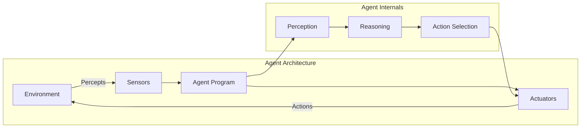
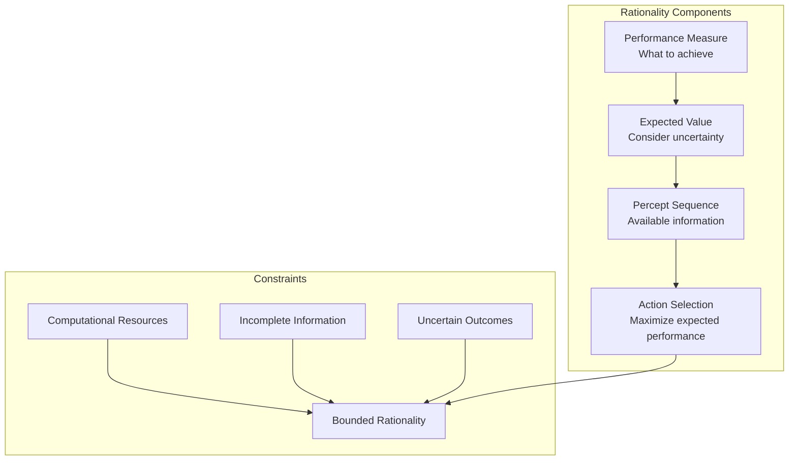
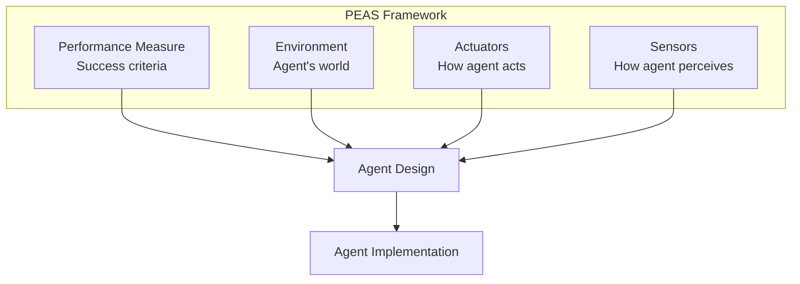
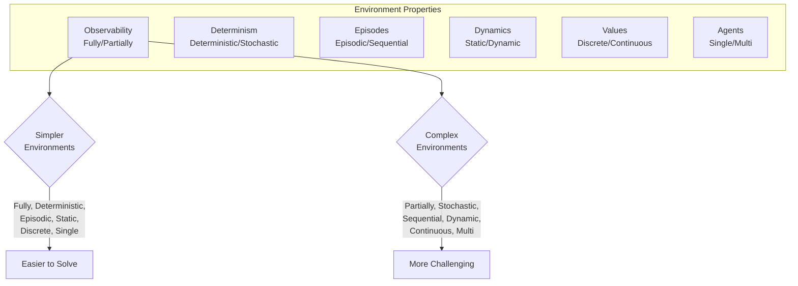
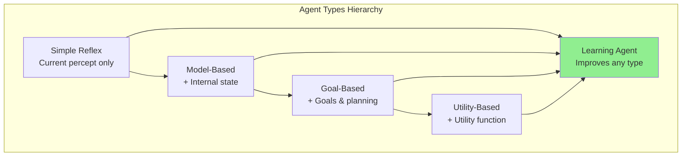

# Intelligent Agents

## Introduction

The concept of an intelligent agent provides the central organizing framework for modern artificial intelligence. Rather than asking abstract questions like "Can machines think?", the agent perspective focuses on designing systems that perceive their environment and take actions to achieve goals. This pragmatic approach has proven remarkably fruitful, encompassing everything from simple thermostats to sophisticated robots, from game-playing programs to autonomous vehicles.

An agent is anything that can perceive its environment through sensors and act upon that environment through actuators. This definition is deliberately broad—humans are agents (with eyes, ears as sensors and hands, vocal cords as actuators), as are robots, software programs, and even thermostats. What distinguishes intelligent agents is that they choose actions to maximize their performance on some measure of success, acting rationally given their perceptions and knowledge.

The agent perspective reshapes how we think about AI. Instead of building monolithic programs that solve problems, we design agents that exist in environments, pursue objectives, and adapt to circumstances. This framework naturally handles the key challenges of AI: perception (how do we extract information from raw sensor data?), reasoning (what actions will achieve our goals?), learning (how do we improve from experience?), and action (how do we affect the world?).

Understanding agents requires examining several interconnected concepts: What environments do agents operate in? What makes an agent rational? How do we specify what an agent should do? What internal architectures allow agents to select actions? These questions form the foundation for studying and building intelligent systems.

## Defining Agents

An agent is an entity that:
1. Perceives its environment through sensors
2. Acts upon the environment through actuators
3. Does so in pursuit of goals or objectives

Let's unpack this definition with concrete examples:

### Human Agents

- **Sensors**: Eyes (vision), ears (hearing), skin (touch), tongue (taste), nose (smell)
- **Actuators**: Hands, legs, mouth, vocal cords
- **Environment**: The physical world
- **Actions**: Walk, grasp objects, speak, write

Humans are sophisticated agents with rich sensory capabilities, versatile actuators, complex internal processing (cognition), and the ability to pursue abstract goals while adapting to diverse environments.

### Robotic Agents

- **Sensors**: Cameras (vision), microphones (hearing), range finders, touch sensors, IMUs (inertial measurement units)
- **Actuators**: Motors (wheels, joints), grippers, speakers
- **Environment**: Physical spaces (factories, homes, roads, etc.)
- **Actions**: Navigate, manipulate objects, communicate

Robots bridge the digital and physical worlds. A warehouse robot perceives its surroundings with cameras and laser scanners, navigates using wheel motors, and manipulates packages with robotic arms.

### Software Agents

- **Sensors**: Keyboard input, file contents, network packets, database queries, API responses
- **Actuators**: Display output, file modifications, network messages, database updates, API calls
- **Environment**: Operating systems, networks, databases, websites, other software
- **Actions**: Read/write files, send messages, query databases, display information

Software agents exist in digital environments. A spam filter perceives incoming emails, classifies them using learned patterns, and acts by moving spam to a separate folder. A trading algorithm perceives market data and acts by placing buy/sell orders.

### The Percept Sequence

An agent's behavior depends on its entire percept sequence—the complete history of everything it has perceived. The agent function maps any percept sequence to an action:

$$f: P^* \to A$$

where $P^*$ is the set of all possible percept sequences and $A$ is the set of possible actions.

For example, a vacuum cleaning robot's percept might be `[location, status]` where location is A or B, and status is Clean or Dirty. Its percept sequence over time might be:
- $t_1$: [A, Dirty]
- $t_2$: [A, Clean]
- $t_3$: [B, Dirty]

The agent function determines what action to take based on this sequence. A simple agent might use just the current percept, while a more sophisticated agent considers the full history to build an internal state.

### Agent Program vs. Agent Function

It's crucial to distinguish:

**Agent Function**: The abstract mathematical description of the agent's behavior—the mapping from percept sequences to actions. This is the idealized description of what the agent does.

**Agent Program**: The concrete implementation that runs on a physical computing device. This is the actual code executed by the agent architecture.

For any environment, there exists an ideal agent function that specifies the optimal action for every possible percept sequence. The agent program is our attempt to implement (an approximation of) this function. The gap between the ideal agent function and our implementation represents the challenge of building intelligent systems.



## Rationality

Rationality is the central concept in the agent framework. A rational agent selects actions that maximize its performance measure, given the percept sequence and whatever built-in knowledge it has. But what does this mean precisely?

### Performance Measures

A performance measure defines what constitutes success in the agent's environment. It's a function that assigns a score to any given sequence of environment states. The agent's goal is to maximize the expected value of this measure.

**Key Principle**: Performance measures should be designed based on what we want the environment to be like, not on how we think the agent should behave. This is the difference between specifying objectives (what to achieve) and specifying behavior (how to achieve it).

Examples:

**Vacuum Cleaning Robot**:
- Simple measure: Amount of dirt cleaned up
- Better measure: Average dirt level over time (encourages continuous cleaning)
- Sophisticated measure: Clean floors while minimizing power consumption and robot wear

**Chess Program**:
- Ultimate measure: Win (1 point), Draw (0.5), Loss (0)
- Training measure: Might include intermediate rewards for capturing pieces, controlling the center, etc.

**Autonomous Vehicle**:
- Safety: No accidents (highest priority)
- Efficiency: Reach destination quickly
- Comfort: Smooth acceleration, braking
- Legal compliance: Follow traffic laws
- Fuel efficiency: Minimize energy consumption

Specifying the performance measure is often the hardest part of designing an AI system. The measure must capture everything we care about; otherwise, the agent might optimize the measure in ways we don't want.

### Definition of Rationality

An agent is rational if, for each possible percept sequence, it selects an action that maximizes the expected value of its performance measure, given:
1. The percept sequence to date
2. Built-in knowledge about the environment

This definition has several important implications:

**1. Rationality maximizes expected performance**: The agent should choose actions that are expected to perform well on average, considering uncertainty about outcomes. If an action might lead to great success or total failure, the agent weighs these outcomes by their probabilities.

**2. Rationality depends on the performance measure**: There's no universal notion of rationality; it's always relative to a particular performance measure. An agent might act rationally with respect to one measure while behaving poorly with respect to another.

**3. Rationality depends on prior knowledge**: The agent can only act based on what it knows. If crucial information is unavailable, the agent does the best it can with what it has. We don't blame an agent for failing to predict the future or know hidden information.

**4. Rationality requires perception**: The agent's percept sequence provides information about the environment. A rational agent must perceive effectively to act intelligently.

**5. Rationality requires action**: The agent must actually take actions. A program that reasons perfectly but never acts accomplishes nothing.

### Rationality vs. Omniscience

It's crucial to distinguish rationality from omniscience. An omniscient agent knows the actual outcome of its actions. A rational agent maximizes expected performance based on what it knows.

Example: You're at a crosswalk. The light turns green for pedestrians. Rationally, you start to cross. But a speeding car runs the red light and nearly hits you. You jump back just in time.

- Was your decision to cross rational? **Yes** - given your percepts (green light) and knowledge (cars typically stop at red lights), crossing was the action that maximized expected performance.
- Could you have been omniscient and predicted the car? **No** - you couldn't see or predict this particular car would run the light.

Rationality is not about achieving perfect outcomes, but about making the best decisions given available information. This is especially important when outcomes are uncertain or information is incomplete.

### Information Gathering

Rational agents should gather information when it's likely to improve decision-making. This means perception is not passive—agents should actively seek information.

A rational agent might:
- Look both ways before crossing the street
- Query a database before making a decision
- Explore unknown areas to build a map
- Conduct experiments to test hypotheses

The trade-off is between the cost of information gathering (time, resources, risk) and the value of better-informed decisions. A self-driving car continuously scans its surroundings because safety requires up-to-date information. A chess program might limit its search depth because deeper search has diminishing returns.

### Learning and Adaptation

Rational agents should learn from experience to improve future performance. An agent that operates in the same environment for an extended period should adapt its behavior based on what it learns.

Learning allows agents to:
- Operate successfully in initially unknown environments
- Adapt to changes in the environment
- Improve performance over time
- Compensate for incomplete or incorrect initial knowledge

A rational agent might start with limited knowledge and poor performance, but as it learns from experience, its performance improves. This is preferable to an agent with hand-coded behavior that never improves.

### Bounded Rationality

Perfect rationality is often computationally intractable. Computing the optimal action might require more time or memory than available. This leads to bounded rationality—doing the best you can with limited computational resources.

Bounded rational agents:
- Use approximations and heuristics
- Limit search depth or breadth
- Satisfy (find good-enough solutions) rather than optimize
- Balance deliberation time against action quality

For example, a chess program can't examine all possible move sequences to the game's end (there are more positions than atoms in the universe). Instead, it searches to a limited depth, evaluates positions with a heuristic function, and selects the best move found within its time budget.

Herbert Simon won a Nobel Prize in Economics partly for recognizing that real decision-makers exhibit bounded rationality, using simple heuristics rather than optimal computation.



## PEAS Description

To design a rational agent, we must specify the task environment. The PEAS description provides a framework for analyzing agent design:

- **P**erformance measure: How is success evaluated?
- **E**nvironment: What is the world in which the agent operates?
- **A**ctuators: How does the agent act on the environment?
- **S**ensors: How does the agent perceive the environment?

Specifying these four components precisely is essential for agent design. Let's examine several examples:

### Example 1: Automated Taxi

**Performance Measure**:
- Safety: No accidents (highest priority)
- Destination: Reach correct location
- Time: Minimize trip duration
- Legality: Follow traffic laws
- Comfort: Smooth ride for passengers
- Efficiency: Minimize fuel consumption
- Profits: Maximize revenue minus costs

**Environment**:
- Roads, highways, parking lots
- Other vehicles (cars, trucks, bicycles, motorcycles)
- Pedestrians, animals
- Traffic signals, signs, road markings
- Weather conditions (rain, fog, snow)
- Time of day (day/night, rush hour)

**Actuators**:
- Steering wheel (direction)
- Accelerator (speed increase)
- Brake (speed decrease)
- Gear shifter
- Turn signals, lights, horn
- Display/audio for passenger communication

**Sensors**:
- Cameras (multiple angles for 360° vision)
- Lidar (laser ranging for 3D environment mapping)
- Radar (detecting distant or fast-moving objects)
- GPS (location)
- Speedometer, accelerometer
- Microphones (for passenger input)
- Ultrasonic sensors (close-range obstacle detection)

### Example 2: Internet Shopping Agent

**Performance Measure**:
- Price: Minimize cost
- Quality: Maximize product quality
- Speed: Fast delivery
- Reliability: Trusted sellers
- Privacy: Protect user data
- Comprehensiveness: Find all relevant options

**Environment**:
- E-commerce websites
- Product databases
- Price comparison sites
- Seller reputation systems
- Inventory systems
- Shipping/logistics networks

**Actuators**:
- HTTP requests (navigate websites)
- Form submissions (search queries, filters)
- Click actions (select products, add to cart)
- Purchase transactions
- Database writes (save preferences, history)
- Email/notifications

**Sensors**:
- HTML parsers (read website content)
- API responses (structured data)
- Database queries (retrieve information)
- User input (preferences, queries)
- Price feeds, product catalogs
- Review and rating aggregators

### Example 3: Robotic Soccer Player

**Performance Measure**:
- Score goals (increase team score)
- Prevent opponent goals
- Maintain ball possession
- Team coordination
- Energy efficiency (battery life)
- Avoid damage (to self and others)

**Environment**:
- Soccer field (boundaries, goals)
- Ball
- Teammate robots
- Opponent robots
- Referee signals
- Field conditions

**Actuators**:
- Wheel motors (locomotion)
- Kicking mechanism
- Grippers (ball control)
- Pan-tilt head (sensor orientation)
- Communication transmitter (team coordination)
- Display lights (status indication)

**Sensors**:
- Camera (ball, robot, goal detection)
- Compass (orientation)
- Accelerometer (motion, balance)
- Infrared sensors (proximity detection)
- Ball sensor (detect ball contact)
- Communication receiver (teammate messages)
- Battery sensor (power level)

### Example 4: Medical Diagnosis System

**Performance Measure**:
- Diagnostic accuracy (correct disease identification)
- Treatment effectiveness (recommending appropriate treatments)
- Patient outcomes (recovery, quality of life)
- Speed (timely diagnosis)
- Cost-effectiveness (minimize unnecessary tests)
- Sensitivity (detecting diseases that are present)
- Specificity (avoiding false positives)

**Environment**:
- Patient symptoms and medical history
- Medical knowledge bases
- Clinical practice guidelines
- Diagnostic test results
- Medical literature
- Electronic health records
- Epidemiological data

**Actuators**:
- Display recommendations (diagnosis, tests, treatments)
- Generate reports
- Query databases
- Request additional tests
- Alert human doctors (for critical cases)
- Update patient records

**Sensors**:
- Patient input (symptoms, history)
- Lab test results
- Medical imaging (X-rays, MRI, CT scans)
- Vital signs (heart rate, blood pressure, temperature)
- Medical knowledge bases
- Electronic health record queries
- Medical literature searches



## Properties of Task Environments

Different task environments place different demands on agent design. Understanding environment properties helps us select appropriate agent architectures and algorithms. We can classify environments along several dimensions:

### Fully Observable vs. Partially Observable

**Fully Observable**: The agent's sensors provide access to the complete state of the environment at each point in time. The agent knows everything relevant to action selection.

Examples:
- Chess: The complete board position is visible
- Perfect information card games (like open-hand poker)
- Some puzzle games

**Partially Observable**: The agent has incomplete or noisy sensor information about the environment state.

Examples:
- Poker (hidden opponent cards)
- Autonomous vehicles (can't see around corners, inside other vehicles)
- Robot navigation (limited sensor range, sensor noise)
- Medical diagnosis (many internal factors not directly observable)

Partial observability arises from:
- Noisy sensors (measurements with errors)
- Limited sensor range (can't perceive distant objects)
- Occluded information (objects block sensors)
- Incomplete sensor coverage (sensors don't cover all relevant aspects)

Partially observable environments are far more challenging because the agent must reason about hidden state, maintain beliefs about what might be true, and actively gather information.

### Deterministic vs. Stochastic

**Deterministic**: The next state is completely determined by the current state and the agent's action. The same action in the same state always produces the same outcome.

Examples:
- Puzzle solving (sliding tile puzzle)
- Chess (deterministic rules, though complex)
- Mathematical theorem proving

**Stochastic**: The next state is uncertain—the same action in the same state might lead to different outcomes. Randomness affects environment transitions.

Examples:
- Dice games (explicit randomness)
- Robotics (unpredictable object grasping, motor noise)
- Driving (other drivers' unpredictable behavior)
- Most real-world environments (countless factors introduce randomness)

Technically, deterministic is a special case of stochastic where outcome probabilities are 0 or 1. Strategic environments (like adversarial games with rational opponents) are sometimes called strategic rather than stochastic, but from the agent's perspective, they involve uncertainty about outcomes.

### Episodic vs. Sequential

**Episodic**: The agent's experience divides into atomic episodes. Each episode consists of the agent perceiving and then performing a single action. Episodes are independent—the agent's action in one episode doesn't affect others.

Examples:
- Image classification (each image is independent)
- Spam filtering (each email is independent)
- Defect detection in manufacturing (each item is independent)

**Sequential**: Current decisions affect future situations. The agent must plan ahead, considering how actions now impact what happens later.

Examples:
- Chess (moves early in the game affect late-game positions)
- Robot navigation (position after one move affects future options)
- Investment decisions (current investments affect future wealth)
- Medical treatment (current treatments affect future health)

Sequential environments are more complex because the agent must consider long-term consequences of actions, not just immediate effects. This requires planning, lookahead, and understanding temporal dependencies.

### Static vs. Dynamic

**Static**: The environment doesn't change while the agent is deliberating. The agent can take time to decide what to do without worrying about the world changing.

Examples:
- Crossword puzzles
- Chess (with unlimited thinking time)
- Planning problems (fixed initial state)

**Dynamic**: The environment changes while the agent is deliberating. Time matters—the agent must make decisions under time pressure.

Examples:
- Autonomous vehicles (traffic changes constantly)
- Real-time strategy games
- Stock trading (prices fluctuate continuously)
- Robotic soccer (ball and players always moving)

**Semidynamic**: The environment doesn't change, but the agent's performance score does. For example, chess with a clock—the board doesn't change while you think, but your time runs out.

Dynamic environments require the agent to monitor the environment continuously and respond quickly. They may need to interrupt deliberation to act in time.

### Discrete vs. Continuous

**Discrete**: A finite number of distinct states, percepts, and actions.

Examples:
- Chess (finite positions, moves)
- Turn-based games
- Many puzzles
- Discrete state navigation (grid world)

**Continuous**: States, percepts, or actions are continuous values.

Examples:
- Taxi driving (continuous position, velocity, steering angle)
- Industrial process control (continuous temperatures, pressures, flow rates)
- Robot arm manipulation (continuous joint angles)

Time can also be discrete (turns) or continuous (real-time). Continuous environments often require discretization for practical computation, but this introduces approximation errors.

### Single-Agent vs. Multi-Agent

**Single-Agent**: The environment contains only one agent making decisions.

Examples:
- Puzzle solving
- Optimization problems
- Single-player games

**Multi-Agent**: Multiple agents operate in the environment, potentially interacting with each other.

Examples:
- Autonomous vehicles (other drivers are agents)
- Auctions (multiple bidders)
- Team robotics (collaborating robots)
- Adversarial games (opponent is an agent)

Multi-agent environments require reasoning about other agents' goals, beliefs, and likely actions. In cooperative settings, agents must coordinate. In competitive settings, agents must anticipate and counter opponents' strategies. In mixed settings, agents face complex strategic interactions.

Multi-agent environments can be:
- **Competitive**: Agents have conflicting goals (chess, poker)
- **Cooperative**: Agents share goals (team robotics, multi-agent planning)
- **Mixed**: Combination of competition and cooperation (partial information games, economics)

Communication can dramatically change multi-agent environments. Agents that can communicate can coordinate more effectively but must also reason about what to communicate and when.



## Types of Agents

Different task environments call for different agent architectures. We can classify agents by the mechanisms they use to select actions:

### Simple Reflex Agents

Simple reflex agents select actions based solely on the current percept, ignoring percept history. They implement condition-action rules: "if condition then action."

**Structure**:
```
function SIMPLE-REFLEX-AGENT(percept) returns action
    state ← INTERPRET-INPUT(percept)
    rule ← RULE-MATCH(state, rules)
    action ← rule.ACTION
    return action
```

**Example**: A vacuum cleaning robot
- If location is dirty then suck
- If location is clean and location is A then move right
- If location is clean and location is B then move left

**Advantages**:
- Simple to implement
- Fast execution
- Minimal memory requirements
- Works well for simple, fully observable environments

**Limitations**:
- Only works in fully observable environments (must perceive everything needed for decisions)
- No memory of past percepts
- Can get stuck in infinite loops without randomization
- Cannot handle partial observability
- Cannot adapt or learn

**When to use**: Simple, fully observable, episodic environments where the right action depends only on current percept.

### Model-Based Reflex Agents

Model-based agents maintain internal state to track aspects of the environment that aren't currently observable. They use a model of how the world works to infer unobserved aspects.

**Structure**:
```
function MODEL-BASED-REFLEX-AGENT(percept) returns action
    persistent: state, model, rules, action

    state ← UPDATE-STATE(state, action, percept, model)
    rule ← RULE-MATCH(state, rules)
    action ← rule.ACTION
    return action
```

**Components**:
- **State**: Internal representation of the current world state
- **Model**: Knowledge of how the world evolves (transition model) and how actions affect the world
- **Percept model**: Knowledge of how world states are reflected in percepts

**Example**: A vacuum robot that remembers which locations it has cleaned
- Maintain state: "Location A is clean, Location B is dirty"
- Update state based on actions: After "suck" in A, A becomes clean
- Update state based on percepts: If perceive "dirty" in B, B is dirty
- Select action based on complete state, not just current percept

**Advantages**:
- Handles partially observable environments
- Can maintain memory of past percepts
- More robust than simple reflex agents
- Can make better decisions by considering unobserved state

**Limitations**:
- Still uses condition-action rules (doesn't plan ahead)
- Requires accurate model of the world
- State estimation can be computationally expensive
- Doesn't consider future consequences of actions

**When to use**: Partially observable environments where the agent needs to track hidden state but can use reflex rules for action selection.

### Goal-Based Agents

Goal-based agents use information about goal states to select actions. They search or plan to find action sequences that achieve goals, rather than using reflex rules.

**Structure**:
```
function GOAL-BASED-AGENT(percept) returns action
    persistent: state, model, goal, action

    state ← UPDATE-STATE(state, action, percept, model)
    if goal is not achieved then
        plan ← FORMULATE-PLAN(state, model, goal)
        action ← FIRST(plan)
    else
        action ← NO-OP
    return action
```

**Components**:
- **Goal**: Description of desired states
- **Search/Planning**: Algorithms to find action sequences achieving goals
- **Model**: Transition model for predicting action consequences

**Example**: A robot tasked with "go to location B"
- Goal: "at location B"
- Search: Find action sequence from current location to B
- Consider obstacles, shortest path, etc.
- Execute plan: First action of the plan

**Advantages**:
- Flexible (change goal without reprogramming rules)
- Can handle novel situations by planning
- Considers future consequences
- Can achieve complex objectives

**Limitations**:
- Computationally more expensive than reflex agents
- Requires explicit goal representation
- Planning can be slow for complex environments
- May not handle multiple competing goals well

**When to use**: Environments where the agent must achieve specific goals and flexibility in behavior is important.

### Utility-Based Agents

Utility-based agents use a utility function to evaluate how desirable states are. Rather than binary goal achievement, they consider degrees of desirability, allowing trade-offs and optimization.

**Structure**:
```
function UTILITY-BASED-AGENT(percept) returns action
    persistent: state, model, utility, action

    state ← UPDATE-STATE(state, action, percept, model)
    actions ← GENERATE-ACTIONS(state, model)
    best_action ← argmax_{a ∈ actions} EXPECTED-UTILITY(a, state, model, utility)
    return best_action
```

**Components**:
- **Utility Function**: Maps states (or state sequences) to real numbers indicating desirability
- **Expected Utility**: Considers probabilities of different outcomes
- **Decision Theory**: Framework for selecting actions that maximize expected utility

**Example**: An automated taxi
- Utility factors: Safety (+), speed (+), fuel cost (-), passenger comfort (+), revenue (+)
- Utility function: Weighted combination of factors
- Select action maximizing expected utility (considering uncertainties)

**Advantages**:
- Handles conflicting objectives (trade-offs)
- Natural handling of uncertainty (via expected utility)
- Mathematically principled decision-making
- Can express preferences over outcomes

**Limitations**:
- Requires specifying utility function (often difficult)
- Computationally expensive (evaluate utilities for many actions/outcomes)
- May be difficult to elicit true utility from users
- Optimization can be complex in large state spaces

**When to use**: Environments with multiple objectives, trade-offs, uncertainty, or when optimality matters more than satisficing.

### Learning Agents

Learning agents improve their performance over time through experience. They adapt to initially unknown environments and compensate for incomplete knowledge.

**Structure**:
```
function LEARNING-AGENT(percept) returns action
    persistent: performance_element, learning_element, critic, problem_generator

    state ← UPDATE-STATE(percept)
    action ← PERFORMANCE-ELEMENT(state)
    feedback ← CRITIC(percept, performance_standard)
    LEARNING-ELEMENT(feedback)
    exploratory_action ← PROBLEM-GENERATOR()

    return action or exploratory_action
```

**Components**:
- **Performance Element**: Selects actions (could be any of the above agent types)
- **Learning Element**: Makes improvements based on feedback, modifies performance element
- **Critic**: Provides feedback on how well the agent is doing
- **Problem Generator**: Suggests exploratory actions to learn new things

**Example**: A spam filter
- Performance element: Classifier that determines spam vs. not spam
- Critic: User feedback (marking emails as spam/not spam)
- Learning element: Updates classifier based on feedback
- Problem generator: Occasionally classifies borderline emails to get feedback

**Advantages**:
- Adapts to unknown environments
- Improves performance over time
- Handles changing environments
- Requires less initial knowledge

**Limitations**:
- May perform poorly initially (before learning)
- Requires appropriate feedback signal
- Learning can be slow
- May learn incorrect behavior from poor feedback
- Exploration vs. exploitation trade-off

**When to use**: Initially unknown or changing environments, when hand-coding behavior is difficult, or when adaptive behavior is beneficial.



## Autonomy

Autonomy is a crucial property of intelligent agents. An agent is autonomous to the extent that its behavior is determined by its own experience, rather than solely by built-in knowledge provided by the designer.

### Degrees of Autonomy

**Complete Dependence**: The agent's behavior is entirely specified by the designer. It has no ability to adapt or learn. Examples: Simple reflex agents with hard-coded rules.

**Partial Autonomy**: The agent starts with initial knowledge but can learn and adapt. Its behavior evolves based on experience, but initial programming influences early behavior. Examples: Most learning agents.

**High Autonomy**: The agent has minimal initial knowledge (perhaps only learning mechanisms and sensory/motor capabilities) and develops behavior almost entirely through experience. Examples: Some reinforcement learning agents, developmental robotics.

### The Autonomy Spectrum

Consider different systems:

**Thermostat**: No autonomy. Behavior entirely specified by designer (temperature threshold, heating/cooling actions).

**Spam Filter (Initially)**: Low autonomy. Designer provides initial rules or examples, but the filter doesn't adapt.

**Spam Filter (Learning)**: Moderate autonomy. The filter adapts to user's specific spam patterns, learning from feedback.

**AlphaGo**: High autonomy. While the game rules are built-in, playing strategy is learned from scratch through self-play, not hand-coded by designers.

**Human Children**: Very high autonomy. Born with innate capabilities (vision, motor reflexes, learning mechanisms) but develop knowledge and skills through experience.

### Benefits of Autonomy

**Adaptation**: Autonomous agents can adapt to environments the designer didn't anticipate or that change over time.

**Robustness**: Autonomous agents can compensate for incomplete or incorrect initial knowledge by learning from experience.

**Reduced Design Effort**: Designers don't need to anticipate every scenario; the agent learns appropriate behavior.

**Personalization**: Autonomous agents can tailor behavior to individual users or contexts.

### Challenges of Autonomy

**Initial Performance**: Highly autonomous agents may perform poorly initially, before learning.

**Unintended Behavior**: Autonomous agents might learn behaviors the designer didn't intend or want.

**Safety**: In critical applications, autonomous learning can be dangerous if the agent explores unsafe actions.

**Interpretability**: Behavior learned by the agent may be difficult for humans to understand or predict.

### Balancing Built-in Knowledge and Learning

Good agent design often balances built-in knowledge with learning:

**Safety-Critical Constraints**: Hard-coded (e.g., an autonomous vehicle should never intentionally hit a pedestrian)

**Basic Capabilities**: Built-in (e.g., sensory processing, basic motor control)

**Task-Specific Knowledge**: Learned (e.g., optimal routes, user preferences, environment-specific strategies)

**Meta-Knowledge**: Built-in learning mechanisms, exploration strategies, etc.

The right balance depends on the application. In well-understood domains, more built-in knowledge might be appropriate. In novel or changing environments, greater autonomy through learning is valuable.

## Conclusion

The agent perspective provides a unifying framework for artificial intelligence. By viewing AI systems as agents that perceive environments and take actions to achieve objectives, we gain a structured approach to designing intelligent systems.

Key takeaways:

1. **Agents are defined by perception and action**: Sensors provide information about the environment, actuators enable the agent to affect the environment.

2. **Rationality is the central concept**: Rational agents select actions that maximize expected performance, given their percepts and knowledge.

3. **PEAS descriptions specify task environments**: Clearly defining Performance measure, Environment, Actuators, and Sensors is essential for agent design.

4. **Environment properties determine appropriate agent architectures**: Fully observable vs. partially observable, deterministic vs. stochastic, episodic vs. sequential, static vs. dynamic, discrete vs. continuous, single-agent vs. multi-agent.

5. **Different agent types suit different environments**: Simple reflex, model-based, goal-based, utility-based, and learning agents provide increasing sophistication at the cost of complexity.

6. **Autonomy enables adaptation**: Agents that learn from experience can handle initially unknown or changing environments.

Understanding these concepts provides the foundation for studying specific AI techniques: search, planning, learning, reasoning under uncertainty, and more. The agent framework helps us ask the right questions: What should the agent do? What information does it have? How should it select actions? How can it improve? These questions guide both theoretical analysis and practical system development.
