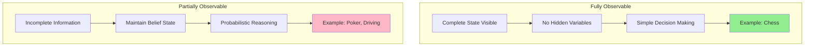
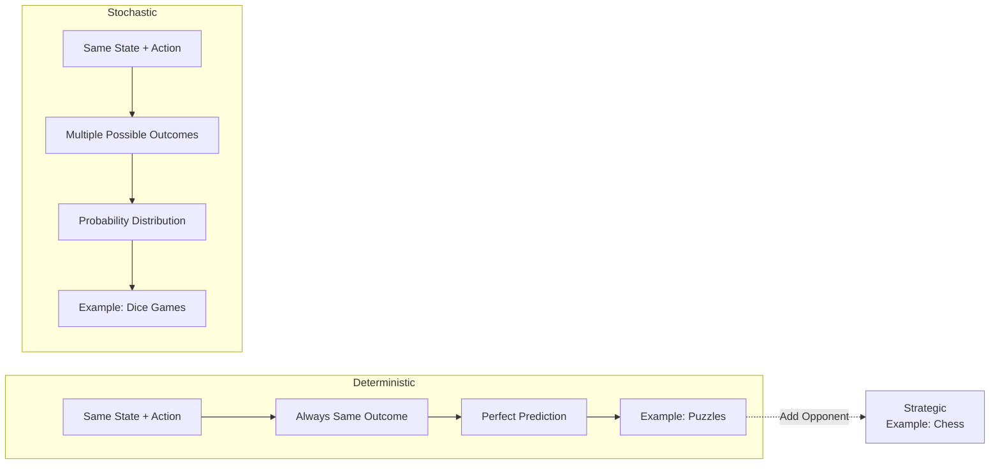
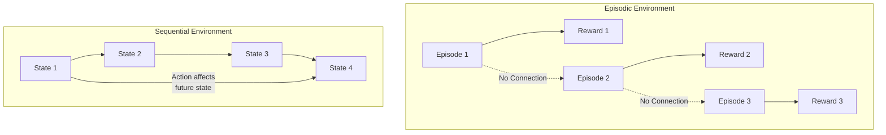
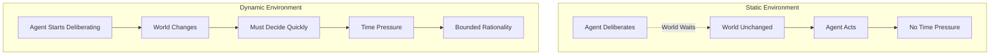
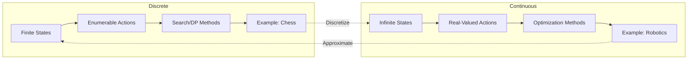
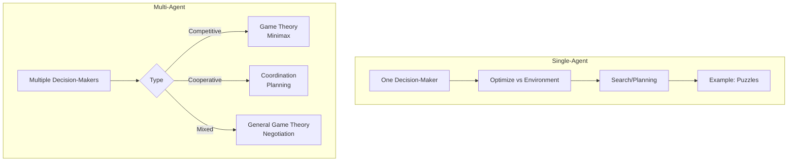
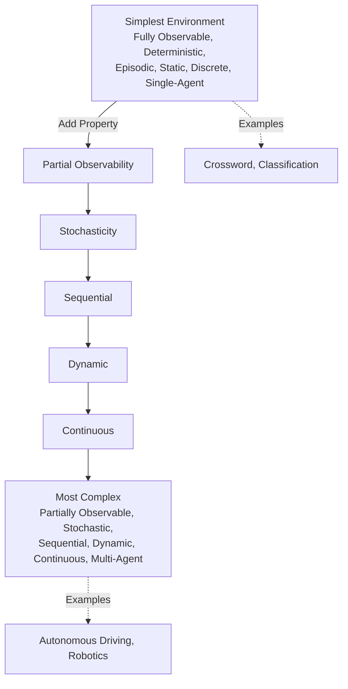

# Task Environments

## Introduction

The environment in which an intelligent agent operates fundamentally shapes the challenges it faces and the solutions that will be effective. Understanding task environments is crucial for agent design—the same agent architecture that works brilliantly in one environment might fail completely in another. The characteristics of the environment determine what sensing capabilities are needed, what reasoning approaches will work, what learning methods are appropriate, and how complex the agent must be.

Consider the vast difference between playing chess and driving a car. Chess has a fully observable board, deterministic rules, discrete states and actions, and a sequential structure where each move is taken in turn. Driving involves partial observability (you can't see through other cars or around corners), stochastic dynamics (other drivers behave unpredictably), continuous states and actions (position, velocity, steering angle), and real-time dynamics where the world doesn't wait for you to decide. These differences necessitate radically different agent architectures.

Classifying environments along key dimensions helps us understand what makes problems hard and what techniques will be effective. A fully observable, deterministic, episodic, static, discrete, single-agent environment is vastly simpler than a partially observable, stochastic, sequential, dynamic, continuous, multi-agent environment. Real-world applications typically fall somewhere in between, presenting a mix of challenges that require careful agent design.

This exploration of task environments provides the foundation for understanding why different AI techniques exist and when each is appropriate. Search algorithms work well in deterministic environments; probabilistic reasoning handles stochastic environments; reinforcement learning excels in sequential environments with delayed rewards; game theory addresses multi-agent competitive environments. The environment shapes the solution.

## Observable vs. Partially Observable

Observability concerns whether the agent's sensors provide complete information about the environment state at each time step. This property fundamentally affects the agent's ability to make decisions.

### Fully Observable Environments

In a fully observable environment, the agent's sensors provide access to the complete state of the environment. The agent knows everything relevant to choosing actions—there are no hidden variables, no uncertainty about the current state.

**Characteristics**:
- Agent perceives the complete environment state
- No hidden information
- No sensor noise or errors (or noise is part of the observable state)
- Agent doesn't need to maintain internal state about unobserved aspects

**Examples**:

**Chess**: The complete board position—locations of all pieces—is visible to both players. There's no hidden information (unlike poker where opponent cards are hidden). Each player knows exactly what state the game is in.

**Sudoku Puzzle**: The puzzle state is completely visible. You see all filled and unfilled cells. There's no hidden information to reason about.

**Perfect Information Games**: Games where all players see all information (like checkers, go, tic-tac-toe) are fully observable.

**Advantages for AI**:
- Simpler agent design—no need to track hidden state
- Can use reflexive decision rules based on current state
- No uncertainty about current situation
- Easier to plan and reason

**Real-World Rarity**: Most real-world environments are not fully observable. Full observability is often an idealization or simplification.

### Partially Observable Environments

In partially observable environments, the agent's sensors provide incomplete or noisy information. The agent doesn't know the complete environment state and must reason about hidden aspects.

**Causes of Partial Observability**:

1. **Noisy Sensors**: Sensors have errors, providing uncertain measurements
2. **Limited Range**: Sensors can't perceive distant objects
3. **Occlusion**: Objects block sensors (can't see through walls)
4. **Incomplete Sensor Coverage**: Sensors don't measure all relevant aspects
5. **Adversarial Hiding**: Other agents intentionally hide information

**Examples**:

**Poker**: You see your own cards and community cards, but not opponents' cards. Critical information is hidden, requiring probabilistic reasoning about what opponents might hold.

**Autonomous Driving**: Cameras can't see through other vehicles, around corners, or inside buildings. Sensors have limited range and accuracy. Weather can obscure vision. The intentions of other drivers are hidden.

**Robot Navigation with Noisy Sensors**: Distance measurements have errors. Landmarks might be misidentified. The robot is uncertain about its precise position.

**Medical Diagnosis**: Many internal body processes aren't directly observable. Doctors infer hidden states (diseases) from observable symptoms and test results.

**Challenges for AI**:
- Must maintain belief state—probability distribution over possible true states
- Requires probabilistic reasoning and uncertainty handling
- May need active sensing to gain information
- Planning is more complex—must consider information gathering
- Need for state estimation algorithms (filtering, localization)

### Belief States

In partially observable environments, the agent maintains a belief state—a representation of which states are possible and how likely each is.

**Representation**:

$$b(s) = P(s | e_{1:t})$$

where $b(s)$ is the probability that the true state is $s$, given all evidence (percepts) from time 1 to $t$.

**Example**: Robot localization
- Initially: Uniform belief (could be anywhere)
- After percept "see landmark A": Belief concentrates near landmark A
- After action "move forward 1m": Belief shifts forward but spreads (motion uncertainty)
- After percept "see landmark B": Belief updates based on Bayesian inference

**Algorithms for Belief State Update**:
- **Kalman Filter**: For linear-Gaussian systems
- **Particle Filter**: For nonlinear systems
- **Hidden Markov Model inference**: For discrete states
- **Bayesian filtering**: General framework

### Information Gathering

In partially observable environments, rational agents actively gather information when it's valuable for decision-making.

**Trade-offs**:
- **Cost**: Information gathering takes time, energy, or resources
- **Benefit**: Better information leads to better decisions
- **Optimality**: Gather information when expected benefit exceeds cost

**Examples**:
- Autonomous vehicle slowing down in fog (reduces speed to have more time to react given poor visibility)
- Robot rotating its camera to see occluded areas
- Medical doctor ordering additional tests to refine diagnosis
- Poker player betting to elicit information from opponents' reactions

**Value of Information**: Decision theory provides a framework for computing the value of information—how much an agent should be willing to pay (in time, money, risk) to acquire information before acting.

## Deterministic vs. Stochastic

Determinism concerns whether the next environment state is completely determined by the current state and the agent's action, or whether there's randomness in outcomes.

### Deterministic Environments

In deterministic environments, the next state is a function of the current state and action. The same action in the same state always produces the same outcome.

**Formally**:
$$s_{t+1} = f(s_t, a_t)$$

where $f$ is a deterministic transition function.

**Characteristics**:
- Predictable outcomes
- No randomness in environment dynamics
- Same action in same state → same result
- Agent can perfectly predict action consequences (if it knows the transition function)

**Examples**:

**Puzzle Solving**: In a sliding tile puzzle, moving a tile has a deterministic effect. The same move in the same configuration always produces the same result.

**Chess**: Chess rules are deterministic. Given a board position and a move, the resulting position is uniquely determined. (Though with imperfect play, the game outcome is uncertain from the player's perspective.)

**Theorem Proving**: Applying logical inference rules is deterministic. The same rule application always produces the same result.

**Advantages**:
- Simpler planning (can predict exact outcomes)
- No need for probabilistic reasoning
- Can use search algorithms that assume deterministic transitions
- Easier to verify correctness

### Stochastic Environments

In stochastic environments, the next state is uncertain—there's randomness in how the environment evolves. The same action in the same state might lead to different outcomes.

**Formally**:
$$P(s_{t+1} | s_t, a_t)$$

The transition is represented by a probability distribution over next states.

**Sources of Stochasticity**:

1. **Explicit Randomness**: Dice rolls, card shuffling, random events
2. **Complex Dynamics**: Weather, turbulence, quantum effects
3. **Other Agents**: Unpredictable human/AI behavior
4. **Sensor/Actuator Noise**: Imperfect perception and control
5. **Modeling Simplification**: Deterministic but too complex to model, so treated as random

**Examples**:

**Backgammon**: Dice introduce explicit randomness. The same move decision leads to different outcomes depending on dice rolls.

**Robot Grasping**: Attempting to grasp an object might succeed or fail due to object surface properties, gripper contact points, friction variations—difficult to predict precisely.

**Stock Trading**: Market dynamics are stochastic (or chaotic and unpredictable). The same trading action can have vastly different outcomes depending on myriad factors.

**Autonomous Driving**: Other drivers' behavior is unpredictable. Weather creates stochastic dynamics. Tire traction varies.

**Challenges**:
- Must reason about multiple possible outcomes
- Need probabilistic planning (maximize expected utility)
- Cannot guarantee specific outcomes
- Must handle risk and uncertainty
- Require more complex algorithms (Markov Decision Processes, etc.)

### Expected Utility and Risk

In stochastic environments, agents must consider all possible outcomes, weighted by their probabilities. This leads to expected utility maximization:

$$EU(a|s) = \sum_{s'} P(s'|s,a) \cdot U(s')$$

where $EU(a|s)$ is the expected utility of action $a$ in state $s$, and $U(s')$ is the utility of resulting state $s'$.

**Risk Attitudes**:
- **Risk-Neutral**: Cares only about expected value
- **Risk-Averse**: Prefers certain outcomes over uncertain ones with same expected value
- **Risk-Seeking**: Prefers uncertain outcomes with potential for high rewards

**Example**: Medical treatment decision
- Treatment A: 100% chance of 10-year life extension
- Treatment B: 50% chance of 20-year extension, 50% chance of 0 extension
- Expected value is the same (10 years), but risk-averse patients prefer A

### Deterministic vs. Strategic

An important distinction: An environment might be deterministic but still involve uncertainty from the agent's perspective if it includes other rational agents.

**Chess** is technically deterministic (rules are deterministic), but the opponent's move is uncertain from your perspective. This is sometimes called a **strategic** environment rather than stochastic. Game theory handles such environments.

The key difference:
- **Stochastic**: Uncertainty from randomness
- **Strategic**: Uncertainty from other agents' rational choices

Both require reasoning about multiple possible outcomes, but strategic environments also require reasoning about other agents' goals and rationality.

## Episodic vs. Sequential

The episodic/sequential distinction concerns whether the agent's experience divides into independent episodes or forms a continuous sequence where decisions affect future situations.

### Episodic Environments

In episodic environments, experience divides into atomic episodes. Each episode consists of perceiving and acting, and episodes are independent—the agent's action in one episode doesn't affect future episodes.

**Characteristics**:
- Independent decision episodes
- No long-term consequences
- Current action doesn't affect future situations
- Each episode starts fresh
- Agent doesn't need to plan ahead

**Examples**:

**Image Classification**: Each image is classified independently. Classifying one image doesn't affect how you classify future images. No temporal dependencies between classification tasks.

**Defect Detection**: Inspecting products on an assembly line—each inspection is independent. Finding a defect on one item doesn't change the inspection of the next item.

**Spam Filtering** (non-learning version): Each email is judged independently. Decisions about one email don't affect future emails.

**Advantages**:
- Simpler decision-making (no need to consider future)
- Each episode can be solved independently
- No need for planning or lookahead
- Easier learning (immediate feedback, no credit assignment problem)

**Agent Design**: Simple reflex agents often suffice. The agent just needs to map current percept to best action for this episode.

### Sequential Environments

In sequential environments, current decisions affect future situations. The agent must consider long-term consequences, not just immediate effects. Episodes are connected through state or rewards.

**Characteristics**:
- Decisions have long-term consequences
- Current state depends on previous actions
- Agent must plan ahead
- Trade-offs between immediate and future rewards
- Need for foresight and strategy

**Examples**:

**Chess**: Early game moves affect mid-game and end-game positions. Sacrificing a piece now might lead to checkmate later. Must plan multiple moves ahead.

**Investment**: Current investment decisions affect future wealth. Must balance current consumption vs. saving for future returns.

**Robot Navigation**: Current position depends on previous movements. Must plan path from start to goal, considering how each movement affects position.

**Taxi Driving**: Choosing routes affects arrival time. Refueling decisions affect range. Accepting passenger requests affects future location and availability.

**Challenges**:
- **Credit Assignment**: Which past actions led to current reward/outcome?
- **Delayed Rewards**: Optimal actions might have poor immediate results but good long-term outcomes
- **Exploration vs. Exploitation**: Balance gathering information vs. using current knowledge
- **Planning Horizon**: How far ahead to look?

### Temporal Credit Assignment

In sequential environments, a key challenge is determining which actions were responsible for outcomes that occur much later.

**Example**: Chess game
- You win the game at move 50
- Which earlier moves (move 1? move 20? move 45?) were most crucial to victory?
- How do you learn from this experience to improve?

**Approaches**:
- **Immediate Feedback**: When available, simplifies learning
- **Eligibility Traces**: Track recently used states/actions as candidates for credit
- **Temporal Difference Learning**: Learn from successive state values
- **Monte Carlo Methods**: Wait until episode end, then assign credit backward

### Planning Horizon

How far ahead should a sequential agent plan?

**Finite Horizon**: Plan $n$ steps ahead
- **Advantage**: Computationally tractable
- **Disadvantage**: Might miss long-term consequences

**Infinite Horizon**: Consider all future consequences
- **Advantage**: Finds truly optimal long-term strategy
- **Disadvantage**: Often computationally intractable
- **Solution**: Use discounting to make distant future less important

**Discounting**: Future rewards are worth less than immediate rewards
$$V = r_t + \gamma r_{t+1} + \gamma^2 r_{t+2} + \ldots = \sum_{k=0}^{\infty} \gamma^k r_{t+k}$$

where $\gamma \in [0,1)$ is the discount factor.

### Markov Property

Many sequential decision problems are modeled as **Markov Decision Processes (MDPs)**, which assume the Markov property: the future depends only on the current state, not on how we got there.

**Markov Property**:
$$P(s_{t+1}|s_t, a_t, s_{t-1}, a_{t-1}, \ldots, s_0, a_0) = P(s_{t+1}|s_t, a_t)$$

The history doesn't matter; only the current state affects future outcomes.

This simplifies sequential decision-making enormously. If the Markov property holds, we don't need to track the entire history—current state is sufficient.

**When it holds**: Chess (current board position is sufficient), many games, many control problems

**When it doesn't**: Poker (need to remember opponent betting patterns), some real-world problems where history provides information about hidden variables

## Static vs. Dynamic

The static/dynamic distinction concerns whether the environment changes while the agent is deliberating.

### Static Environments

In static environments, the environment doesn't change while the agent is thinking. The agent can take as much time as needed to decide what to do without worrying about the world changing.

**Characteristics**:
- Environment waits for agent
- No time pressure
- Can deliberate carefully
- World state unchanging during decision-making

**Examples**:

**Crossword Puzzles**: The puzzle doesn't change while you think. You can ponder clues for as long as needed.

**Offline Planning**: Planning a trip route, designing a building, etc.—the problem doesn't change while you work on it.

**Chess** (with unlimited time): If there's no clock, you can think as long as you want. The board doesn't change while you deliberate.

**Advantages**:
- Can use computationally expensive algorithms
- Can gather and process information carefully
- No need for time-critical decision-making
- Can verify decisions before acting

### Dynamic Environments

In dynamic environments, the environment changes while the agent is deliberating. The agent must make decisions under time pressure—the world won't wait.

**Characteristics**:
- Environment changes during deliberation
- Time pressure
- Must make decisions quickly
- World state might change before action completes

**Examples**:

**Autonomous Driving**: Other vehicles move, pedestrians walk, traffic lights change—all while the car's AI is deciding what to do. Decisions must be made in real-time.

**Real-Time Strategy Games**: Opponents are acting while you plan. The game state changes continuously.

**Stock Trading**: Prices fluctuate constantly. An outdated decision might be invalid by the time it executes.

**Robot Soccer**: The ball, teammates, and opponents are all moving continuously.

**Challenges**:
- Must limit deliberation time
- May need to interrupt planning to act
- Need anytime algorithms (can return answer at any time, improving with more time)
- Must handle world changes during execution
- Reactive behavior might be necessary

### Semidynamic Environments

**Semidynamic**: The environment doesn't change, but the agent's performance score does based on time taken.

**Example**: Chess with a clock. The board doesn't change while you think, but your clock runs down. Taking too long means losing on time.

Semidynamic environments share some challenges with dynamic ones (time pressure, limited deliberation) but are simpler because the world state is stable during decision-making.

### Real-Time Decision Making

In dynamic environments, agents often use **bounded rationality**—making the best decision possible within time constraints, rather than computing the optimal decision.

**Approaches**:

**Anytime Algorithms**: Algorithms that can return an answer at any time, improving quality with more computation time.
- Start with quick, rough answer
- Refine if time allows
- Interrupt when time runs out

**Reactive Behaviors**: Pre-compiled fast responses to common situations
- Simple reflex actions for urgent cases
- More deliberate planning for non-urgent decisions

**Concurrent Planning and Execution**: Plan and act simultaneously
- Execute current plan
- Revise plan in background
- Switch to revised plan when ready

**Example**: Robot navigation
- **Reactive Layer**: Immediate obstacle avoidance
- **Deliberative Layer**: Path planning to goal
- Reactive layer prevents collisions while deliberative layer figures out best route

## Discrete vs. Continuous

The discrete/continuous distinction applies to states, time, percepts, and actions. It affects how we represent and reason about the environment.

### Discrete Environments

Discrete environments have a finite (or countably infinite) number of distinct states, percepts, and actions. Time might also be discrete (turn-based).

**Characteristics**:
- Finite state space (or countably infinite)
- Discrete actions
- Often discrete time steps
- Can enumerate possibilities

**Examples**:

**Chess**: Finite number of board positions (though astronomically large), finite set of legal moves, turns alternate (discrete time).

**Grid World**: Robot moves on a grid—discrete positions (cells), discrete actions (up/down/left/right), discrete time steps.

**Simple Games**: Tic-tac-toe, checkers, many puzzles—all have discrete states and actions.

**Advantages**:
- Can enumerate states and actions
- Dynamic programming applicable
- Easier to represent in computers
- Many algorithmic tools available (search, planning, etc.)

**Representation**: States can be represented as discrete symbols, integers, or combinations thereof.

### Continuous Environments

Continuous environments have continuous state spaces, actions, or time. Positions, velocities, forces, temperatures, etc., are real-valued.

**Characteristics**:
- Infinite state space (continuous values)
- Continuous actions
- Often continuous time
- Cannot enumerate all possibilities

**Examples**:

**Autonomous Driving**: Position is continuous (not confined to discrete locations), velocity is continuous, steering angle is continuous, time is continuous (real-time).

**Robotic Manipulation**: Joint angles are continuous, object positions are continuous, forces are continuous.

**Process Control**: Chemical plants, power grids—temperatures, pressures, flow rates all continuous.

**Challenges**:
- Cannot enumerate states or actions
- Must use function approximation
- Infinite space makes many algorithms intractable
- Optimization-based rather than search-based methods
- Discretization introduces approximation errors

### Discretization

Continuous problems are often discretized for computational tractability:

**State Discretization**: Divide continuous state space into bins or cells
- Example: Discretize position into grid cells
- **Tradeoff**: Coarse discretization is tractable but inaccurate; fine discretization is accurate but intractable

**Action Discretization**: Select a finite set of actions from continuous space
- Example: Steering angles {-30°, -15°, 0°, 15°, 30°} instead of continuous range
- **Tradeoff**: Fewer actions are easier to optimize but might miss optimal actions

**Time Discretization**: Time steps instead of continuous time
- Example: Control systems updated at fixed intervals (10Hz, 100Hz, etc.)
- **Tradeoff**: Faster updates are more responsive but more computationally expensive

### Hybrid Discrete-Continuous

Many real systems have both discrete and continuous aspects:

**Example**: Self-driving car
- **Discrete**: Traffic light states (red/yellow/green), lane choices, whether to turn
- **Continuous**: Position, velocity, steering angle, acceleration

Hybrid systems require techniques that handle both discrete and continuous variables.

## Single-Agent vs. Multi-Agent

The single/multi-agent distinction concerns whether multiple decision-making agents operate in the environment, potentially interacting.

### Single-Agent Environments

Only one agent makes decisions in the environment. Other entities might exist, but they don't make strategic decisions.

**Characteristics**:
- One decision-maker
- No strategic interaction
- Other entities might be dynamic but not strategic
- Agent optimizes against environment, not against other agents

**Examples**:

**Puzzle Solving**: Crossword, Sudoku, sliding tiles—no other agents

**Single-Player Games**: Solitaire, some video games

**Robot Vacuuming** (alone in a house): No other agents making decisions

**Route Planning**: Finding a route on a map (if we don't model other drivers as strategic agents)

**Techniques**: Standard search, planning, reinforcement learning

### Multi-Agent Environments

Multiple agents make decisions, potentially affecting each other. Agents might cooperate, compete, or a mix of both.

**Characteristics**:
- Multiple decision-makers
- Strategic interaction
- Agents must model other agents
- Outcomes depend on all agents' actions

**Types**:

**1. Competitive (Zero-Sum)**:
- Agents have directly opposing goals
- One agent's gain is another's loss
- **Examples**: Chess, poker, sports games
- **Techniques**: Game theory, minimax, Nash equilibrium

**2. Cooperative**:
- Agents share goals
- Benefit from coordination
- **Examples**: Team robotics, multi-agent planning, cooperative games
- **Techniques**: Multi-agent planning, coordination mechanisms, team strategies

**3. Mixed (General-Sum)**:
- Agents have partially aligned, partially conflicting goals
- Can benefit from cooperation but also compete
- **Examples**: Economic markets, negotiations, some multi-player games
- **Techniques**: General game theory, mechanism design, negotiation protocols

### Strategic Reasoning

In multi-agent environments, agents must reason about other agents:

**Opponent Modeling**: What are the other agent's goals, beliefs, and likely actions?

**Best Response**: Given what I believe the other agent will do, what's my best action?

**Nash Equilibrium**: A stable state where no agent can improve by unilaterally changing strategy

**Example**: Poker
- Must reason about opponent's hand (hidden information)
- Model opponent's betting strategy
- Choose actions that exploit opponent's weaknesses
- Balance bluffing and honest play

### Communication

Communication can transform multi-agent environments:

**Without Communication**:
- Agents act independently
- Must infer others' intentions from observations
- Coordination is difficult

**With Communication**:
- Can share information
- Can negotiate and make agreements
- Can coordinate actions explicitly
- Can ask questions to resolve uncertainty

**Examples**:
- **Robot teams**: Communicate positions, targets, and plans
- **Autonomous vehicles**: Communicate intentions at intersections
- **Multi-player games**: Team chatter to coordinate strategy

**Challenges**:
- What to communicate?
- When to communicate?
- Can communication be trusted? (Deception possible in competitive settings)
- Communication bandwidth limits

### Emergence and Collective Behavior

In multi-agent systems, complex collective behaviors can emerge from simple individual rules:

**Flocking**: Birds/fish exhibit coordinated group motion from simple rules (stay close to neighbors, match velocity, avoid collisions)

**Traffic Patterns**: Emergent phenomena like traffic jams arise from individual driver behaviors

**Markets**: Prices emerge from many individual buying/selling decisions

These emergent behaviors can be difficult to predict and control, presenting challenges for multi-agent system design.

## Environment Complexity Spectrum

Different combinations of environment properties create vastly different complexity levels:

### Simplest: Fully Observable, Deterministic, Episodic, Static, Discrete, Single-Agent

**Example**: Crossword puzzle, simple classification task

**Why simple**:
- Complete information (fully observable)
- Predictable (deterministic)
- No long-term consequences (episodic)
- No time pressure (static)
- Finite possibilities (discrete)
- No strategic interaction (single-agent)

**Appropriate techniques**: Simple search, rule-based systems, simple reflex agents

### Most Complex: Partially Observable, Stochastic, Sequential, Dynamic, Continuous, Multi-Agent

**Example**: Autonomous driving, competitive robotics, real-time strategy games

**Why complex**:
- Incomplete information (partially observable) → must maintain beliefs
- Unpredictable (stochastic) → must handle uncertainty
- Long-term consequences (sequential) → must plan ahead
- Time pressure (dynamic) → must decide quickly
- Infinite possibilities (continuous) → cannot enumerate
- Strategic interaction (multi-agent) → must model others

**Required techniques**: Probabilistic reasoning, real-time decision-making, game theory, machine learning, sensor fusion, continuous control

### Real-World Applications

Most real applications fall between these extremes:

**Medical Diagnosis**:
- Partially observable (hidden internal state)
- Stochastic (uncertain disease progression)
- Sequential (treatment affects future health)
- Static (patient doesn't change during diagnosis deliberation)
- Mixed discrete-continuous (discrete diseases, continuous biomarkers)
- Single-agent (doctor is primary decision-maker)

**Online Shopping Recommendation**:
- Fully observable (user browsing data available)
- Stochastic (user preferences uncertain)
- Sequential (recommendations affect future engagement)
- Static (user doesn't change during recommendation computation)
- Discrete (finite set of products)
- Multi-agent (competing with other sellers' recommendations)

## Implications for Agent Design

Environment properties directly determine appropriate agent architectures and algorithms:

### Observability → State Maintenance
- **Fully Observable**: Simple state representation
- **Partially Observable**: Belief state, probabilistic reasoning, filtering

### Determinism → Planning Approach
- **Deterministic**: Search, classical planning
- **Stochastic**: Probabilistic planning, MDPs, expected utility

### Episodes → Temporal Reasoning
- **Episodic**: Simple action selection, no planning
- **Sequential**: Planning, reinforcement learning, credit assignment

### Dynamics → Computation Time
- **Static**: Deliberative, optimal algorithms
- **Dynamic**: Anytime algorithms, reactive behaviors, real-time constraints

### Discreteness → Representation
- **Discrete**: Symbolic, enumeration, search
- **Continuous**: Numerical, optimization, function approximation

### Number of Agents → Strategic Reasoning
- **Single**: Optimization, search, planning
- **Multi**: Game theory, opponent modeling, coordination

The art of AI engineering involves understanding these properties for your specific application and selecting appropriate techniques accordingly.

## Conclusion

Task environment properties fundamentally shape the challenges faced by intelligent agents and the solutions that will be effective. An environment that is fully observable, deterministic, episodic, static, discrete, and single-agent presents radically different challenges than one that is partially observable, stochastic, sequential, dynamic, continuous, and multi-agent.

Understanding these dimensions provides a framework for analyzing problems and selecting appropriate techniques:
- Observability determines whether belief states are needed
- Determinism affects whether probabilistic reasoning is required
- The episodic/sequential distinction determines whether planning ahead is necessary
- Dynamics influence whether real-time decision-making is required
- Discreteness affects representation and algorithmic approaches
- The number of agents determines whether game theory and strategic reasoning are needed

Real-world applications typically combine multiple challenges. Autonomous driving is partially observable (can't see through vehicles), stochastic (other drivers are unpredictable), sequential (current position affects future options), dynamic (must act in real-time), continuous (position and velocity are continuous), and multi-agent (other vehicles are decision-makers). This combination necessitates sophisticated AI techniques: sensor fusion for perception, probabilistic reasoning for uncertainty, real-time planning for sequential decision-making, and predictive models for other agents' behavior.

By carefully analyzing the task environment along these dimensions, we can make informed choices about agent architecture, select appropriate algorithms, and understand the fundamental limits of what's achievable. The environment shapes the solution—understanding the environment is the first step toward building effective intelligent agents.
